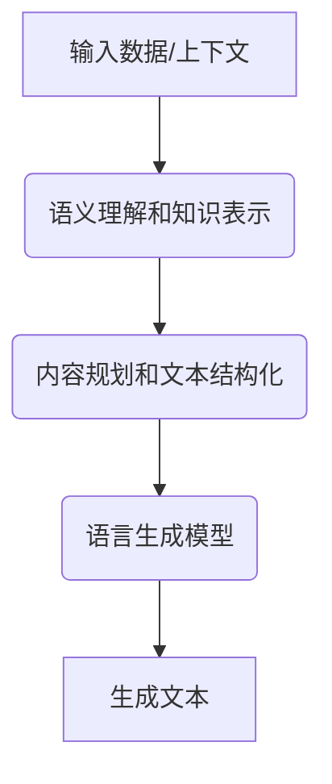

# 自然语言生成:从文本到多模态,AI创作的新维度

## 1.背景介绍

### 1.1 自然语言处理的发展历程

自然语言处理(Natural Language Processing, NLP)是人工智能领域的一个重要分支,旨在使计算机能够理解和生成人类语言。NLP技术的发展经历了几个主要阶段:

#### 1.1.1 基于规则的方法

早期的NLP系统主要采用基于规则的方法,依赖于语言学家手工编写的一系列规则和知识库。这种方法需要大量的人工努力,且缺乏灵活性和可扩展性。

#### 1.1.2 统计机器学习方法

20世纪90年代,统计机器学习方法在NLP领域得到广泛应用,例如隐马尔可夫模型(HMM)、最大熵模型等。这些方法利用大量标注语料库训练模型参数,性能有了显著提升,但仍然受到特征工程的限制。

#### 1.1.3 深度学习方法

近年来,benefitting from大数据和强大的计算能力,深度学习方法在NLP领域取得了革命性的进展。如今,基于Transformer的预训练语言模型(PLM)已成为NLP主流技术,在多项任务上展现出卓越的性能。

### 1.2 自然语言生成(NLG)的重要性

自然语言生成(Natural Language Generation, NLG)是NLP的一个重要分支,旨在自动生成可读、流畅的自然语言文本。NLG技术在多个领域都有广泛的应用前景:

- 对话系统和虚拟助手
- 自动文本摘要和报告生成 
- 自动创作(如新闻、故事、诗歌等)
- 数据到文本的转换
- 辅助残障人士进行交流

随着人工智能技术的快速发展,NLG已经成为一个极具吸引力的研究热点。

## 2.核心概念与联系

### 2.1 自然语言生成的核心挑战

自然语言生成面临以下主要挑战:

1. **语义理解和知识表示**:准确理解输入数据或上下文语义,并将其转化为内部知识表示。
2. **内容规划和文本结构化**:合理安排文本的内容结构和信息流。
3. **语言生成**:基于语义表示,生成连贯、通顺且符合语法的自然语言文本。
4. **一致性和信息完整性**:确保生成文本的一致性,包含所需的全部信息。
5. **多模态融合**:有效融合文本、图像、视频等多模态信息进行生成。

### 2.2 核心技术路线

现代NLG系统通常采用基于数据驱动的端到端方法,主要包括以下核心技术路线:

1. **基于模板的生成**:使用预定义的模板和规则,根据输入数据填充模板生成文本。这种方法简单直观,但缺乏灵活性和多样性。

2. **基于统计机器翻译的生成**:将NLG任务看作是将结构化数据"翻译"为自然语言的过程,借鉴统计机器翻译技术。这种方法可生成多样化的文本,但可控性较差。

3. **基于神经网络的生成**:利用序列到序列(Seq2Seq)模型、Transformer等神经网络架构,直接从输入数据生成目标文本。这是当前主流方法,具有更好的性能和可扩展性。

4. **基于大型语言模型的生成**:利用GPT、BERT等大型预训练语言模型(PLM),通过微调或提示学习等方式进行自然语言生成。这种方法具有出色的泛化能力和多样性,是未来的发展趋势。



## 3.核心算法原理具体操作步骤

### 3.1 基于神经网络的自然语言生成

基于神经网络的自然语言生成通常采用编码器-解码器(Encoder-Decoder)架构,将输入数据编码为语义表示,再由解码器从该表示生成目标文本。常见的神经网络模型包括:

1. **Seq2Seq + Attention**:将输入序列编码为向量,解码器在生成每个词时会参考编码器输出和之前生成的词。Attention机制可以更好地捕获长距离依赖关系。

2. **Transformer**:完全基于Attention机制的Seq2Seq模型,避免了RNN的局限性,可以高效地并行计算。Transformer被广泛应用于各种NLG任务。

3. **指针网络(Pointer Network)**:在解码时,允许直接复制输入序列中的词作为输出,适用于包含许多低频词或实体的生成任务。

4. **条件生成模型**:在生成过程中融入额外的条件信息,如主题、属性、知识库等,以控制生成内容。

5. **层次生成模型**:首先生成文本的大致轮廓,然后逐步生成详细内容,有利于生成长文本。

6. **多任务学习**:同时学习多个相关任务(如摘要、问答等),以提高模型的泛化能力。

7. **强化学习**:将文本生成视为序列决策过程,使用策略梯度等强化学习算法优化生成质量。

8. **生成对抗网络(GAN)**:使用生成模型生成文本,判别模型判断真伪,两者相互对抗以提高生成质量。

### 3.2 基于大型语言模型的自然语言生成

近年来,基于大型预训练语言模型(PLM)的自然语言生成方法取得了突破性进展,主要包括:

1. **GPT(Generative Pre-trained Transformer)**:使用Transformer解码器进行大规模无监督预训练,可直接生成连贯的文本。GPT-3具有惊人的文本生成能力。

2. **BART(Bidirectional and Auto-Regressive Transformers)**:结合编码器和解码器的双向预训练,在多种文本生成任务上表现出色。

3. **T5(Text-to-Text Transfer Transformer)**:将所有NLP任务统一转化为文本到文本的格式,实现了任务之间的迁移学习。

4. **PALM(Prompt-based Autoregressive Language Modeling)**:通过设计合理的提示(Prompt),可以指导大型语言模型生成满足特定需求的文本。

5. **ERNIE-GEN**:百度自研的基于知识增强的生成预训练模型,融合了来自结构化知识库的丰富知识,生成质量更高。

这些大型语言模型通过在海量无标注文本上预训练,获得了强大的语言理解和生成能力。通过针对性的微调或提示学习,可以快速转移到各种NLG任务。

## 4.数学模型和公式详细讲解举例说明

### 4.1 Transformer模型

Transformer是目前NLG领域最广泛使用的神经网络模型,其核心是基于Attention机制的编码器-解码器架构。对于一个长度为 $n$ 的输入序列 $X = (x_1, x_2, ..., x_n)$,Transformer的编码器将其映射为一系列向量表示 $\mathbf{H} = (\mathbf{h}_1, \mathbf{h}_2, ..., \mathbf{h}_n)$:

$$\mathbf{H} = \text{Encoder}(X)$$

解码器则根据编码器输出 $\mathbf{H}$ 和前一时刻的输出 $y_{t-1}$,生成当前时刻的输出 $y_t$:

$$y_t = \text{Decoder}(\mathbf{H}, y_{t-1})$$

Attention机制在编码器和解码器内部均有应用,用于计算序列中每个位置与其他位置的关联权重,从而捕获长距离依赖关系。对于查询向量 $\mathbf{q}$、键向量 $\mathbf{K}$ 和值向量 $\mathbf{V}$,Scaled Dot-Product Attention的计算公式为:

$$\text{Attention}(\mathbf{Q}, \mathbf{K}, \mathbf{V}) = \text{softmax}\left(\frac{\mathbf{Q}\mathbf{K}^\top}{\sqrt{d_k}}\right)\mathbf{V}$$

其中 $d_k$ 为缩放因子,用于防止点积的方差过大导致梯度下降不稳定。Multi-Head Attention则是将多个Attention头的结果拼接:

$$\begin{aligned}
\text{MultiHead}(\mathbf{Q}, \mathbf{K}, \mathbf{V}) &= \text{Concat}(\text{head}_1, ..., \text{head}_h)\mathbf{W^O} \
\text{where } \text{head}_i &= \text{Attention}(\mathbf{Q}\mathbf{W}_i^Q, \mathbf{K}\mathbf{W}_i^K, \mathbf{V}\mathbf{W}_i^V)
\end{aligned}$$

通过堆叠多个编码器/解码器层,以及残差连接和层归一化等技术,Transformer可以高效地建模长序列,成为NLG的核心模型。

### 4.2 生成式对抗网络(GAN)

生成式对抗网络(Generative Adversarial Networks, GAN)是一种用于生成式建模的框架,由生成器(Generator)和判别器(Discriminator)两个对抗模型组成。在NLG领域,GAN被用于提高生成文本的质量和多样性。

生成器 $G$ 的目标是从噪声分布 $p_z(z)$ 生成逼真的文本序列 $\hat{y}$,使其难以被判别器 $D$ 识别为伪造的样本:

$$G^* = \arg\min_G \max_D V(D,G) = \mathbb{E}_{y\sim p_\text{data}}[\log D(y)] + \mathbb{E}_{z\sim p_z}[\log(1-D(G(z)))]$$

判别器 $D$ 则试图区分生成器生成的样本和真实数据样本,目标是最大化上式中的值函数 $V(D,G)$。生成器和判别器相互对抗、共同训练,直至达到纳什均衡。

在实践中,GAN往往很难训练到收敛,存在模式崩溃、梯度消失等问题。研究者提出了各种改进方法,如WGAN使用Wasserstein距离替代JS散度、REINFORCE使用策略梯度训练生成器等。GAN可以生成更加多样和逼真的文本,但控制能力较差。

## 5.项目实践:代码实例和详细解释说明

以下是一个使用Hugging Face的Transformers库,基于GPT-2模型进行自然语言生成的Python代码示例:

```python
from transformers import GPT2LMHeadModel, GPT2Tokenizer

# 加载预训练模型和分词器
model = GPT2LMHeadModel.from_pretrained('gpt2')
tokenizer = GPT2Tokenizer.from_pretrained('gpt2')

# 输入文本
input_text = "In this blog post, we will discuss"
input_ids = tokenizer.encode(input_text, return_tensors='pt')

# 生成文本
output_ids = model.generate(input_ids, max_length=200, num_return_sequences=1, do_sample=True, top_k=50, top_p=0.95)
output_text = tokenizer.decode(output_ids[0], skip_special_tokens=True)

print(output_text)
```

代码解释:

1. 首先导入GPT2LMHeadModel和GPT2Tokenizer,用于加载预训练的GPT-2模型和分词器。

2. 设置输入文本`input_text`,使用分词器将其转换为输入ids张量`input_ids`。

3. 调用`model.generate()`方法进行文本生成,主要参数包括:
   - `input_ids`: 输入序列的id张量
   - `max_length`: 生成序列的最大长度
   - `num_return_sequences`: 生成序列的数量
   - `do_sample`: 是否通过采样生成(True为采样,False为贪婪搜索)
   - `top_k`: 只从概率最高的top_k个词中采样
   - `top_p`: 只从累积概率最高的top_p的词中采样

4. 使用分词器将生成的id序列`output_ids`解码为文本`output_text`。

5. 输出生成的文本。

该示例使用了GPT-2预训练模型进行无条件文本生成,生成质量较高。在实际应用中,通常需要对模型进行微调或设计合理的提示,以指导生成满足特定需求的文本。

## 6.实际应用场景

自然语言生成技术在