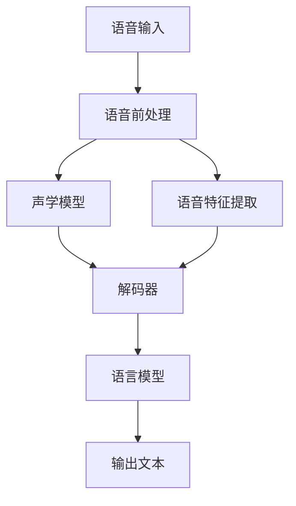

# 语音识别(Speech Recognition) - 原理与代码实例讲解

## 1.背景介绍

### 1.1 什么是语音识别

语音识别(Speech Recognition)是一种将人类语音转换为相应文本或命令的技术,广泛应用于虚拟助手、语音控制系统、会议记录等场景。随着深度学习的发展,语音识别的准确率不断提高,已经能够满足大多数应用场景的需求。

### 1.2 语音识别的重要性

语音是人类最自然的交互方式,语音识别技术使人机交互变得更加自然、高效。它可以极大地提高工作效率,如语音输入、语音控制等,也为残障人士提供了更好的交互体验。此外,语音识别还可应用于会议记录、自动字幕等领域,促进信息的高效传播。

### 1.3 语音识别的挑战

尽管语音识别技术日趋成熟,但仍面临诸多挑战:

- 环境噪音:噪音会严重影响语音识别的准确性
- 口音多样性:不同地区、年龄、性别的口音差异给识别带来困难
- 语音不连续:语音中的停顿、重音等特征增加了识别复杂度

## 2.核心概念与联系

### 2.1 语音识别系统框架

语音识别系统通常由以下几个主要模块组成:



1. **语音输入**:获取语音信号的模块
2. **语音前处理**:降噪、分帧等预处理
3. **声学模型**:对语音信号的声学特征进行建模
4. **语音特征提取**:提取语音的特征参数,如MFCC等
5. **解码器**:基于声学模型和语音特征,搜索出最可能的语音转录结果
6. **语言模型**:估计词序列的概率,改善识别结果
7. **输出文本**:输出最终的语音转录文本

### 2.2 声学模型

声学模型是语音识别系统的核心部分,用于对语音信号的声学特征进行建模。常用的声学模型有:

- **高斯混合模型(GMM)**:将声学特征用高斯混合模型表示
- **深度神经网络(DNN)**:使用前馈神经网络对声学特征建模
- **循环神经网络(RNN)**:利用RNN捕捉语音的时序特征
- **卷积神经网络(CNN)**:提取语音信号的局部特征

### 2.3 语言模型

语言模型的作用是估计词序列的概率,从而提高语音识别的准确性。常用的语言模型有:

- **N-gram模型**:基于N个词的历史计算当前词的概率
- **神经语言模型**:使用神经网络对词序列建模,捕捉更长距离的上下文信息

## 3.核心算法原理具体操作步骤

### 3.1 声学模型训练

声学模型的训练过程如下:

1. **准备训练数据**:收集大量人工标注过的语音数据
2. **特征提取**:对语音数据提取特征参数,如MFCC等
3. **模型训练**:使用深度学习模型(如DNN、RNN等)对特征数据进行训练,得到声学模型

### 3.2 语言模型训练

语言模型的训练过程如下:

1. **准备训练数据**:收集大量文本语料
2. **数据预处理**:对文本进行分词、去除停用词等预处理
3. **模型训练**:使用N-gram模型或神经网络模型对语料进行训练,得到语言模型

### 3.3 解码

解码是将声学模型和语言模型结合,搜索出最可能的语音转录结果的过程。常用的解码算法有:

1. **词束搜索(Word Beam Search)**:基于词前向概率和语言模型概率进行搜索
2. **前缀树搜索(Prefix Tree Search)**:使用前缀树加速搜索过程
3. **扫码器搜索(Token Passing)**:基于加权有限状态转移网络进行搜索

解码算法的目标是找到使得 $P(W|O) = \frac{P(O|W)P(W)}{P(O)}$ 最大的词序列W,其中O是观测到的语音特征序列,P(O|W)是声学模型概率,P(W)是语言模型概率。

## 4.数学模型和公式详细讲解举例说明

### 4.1 声学模型

声学模型的目标是估计语音特征序列O对应的词序列W的条件概率P(O|W)。常用的声学模型有高斯混合模型(GMM)和深度神经网络模型(DNN)。

#### 4.1.1 高斯混合模型(GMM)

高斯混合模型将每个音素的语音特征用一个高斯混合模型表示,概率密度函数为:

$$
P(O|W) = \sum_{m=1}^M c_m \mathcal{N}(O;\mu_m,\Sigma_m)
$$

其中M是高斯混合成分的数量,$c_m$是第m个混合成分的系数,$\mathcal{N}(O;\mu_m,\Sigma_m)$是以$\mu_m$为均值,$\Sigma_m$为协方差矩阵的高斯分布。

#### 4.1.2 深度神经网络(DNN)

深度神经网络模型将语音特征O输入到一个前馈神经网络中,网络的输出层对应词序列W的后验概率P(W|O)。对于给定的输入O,我们可以通过前向传播计算出P(W|O),然后使用贝叶斯公式得到P(O|W):

$$
P(O|W) = \frac{P(W|O)P(O)}{P(W)}
$$

其中P(W)是语言模型给出的先验概率。

### 4.2 语言模型

语言模型的目标是估计词序列W的概率P(W)。常用的语言模型有N-gram模型和神经语言模型。

#### 4.2.1 N-gram模型

N-gram模型根据前N-1个词来预测当前词的概率,即:

$$
P(W) = \prod_{i=1}^{|W|}P(w_i|w_{i-N+1},...,w_{i-1})
$$

其中$|W|$是词序列的长度。N=3时即为三元语法模型(Trigram)。

#### 4.2.2 神经语言模型

神经语言模型使用神经网络对词序列W的概率P(W)进行建模。常用的网络结构有前馈神经网络、循环神经网络(RNN)和transformer等。以RNN为例,对于长度为T的词序列$W=(w_1,w_2,...,w_T)$,我们有:

$$
h_t = \text{RNN}(w_t, h_{t-1}) \
P(w_t|w_1,...,w_{t-1}) = \text{softmax}(W_oh_t + b_o)
$$

其中$h_t$是RNN在时刻t的隐状态,$W_o$和$b_o$是输出层的权重和偏置。最终的词序列概率为:

$$
P(W) = \prod_{t=1}^T P(w_t|w_1,...,w_{t-1})
$$

## 5.项目实践:代码实例和详细解释说明

以下是一个使用Python和Pytorch实现的简单语音识别系统示例:

### 5.1 准备数据

```python
import torchaudio

# 加载语音数据
waveform, sample_rate = torchaudio.load("speech.wav")

# 加载转录文本
with open("transcript.txt", "r") as f:
    transcript = f.read()
```

### 5.2 特征提取

```python
import torchaudio.transforms as T

# 创建MFCC特征提取器
mfcc_transform = T.MFCC(sample_rate=sample_rate)

# 提取MFCC特征
mfcc = mfcc_transform(waveform)
```

### 5.3 声学模型

```python
import torch.nn as nn

# 定义DNN声学模型
class AcousticModel(nn.Module):
    def __init__(self, input_size, hidden_size, num_classes):
        super().__init__()
        self.fc1 = nn.Linear(input_size, hidden_size)
        self.fc2 = nn.Linear(hidden_size, num_classes)
        
    def forward(self, x):
        x = self.fc1(x)
        x = nn.functional.relu(x)
        x = self.fc2(x)
        return nn.functional.log_softmax(x, dim=-1)

# 创建模型实例
input_size = mfcc.shape[-1]
hidden_size = 256
num_classes = len(transcript) + 1  # 加上空白标签
model = AcousticModel(input_size, hidden_size, num_classes)
```

### 5.4 语言模型

```python
import torch.nn.functional as F

# 定义N-gram语言模型
class LanguageModel:
    def __init__(self, ngram, tokens):
        self.ngram = ngram
        self.tokens = tokens
        self.counts = {}
        self.init_counts()
        
    def init_counts(self):
        for n in range(1, self.ngram+1):
            for i in range(len(self.tokens)-n+1):
                ngram = tuple(self.tokens[i:i+n])
                self.counts[ngram] = self.counts.get(ngram, 0) + 1
                
    def score(self, tokens):
        score = 0
        for n in range(1, self.ngram+1):
            for i in range(len(tokens)-n+1):
                ngram = tuple(tokens[i:i+n])
                count = self.counts.get(ngram, 0)
                score += np.log(count)
        return score
    
# 创建语言模型实例
ngram = 3
tokens = list(transcript)
lm = LanguageModel(ngram, tokens)
```

### 5.5 解码

```python
import numpy as np

def decode(model, lm, mfcc):
    """
    使用词束搜索算法进行解码
    """
    beam_width = 10
    
    # 初始化词束
    beam = [((), 0)]
    
    # 迭代解码
    for t in range(mfcc.shape[0]):
        new_beam = []
        for prefix, score in beam:
            logits = model(mfcc[t].unsqueeze(0))
            logprob_scores = F.log_softmax(logits, dim=-1).squeeze(0)
            for i in range(logprob_scores.shape[-1]):
                new_prefix = prefix + (i,)
                new_score = score + logprob_scores[i] + lm.score(new_prefix)
                new_beam.append((new_prefix, new_score))
        
        # 保留概率最高的beam_width个序列
        new_beam.sort(key=lambda x: x[1], reverse=True)
        beam = new_beam[:beam_width]
        
    # 返回概率最高的序列
    best_prefix, best_score = beam[0]
    return best_prefix

# 进行解码
output = decode(model, lm, mfcc)
print("Recognized text:", "".join(transcript[i] for i in output))
```

上述代码实现了一个简单的语音识别系统,包括数据加载、特征提取、声学模型、语言模型和解码器。其中声学模型使用了一个简单的前馈神经网络,语言模型使用了N-gram模型,解码器使用了词束搜索算法。在实际应用中,我们通常会使用更加复杂和准确的模型,如RNN、Transformer等。

## 6.实际应用场景

语音识别技术在现实生活中有着广泛的应用,主要包括以下几个方面:

### 6.1 虚拟助手

虚拟助手(如Siri、Alexa等)是语音识别技术的典型应用场景。用户可以通过语音与助手进行自然交互,查询信息、控制智能家居设备等。

### 6.2 语音输入

在移动设备、车载系统等场景下,语音输入可以提高用户的操作效率,避免分心操作。用户可以通过语音完成文字输入、导航等操作。

### 6.3 会议记录

语音识别技术可以自动将会议对话转录为文本,提高会议记录的效率,方便后续查阅和分析。

### 6.4 自动字幕

通过语音识别技术,可以为视频、电影等多媒体内容自动生成字幕,提高内容的可访问性。

### 6.5 语音控制

在智能家居、车载系统等场景下,用户可以通过语音指令控制各种设备,实现自然人机交互。

### 6.6 辅助通信

语音识别技术可以帮助残障人士更好地与世界交流,如语音转文字、语音控制等,提高了他们的生活质量。

## 7.工具和资