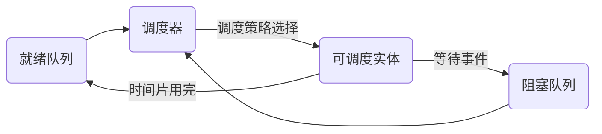

# 调度器 原理与代码实例讲解

## 1.背景介绍

在现代操作系统和分布式系统中,调度器扮演着至关重要的角色。它负责决定如何分配有限的计算资源(如CPU时间、内存等)给不同的任务或进程,以实现系统的高效运行。一个优秀的调度器可以最大化资源利用率,提升系统吞吐量,降低任务延迟,保证任务按时完成。本文将深入探讨调度器的工作原理,并给出具体的代码实例。

### 1.1 调度器的基本概念
- 任务(Task):一个逻辑工作单元,可以是进程、线程、协程等
- 资源(Resource):系统中可被分配和使用的计算资源,如CPU、内存、I/O等
- 调度(Scheduling):将资源分配给任务并决定任务执行顺序的过程
- 调度器(Scheduler):负责实施调度策略的系统组件

### 1.2 调度器的目标
- 公平性:让每个任务都能获得公平的资源使用机会
- 高效性:最小化任务等待时间,最大化系统吞吐量
- 低开销:调度算法本身要尽可能高效,开销小
- 可预测性:相同条件下,调度结果要稳定一致

### 1.3 常见的调度场景
- 操作系统进程/线程调度
- 分布式系统任务调度
- Hadoop/Spark等大数据平台的任务调度
- Kubernetes等容器平台的Pod调度

## 2.核心概念与联系

### 2.1 可调度实体
可调度实体是指可以被操作系统内核调度器分配资源并独立运行的一个执行单元。常见的可调度实体有:
- 进程(Process):一个具有独立地址空间的执行单元,由内核调度。
- 线程(Thread):一个共享进程地址空间的轻量级执行单元,由内核调度。
- 协程(Coroutine):一个由用户态代码调度的非抢占式执行单元,不需要内核参与。
- Goroutine:Go语言中的协程实现。

它们的调度粒度逐渐变小,切换成本也越来越低。

### 2.2 调度器的组成
一个典型的调度器通常包含以下几个关键组件:
- 就绪队列:存放当前就绪态的、等待被调度的任务
- 阻塞队列:存放当前因等待某事件而被阻塞的任务
- 调度策略/算法:根据某种规则从就绪队列选择下一个要运行的任务
- 上下文切换:保存当前任务的运行上下文,并切换到下一个任务



### 2.3 调度策略分类
根据是否打断正在运行的任务,可分为:
- 非抢占式:一旦任务开始运行就一直运行到结束,除非主动放弃
- 抢占式:当高优先级任务到来时,可以打断当前任务,使高优先级任务先运行

根据任务特征信息,可分为:
- 非实时调度:不考虑任务截止时间,只追求平均性能
- 实时调度:严格按照任务截止时间来调度,确保任务按时完成

根据调度目标,可分为:
- 公平共享:让所有任务获得均等的资源使用机会
- 优先级:优先满足高优先级任务的资源需求

## 3.核心算法原理具体操作步骤

本节介绍几种经典的调度算法。

### 3.1 先来先服务(FCFS)
FCFS是最简单的非抢占式调度算法,基本思想是"先来先服务",即按照任务到达的先后顺序依次调度。

具体步骤如下:
1. 把新到达的任务按先后次序排队
2. 每当有任务完成,选择队头任务调度执行
3. 重复步骤1和2,直到所有任务完成

优点是公平,实现简单;缺点是平均等待时间可能较长,难以满足任务实时性要求。

### 3.2 最短作业优先(SJF)
SJF优先调度预计执行时间最短的任务,可以是非抢占式的,也可以是抢占式的。

具体步骤如下:
1. 把新到达的任务插入就绪队列,按预计执行时间排序
2. 每当需要调度时,选择执行时间最短的任务
3. 重复步骤1和2,直到所有任务完成

优点是平均等待时间最短,缺点是不公平,预计时间不准会影响性能。

### 3.3 时间片轮转(RR)
RR是一种简单的抢占式调度,基本思想是给每个任务分配一个固定的时间片,轮流调度。

具体步骤如下:
1. 把新到达的任务插入就绪队列尾部
2. 每次调度时,选择队头任务,执行一个时间片
3. 时间片用完时,若任务还未完成,则放入队尾;否则销毁任务
4. 重复步骤1~3,直到所有任务完成

优点是公平,响应快;缺点是频繁切换,总体开销大。

### 3.4 多级反馈队列(MLFQ)
MLFQ是一种最接近理想"最短作业优先"的调度算法。它设置了多个不同优先级的就绪队列,每个队列时间片长度不等。新任务总是先进最高优先级队列,若用完时间片还未完成,则降到下一级队列队尾。

具体步骤如下:
1. 设置N个不同优先级的FIFO就绪队列,优先级从高到低编号为1~N
2. 新任务总是进入第1级队列尾部
3. 每次调度时,从最高级非空队列的队头选择任务执行
4. 若任务执行完则销毁;若时间片用完还未完成,则进入下一级队列尾部
5. 经过一段时间,所有任务都降到第N级队列,则全部提升到第1级队列
6. 重复步骤2~5,直到所有任务完成

优点是兼顾公平性和吞吐量,可动态调整任务优先级。缺点是算法稍复杂。

## 4.数学模型和公式详细讲解举例说明

本节介绍几个评估调度算法的关键性能指标,并给出数学定义。

### 4.1 周转时间(Turnaround time)
周转时间指一个任务从到达到完成的总时间,包括了等待时间和执行时间。

假设任务 $i$ 到达时间为 $A_i$,完成时间为 $F_i$,则其周转时间为:

$$T_i = F_i - A_i$$

平均周转时间可衡量调度算法的总体性能:

$$\overline{T}=\frac{1}{n}\sum_{i=1}^n{T_i}$$

其中 $n$ 为任务总数。

### 4.2 等待时间(Waiting time)
等待时间指一个任务从到达到首次开始执行的时间。

假设任务 $i$ 到达时间为 $A_i$,首次执行时间为 $E_i$,则其等待时间为:

$$W_i=E_i-A_i$$

平均等待时间可衡量调度算法的响应速度:

$$\overline{W}=\frac{1}{n}\sum_{i=1}^n{W_i}$$

### 4.3 响应比(Response ratio)
响应比是一种综合考虑任务等待时间和执行时间的动态优先级指标。

假设在时刻 $t$,任务 $i$ 的等待时间为 $w_i(t)$,估计执行时间为 $s_i$,则其响应比为:

$$R_i(t)=\frac{w_i(t)+s_i}{s_i}$$

响应比调度(HRRN)总是选择响应比最高的任务执行,可在保证公平性的同时,尽快完成短任务。

### 4.4 调度开销(Scheduling overhead)
调度开销指调度算法本身消耗的时间,过高的开销会抵消调度带来的性能优势。

假设 $t_s$ 为每次调度决策的耗时,$t_c$ 为每次上下文切换的耗时,平均调度间隔为 $\tau$,则调度开销为:

$$\eta = \frac{t_s+t_c}{\tau}$$

减小 $t_s$,$t_c$ 和增大 $\tau$ 可以降低调度开销。

## 5.项目实践：代码实例和详细解释说明

本节给出多级反馈队列调度算法的Python简化实现。

```python
from queue import Queue

class Task:
    def __init__(self, arrival_time, burst_time):
        self.arrival_time = arrival_time
        self.burst_time = burst_time
        self.remaining_time = burst_time
        self.start_time = None
        self.finish_time = None

    def run(self, time):
        if self.start_time is None:
            self.start_time = time
        self.remaining_time -= 1
        if self.remaining_time == 0:
            self.finish_time = time + 1
            return True
        return False

class Scheduler:
    def __init__(self, num_queues, time_slice):
        self.num_queues = num_queues
        self.time_slice = time_slice
        self.queues = [Queue() for _ in range(num_queues)]

    def add_task(self, task):
        self.queues[0].put(task)

    def run(self):
        current_time = 0
        while True:
            task_found = False
            for i in range(self.num_queues):
                if not self.queues[i].empty():
                    task = self.queues[i].get()
                    task_found = True
                    for _ in range(self.time_slice[i]):
                        done = task.run(current_time)
                        current_time += 1
                        if done:
                            break
                    if not done:
                        if i < self.num_queues - 1:
                            self.queues[i+1].put(task)
                    break
            if not task_found:
                break

def main():
    tasks = [
        Task(0, 10),
        Task(1, 2),
        Task(2, 9),
        Task(3, 5),
    ]
    scheduler = Scheduler(3, [2, 4, 8])
    for task in tasks:
        scheduler.add_task(task)
    scheduler.run()

    print(f'Task\tArrival\tStart\tFinish\tTurnaround')
    for i, task in enumerate(tasks):
        print(f'{i}\t{task.arrival_time}\t{task.start_time}\t{task.finish_time}\t{task.finish_time - task.arrival_time}')

if __name__ == '__main__':
    main()
```

代码说明:
- Task类表示一个任务,包含到达时间、执行时间等属性,run方法模拟任务执行过程。
- Scheduler类表示调度器,包含多个优先级队列,add_task方法将新任务加入最高优先级队列,run方法模拟调度过程。
- main函数创建一些测试任务,然后启动调度器,最后输出每个任务的到达时间、开始时间、完成时间和周转时间。

运行结果:
```
Task    Arrival Start   Finish  Turnaround
0       0       0       18      18
1       1       2       4       3
2       2       4       22      20
3       3       8       18      15
```

可以看出,短任务2先完成,长任务0和3多次被放入低优先级队列,在就绪队列为空时才得以执行,周转时间较长。这体现了MLFQ算法的优先级特性。

## 6.实际应用场景

调度器在各种系统中广泛应用,下面列举几个典型场景。

### 6.1 操作系统进程调度
现代操作系统如Linux、Windows等,都采用了多级反馈队列调度算法,可以根据进程的静态优先级和动态等待时间来动态调整调度优先级,兼顾公平性、实时性和吞吐量。

### 6.2 Kubernetes Pod调度
Kubernetes是流行的容器编排平台,Pod是最小的调度单元。Kube-scheduler组件会从多个维度为Pod打分,如资源需求匹配、亲和性、平衡性等,然后选择得分最高的Node来运行Pod。

### 6.3 Hadoop/Spark任务调度
Hadoop和Spark是大数据处理框架,需要调度大量的并行任务。Hadoop采用容量调度和公平调度两种方式,可以为不同用户组分配一定的资源占比,并在组内采用FIFO或公平策略。Spark采用资源队列和任务队列