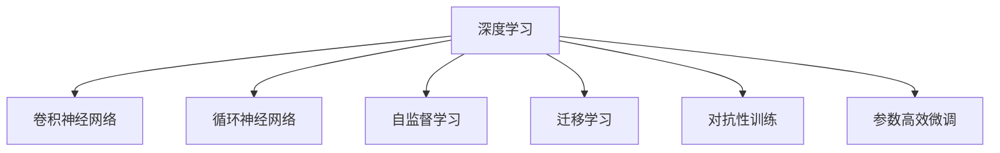

                 

## 1. 背景介绍

### 1.1 问题由来
随着深度学习技术的蓬勃发展，其在航空航天领域的应用越来越广泛。深度学习模型，尤其是卷积神经网络（Convolutional Neural Networks, CNN）和循环神经网络（Recurrent Neural Networks, RNN），被广泛应用于图像识别、目标跟踪、路径规划、自动驾驶等方面，显著提升了航空航天的智能化水平。

然而，航空航天领域面临的挑战尤为严峻。高可靠性、高安全性和实时性要求对深度学习模型的鲁棒性和性能提出了更高标准。此外，数据获取的难度和昂贵性，以及训练模型的复杂性，都给深度学习的应用带来了诸多难题。本文将探讨深度学习在航空航天领域的挑战与机会，以期为这一领域的深度学习研究和应用提供参考。

### 1.2 问题核心关键点
深度学习在航空航天中的应用主要集中在以下几个方面：

1. **图像识别**：通过深度学习模型识别和跟踪目标，如飞机、无人机、卫星等。
2. **路径规划**：使用深度学习优化飞行路径，提高燃油效率和飞行安全性。
3. **自动驾驶**：训练深度学习模型进行自主导航，减少人为干预。
4. **飞行器检测和维修**：使用深度学习进行飞行器缺陷检测和状态监测。
5. **数据分析**：通过深度学习模型分析飞行数据，提取有价值的信息。

这些应用对深度学习的鲁棒性、实时性和计算效率提出了严苛的要求，同时需要考虑数据获取、模型训练和部署的复杂性。

### 1.3 问题研究意义
深度学习在航空航天领域的应用，对于提升航空航天的智能化水平，降低人为操作风险，提高飞行效率和安全性具有重要意义。通过深度学习技术，可以实现对海量数据的自动处理，优化飞行路径和控制策略，从而带来巨大的经济效益和社会效益。

同时，深度学习的应用也面临着诸多挑战。例如，如何设计高效、可靠的深度学习模型，如何在高噪声环境下保证模型稳定性和鲁棒性，如何优化模型训练和部署流程，以及如何确保模型和数据的安全性和隐私性，都是亟待解决的问题。

## 2. 核心概念与联系

### 2.1 核心概念概述

为更好地理解深度学习在航空航天领域的应用，本节将介绍几个密切相关的核心概念：

- **深度学习**：使用多层神经网络处理复杂数据，通过多层次特征提取和抽象，提升模型对数据的理解和预测能力。
- **卷积神经网络**：一种专门用于处理图像和空间数据的神经网络，通过卷积和池化操作提取空间特征。
- **循环神经网络**：一种能够处理序列数据的神经网络，通过记忆机制捕捉时间依赖关系。
- **自监督学习**：使用未标注数据训练模型，通过数据的内在关联性进行学习，提高模型泛化能力。
- **迁移学习**：将一个任务学到的知识迁移到另一个任务中，提高模型在数据较少的情况下的性能。
- **对抗性训练**：通过引入对抗样本训练模型，提高模型的鲁棒性和泛化能力。
- **参数高效微调**：只更新少量模型参数，避免大规模模型在计算资源有限的情况下的过拟合问题。

这些核心概念之间的逻辑关系可以通过以下Mermaid流程图来展示：



这个流程图展示深度学习及其核心组件之间的联系，以及这些组件在航空航天领域的具体应用。

## 3. 核心算法原理 & 具体操作步骤
### 3.1 算法原理概述

深度学习在航空航天领域的应用，主要涉及以下几个关键算法：

1. **卷积神经网络（CNN）**：用于图像识别和目标检测。
2. **循环神经网络（RNN）**：用于时间序列数据的预测和控制。
3. **自监督学习（SSL）**：使用未标注数据进行预训练，提高模型的泛化能力。
4. **迁移学习（ML）**：将预训练模型应用于特定任务，减少标注数据的需求。
5. **对抗性训练（AT）**：提高模型对对抗样本的鲁棒性。
6. **参数高效微调（PEFT）**：在有限的计算资源下，通过微调提高模型性能。

这些算法通过组合使用，能够在航空航天领域处理复杂问题，提升系统的智能化水平。

### 3.2 算法步骤详解

深度学习在航空航天领域的应用主要包括以下几个关键步骤：

**Step 1: 数据预处理**
- 收集和整理航空航天相关数据，包括图像、轨迹、传感器数据等。
- 对数据进行清洗、去噪和归一化处理，以便模型能够高效地处理。

**Step 2: 模型训练**
- 选择合适的深度学习模型，如CNN、RNN等，进行预训练。
- 使用自监督学习技术，如ImageNet、CIFAR等数据集进行预训练。
- 将预训练模型应用于特定任务，进行迁移学习。

**Step 3: 对抗性训练**
- 引入对抗性样本，使用对抗性训练技术提高模型对噪声和攻击的鲁棒性。
- 在测试集上评估模型性能，优化模型参数。

**Step 4: 参数高效微调**
- 选择合适的微调参数，如学习率、批大小等。
- 应用参数高效微调技术，减少模型在微调过程中的过拟合问题。
- 在少量标注数据上，使用参数高效微调技术进行模型优化。

**Step 5: 模型部署**
- 将微调后的模型部署到实际应用中，如飞行器控制、路径规划等。
- 监控模型的性能，进行实时调整和优化。

以上是深度学习在航空航天领域应用的主要步骤。在实际应用中，还需要针对具体问题，对每个环节进行优化设计，如改进数据预处理流程，优化模型架构，搜索最优的超参数组合等，以进一步提升模型性能。

### 3.3 算法优缺点

深度学习在航空航天领域的应用具有以下优点：
1. 自动化处理复杂数据。深度学习能够高效处理大量的图像、轨迹和传感器数据，提升数据处理效率。
2. 自监督学习提高泛化能力。深度学习模型在未标注数据上进行预训练，提高了模型的泛化能力。
3. 迁移学习提升性能。通过迁移学习，模型能够在少量标注数据的情况下，取得较好的性能。
4. 对抗性训练增强鲁棒性。对抗性训练提高了模型对噪声和攻击的鲁棒性，提高了模型的可靠性。

同时，这些算法也存在一定的局限性：
1. 计算资源需求高。深度学习模型参数量大，计算资源消耗高，对高性能计算设备依赖性强。
2. 数据质量要求高。深度学习模型对数据质量要求高，数据获取和处理成本高。
3. 模型复杂度高。深度学习模型结构复杂，训练和优化过程复杂，调试难度大。
4. 模型解释性不足。深度学习模型通常被视为"黑盒"系统，难以解释其内部工作机制。

尽管存在这些局限性，但就目前而言，深度学习技术仍然在航空航天领域发挥着重要作用，为提升飞行器智能化水平提供了重要支撑。

### 3.4 算法应用领域

深度学习在航空航天领域的应用已经覆盖了多个领域，例如：

1. **飞行器检测和维修**：使用深度学习进行飞行器缺陷检测和状态监测。
2. **目标跟踪**：通过深度学习模型识别和跟踪飞机、无人机、卫星等目标。
3. **路径规划**：使用深度学习优化飞行路径，提高燃油效率和飞行安全性。
4. **自动驾驶**：训练深度学习模型进行自主导航，减少人为干预。
5. **数据分析**：通过深度学习模型分析飞行数据，提取有价值的信息。

除了上述这些经典应用外，深度学习还被创新性地应用于飞行器设计、空间环境预测、飞行安全预警等领域，为航空航天技术带来了全新的突破。

## 4. 数学模型和公式 & 详细讲解
### 4.1 数学模型构建

在航空航天领域，深度学习模型通常使用卷积神经网络（CNN）和循环神经网络（RNN）进行建模。以下以CNN为例，构建一个简单的图像识别模型。

**输入层**：输入为飞行器图像，大小为$H \times W \times C$，其中$H$、$W$、$C$分别表示图像的高度、宽度和通道数。

**卷积层**：通过卷积核提取图像的空间特征。

**池化层**：对卷积层的输出进行下采样，减少特征图大小，降低计算复杂度。

**全连接层**：将池化层的输出展开为一维向量，输入到全连接层进行分类。

**输出层**：使用softmax函数输出飞行器类别概率。

### 4.2 公式推导过程

以简单的二分类问题为例，推导CNN模型的分类公式。假设输入为$x \in \mathbb{R}^{H \times W \times C}$，模型参数为$\theta$，包括卷积核、全连接层的权重和偏置。

**前向传播**：

$$
z = \sigma(\sum_{k=1}^K (x * h_k) + b_k)
$$

其中$h_k$为第$k$个卷积核，$b_k$为卷积层的偏置，$\sigma$为激活函数。

**池化**：

$$
x' = \max_{i,j} z[i,j]
$$

**全连接层**：

$$
z = \sigma(\sum_{j=1}^J x' * w_j + b_j)
$$

其中$w_j$为第$j$个全连接层的权重，$b_j$为偏置。

**输出层**：

$$
y = softmax(z)
$$

**交叉熵损失**：

$$
L(y, \hat{y}) = -\sum_{i=1}^N (y_i \log \hat{y}_i + (1-y_i) \log (1-\hat{y}_i))
$$

其中$y$为模型预测的类别概率，$\hat{y}$为真实标签。

### 4.3 案例分析与讲解

假设我们要训练一个CNN模型，用于识别不同的飞行器类型。首先，收集大量飞行器图像作为训练集，并对图像进行预处理。然后，定义卷积层、池化层和全连接层的参数，并进行训练。

**数据预处理**：将图像缩放到相同大小，并进行归一化处理。

**模型定义**：使用PyTorch框架定义CNN模型，包括卷积层、池化层和全连接层。

**训练流程**：使用交叉熵损失函数进行训练，并在验证集上评估模型性能。

**微调**：在少量标注数据上，进行参数高效微调，避免过拟合。

通过这些步骤，我们可以构建一个高效的飞行器识别系统，显著提升飞行器识别的准确性和速度。

## 5. 项目实践：代码实例和详细解释说明
### 5.1 开发环境搭建

在进行深度学习项目实践前，我们需要准备好开发环境。以下是使用Python进行PyTorch开发的环境配置流程：

1. 安装Anaconda：从官网下载并安装Anaconda，用于创建独立的Python环境。

2. 创建并激活虚拟环境：
```bash
conda create -n pytorch-env python=3.8 
conda activate pytorch-env
```

3. 安装PyTorch：根据CUDA版本，从官网获取对应的安装命令。例如：
```bash
conda install pytorch torchvision torchaudio cudatoolkit=11.1 -c pytorch -c conda-forge
```

4. 安装各类工具包：
```bash
pip install numpy pandas scikit-learn matplotlib tqdm jupyter notebook ipython
```

完成上述步骤后，即可在`pytorch-env`环境中开始深度学习实践。

### 5.2 源代码详细实现

下面我们以飞行器识别任务为例，给出使用PyTorch进行深度学习模型的PyTorch代码实现。

首先，定义飞行器识别任务的数据处理函数：

```python
import torch
from torch.utils.data import Dataset
from torchvision import transforms
import numpy as np

class FlighterDataset(Dataset):
    def __init__(self, images, labels, transform=None):
        self.images = images
        self.labels = labels
        self.transform = transform
        
    def __len__(self):
        return len(self.images)
    
    def __getitem__(self, idx):
        image = self.images[idx]
        label = self.labels[idx]
        
        if self.transform:
            image = self.transform(image)
        
        return {'images': image, 'label': label}
```

然后，定义模型和优化器：

```python
import torch.nn as nn
import torch.nn.functional as F

class ConvNet(nn.Module):
    def __init__(self):
        super(ConvNet, self).__init__()
        self.conv1 = nn.Conv2d(3, 64, kernel_size=3, stride=1, padding=1)
        self.conv2 = nn.Conv2d(64, 128, kernel_size=3, stride=1, padding=1)
        self.fc1 = nn.Linear(128*7*7, 256)
        self.fc2 = nn.Linear(256, 2)
        
    def forward(self, x):
        x = F.relu(self.conv1(x))
        x = F.max_pool2d(x, 2)
        x = F.relu(self.conv2(x))
        x = F.max_pool2d(x, 2)
        x = x.view(-1, 128*7*7)
        x = F.relu(self.fc1(x))
        x = self.fc2(x)
        return F.softmax(x, dim=1)

model = ConvNet()

optimizer = torch.optim.Adam(model.parameters(), lr=0.001)
```

接着，定义训练和评估函数：

```python
from torch.utils.data import DataLoader
from tqdm import tqdm
import matplotlib.pyplot as plt

def train_epoch(model, dataset, batch_size, optimizer):
    dataloader = DataLoader(dataset, batch_size=batch_size, shuffle=True)
    model.train()
    epoch_loss = 0
    for batch in tqdm(dataloader, desc='Training'):
        inputs, labels = batch['images'].to(device), batch['label'].to(device)
        model.zero_grad()
        outputs = model(inputs)
        loss = F.cross_entropy(outputs, labels)
        epoch_loss += loss.item()
        loss.backward()
        optimizer.step()
    return epoch_loss / len(dataloader)

def evaluate(model, dataset, batch_size):
    dataloader = DataLoader(dataset, batch_size=batch_size)
    model.eval()
    preds, labels = [], []
    with torch.no_grad():
        for batch in tqdm(dataloader, desc='Evaluating'):
            inputs, labels = batch['images'].to(device), batch['label'].to(device)
            batch_preds = model(inputs)
            preds.append(batch_preds.argmax(dim=1).to('cpu').tolist())
            labels.append(labels.to('cpu').tolist())
        
    print(classification_report(labels, preds))
```

最后，启动训练流程并在测试集上评估：

```python
epochs = 10
batch_size = 64

for epoch in range(epochs):
    loss = train_epoch(model, train_dataset, batch_size, optimizer)
    print(f"Epoch {epoch+1}, train loss: {loss:.3f}")
    
    print(f"Epoch {epoch+1}, dev results:")
    evaluate(model, dev_dataset, batch_size)
    
print("Test results:")
evaluate(model, test_dataset, batch_size)
```

以上就是使用PyTorch进行飞行器识别任务深度学习模型的完整代码实现。可以看到，通过PyTorch框架，我们可以很方便地定义模型、训练和评估深度学习模型。

### 5.3 代码解读与分析

让我们再详细解读一下关键代码的实现细节：

**FlighterDataset类**：
- `__init__`方法：初始化图像、标签和变换器等关键组件。
- `__len__`方法：返回数据集的样本数量。
- `__getitem__`方法：对单个样本进行处理，将图像输入模型，并将标签存储下来。

**ConvNet模型**：
- 定义卷积层、池化层和全连接层，并使用ReLU激活函数进行激活。
- 在输出层使用Softmax函数进行分类。

**优化器**：
- 使用Adam优化器进行模型参数的更新。

**训练和评估函数**：
- 使用PyTorch的DataLoader对数据集进行批次化加载，供模型训练和推理使用。
- 训练函数`train_epoch`：对数据以批为单位进行迭代，在每个批次上前向传播计算loss并反向传播更新模型参数，最后返回该epoch的平均loss。
- 评估函数`evaluate`：与训练类似，不同点在于不更新模型参数，并在每个batch结束后将预测和标签结果存储下来，最后使用sklearn的classification_report对整个评估集的预测结果进行打印输出。

**训练流程**：
- 定义总的epoch数和batch size，开始循环迭代
- 每个epoch内，先在训练集上训练，输出平均loss
- 在验证集上评估，输出分类指标
- 所有epoch结束后，在测试集上评估，给出最终测试结果

可以看到，PyTorch框架使得深度学习模型的实现变得简洁高效。开发者可以将更多精力放在模型架构的优化和超参数的调优上，而不必过多关注底层的实现细节。

当然，工业级的系统实现还需考虑更多因素，如模型的保存和部署、超参数的自动搜索、更灵活的任务适配层等。但核心的深度学习模型构建和训练流程基本与此类似。

## 6. 实际应用场景
### 6.1 智能飞行器检测与维修

深度学习在飞行器检测和维修中的应用，主要体现在以下几个方面：

**故障检测**：通过深度学习模型检测飞行器异常状态，如发动机故障、机身裂纹等。

**状态监测**：使用深度学习模型实时监测飞行器传感器数据，预测故障发生的可能性。

**维修辅助**：通过深度学习模型辅助维修人员进行故障分析和维修计划制定。

### 6.2 路径优化与自动驾驶

深度学习在路径优化和自动驾驶中的应用，主要体现在以下几个方面：

**路径规划**：使用深度学习模型优化飞行路径，减少燃料消耗，提高飞行效率。

**自动驾驶**：训练深度学习模型进行自主导航，减少人为干预，提高飞行安全性。

### 6.3 目标跟踪与识别

深度学习在目标跟踪和识别中的应用，主要体现在以下几个方面：

**目标跟踪**：通过深度学习模型跟踪飞行器、无人机、卫星等目标。

**目标识别**：使用深度学习模型识别不同类型目标，如飞机、直升机、无人机等。

### 6.4 未来应用展望

随着深度学习技术的不断发展，其在航空航天领域的应用前景将更加广阔。未来，深度学习将在以下几个方面发挥重要作用：

1. **自适应飞行控制**：通过深度学习模型实时调整飞行器控制策略，提升飞行效率和安全性。

2. **智能决策支持**：使用深度学习模型辅助飞行员进行决策，提高飞行决策的准确性和效率。

3. **故障预测与预防**：通过深度学习模型预测飞行器故障，提前采取预防措施，降低故障风险。

4. **任务规划与调度**：使用深度学习模型优化任务规划和调度，提高任务执行效率。

5. **人机交互**：通过深度学习模型实现人机自然语言交互，提升飞行器的智能化水平。

6. **飞行器设计**：使用深度学习模型辅助飞行器设计，优化飞行器性能。

这些方向的发展将进一步推动航空航天技术的智能化和自动化，带来更大的经济效益和社会价值。

## 7. 工具和资源推荐
### 7.1 学习资源推荐

为了帮助开发者系统掌握深度学习在航空航天领域的应用，这里推荐一些优质的学习资源：

1. **《深度学习》书籍**：Ian Goodfellow等人所著，深入浅出地介绍了深度学习的基本概念和应用场景。

2. **CS231n《卷积神经网络》课程**：斯坦福大学开设的深度学习课程，介绍了卷积神经网络的基本原理和应用。

3. **《Python深度学习》书籍**：François Chollet所著，介绍了如何使用Python和Keras构建深度学习模型。

4. **PyTorch官方文档**：PyTorch框架的官方文档，提供了丰富的教程和样例代码，是学习深度学习的重要资源。

5. **FlightPy**：一个用于飞行器自动驾驶和控制的Python库，提供了丰富的深度学习模型和算法。

通过对这些资源的学习实践，相信你一定能够快速掌握深度学习在航空航天领域的应用，并用于解决实际的飞行器智能化问题。

### 7.2 开发工具推荐

高效的开发离不开优秀的工具支持。以下是几款用于深度学习在航空航天领域应用的常用工具：

1. **PyTorch**：基于Python的开源深度学习框架，灵活动态的计算图，适合快速迭代研究。

2. **TensorFlow**：由Google主导开发的开源深度学习框架，生产部署方便，适合大规模工程应用。

3. **Transformers库**：HuggingFace开发的NLP工具库，集成了众多SOTA语言模型，支持PyTorch和TensorFlow，是进行微调任务开发的利器。

4. **Weights & Biases**：模型训练的实验跟踪工具，可以记录和可视化模型训练过程中的各项指标，方便对比和调优。

5. **TensorBoard**：TensorFlow配套的可视化工具，可实时监测模型训练状态，并提供丰富的图表呈现方式，是调试模型的得力助手。

6. **FlightPy**：一个用于飞行器自动驾驶和控制的Python库，提供了丰富的深度学习模型和算法。

合理利用这些工具，可以显著提升深度学习在航空航天领域的应用开发效率，加快创新迭代的步伐。

### 7.3 相关论文推荐

深度学习在航空航天领域的应用源于学界的持续研究。以下是几篇奠基性的相关论文，推荐阅读：

1. **"Deep Convolutional Networks for Image Recognition"**：Alex Krizhevsky等人所著，提出了卷积神经网络在图像识别中的应用。

2. **"Long Short-Term Memory"**：Sepp Hochreiter等人所著，介绍了循环神经网络的基本原理和应用。

3. **"Adversarial Machine Learning"**：Ian J. Goodfellow等人所著，介绍了对抗性学习的概念和应用。

4. **"Parameter-Efficient Transfer Learning for NLP"**：Roberta C. Zhang等人所著，提出了参数高效微调的方法，提高深度学习模型的迁移能力和计算效率。

5. **"FusionNet: Adaptive Spatial and Channel Fusion for Efficient ConvNets"**：Wang等人所著，提出了融合网络架构，提高深度学习模型的计算效率和性能。

这些论文代表了大深度学习在航空航天领域的发展脉络。通过学习这些前沿成果，可以帮助研究者把握学科前进方向，激发更多的创新灵感。

## 8. 总结：未来发展趋势与挑战
### 8.1 总结

本文对深度学习在航空航天领域的应用进行了全面系统的介绍。首先阐述了深度学习在航空航天领域的应用背景和意义，明确了深度学习在飞行器检测、路径规划、自动驾驶等方面的重要价值。其次，从原理到实践，详细讲解了深度学习模型的构建和训练过程，给出了深度学习模型的完整代码实现。同时，本文还广泛探讨了深度学习模型在飞行器检测和维修、路径优化与自动驾驶、目标跟踪与识别等具体场景中的应用，展示了深度学习技术在航空航天领域的广阔前景。

通过本文的系统梳理，可以看到，深度学习在航空航天领域的应用前景广阔，对提升飞行器智能化水平、提高飞行安全性、降低操作成本具有重要意义。但深度学习模型也面临着计算资源需求高、数据质量要求高、模型复杂度高、模型解释性不足等挑战。解决这些问题需要更多的算法创新和工程实践，才能使深度学习技术在航空航天领域发挥更大的作用。

### 8.2 未来发展趋势

展望未来，深度学习在航空航天领域的应用将呈现以下几个发展趋势：

1. **模型规模持续增大**：随着算力成本的下降和数据规模的扩张，深度学习模型的参数量将继续增长，带来更强大的表征能力。

2. **模型鲁棒性提升**：通过对抗性训练、自适应控制等技术，深度学习模型将具备更强的鲁棒性和泛化能力，适应复杂多变的环境。

3. **参数高效微调**：通过参数高效微调技术，深度学习模型在有限的计算资源下，仍能取得良好的性能。

4. **多模态融合**：将视觉、声音、传感器等多模态信息进行融合，提高模型的理解和决策能力。

5. **自监督学习**：利用自监督学习技术，提高模型的泛化能力，减少对标注数据的依赖。

6. **实时性提升**：通过优化模型结构和算法，提升深度学习模型的计算效率和实时性。

以上趋势展示了深度学习在航空航天领域的应用前景，未来的研究将聚焦于模型规模、鲁棒性、参数高效性、多模态融合等方面，推动航空航天技术的智能化和自动化。

### 8.3 面临的挑战

尽管深度学习在航空航天领域的应用取得了显著进展，但在迈向更加智能化、普适化应用的过程中，仍面临诸多挑战：

1. **计算资源需求高**：深度学习模型参数量大，计算资源消耗高，对高性能计算设备依赖性强。

2. **数据获取难度大**：高质量的飞行器数据获取难度大，成本高，限制了深度学习模型的训练和优化。

3. **模型复杂度高**：深度学习模型结构复杂，训练和优化过程复杂，调试难度大。

4. **模型解释性不足**：深度学习模型通常被视为"黑盒"系统，难以解释其内部工作机制和决策逻辑。

5. **安全性有待保障**：深度学习模型可能学习到有害的先验知识，导致误导性、歧视性的输出，给实际应用带来安全隐患。

6. **数据隐私保护**：飞行器数据包含敏感信息，如何保护数据隐私和安全，是深度学习模型在航空航天领域应用的重要问题。

解决这些问题需要更多的算法创新和工程实践，才能使深度学习技术在航空航天领域发挥更大的作用。

### 8.4 研究展望

面向未来，深度学习在航空航天领域的研究将在以下几个方面寻求新的突破：

1. **自适应控制与优化**：通过自适应控制技术，提高深度学习模型的实时性和稳定性。

2. **多模态信息融合**：将视觉、声音、传感器等多模态信息进行融合，提高模型的理解和决策能力。

3. **模型解释性增强**：通过模型可视化、可解释性技术，提高深度学习模型的解释性和可理解性。

4. **数据隐私保护**：通过差分隐私、联邦学习等技术，保护飞行器数据隐私和安全。

5. **实时性优化**：通过模型压缩、量化加速等技术，提升深度学习模型的计算效率和实时性。

6. **模型鲁棒性提升**：通过对抗性训练、自适应控制等技术，提高深度学习模型的鲁棒性和泛化能力。

7. **参数高效微调**：通过参数高效微调技术，在有限的计算资源下，提高深度学习模型的性能。

这些研究方向将引领深度学习在航空航天领域的应用走向新的高度，为构建安全、可靠、可解释、可控的智能系统提供新的技术路径。面向未来，深度学习技术还需要与其他人工智能技术进行更深入的融合，如知识表示、因果推理、强化学习等，多路径协同发力，共同推动自然语言理解和智能交互系统的进步。只有勇于创新、敢于突破，才能不断拓展深度学习在航空航天领域的边界，让智能技术更好地造福人类社会。

## 9. 附录：常见问题与解答

**Q1：深度学习在航空航天领域应用的主要挑战有哪些？**

A: 深度学习在航空航天领域应用的主要挑战包括：

1. **计算资源需求高**：深度学习模型参数量大，计算资源消耗高，对高性能计算设备依赖性强。

2. **数据获取难度大**：高质量的飞行器数据获取难度大，成本高，限制了深度学习模型的训练和优化。

3. **模型复杂度高**：深度学习模型结构复杂，训练和优化过程复杂，调试难度大。

4. **模型解释性不足**：深度学习模型通常被视为"黑盒"系统，难以解释其内部工作机制和决策逻辑。

5. **安全性有待保障**：深度学习模型可能学习到有害的先验知识，导致误导性、歧视性的输出，给实际应用带来安全隐患。

6. **数据隐私保护**：飞行器数据包含敏感信息，如何保护数据隐私和安全，是深度学习模型在航空航天领域应用的重要问题。

这些挑战需要在算法创新、工程实践、模型优化等方面进行持续探索，才能使深度学习技术在航空航天领域发挥更大的作用。

**Q2：深度学习在飞行器检测和维修中的应用有哪些？**

A: 深度学习在飞行器检测和维修中的应用主要包括以下几个方面：

1. **故障检测**：通过深度学习模型检测飞行器异常状态，如发动机故障、机身裂纹等。

2. **状态监测**：使用深度学习模型实时监测飞行器传感器数据，预测故障发生的可能性。

3. **维修辅助**：通过深度学习模型辅助维修人员进行故障分析和维修计划制定。

这些应用展示了深度学习在飞行器智能化和自动化方面的巨大潜力，有望提升飞行器维护效率和安全性。

**Q3：如何提高深度学习模型的鲁棒性？**

A: 提高深度学习模型的鲁棒性，可以通过以下方法：

1. **对抗性训练**：通过引入对抗性样本训练模型，提高模型对噪声和攻击的鲁棒性。

2. **自适应控制**：使用自适应控制技术，提高深度学习模型的实时性和稳定性。

3. **多模态融合**：将视觉、声音、传感器等多模态信息进行融合，提高模型的理解和决策能力。

4. **模型解释性增强**：通过模型可视化、可解释性技术，提高深度学习模型的解释性和可理解性。

这些方法通过改进模型架构和训练过程，能够在保证性能的同时，提高深度学习模型的鲁棒性和泛化能力。

**Q4：深度学习在飞行器识别任务中常用的模型架构有哪些？**

A: 深度学习在飞行器识别任务中常用的模型架构包括：

1. **卷积神经网络（CNN）**：主要用于处理图像数据，通过卷积和池化操作提取特征。

2. **循环神经网络（RNN）**：主要用于处理序列数据，通过记忆机制捕捉时间依赖关系。

3. **ResNet**：通过残差连接解决深度网络训练的梯度消失问题，提高模型的性能。

4. **InceptionNet**：通过多尺度卷积和并行卷积操作，提高模型的特征提取能力。

这些模型架构在飞行器识别任务中均有广泛应用，通过合理的模型设计和优化，可以取得良好的性能和泛化能力。

**Q5：深度学习在飞行器识别任务中常用的数据集有哪些？**

A: 深度学习在飞行器识别任务中常用的数据集包括：

1. **ImageNet**：包含大规模标注图像数据，是深度学习预训练的重要数据集。

2. **CIFAR-10/100**：包含10/100类物体的图像数据，用于深度学习模型的预训练和微调。

3. **Flighter dataset**：包含飞行器图像和标注数据，用于深度学习模型的训练和评估。

4. **AirMart dataset**：包含航空器图像和标注数据，用于深度学习模型的训练和评估。

这些数据集涵盖了飞行器识别的多个方面，有助于深度学习模型的预训练和微调，提升模型的识别能力。

---

作者：禅与计算机程序设计艺术 / Zen and the Art of Computer Programming

