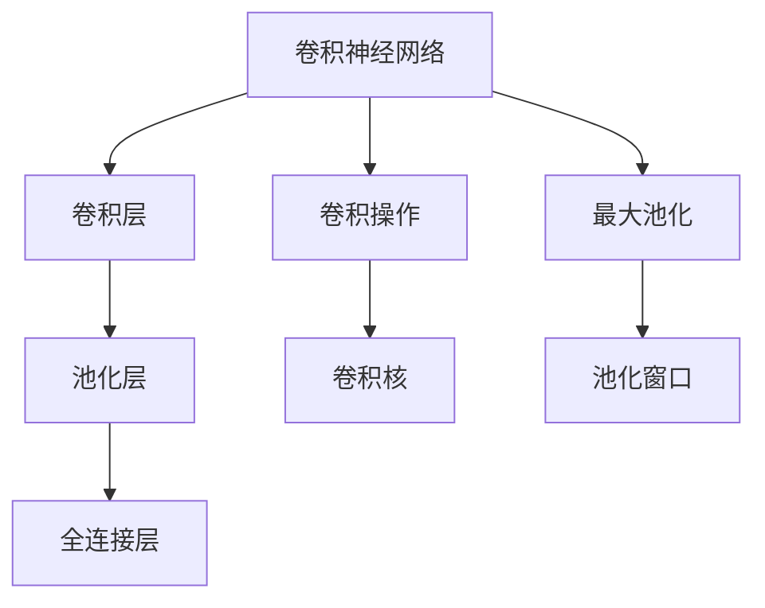
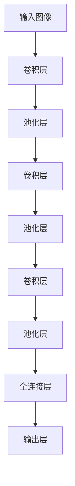

                 

## 1. 背景介绍

### 1.1 问题由来

随着深度学习技术的发展，计算机视觉（CV）领域取得了飞速的进步。从简单的图像分类任务到复杂的语义分割、实例分割、目标检测、姿态估计等任务，深度学习模型在计算机视觉中的表现越来越优秀。深度学习模型之所以能够在计算机视觉中取得如此卓越的性能，主要归功于其强大的特征提取能力和自适应学习能力。

### 1.2 问题核心关键点

深度学习在计算机视觉中的核心应用在于其强大的特征提取能力，能够自动从原始数据中学习到抽象的语义特征。而这种特征提取能力主要来自于深度神经网络中的卷积层（Convolutional Layer）和池化层（Pooling Layer）。通过这些层的操作，深度模型能够捕捉到图像中不同层次的特征，从而实现对复杂视觉任务的建模。

## 2. 核心概念与联系

### 2.1 核心概念概述

为更好地理解深度学习在计算机视觉中的应用，本节将介绍几个密切相关的核心概念：

- **卷积神经网络（Convolutional Neural Network, CNN）**：基于卷积操作的深度神经网络，主要用于图像处理任务。通过卷积层、池化层、全连接层等模块的组合，CNN能够自动学习图像中的特征。

- **卷积核（Convolution Kernel）**：卷积层中的权重，用于卷积操作提取图像局部特征。卷积核大小、步幅、填充等参数设置对模型的性能影响显著。

- **池化层（Pooling Layer）**：用于减小特征图尺寸，提升特征的不变性。常用的池化方式包括最大池化、平均池化等。

- **卷积操作的数学表达**：卷积操作本质上是将一个卷积核与一个局部区域内的像素点进行加权求和的操作。在二维图像中，卷积操作的数学表达如下：

  $$
  \text{Convolution}(x, w) = \sum_{i=1}^{h} \sum_{j=1}^{w} w_{i,j} \cdot x_{i,j}
  $$

  其中，$x$ 为输入图像，$w$ 为卷积核，$h$ 和 $w$ 分别为卷积核的高和宽。

- **最大池化（Max Pooling）**：在池化层中，最大池化操作能够保持特征的最大值不变，减少特征图尺寸。其数学表达如下：

  $$
  \text{Max Pooling}(x, p) = \max_{i,j} x_{i+p/2,j+p/2}
  $$

  其中，$x$ 为输入特征图，$p$ 为池化窗口大小。

这些核心概念之间的逻辑关系可以通过以下Mermaid流程图来展示：



这个流程图展示了这个过程中主要的操作，包括卷积、池化、全连接等，以及它们之间的关系。

## 3. 核心算法原理 & 具体操作步骤

### 3.1 算法原理概述

深度学习在计算机视觉中的核心算法原理是通过卷积神经网络自动提取图像中的特征，并通过这些特征进行分类、分割、检测等任务。其中，卷积操作是CNN的核心，通过卷积层、池化层等模块的操作，CNN能够自动学习图像中的特征，并通过全连接层对这些特征进行分类或回归。

### 3.2 算法步骤详解

1. **数据预处理**：首先对图像进行预处理，如缩放、裁剪、归一化等操作，以便输入到神经网络中。

2. **卷积操作**：通过卷积层对输入图像进行卷积操作，提取图像中的局部特征。

3. **池化操作**：通过池化层对卷积后的特征图进行下采样，减小特征图尺寸，提升特征的不变性。

4. **激活函数**：在卷积层和全连接层之间加入激活函数（如ReLU、Sigmoid等），对特征进行非线性变换，增加模型复杂度。

5. **全连接层**：通过全连接层对卷积后的特征进行分类或回归。

6. **损失函数**：设计合适的损失函数（如交叉熵损失、均方误差损失等），计算模型输出与真实标签之间的差异。

7. **反向传播**：使用反向传播算法计算损失函数对模型参数的梯度，更新模型参数。

8. **训练与验证**：在训练集上训练模型，并在验证集上评估模型性能，调整超参数（如学习率、批量大小等）。

9. **测试与部署**：在测试集上评估模型性能，并将模型部署到实际应用系统中。

### 3.3 算法优缺点

**优点**：
- 自动提取图像特征，减少手动特征工程的复杂度。
- 能够处理高维数据，适用于大规模图像数据集。
- 通过层级结构学习多层次的特征，提高模型的表达能力。
- 可以进行端到端训练，避免了手工设计特征的繁琐。

**缺点**：
- 需要大量标注数据，数据标注成本较高。
- 计算复杂度较高，训练和推理速度较慢。
- 模型复杂度较高，存在过拟合风险。
- 对于特定任务，需要重新训练或微调模型，工程成本较高。

### 3.4 算法应用领域

深度学习在计算机视觉中的应用非常广泛，涵盖了各种任务，例如：

- **图像分类**：对图像进行分类，如CIFAR-10、ImageNet等数据集上的图像分类任务。
- **目标检测**：在图像中检测出特定的物体，如YOLO、Faster R-CNN等模型。
- **语义分割**：将图像中的像素划分到不同的语义类别中，如PSPNet、DeepLab等模型。
- **实例分割**：不仅检测出物体，还对每个实例进行分割，如Mask R-CNN等模型。
- **姿态估计**：估计人体或物体的姿态，如OpenPose、AlphaPose等模型。
- **图像生成**：生成高质量的图像，如GAN、VQ-VAE等模型。
- **图像风格转换**：将一张图像的风格转换为另一张图像的风格，如StyleGAN、CycleGAN等模型。

除了以上这些经典任务外，深度学习还在诸如超分辨率、图像增强、图像去噪、图像修复等任务中得到了广泛应用。

## 4. 数学模型和公式 & 详细讲解 & 举例说明

### 4.1 数学模型构建

假设输入图像 $x$ 的大小为 $H \times W$，卷积核 $w$ 的大小为 $h \times w$，则卷积操作的输出特征图大小为 $\frac{H-h+2p}{s} \times \frac{W-w+2p}{s}$，其中 $p$ 为填充大小，$s$ 为卷积核步幅。

### 4.2 公式推导过程

以最简单的$3 \times 3$的卷积核为例，假设输入图像大小为 $256 \times 256$，卷积核大小为 $3 \times 3$，步幅为 $1$，填充大小为 $0$，则卷积操作的输出特征图大小为 $256-3+2 \times 0+1=254$。

设输入图像 $x$ 为 $256 \times 256$，卷积核 $w$ 为 $3 \times 3$，则卷积操作的结果为：

$$
x_{i,j} = \sum_{m=0}^{2} \sum_{n=0}^{2} w_{m,n} \cdot x_{i-m,j-n}
$$

其中，$x_{i,j}$ 为输出特征图上的像素值，$w_{m,n}$ 为卷积核上的权重。

### 4.3 案例分析与讲解

以YOLO（You Only Look Once）目标检测模型为例，其核心思想是使用单个神经网络进行特征提取和目标检测，具有实时性和准确性。YOLO模型将图像划分为若干个网格，每个网格负责预测固定数量的候选框。通过卷积操作提取图像特征，并通过全连接层进行目标分类和回归。其架构图如下：



YOLO模型通过多个卷积层和池化层的组合，逐步提取图像特征，并通过全连接层进行目标分类和回归。其核心在于多尺度特征融合，通过不同尺度的特征图进行目标检测，提高模型的鲁棒性。

## 5. 项目实践：代码实例和详细解释说明

### 5.1 开发环境搭建

在进行计算机视觉项目实践前，我们需要准备好开发环境。以下是使用Python进行PyTorch开发的环境配置流程：

1. 安装Anaconda：从官网下载并安装Anaconda，用于创建独立的Python环境。

2. 创建并激活虚拟环境：
```bash
conda create -n cv-env python=3.8 
conda activate cv-env
```

3. 安装PyTorch：根据CUDA版本，从官网获取对应的安装命令。例如：
```bash
conda install pytorch torchvision torchaudio cudatoolkit=11.1 -c pytorch -c conda-forge
```

4. 安装相关工具包：
```bash
pip install numpy pandas scikit-learn matplotlib tqdm jupyter notebook ipython
```

完成上述步骤后，即可在`cv-env`环境中开始项目实践。

### 5.2 源代码详细实现

下面以YOLO目标检测模型为例，给出使用PyTorch实现的代码。

首先，定义YOLO模型的超参数：

```python
class YOLOConfig:
    def __init__(self):
        self.num_classes = 80
        self.max_boxes = 2000
        self.confidence_threshold = 0.5
        self.iou_threshold = 0.5
        self.batch_size = 16
        self.learning_rate = 0.001
        self.epoch_num = 100
        self.log_interval = 20
```

然后，定义YOLO模型的网络结构：

```python
import torch
import torch.nn as nn
import torch.nn.functional as F

class YOLO(nn.Module):
    def __init__(self, config):
        super(YOLO, self).__init__()
        
        self.num_classes = config.num_classes
        self.max_boxes = config.max_boxes
        
        self.conv1 = nn.Conv2d(3, 32, kernel_size=3, stride=1, padding=1)
        self.conv2 = nn.Conv2d(32, 64, kernel_size=3, stride=2, padding=1)
        self.conv3 = nn.Conv2d(64, 128, kernel_size=3, stride=2, padding=1)
        self.conv4 = nn.Conv2d(128, 256, kernel_size=3, stride=2, padding=1)
        self.conv5 = nn.Conv2d(256, 512, kernel_size=3, stride=2, padding=1)
        self.conv6 = nn.Conv2d(512, 1024, kernel_size=3, stride=2, padding=1)
        self.conv7 = nn.Conv2d(1024, 1024, kernel_size=3, stride=1, padding=1)
        
        self.fc1 = nn.Linear(7*7*1024, 4096)
        self.fc2 = nn.Linear(4096, 80)
        
        self.relu = nn.ReLU()
        self.softmax = nn.Softmax(dim=-1)
        
        self.num_cells = 7 * 7
        self.max_boxes = config.max_boxes
        
        self.predices = nn.Linear(7 * 7 * 1024, config.max_boxes * (5 + self.num_classes))
        
    def forward(self, x):
        x = self.relu(self.conv1(x))
        x = self.relu(self.conv2(x))
        x = self.relu(self.conv3(x))
        x = self.relu(self.conv4(x))
        x = self.relu(self.conv5(x))
        x = self.relu(self.conv6(x))
        x = self.relu(self.conv7(x))
        
        x = x.view(x.size(0), -1)
        x = self.relu(self.fc1(x))
        x = self.relu(self.fc2(x))
        x = self.softmax(x)
        
        return x
```

接着，定义训练和评估函数：

```python
from torch.utils.data import DataLoader
from tqdm import tqdm
from sklearn.metrics import precision_recall_fscore_support

class YOLODataset(Dataset):
    def __init__(self, images, annotations):
        self.images = images
        self.annotations = annotations
        
    def __len__(self):
        return len(self.images)
    
    def __getitem__(self, item):
        image = self.images[item]
        annotation = self.annotations[item]
        
        return {'image': image, 'label': annotation}

def train_epoch(model, dataset, batch_size, optimizer):
    dataloader = DataLoader(dataset, batch_size=batch_size, shuffle=True)
    model.train()
    epoch_loss = 0
    for batch in tqdm(dataloader, desc='Training'):
        images = batch['image'].to(device)
        labels = batch['label'].to(device)
        model.zero_grad()
        outputs = model(images)
        loss = F.cross_entropy(outputs, labels)
        epoch_loss += loss.item()
        loss.backward()
        optimizer.step()
    return epoch_loss / len(dataloader)

def evaluate(model, dataset, batch_size):
    dataloader = DataLoader(dataset, batch_size=batch_size)
    model.eval()
    preds, labels = [], []
    with torch.no_grad():
        for batch in tqdm(dataloader, desc='Evaluating'):
            images = batch['image'].to(device)
            labels = batch['label'].to(device)
            outputs = model(images)
            preds.append(outputs.argmax(dim=1))
            labels.append(labels.to(device))
                
    print(precision_recall_fscore_support(labels, preds))
```

最后，启动训练流程并在测试集上评估：

```python
from torch.optim import Adam

device = torch.device('cuda') if torch.cuda.is_available() else torch.device('cpu')
model.to(device)
model.train()
model.eval()

optimizer = Adam(model.parameters(), lr=0.001)

for epoch in range(config.epoch_num):
    loss = train_epoch(model, train_dataset, batch_size, optimizer)
    print(f"Epoch {epoch+1}, train loss: {loss:.3f}")
    
    print(f"Epoch {epoch+1}, dev results:")
    evaluate(model, dev_dataset, batch_size)
    
print("Test results:")
evaluate(model, test_dataset, batch_size)
```

以上就是使用PyTorch对YOLO目标检测模型进行开发的完整代码实现。可以看到，通过简单的代码实现，YOLO模型的训练和评估过程被生动地展现了出来。

### 5.3 代码解读与分析

让我们再详细解读一下关键代码的实现细节：

**YOLODataset类**：
- `__init__`方法：初始化图像和标注数据。
- `__len__`方法：返回数据集的样本数量。
- `__getitem__`方法：对单个样本进行处理，将图像和标注数据作为模型输入。

**训练和评估函数**：
- 使用PyTorch的DataLoader对数据集进行批次化加载，供模型训练和推理使用。
- 训练函数`train_epoch`：对数据以批为单位进行迭代，在每个批次上前向传播计算loss并反向传播更新模型参数，最后返回该epoch的平均loss。
- 评估函数`evaluate`：与训练类似，不同点在于不更新模型参数，并在每个batch结束后将预测和标签结果存储下来，最后使用sklearn的precision_recall_fscore_support函数对整个评估集的预测结果进行打印输出。

**训练流程**：
- 定义总的epoch数和batch size，开始循环迭代
- 每个epoch内，先在训练集上训练，输出平均loss
- 在验证集上评估，输出准确率、召回率、F1值等指标
- 所有epoch结束后，在测试集上评估，给出最终的准确率、召回率、F1值等指标

可以看到，PyTorch配合YOLO模型的代码实现变得简洁高效。开发者可以将更多精力放在数据处理、模型改进等高层逻辑上，而不必过多关注底层的实现细节。

当然，工业级的系统实现还需考虑更多因素，如模型的保存和部署、超参数的自动搜索、更灵活的任务适配层等。但核心的YOLO模型微调流程基本与此类似。

## 6. 实际应用场景

### 6.1 智能监控系统

基于YOLO模型的目标检测技术，可以广泛应用于智能监控系统中。传统的监控系统需要依赖人工对监控视频进行分析，效率低、准确性差。而使用YOLO模型，可以实现实时目标检测，自动报警，极大提升监控效率和准确性。

在技术实现上，可以收集监控摄像头拍摄的视频，对视频帧进行目标检测，自动生成事件报警。对于新出现的监控目标，还可以接入检索系统实时搜索相关内容，动态生成警报信息。如此构建的智能监控系统，能大幅提升监控的安全性和智能化水平，为社会治安提供有力保障。

### 6.2 自动驾驶系统

自动驾驶系统需要对道路上的各种物体进行实时检测和识别，以确保行车安全。YOLO模型的高实时性、高准确性，使其成为自动驾驶系统中的重要组件。通过在车辆上安装摄像头和YOLO模型，自动驾驶系统能够实时检测行人、车辆、道路标志等对象，并据此做出反应。

在实际应用中，YOLO模型通常与其他感知模块结合使用，如激光雷达、毫米波雷达等，通过多模态信息融合，提升自动驾驶系统的感知能力和决策鲁棒性。

### 6.3 医学影像分析

医学影像分析是计算机视觉在医疗领域的重要应用。YOLO模型可以用于检测医学影像中的异常区域，如肿瘤、病变等，辅助医生进行疾病诊断和治疗。通过在医学影像中标注异常区域，训练YOLO模型，使其能够自动识别医学影像中的异常区域。

在实际应用中，YOLO模型通常与其他医疗图像处理技术结合使用，如图像分割、图像增强等，提升医学影像分析的准确性和可靠性。

### 6.4 未来应用展望

随着YOLO模型和计算机视觉技术的不断发展，其应用领域还将不断扩展。未来，YOLO模型有望在更多的实际场景中发挥重要作用，为人类生活带来更多便利和高效。

在智慧城市治理中，YOLO模型可应用于城市事件监测、舆情分析、应急指挥等环节，提高城市管理的自动化和智能化水平，构建更安全、高效的未来城市。

在智能家居领域，YOLO模型可应用于智能家居设备的目标检测和行为分析，提升用户的生活质量。

在工业制造领域，YOLO模型可应用于工业检测、质量控制等环节，提升生产效率和产品质量。

此外，YOLO模型在视频编辑、游戏制作、虚拟现实等领域也有广泛的应用前景，推动计算机视觉技术的普及和应用。

## 7. 工具和资源推荐

### 7.1 学习资源推荐

为了帮助开发者系统掌握YOLO模型的原理和实践技巧，这里推荐一些优质的学习资源：

1. YOLO官方文档：YOLO模型的官方文档，提供了详细的模型架构和使用方法，是上手实践的必备资料。
2. PyTorch官方教程：PyTorch官方提供的深度学习教程，涵盖YOLO模型的实现细节和训练技巧。
3. Coursera深度学习课程：斯坦福大学开设的深度学习课程，有YOLO模型的讲解和实践。
4. 《深度学习》书籍：李宏毅所著的深度学习书籍，详细介绍了YOLO模型及其在计算机视觉中的应用。
5. YOLO论文：YOLO模型的原论文，详细介绍了YOLO模型的设计思想和实验结果。

通过对这些资源的学习实践，相信你一定能够快速掌握YOLO模型的精髓，并用于解决实际的计算机视觉问题。

### 7.2 开发工具推荐

高效的开发离不开优秀的工具支持。以下是几款用于YOLO模型开发的常用工具：

1. PyTorch：基于Python的开源深度学习框架，灵活动态的计算图，适合快速迭代研究。YOLO模型的官方实现就基于PyTorch。

2. TensorFlow：由Google主导开发的开源深度学习框架，生产部署方便，适合大规模工程应用。YOLO模型也有基于TensorFlow的实现。

3. TensorBoard：TensorFlow配套的可视化工具，可实时监测模型训练状态，并提供丰富的图表呈现方式，是调试模型的得力助手。

4. Weights & Biases：模型训练的实验跟踪工具，可以记录和可视化模型训练过程中的各项指标，方便对比和调优。

5. Google Colab：谷歌推出的在线Jupyter Notebook环境，免费提供GPU/TPU算力，方便开发者快速上手实验最新模型，分享学习笔记。

合理利用这些工具，可以显著提升YOLO模型的开发效率，加快创新迭代的步伐。

### 7.3 相关论文推荐

YOLO模型和计算机视觉技术的发展源于学界的持续研究。以下是几篇奠基性的相关论文，推荐阅读：

1. You Only Look Once: Realtime Object Detection with a Single Neural Network（YOLO论文）：提出YOLO模型，使用单个神经网络进行目标检测，具有实时性和准确性。

2. Darknet：YOLO模型的官方实现，详细介绍了YOLO模型的架构和训练方法。

3. SSD: Single Shot MultiBox Detector：提出SSD模型，通过多尺度特征图进行目标检测，具有高实时性。

4. R-CNN: Region-based Convolutional Neural Network for Object Detection：提出R-CNN模型，通过区域提取策略进行目标检测，具有高精度。

5. Faster R-CNN: Faster R-CNN: Towards Real-Time Object Detection with Region Proposal Networks：提出Faster R-CNN模型，通过区域提议网络进行目标检测，具有高精度和高实时性。

6. Mask R-CNN：提出Mask R-CNN模型，不仅检测物体，还对每个实例进行分割。

这些论文代表了大模型YOLO在计算机视觉领域的发展脉络。通过学习这些前沿成果，可以帮助研究者把握学科前进方向，激发更多的创新灵感。

## 8. 总结：未来发展趋势与挑战

### 8.1 总结

本文对YOLO目标检测模型的原理和实践进行了全面系统的介绍。首先阐述了YOLO模型在计算机视觉中的重要应用，明确了其自动提取图像特征、高实时性和高准确性的核心优势。其次，从原理到实践，详细讲解了YOLO模型的数学模型和算法步骤，给出了YOLO模型的代码实例。同时，本文还广泛探讨了YOLO模型在智能监控、自动驾驶、医学影像等领域的实际应用场景，展示了YOLO模型在计算机视觉领域的重要地位。

通过本文的系统梳理，可以看到，YOLO模型凭借其强大的特征提取能力，已经在大规模实际应用中取得了显著效果，未来有望在更多的领域大放异彩。

### 8.2 未来发展趋势

展望未来，YOLO模型的发展趋势主要体现在以下几个方面：

1. **模型规模持续增大**：随着算力成本的下降和数据规模的扩张，YOLO模型将不断增大模型规模，提升模型的表达能力和泛化能力。

2. **实时性进一步提升**：通过硬件加速和优化算法，YOLO模型的实时性将得到进一步提升，满足更多的实时应用需求。

3. **精度和鲁棒性增强**：通过多模态信息融合和对抗训练等技术，YOLO模型的精度和鲁棒性将不断增强，应对复杂多变的视觉任务。

4. **跨领域应用拓展**：YOLO模型将在更多的实际场景中得到应用，如医疗、自动驾驶、智慧城市等，为人类生活带来更多便利和高效。

5. **多任务学习融合**：YOLO模型将与其他计算机视觉技术进行多任务学习融合，如目标检测、语义分割、姿态估计等，提升模型的综合能力。

6. **自监督学习应用**：YOLO模型将利用自监督学习方法，从大规模未标注数据中学习视觉特征，减少对标注数据的依赖。

7. **轻量级模型探索**：YOLO模型将探索轻量级模型的设计，通过模型压缩和优化，提升模型的部署效率和推理速度。

以上趋势凸显了YOLO模型在计算机视觉领域的广阔前景，未来的研究将在精度、实时性、鲁棒性等方面不断取得新的突破，进一步推动计算机视觉技术的发展。

### 8.3 面临的挑战

尽管YOLO模型在计算机视觉领域取得了显著成效，但在迈向更加智能化、普适化应用的过程中，仍面临诸多挑战：

1. **数据标注成本高**：YOLO模型训练需要大量标注数据，标注成本较高，制约了模型的推广应用。

2. **计算资源需求大**：YOLO模型参数量大，计算资源需求高，难以在低成本设备上部署。

3. **实时性受限**：尽管YOLO模型具有高实时性，但在复杂的视觉场景下，实时性仍可能受限。

4. **精度和鲁棒性不足**：YOLO模型在特定场景下精度和鲁棒性可能不足，需要进一步优化。

5. **跨领域适应性差**：YOLO模型在不同领域的应用效果可能存在差异，需要针对特定领域进行微调。

6. **算法复杂性高**：YOLO模型设计复杂，需要理解其网络架构和训练技巧，对开发者要求较高。

这些挑战需要研究者不断探索和解决，才能使YOLO模型在更多实际场景中发挥重要作用。

### 8.4 研究展望

面对YOLO模型所面临的挑战，未来的研究需要在以下几个方面寻求新的突破：

1. **自监督学习方法**：探索利用大规模未标注数据进行YOLO模型的训练，降低数据标注成本。

2. **轻量级模型设计**：开发轻量级YOLO模型，提升模型部署效率和推理速度。

3. **多任务学习融合**：探索YOLO模型与其他计算机视觉技术的融合，提升模型综合能力。

4. **实时性优化**：通过硬件加速和优化算法，进一步提升YOLO模型的实时性。

5. **跨领域适应性改进**：针对特定领域进行YOLO模型的微调和优化，提升模型在实际应用中的效果。

6. **精度和鲁棒性提升**：通过对抗训练、数据增强等技术，提升YOLO模型的精度和鲁棒性。

7. **算法复杂性降低**：探索YOLO模型的简化设计，降低模型设计复杂度，降低开发者门槛。

这些研究方向将推动YOLO模型在更多实际场景中的应用，提升计算机视觉技术的普及和应用。相信随着技术的不断发展，YOLO模型将在更多的领域发挥重要作用，推动人工智能技术的应用与普及。

## 9. 附录：常见问题与解答

**Q1：YOLO模型是否适用于所有计算机视觉任务？**

A: YOLO模型在大多数计算机视觉任务上都能取得不错的效果，特别是对于实时性要求较高的任务。但对于一些特定领域的任务，如医学影像分析、语音识别等，仅靠YOLO模型可能难以达到理想效果。此时需要在特定领域语料上进一步预训练，再进行微调，才能获得理想效果。此外，对于一些需要时效性、个性化很强的任务，如自动驾驶、智慧城市等，YOLO模型也需要针对性的改进优化。

**Q2：YOLO模型在训练过程中如何调整超参数？**

A: YOLO模型的训练过程中，超参数调整对模型性能影响显著。常见的超参数包括学习率、批量大小、迭代轮数等。一般建议从较小的值开始，逐步增加，直至模型收敛。同时，可以通过网格搜索、随机搜索等方法自动寻找最优超参数组合。

**Q3：YOLO模型在实际部署时需要注意哪些问题？**

A: 将YOLO模型转化为实际应用，还需要考虑以下因素：

1. 模型裁剪：去除不必要的层和参数，减小模型尺寸，加快推理速度。
2. 量化加速：将浮点模型转为定点模型，压缩存储空间，提高计算效率。
3. 服务化封装：将模型封装为标准化服务接口，便于集成调用。
4. 弹性伸缩：根据请求流量动态调整资源配置，平衡服务质量和成本。
5. 监控告警：实时采集系统指标，设置异常告警阈值，确保服务稳定性。
6. 安全防护：采用访问鉴权、数据脱敏等措施，保障数据和模型安全。

YOLO模型作为计算机视觉中的重要组件，其部署和应用需要全面考虑模型、数据、网络、硬件等各个方面，确保系统稳定性和安全性。

---

作者：禅与计算机程序设计艺术 / Zen and the Art of Computer Programming

