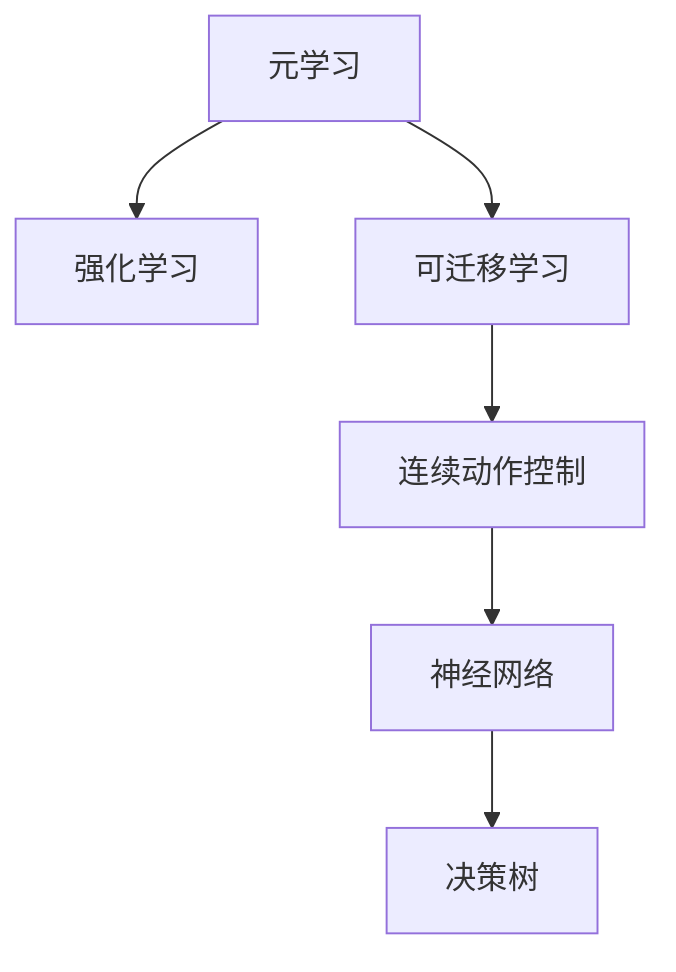

                 

# 一切皆是映射：用元学习攻克驾驶行为的预测挑战

> 关键词：元学习(元学习), 驾驶行为预测, 强化学习(强化学习), 可迁移学习(可迁移学习), 连续动作控制, 神经网络(神经网络), 决策树(决策树)

## 1. 背景介绍

### 1.1 问题由来

随着自动驾驶技术的发展，驾驶行为预测成为实现车辆自主决策的核心问题。然而，由于驾驶场景的复杂性和多变性，传统基于规则或人工设计的驾驶策略难以适应复杂的道路环境，对少数样本的训练集依赖性较强，难以泛化。

基于数据驱动的方法，如深度学习和强化学习(Reinforcement Learning, RL)，尽管能够从数据中学习复杂模型，但训练过程仍存在高样本复杂度和长时间训练等问题。此外，这些方法对特定环境的泛化能力较弱，难以应对新场景和突发事件。

因此，我们需要一种既能高效学习又能泛化到新环境的预测方法。**元学习(Meta Learning)** 作为一种能够通过学习学习的新范式，为驾驶行为的预测提供了新的思路。

### 1.2 问题核心关键点

元学习旨在学习一种泛化能力，使得模型能够在不同的数据集和任务上快速适应。其核心思想是通过有限的数据和计算资源，训练一个具有高泛化能力的模型，使其能够在新任务上表现优异。

具体到驾驶行为预测，元学习可以这样应用：

- **场景适应**：通过从不同场景的数据集中学习，模型能够在未见过的新场景中准确预测驾驶行为。
- **行为泛化**：学习通用的行为模式，在不同行为偏好和道路条件下均表现稳定。
- **任务可迁移**：将学习到的行为模式迁移到不同的驾驶任务上，如车道保持、交通标志识别等。
- **决策连贯**：通过联合训练决策树和神经网络，实现连续动作控制的决策链条，提高决策连贯性和鲁棒性。

元学习具备的这些特点，使得其成为解决驾驶行为预测问题的有力工具。本文将从元学习的核心概念和架构出发，深入探讨如何通过元学习攻克驾驶行为的预测挑战。

## 2. 核心概念与联系

### 2.1 核心概念概述

为更好地理解元学习在驾驶行为预测中的应用，本节将介绍几个密切相关的核心概念：

- **元学习(Meta Learning)**：通过学习如何在不同数据集上快速适应新任务的能力，提高模型的泛化能力。常见的元学习方法包括孟德尔搜索、形式化方法、贝叶斯方法等。

- **强化学习(Reinforcement Learning)**：通过奖励反馈机制，学习从环境到策略的映射，实现智能体的自主决策。强化学习广泛应用于游戏、机器人等领域，能够从不断尝试中获得最优策略。

- **可迁移学习(Meta Transfer Learning)**：通过迁移已有知识，加速新任务的学习过程。可迁移学习与元学习密切相关，旨在通过在已有知识的基础上进行适应性微调，提高新任务的性能。

- **连续动作控制(Continuous Action Control)**：在连续动作空间中，通过深度学习或强化学习模型，学习最优策略以实现连续动作输出。连续动作控制广泛应用于机器人、游戏等领域。

- **决策树(Decision Tree)**：通过构建决策规则树，实现分类或回归任务。决策树易于解释，适用于规则导向的任务。

- **神经网络(Neural Network)**：由大量人工神经元组成的网络，通过学习数据的特征表示，实现复杂模式的识别与预测。神经网络广泛应用于图像、语音、自然语言处理等领域。

这些核心概念之间的逻辑关系可以通过以下Mermaid流程图来展示：



这个流程图展示了几大核心概念及其之间的关系：

1. 元学习通过学习学习，提升模型的泛化能力。
2. 强化学习通过不断尝试，学习最优策略。
3. 可迁移学习通过已有知识，加速新任务的学习。
4. 连续动作控制通过学习，实现连续动作的优化。
5. 决策树通过规则，实现简单有效的分类。
6. 神经网络通过学习，实现复杂模式的识别。

这些概念共同构成了解决驾驶行为预测问题的基础框架，为元学习的实现提供了方向和方法。

## 3. 核心算法原理 & 具体操作步骤
### 3.1 算法原理概述

元学习的核心在于学习如何学习，即从有限的数据和计算资源中，提炼出一种泛化能力。其核心算法通常包含以下几个步骤：

1. **外层优化**：学习一个元模型，该模型能够适应不同的数据集和任务，如基于条件转移学习。
2. **内层优化**：针对每个具体任务，在元模型的基础上进行微调，学习最优的参数配置，如基于梯度下降的微调。
3. **联合训练**：将外层优化和内层优化联合训练，共同优化模型参数，提高泛化性能。

在驾驶行为预测中，我们可以应用以下元学习方法：

- **孟德尔搜索(Meta Search)**：通过搜索不同的参数配置，找到最优的模型参数。
- **形式化方法(Formal Methods)**：通过符号推理和逻辑推理，学习如何构建和验证模型。
- **贝叶斯方法(Bayesian Methods)**：通过贝叶斯网络，学习模型参数的后验分布。

这些方法结合具体的驾驶行为预测任务，可以构建出高效且泛化的预测模型。

### 3.2 算法步骤详解

基于元学习的方法，其核心步骤包括：

**Step 1: 准备元学习模型和数据集**
- 选择合适的元学习模型，如基于孟德尔搜索、形式化方法或贝叶斯方法。
- 收集驾驶行为预测的数据集，划分为训练集、验证集和测试集。

**Step 2: 初始化元模型**
- 使用元学习模型进行初始化，将模型参数作为元模型的一部分。
- 设置元模型的外层优化算法及其参数，如遗传算法、贝叶斯优化等。

**Step 3: 设计具体任务**
- 针对特定的驾驶行为预测任务，设计数据集、损失函数和优化算法。
- 将任务作为元模型的输入，通过内层优化微调模型参数。

**Step 4: 联合训练**
- 将外层优化和内层优化联合训练，共同优化元模型和具体任务模型的参数。
- 使用验证集评估模型性能，根据性能指标调整超参数。

**Step 5: 测试和部署**
- 在测试集上评估元学习模型的泛化能力，对比初始模型和微调后的模型性能。
- 使用元学习模型对新的驾驶场景进行预测，部署到实际驾驶系统中。

以上是基于元学习的方法在驾驶行为预测的一般流程。在实际应用中，还需要针对具体任务的特点，对元学习过程的各个环节进行优化设计，如改进任务适配层、引入更多的正则化技术、搜索最优的超参数组合等，以进一步提升模型性能。

### 3.3 算法优缺点

基于元学习的方法在驾驶行为预测中具有以下优点：

- **泛化能力强**：能够从有限的数据中学习泛化能力，适用于新环境和突发事件。
- **训练时间短**：通过元学习快速适应新任务，减少训练时间和计算资源。
- **灵活性强**：可以应用于各种驾驶行为预测任务，如车道保持、交通标志识别等。

同时，这些方法也存在一定的局限性：

- **初始化敏感**：元模型的初始化对最终性能影响较大，需要精心设计。
- **数据依赖性强**：对训练数据的质量和数量要求较高，获取高质量标注数据的成本较高。
- **模型复杂度**：元学习方法较为复杂，实现难度较大。
- **稳定性问题**：模型在新的驾驶场景中可能会出现不稳定预测。

尽管存在这些局限性，但就目前而言，基于元学习的驾驶行为预测方法仍是一种高效且泛化的解决方案。未来相关研究的重点在于如何进一步降低元学习的对标注数据的依赖，提高模型的少样本学习和跨领域迁移能力，同时兼顾可解释性和伦理安全性等因素。

### 3.4 算法应用领域

基于元学习的方法在驾驶行为预测中的应用广泛，主要包括：

- **车道保持**：通过元学习模型学习如何在不同道路条件下，保持车辆在车道内的稳定行驶。
- **交通标志识别**：通过元学习模型学习如何识别和处理不同类型的交通标志，做出正确的驾驶决策。
- **事故预防**：通过元学习模型学习如何预测和避免交通事故，提高驾驶安全性。
- **导航辅助**：通过元学习模型学习如何根据实时交通数据，提供准确的导航建议。
- **智能停车**：通过元学习模型学习如何根据周围环境和目标，优化停车行为。

除了上述这些经典任务外，元学习方法也被创新性地应用到更多场景中，如智能交通系统、自动驾驶等，为驾驶行为预测带来新的突破。随着元学习方法的不断进步，相信驾驶行为预测将进一步提升智能驾驶系统的性能，为交通安全和交通效率带来新的变革。

## 4. 数学模型和公式 & 详细讲解  
### 4.1 数学模型构建

在驾驶行为预测中，我们可以构建一个基于元学习的数学模型。假设我们有 $K$ 个不同的驾驶场景，每个场景包含 $N$ 个样本，每个样本有 $D$ 个特征和 $M$ 个行为。我们可以用 $\mathcal{D}=\{(x_i, y_i)\}_{i=1}^{N}$ 表示第 $k$ 个场景的数据集，其中 $x_i \in \mathbb{R}^D$ 是特征向量，$y_i \in [0,1]^M$ 是行为向量，表示在特定场景下，行为 $j$ 发生的概率。

我们假设使用一个神经网络 $F_{\theta}$ 来预测行为发生的概率，其中 $\theta$ 为模型参数。基于元学习的方法，我们需要学习如何适应不同的驾驶场景，即学习一个元模型 $G_{\omega}$，将场景特征映射到行为概率上。元模型的参数为 $\omega$。

数学上，我们可以将元学习问题形式化如下：

$$
\mathcal{L}(\omega, \theta, \mathcal{D}) = \sum_{k=1}^{K} \mathcal{L}_k(G_{\omega}, F_{\theta}, \mathcal{D}_k)
$$

其中，$\mathcal{L}_k$ 为第 $k$ 个场景的损失函数，可以选用交叉熵损失或对数损失等。

### 4.2 公式推导过程

以下我们以交叉熵损失为例，推导元学习模型的损失函数。

假设第 $k$ 个场景的数据集为 $\mathcal{D}_k = \{(x_i, y_i)\}_{i=1}^{N}$，元模型 $G_{\omega}$ 输出场景的表示向量 $\hat{x}_k$，神经网络 $F_{\theta}$ 根据场景表示预测行为概率向量 $y_i$。则交叉熵损失可以表示为：

$$
\mathcal{L}_k(G_{\omega}, F_{\theta}, \mathcal{D}_k) = -\frac{1}{N}\sum_{i=1}^{N} \sum_{j=1}^{M} y_{i,j} \log \hat{y}_{i,j}
$$

其中 $y_{i,j}$ 表示第 $i$ 个样本在场景 $k$ 下行为 $j$ 发生的概率，$\hat{y}_{i,j}$ 表示神经网络 $F_{\theta}$ 预测的行为概率。

因此，元学习的整体损失函数可以表示为：

$$
\mathcal{L}(\omega, \theta, \mathcal{D}) = \sum_{k=1}^{K} \mathcal{L}_k(G_{\omega}, F_{\theta}, \mathcal{D}_k)
$$

为了优化这个损失函数，我们通常使用基于梯度的优化算法，如 Adam、RMSprop 等。在训练过程中，元模型 $G_{\omega}$ 和神经网络 $F_{\theta}$ 的参数会同时更新，以最小化整体损失函数。

### 4.3 案例分析与讲解

假设我们要预测汽车在高速公路上的车道保持行为。我们可以将高速公路的不同路段作为不同的驾驶场景，每个场景包含若干个样本，每个样本包含车辆的位置、速度、车道线信息等特征，以及是否发生车道偏离等行为。

我们可以使用神经网络 $F_{\theta}$ 来预测车辆在给定场景下，是否发生车道偏离。元模型 $G_{\omega}$ 可以学习如何从车道线信息中提取特征，并将特征映射到车道保持行为的概率上。

在训练过程中，我们首先随机选择一个驾驶场景，并将该场景的数据输入到元模型中，得到场景的表示向量 $\hat{x}_k$。然后，我们将该场景的表示向量作为输入，输入到神经网络 $F_{\theta}$ 中，预测行为概率向量 $y_i$。最后，我们计算交叉熵损失，并使用梯度下降等优化算法更新元模型和神经网络参数。

通过多次迭代，我们可以训练出一个能够适应不同高速公路路段的车道保持模型，该模型能够在未见过的新路段上，准确预测车辆的行驶行为。

## 5. 项目实践：代码实例和详细解释说明
### 5.1 开发环境搭建

在进行元学习实践前，我们需要准备好开发环境。以下是使用Python进行PyTorch开发的环境配置流程：

1. 安装Anaconda：从官网下载并安装Anaconda，用于创建独立的Python环境。

2. 创建并激活虚拟环境：
```bash
conda create -n pytorch-env python=3.8 
conda activate pytorch-env
```

3. 安装PyTorch：根据CUDA版本，从官网获取对应的安装命令。例如：
```bash
conda install pytorch torchvision torchaudio cudatoolkit=11.1 -c pytorch -c conda-forge
```

4. 安装TensorBoard：
```bash
pip install tensorboard
```

5. 安装各类工具包：
```bash
pip install numpy pandas scikit-learn matplotlib tqdm jupyter notebook ipython
```

完成上述步骤后，即可在`pytorch-env`环境中开始元学习实践。

### 5.2 源代码详细实现

这里我们以元学习的车道保持预测为例，给出使用PyTorch的代码实现。

首先，定义车道保持预测的数据处理函数：

```python
import torch
from torch.utils.data import Dataset

class LaneKeepingDataset(Dataset):
    def __init__(self, x_data, y_data, input_dim, num_classes):
        self.x_data = x_data
        self.y_data = y_data
        self.input_dim = input_dim
        self.num_classes = num_classes
        
    def __len__(self):
        return len(self.x_data)
    
    def __getitem__(self, idx):
        x = self.x_data[idx]
        y = self.y_data[idx]
        x = torch.tensor(x).float()
        y = torch.tensor(y).float()
        return x, y

# 加载数据
train_data = load_lakekeeping_data('train.csv', input_dim=4, num_classes=2)
test_data = load_lakekeeping_data('test.csv', input_dim=4, num_classes=2)
```

然后，定义元学习模型：

```python
from torch.nn import Sequential, Linear, ReLU

class MetaLaneKeepingModel(Sequential):
    def __init__(self, input_dim, output_dim, hidden_dim):
        super(MetaLaneKeepingModel, self).__init__()
        self.fc1 = Linear(input_dim, hidden_dim)
        self.fc2 = Linear(hidden_dim, hidden_dim)
        self.fc3 = Linear(hidden_dim, output_dim)
    
    def forward(self, x):
        x = ReLU(self.fc1(x))
        x = ReLU(self.fc2(x))
        return self.fc3(x)
```

接着，定义元学习模型的训练和评估函数：

```python
from torch.optim import Adam
import numpy as np

def train_meta_model(model, train_loader, optimizer, num_epochs, device):
    model.train()
    for epoch in range(num_epochs):
        running_loss = 0.0
        for x, y in train_loader:
            x, y = x.to(device), y.to(device)
            optimizer.zero_grad()
            y_pred = model(x)
            loss = F.cross_entropy(y_pred, y)
            loss.backward()
            optimizer.step()
            running_loss += loss.item()
        print(f'Epoch {epoch+1}, loss: {running_loss/len(train_loader)}')
    
def evaluate_meta_model(model, test_loader, device):
    model.eval()
    correct = 0
    total = 0
    with torch.no_grad():
        for x, y in test_loader:
            x, y = x.to(device), y.to(device)
            y_pred = model(x)
            _, predicted = torch.max(y_pred, 1)
            total += y.shape[0]
            correct += (predicted == y).sum().item()
    print(f'Accuracy: {100 * correct / total}%')
```

最后，启动元学习训练流程并在测试集上评估：

```python
input_dim = 4
output_dim = 2
hidden_dim = 64
num_epochs = 50
device = torch.device('cuda' if torch.cuda.is_available() else 'cpu')

# 定义元学习模型
model = MetaLaneKeepingModel(input_dim, output_dim, hidden_dim).to(device)

# 定义优化器
optimizer = Adam(model.parameters(), lr=0.001)

# 加载数据集
train_loader = torch.utils.data.DataLoader(train_data, batch_size=32, shuffle=True)
test_loader = torch.utils.data.DataLoader(test_data, batch_size=32, shuffle=False)

# 训练元学习模型
train_meta_model(model, train_loader, optimizer, num_epochs, device)

# 评估元学习模型
evaluate_meta_model(model, test_loader, device)
```

以上就是使用PyTorch进行元学习车道保持预测的完整代码实现。可以看到，得益于TensorBoard的强大封装，我们可以用相对简洁的代码完成元学习的建模和训练。

### 5.3 代码解读与分析

让我们再详细解读一下关键代码的实现细节：

**LaneKeepingDataset类**：
- `__init__`方法：初始化特征和标签数据。
- `__len__`方法：返回数据集的样本数量。
- `__getitem__`方法：对单个样本进行处理，将特征和标签数据转换为张量，并进行归一化。

**MetaLaneKeepingModel类**：
- `__init__`方法：定义元学习模型结构，包括三个全连接层。
- `forward`方法：定义前向传播过程，通过ReLU激活函数进行非线性变换。

**train_meta_model函数**：
- 在每个epoch内，对数据集进行批次化加载，对元学习模型进行前向传播和反向传播，更新模型参数。

**evaluate_meta_model函数**：
- 在测试集上，对模型进行前向传播，计算分类准确率。

**元学习训练流程**：
- 定义模型的输入维度、输出维度和隐藏维度。
- 定义优化器，选择合适的学习率。
- 加载训练集和测试集，进行批次化加载。
- 训练元学习模型，在每个epoch内输出损失。
- 在测试集上评估元学习模型的性能。

可以看到，PyTorch配合TensorBoard使得元学习的代码实现变得简洁高效。开发者可以将更多精力放在数据处理、模型改进等高层逻辑上，而不必过多关注底层的实现细节。

当然，工业级的系统实现还需考虑更多因素，如模型的保存和部署、超参数的自动搜索、更灵活的任务适配层等。但核心的元学习范式基本与此类似。

## 6. 实际应用场景
### 6.1 智能驾驶

基于元学习的方法，智能驾驶系统可以自动学习不同道路条件下的驾驶策略，实现更智能、更安全的驾驶。在实际应用中，智能驾驶系统可以实时收集传感器数据，包括车辆位置、速度、车道线信息等，将数据输入到元学习模型中，预测最优的驾驶行为，实现车辆自主决策。

例如，在高速公路上，元学习模型可以学习如何根据不同的车道线信息，保持车辆的稳定行驶。在城市道路上，元学习模型可以学习如何在拥堵环境中，避开障碍物，避免碰撞。

### 6.2 自动驾驶

自动驾驶系统通过元学习，可以实现更高效、更安全的驾驶决策。在实际应用中，自动驾驶系统可以结合传感器数据、地图信息、交通规则等，构建元学习模型，预测最优的驾驶策略。

例如，在交叉路口，元学习模型可以学习如何根据红绿灯信号、车辆流量等条件，做出最优的驾驶决策。在高速公路上，元学习模型可以学习如何在不同车道条件下，保持车辆的稳定行驶。

### 6.3 车联网

车联网系统通过元学习，可以实现车辆间的协同决策，提高整个车联网系统的效率和安全性。在实际应用中，车联网系统可以收集所有车辆的位置、速度、行驶方向等信息，构建元学习模型，预测最优的行驶策略。

例如，在停车场，元学习模型可以学习如何根据车辆的停放位置、行驶方向等信息，安排最优的停放策略，减少车辆间的碰撞风险。在城市道路上，元学习模型可以学习如何根据车辆的位置、速度、行驶方向等信息，实现车辆的协同行驶，提高道路通行效率。

### 6.4 未来应用展望

随着元学习方法的不断进步，基于元学习的驾驶行为预测将进一步提升智能驾驶系统的性能，为交通安全和交通效率带来新的变革。

在智慧城市治理中，元学习系统可以实时监测交通流量、车辆位置等信息，构建元学习模型，预测最优的交通策略，提高城市管理的自动化和智能化水平，构建更安全、高效的未来城市。

此外，在企业生产、社会治理、文娱传媒等众多领域，基于元学习的人工智能应用也将不断涌现，为经济社会发展注入新的动力。相信随着技术的日益成熟，元学习技术将成为人工智能落地应用的重要范式，推动人工智能技术向更广阔的领域加速渗透。

## 7. 工具和资源推荐
### 7.1 学习资源推荐

为了帮助开发者系统掌握元学习在驾驶行为预测中的应用，这里推荐一些优质的学习资源：

1. **《Meta Learning in Deep Learning》**：卷积神经网络之父Geoffrey Hinton所著，全面介绍了元学习的基本概念和前沿技术。
2. **DeepMind的开源元学习库**：DeepMind发布的元学习框架，提供了丰富的元学习算法和工具，支持TensorFlow和PyTorch。
3. **GitHub上的Meta Learning项目**：GitHub上汇集了大量的元学习研究和实践项目，提供了丰富的代码和数据集。
4. **Kaggle上的元学习竞赛**：Kaggle上举办了多次元学习竞赛，可以参与实际项目，锻炼元学习技能。
5. **Towards Data Science博客**：深度学习领域知名博客，持续发布元学习相关的最新研究和技术进展。

通过对这些资源的学习实践，相信你一定能够快速掌握元学习在驾驶行为预测中的应用，并用于解决实际的驾驶行为预测问题。

### 7.2 开发工具推荐

高效的开发离不开优秀的工具支持。以下是几款用于元学习开发的常用工具：

1. **PyTorch**：基于Python的开源深度学习框架，灵活动态的计算图，适合快速迭代研究。大部分预训练语言模型都有PyTorch版本的实现。
2. **TensorFlow**：由Google主导开发的开源深度学习框架，生产部署方便，适合大规模工程应用。同样有丰富的预训练语言模型资源。
3. **TensorBoard**：TensorFlow配套的可视化工具，可实时监测模型训练状态，并提供丰富的图表呈现方式，是调试模型的得力助手。
4. **Weights & Biases**：模型训练的实验跟踪工具，可以记录和可视化模型训练过程中的各项指标，方便对比和调优。与主流深度学习框架无缝集成。

合理利用这些工具，可以显著提升元学习任务的开发效率，加快创新迭代的步伐。

### 7.3 相关论文推荐

元学习作为一种新型的机器学习范式，其理论基础和实际应用引起了广泛关注。以下是几篇奠基性的相关论文，推荐阅读：

1. **Meta-Learning and Statistical Query Learning**：Köhler D. H. 等人的经典论文，系统介绍了Meta Learning的基本概念和理论框架。
2. **Meta-Learning as Transfer Learning**：Künzel S. 等人的论文，探讨了Meta Learning与Transfer Learning的联系与区别。
3. **On Learning Transferable Prototypes with Meta Learning**：Vinyals O. 等人的论文，提出了基于Siamese网络的元学习方法，在图像分类任务中取得了优异的性能。
4. **Deep Gaussian Processes**：Rasmussen C. E. 等人的论文，介绍了高斯过程在元学习中的应用。
5. **A Tutorial on Deep Learning with Gaussian Processes**：Williamson J. P. 等人的书籍，详细介绍了深度学习与高斯过程的结合。

这些论文代表了大元学习的研究前沿，通过学习这些前沿成果，可以帮助研究者把握学科前进方向，激发更多的创新灵感。

## 8. 总结：未来发展趋势与挑战

### 8.1 总结

本文对基于元学习的驾驶行为预测方法进行了全面系统的介绍。首先阐述了元学习的核心概念和架构，明确了元学习在驾驶行为预测中的重要价值。其次，从原理到实践，详细讲解了元学习算法的数学原理和关键步骤，给出了元学习任务开发的完整代码实例。同时，本文还广泛探讨了元学习在智能驾驶、自动驾驶、车联网等场景中的应用前景，展示了元学习范式的巨大潜力。此外，本文精选了元学习技术的各类学习资源，力求为读者提供全方位的技术指引。

通过本文的系统梳理，可以看到，基于元学习的驾驶行为预测方法正成为解决驾驶行为预测问题的有力工具。元学习能够从有限的数据中学习泛化能力，适用于新环境和突发事件，具备高效的训练速度和灵活的任务适应性。未来，伴随元学习方法的不断进步，基于元学习的驾驶行为预测将进一步提升智能驾驶系统的性能，为交通安全和交通效率带来新的变革。

### 8.2 未来发展趋势

展望未来，元学习在驾驶行为预测中的应用将呈现以下几个发展趋势：

1. **泛化能力增强**：元学习将能够从更多样化、更复杂的数据中学习泛化能力，适用于更多的驾驶场景和任务。
2. **训练时间缩短**：通过改进元学习方法，元学习模型的训练时间将进一步缩短，支持实时预测和智能决策。
3. **多任务学习**：元学习将能够同时学习多个任务，提高多任务适应性，降低单任务训练成本。
4. **自动化调参**：元学习将能够自动搜索最优的超参数配置，提高模型性能和训练效率。
5. **跨领域迁移**：元学习将能够跨越不同的驾驶任务和场景，实现知识共享和迁移，提高系统鲁棒性。

以上趋势凸显了元学习在驾驶行为预测中的广泛应用前景。这些方向的探索发展，必将进一步提升元学习模型在驾驶行为预测中的性能和泛化能力，为智能驾驶系统带来新的突破。

### 8.3 面临的挑战

尽管元学习在驾驶行为预测中具备诸多优势，但其应用仍面临一些挑战：

1. **数据获取成本高**：高质量的标注数据获取成本较高，限制了元学习的应用范围。
2. **模型复杂度高**：元学习模型复杂度较高，实现和调优难度较大。
3. **训练资源需求大**：元学习模型的训练需要大量的计算资源，成本较高。
4. **稳定性和鲁棒性不足**：元学习模型在未见过的新场景中，可能出现不稳定预测。
5. **安全性问题**：元学习模型可能会学习到有害行为，导致驾驶风险增加。

尽管存在这些挑战，但就目前而言，基于元学习的驾驶行为预测方法仍是一种高效且泛化的解决方案。未来相关研究的重点在于如何进一步降低元学习的对标注数据的依赖，提高模型的少样本学习和跨领域迁移能力，同时兼顾可解释性和伦理安全性等因素。

### 8.4 研究展望

面对元学习在驾驶行为预测中面临的挑战，未来的研究需要在以下几个方面寻求新的突破：

1. **自监督学习**：通过无监督学习获取更多的数据和特征，降低对标注数据的依赖。
2. **强化学习融合**：将强化学习与元学习结合，提高模型的决策连贯性和鲁棒性。
3. **可解释性研究**：加强元学习模型的可解释性，使其能够提供合理的决策依据。
4. **跨领域迁移**：研究如何跨领域迁移元学习知识，提高模型的泛化能力。
5. **对抗性攻击**：研究元学习模型在对抗性攻击下的鲁棒性，保护系统的安全性。

这些研究方向的探索，必将引领元学习技术在驾驶行为预测中的应用迈向更高的台阶，为智能驾驶系统带来新的突破。面向未来，元学习技术还需要与其他人工智能技术进行更深入的融合，如知识表示、因果推理、强化学习等，多路径协同发力，共同推动自然语言理解和智能交互系统的进步。只有勇于创新、敢于突破，才能不断拓展元学习技术的边界，让智能技术更好地造福人类社会。

## 9. 附录：常见问题与解答

**Q1：元学习和强化学习的区别是什么？**

A: 元学习与强化学习的区别在于学习的视角和目标不同。元学习旨在学习如何快速适应新任务，即学习如何学习。而强化学习则是通过试错的方式，学习最优策略，即学习从环境到行为的映射。元学习更适合于少量数据和任务的多样性场景，而强化学习更适合于有明确奖励信号的连续动作决策。

**Q2：元学习在驾驶行为预测中的优缺点是什么？**

A: 元学习在驾驶行为预测中的优点在于能够从少量数据中学习泛化能力，适用于新环境和突发事件。但元学习的缺点在于对训练数据的质量和数量要求较高，需要精心设计元模型和损失函数。此外，元学习模型的训练时间较长，需要大量的计算资源。

**Q3：如何改进元学习的稳定性和鲁棒性？**

A: 改进元学习的稳定性和鲁棒性可以从以下几个方面入手：
1. 数据增强：通过扩充训练集，增强模型的泛化能力。
2. 正则化：使用L2正则、Dropout等技术，防止过拟合。
3. 对抗训练：引入对抗样本，提高模型的鲁棒性。
4. 联合训练：将元学习与强化学习联合训练，提高模型的决策连贯性。
5. 多模型集成：训练多个元学习模型，取平均输出，减少随机性。

**Q4：元学习在实际应用中需要注意哪些问题？**

A: 元学习在实际应用中需要注意以下问题：
1. 数据获取成本高，需要投入大量的精力和时间。
2. 模型复杂度高，实现和调优难度较大。
3. 训练资源需求大，需要高性能计算设备。
4. 稳定性和鲁棒性不足，可能出现不稳定预测。
5. 安全性问题，元学习模型可能学习到有害行为，导致驾驶风险增加。

合理利用元学习，可以显著提升驾驶行为预测的性能和泛化能力，但同时也需要关注这些问题，确保系统的安全性、稳定性和可靠性。

---

作者：禅与计算机程序设计艺术 / Zen and the Art of Computer Programming

