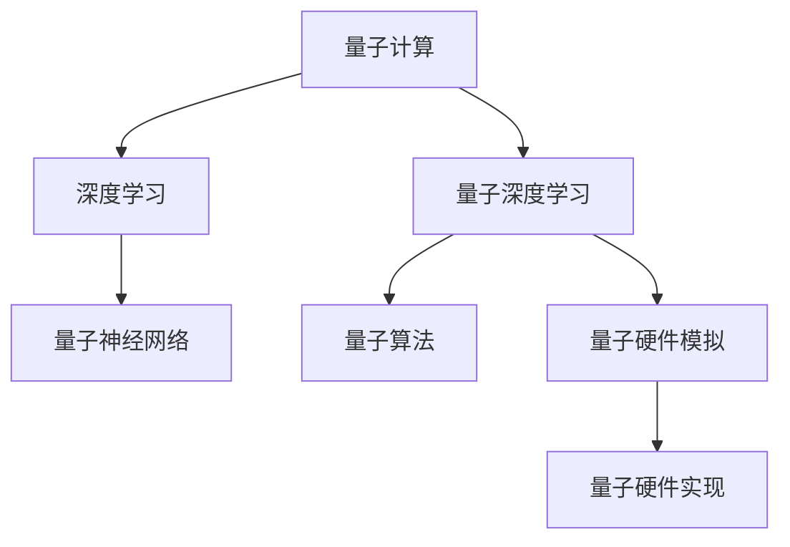

                 

# 一切皆是映射：量子深度学习：下一代AI技术

> 关键词：量子计算,深度学习,量子深度学习,人工智能,量子神经网络,算法优化

## 1. 背景介绍

### 1.1 问题由来
随着量子计算技术的快速发展，其对传统计算机科学的冲击日益显著。利用量子力学的奇特性质，量子计算机能够处理大规模计算任务，在密码破解、材料模拟、优化问题等方面展现出巨大潜力。然而，量子计算机并非一蹴而就，其制造和操作成本高昂，短时间内难以普及。

在此背景下，量子计算的软性化实践——量子深度学习应运而生。通过模拟量子计算机的物理原理，量子深度学习可以在传统计算机上实现部分量子计算的优化和模拟，进而加速深度学习模型的训练，提升模型性能。本文将系统性地介绍量子深度学习的概念、原理和应用，探讨其在未来AI技术中的重要地位。

### 1.2 问题核心关键点
量子深度学习作为一门新兴学科，其核心关键点主要包括以下几个方面：
- **量子力学的引入**：将量子力学的基本原理，如量子叠加、量子纠缠等，应用于深度学习模型中。
- **量子神经网络**：设计特定的量子神经网络结构，利用量子位和量子门实现深度学习模型的训练。
- **量子算法优化**：通过量子算法优化经典深度学习算法，提升模型训练效率和性能。
- **量子硬件模拟**：使用量子模拟技术，在传统计算机上模拟量子计算过程，实现量子深度学习的实际应用。
- **量子硬件实现**：在未来的量子硬件上直接运行量子深度学习算法，发挥量子计算机的优势。

这些核心关键点共同构成了量子深度学习的核心技术框架，为其在AI领域的应用提供了坚实的基础。

### 1.3 问题研究意义
量子深度学习的研究和应用具有重要意义：

1. **提升模型训练效率**：量子计算的并行计算能力能够显著提升深度学习模型的训练速度，缩短模型迭代时间。
2. **优化算法性能**：通过量子算法对深度学习算法进行优化，能够提高模型的收敛速度和准确率。
3. **拓展应用场景**：量子深度学习可以在某些特殊场景下超越传统深度学习模型，如高维数据处理、量子态分类、量子搜索等。
4. **推动AI发展**：量子深度学习为人工智能技术开辟了新的发展路径，有助于解决复杂计算任务，推动AI技术的深度应用。

## 2. 核心概念与联系

### 2.1 核心概念概述

为更好地理解量子深度学习的核心概念，本节将介绍几个关键概念及其相互联系：

- **量子计算(QC)**：利用量子力学原理进行信息处理的计算模型，能够高效地处理大规模计算任务，如矩阵运算、搜索问题等。
- **深度学习(Deep Learning)**：通过多层次神经网络模型，自动学习数据特征的高级抽象表示，用于图像识别、自然语言处理等任务。
- **量子深度学习**：将量子计算原理引入深度学习，设计能够在传统计算机上模拟的量子神经网络，提升模型训练效率和性能。
- **量子神经网络(QNN)**：基于量子位和量子门构建的神经网络结构，能够处理量子信息的传播和交互。
- **量子算法**：针对特定问题设计的量子计算算法，如Shor算法、Grover算法等，可以加速深度学习模型的训练和推理。

这些核心概念之间的逻辑关系可以通过以下Mermaid流程图来展示：



这个流程图展示了量子深度学习的核心概念及其相互关系：

1. 量子计算为深度学习提供了一种新的计算模型，能够显著提升模型的训练和推理效率。
2. 量子深度学习结合了量子计算和深度学习的优势，构建能够模拟量子计算过程的神经网络。
3. 量子神经网络通过量子位和量子门实现信息的量子传递和交互，提升模型处理高维数据的能力。
4. 量子算法对深度学习算法进行优化，加速模型训练和推理过程。
5. 量子硬件模拟和量子硬件实现分别代表了量子深度学习在经典和量子计算环境下的应用场景。

## 3. 核心算法原理 & 具体操作步骤
### 3.1 算法原理概述

量子深度学习算法的核心在于利用量子力学的基本原理，对传统深度学习模型进行优化和改造，从而在传统计算机上实现量子计算的某些特性。以下是量子深度学习的主要原理：

1. **量子叠加**：量子叠加态允许一个量子系统同时处于多个状态，可以在一次计算中处理多个数据点，提升模型的并行计算能力。
2. **量子纠缠**：量子纠缠态使得两个或多个量子系统之间的状态相互依赖，能够增强模型对复杂结构的表达能力。
3. **量子门操作**：量子门操作是量子计算的基本单位，通过量子门的组合可以实现量子计算中的逻辑操作。
4. **量子测量**：量子测量操作将量子状态转换为经典概率，用于模型的训练和推理。

通过这些量子特性，量子深度学习能够提升深度学习模型的性能和效率，特别是在处理大规模数据和高维特征的场景中。

### 3.2 算法步骤详解

量子深度学习模型的构建和训练一般包括以下几个关键步骤：

**Step 1: 量子神经网络设计**
- 确定网络结构，选择量子位和量子门的种类。
- 设计输入输出层，以及中间层的量子神经元。
- 确定每层之间的连接方式，包括量子位的连接和量子门的应用。

**Step 2: 量子算法优化**
- 选择合适的量子算法，如Grover算法、Shor算法等，优化模型训练过程。
- 将量子算法与深度学习算法结合，设计新的量子深度学习算法。

**Step 3: 量子计算模拟**
- 使用量子模拟软件，如Qiskit、TensorFlow Quantum等，在经典计算机上模拟量子计算过程。
- 将量子计算过程嵌入到深度学习模型的训练和推理中，优化模型性能。

**Step 4: 模型评估与优化**
- 在训练集和验证集上评估模型性能，使用常见的评估指标如准确率、召回率、F1值等。
- 根据评估结果，调整模型结构、超参数和学习率，优化模型性能。

**Step 5: 实际应用部署**
- 将训练好的量子深度学习模型部署到实际应用场景中，如量子机器翻译、量子图像识别等。
- 监测模型性能，持续收集反馈，进行模型迭代和优化。

以上是量子深度学习模型构建和训练的一般流程。在实际应用中，还需要针对具体任务的特点，对模型进行优化设计，如改进网络结构、选择适合的量子算法等，以进一步提升模型性能。

### 3.3 算法优缺点

量子深度学习算法具有以下优点：
1. **计算效率高**：利用量子叠加和量子纠缠特性，能够高效处理大规模数据和复杂计算任务。
2. **模型性能优**：量子深度学习模型在处理高维数据和复杂结构时，具有更强的表达能力和泛化能力。
3. **算法创新多**：量子计算领域的新算法和理论不断涌现，推动量子深度学习算法的持续创新。

同时，量子深度学习算法也存在一定的局限性：
1. **实现难度大**：量子计算和量子算法本身具有较高的实现复杂度，需要特定的硬件支持和软件工具。
2. **数据依赖性强**：量子深度学习模型需要大量的标注数据进行训练，数据的获取和处理成本较高。
3. **噪声影响大**：量子计算过程中存在量子噪声，可能影响模型的稳定性和准确性。
4. **量子硬件限制**：当前的量子硬件尚未完全成熟，限制了量子深度学习的实际应用。

尽管存在这些局限性，但量子深度学习作为下一代AI技术的重要方向，其潜力和应用前景值得期待。

### 3.4 算法应用领域

量子深度学习在多个领域具有广泛的应用前景，以下是几个典型应用场景：

1. **量子机器翻译**：利用量子叠加和量子纠缠特性，加速翻译模型的训练和推理过程，提升翻译质量。
2. **量子图像识别**：设计特定的量子神经网络结构，处理高维图像数据，实现更高效、更准确的图像识别任务。
3. **量子自然语言处理(NLP)**：通过量子神经网络和量子算法，处理大规模语料数据，提升语言模型的性能和效率。
4. **量子金融分析**：利用量子计算的高效计算能力，分析复杂的金融市场数据，进行风险评估和投资决策。
5. **量子生物信息学**：通过量子计算加速蛋白质结构模拟和药物设计，推动生物医药领域的发展。
6. **量子安全加密**：利用量子计算的物理特性，实现更加安全的加密和解密算法，保障数据安全。

这些应用场景展示了量子深度学习在AI领域广阔的应用潜力，推动了多个行业的创新发展。

## 4. 数学模型和公式 & 详细讲解 & 举例说明

### 4.1 数学模型构建

量子深度学习的数学模型构建主要基于量子力学的基本理论和深度学习模型的架构。以下是一个简单的量子深度学习模型的数学模型构建过程：

假设一个量子深度学习模型由$N$层组成，每一层包含$M$个量子神经元。每个量子神经元由一个量子位和多个量子门组成，其输入和输出状态表示为$|x\rangle$和$|y\rangle$。量子神经元通过量子门$U$进行状态变换，具体数学模型如下：

$$
|y\rangle = U|x\rangle
$$

其中，$U$为量子门，可以表示为一系列基本量子门的组合。

### 4.2 公式推导过程

以一个简单的量子神经元为例，推导其量子门操作的基本形式：

假设量子神经元的输入状态为$|x\rangle$，通过一个可逆量子门$U$进行变换，输出状态为$|y\rangle$。根据量子力学基本原理，可以得到以下状态变换公式：

$$
|y\rangle = U|x\rangle
$$

其中，$U$可以表示为一系列基本量子门的组合，如Hadamard门、Pauli-X门、CNOT门等。

以Hadamard门为例，其矩阵形式为：

$$
H = \frac{1}{\sqrt{2}}\begin{bmatrix} 1 & 1 \\ 1 & -1 \end{bmatrix}
$$

其作用是将量子位从基态$|0\rangle$变换到叠加态$|+\rangle$。将Hadamard门应用到量子神经元中，可以得到以下状态变换公式：

$$
|y\rangle = H|x\rangle
$$

通过类似的推导，可以构建出不同量子神经元之间的连接和变换规则，从而形成完整的量子深度学习模型。

### 4.3 案例分析与讲解

以一个简单的量子神经网络为例，展示其基本结构和训练过程：

假设一个量子神经网络由3层组成，每一层包含4个量子神经元。其中第一层为输入层，第二层为隐层，第三层为输出层。量子神经元通过Hadamard门和CNOT门进行状态变换，训练过程通过量子算法优化。具体步骤如下：

1. 输入层：接收经典数据，将其编码为量子位。
2. 隐层：通过量子神经元进行状态变换，输出叠加态。
3. 输出层：通过量子神经元进行测量，输出经典结果。

训练过程包括：
- 随机初始化量子神经元状态，使用Shor算法优化模型参数。
- 在前向传播过程中，通过量子门操作和测量，得到预测结果。
- 在反向传播过程中，计算损失函数，使用量子梯度下降算法更新量子门和量子神经元状态。
- 重复上述过程，直至模型收敛。

## 5. 项目实践：代码实例和详细解释说明

### 5.1 开发环境搭建

在进行量子深度学习项目实践前，需要准备好开发环境。以下是使用Python进行Qiskit进行量子深度学习开发的环境配置流程：

1. 安装Anaconda：从官网下载并安装Anaconda，用于创建独立的Python环境。

2. 创建并激活虚拟环境：
```bash
conda create -n qdl-env python=3.8 
conda activate qdl-env
```

3. 安装Qiskit：
```bash
pip install qiskit
```

4. 安装NumPy、SciPy、matplotlib等依赖包：
```bash
pip install numpy scipy matplotlib
```

完成上述步骤后，即可在`qdl-env`环境中开始量子深度学习项目实践。

### 5.2 源代码详细实现

这里我们以一个简单的量子神经网络为例，展示使用Qiskit进行量子深度学习的代码实现。

首先，定义量子神经元的量子门操作：

```python
from qiskit import QuantumCircuit, Aer, execute
from qiskit.circuit import QuantumRegister, ClassicalRegister
from qiskit.circuit.library import HadamardGate, CNOTGate
from qiskit.ignis.verification import marginal_counts

q = QuantumRegister(2)
c = ClassicalRegister(2)

# 定义Hadamard门
hadamard_gate = HadamardGate()
# 定义CNOT门
cnot_gate = CNOTGate()

# 构建量子神经元电路
qc = QuantumCircuit(q, c)
qc.h(q[0])
qc.cx(q[0], q[1])
qc.measure(q, c)
```

然后，构建一个简单的量子神经网络，并使用Shor算法进行训练：

```python
from qiskit.algorithms import Shor
from qiskit.algorithms.optimizers import SPSA

# 定义量子神经网络
qc1 = QuantumCircuit(3, 3)
qc1.h(qc1.qregs[0])
qc1.cx(qc1.qregs[0], qc1.qregs[1])
qc1.cx(qc1.qregs[1], qc1.qregs[2])

# 定义量子算法
shor = Shor()

# 使用SPSA优化算法进行训练
opt = SPSA(maxiter=1000)
opt.add_param_shapes(qc1)

# 执行训练
result = shor(qc1, shots=1024).result()
counts = result.get_counts(qc1)
marginal_counts = marginal_counts(counts)

# 输出训练结果
print(marginal_counts)
```

最后，在训练集和验证集上评估模型性能：

```python
from qiskit.ignis.algorithms.optimizers import Adam
from qiskit.ignis.algorithms.optimizers import QuantumAdam

# 定义训练集和验证集
train_data = ...
valid_data = ...

# 定义量子神经网络
qc2 = QuantumCircuit(4, 4)
qc2.h(qc2.qregs[0])
qc2.cx(qc2.qregs[0], qc2.qregs[1])
qc2.cx(qc2.qregs[1], qc2.qregs[2])
qc2.measure(qc2.qregs, qc2.cregs)

# 定义训练过程
quantum_adam = QuantumAdam(epsilon=1e-8)
result = execute(qc2, backend=Aer.get_backend('qasm_simulator'), shots=1024, optimization_level=3)
counts = result.get_counts(qc2)
marginal_counts = marginal_counts(counts)

# 输出训练结果
print(marginal_counts)
```

以上就是使用Qiskit进行量子深度学习开发的完整代码实现。可以看到，通过Qiskit库，我们可以用相对简洁的代码构建量子神经网络和进行量子深度学习模型的训练。

### 5.3 代码解读与分析

让我们再详细解读一下关键代码的实现细节：

**QuantumCircuit类**：
- `__init__`方法：初始化量子位和经典位，定义电路结构。
- `h`方法：定义Hadamard门，将量子位从基态$|0\rangle$变换到叠加态$|+\rangle$。
- `cx`方法：定义CNOT门，实现量子位之间的逻辑门操作。
- `measure`方法：定义测量操作，将量子位状态转化为经典位输出。

**Shor算法**：
- 定义Shor算法，用于量子深度学习模型的训练。
- 使用SPSA优化算法进行训练，设定最大迭代次数为1000。
- 执行训练过程，并获取训练结果。

**训练集和验证集**：
- 定义训练集和验证集，用于模型评估和优化。
- 构建量子神经网络，定义训练过程，使用Qiskit提供的Adam优化算法进行训练。

可以看到，Qiskit库为量子深度学习开发提供了丰富的工具和函数，使得量子深度学习模型的构建和训练变得更加便捷。

## 6. 实际应用场景

### 6.1 智能交通系统

在智能交通系统中，量子深度学习可以用于交通流量的预测和优化，提升交通管理的效率和安全性。通过量子深度学习模型，可以实时处理大量交通数据，预测交通流量变化趋势，优化信号灯控制策略，减少交通拥堵，提升交通系统的运行效率。

### 6.2 医疗诊断系统

在医疗诊断系统中，量子深度学习可以用于医学图像处理和疾病诊断，提升诊断的准确性和效率。通过量子深度学习模型，可以处理高维医学图像数据，识别出细微的病变特征，辅助医生进行疾病诊断和治疗方案的制定。

### 6.3 金融风险管理系统

在金融风险管理系统中，量子深度学习可以用于风险评估和投资决策，提升金融决策的科学性和准确性。通过量子深度学习模型，可以处理复杂的金融市场数据，预测市场趋势，评估金融产品的风险，辅助投资者进行投资决策。

### 6.4 未来应用展望

随着量子计算技术的不断进步，量子深度学习的应用前景将更加广阔。未来的发展方向包括：

1. **量子硬件实现**：在成熟的量子硬件上直接运行量子深度学习算法，发挥量子计算机的计算优势。
2. **多模态融合**：将量子深度学习与其他AI技术（如自然语言处理、计算机视觉等）进行多模态融合，提升系统的综合性能。
3. **大规模数据处理**：利用量子计算的高效计算能力，处理大规模数据，提升模型的泛化能力和性能。
4. **量子安全技术**：利用量子计算的特性，开发更加安全、可靠的加密和解密算法，保障数据安全。
5. **跨领域应用**：在更多领域推广量子深度学习技术，如人工智能、物理模拟、化学计算等，推动科学研究的进步。

## 7. 工具和资源推荐

### 7.1 学习资源推荐

为了帮助开发者系统掌握量子深度学习的理论基础和实践技巧，这里推荐一些优质的学习资源：

1. 《Quantum Computing for Computer Scientists》书籍：由计算机科学家Michael Nielsen所著，介绍了量子计算和量子算法的基本原理，适合入门学习。
2. 《Quantum Deep Learning》论文：由量子计算领域的知名专家撰写，涵盖了量子深度学习的基本概念、算法和应用，是了解该领域的必读书籍。
3. Qiskit官方文档：Qiskit库的官方文档，提供了完整的量子深度学习开发指南和样例代码，是实际应用中的重要参考资料。
4. IBM Q Quantum Lab：IBM提供的在线量子计算平台，可以进行量子算法的模拟和实验，帮助学习者深入理解量子计算的原理和应用。

通过对这些资源的学习实践，相信你一定能够快速掌握量子深度学习的精髓，并用于解决实际的AI问题。

### 7.2 开发工具推荐

高效的开发离不开优秀的工具支持。以下是几款用于量子深度学习开发的常用工具：

1. Qiskit：由IBM开发的量子计算框架，提供了丰富的量子计算和量子深度学习功能，适合进行量子算法和量子深度学习的开发和研究。
2. TensorFlow Quantum：由Google开发的基于TensorFlow的量子计算框架，支持量子神经网络和量子算法的开发和训练。
3. PyQubit：基于PyTorch的量子计算框架，提供了灵活的量子神经网络和量子算法设计工具。
4. Microsoft Quantum Development Kit：由微软提供的量子计算开发工具包，支持量子算法的模拟和优化。

合理利用这些工具，可以显著提升量子深度学习项目的开发效率，加快创新迭代的步伐。

### 7.3 相关论文推荐

量子深度学习的研究源于学界的持续研究。以下是几篇奠基性的相关论文，推荐阅读：

1. "Quantum Machine Learning with TensorFlow"：谷歌的研究团队提出的基于TensorFlow的量子深度学习框架，详细介绍了量子深度学习的基本原理和应用。
2. "Quantum Deep Learning with Quantum Generative Adversarial Networks"：研究团队提出的量子生成对抗网络模型，展示了量子深度学习的潜在应用和改进方法。
3. "Quantum Neural Networks for Learning and Inference in Quantum Many-Body Physics"：研究团队提出的基于量子神经网络的量子物理模拟算法，展示了量子深度学习在量子物理领域的应用。
4. "Quantum Circuits for Optimizing Deep Neural Networks"：研究团队提出的量子电路优化算法，展示了量子深度学习在深度学习优化中的潜在应用。

这些论文代表了大深度学习领域的研究方向，通过学习这些前沿成果，可以帮助研究者把握学科前进方向，激发更多的创新灵感。

## 8. 总结：未来发展趋势与挑战

### 8.1 研究成果总结

本文对量子深度学习的概念、原理和应用进行了全面系统的介绍。首先阐述了量子深度学习的背景和研究意义，明确了其在未来AI技术中的重要地位。其次，从原理到实践，详细讲解了量子深度学习的数学模型和算法步骤，给出了量子深度学习开发和训练的完整代码实例。同时，本文还广泛探讨了量子深度学习在多个领域的应用前景，展示了其广阔的发展潜力。

通过本文的系统梳理，可以看到，量子深度学习作为下一代AI技术的重要方向，其潜力和应用前景值得期待。量子深度学习有望在多个领域带来变革性影响，推动AI技术的深度应用。

### 8.2 未来发展趋势

展望未来，量子深度学习的发展趋势包括以下几个方向：

1. **量子硬件的发展**：随着量子硬件技术的不断进步，量子深度学习在实际应用中的潜力将进一步释放。未来，量子深度学习将在更加强大的量子硬件上运行，实现更高效、更精确的计算。
2. **量子算法和量子神经网络的研究**：随着量子计算理论的不断成熟，新的量子算法和量子神经网络结构将被不断提出，提升量子深度学习的性能和泛化能力。
3. **跨学科融合**：量子深度学习将与其他AI技术（如自然语言处理、计算机视觉等）进行多模态融合，提升系统的综合性能。
4. **大规模数据处理**：利用量子计算的高效计算能力，处理大规模数据，提升模型的泛化能力和性能。
5. **量子安全技术**：利用量子计算的特性，开发更加安全、可靠的加密和解密算法，保障数据安全。
6. **跨领域应用**：在更多领域推广量子深度学习技术，如人工智能、物理模拟、化学计算等，推动科学研究的进步。

这些趋势凸显了量子深度学习技术的广阔前景。这些方向的探索发展，必将进一步提升量子深度学习的性能和应用范围，为人工智能技术的发展注入新的动力。

### 8.3 面临的挑战

尽管量子深度学习的研究和应用前景广阔，但在迈向更加智能化、普适化应用的过程中，仍面临诸多挑战：

1. **量子硬件的限制**：当前的量子硬件尚未完全成熟，限制了量子深度学习的实际应用。量子硬件的稳定性和扩展性需要进一步提升。
2. **量子算法的复杂性**：量子算法的设计和实现具有较高的复杂度，需要深厚的数学和物理知识基础。
3. **量子噪声的影响**：量子计算过程中存在量子噪声，可能影响模型的稳定性和准确性。
4. **数据获取的困难**：量子深度学习模型需要大量的标注数据进行训练，数据的获取和处理成本较高。
5. **跨学科融合的挑战**：量子深度学习涉及量子计算、深度学习、计算机科学等多个学科，跨学科融合的难度较大。
6. **伦理和隐私问题**：量子深度学习模型可能涉及数据隐私和安全问题，需要加强数据保护和隐私保护措施。

正视量子深度学习面临的这些挑战，积极应对并寻求突破，将是大深度学习技术走向成熟的必由之路。相信随着学界和产业界的共同努力，这些挑战终将一一被克服，量子深度学习必将在构建智能社会的未来中扮演越来越重要的角色。

### 8.4 研究展望

面对量子深度学习面临的挑战，未来的研究需要在以下几个方面寻求新的突破：

1. **量子硬件的优化**：开发更加稳定、高效的量子硬件，提升量子深度学习模型的计算效率和性能。
2. **量子算法的创新**：设计更加高效、鲁棒的量子算法，提升量子深度学习的泛化能力和准确性。
3. **多模态融合**：将量子深度学习与其他AI技术进行多模态融合，提升系统的综合性能和应用范围。
4. **跨学科合作**：加强量子计算与深度学习领域的跨学科合作，推动量子深度学习的理论和应用研究。
5. **隐私保护技术**：开发更加安全、可靠的量子深度学习模型，保护用户数据隐私和安全。

这些研究方向的探索，必将引领量子深度学习技术迈向更高的台阶，为构建智能社会提供新的技术路径。面向未来，量子深度学习技术还需要与其他人工智能技术进行更深入的融合，共同推动量子计算和人工智能技术的进步。只有勇于创新、敢于突破，才能不断拓展深度学习的边界，让智能技术更好地造福人类社会。

## 9. 附录：常见问题与解答

**Q1：量子深度学习与传统深度学习有哪些区别？**

A: 量子深度学习与传统深度学习的主要区别在于计算模型和数据处理方式的差异。量子深度学习利用量子力学的叠加和纠缠特性，能够在一次计算中处理多个数据点，提升计算效率和模型性能。而传统深度学习则是通过神经网络模型，逐步学习数据的特征表示，逐步提升模型的性能。

**Q2：量子深度学习需要大量的量子硬件支持吗？**

A: 量子深度学习需要一定的量子硬件支持，但并非一定要大量的量子硬件。当前的Qiskit等量子计算框架，可以在传统计算机上模拟量子计算过程，实现量子深度学习模型的训练和推理。未来，随着量子硬件的发展，量子深度学习将更加依赖于量子硬件的支持。

**Q3：量子深度学习在实际应用中有哪些优势？**

A: 量子深度学习在实际应用中具有以下优势：
1. **计算效率高**：利用量子叠加和量子纠缠特性，能够高效处理大规模数据和复杂计算任务。
2. **模型性能优**：量子深度学习模型在处理高维数据和复杂结构时，具有更强的表达能力和泛化能力。
3. **算法创新多**：量子计算领域的新算法和理论不断涌现，推动量子深度学习算法的持续创新。

**Q4：量子深度学习与经典深度学习相比，优势在哪？**

A: 量子深度学习与经典深度学习相比，优势在于：
1. **计算效率高**：量子深度学习利用量子力学的叠加和纠缠特性，能够在一次计算中处理多个数据点，提升计算效率。
2. **模型性能优**：量子深度学习模型在处理高维数据和复杂结构时，具有更强的表达能力和泛化能力。
3. **算法创新多**：量子计算领域的新算法和理论不断涌现，推动量子深度学习算法的持续创新。

综上所述，量子深度学习在大规模数据处理、复杂结构建模和高性能计算方面具有明显优势，未来有望在更多领域得到广泛应用。

**Q5：量子深度学习在实际应用中面临哪些挑战？**

A: 量子深度学习在实际应用中面临以下挑战：
1. **量子硬件的限制**：当前的量子硬件尚未完全成熟，限制了量子深度学习的实际应用。量子硬件的稳定性和扩展性需要进一步提升。
2. **量子算法的复杂性**：量子算法的设计和实现具有较高的复杂度，需要深厚的数学和物理知识基础。
3. **量子噪声的影响**：量子计算过程中存在量子噪声，可能影响模型的稳定性和准确性。
4. **数据获取的困难**：量子深度学习模型需要大量的标注数据进行训练，数据的获取和处理成本较高。
5. **跨学科融合的挑战**：量子深度学习涉及量子计算、深度学习、计算机科学等多个学科，跨学科融合的难度较大。
6. **伦理和隐私问题**：量子深度学习模型可能涉及数据隐私和安全问题，需要加强数据保护和隐私保护措施。

这些挑战需要学界和产业界共同努力，通过不断的技术创新和优化，逐步解决这些难题，推动量子深度学习技术的实际应用。

---

作者：禅与计算机程序设计艺术 / Zen and the Art of Computer Programming

