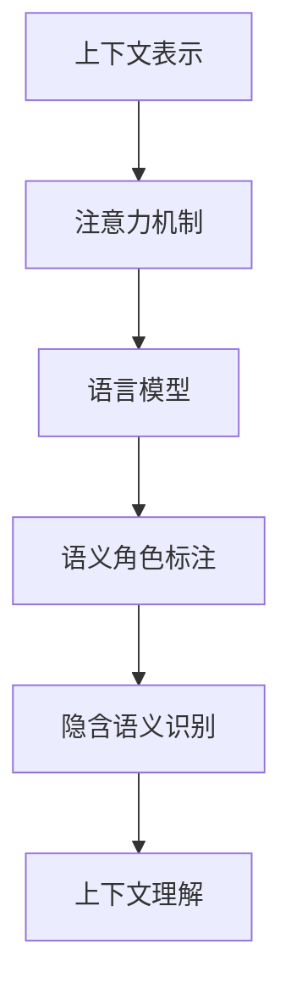

                 

# 上下文理解：LLM 捕捉微妙的语义

## 1. 背景介绍

### 1.1 问题由来

在当今信息爆炸的时代，自然语言处理（Natural Language Processing，NLP）技术的应用日益广泛，从智能客服到机器翻译，从文本生成到对话系统，大语言模型（Large Language Models, LLMs）以其卓越的性能，成为NLP领域的重要驱动力。然而，语言本身是极其复杂和多变的，即使是最先进的语言模型，在处理上下文时也可能显得力不从心。特别是在理解微妙的语义和复杂的情境时，大语言模型面临着巨大的挑战。

### 1.2 问题核心关键点

微妙的语义理解是大语言模型需要攻克的核心问题之一。这种理解不仅依赖于模型对语言的精确把握，还依赖于对上下文信息的深刻洞察。以下是当前大语言模型在语义理解方面存在的主要挑战：

- **多义性和歧义性**：同一句子在不同上下文中可能有完全不同的含义，如“bank”可以是“银行”或“河岸”，这要求模型具备强大的上下文感知能力。
- **长距离依赖**：理解复杂的语境通常需要关注文本中的长距离依赖关系，而这种依赖关系在传统的序列模型中难以捕捉。
- **语义角色识别**：在自然语言中，句子的意义往往由其中的特定词扮演的角色决定，如主语、谓语、宾语等，而识别这些角色需要高精度的上下文理解能力。
- **隐含语义**：很多情况下，语义信息是通过隐含的方式传递的，如反语、双关语等，这要求模型能够敏锐地捕捉这些隐含的微妙之处。

### 1.3 问题研究意义

深入理解大语言模型是如何处理上下文信息，对于提升其语义理解能力具有重要意义：

- **提升应用性能**：通过理解微妙的语义，可以显著提升NLP任务的表现，如对话系统中的语境理解、文本摘要的连贯性等。
- **促进学术研究**：理解上下文理解机制，有助于学术界更好地设计、训练和优化大语言模型，推动NLP技术的持续进步。
- **推动技术落地**：优化上下文理解能力，使得大语言模型能够更贴近实际应用需求，加速其在各行业的应用。
- **促进跨学科交流**：语义理解是大语言模型的核心能力之一，对其深入研究，有助于促进与其他学科（如心理学、逻辑学等）的交流和合作。

## 2. 核心概念与联系

### 2.1 核心概念概述

为了更好地理解大语言模型如何处理上下文信息，需要掌握以下几个核心概念：

- **上下文表示**：大语言模型通常采用自回归或自编码的方式，将输入文本转化为高维向量表示，这种表示中蕴含了丰富的上下文信息。
- **注意力机制**：在自编码模型中，通过注意力机制对输入文本的不同部分进行加权，从而更好地捕捉长距离依赖和局部信息。
- **语言模型**：大语言模型通过在大量无标签文本数据上进行预训练，学习语言的统计特征，能够处理复杂的语义结构。
- **语义角色标注（Semantic Role Labeling, SRL）**：通过对句子中的词进行语义角色标注，可以更好地理解句子中的主谓宾关系，进而提高语义理解能力。
- **隐含语义识别**：通过特殊的提示模板（Prompt），引导大语言模型识别隐含的语义信息，如反语、双关语等。

这些核心概念通过以下Mermaid流程图进行联系：



这个流程图展示了上下文理解在大语言模型中的关键路径，从上下文表示到注意力机制，再到语言模型的训练和应用，最终通过语义角色标注和隐含语义识别，提升模型的上下文理解能力。

## 3. 核心算法原理 & 具体操作步骤

### 3.1 算法原理概述

大语言模型在处理上下文信息时，通常采用自编码或自回归的方式，将输入文本转化为高维向量表示。这种向量表示中蕴含了丰富的上下文信息，模型通过自编码器（如Transformer）中的注意力机制，对输入文本的不同部分进行加权，从而更好地捕捉长距离依赖和局部信息。

具体来说，大语言模型通过以下步骤实现上下文理解：

1. **预训练**：在大规模无标签文本数据上进行预训练，学习语言的统计特征。
2. **编码器-解码器架构**：将输入文本送入编码器，通过注意力机制捕捉上下文信息，然后将编码器输出送入解码器进行生成或分类。
3. **微调**：在特定任务上微调模型，提升其针对具体任务的上下文理解能力。
4. **上下文敏感训练**：通过在训练过程中引入上下文信息，使得模型能够更好地适应新的任务。

### 3.2 算法步骤详解

大语言模型的上下文理解可以通过以下详细步骤实现：

1. **数据准备**：收集并标注训练数据，确保数据质量和多样性。
2. **模型选择**：选择合适的预训练模型，如GPT、BERT等。
3. **预训练**：在大量无标签文本数据上进行预训练，学习语言的通用表示。
4. **编码器-解码器架构**：选择合适的架构（如Transformer），进行编码器和解码器的设计和实现。
5. **微调训练**：在特定任务上微调模型，通过有监督学习优化模型的上下文理解能力。
6. **上下文敏感训练**：在训练过程中引入上下文信息，提升模型的泛化能力。
7. **评估与部署**：在验证集和测试集上评估模型性能，并部署到实际应用中。

### 3.3 算法优缺点

大语言模型在上下文理解方面具有以下优点：

- **强大的泛化能力**：通过预训练，模型能够学习到通用的语言表示，适用于多种自然语言处理任务。
- **灵活的架构设计**：通过不同的架构设计（如Transformer），能够灵活地处理各种上下文信息。
- **丰富的语义表示**：通过高维向量表示，模型能够捕捉复杂的语义结构。

同时，这些模型也存在一些缺点：

- **数据依赖性高**：模型的性能很大程度上依赖于预训练数据的质量和数量，需要大量高质量的标注数据。
- **计算资源需求高**：大语言模型的训练和推理需要大量的计算资源，包括GPU/TPU等高性能设备。
- **难以解释**：大语言模型的决策过程通常缺乏可解释性，难以对其推理逻辑进行分析和调试。

### 3.4 算法应用领域

大语言模型的上下文理解能力，在多个NLP应用领域中得到了广泛应用：

- **问答系统**：通过对用户问题和上下文进行理解，生成精准的回答。
- **文本摘要**：通过上下文理解，生成连贯、准确的摘要。
- **机器翻译**：通过上下文理解，将源语言文本翻译成目标语言。
- **情感分析**：通过上下文理解，准确识别文本中的情感倾向。
- **命名实体识别**：通过上下文理解，识别文本中的实体及其类型。
- **对话系统**：通过上下文理解，生成连贯、自然的对话。

## 4. 数学模型和公式 & 详细讲解 & 举例说明

### 4.1 数学模型构建

在大语言模型的上下文理解中，主要涉及以下几个数学模型：

- **编码器模型**：将输入文本转化为高维向量表示，捕获上下文信息。
- **注意力机制**：对输入文本的不同部分进行加权，捕捉长距离依赖和局部信息。
- **解码器模型**：根据上下文信息，生成或分类输出。

### 4.2 公式推导过程

以下以Transformer模型为例，展示其上下文理解的核心公式：

**编码器自注意力公式**：

$$
\text{Attention}(Q, K, V) = \text{Softmax}(\frac{QK^T}{\sqrt{d_k}})V
$$

其中，$Q$、$K$、$V$分别为查询向量、键向量和值向量，$d_k$为键向量的维度。

**解码器自注意力公式**：

$$
\text{Attention}(Q, K, V) = \text{Softmax}(\frac{QK^T}{\sqrt{d_k}})V
$$

这里的$Q$、$K$、$V$分别表示查询向量、键向量和值向量，$d_k$为键向量的维度。

### 4.3 案例分析与讲解

假设我们要使用Transformer模型进行文本分类任务，输入文本为“I love the book, it's so interesting”，模型通过上下文理解将其分类为正面评价。具体步骤如下：

1. **编码器**：将输入文本“I love the book, it's so interesting”转化为向量表示，通过自注意力机制捕获上下文信息。
2. **解码器**：根据编码器输出，通过自注意力机制和全连接层进行分类，输出分类结果。

在实际应用中，模型还需要通过微调来提升其特定任务的上下文理解能力。以情感分析为例，可以在训练数据集中标注情感标签，通过有监督学习优化模型，使得模型能够更好地识别不同情感的上下文。

## 5. 项目实践：代码实例和详细解释说明

### 5.1 开发环境搭建

在进行上下文理解实践前，我们需要准备好开发环境。以下是使用Python进行PyTorch开发的环境配置流程：

1. 安装Anaconda：从官网下载并安装Anaconda，用于创建独立的Python环境。

2. 创建并激活虚拟环境：
```bash
conda create -n pytorch-env python=3.8 
conda activate pytorch-env
```

3. 安装PyTorch：根据CUDA版本，从官网获取对应的安装命令。例如：
```bash
conda install pytorch torchvision torchaudio cudatoolkit=11.1 -c pytorch -c conda-forge
```

4. 安装Transformers库：
```bash
pip install transformers
```

5. 安装各类工具包：
```bash
pip install numpy pandas scikit-learn matplotlib tqdm jupyter notebook ipython
```

完成上述步骤后，即可在`pytorch-env`环境中开始上下文理解实践。

### 5.2 源代码详细实现

下面我们以情感分析任务为例，给出使用Transformers库对BERT模型进行上下文理解的PyTorch代码实现。

首先，定义情感分析任务的数据处理函数：

```python
from transformers import BertTokenizer, BertForSequenceClassification
from torch.utils.data import Dataset
import torch

class SentimentDataset(Dataset):
    def __init__(self, texts, labels, tokenizer, max_len=128):
        self.texts = texts
        self.labels = labels
        self.tokenizer = tokenizer
        self.max_len = max_len
        
    def __len__(self):
        return len(self.texts)
    
    def __getitem__(self, item):
        text = self.texts[item]
        label = self.labels[item]
        
        encoding = self.tokenizer(text, return_tensors='pt', max_length=self.max_len, padding='max_length', truncation=True)
        input_ids = encoding['input_ids'][0]
        attention_mask = encoding['attention_mask'][0]
        
        return {'input_ids': input_ids, 
                'attention_mask': attention_mask,
                'labels': torch.tensor(label, dtype=torch.long)}
```

然后，定义模型和优化器：

```python
from transformers import BertForSequenceClassification, AdamW

model = BertForSequenceClassification.from_pretrained('bert-base-cased', num_labels=2)

optimizer = AdamW(model.parameters(), lr=2e-5)
```

接着，定义训练和评估函数：

```python
from torch.utils.data import DataLoader
from tqdm import tqdm
from sklearn.metrics import classification_report

device = torch.device('cuda') if torch.cuda.is_available() else torch.device('cpu')
model.to(device)

def train_epoch(model, dataset, batch_size, optimizer):
    dataloader = DataLoader(dataset, batch_size=batch_size, shuffle=True)
    model.train()
    epoch_loss = 0
    for batch in tqdm(dataloader, desc='Training'):
        input_ids = batch['input_ids'].to(device)
        attention_mask = batch['attention_mask'].to(device)
        labels = batch['labels'].to(device)
        model.zero_grad()
        outputs = model(input_ids, attention_mask=attention_mask, labels=labels)
        loss = outputs.loss
        epoch_loss += loss.item()
        loss.backward()
        optimizer.step()
    return epoch_loss / len(dataloader)

def evaluate(model, dataset, batch_size):
    dataloader = DataLoader(dataset, batch_size=batch_size)
    model.eval()
    preds, labels = [], []
    with torch.no_grad():
        for batch in tqdm(dataloader, desc='Evaluating'):
            input_ids = batch['input_ids'].to(device)
            attention_mask = batch['attention_mask'].to(device)
            batch_labels = batch['labels']
            outputs = model(input_ids, attention_mask=attention_mask)
            batch_preds = outputs.logits.argmax(dim=1).to('cpu').tolist()
            batch_labels = batch_labels.to('cpu').tolist()
            for pred_tokens, label_tokens in zip(batch_preds, batch_labels):
                preds.append(pred_tokens[:len(label_tokens)])
                labels.append(label_tokens)
                
    print(classification_report(labels, preds))
```

最后，启动训练流程并在测试集上评估：

```python
epochs = 5
batch_size = 16

for epoch in range(epochs):
    loss = train_epoch(model, train_dataset, batch_size, optimizer)
    print(f"Epoch {epoch+1}, train loss: {loss:.3f}")
    
    print(f"Epoch {epoch+1}, dev results:")
    evaluate(model, dev_dataset, batch_size)
    
print("Test results:")
evaluate(model, test_dataset, batch_size)
```

以上就是使用PyTorch对BERT进行情感分析任务上下文理解的完整代码实现。可以看到，得益于Transformers库的强大封装，我们可以用相对简洁的代码完成BERT模型的加载和上下文理解训练。

### 5.3 代码解读与分析

让我们再详细解读一下关键代码的实现细节：

**SentimentDataset类**：
- `__init__`方法：初始化文本、标签、分词器等关键组件。
- `__len__`方法：返回数据集的样本数量。
- `__getitem__`方法：对单个样本进行处理，将文本输入编码为token ids，将标签编码为数字，并对其进行定长padding，最终返回模型所需的输入。

**训练和评估函数**：
- 使用PyTorch的DataLoader对数据集进行批次化加载，供模型训练和推理使用。
- 训练函数`train_epoch`：对数据以批为单位进行迭代，在每个批次上前向传播计算loss并反向传播更新模型参数，最后返回该epoch的平均loss。
- 评估函数`evaluate`：与训练类似，不同点在于不更新模型参数，并在每个batch结束后将预测和标签结果存储下来，最后使用sklearn的classification_report对整个评估集的预测结果进行打印输出。

**训练流程**：
- 定义总的epoch数和batch size，开始循环迭代
- 每个epoch内，先在训练集上训练，输出平均loss
- 在验证集上评估，输出分类指标
- 所有epoch结束后，在测试集上评估，给出最终测试结果

可以看到，PyTorch配合Transformers库使得BERT上下文理解任务的代码实现变得简洁高效。开发者可以将更多精力放在数据处理、模型改进等高层逻辑上，而不必过多关注底层的实现细节。

当然，工业级的系统实现还需考虑更多因素，如模型的保存和部署、超参数的自动搜索、更灵活的任务适配层等。但核心的上下文理解范式基本与此类似。

## 6. 实际应用场景

### 6.1 智能客服系统

基于大语言模型的上下文理解，智能客服系统可以更准确地理解用户意图，提供更加个性化、自然的对话体验。例如，在处理用户的复杂问题时，系统能够更好地捕捉上下文信息，识别出用户的真实需求，并给出精准的回答。

### 6.2 金融舆情监测

在金融领域，舆情监测系统需要实时分析大量的新闻、评论等文本信息，提取其中的情感倾向和关键信息。基于大语言模型的上下文理解能力，系统可以更准确地识别不同情感的上下文，从而及时预警潜在的金融风险。

### 6.3 个性化推荐系统

个性化推荐系统需要理解用户的真实兴趣和行为，从而推荐最符合其需求的内容。通过上下文理解，系统可以更全面地分析用户的历史行为数据，识别出其兴趣点，提供更精准的推荐内容。

### 6.4 未来应用展望

随着上下文理解技术的不断发展，未来的大语言模型将更加智能化、普适化。以下是一些未来应用展望：

- **跨模态上下文理解**：除了文本数据，大语言模型还将处理图像、视频、语音等多模态数据，提升其在多模态信息融合方面的能力。
- **零样本学习**：通过精心设计的提示模板，大语言模型能够在零样本情况下，理解复杂的语义结构和上下文信息，提供精准的推理和生成。
- **语义推理**：在理解复杂语义结构的基础上，大语言模型将具备更强的语义推理能力，能够在自然语言中进行复杂的逻辑推断。
- **知识图谱融合**：通过将大语言模型与知识图谱相结合，模型将能够更准确地理解文本中的实体和关系，提升其在知识获取和推理方面的能力。

## 7. 工具和资源推荐

### 7.1 学习资源推荐

为了帮助开发者系统掌握大语言模型的上下文理解能力，这里推荐一些优质的学习资源：

1. 《自然语言处理与深度学习》（自然语言处理入门经典教材，详细介绍了NLP的基本概念和经典模型）。
2. 《深度学习理论与实践》（介绍深度学习理论及其实现细节，涵盖多种NLP任务）。
3. 《大规模语言模型》（探讨大语言模型的原理和应用，适合高级读者）。
4. HuggingFace官方文档（Transformer库的官方文档，提供了海量预训练模型和完整的上下文理解样例代码）。
5. 《NLP Cookbook》（详细介绍NLP技术的实现方法和技巧）。

通过对这些资源的学习实践，相信你一定能够系统掌握大语言模型的上下文理解能力，并用于解决实际的NLP问题。

### 7.2 开发工具推荐

高效的开发离不开优秀的工具支持。以下是几款用于上下文理解开发的常用工具：

1. PyTorch：基于Python的开源深度学习框架，灵活动态的计算图，适合快速迭代研究。大部分预训练语言模型都有PyTorch版本的实现。
2. TensorFlow：由Google主导开发的开源深度学习框架，生产部署方便，适合大规模工程应用。同样有丰富的预训练语言模型资源。
3. Transformers库：HuggingFace开发的NLP工具库，集成了多种SOTA语言模型，支持PyTorch和TensorFlow，是进行上下文理解任务的开发利器。
4. Weights & Biases：模型训练的实验跟踪工具，可以记录和可视化模型训练过程中的各项指标，方便对比和调优。
5. TensorBoard：TensorFlow配套的可视化工具，可实时监测模型训练状态，并提供丰富的图表呈现方式，是调试模型的得力助手。

合理利用这些工具，可以显著提升上下文理解任务的开发效率，加快创新迭代的步伐。

### 7.3 相关论文推荐

上下文理解是大语言模型的核心能力之一，其发展源于学界的持续研究。以下是几篇奠基性的相关论文，推荐阅读：

1. Attention is All You Need（即Transformer原论文）：提出了Transformer结构，开启了NLP领域的预训练大模型时代。
2. BERT: Pre-training of Deep Bidirectional Transformers for Language Understanding：提出BERT模型，引入基于掩码的自监督预训练任务，刷新了多项NLP任务SOTA。
3. T5: Exploring the Limits of Transfer Learning with a Unified Text-to-Text Transformer：提出T5模型，通过统一架构实现多种NLP任务的上下文理解。
4. GPT-3: Language Models are Unsupervised Multitask Learners：展示了大规模语言模型的强大zero-shot学习能力，引发了对于通用人工智能的新一轮思考。
5. ELECTRA: Pretraining Text Encoders as Self-Supervised Predictive Tasks：提出ELECTRA模型，通过自监督预测任务进行预训练，提升上下文理解能力。

这些论文代表了大语言模型上下文理解技术的发展脉络。通过学习这些前沿成果，可以帮助研究者把握学科前进方向，激发更多的创新灵感。

## 8. 总结：未来发展趋势与挑战

### 8.1 总结

本文对大语言模型的上下文理解能力进行了全面系统的介绍。首先阐述了上下文理解在大语言模型中的核心作用，明确了上下文理解在提升模型性能方面的重要价值。其次，从原理到实践，详细讲解了上下文理解的数学原理和关键步骤，给出了上下文理解任务开发的完整代码实例。同时，本文还广泛探讨了上下文理解在大规模应用领域中的实践案例，展示了上下文理解范式的巨大潜力。

通过本文的系统梳理，可以看到，大语言模型的上下文理解能力正成为NLP领域的重要范式，极大地拓展了预训练语言模型的应用边界，催生了更多的落地场景。受益于大规模语料的预训练和上下文理解的进步，大语言模型在理解复杂语义结构方面的能力不断提升，未来必将在更多领域展现出巨大潜力。

### 8.2 未来发展趋势

展望未来，大语言模型的上下文理解能力将呈现以下几个发展趋势：

1. **跨模态融合**：大语言模型将处理更多模态的信息，提升其在多模态融合方面的能力，实现更全面的上下文理解。
2. **零样本学习**：通过提示模板和上下文理解，大语言模型将具备更强的零样本学习能力，在面对新任务时无需额外标注数据。
3. **知识图谱融合**：大语言模型将与知识图谱相结合，提升其在知识获取和推理方面的能力。
4. **可解释性增强**：大语言模型的上下文理解将具备更强的可解释性，通过逻辑推理和因果分析，提升其输出的可信度和可控性。
5. **持续学习**：大语言模型将具备更强的持续学习能力，能够不断从新数据中学习，保持其上下文理解能力的最新状态。

### 8.3 面临的挑战

尽管大语言模型的上下文理解能力已经取得了显著进展，但在迈向更加智能化、普适化应用的过程中，仍面临诸多挑战：

1. **计算资源限制**：大语言模型上下文理解能力的提升需要大量计算资源，这对硬件设备提出了更高的要求。如何优化模型结构和训练算法，减少计算资源消耗，是一个重要的研究方向。
2. **数据依赖性**：上下文理解性能很大程度上依赖于标注数据的质量和数量，难以适应长尾应用场景。如何通过无监督或半监督学习，降低对标注数据的依赖，是一个亟待解决的难题。
3. **可解释性不足**：大语言模型的上下文理解过程缺乏可解释性，难以对其决策逻辑进行分析和调试。如何在保证上下文理解精度的同时，提升模型的可解释性，是一个重要的研究方向。
4. **知识整合能力不足**：现有的上下文理解模型往往局限于任务内数据，难以灵活吸收和运用更广泛的先验知识。如何让上下文理解过程更好地与外部知识库、规则库等专家知识结合，形成更加全面、准确的信息整合能力，还有很大的想象空间。

### 8.4 研究展望

面对大语言模型上下文理解所面临的挑战，未来的研究需要在以下几个方面寻求新的突破：

1. **跨模态融合**：将视觉、语音等多种模态信息与文本信息进行融合，提升模型在多模态信息处理方面的能力。
2. **知识图谱融合**：将符号化的先验知识与神经网络模型进行融合，增强模型对复杂语义结构的理解能力。
3. **可解释性增强**：通过逻辑推理和因果分析，提升模型的上下文理解过程的可解释性，增强其输出的可信度和可控性。
4. **持续学习**：使模型具备更强的持续学习能力，能够不断从新数据中学习，保持其上下文理解能力的最新状态。

这些研究方向将推动大语言模型上下文理解技术向更广、更深、更强的方向发展，为构建更加智能、普适的语言模型提供有力支持。未来的大语言模型，将在理解复杂语义结构、处理多模态信息、保持知识更新等方面，展现出更加强大的能力，为NLP技术的发展带来新的突破。

## 9. 附录：常见问题与解答

**Q1：大语言模型上下文理解是否适用于所有NLP任务？**

A: 大语言模型的上下文理解能力在大多数NLP任务上都能取得不错的效果，特别是对于数据量较小的任务。但对于一些特定领域的任务，如医学、法律等，仅仅依靠通用语料预训练的模型可能难以很好地适应。此时需要在特定领域语料上进一步预训练，再进行微调，才能获得理想效果。

**Q2：上下文理解过程中如何选择合适的模型？**

A: 选择合适的模型主要取决于任务的具体需求和数据特点。常见的上下文理解模型包括BERT、GPT、T5等，这些模型在各种NLP任务上都有良好的表现。在实际应用中，可以根据任务类型和数据规模，选择适合模型的架构和超参数。

**Q3：上下文理解模型在部署时需要注意哪些问题？**

A: 将上下文理解模型转化为实际应用，还需要考虑以下因素：
1. 模型裁剪：去除不必要的层和参数，减小模型尺寸，加快推理速度。
2. 量化加速：将浮点模型转为定点模型，压缩存储空间，提高计算效率。
3. 服务化封装：将模型封装为标准化服务接口，便于集成调用。
4. 弹性伸缩：根据请求流量动态调整资源配置，平衡服务质量和成本。
5. 监控告警：实时采集系统指标，设置异常告警阈值，确保服务稳定性。
6. 安全防护：采用访问鉴权、数据脱敏等措施，保障数据和模型安全。

大语言模型上下文理解为NLP应用开启了广阔的想象空间，但如何将强大的性能转化为稳定、高效、安全的业务价值，还需要工程实践的不断打磨。唯有从数据、算法、工程、业务等多个维度协同发力，才能真正实现人工智能技术在垂直行业的规模化落地。总之，上下文理解需要开发者根据具体任务，不断迭代和优化模型、数据和算法，方能得到理想的效果。

---

作者：禅与计算机程序设计艺术 / Zen and the Art of Computer Programming

