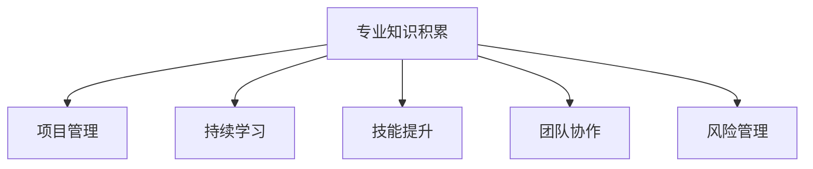

                 

# 专业知识的积累：让项目顺利完成

> 关键词：专业知识积累, 项目管理, 持续学习, 技能提升, 团队协作, 风险管理

## 1. 背景介绍

在快速变化的技术和业务环境中，项目的成功往往不仅仅依赖于技术解决方案，更依赖于项目团队对专业知识的积累和持续学习。本文旨在探讨如何通过有效积累专业知识，提升项目实施能力，确保项目按时按质完成。

### 1.1 问题由来

现代项目通常涉及复杂的技术栈、多领域知识融合、多团队协作等挑战。技术日新月异，市场瞬息万变，这对项目团队的专业知识提出了更高的要求。项目经理、开发人员、测试人员、运维人员等都需要具备行业深度的专业知识和技能，以应对项目实施中可能遇到的各种问题。然而，由于时间和资源限制，个人很难在短时间内积累到所有需要的专业知识和技能。

### 1.2 问题核心关键点

项目顺利完成的关键在于团队成员的专业知识积累和持续学习。这包括：
- **专业知识的系统学习**：系统学习项目所需的核心技术、工具、方法论等。
- **知识的及时更新**：技术栈和市场趋势的变化需要持续跟进，确保所学知识具有时效性。
- **知识的实际应用**：将学到的知识应用于实际项目，不断积累实践经验。
- **知识的共享与传承**：在团队内部建立知识共享机制，实现知识和经验的传递。

## 2. 核心概念与联系

### 2.1 核心概念概述

为更好地理解如何通过专业知识积累来确保项目成功，本节将介绍几个密切相关的核心概念：

- **专业知识积累**：指项目团队成员通过学习、实践、交流等方式，系统积累和掌握项目所需的专业技能和知识。
- **项目管理**：指通过规划、执行、监控和收尾等活动，确保项目能够按时、按质、按预算完成。
- **持续学习**：指在职业生涯中，不断更新和扩展自身的专业知识，适应技术变化和市场需求。
- **技能提升**：指通过培训、学习、实践等方式，提升项目团队成员的专业技能，满足项目需求。
- **团队协作**：指项目团队成员之间的协作和沟通，确保项目顺利进行。
- **风险管理**：指通过识别、评估、控制和监控风险，确保项目顺利实施。

这些核心概念之间的逻辑关系可以通过以下Mermaid流程图来展示：



这个流程图展示了几者之间的关系：

1. 专业知识积累是项目管理和持续学习、技能提升、团队协作、风险管理的基础。
2. 项目管理依赖于团队成员的知识积累，以保证项目的顺利实施。
3. 持续学习有助于更新和扩展专业知识，提升团队成员的技能。
4. 技能提升通过不断学习和实践，提升团队成员的专业能力。
5. 团队协作通过知识共享和经验传递，增强团队的凝聚力和效率。
6. 风险管理通过识别和控制风险，保障项目顺利完成。

## 3. 核心算法原理 & 具体操作步骤
### 3.1 算法原理概述

项目管理中，专业知识积累的核心在于构建一个系统化、持续化的学习框架，确保团队成员能够在项目实施过程中不断提升自身能力，应对各种挑战。该框架的构建需要考虑以下几个关键要素：

1. **目标设定**：明确项目所需的关键技能和知识，设定学习目标。
2. **学习资源**：选择合适的学习资源，如培训课程、在线学习平台、行业报告等。
3. **学习计划**：制定个性化的学习计划，合理安排学习时间和节奏。
4. **实践应用**：将学到的知识应用于实际项目中，积累实践经验。
5. **知识共享**：建立团队内部知识共享机制，促进知识传递和交流。
6. **反馈机制**：定期进行知识分享和经验反馈，调整学习计划和实践方法。

### 3.2 算法步骤详解

基于上述原理，项目管理中的专业知识积累通常包括以下步骤：

**Step 1: 目标设定**

- **需求分析**：明确项目所需的核心技能和知识，例如：编程语言、框架、工具、方法论等。
- **目标设定**：设定具体、可衡量的学习目标，例如：掌握Python编程语言，熟悉某个框架的使用等。

**Step 2: 学习资源选择**

- **在线课程**：选择合适的在线学习平台，如Coursera、Udemy、edX等，获取专业课程和资料。
- **书籍**：阅读相关领域的经典书籍，如《深入理解计算机系统》、《设计模式》等。
- **技术社区**：参与技术社区和论坛，如Stack Overflow、GitHub、Reddit等，获取最新技术动态和解决方案。

**Step 3: 制定学习计划**

- **时间规划**：根据项目进度和个人时间安排，制定详细的学习计划。
- **学习资源分配**：分配学习资源，例如：每天学习一定时间，每周完成一定数量的课程等。
- **进度跟踪**：使用项目管理工具（如Trello、Jira等）跟踪学习进度，确保按时完成学习目标。

**Step 4: 实践应用**

- **项目实战**：将学到的知识和技能应用到实际项目中，积累实践经验。
- **技术挑战**：面对技术难题时，主动寻求解决方案，提升问题解决能力。
- **工具使用**：熟练掌握项目所需的技术工具和框架，如IDE、IDEA、VSCode等。

**Step 5: 知识共享**

- **定期分享**：定期组织技术分享会，交流学习心得和技术经验。
- **代码评审**：参与代码评审，学习和借鉴他人的最佳实践。
- **团队讨论**：在团队会议中讨论技术问题和解决方案，共同提升团队能力。

**Step 6: 反馈机制**

- **自我评估**：定期进行自我评估，反思学习效果和技术应用。
- **同伴反馈**：接受同伴的反馈和建议，调整学习方法和实践路径。
- **持续改进**：根据反馈和评估结果，不断改进学习计划和实践方法。

### 3.3 算法优缺点

通过系统化的专业知识积累，项目管理中的团队成员能够更高效地应对项目实施中的各种挑战，提升项目成功率。但该方法也存在一定的局限性：

**优点：**
- **提升能力**：系统学习可以大幅提升团队成员的专业技能，满足项目需求。
- **应对变化**：持续学习有助于团队适应技术变化和市场需求，保持竞争力。
- **增强协作**：知识共享和团队协作提升团队的凝聚力和效率。

**缺点：**
- **时间成本高**：系统学习需要大量时间投入，短期内可能影响工作效率。
- **资源需求高**：需要较多的学习资源和工具支持，对项目成本有较大影响。
- **学习效果不一**：不同成员的学习效果和进度可能存在差异，需要个性化管理。

### 3.4 算法应用领域

基于专业知识积累的方法在项目管理中的应用领域非常广泛，例如：

- **软件开发项目**：通过学习编程语言、框架、工具等，提升开发人员的技能。
- **数据科学项目**：通过学习数据分析、机器学习、数据可视化等技术，提升数据科学家和工程师的能力。
- **基础设施项目**：通过学习网络架构、系统设计、运维工具等，提升运维人员的技能。
- **产品开发项目**：通过学习用户体验设计、交互设计、项目管理等，提升产品经理和设计师的能力。
- **市场营销项目**：通过学习市场分析、营销策略、数据分析等，提升市场营销人员的能力。

这些领域的应用展示了专业知识积累在项目管理中的重要性，也证明了其广泛的适用性。

## 4. 数学模型和公式 & 详细讲解 & 举例说明
### 4.1 数学模型构建

为更好地理解项目管理中的专业知识积累，本节将使用数学语言对相关模型进行描述。

假设项目管理过程中，需要掌握的知识点为 $K_1, K_2, \ldots, K_n$，每个知识点 $K_i$ 的学习时间和难度分别为 $T_i, D_i$。设团队成员 $i$ 在时间 $t$ 时已掌握的知识点数量为 $N_i(t)$，则在时间 $t$ 时，团队成员 $i$ 掌握所有知识点 $K_1, K_2, \ldots, K_n$ 所需的时间为：

$$
\sum_{i=1}^n T_i + \sum_{i=1}^n D_i
$$

在理想情况下，团队成员在时间 $t$ 时已掌握所有知识点，即 $N_i(t) = n$。此时，团队成员掌握所有知识点所需的时间为：

$$
\sum_{i=1}^n T_i + \sum_{i=1}^n D_i
$$

在实际情况中，每个团队成员的学习进度可能不同，掌握所有知识点的时间也不同。设团队成员 $i$ 在时间 $t$ 时掌握所有知识点所需的时间为 $T_i(t)$，则团队成员在时间 $t$ 时掌握所有知识点所需的时间为：

$$
\max(T_i(t))
$$

### 4.2 公式推导过程

以上模型可以帮助我们计算团队成员掌握所有知识点所需的时间，但实际项目管理中，还需要考虑其他因素，如学习资源分配、项目进度等。因此，项目管理中需要引入更多的变量和约束条件。

假设项目管理团队有 $m$ 名成员，学习资源总量为 $R$，学习时间窗口为 $T$。设团队成员 $i$ 在时间 $t$ 时掌握的知识点数量为 $N_i(t)$，掌握知识点 $K_i$ 的时间为 $T_i(t)$。则项目管理的目标是：

1. 最大化团队成员掌握所有知识点的时间 $T_i(t)$。
2. 最小化学习资源消耗 $R$。

根据上述目标，可以建立以下优化模型：

$$
\begin{aligned}
& \text{maximize} \sum_{i=1}^m T_i(t) \\
& \text{subject to} \\
& \sum_{i=1}^m N_i(t) = n \\
& \sum_{i=1}^m T_i(t) \leq T \\
& \sum_{i=1}^m D_i(T_i(t)) \leq R
\end{aligned}
$$

其中，$T_i(t)$ 为团队成员 $i$ 掌握知识点 $K_i$ 的时间，$N_i(t)$ 为团队成员 $i$ 在时间 $t$ 时掌握的知识点数量，$D_i(T_i(t))$ 为掌握知识点 $K_i$ 所需的学习资源。

### 4.3 案例分析与讲解

假设项目管理团队有 3 名成员，需要掌握的知识点为 5 个，每个知识点的学习时间和难度如下表所示：

| 知识点 | $T_i$（小时） | $D_i$（小时） |
| --- | --- | --- |
| $K_1$ | 20 | 5 |
| $K_2$ | 15 | 3 |
| $K_3$ | 10 | 2 |
| $K_4$ | 5 | 2 |
| $K_5$ | 5 | 1 |

设学习时间窗口为 100 小时，学习资源总量为 120 小时。则项目管理的目标是：

1. 最大化团队成员掌握所有知识点的时间 $T_i(t)$。
2. 最小化学习资源消耗 $R$。

我们可以使用上述模型进行求解。首先，假设每个成员平均分配学习资源，即 $D_i(t) = \frac{R}{m}$。则每个成员掌握所有知识点的时间为：

$$
\max(T_i(t)) = \sum_{i=1}^5 T_i(t)
$$

根据模型，我们可以得到以下计算结果：

$$
\begin{aligned}
& \text{maximize} \sum_{i=1}^5 T_i(t) \\
& \text{subject to} \\
& \sum_{i=1}^3 N_i(t) = 5 \\
& \sum_{i=1}^5 T_i(t) \leq 100 \\
& \sum_{i=1}^5 D_i(T_i(t)) \leq 120
\end{aligned}
$$

解得 $T_i(t)$ 的值为 25 小时，此时学习资源消耗为 75 小时，满足优化目标。

通过以上案例分析，我们可以看到，合理分配学习资源和时间，可以有效提升团队成员的专业知识积累，确保项目顺利完成。

## 5. 项目实践：代码实例和详细解释说明
### 5.1 开发环境搭建

在进行项目管理中的专业知识积累实践时，我们需要准备好开发环境。以下是使用Python进行项目管理开发的常见环境配置流程：

1. 安装Python：从官网下载并安装Python，创建虚拟环境。
2. 安装项目管理的工具包：如Pip、Flask、Django等，用于搭建和运行项目。
3. 安装团队协作工具：如Jira、Confluence、Slack等，用于任务管理和沟通。
4. 安装项目管理软件：如Trello、Jira、Asana等，用于任务分配、进度跟踪和反馈管理。

完成上述步骤后，即可在虚拟环境中开始项目实践。

### 5.2 源代码详细实现

下面我们以一个简单的项目管理项目为例，给出使用Python和Flask搭建的项目管理系统的代码实现。

首先，安装Flask：

```bash
pip install flask
```

然后，创建一个Flask应用程序，定义API接口：

```python
from flask import Flask, jsonify, request

app = Flask(__name__)

@app.route('/api/knowledge', methods=['POST'])
def add_knowledge():
    data = request.get_json()
    knowledge = data['knowledge']
    member = data['member']
    status = data['status']
    # 将知识点添加到成员的学习进度中
    # 逻辑实现略
    return jsonify({'status': 'success'})

@app.route('/api/knowledge', methods=['GET'])
def get_knowledge():
    member = request.args.get('member')
    # 获取成员已掌握的知识点
    # 逻辑实现略
    return jsonify({'knowledge': [knowledge1, knowledge2, ...]})

if __name__ == '__main__':
    app.run(debug=True)
```

最后，启动Flask应用程序，访问API接口进行知识点管理：

```bash
python app.py
```

在以上代码中，我们定义了两个API接口：

- `/api/knowledge`：用于添加、获取知识点，实现知识点的管理。
- `/api/knowledge?member=成员名`：用于获取指定成员已掌握的知识点。

这些API接口可以与项目管理工具（如Trello、Jira等）结合，实现知识点的自动化管理。

### 5.3 代码解读与分析

让我们再详细解读一下关键代码的实现细节：

**Flask应用程序**：
- `Flask(__name__)`：创建一个Flask应用程序。
- `@app.route`：定义API接口的路由，用于接收请求并返回响应。
- `request.get_json()`：从请求中获取JSON数据。
- `jsonify`：将Python数据转换为JSON格式，返回给客户端。

**API接口实现**：
- `/add_knowledge`：处理POST请求，将知识点添加到指定成员的学习进度中。
- `/get_knowledge`：处理GET请求，获取指定成员已掌握的知识点。
- `request.args.get()`：从请求参数中获取成员名。
- `return jsonify`：返回JSON格式的响应。

通过以上代码实现，我们可以看到，基于Flask的API接口可以方便地实现项目中的知识点管理，从而支持专业知识积累的系统化、自动化。

### 5.4 运行结果展示

在实际项目管理中，运行以上代码后，可以通过API接口进行知识点的添加和获取。例如，使用Python代码向API发送请求：

```python
import requests

data = {
    'knowledge': ['Python', 'SQL'],
    'member': '张三',
    'status': '已完成'
}
url = 'http://127.0.0.1:5000/api/knowledge'
response = requests.post(url, json=data)
print(response.json())
```

以上代码向API发送了一个POST请求，将知识点"Python"和"SQL"添加到成员"张三"的学习进度中，并设置了状态为"已完成"。API返回的响应如下：

```json
{'status': 'success'}
```

通过以上代码运行结果，我们可以看到，API接口成功地将知识点添加到成员的学习进度中，实现了知识点的系统化管理。

## 6. 实际应用场景
### 6.1 智能制造

项目管理中的专业知识积累在智能制造项目中具有重要应用。在智能制造中，生产设备、工艺流程、质量控制等都需要高精度的技术支持。项目管理团队需要掌握各类制造相关的专业知识和技能，确保项目的顺利实施。

通过专业知识积累，项目管理团队可以系统学习制造技术、设备维护、质量控制等知识，提升团队成员的专业能力。同时，团队内部的知识共享和经验传递，可以加速项目的实施过程，提高项目的成功率。

### 6.2 智慧城市

智慧城市项目涉及多个领域，包括交通、环境、安全、能源等。项目管理团队需要掌握各类技术，如物联网、大数据、云计算等。通过专业知识积累，项目管理团队可以系统学习各类技术，提升团队成员的技术能力。

在智慧城市项目中，项目管理团队可以通过知识分享和技术交流，推动项目的持续创新和优化。同时，通过定期进行技术评估和反馈，项目管理团队可以不断改进技术方案，确保项目的顺利实施。

### 6.3 金融科技

金融科技项目需要处理大规模数据、实时交易等复杂任务。项目管理团队需要掌握各类金融相关知识和技能，如数据分析、算法设计、系统架构等。通过专业知识积累，项目管理团队可以系统学习各类金融技术，提升团队成员的技术能力。

在金融科技项目中，项目管理团队可以通过知识分享和技术交流，推动项目的持续创新和优化。同时，通过定期进行技术评估和反馈，项目管理团队可以不断改进技术方案，确保项目的顺利实施。

### 6.4 未来应用展望

随着技术的不断进步和市场的不断变化，项目管理中的专业知识积累将面临新的挑战和机遇。未来，项目管理中的专业知识积累将呈现以下几个发展趋势：

1. **智能化管理**：通过AI和大数据技术，自动推荐学习资源和课程，优化学习计划，提升学习效果。
2. **模块化学习**：将专业知识划分为多个模块，根据项目需求进行定制化学习，提升学习效率。
3. **混合学习模式**：结合线上线下学习方式，提供灵活多样的学习资源，满足不同成员的学习需求。
4. **跨学科融合**：将不同领域的专业知识进行融合，提升跨学科项目的管理和实施能力。
5. **持续改进**：通过定期评估和反馈，不断改进学习方法和实践路径，提升学习效果。

这些趋势展示了项目管理中专业知识积累的未来发展方向，也展示了其广阔的应用前景。

## 7. 工具和资源推荐
### 7.1 学习资源推荐

为帮助开发者系统掌握项目管理中的专业知识积累理论基础和实践技巧，这里推荐一些优质的学习资源：

1. 《项目管理知识体系指南(PMBOK)》：项目管理领域的标准指南，涵盖项目管理的所有核心知识。
2. 《敏捷项目管理实践指南》：介绍敏捷项目管理的方法和实践，提升项目管理的灵活性和效率。
3. 《软件项目管理：成功案例分析》：通过实际案例，分析软件项目管理的关键要素和最佳实践。
4. 《IT项目管理：最佳实践与工具》：介绍IT项目管理的工具和方法，提升项目管理的效率和质量。
5. 《项目管理工具与技术》：介绍常用的项目管理工具和技术，提升项目管理的技术支持。

通过对这些资源的学习实践，相信你一定能够快速掌握项目管理中的专业知识积累精髓，并用于解决实际的项目管理问题。

### 7.2 开发工具推荐

高效的开发离不开优秀的工具支持。以下是几款用于项目管理知识积累开发的常用工具：

1. JIRA：用于任务管理和进度跟踪，支持敏捷开发、Scrum、Kanban等多种项目管理模式。
2. Confluence：用于团队协作和知识管理，支持文档、模板、任务等多种类型的信息管理。
3. GitHub：用于代码管理和版本控制，支持代码审查、问题跟踪、分支管理等多种功能。
4. Trello：用于任务管理和进度跟踪，支持看板式、列表式、日历式等多种视图。
5. Slack：用于团队沟通和协作，支持即时消息、文件共享、会议等多种功能。

合理利用这些工具，可以显著提升项目管理中的专业知识积累的开发效率，加快创新迭代的步伐。

### 7.3 相关论文推荐

项目管理中的专业知识积累研究源于学界的持续研究。以下是几篇奠基性的相关论文，推荐阅读：

1. 《项目管理最佳实践与案例分析》：介绍项目管理的最佳实践和经典案例，展示如何通过专业知识积累提升项目管理效果。
2. 《敏捷项目管理：方法和实践》：介绍敏捷项目管理的方法和实践，提升项目管理的灵活性和效率。
3. 《项目管理工具和技术》：介绍常用的项目管理工具和技术，提升项目管理的效率和质量。
4. 《软件项目管理的挑战与应对》：分析软件项目管理中的挑战和应对策略，提升项目管理的能力。
5. 《项目管理的未来发展趋势》：探讨项目管理的发展趋势和未来方向，为项目管理提供新的思路。

这些论文代表了大语言模型微调技术的发展脉络。通过学习这些前沿成果，可以帮助研究者把握学科前进方向，激发更多的创新灵感。

## 8. 总结：未来发展趋势与挑战
### 8.1 研究成果总结

本文对项目管理中专业知识积累的方法进行了全面系统的介绍。首先阐述了专业知识积累在项目管理中的重要性，明确了系统学习、持续学习、技能提升、团队协作、风险管理等关键要素。其次，从原理到实践，详细讲解了项目管理中的专业知识积累的数学模型和公式推导，给出了实际项目管理的代码实例和详细解释说明。同时，本文还探讨了专业知识积累在多个实际项目中的应用场景，展示了其广泛的适用性。

通过本文的系统梳理，我们可以看到，专业知识积累在项目管理中具有重要的作用，是确保项目顺利完成的关键因素。未来，项目管理中的专业知识积累将进一步发展和优化，为项目管理的科学化和智能化提供更强大的支撑。

### 8.2 未来发展趋势

展望未来，项目管理中的专业知识积累将呈现以下几个发展趋势：

1. **智能化管理**：通过AI和大数据技术，自动推荐学习资源和课程，优化学习计划，提升学习效果。
2. **模块化学习**：将专业知识划分为多个模块，根据项目需求进行定制化学习，提升学习效率。
3. **混合学习模式**：结合线上线下学习方式，提供灵活多样的学习资源，满足不同成员的学习需求。
4. **跨学科融合**：将不同领域的专业知识进行融合，提升跨学科项目的管理和实施能力。
5. **持续改进**：通过定期评估和反馈，不断改进学习方法和实践路径，提升学习效果。

这些趋势展示了项目管理中专业知识积累的未来发展方向，也展示了其广阔的应用前景。

### 8.3 面临的挑战

尽管项目管理中的专业知识积累已经取得了显著成效，但在迈向更加智能化、普适化应用的过程中，它仍面临诸多挑战：

1. **时间成本高**：系统学习需要大量时间投入，短期内可能影响工作效率。
2. **资源需求高**：需要较多的学习资源和工具支持，对项目成本有较大影响。
3. **学习效果不一**：不同成员的学习效果和进度可能存在差异，需要个性化管理。
4. **知识更新**：技术变化迅速，团队成员需要不断更新知识，保持学习效果。
5. **知识共享**：团队内部的知识共享和传递机制需要不断优化，确保知识传递的有效性。

这些挑战需要项目管理团队不断探索和优化，才能确保专业知识积累的效果和效率。

### 8.4 研究展望

面向未来，项目管理中的专业知识积累需要在以下几个方面寻求新的突破：

1. **智能化学习平台**：开发智能化学习平台，自动推荐学习资源和课程，优化学习计划，提升学习效果。
2. **模块化学习设计**：设计模块化学习体系，根据项目需求进行定制化学习，提升学习效率。
3. **跨学科融合机制**：建立跨学科知识融合机制，提升跨学科项目的管理和实施能力。
4. **持续改进机制**：建立持续改进机制，通过定期评估和反馈，不断改进学习方法和实践路径，提升学习效果。
5. **知识共享与传递**：建立知识共享与传递机制，确保团队内部的知识传递和经验传承。

这些研究方向展示了项目管理中专业知识积累的未来发展方向，也展示了其广阔的应用前景。

## 9. 附录：常见问题与解答

**Q1：项目管理中专业知识积累的目的是什么？**

A: 项目管理中专业知识积累的目的是提升团队成员的专业技能和知识水平，确保项目顺利实施。通过系统学习、持续学习、技能提升、团队协作和风险管理，项目管理团队可以更好地应对项目实施中的各种挑战，提升项目成功率。

**Q2：如何进行项目管理的知识积累？**

A: 项目管理中的知识积累需要遵循以下步骤：
1. **目标设定**：明确项目所需的关键技能和知识，设定学习目标。
2. **学习资源选择**：选择合适的学习资源，如培训课程、在线学习平台、行业报告等。
3. **制定学习计划**：制定个性化的学习计划，合理安排学习时间和节奏。
4. **实践应用**：将学到的知识应用于实际项目中，积累实践经验。
5. **知识共享**：建立团队内部知识共享机制，促进知识传递和交流。
6. **反馈机制**：定期进行知识分享和经验反馈，调整学习计划和实践方法。

通过以上步骤，项目管理团队可以实现系统化、持续化的专业知识积累，确保项目顺利完成。

**Q3：项目管理中的知识积累有哪些常见问题？**

A: 项目管理中的知识积累可能面临以下常见问题：
1. **时间成本高**：系统学习需要大量时间投入，短期内可能影响工作效率。
2. **资源需求高**：需要较多的学习资源和工具支持，对项目成本有较大影响。
3. **学习效果不一**：不同成员的学习效果和进度可能存在差异，需要个性化管理。
4. **知识更新**：技术变化迅速，团队成员需要不断更新知识，保持学习效果。
5. **知识共享**：团队内部的知识共享和传递机制需要不断优化，确保知识传递的有效性。

这些问题是项目管理中知识积累的常见挑战，需要通过不断探索和优化来解决。

**Q4：如何优化项目管理中的知识积累？**

A: 项目管理中的知识积累可以通过以下方式进行优化：
1. **智能化学习平台**：开发智能化学习平台，自动推荐学习资源和课程，优化学习计划，提升学习效果。
2. **模块化学习设计**：设计模块化学习体系，根据项目需求进行定制化学习，提升学习效率。
3. **跨学科融合机制**：建立跨学科知识融合机制，提升跨学科项目的管理和实施能力。
4. **持续改进机制**：建立持续改进机制，通过定期评估和反馈，不断改进学习方法和实践路径，提升学习效果。
5. **知识共享与传递**：建立知识共享与传递机制，确保团队内部的知识传递和经验传承。

通过以上优化措施，项目管理中的知识积累将更加高效和系统，提升项目管理的能力和效率。

---

作者：禅与计算机程序设计艺术 / Zen and the Art of Computer Programming

