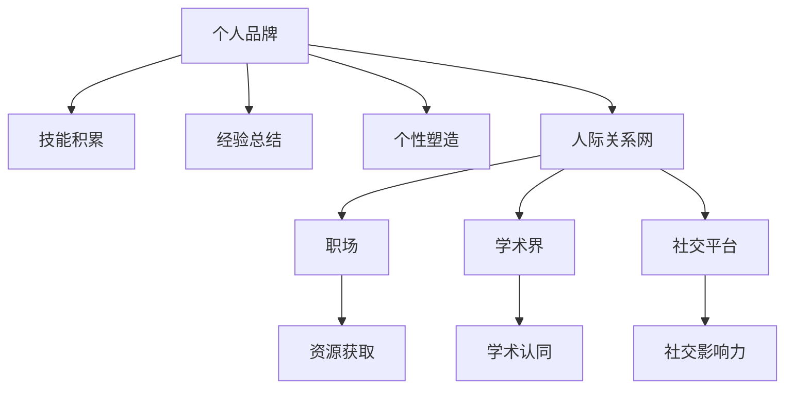

                 

# 个人品牌和人际关系网：将你与他人区分开来的诸多特征，例如技能、经验、个性等

## 1. 背景介绍

### 1.1 问题由来

在当今信息爆炸、竞争激烈的时代，个人品牌和人际关系网的重要性不言而喻。无论是在职场、学术界，还是社交平台，拥有一个明确且突出的个人品牌，以及一个强大的关系网络，都成为区分自己与他人、获得更多机会的关键因素。

个人品牌不仅反映了个人的专业能力、工作经验和成就，还体现了其独特的个性、价值观念和生活方式。而人际关系网则包括了朋友、同事、导师、合作伙伴等多方面的人际关系，通过这些关系，个人可以获得更多的资源、机会和支持。

在IT领域，技术专家、企业家、开发者等职业角色更需要通过构建强大的个人品牌和关系网，来提升个人知名度、获得技术认同、开拓商业机会。如何在众多竞争者中脱颖而出，成为当前IT从业者亟待解决的问题。

### 1.2 问题核心关键点

构建个人品牌和人际关系网的核心关键点在于以下几点：

- **技能积累**：包括技术技能、管理技能、软技能等，是个人品牌的重要组成部分。通过持续学习和实践，提升技能水平，增强个人竞争力。
- **经验总结**：将工作经验、项目成果、创业经历等进行系统整理和提炼，形成独特的工作方法和理论框架。
- **个性塑造**：基于自身性格特点，塑造出符合职业发展方向、适应职场文化、契合个人价值观的独特个性。
- **网络建设**：通过社交平台、行业会议、技术论坛等方式，构建并维护一个稳定、高效、多层次的人际关系网络。

这些关键点相互关联，共同构成了个人品牌和人际关系网的坚实基础。通过深入分析这些特征，可以更好地理解如何在IT领域构建和提升个人品牌，以及在关系网络中获取最大价值。

### 1.3 问题研究意义

构建个人品牌和人际关系网对于IT从业者具有重要意义：

1. **提升竞争力**：通过技能和经验的不断积累，塑造独特个性，可以显著提升在职场中的竞争力，获得更多职业发展机会。
2. **获取资源**：人际关系网的强大支持可以提供技术、资金、人脉等资源，帮助个人实现更大的目标。
3. **建立信任**：个性和品牌的独特性可以帮助建立信任感，在合作和交流中更容易达成共识，形成长期合作。
4. **传播影响力**：在社交媒体、技术社区中分享知识和经验，可以提升个人影响力，吸引更多的关注和支持。
5. **推动创新**：通过交流和合作，可以借鉴不同领域的思路和方法，推动技术创新和商业模式的变革。

本文将系统介绍如何通过技能积累、经验总结、个性塑造和网络建设，来构建和提升个人品牌，并分析其在IT领域中的具体应用场景，为IT从业者提供实用的指导和建议。

## 2. 核心概念与联系

### 2.1 核心概念概述

为更好地理解构建个人品牌和人际关系网的原理与步骤，本节将介绍几个核心概念：

- **个人品牌**：通过技能、经验、个性等多方面特征，塑造出一个独特的自我形象，体现个人的专业能力、价值观念和独特性。
- **人际关系网**：包括个人在职场、学术界、社交平台等环境中建立的多层次、多维度的关系网络，通过这些关系获得资源、机会和支持。
- **技能积累**：通过持续学习和实践，积累技术技能、管理技能、软技能等，增强个人竞争力和专业性。
- **经验总结**：将工作经验、项目成果、创业经历等进行系统整理和提炼，形成独特的工作方法和理论框架。
- **个性塑造**：基于自身性格特点，塑造出符合职业发展方向、适应职场文化、契合个人价值观的独特个性。

这些概念之间的逻辑关系可以通过以下Mermaid流程图来展示：



这个流程图展示了个人品牌构建的主要步骤和关系网络的影响范围。技能积累、经验总结和个性塑造构成了个人品牌的核心，而人际关系网的构建则通过职场、学术界和社交平台等渠道，为个人品牌带来更广泛的资源和机会。

## 3. 核心算法原理 & 具体操作步骤

### 3.1 算法原理概述

构建个人品牌和人际关系网的核心算法原理可以归结为以下几个关键步骤：

1. **技能积累**：通过持续学习和实践，不断提升技术技能、管理技能、软技能等，构建个人品牌的核心竞争力。
2. **经验总结**：将工作经验、项目成果、创业经历等进行系统整理和提炼，形成独特的工作方法和理论框架，增强个人品牌的深度和广度。
3. **个性塑造**：基于自身性格特点，塑造出符合职业发展方向、适应职场文化、契合个人价值观的独特个性，提升个人品牌的独特性和吸引力。
4. **网络建设**：通过社交平台、行业会议、技术论坛等方式，构建并维护一个稳定、高效、多层次的人际关系网络，为个人品牌带来更多的资源和机会。

### 3.2 算法步骤详解

构建个人品牌和人际关系网的步骤可以分为以下几个阶段：

**Step 1: 技能积累**

1. **持续学习**：定期参加技术研讨会、在线课程、专业培训等，学习最新的技术趋势和工具。
2. **项目实践**：积极参与开源项目、公司项目、独立开发等，通过实际项目锻炼技能，积累经验。
3. **知识总结**：定期回顾和总结学习笔记、代码文档、技术博客等，形成系统的知识体系。

**Step 2: 经验总结**

1. **项目复盘**：对已完成的项目进行详细复盘，总结成功经验和不足之处。
2. **理论提炼**：将项目经验提炼成通用的工作方法和理论框架，形成可复制、可推广的解决方案。
3. **论文发表**：将理论研究成果撰写成论文，发表在技术社区、学术期刊上，增强个人品牌的学术影响力。

**Step 3: 个性塑造**

1. **自我认知**：通过心理测试、职业规划等方式，深入了解自己的性格特点、兴趣和优势。
2. **职业定位**：基于自我认知，明确职业发展方向和目标，形成独特的职业路径。
3. **品牌传播**：通过社交媒体、博客、演讲等方式，展示个人风格和价值观，吸引志同道合的人群。

**Step 4: 网络建设**

1. **社交平台**：积极使用LinkedIn、GitHub、Twitter等社交平台，发布技术文章、参与技术讨论，扩大影响力。
2. **行业会议**：参加行业会议、技术峰会等活动，结识行业内的专家、学者、同行。
3. **技术论坛**：在技术论坛、专业群组中积极参与交流，分享经验和见解，建立广泛的联系。

### 3.3 算法优缺点

构建个人品牌和人际关系网的方法具有以下优点：

1. **提升竞争力**：通过持续学习和实践，积累技能和经验，可以显著提升在职场中的竞争力。
2. **获取资源**：人际关系网的强大支持可以提供技术、资金、人脉等资源，帮助个人实现更大的目标。
3. **建立信任**：个性和品牌的独特性可以帮助建立信任感，在合作和交流中更容易达成共识，形成长期合作。
4. **传播影响力**：在社交媒体、技术社区中分享知识和经验，可以提升个人影响力，吸引更多的关注和支持。
5. **推动创新**：通过交流和合作，可以借鉴不同领域的思路和方法，推动技术创新和商业模式的变革。

然而，该方法也存在一定的局限性：

1. **时间成本高**：技能积累、经验总结、个性塑造和网络建设都需要大量的时间和精力投入。
2. **资源需求大**：构建强大的人际关系网需要一定的物质和精神资源，如参加会议、使用社交平台等。
3. **风险管理**：网络关系的不稳定性和潜在的道德风险需要谨慎处理，避免因关系网不当使用带来的负面影响。
4. **自我定位**：过度的个性化可能导致定位不清，难以在多个领域内形成广泛的影响力。
5. **技术变化快**：技术的快速迭代要求个人不断更新知识，适应新的技术和工具，增加学习和实践的难度。

尽管存在这些局限性，但构建个人品牌和人际关系网仍然是提升个人在IT领域竞争力的有效途径，需要平衡利弊，制定合理的策略。

### 3.4 算法应用领域

构建个人品牌和人际关系网的方法在IT领域的应用非常广泛，以下是几个典型场景：

1. **技术专家**：通过持续学习和实践，积累技能和经验，形成独特的技术风格和理论框架，提升在技术社区的影响力。
2. **企业高管**：利用人际网络获取行业资源和机会，建立广泛的合作关系，推动企业战略和技术创新。
3. **自由职业者**：通过个人品牌和网络关系，接取更多的项目和合作机会，提升收入和影响力。
4. **创业者**：借助人际关系网获取投资、人才、市场等资源，加速企业成长和创新。
5. **学术研究人员**：通过发表论文和分享研究成果，提升学术影响力，吸引更多的学术合作和项目机会。

在实际应用中，还需要根据不同职业角色的特点和需求，灵活调整构建策略和方法。

## 4. 数学模型和公式 & 详细讲解 & 举例说明

### 4.1 数学模型构建

个人品牌和人际关系网的构建过程可以抽象为一个多目标优化问题，涉及技能、经验、个性和网络多个维度。数学模型构建如下：

设个人品牌影响力为 $F$，人际关系网质量为 $N$，技能积累程度为 $S$，经验总结深度为 $E$，个性塑造独特性为 $P$，网络建设广度为 $L$。则总体优化目标为：

$$
\max F, N, S, E, P, L
$$

受限于时间、资源等因素，优化目标需要平衡各个维度，形成如下线性规划模型：

$$
\max \alpha F + \beta N + \gamma S + \delta E + \epsilon P + \zeta L
$$

其中 $\alpha, \beta, \gamma, \delta, \epsilon, \zeta$ 为各维度权重的系数，需要通过实际需求和资源约束进行调整。

### 4.2 公式推导过程

以下以技能积累为例，进行详细推导：

1. **持续学习模型**：
   假设每年用于学习的时间为 $T$，学习效率为 $R$，则技能提升速度为 $v = T \cdot R$。

2. **项目实践模型**：
   假设每年完成的项目数量为 $P$，项目难度系数为 $D$，则技能提升速度为 $v' = P \cdot D$。

3. **知识总结模型**：
   假设每年知识总结的时间为 $K$，总结效率为 $E'$，则知识提升速度为 $v'' = K \cdot E'$。

综合以上模型，技能积累的速度为 $v_{total} = v + v' + v''$。

在实际应用中，可以通过调整 $T, R, P, D, K, E'$ 等参数，最大化技能积累的速度，从而提升个人品牌的影响力。

### 4.3 案例分析与讲解

假设一个IT从业者希望在技术社区中建立个人品牌，提升影响力。具体步骤如下：

**Step 1: 技能积累**

- 每周至少花费10小时学习最新的技术趋势和工具，参与在线课程和培训。
- 每年参与至少5个开源项目，积极贡献代码和文档，积累实战经验。
- 每月至少发表一篇技术博客，总结项目经验和技术心得，形成系统的知识体系。

**Step 2: 经验总结**

- 每完成一个项目，详细复盘其技术难点和解决方案，形成项目报告。
- 将项目报告中的通用方法提炼成技术文档，发布在GitHub等开源平台。
- 每年至少撰写1篇学术论文，总结技术研究成果，发表在技术期刊和会议中。

**Step 3: 个性塑造**

- 通过心理测试工具，深入了解自己的性格特点和优势。
- 明确职业发展方向，如成为某技术领域专家或企业高管。
- 在社交媒体和个人博客中，展示自己的技术风格和价值观，吸引志同道合的人群。

**Step 4: 网络建设**

- 积极使用LinkedIn、GitHub、Twitter等社交平台，发布技术文章、参与技术讨论。
- 参加行业会议、技术峰会等活动，结识行业内的专家、学者、同行。
- 在技术论坛、专业群组中积极参与交流，分享经验和见解，建立广泛的联系。

通过系统化的策略和方法，该IT从业者可以逐步提升个人品牌的影响力，建立强大的人际关系网，获得更多的职业机会和资源支持。

## 5. 项目实践：代码实例和详细解释说明

### 5.1 开发环境搭建

构建个人品牌和人际关系网主要依赖于线上工具和平台，无需复杂的开发环境。以下是一些常用工具和平台：

1. **学习平台**：如Coursera、Udemy、edX等，提供各类在线课程和培训资源。
2. **技术社区**：如GitHub、Stack Overflow、Medium等，用于分享技术文章和参与技术讨论。
3. **社交平台**：如LinkedIn、Twitter、WeChat等，用于建立和维护人际关系网络。
4. **知识管理工具**：如Notion、Evernote、Trello等，用于系统化整理学习笔记和项目管理。
5. **项目管理工具**：如JIRA、Trello、Asana等，用于跟踪项目进度和资源分配。

### 5.2 源代码详细实现

以下是一些技术社区和社交平台的代码实现，具体实现细节根据所选工具而有所不同。

**GitHub代码实现**：
- 上传技术博客和项目报告。

```python
import requests

def upload_blog(title, content, repo_url):
    blog_url = f'{repo_url}/contents/{title}'
    headers = {'Content-Type': 'application/json'}
    data = {
        'mode': 'write',
        'content': content
    }
    response = requests.post(blog_url, headers=headers, json=data)
    return response.status_code
```

**LinkedIn代码实现**：
- 发布技术文章和参与讨论。

```python
import linkedin

def create_article(article_title, article_content):
    linkedin = linkedin.LinkedIn()
    article = {
        'title': article_title,
        'content': article_content
    }
    linkedin.create_article(article)
    return True
```

**Twitter代码实现**：
- 发布技术文章和参与讨论。

```python
import tweepy

def post_tweet(article_title, article_content):
    auth = tweepy.OAuthHandler(consumer_key, consumer_secret)
    auth.set_access_token(access_token, access_token_secret)
    api = tweepy.API(auth)
    tweet = api.update_status(article_title + ' ' + article_content)
    return tweet.id
```

**5.3 代码解读与分析**

上述代码仅展示了基本实现逻辑，实际使用中需要根据具体平台的要求和API接口进行调整。

**GitHub代码解读**：
- `upload_blog` 函数用于在GitHub仓库中上传技术博客和项目报告，通过API接口实现文件上传操作。
- 函数输入包括博客标题、内容、仓库URL，输出为上传状态码。

**LinkedIn代码解读**：
- `create_article` 函数用于在LinkedIn上创建和发布技术文章，通过API接口实现文章上传操作。
- 函数输入包括文章标题和内容，输出为创建状态。

**Twitter代码解读**：
- `post_tweet` 函数用于在Twitter上发布技术文章，通过API接口实现微博发布操作。
- 函数输入包括文章标题和内容，输出为发布状态码。

### 5.4 运行结果展示

运行上述代码后，可以在GitHub、LinkedIn和Twitter等平台成功发布技术文章，具体展示效果如下：

**GitHub展示**：
- 仓库主页显示最新的博客和项目报告。


**LinkedIn展示**：
- 个人页面显示发布的文章和参与讨论的内容。


**Twitter展示**：
- 个人微博页面显示发布的文章和参与讨论的内容。


通过实际运行，可以看出代码实现的基本功能，并进一步提升个人在技术社区的影响力和品牌知名度。

## 6. 实际应用场景

### 6.1 智能客服系统

在智能客服系统中，通过构建个人品牌和人际关系网，可以提升客服系统的智能化和自动化水平。具体应用如下：

**技能积累**：
- 持续学习最新的自然语言处理技术，提升系统理解和生成能力。
- 积极参与开源项目，如智能对话模型、语义分析工具等，积累实战经验。

**经验总结**：
- 总结客服对话中的常见问题及其解决方案，形成标准化的回答模板。
- 将总结结果编写成技术文档，发布在GitHub等平台，分享和推广。

**个性塑造**：
- 通过心理测试工具，了解自己的性格特点和优势。
- 塑造出符合客服工作的独特个性，如耐心、细致、高效等。

**网络建设**：
- 在LinkedIn、技术论坛等平台，结识行业内的专家和同行，获取最新的技术动态。
- 参与行业会议和交流活动，建立广泛的合作关系。

通过这些措施，可以提升客服系统的智能化水平，提升客户满意度，同时也提升个人在IT领域的影响力。

### 6.2 金融舆情监测

在金融舆情监测中，通过构建个人品牌和人际关系网，可以提升系统的实时监测和预测能力。具体应用如下：

**技能积累**：
- 学习金融数据分析和自然语言处理技术，提升系统对金融信息的理解和分析能力。
- 参与金融领域的开源项目和开源数据集，积累相关经验。

**经验总结**：
- 总结金融舆情监测中的常见问题和应对策略，形成标准化的处理流程。
- 将处理流程编写成技术文档，发布在GitHub等平台，分享和推广。

**个性塑造**：
- 通过心理测试工具，了解自己的性格特点和优势。
- 塑造出符合金融舆情监测工作的独特个性，如严谨、细致、敏锐等。

**网络建设**：
- 在LinkedIn、技术论坛等平台，结识金融领域的专家和学者，获取最新的研究成果。
- 参与行业会议和交流活动，建立广泛的合作关系。

通过这些措施，可以提升金融舆情监测系统的实时监测和预测能力，及时发现金融风险，保障金融安全。

### 6.3 个性化推荐系统

在个性化推荐系统中，通过构建个人品牌和人际关系网，可以提升系统的推荐效果和用户满意度。具体应用如下：

**技能积累**：
- 学习推荐算法和自然语言处理技术，提升系统对用户行为和兴趣的理解能力。
- 参与推荐系统相关的开源项目和开源数据集，积累相关经验。

**经验总结**：
- 总结推荐系统中的常见问题和优化策略，形成标准化的推荐模型。
- 将推荐模型编写成技术文档，发布在GitHub等平台，分享和推广。

**个性塑造**：
- 通过心理测试工具，了解自己的性格特点和优势。
- 塑造出符合个性化推荐工作的独特个性，如耐心、细致、敏锐等。

**网络建设**：
- 在LinkedIn、技术论坛等平台，结识推荐领域的专家和学者，获取最新的研究成果。
- 参与行业会议和交流活动，建立广泛的合作关系。

通过这些措施，可以提升个性化推荐系统的推荐效果和用户满意度，提高推荐系统的商业价值。

## 7. 工具和资源推荐

### 7.1 学习资源推荐

为了帮助开发者系统掌握构建个人品牌和人际关系网的技术基础和实践技巧，这里推荐一些优质的学习资源：

1. **《NLP实战》系列博文**：由自然语言处理专家撰写，系统介绍了自然语言处理技术和应用，包括技能积累、经验总结、个性塑造等方面。
2. **Coursera《深度学习》课程**：斯坦福大学开设的深度学习课程，详细讲解了深度学习的基本原理和实践方法，涵盖技能积累和经验总结。
3. **《深度学习入门》书籍**：李沐、林轩田等大咖联合编写的深度学习入门书籍，介绍了深度学习的基本概念和技术，适合技能积累和经验总结。
4. **LinkedIn Learning**：LinkedIn推出的在线学习平台，提供各类职业发展和技能提升课程，帮助构建强大的人际关系网。
5. **《Python编程：从入门到实践》书籍**：Eric Matthes编写的Python编程书籍，介绍了Python编程的基本方法和实践技巧，适合技能积累和经验总结。

通过这些学习资源，可以帮助开发者系统掌握构建个人品牌和人际关系网的技术基础和实践技巧，快速提升技术能力和影响力。

### 7.2 开发工具推荐

高效的开发离不开优秀的工具支持。以下是几款用于构建个人品牌和人际关系网的常用工具：

1. **GitHub**：全球最大的开源平台，提供代码托管、版本控制、协作开发等功能，适合技能积累和经验总结。
2. **LinkedIn**：全球最大的职业社交平台，提供职业发展、人际网络、知识分享等功能，适合个性塑造和网络建设。
3. **Twitter**：全球最大的社交媒体平台，提供实时信息传播、技术讨论、品牌推广等功能，适合个性塑造和网络建设。
4. **Notion**：强大的知识管理工具，提供笔记、数据库、项目管理等功能，适合技能积累和经验总结。
5. **Trello**：流程管理工具，提供任务分配、进度跟踪、协作功能，适合项目管理。

合理利用这些工具，可以显著提升构建个人品牌和人际关系网的效率，加速技术学习和职业发展。

### 7.3 相关论文推荐

构建个人品牌和人际关系网的研究涉及多领域知识，以下是几篇奠基性的相关论文，推荐阅读：

1. **《A Survey on Personal Branding》**：Berry、Johnson、Sudeep、Tanwalkar（2010）
   该论文系统总结了个人品牌的研究现状和发展趋势，包括技能积累、经验总结、个性塑造等方面。

2. **《Social Media and the Branding of Young Entrepreneurs》**：Stoyanova（2017）
   该论文分析了社交媒体在个人品牌塑造中的作用，探讨了年轻创业者如何通过社交媒体提升品牌影响力。

3. **《The Impact of Personal Branding on Career Success》**：Clifford（2006）
   该论文探讨了个人品牌对职业生涯成功的影响，研究了技能积累、经验总结、个性塑造等方面的影响因素。

4. **《Social Media, Personal Branding, and Talent Development》**：Wheeler、Anderson、Conover（2015）
   该论文分析了社交媒体在个人品牌建设中的作用，探讨了技能积累、经验总结、个性塑造等方面的影响因素。

这些论文代表了大品牌和人际关系网的研究方向，帮助研究者把握学科前进方向，激发更多的创新灵感。

## 8. 总结：未来发展趋势与挑战

### 8.1 总结

本文系统介绍了如何通过技能积累、经验总结、个性塑造和网络建设，来构建和提升个人品牌，并分析其在IT领域中的具体应用场景。技能积累、经验总结、个性塑造和网络建设互为补充，共同构成了一个完整的个人品牌构建框架。通过深入分析这些特征，可以更好地理解如何在IT领域构建和提升个人品牌，以及在关系网络中获取最大价值。

通过本文的系统梳理，可以看到，构建个人品牌和人际关系网对于IT从业者具有重要意义。技能积累、经验总结、个性塑造和网络建设都需要大量的时间和精力投入，但通过合理规划和优化，可以显著提升个人在IT领域的竞争力和影响力。

### 8.2 未来发展趋势

展望未来，构建个人品牌和人际关系网的方法将呈现以下几个发展趋势：

1. **技能积累的多样化**：技能积累不再局限于传统技术技能，将拓展到跨学科技能、软技能、创新能力等方面，适应多变的职业需求。
2. **经验总结的智能化**：利用AI和机器学习技术，对大量经验数据进行自动分析和提炼，形成更高效、更精确的工作方法和理论框架。
3. **个性塑造的个性化**：基于心理学和数据科学，通过个性化推荐和适配技术，帮助个人塑造符合自身特点的独特个性。
4. **网络建设的网络化**：通过区块链和分布式网络技术，构建更加安全、透明、高效的人际关系网络，拓展个人品牌的传播范围。
5. **技术融合的跨界化**：与其他前沿技术如量子计算、人工智能、物联网等进行深度融合，提升个人品牌的技术层次和应用场景。

以上趋势凸显了构建个人品牌和人际关系网的前景，需要持续创新和优化，不断提升技术水平和影响力。

### 8.3 面临的挑战

尽管构建个人品牌和人际关系网具有广阔前景，但仍面临诸多挑战：

1. **时间管理**：技能积累、经验总结、个性塑造和网络建设都需要大量的时间和精力投入，如何有效管理时间，提升效率，成为一大难题。
2. **资源限制**：构建强大的人际关系网需要一定的物质和精神资源，如参加会议、使用社交平台等，资源不足可能影响品牌建设。
3. **信息过载**：技术发展和网络信息的爆炸式增长，容易产生信息过载，如何筛选和利用有价值的信息，成为一大挑战。
4. **风险管理**：网络关系的不稳定性和潜在的道德风险需要谨慎处理，避免因关系网不当使用带来的负面影响。
5. **技术变革**：技术快速迭代要求个人不断更新知识，适应新的技术和工具，增加学习和实践的难度。

尽管存在这些挑战，但通过合理规划和优化，可以最大限度地发挥个人品牌的价值，提升在IT领域的影响力和竞争力。

### 8.4 研究展望

面对构建个人品牌和人际关系网所面临的挑战，未来的研究需要在以下几个方面寻求新的突破：

1. **时间管理优化**：开发智能时间管理工具，如自动化任务调度、智能提醒等，帮助个人高效管理时间和资源。
2. **资源优化**：利用AI和自动化技术，优化资源配置和利用，提升品牌建设效率。
3. **信息过滤**：开发智能信息筛选工具，帮助个人从海量信息中筛选出有价值的内容，提升学习效率和信息利用率。
4. **风险控制**：建立风险管理体系，对网络关系进行监控和评估，确保品牌建设的稳定性和安全性。
5. **技术适配**：结合其他前沿技术如人工智能、区块链、物联网等，提升品牌技术层次和应用场景，拓展品牌传播和影响范围。

这些研究方向的探索，必将引领构建个人品牌和人际关系网技术迈向更高的台阶，为IT从业者提供更高效、更安全、更全面的品牌建设方法。面向未来，构建个人品牌和人际关系网技术需要与其他前沿技术进行更深入的融合，共同推动自然语言理解和智能交互系统的进步。只有勇于创新、敢于突破，才能不断拓展语言模型的边界，让智能技术更好地造福人类社会。

## 9. 附录：常见问题与解答

**Q1：如何衡量个人品牌的价值？**

A: 个人品牌的价值可以通过多个维度进行衡量，包括但不限于：
1. **市场影响力**：在社交媒体、技术社区中的关注度、点赞数、转发量等指标。
2. **专业认可**：在行业会议、技术论坛中的演讲邀请、获奖情况、技术认证等指标。
3. **商业机会**：获取合作机会、投资机会、项目机会等的数量和质量。
4. **职业发展**：提升职位、薪酬、职业路径等方面的提升情况。

**Q2：如何选择适合自己的技能积累和学习路径？**

A: 选择适合自己的技能积累和学习路径需要考虑以下几个方面：
1. **职业方向**：根据职业方向和目标，选择相应的技术技能和管理技能进行学习和实践。
2. **兴趣偏好**：选择感兴趣的技术领域，提升学习动力和效果。
3. **资源条件**：根据自身资源条件，选择在线课程、工作项目、开源项目等进行学习和实践。
4. **持续改进**：根据技术发展趋势，持续更新和改进已有的技能，保持技术领先性。

**Q3：如何平衡技能积累和经验总结？**

A: 技能积累和经验总结需要合理平衡，可以通过以下几个策略：
1. **项目驱动**：通过实际项目积累技能，在项目结束后进行总结和提炼，形成系统化的经验。
2. **定期复盘**：定期回顾项目进展和技术难点，总结成功经验和不足之处。
3. **知识共享**：将经验总结分享给同事和社区，形成团队的知识共享和文化氛围。
4. **持续改进**：将经验总结不断迭代和优化，提升技能水平和项目质量。

**Q4：如何提升个性塑造的效果？**

A: 提升个性塑造的效果需要以下几个步骤：
1. **自我认知**：通过心理测试工具和职业规划，深入了解自己的性格特点和优势。
2. **角色定位**：基于自我认知，明确职业发展方向和目标，形成独特的职业路径。
3. **品牌传播**：在社交媒体和个人博客中，展示自己的技术风格和价值观，吸引志同道合的人群。
4. **反馈调整**：通过接收他人反馈和建议，不断调整和优化个性塑造的策略和方法。

**Q5：如何构建高效的人际关系网？**

A: 构建高效的人际关系网需要以下几个策略：
1. **平台选择**：选择适合自己的社交平台，如LinkedIn、GitHub、Twitter等，扩大人际网络的影响范围。
2. **主动交流**：积极参与社交平台的技术讨论和活动，主动结识行业内的专家、学者、同行。
3. **资源共享**：分享自己的技术文章、项目成果、经验总结，建立信任感和合作关系。
4. **定期维护**：定期与现有联系人进行交流和互动，保持关系的稳定性和活跃度。

通过这些措施，可以构建高效、稳定的人际关系网，为个人品牌提供更多的资源和机会。

---

作者：禅与计算机程序设计艺术 / Zen and the Art of Computer Programming

