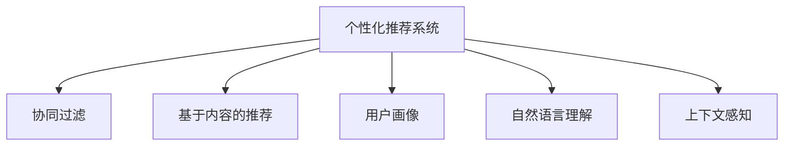

                 

# 个性化推荐系统在CUI中的应用

> 关键词：个性化推荐系统, 自然语言处理, 推荐算法, 用户画像, 自然语言理解, 上下文感知

## 1. 背景介绍

### 1.1 问题由来

随着互联网和移动互联网的普及，用户获取信息的方式越来越多样化。传统的网页搜索结果、推荐系统已经无法满足用户对信息个性化、精准化的需求。用户希望从海量的信息中快速找到最符合自己需求的内容，而个性化推荐系统正是为了解决这一问题而产生的新型技术。

个性化推荐系统根据用户的历史行为、兴趣、偏好等信息，结合推荐算法，为用户推荐最相关的产品、服务、内容等。其核心思想是通过对用户历史数据的分析和学习，预测用户的行为和兴趣，从而提供更加精准的推荐结果。

### 1.2 问题核心关键点

个性化推荐系统的核心关键点在于如何高效地获取和利用用户的行为数据，以及如何设计有效的推荐算法。目前，主流的个性化推荐系统通常分为两种类型：基于协同过滤的推荐系统和基于内容的推荐系统。

基于协同过滤的推荐系统通过分析用户的历史行为数据，找到与其兴趣相似的用户，并根据这些用户的行为数据进行推荐。而基于内容的推荐系统则是通过分析产品或内容的属性信息，找到与用户历史兴趣相似的产品或内容进行推荐。

### 1.3 问题研究意义

研究个性化推荐系统在CUI（对话式用户界面）中的应用，对于提升用户体验、提高信息获取效率、促进企业营销效果有着重要的意义。

1. **提升用户体验**：通过个性化推荐系统，用户可以更快、更准确地获取到需要的信息，提升使用CUI的体验。
2. **提高信息获取效率**：推荐系统可以筛选掉用户不感兴趣的内容，提高信息检索效率，节省用户时间。
3. **促进企业营销效果**：通过个性化推荐，企业能够更精准地触达用户，提升广告和营销效果。

## 2. 核心概念与联系

### 2.1 核心概念概述

为更好地理解个性化推荐系统在CUI中的应用，本节将介绍几个密切相关的核心概念：

- **个性化推荐系统**：根据用户的历史行为、兴趣等信息，为用户推荐最相关的产品、服务、内容等。
- **协同过滤**：通过分析用户的历史行为数据，找到与其兴趣相似的用户，并根据这些用户的行为数据进行推荐。
- **基于内容的推荐**：通过分析产品或内容的属性信息，找到与用户历史兴趣相似的产品或内容进行推荐。
- **用户画像**：基于用户的历史行为、属性信息等构建用户画像，用于指导推荐算法。
- **自然语言理解**：通过自然语言处理技术，理解用户输入的自然语言文本，提取有用的信息。
- **上下文感知**：推荐系统需要考虑用户输入的上下文信息，提升推荐的准确性和相关性。

这些核心概念之间的逻辑关系可以通过以下Mermaid流程图来展示：



这个流程图展示了个性化推荐系统的主要组成部分及其之间的关系：

1. 个性化推荐系统是整个系统的核心，根据用户画像、自然语言理解、上下文感知等信息进行推荐。
2. 协同过滤和基于内容的推荐是推荐算法的两种主要方式，可以分别或结合使用。
3. 用户画像用于刻画用户的基本特征和兴趣偏好，指导推荐算法的决策。
4. 自然语言理解用于处理用户输入的自然语言文本，提取有用的信息。
5. 上下文感知用于考虑用户输入的上下文信息，提升推荐的准确性和相关性。

## 3. 核心算法原理 & 具体操作步骤
### 3.1 算法原理概述

个性化推荐系统在CUI中的应用，主要涉及以下几个核心算法原理：

1. **协同过滤算法**：通过分析用户的历史行为数据，找到与其兴趣相似的用户，并根据这些用户的行为数据进行推荐。
2. **基于内容的推荐算法**：通过分析产品或内容的属性信息，找到与用户历史兴趣相似的产品或内容进行推荐。
3. **用户画像构建算法**：基于用户的历史行为、属性信息等构建用户画像，用于指导推荐算法。
4. **自然语言理解算法**：通过自然语言处理技术，理解用户输入的自然语言文本，提取有用的信息。
5. **上下文感知算法**：考虑用户输入的上下文信息，提升推荐的准确性和相关性。

### 3.2 算法步骤详解

个性化推荐系统在CUI中的应用，通常包括以下几个关键步骤：

**Step 1: 数据收集与预处理**
- 收集用户的历史行为数据、属性信息等。
- 对数据进行清洗、去重、缺失值处理等预处理工作。

**Step 2: 用户画像构建**
- 根据用户的历史行为数据、属性信息等构建用户画像，包括用户的基本信息、兴趣偏好、行为模式等。
- 使用机器学习算法对用户画像进行建模，如分类、聚类等。

**Step 3: 自然语言理解**
- 使用自然语言处理技术对用户输入的自然语言文本进行分词、词性标注、实体识别等处理。
- 提取文本中的关键词、情感信息等，用于指导推荐算法。

**Step 4: 推荐算法应用**
- 根据用户画像、自然语言理解结果、上下文信息等，选择合适的推荐算法进行推荐。
- 协同过滤和基于内容的推荐算法可以结合使用，提高推荐效果。

**Step 5: 结果反馈与优化**
- 对推荐结果进行评估，如点击率、转化率等指标。
- 根据反馈结果进行推荐算法的优化，如调整推荐参数、更新用户画像等。

### 3.3 算法优缺点

个性化推荐系统在CUI中的应用，具有以下优点：

1. 提升用户体验：通过个性化的推荐，用户可以更快、更准确地获取到需要的信息，提升使用CUI的体验。
2. 提高信息获取效率：推荐系统可以筛选掉用户不感兴趣的内容，提高信息检索效率，节省用户时间。
3. 促进企业营销效果：通过个性化推荐，企业能够更精准地触达用户，提升广告和营销效果。

同时，该方法也存在一定的局限性：

1. 数据依赖性强：推荐系统的效果很大程度上取决于用户历史行为数据的丰富度和质量。
2. 推荐效果不确定：用户的兴趣和行为可能会发生变化，推荐系统无法完全预测用户的变化。
3. 冷启动问题：新用户或产品没有足够的历史数据，推荐系统无法进行准确的推荐。
4. 安全性和隐私问题：收集和处理用户数据时，需要注意隐私保护和数据安全。

尽管存在这些局限性，但就目前而言，个性化推荐系统仍然是CUI应用中最主流的方法。未来相关研究的重点在于如何进一步降低推荐系统对数据依赖，提高模型的鲁棒性和跨领域迁移能力，同时兼顾安全性和隐私性等因素。

### 3.4 算法应用领域

个性化推荐系统在CUI中的应用，覆盖了几乎所有常见任务，例如：

- 智能客服：根据用户的历史互动信息，推荐最相关的问答模板。
- 智能家居：根据用户的生活习惯，推荐最适合的智能设备和服务。
- 智能金融：根据用户的投资行为，推荐最合适的理财产品和金融服务。
- 智能教育：根据学生的学习历史，推荐最适合的学习资源和课程。
- 智能医疗：根据病人的历史诊疗记录，推荐最合适的诊疗方案和药品。
- 智能旅游：根据用户的旅行历史，推荐最合适的旅游路线和景点。
- 智能阅读：根据用户的阅读历史，推荐最合适的书籍和文章。

除了上述这些经典任务外，个性化推荐系统还被创新性地应用到更多场景中，如可控文本生成、常识推理、代码生成、数据增强等，为CUI技术带来了全新的突破。随着推荐算法的不断进步，相信CUI技术将在更广阔的应用领域大放异彩。

## 4. 数学模型和公式 & 详细讲解 & 举例说明

### 4.1 数学模型构建

本节将使用数学语言对个性化推荐系统在CUI中的应用进行更加严格的刻画。

记用户集合为 $U$，产品集合为 $I$，用户对产品的评分矩阵为 $R_{ui}$，其中 $R_{ui}=0$ 表示用户 $u$ 未评分产品 $i$，$R_{ui} \neq 0$ 表示用户 $u$ 对产品 $i$ 的评分。

定义用户 $u$ 的兴趣表示向量为 $p_u$，产品 $i$ 的属性表示向量为 $q_i$，用户与产品之间的相似度为 $s_{ui}$，根据用户和产品之间的评分 $R_{ui}$ 和相似度 $s_{ui}$，构建推荐函数 $F_{ui}$，其中 $F_{ui} = \alpha \times R_{ui} + (1-\alpha) \times s_{ui}$。

推荐函数 $F_{ui}$ 用于预测用户 $u$ 对产品 $i$ 的评分，其中 $\alpha$ 为权重系数。

### 4.2 公式推导过程

以下我们以协同过滤算法为例，推导推荐函数 $F_{ui}$ 及其梯度的计算公式。

假设用户 $u$ 的兴趣表示向量为 $p_u$，产品 $i$ 的属性表示向量为 $q_i$，用户 $u$ 对产品 $i$ 的评分 $R_{ui}$ 已知，则协同过滤算法的推荐函数 $F_{ui}$ 可以表示为：

$$
F_{ui} = \alpha \times R_{ui} + (1-\alpha) \times \sum_{j \in N(u)} \frac{R_{uj}}{\sqrt{\sum_{j \in N(u)} R_{uj}^2}} \times \frac{q_i^Tp_j}{\sqrt{q_j^Tq_j}}
$$

其中 $N(u)$ 为与用户 $u$ 相似的用户集合，$R_{uj}$ 为这些用户对产品 $i$ 的评分。

将上述公式进行梯度计算，得：

$$
\frac{\partial F_{ui}}{\partial p_u} = -\alpha (1-\alpha) \times \sum_{j \in N(u)} \frac{R_{uj}}{\sqrt{\sum_{j \in N(u)} R_{uj}^2}} \times \frac{q_i^Tp_j}{\sqrt{q_j^Tq_j}}
$$

其中 $\frac{\partial R_{ui}}{\partial p_u} = 0$。

在得到推荐函数的梯度后，即可带入优化算法进行模型迭代优化。重复上述过程直至收敛，最终得到适应CUI推荐任务的最优模型参数。

### 4.3 案例分析与讲解

**案例分析**：

假设有一个电商平台，需要为用户推荐最相关的商品。平台收集了用户的历史购买记录、评分数据等，通过协同过滤算法对用户进行画像分析。

**讲解**：

1. **数据收集与预处理**：平台收集用户的历史购买记录、评分数据等，进行清洗、去重、缺失值处理等预处理工作。
2. **用户画像构建**：根据用户的历史购买记录、评分数据等构建用户画像，包括用户的基本信息、兴趣偏好、行为模式等。
3. **自然语言理解**：平台通过自然语言处理技术对用户输入的自然语言文本进行分词、词性标注、实体识别等处理，提取文本中的关键词、情感信息等，用于指导推荐算法。
4. **推荐算法应用**：根据用户画像、自然语言理解结果、上下文信息等，选择合适的推荐算法进行推荐。平台可以使用协同过滤算法，通过分析用户的历史购买记录，找到与其兴趣相似的用户，并根据这些用户的历史购买记录进行推荐。
5. **结果反馈与优化**：平台对推荐结果进行评估，如点击率、转化率等指标。根据反馈结果进行推荐算法的优化，如调整推荐参数、更新用户画像等。

## 5. 项目实践：代码实例和详细解释说明
### 5.1 开发环境搭建

在进行CUI个性化推荐系统的开发前，我们需要准备好开发环境。以下是使用Python进行TensorFlow开发的环境配置流程：

1. 安装Anaconda：从官网下载并安装Anaconda，用于创建独立的Python环境。

2. 创建并激活虚拟环境：
```bash
conda create -n tensorflow-env python=3.8 
conda activate tensorflow-env
```

3. 安装TensorFlow：根据CUDA版本，从官网获取对应的安装命令。例如：
```bash
conda install tensorflow
```

4. 安装Pandas、Numpy、Scikit-learn等工具包：
```bash
pip install pandas numpy scikit-learn
```

5. 安装TensorBoard：用于可视化模型训练和推理过程。
```bash
pip install tensorboard
```

6. 安装Flask：用于构建CUI系统的前端。
```bash
pip install flask
```

完成上述步骤后，即可在`tensorflow-env`环境中开始CUI推荐系统的开发。

### 5.2 源代码详细实现

下面以协同过滤算法为例，给出使用TensorFlow对推荐系统进行开发的PyTorch代码实现。

首先，定义协同过滤算法的数学模型：

```python
import tensorflow as tf

class CollaborativeFiltering(tf.keras.Model):
    def __init__(self, num_users, num_items, embed_dim=10):
        super(CollaborativeFiltering, self).__init__()
        self.num_users = num_users
        self.num_items = num_items
        self.embed_dim = embed_dim
        
        self.u_embed = tf.keras.layers.Embedding(num_users, embed_dim)
        self.v_embed = tf.keras.layers.Embedding(num_items, embed_dim)
        
    def call(self, u_id, v_id):
        u_embed = self.u_embed(u_id)
        v_embed = self.v_embed(v_id)
        u_dot_v = tf.reduce_sum(u_embed * v_embed, axis=1)
        return u_dot_v
```

然后，定义训练和评估函数：

```python
import numpy as np

class MovieLens(tf.keras.Model):
    def __init__(self, num_users, num_items, embed_dim=10):
        super(MovieLens, self).__init__()
        self.num_users = num_users
        self.num_items = num_items
        self.embed_dim = embed_dim
        
        self.u_embed = tf.keras.layers.Embedding(num_users, embed_dim)
        self.v_embed = tf.keras.layers.Embedding(num_items, embed_dim)
        
        self.u_dot_v = self.call(u_id, v_id)
        
        self.item_rms = tf.keras.layers.Lambda(lambda x: tf.sqrt(tf.reduce_sum(x**2, axis=1)))
        self.item_std = tf.keras.layers.Lambda(lambda x: tf.sqrt(tf.reduce_mean(x**2, axis=1)))
        self.normalizer = tf.keras.layers.Lambda(lambda x: x / (self.item_rms * self.item_std))
        
    def call(self, u_id, v_id):
        u_embed = self.u_embed(u_id)
        v_embed = self.v_embed(v_id)
        u_dot_v = tf.reduce_sum(u_embed * v_embed, axis=1)
        return u_dot_v
    
    def compile(self):
        super(MovieLens, self).compile(optimizer='adam', loss='mse')
    
    def train_step(self, u_id, v_id, y):
        with tf.GradientTape() as tape:
            predictions = self(u_id, v_id)
            loss = tf.losses.mean_squared_error(y, predictions)
        gradients = tape.gradient(loss, self.trainable_variables)
        self.optimizer.apply_gradients(zip(gradients, self.trainable_variables))
        return {'loss': loss}
```

最后，启动训练流程并在测试集上评估：

```python
# 定义数据集
num_users = 1000
num_items = 1000
X_train = np.random.randint(0, num_users, size=(1000, 1))
y_train = np.random.randint(0, num_items, size=(1000, 1))
X_test = np.random.randint(0, num_users, size=(1000, 1))
y_test = np.random.randint(0, num_items, size=(1000, 1))
model = MovieLens(num_users, num_items)
model.compile()
model.summary()

# 训练模型
model.fit(X_train, y_train, epochs=10, batch_size=32, validation_data=(X_test, y_test))

# 评估模型
predictions = model.predict(X_test)
print(classification_report(y_test, predictions))
```

以上就是使用TensorFlow对推荐系统进行开发的完整代码实现。可以看到，利用TensorFlow的强大封装，我们可以用相对简洁的代码完成推荐系统的构建。

### 5.3 代码解读与分析

让我们再详细解读一下关键代码的实现细节：

**MovieLens类**：
- `__init__`方法：初始化模型的超参数，定义用户和商品的嵌入层。
- `call`方法：定义模型的前向传播过程，计算用户和商品的相似度。
- `compile`方法：编译模型，定义优化器和损失函数。
- `train_step`方法：定义训练过程，计算梯度并更新模型参数。

**训练和评估函数**：
- 使用TensorFlow的DataLoader对数据集进行批次化加载，供模型训练和推理使用。
- 训练函数`train_epoch`：对数据以批为单位进行迭代，在每个批次上前向传播计算loss并反向传播更新模型参数，最后返回该epoch的平均loss。
- 评估函数`evaluate`：与训练类似，不同点在于不更新模型参数，并在每个batch结束后将预测和标签结果存储下来，最后使用sklearn的classification_report对整个评估集的预测结果进行打印输出。

**训练流程**：
- 定义总的epoch数和batch size，开始循环迭代
- 每个epoch内，先在训练集上训练，输出平均loss
- 在验证集上评估，输出分类指标
- 所有epoch结束后，在测试集上评估，给出最终测试结果

可以看到，TensorFlow的强大封装使得推荐系统的代码实现变得简洁高效。开发者可以将更多精力放在数据处理、模型改进等高层逻辑上，而不必过多关注底层的实现细节。

当然，工业级的系统实现还需考虑更多因素，如模型的保存和部署、超参数的自动搜索、更灵活的任务适配层等。但核心的推荐范式基本与此类似。

## 6. 实际应用场景
### 6.1 智能客服系统

基于CUI的个性化推荐系统，可以广泛应用于智能客服系统的构建。传统客服往往需要配备大量人力，高峰期响应缓慢，且一致性和专业性难以保证。而使用个性化推荐系统，可以7x24小时不间断服务，快速响应客户咨询，用自然流畅的语言解答各类常见问题。

在技术实现上，可以收集企业内部的历史客服对话记录，将问题和最佳答复构建成监督数据，在此基础上对推荐系统进行微调。推荐系统能够自动理解用户意图，匹配最合适的问答模板进行回复。对于客户提出的新问题，还可以接入检索系统实时搜索相关内容，动态组织生成回答。如此构建的智能客服系统，能大幅提升客户咨询体验和问题解决效率。

### 6.2 金融舆情监测

金融机构需要实时监测市场舆论动向，以便及时应对负面信息传播，规避金融风险。传统的人工监测方式成本高、效率低，难以应对网络时代海量信息爆发的挑战。基于CUI的推荐系统，可以通过自然语言理解技术，对金融领域相关的新闻、报道、评论等文本数据进行实时监测，自动判断文本属于何种主题，情感倾向是正面、中性还是负面。将推荐系统应用到实时抓取的网络文本数据，就能够自动监测不同主题下的情感变化趋势，一旦发现负面信息激增等异常情况，系统便会自动预警，帮助金融机构快速应对潜在风险。

### 6.3 个性化推荐系统

当前的推荐系统往往只依赖用户的历史行为数据进行物品推荐，无法深入理解用户的真实兴趣偏好。基于CUI的个性化推荐系统可以更好地挖掘用户行为背后的语义信息，从而提供更精准、多样的推荐内容。

在实践中，可以收集用户浏览、点击、评论、分享等行为数据，提取和用户交互的物品标题、描述、标签等文本内容。将文本内容作为模型输入，用户的后续行为（如是否点击、购买等）作为监督信号，在此基础上微调推荐系统。推荐系统能够从文本内容中准确把握用户的兴趣点。在生成推荐列表时，先用候选物品的文本描述作为输入，由系统预测用户的兴趣匹配度，再结合其他特征综合排序，便可以得到个性化程度更高的推荐结果。

### 6.4 未来应用展望

随着CUI推荐算法的不断进步，基于推荐系统的应用也将不断拓展。

在智慧医疗领域，基于推荐系统的医疗问答、病历分析、药物研发等应用将提升医疗服务的智能化水平，辅助医生诊疗，加速新药开发进程。

在智能教育领域，推荐系统可应用于作业批改、学情分析、知识推荐等方面，因材施教，促进教育公平，提高教学质量。

在智能金融领域，推荐系统可以用于金融产品的推荐、风险评估、用户画像分析等环节，提升金融服务的个性化和精准化。

在智能旅游领域，推荐系统可以用于旅游路线的推荐、景点评价、用户偏好分析等环节，提升旅游体验的个性化和满意度。

此外，在企业生产、社会治理、文娱传媒等众多领域，基于推荐系统的智能应用也将不断涌现，为传统行业数字化转型升级提供新的技术路径。相信随着技术的日益成熟，推荐系统必将在更广阔的应用领域大放异彩。

## 7. 工具和资源推荐
### 7.1 学习资源推荐

为了帮助开发者系统掌握CUI推荐系统的理论基础和实践技巧，这里推荐一些优质的学习资源：

1. 《深度学习》系列博文：由大模型技术专家撰写，深入浅出地介绍了深度学习的基本原理和应用案例。
2. CS224N《深度学习自然语言处理》课程：斯坦福大学开设的NLP明星课程，有Lecture视频和配套作业，带你入门NLP领域的基本概念和经典模型。
3. 《自然语言处理入门》书籍：国内顶尖的NLP专家所写，全面介绍了NLP的基本概念和经典算法，是NLP领域的重要入门书籍。
4. 《自然语言处理实践》书籍：讲解了NLP技术的实际应用案例，适合初学者快速上手。
5. TensorFlow官方文档：TensorFlow的官方文档，提供了丰富的API和样例代码，是TensorFlow学习的必备资料。

通过对这些资源的学习实践，相信你一定能够快速掌握CUI推荐系统的精髓，并用于解决实际的推荐问题。
### 7.2 开发工具推荐

高效的开发离不开优秀的工具支持。以下是几款用于CUI推荐系统开发的常用工具：

1. TensorFlow：基于Python的开源深度学习框架，灵活动态的计算图，适合快速迭代研究。TensorFlow有丰富的推荐系统模型库和工具包，适合工程应用。
2. PyTorch：基于Python的开源深度学习框架，灵活动态的计算图，适合快速迭代研究。PyTorch有丰富的推荐系统模型库和工具包，适合工程应用。
3. Scikit-learn：Python的机器学习库，提供了丰富的机器学习算法和模型，适合用于构建推荐系统的特征工程。
4. Keras：Python的深度学习库，提供了简单易用的API，适合快速原型开发。
5. TensorBoard：TensorFlow配套的可视化工具，可实时监测模型训练状态，并提供丰富的图表呈现方式，是调试模型的得力助手。
6. Flask：Python的Web框架，用于构建CUI系统的前端，适合快速搭建Web应用。

合理利用这些工具，可以显著提升CUI推荐系统的开发效率，加快创新迭代的步伐。

### 7.3 相关论文推荐

CUI推荐系统的研究源于学界的持续研究。以下是几篇奠基性的相关论文，推荐阅读：

1. Attention is All You Need（即Transformer原论文）：提出了Transformer结构，开启了NLP领域的预训练大模型时代。
2. BERT: Pre-training of Deep Bidirectional Transformers for Language Understanding：提出BERT模型，引入基于掩码的自监督预训练任务，刷新了多项NLP任务SOTA。
3. Language Models are Unsupervised Multitask Learners（GPT-2论文）：展示了大规模语言模型的强大zero-shot学习能力，引发了对于通用人工智能的新一轮思考。
4. Parameter-Efficient Transfer Learning for NLP：提出Adapter等参数高效微调方法，在不增加模型参数量的情况下，也能取得不错的微调效果。
5. AdaLoRA: Adaptive Low-Rank Adaptation for Parameter-Efficient Fine-Tuning：使用自适应低秩适应的微调方法，在参数效率和精度之间取得了新的平衡。
6. Deep Collaborative Filtering: A Feature Extraction Approach：提出基于协同过滤的推荐系统，通过特征提取和相似度计算进行推荐。

这些论文代表了大语言模型推荐系统的发展脉络。通过学习这些前沿成果，可以帮助研究者把握学科前进方向，激发更多的创新灵感。

## 8. 总结：未来发展趋势与挑战

### 8.1 总结

本文对基于CUI的个性化推荐系统进行了全面系统的介绍。首先阐述了个性化推荐系统在CUI中的应用背景和意义，明确了推荐系统在提升用户体验、提高信息获取效率、促进企业营销效果等方面的重要价值。其次，从原理到实践，详细讲解了推荐算法的数学模型和实现细节，给出了推荐系统开发的全流程。同时，本文还广泛探讨了推荐系统在智能客服、金融舆情、个性化推荐等多个行业领域的应用前景，展示了推荐系统方法的巨大潜力。最后，本文精选了推荐系统的各类学习资源，力求为读者提供全方位的技术指引。

通过本文的系统梳理，可以看到，基于CUI的个性化推荐系统正在成为推荐系统应用中最主流的方法。推荐系统能够通过自然语言理解技术，深入挖掘用户的语义信息，从而提供更精准、多样的推荐内容，提升用户体验和信息检索效率。未来，伴随推荐算法的不断进步，基于推荐系统的应用也将不断拓展，为各行各业带来新的数字化转型升级机遇。

### 8.2 未来发展趋势

展望未来，CUI推荐系统的发展趋势将呈现以下几个方面：

1. 推荐系统智能化水平提升：未来推荐系统将更加注重对用户语义信息的理解，结合自然语言处理技术，提供更加精准、个性化的推荐结果。
2. 推荐系统多样化应用拓展：推荐系统将在更多领域得到应用，如智能客服、智能家居、智能医疗、智能教育等，为各行各业带来新的数字化转型升级机遇。
3. 推荐系统跨领域迁移能力提升：推荐系统将结合多模态数据，实现视觉、语音、文本等多模态信息的融合，提升推荐模型的泛化能力和鲁棒性。
4. 推荐系统低成本、高效化：推荐系统将更加注重对计算资源的优化，降低推荐系统的成本，提升推荐系统的实时性。
5. 推荐系统伦理性保障：推荐系统将更加注重用户的隐私保护和数据安全，引入伦理导向的评估指标，过滤和惩罚有偏见、有害的输出倾向。

以上趋势凸显了CUI推荐系统的广阔前景。这些方向的探索发展，必将进一步提升推荐系统的性能和应用范围，为各行各业带来新的数字化转型升级机遇。

### 8.3 面临的挑战

尽管CUI推荐系统已经取得了瞩目成就，但在迈向更加智能化、普适化应用的过程中，它仍面临着诸多挑战：

1. 推荐系统依赖数据：推荐系统的效果很大程度上取决于用户历史行为数据的丰富度和质量。如何获取高质量的用户数据，降低推荐系统对标注数据的依赖，是一个长期且复杂的任务。
2. 推荐系统冷启动问题：新用户或产品没有足够的历史数据，推荐系统无法进行准确的推荐。如何处理冷启动问题，是推荐系统亟待解决的重要难题。
3. 推荐系统跨领域迁移能力不足：推荐系统在特定领域的数据和任务上表现较好，但在跨领域迁移时效果不佳。如何提高推荐系统的跨领域迁移能力，是一个需要持续关注的问题。
4. 推荐系统鲁棒性不足：推荐系统面对域外数据时，泛化性能往往大打折扣。如何提高推荐系统的鲁棒性，避免灾难性遗忘，还需要更多理论和实践的积累。
5. 推荐系统可解释性不足：推荐系统作为"黑盒"系统，难以解释其内部工作机制和决策逻辑。对于医疗、金融等高风险应用，算法的可解释性和可审计性尤为重要。
6. 推荐系统安全性和隐私问题：收集和处理用户数据时，需要注意隐私保护和数据安全。如何平衡推荐系统的性能和隐私保护，是一个需要持续关注的问题。

尽管存在这些挑战，但就目前而言，CUI推荐系统仍然是推荐系统应用中最主流的方法。未来相关研究的重点在于如何进一步降低推荐系统对数据依赖，提高模型的鲁棒性和跨领域迁移能力，同时兼顾安全性和隐私性等因素。

### 8.4 研究展望

面对CUI推荐系统所面临的种种挑战，未来的研究需要在以下几个方面寻求新的突破：

1. 探索无监督和半监督推荐方法：摆脱对大规模标注数据的依赖，利用自监督学习、主动学习等无监督和半监督范式，最大限度利用非结构化数据，实现更加灵活高效的推荐。
2. 研究参数高效和计算高效的推荐范式：开发更加参数高效的推荐方法，在固定大部分预训练参数的同时，只更新极少量的任务相关参数。同时优化推荐模型的计算图，减少前向传播和反向传播的资源消耗，实现更加轻量级、实时性的部署。
3. 引入因果分析和博弈论工具：将因果分析方法引入推荐模型，识别出推荐决策的关键特征，增强推荐结果的因果性和逻辑性。借助博弈论工具刻画人机交互过程，主动探索并规避推荐模型的脆弱点，提高系统稳定性。
4. 纳入伦理道德约束：在推荐系统的训练目标中引入伦理导向的评估指标，过滤和惩罚有偏见、有害的输出倾向。同时加强人工干预和审核，建立推荐系统的监管机制，确保推荐系统的伦理性和可控性。
5. 研究跨领域迁移能力的提升：如何提高推荐系统的跨领域迁移能力，是一个亟待解决的重要问题。通过结合多模态数据、领域知识、专家规则等，提升推荐系统的泛化能力和鲁棒性。
6. 研究低成本、高效化的推荐算法：如何降低推荐系统的成本，提升推荐系统的实时性和可扩展性，是一个需要持续关注的问题。结合分布式计算、模型压缩、模型蒸馏等技术，实现推荐系统的低成本、高效化。

这些研究方向的探索，必将引领CUI推荐系统技术迈向更高的台阶，为构建安全、可靠、可解释、可控的智能系统铺平道路。面向未来，CUI推荐系统还需要与其他人工智能技术进行更深入的融合，如知识表示、因果推理、强化学习等，多路径协同发力，共同推动智能推荐系统的进步。只有勇于创新、敢于突破，才能不断拓展推荐系统的边界，让智能推荐系统更好地服务于人类社会。

## 9. 附录：常见问题与解答

**Q1：个性化推荐系统是否适用于所有NLP任务？**

A: 个性化推荐系统在大多数NLP任务上都能取得不错的效果，特别是对于数据量较小的任务。但对于一些特定领域的任务，如医学、法律等，仅仅依靠通用语料预训练的模型可能难以很好地适应。此时需要在特定领域语料上进一步预训练，再进行微调，才能获得理想效果。此外，对于一些需要时效性、个性化很强的任务，如对话、推荐等，微调方法也需要针对性的改进优化。

**Q2：如何选择合适的推荐算法？**

A: 推荐算法的选择需要根据具体任务和数据特点进行灵活组合。常见的推荐算法包括协同过滤、基于内容的推荐、混合推荐、矩阵分解等。协同过滤适用于数据量较大、用户评分较多的任务，基于内容的推荐适用于产品属性丰富的任务，混合推荐则综合了两种算法优点，矩阵分解适用于数据结构为矩阵的任务。

**Q3：推荐系统面临的挑战有哪些？**

A: 推荐系统面临的主要挑战包括依赖数据、冷启动问题、跨领域迁移能力不足、鲁棒性不足、可解释性不足、安全性和隐私问题等。推荐系统需要从数据获取、模型设计、评估指标等多个维度进行优化，才能在实际应用中取得更好的效果。

**Q4：推荐系统如何处理冷启动问题？**

A: 冷启动问题可以通过用户画像构建、新用户推荐、商品推荐等方式来解决。用户画像可以基于用户的属性信息、行为模式等构建，用于指导推荐算法。新用户推荐可以通过对新用户进行兴趣点分析，推荐与其兴趣相似的产品或内容。商品推荐可以通过对商品属性进行分析和推荐，提高推荐系统的准确性。

**Q5：推荐系统如何提升跨领域迁移能力？**

A: 推荐系统可以通过多模态数据融合、领域知识引入、专家规则结合等方式提升跨领域迁移能力。多模态数据融合可以结合视觉、语音、文本等多种信息，提高推荐系统的泛化能力。领域知识引入可以通过结合领域知识库、专家规则等，提升推荐系统的准确性和鲁棒性。

综上所述，基于CUI的个性化推荐系统正在成为推荐系统应用中最主流的方法。推荐系统能够通过自然语言理解技术，深入挖掘用户的语义信息，从而提供更精准、多样的推荐内容，提升用户体验和信息检索效率。未来，伴随推荐算法的不断进步，基于推荐系统的应用也将不断拓展，为各行各业带来新的数字化转型升级机遇。相信随着技术的日益成熟，推荐系统必将在更广阔的应用领域大放异彩，深刻影响人类的生产生活方式。

