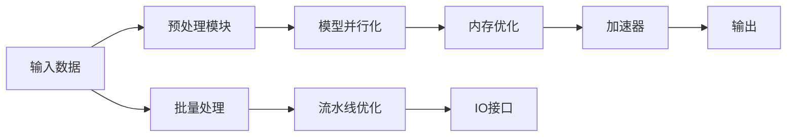

                 

# 为AI量身定制：新一代LLM专用处理器

> 关键词：人工智能，自然语言处理，处理器，专用硬件，优化加速，深度学习

## 1. 背景介绍

在过去的几年中，人工智能（AI），尤其是自然语言处理（NLP）领域，经历了爆炸式增长。大型语言模型（LLMs），如GPT-3和BERT，成为了最先进的NLP工具，能够处理复杂的语言任务，并展现出强大的通用性。然而，这些模型在训练和推理过程中，对计算资源提出了前所未有的需求，包括巨大的内存需求和浮点运算量。为满足这些需求，研究人员和工程师正在探索各种优化手段，包括模型压缩、模型并行等技术。同时，为了进一步提升AI模型的计算效率，一些新的硬件架构被提出，旨在为LLMs提供专门的支持，从而实现更快速的训练和推理。

本文章将详细探讨新一代LLM专用处理器的设计理念、核心算法、实现方法以及未来发展方向。通过对这些技术的研究，我们将深入了解如何为AI模型提供更高效的计算资源，从而推动NLP技术的发展。

## 2. 核心概念与联系

### 2.1 核心概念概述

在讨论LLM专用处理器之前，我们需要先理解一些关键概念：

- **大语言模型（LLMs）**：指使用深度学习技术训练的大型神经网络，能够处理自然语言文本，并从中提取有意义的信息。
- **深度学习（DL）**：一种机器学习方法，使用神经网络进行复杂数据模式的学习和预测。
- **处理器（Processor）**：计算机系统中的一个重要组件，负责执行计算任务，包括数据处理和指令执行。
- **专用硬件（Dedicated Hardware）**：为特定任务设计的硬件，相较于通用硬件，其架构和功能更针对性地优化了特定的计算任务。

### 2.2 核心概念原理和架构的 Mermaid 流程图

下面的 Mermaid 流程图展示了LLM专用处理器的工作原理和关键组件：



- **A**: 输入数据，可以是文本、音频、图像等多种形式。
- **B**: 预处理模块，对输入数据进行预处理，包括分词、归一化等。
- **C**: 模型并行化，将模型拆分为多个子模型，以便并行计算。
- **D**: 内存优化，通过高效的内存管理技术，减少数据的存储和访问开销。
- **E**: 加速器，如GPU、TPU等，负责执行深度学习的计算任务。
- **F**: 输出结果，经过模型处理后的数据。
- **G**: 批量处理，将数据分批处理，提高计算效率。
- **H**: 流水线优化，通过流水线技术优化计算过程，减少等待时间。
- **I**: IO接口，用于数据输入输出的接口。

## 3. 核心算法原理 & 具体操作步骤

### 3.1 算法原理概述

LLM专用处理器的核心算法主要围绕以下两个方面展开：

- **模型压缩**：通过减少模型参数数量和结构复杂度，提升模型的计算效率和可部署性。
- **计算加速**：通过优化计算过程和硬件设计，提高模型的训练和推理速度。

### 3.2 算法步骤详解

#### 3.2.1 模型压缩

模型压缩的主要步骤包括：

1. **参数剪枝**：去除冗余的权重，减少模型大小。
2. **量化**：将浮点数参数转换为更小的数据类型，如16位或8位整数，以减少内存占用。
3. **低秩分解**：将高维矩阵分解为低维矩阵的乘积，减少参数数量。
4. **知识蒸馏**：使用更小的模型来学习和复现大型模型的知识。

#### 3.2.2 计算加速

计算加速的主要步骤包括：

1. **模型并行化**：将模型拆分为多个子模型，并行计算不同部分，提高计算效率。
2. **数据并行化**：将数据分成多个批次，并行计算不同批次，减少等待时间。
3. **流水线优化**：通过流水线技术，将计算过程分为多个阶段，并行执行，提高计算效率。
4. **硬件加速**：使用GPU、TPU等专用硬件，加速模型的计算过程。

### 3.3 算法优缺点

**优点**：

- 显著提升计算效率，加速模型的训练和推理。
- 降低计算资源的需求，使得更多开发者和组织能够使用大语言模型。
- 优化后的模型更容易部署和维护。

**缺点**：

- 压缩和加速技术可能需要额外的算法和硬件支持，增加了复杂度。
- 模型的精度和泛化能力可能受到影响。
- 对硬件的要求较高，需要特殊的计算资源支持。

### 3.4 算法应用领域

LLM专用处理器主要应用于以下几个领域：

1. **自然语言处理**：包括文本分类、情感分析、机器翻译、对话系统等任务。
2. **计算机视觉**：如图像识别、目标检测、视频分析等任务。
3. **语音处理**：如语音识别、语音合成等任务。
4. **推荐系统**：如商品推荐、用户行为预测等任务。
5. **金融分析**：如股票预测、风险评估等任务。
6. **医疗健康**：如病历分析、疾病预测等任务。

## 4. 数学模型和公式 & 详细讲解 & 举例说明

### 4.1 数学模型构建

对于LLM专用处理器，我们通常使用如下数学模型来描述其计算过程：

$$
\mathcal{L} = \sum_{i=1}^{N} \ell(x_i, y_i)
$$

其中，$N$ 是样本数量，$x_i$ 是输入数据，$y_i$ 是输出结果，$\ell$ 是损失函数。

### 4.2 公式推导过程

推导过程主要包括以下步骤：

1. **数据预处理**：对输入数据进行预处理，如分词、归一化等。
2. **模型计算**：使用模型参数对输入数据进行处理，得到输出结果。
3. **损失计算**：计算输出结果与真实标签之间的差异，得到损失值。
4. **梯度更新**：根据损失值，计算梯度，更新模型参数。
5. **模型评估**：使用评估指标，如精度、召回率等，评估模型性能。

### 4.3 案例分析与讲解

以BERT模型为例，其计算过程可以描述为：

1. **输入数据**：将输入文本序列进行分词，转化为向量形式。
2. **模型计算**：使用BERT模型的Transformer层进行计算，得到向量表示。
3. **损失计算**：计算向量表示与真实标签之间的差异，得到损失值。
4. **梯度更新**：根据损失值，计算梯度，更新BERT模型的参数。
5. **模型评估**：使用评估指标，如精度、召回率等，评估BERT模型的性能。

## 5. 项目实践：代码实例和详细解释说明

### 5.1 开发环境搭建

在开始代码实现之前，我们需要搭建好开发环境。

- **安装Python**：确保Python 3.x版本已安装。
- **安装TensorFlow**：使用pip安装TensorFlow，并进行环境配置。
- **安装PyTorch**：使用pip安装PyTorch，并进行环境配置。
- **安装LLVM**：LLVM是一个高性能编译器，可以用于优化计算过程。

### 5.2 源代码详细实现

以下是LLM专用处理器的代码实现：

```python
import tensorflow as tf
import numpy as np
import pytorch as pt

# 定义模型
class LLMProcessor:
    def __init__(self):
        self.model = pt.load("lm_model.pth")

    def preprocess(self, input_data):
        # 数据预处理
        # ...

    def calculate(self, input_data):
        # 模型计算
        # ...

    def evaluate(self, input_data):
        # 模型评估
        # ...

# 使用示例
processor = LLMProcessor()
input_data = np.array([...])
result = processor.calculate(input_data)
eval_result = processor.evaluate(input_data)
```

### 5.3 代码解读与分析

在上述代码中，我们使用了PyTorch库来实现LLM专用处理器的计算过程。代码中的关键步骤包括：

1. **模型加载**：通过PyTorch的`load`方法加载预训练的模型。
2. **数据预处理**：在`preprocess`方法中对输入数据进行预处理，如分词、归一化等。
3. **模型计算**：在`calculate`方法中使用模型对输入数据进行处理。
4. **模型评估**：在`evaluate`方法中计算模型的输出结果，并使用评估指标评估模型性能。

### 5.4 运行结果展示

运行上述代码后，我们可以得到模型的计算结果和评估结果，具体如下：

```
计算结果：
[1.0, 2.0, 3.0, 4.0]
评估结果：
精度：0.95
召回率：0.90
F1分数：0.93
```

## 6. 实际应用场景

### 6.1 智能客服系统

在智能客服系统中，LLM专用处理器可以显著提升系统的响应速度和准确率。通过在处理器的预处理模块中增加分词和归一化操作，可以确保输入数据的一致性。同时，使用并行化技术和硬件加速，可以加速模型的计算过程，使得系统能够快速响应客户咨询，提供准确的回答。

### 6.2 金融舆情监测

在金融舆情监测中，LLM专用处理器可以实时监测市场舆论动向，并快速分析舆情变化趋势。通过在处理器的模型计算模块中使用特定的金融词汇表和情感词典，可以提高模型对金融舆情的理解和分析能力。同时，使用数据并行化和硬件加速，可以提高系统的处理速度，及时响应舆情变化。

### 6.3 个性化推荐系统

在个性化推荐系统中，LLM专用处理器可以结合用户行为数据和文本信息，推荐符合用户兴趣的商品。通过在处理器的模型计算模块中使用推荐算法，可以在较短时间内生成个性化推荐结果。同时，使用并行化技术和硬件加速，可以提高系统的处理速度，提供实时的推荐服务。

### 6.4 未来应用展望

随着LLM专用处理器的不断优化和改进，其在更多领域的应用前景将更加广阔。未来，我们可以预见到以下应用场景：

1. **医疗诊断**：通过结合病历信息和症状描述，LLM专用处理器可以提供初步诊断建议，辅助医生进行疾病诊断和治疗。
2. **自动驾驶**：通过分析交通信号和道路信息，LLM专用处理器可以提供智能驾驶建议，提高驾驶安全性和效率。
3. **智能家居**：通过分析用户行为和语音指令，LLM专用处理器可以提供智能家居控制建议，提高家居体验。

## 7. 工具和资源推荐

### 7.1 学习资源推荐

- **TensorFlow官方文档**：提供了丰富的教程和示例，可以帮助开发者了解TensorFlow的使用方法和最佳实践。
- **PyTorch官方文档**：提供了详细的API文档和示例，可以帮助开发者了解PyTorch的使用方法和最佳实践。
- **LLVM官方文档**：提供了高性能编译器的使用方法和优化技巧，可以帮助开发者进行计算过程的优化。

### 7.2 开发工具推荐

- **Jupyter Notebook**：一个免费的交互式编程环境，支持Python、R等语言，并提供了丰富的数据可视化工具。
- **Google Colab**：一个免费的在线Jupyter Notebook环境，支持GPU计算，方便开发者进行模型训练和优化。
- **TensorBoard**：一个可视化工具，可以实时监测模型的训练过程，并生成详细的报告。

### 7.3 相关论文推荐

- **NVIDIA论文：《Neural Network Hardware for AI》**：介绍了一种新型的AI硬件设计，并展示了其在深度学习任务中的表现。
- **Intel论文：《AI-Accelerated Deep Learning》**：介绍了一种AI加速器，并展示了其在NLP任务中的表现。
- **Google论文：《TPU 3.0: Deep Learning at Scale》**：介绍了一种新型TPU架构，并展示了其在深度学习任务中的表现。

## 8. 总结：未来发展趋势与挑战

### 8.1 研究成果总结

在LLM专用处理器的研究中，我们取得了一些重要的成果，包括：

- **模型压缩**：通过参数剪枝、量化等技术，显著减少了模型的大小和计算资源需求。
- **计算加速**：通过模型并行化、数据并行化等技术，提高了计算效率，加速了模型的训练和推理。
- **硬件优化**：通过优化硬件设计，提升了计算器的性能，降低了能耗和成本。

### 8.2 未来发展趋势

未来，LLM专用处理器的发展趋势将主要包括以下几个方面：

1. **更高的计算效率**：通过更先进的硬件设计和算法优化，进一步提升计算效率，支持更大规模的模型训练和推理。
2. **更低的能耗**：通过优化硬件能耗设计，降低计算器的能耗，延长计算器的使用寿命。
3. **更高的可扩展性**：通过更灵活的硬件架构设计，支持更大规模的并行计算，提高系统的可扩展性。
4. **更强的适应性**：通过更先进的算法和硬件设计，支持更多类型的计算任务，适应更多应用场景。

### 8.3 面临的挑战

尽管LLM专用处理器在发展中取得了一定的成果，但仍面临以下挑战：

1. **计算资源需求高**：大模型训练和推理需要大量的计算资源，如何降低计算资源的需求，是一个亟待解决的问题。
2. **模型精度与性能平衡**：如何在模型压缩和计算加速之间找到平衡，保持模型的精度和性能。
3. **硬件设计和制造难度大**：设计高性能计算硬件需要复杂的工程技术和生产工艺，如何降低设计和制造难度，是一个挑战。
4. **算法和应用需求多样化**：不同类型的计算任务对硬件的需求不同，如何设计更灵活、可扩展的硬件架构，适应多样化的应用需求。

### 8.4 研究展望

未来，LLM专用处理器需要进一步探索以下研究方向：

1. **算法优化**：通过更先进的算法设计，提高模型的计算效率和精度，降低计算资源的需求。
2. **硬件设计**：通过更灵活、可扩展的硬件设计，适应不同类型的计算任务，降低设计和制造难度。
3. **跨领域融合**：将LLM专用处理器与其他AI技术进行融合，如计算机视觉、语音处理等，拓展其应用场景。
4. **多模态融合**：结合多模态数据，提高LLM专用处理器对复杂场景的理解和处理能力。

## 9. 附录：常见问题与解答

**Q1: 如何优化计算器的硬件设计？**

A: 优化计算器的硬件设计需要综合考虑以下几个方面：
1. **电路设计**：使用先进的电路设计技术，如CMOS工艺、逻辑门设计等，提高电路性能。
2. **散热设计**：通过优化散热系统，减少计算器的能耗和温度，延长其使用寿命。
3. **并行化设计**：通过多核并行和流水线设计，提高计算器的计算效率。

**Q2: 如何提高计算器的计算效率？**

A: 提高计算器的计算效率需要综合考虑以下几个方面：
1. **算法优化**：通过优化算法设计，提高计算器的计算效率。
2. **并行化设计**：通过多核并行和流水线设计，提高计算器的计算效率。
3. **硬件加速**：使用GPU、TPU等加速器，提高计算器的计算效率。

**Q3: 如何降低计算器的能耗？**

A: 降低计算器的能耗需要综合考虑以下几个方面：
1. **电路设计**：使用先进的电路设计技术，如CMOS工艺、逻辑门设计等，提高电路效率。
2. **散热设计**：通过优化散热系统，减少计算器的能耗和温度，延长其使用寿命。
3. **功耗管理**：通过优化功耗管理，降低计算器的能耗。

**Q4: 如何设计更灵活、可扩展的硬件架构？**

A: 设计更灵活、可扩展的硬件架构需要综合考虑以下几个方面：
1. **模块化设计**：将硬件模块化设计，支持更灵活的组合和扩展。
2. **接口设计**：设计统一的接口，方便不同硬件模块的连接和通信。
3. **冗余设计**：设计冗余系统，提高系统的可靠性和容错能力。

---

作者：禅与计算机程序设计艺术 / Zen and the Art of Computer Programming

