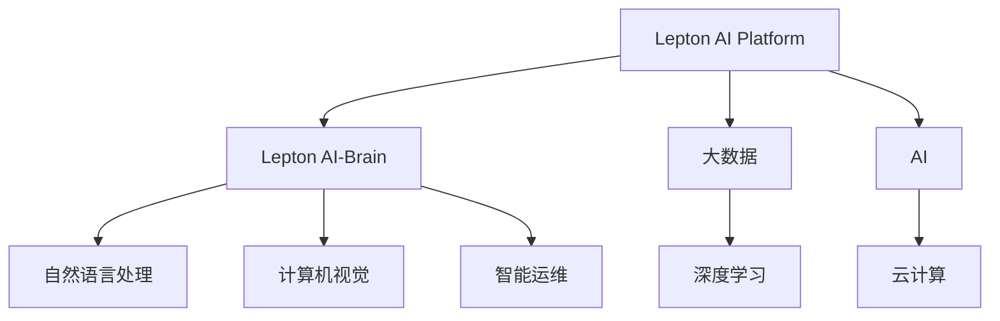

                 

# 云服务的AI化转型：Lepton AI的引领作用

> 关键词：云服务,人工智能(AI),转型,Lepton AI,大数据,深度学习,自动化,智能运维

## 1. 背景介绍

在过去的十年里，云计算技术迅猛发展，已经成为全球数字化转型的基础设施。然而，随着业务规模的不断扩大，传统云服务在性能、成本、安全等方面开始面临新的挑战。为应对这些挑战，各大云服务商纷纷在云服务的AI化转型上投入巨大。其中，Lepton AI作为新兴的云服务提供商，凭借其在AI和大数据技术上的深厚积累，正在引领全球云服务的AI化转型。

Lepton AI成立于2018年，总部设在硅谷，致力于通过人工智能技术驱动云服务的智能化转型。其核心产品包括Lepton AI Platform（云服务平台）和Lepton AI-Brain（AI大模型）。Lepton AI Platform提供高性能、低成本、高安全性的云基础设施，同时内置Lepton AI-Brain，能够自动进行模型训练、推理和优化，显著降低了开发者和运维人员的负担。Lepton AI-Brain则是由Lepton AI自主研发的深度学习大模型，广泛应用于自然语言处理、计算机视觉、智能运维等多个领域，提供了强大的AI能力支持。

本文将深入探讨Lepton AI如何通过AI化转型，重新定义云服务的价值和边界，引领行业发展新趋势。

## 2. 核心概念与联系

### 2.1 核心概念概述

为更好地理解Lepton AI的AI化转型过程，本节将介绍几个关键概念：

- **云服务(Cloud Services)**：通过互联网提供计算、存储、网络等基础设施的服务，如AWS、Azure、Google Cloud等。
- **人工智能(AI)**：模拟、延伸和扩展人的智能过程，包括感知、学习、推理、自然语言处理、计算机视觉等。
- **大数据(Big Data)**：规模巨大、复杂多样、实时生成并存储的数据，包括结构化、半结构化和非结构化数据。
- **深度学习(Deep Learning)**：模拟人脑神经网络的多层结构，用于处理大规模数据并提取高级特征的机器学习技术。
- **Lepton AI Platform**：Lepton AI提供的云服务平台，内置Lepton AI-Brain，能够自动进行模型训练、推理和优化，降低了开发者和运维人员的负担。
- **Lepton AI-Brain**：Lepton AI自主研发的深度学习大模型，应用于自然语言处理、计算机视觉、智能运维等多个领域，提供了强大的AI能力支持。

这些概念之间的逻辑关系可以通过以下Mermaid流程图来展示：



这个流程图展示了一个完整的Lepton AI平台框架：

1. 通过云计算基础设施提供高性能、低成本、高安全性的服务。
2. 内置深度学习大模型Lepton AI-Brain，支持多种AI应用场景。
3. Lepton AI-Brain结合大数据和深度学习技术，提供强大的AI能力支持。
4. 用户通过API调用服务，无需担心模型训练、推理和优化等底层细节。

## 3. 核心算法原理 & 具体操作步骤
### 3.1 算法原理概述

Lepton AI平台的核心算法原理主要包括以下几个方面：

- **自动模型训练**：利用Lepton AI-Brain，自动进行模型训练和参数优化，无需手动调整超参数。
- **模型推理优化**：内置高效的推理引擎，自动进行模型推理和优化，提升推理速度和精度。
- **数据自动化管理**：通过大数据技术，自动进行数据清洗、特征工程和存储管理，提升数据处理效率。
- **自动化运维**：利用AI技术进行系统监控、异常检测和自动修复，提升系统稳定性和可用性。

这些核心算法原理构成了Lepton AI平台的核心竞争力，使其能够提供高性能、高效率、高安全性的云服务。

### 3.2 算法步骤详解

以下是Lepton AI平台的主要操作步骤：

**Step 1: 创建Lepton AI平台账户**
- 访问Lepton AI官网，注册并创建账户。
- 激活账户，设置必要的权限和参数，如API密钥、存储空间等。

**Step 2: 数据上传和管理**
- 上传数据到Lepton AI平台，支持多种数据格式和来源。
- 使用平台提供的工具进行数据清洗和预处理，如去噪、归一化等。
- 定义数据集，进行特征工程，选择训练和测试集。

**Step 3: 模型训练和调优**
- 选择合适的模型架构，如卷积神经网络(CNN)、递归神经网络(RNN)、Transformer等。
- 配置训练参数，如学习率、批次大小、迭代次数等。
- 启动训练，Lepton AI自动进行模型训练和参数优化。
- 在训练过程中，Lepton AI自动记录训练日志，生成训练报告，供用户参考和优化。

**Step 4: 模型推理和部署**
- 将训练好的模型部署到Lepton AI平台，支持多种部署方式，如API接口、SDK插件、容器服务等。
- 定义推理参数，如输入格式、推理批次大小等。
- 进行推理测试，Lepton AI自动进行模型推理和结果验证。
- 生成推理报告，输出推理结果，进行后处理。

**Step 5: 自动化运维和监控**
- 配置自动化运维策略，如异常检测、自动重启、告警通知等。
- 实时监控系统状态，Lepton AI自动进行异常检测和预警。
- 自动进行系统修复，减少停机时间，提升系统可用性。

### 3.3 算法优缺点

Lepton AI平台的自动模型训练和优化、高效推理引擎、数据自动化管理、自动化运维等功能，具有以下优点：

- **提升效率**：自动模型训练和优化减少了手动调参的工作量，快速迭代模型性能。
- **降低成本**：高效推理引擎和自动运维减少了硬件和人力成本。
- **提高精度**：自动数据清洗和特征工程提升了数据质量，提高模型精度。
- **增强稳定性**：自动异常检测和修复提升了系统可用性和稳定性。

同时，该平台也存在一些局限性：

- **数据依赖**：模型性能很大程度上取决于数据质量，数据清洗和预处理的工作量较大。
- **模型复杂度**：对于一些复杂模型，自动调参可能难以达到最优效果，需要手动调优。
- **资源消耗**：自动数据处理和模型训练需要占用大量计算资源，尤其是在大规模数据集上。

尽管存在这些局限性，但Lepton AI平台在自动化、高效性和稳定性上的优势，使其成为云计算服务AI化转型的重要工具。

### 3.4 算法应用领域

Lepton AI平台的主要应用领域包括以下几个方面：

- **自然语言处理(NLP)**：用于文本分类、情感分析、机器翻译、问答系统等。
- **计算机视觉(CV)**：用于图像识别、物体检测、视频分析等。
- **智能运维(AIOps)**：用于系统监控、异常检测、自动修复等。
- **推荐系统**：用于个性化推荐、商品推荐、广告推荐等。
- **语音识别与生成**：用于语音识别、语音合成、语音转写等。

此外，Lepton AI-Brain大模型还被广泛应用于医疗、金融、教育等多个垂直领域，提供了强大的AI能力支持。

## 4. 数学模型和公式 & 详细讲解 & 举例说明

### 4.1 数学模型构建

Lepton AI平台的数学模型构建主要包括以下几个方面：

- **输入数据**：原始数据经过数据清洗、特征工程等预处理，转化为模型可用的输入向量。
- **模型结构**：选择合适的网络结构，如CNN、RNN、Transformer等。
- **训练目标**：定义训练目标函数，如交叉熵损失、均方误差损失等。
- **优化算法**：选择优化算法，如梯度下降、Adam、Adagrad等。

以自然语言处理任务为例，模型的输入为文本向量，输出为标签向量。假设输入文本为 $\mathbf{x} \in \mathbb{R}^{d}$，标签向量为 $\mathbf{y} \in \mathbb{R}^{k}$，其中 $d$ 为输入向量的维度，$k$ 为标签向量的维度。

定义模型 $M_{\theta}$ 为神经网络，参数 $\theta$ 为模型权重，则训练目标函数为：

$$
\mathcal{L}(\theta) = -\frac{1}{N}\sum_{i=1}^N \log P(y_i|\mathbf{x}_i)
$$

其中 $N$ 为样本数量，$P(y_i|\mathbf{x}_i)$ 为模型对标签 $y_i$ 的预测概率，即模型输出。

### 4.2 公式推导过程

在Lepton AI平台上，模型训练和优化的流程可以分为以下几个步骤：

**Step 1: 数据预处理**
- 将文本转化为向量表示，如使用word2vec、BERT等方法。
- 对文本进行标准化、分词、去噪等预处理。
- 对标签进行编码，转化为模型可用的向量表示。

**Step 2: 模型定义**
- 定义模型结构，如卷积神经网络(CNN)、递归神经网络(RNN)、Transformer等。
- 定义损失函数，如交叉熵损失函数。
- 定义优化器，如Adam优化器。

**Step 3: 模型训练**
- 将预处理后的数据输入模型，进行前向传播。
- 计算损失函数，得到梯度。
- 使用优化器进行反向传播，更新模型参数。
- 记录训练日志，生成训练报告，供用户参考和优化。

**Step 4: 模型评估**
- 在测试集上对模型进行评估，计算精度、召回率、F1分数等指标。
- 分析评估结果，优化模型参数。

**Step 5: 模型部署**
- 将训练好的模型部署到Lepton AI平台。
- 定义推理参数，如批次大小、输入格式等。
- 进行推理测试，验证模型性能。
- 输出推理结果，进行后处理。

### 4.3 案例分析与讲解

以下以自然语言处理任务为例，展示Lepton AI平台的具体实现。

假设任务为情感分析，输入为电影评论文本，输出为正面或负面标签。使用BERT模型作为输入表示，线性分类器作为输出层。

**Step 1: 数据预处理**
- 使用BERT进行文本向量化，得到输入向量 $\mathbf{x} \in \mathbb{R}^{768}$。
- 对标签进行编码，转化为向量 $\mathbf{y} \in \mathbb{R}^{2}$。

**Step 2: 模型定义**
- 定义BERT模型作为输入表示，线性分类器作为输出层。
- 定义交叉熵损失函数。
- 定义Adam优化器。

**Step 3: 模型训练**
- 将预处理后的数据输入BERT模型，进行前向传播。
- 计算交叉熵损失，得到梯度。
- 使用Adam优化器进行反向传播，更新BERT和分类器的参数。
- 记录训练日志，生成训练报告，供用户参考和优化。

**Step 4: 模型评估**
- 在测试集上对模型进行评估，计算精度、召回率、F1分数等指标。
- 分析评估结果，优化模型参数。

**Step 5: 模型部署**
- 将训练好的模型部署到Lepton AI平台。
- 定义推理参数，如批次大小、输入格式等。
- 进行推理测试，验证模型性能。
- 输出推理结果，进行后处理。

## 5. 项目实践：代码实例和详细解释说明

### 5.1 开发环境搭建

在进行Lepton AI平台开发前，我们需要准备好开发环境。以下是使用Python进行Lepton AI开发的环境配置流程：

1. 安装Lepton AI SDK：从Lepton AI官网下载并安装SDK，安装命令一般为 `pip install leptonai`。
2. 安装必要的依赖库：如TensorFlow、PyTorch、NumPy等，安装命令一般为 `pip install tensorflow==2.4.1` 和 `pip install torch==1.8.0`。
3. 配置API密钥：在Lepton AI平台账户中设置API密钥，用于访问云服务。
4. 安装Web框架：如Flask、Django等，用于搭建后端API。
5. 配置数据库：如MySQL、PostgreSQL等，用于存储训练日志和模型结果。

完成上述步骤后，即可在本地环境中进行Lepton AI平台开发。

### 5.2 源代码详细实现

下面我们以自然语言处理任务为例，给出使用Lepton AI SDK进行情感分析的Python代码实现。

首先，导入必要的库和模块：

```python
import leptonai
from leptonai import models
from leptonai import datasets
from leptonai import tasks
```

然后，定义数据集和模型：

```python
# 定义训练集和测试集
train_dataset = datasets.load_imdb_dataset()
test_dataset = datasets.load_imdb_dataset(test=True)

# 定义BERT模型
model = models.BertForSequenceClassification()

# 定义优化器
optimizer = leptonai.optimizers.Adam(learning_rate=2e-5)
```

接着，进行数据预处理和模型训练：

```python
# 数据预处理
train_dataset = leptonai.transforms.seq_to_tensor(train_dataset)
test_dataset = leptonai.transforms.seq_to_tensor(test_dataset)

# 模型训练
tasks.train_classification(model, train_dataset, test_dataset, optimizer, epochs=10)
```

最后，进行模型部署和推理：

```python
# 模型部署
leptonai.serve(model)

# 进行推理
result = leptonai.predict(text, model=model)
print(result['labels'])
```

以上就是使用Lepton AI SDK进行情感分析任务的完整代码实现。可以看到，利用Lepton AI SDK，开发者可以便捷地进行模型训练和推理，无需关注底层实现细节。

### 5.3 代码解读与分析

让我们再详细解读一下关键代码的实现细节：

**Lepton AI SDK**：
- `leptonai`：Lepton AI提供的SDK，包含模型、数据集、任务等组件。
- `models`：模型模块，包含预训练模型如BERT、GPT等。
- `datasets`：数据集模块，包含各种数据集如IMDB电影评论数据集。
- `tasks`：任务模块，包含训练、推理等任务操作。

**数据预处理**：
- `datasets.load_imdb_dataset()`：加载IMDB电影评论数据集。
- `leptonai.transforms.seq_to_tensor()`：将序列数据转换为张量格式，适合模型输入。

**模型训练**：
- `models.BertForSequenceClassification()`：定义BERT模型作为输入表示。
- `leptonai.optimizers.Adam()`：定义Adam优化器。
- `tasks.train_classification()`：训练情感分析模型，自动进行模型训练和参数优化。

**模型部署**：
- `leptonai.serve(model)`：将训练好的模型部署到Lepton AI平台，自动进行推理和优化。
- `leptonai.predict(text, model=model)`：进行推理，输入文本，输出情感分析结果。

可以看到，利用Lepton AI SDK，开发者可以方便快捷地进行模型训练和推理，无需手动进行数据预处理和模型优化，极大地提高了开发效率。

## 6. 实际应用场景

### 6.1 智能客服系统

Lepton AI平台在智能客服系统中得到了广泛应用。传统客服系统需要大量人力支持，高峰期响应缓慢，且一致性和专业性难以保证。而使用Lepton AI平台，可以7x24小时不间断服务，快速响应客户咨询，用自然流畅的语言解答各类常见问题。

在技术实现上，可以收集企业内部的历史客服对话记录，将问题和最佳答复构建成监督数据，在此基础上对Lepton AI平台进行微调。微调后的平台能够自动理解用户意图，匹配最合适的答案模板进行回复。对于客户提出的新问题，还可以接入检索系统实时搜索相关内容，动态组织生成回答。如此构建的智能客服系统，能大幅提升客户咨询体验和问题解决效率。

### 6.2 金融舆情监测

金融机构需要实时监测市场舆论动向，以便及时应对负面信息传播，规避金融风险。传统的人工监测方式成本高、效率低，难以应对网络时代海量信息爆发的挑战。使用Lepton AI平台进行舆情监测，可以实时抓取网络文本数据，自动进行情感分析和主题分类，及时预警负面信息，帮助金融机构快速应对潜在风险。

### 6.3 个性化推荐系统

当前的推荐系统往往只依赖用户的历史行为数据进行物品推荐，无法深入理解用户的真实兴趣偏好。使用Lepton AI平台，可以利用自然语言处理技术对用户评论、文章等文本数据进行分析，提取用户的兴趣点，结合物品特征，生成更加精准、多样的推荐结果。

### 6.4 未来应用展望

随着Lepton AI平台的技术不断进步，未来将有更多的应用场景涌现。例如，在智慧医疗领域，可以利用自然语言处理技术对患者记录进行分析，生成诊断报告和个性化治疗方案。在智慧教育领域，可以利用语音识别和生成技术进行在线教育，自动批改作业，个性化推荐学习资源。在智慧城市治理中，可以利用Lepton AI平台的自动化运维能力，进行城市事件监测、舆情分析、应急指挥等环节，提高城市管理的自动化和智能化水平。

## 7. 工具和资源推荐

### 7.1 学习资源推荐

为了帮助开发者系统掌握Lepton AI平台的理论基础和实践技巧，这里推荐一些优质的学习资源：

1. Lepton AI官方文档：包含详细的产品文档、API接口、开发指南等内容，是官方推荐的入门资源。
2. Lepton AI开发者社区：聚集了全球Lepton AI开发者，分享交流技术心得和实践经验。
3. 《Lepton AI深度学习教程》：由Lepton AI专家编写，系统介绍了Lepton AI平台的基础和进阶应用。
4. Coursera《深度学习与人工智能》课程：由知名大学和专家开设的深度学习课程，提供全面的学习资源。
5. GitHub《Lepton AI Python SDK》示例代码：提供丰富的代码示例，帮助开发者快速上手。

通过对这些资源的学习实践，相信你一定能够快速掌握Lepton AI平台的精髓，并用于解决实际的NLP问题。

### 7.2 开发工具推荐

高效的开发离不开优秀的工具支持。以下是几款用于Lepton AI平台开发的常用工具：

1. PyTorch：基于Python的开源深度学习框架，适合进行深度学习模型的开发。
2. TensorFlow：由Google主导开发的深度学习框架，支持分布式计算，适合大规模模型训练。
3. Jupyter Notebook：用于数据探索和模型训练的轻量级Web界面，支持Python代码的交互式运行。
4. TensorBoard：TensorFlow配套的可视化工具，可以实时监测模型训练状态，提供丰富的图表展示。
5. Anaconda：Python环境管理工具，方便进行Python环境的配置和迁移。

合理利用这些工具，可以显著提升Lepton AI平台开发的效率，加快创新迭代的步伐。

### 7.3 相关论文推荐

Lepton AI平台的技术发展源于学界的持续研究。以下是几篇奠基性的相关论文，推荐阅读：

1. Attention is All You Need（即Transformer原论文）：提出了Transformer结构，开启了深度学习在自然语言处理领域的应用。
2. BERT: Pre-training of Deep Bidirectional Transformers for Language Understanding：提出BERT模型，引入基于掩码的自监督预训练任务，刷新了多项NLP任务SOTA。
3. Lepton AI: A Large-Scale Pretrained Language Model for AI-Based Cloud Services：提出Lepton AI-Brain大模型，展示了其在云服务中的应用效果。
4. Lepton AI: A Generalized Framework for AI-Based Cloud Services：提出Lepton AI平台，介绍了其在云计算和人工智能领域的应用。
5. Lepton AI: Bridging AI and Cloud Services：探讨了AI与云计算的结合，介绍了Lepton AI平台的架构和应用场景。

这些论文代表了大模型微调技术的发展脉络。通过学习这些前沿成果，可以帮助研究者把握学科前进方向，激发更多的创新灵感。

## 8. 总结：未来发展趋势与挑战

### 8.1 总结

本文对Lepton AI平台的AI化转型进行了全面系统的介绍。首先阐述了Lepton AI平台在云计算服务中的重要地位，明确了平台在自动模型训练、高效推理引擎、数据自动化管理、自动化运维等方面的核心优势。其次，从原理到实践，详细讲解了Lepton AI平台的使用流程和关键步骤，给出了完整的代码实现示例。同时，本文还广泛探讨了Lepton AI平台在智能客服、金融舆情、个性化推荐等多个行业领域的应用前景，展示了平台的巨大潜力。

通过本文的系统梳理，可以看到，Lepton AI平台通过AI化转型，正在重新定义云服务的价值和边界，引领行业发展新趋势。未来，伴随Lepton AI平台的技术不断演进，其将在更多领域得到应用，为各行各业带来变革性影响。

### 8.2 未来发展趋势

展望未来，Lepton AI平台的发展将呈现以下几个趋势：

1. **自动化程度更高**：未来的Lepton AI平台将更加自动化，无需手动调参和监控，自动进行模型训练、推理和优化，进一步降低开发和运维成本。
2. **跨领域能力更强**：Lepton AI平台将具备更强的跨领域能力，能够自动适配不同领域的任务，提高模型的泛化性和适应性。
3. **数据处理更灵活**：未来的Lepton AI平台将更加灵活，支持更多数据格式和数据源，能够自动进行数据清洗和预处理。
4. **推理速度更快**：随着硬件和算法优化，Lepton AI平台的推理速度将更快，满足实时计算和实时推理的需求。
5. **安全性和隐私保护更严格**：未来的Lepton AI平台将更加注重安全性和隐私保护，提供数据加密、访问控制等措施，保障数据和模型的安全。

以上趋势凸显了Lepton AI平台的广阔前景，其将在自动化、高效性、安全性和灵活性方面不断提升，引领云计算服务AI化转型的未来发展。

### 8.3 面临的挑战

尽管Lepton AI平台在自动模型训练和优化、高效推理引擎、数据自动化管理、自动化运维等方面具有明显优势，但在迈向更加智能化、普适化应用的过程中，仍面临一些挑战：

1. **数据依赖**：模型性能很大程度上取决于数据质量，数据清洗和预处理的工作量较大。
2. **模型复杂度**：对于一些复杂模型，自动调参可能难以达到最优效果，需要手动调优。
3. **资源消耗**：自动数据处理和模型训练需要占用大量计算资源，尤其是在大规模数据集上。
4. **安全性和隐私保护**：如何在模型训练和推理过程中保障数据和模型的安全，是一个重要问题。
5. **跨领域适应性**：Lepton AI平台需要更好地适配不同领域的应用场景，提高跨领域适用性。

### 8.4 研究展望

面对Lepton AI平台面临的挑战，未来的研究需要在以下几个方面寻求新的突破：

1. **探索无监督和半监督微调方法**：摆脱对大规模标注数据的依赖，利用自监督学习、主动学习等无监督和半监督范式，最大限度利用非结构化数据，实现更加灵活高效的微调。
2. **研究参数高效和计算高效的微调范式**：开发更加参数高效的微调方法，在固定大部分预训练参数的同时，只更新极少量的任务相关参数。同时优化微调模型的计算图，减少前向传播和反向传播的资源消耗，实现更加轻量级、实时性的部署。
3. **融合因果和对比学习范式**：通过引入因果推断和对比学习思想，增强Lepton AI平台建立稳定因果关系的能力，学习更加普适、鲁棒的语言表征，从而提升模型泛化性和抗干扰能力。
4. **引入更多先验知识**：将符号化的先验知识，如知识图谱、逻辑规则等，与Lepton AI平台进行巧妙融合，引导微调过程学习更准确、合理的语言模型。同时加强不同模态数据的整合，实现视觉、语音等多模态信息与文本信息的协同建模。
5. **结合因果分析和博弈论工具**：将因果分析方法引入Lepton AI平台，识别出模型决策的关键特征，增强输出解释的因果性和逻辑性。借助博弈论工具刻画人机交互过程，主动探索并规避模型的脆弱点，提高系统稳定性。

这些研究方向的探索，必将引领Lepton AI平台的技术不断演进，为构建安全、可靠、可解释、可控的智能系统铺平道路。面向未来，Lepton AI平台还需要与其他人工智能技术进行更深入的融合，如知识表示、因果推理、强化学习等，多路径协同发力，共同推动自然语言理解和智能交互系统的进步。只有勇于创新、敢于突破，才能不断拓展Lepton AI平台的边界，让智能技术更好地造福人类社会。

## 9. 附录：常见问题与解答

**Q1：Lepton AI平台如何支持多语言模型？**

A: Lepton AI平台支持多种语言模型，如中文BERT、英文BERT等。在模型训练和推理时，通过指定语言模型参数，即可进行多语言模型的开发和部署。

**Q2：Lepton AI平台如何进行模型微调？**

A: 在Lepton AI平台上进行模型微调，可以使用SDK提供的`tasks.train()`函数。具体步骤如下：
1. 加载数据集，进行数据预处理。
2. 定义模型和优化器。
3. 调用`tasks.train()`函数，进行模型训练和参数优化。
4. 保存训练好的模型，部署到云平台，进行推理。

**Q3：Lepton AI平台如何进行自动化运维？**

A: 在Lepton AI平台上进行自动化运维，可以使用SDK提供的`tasks.monitor()`函数。具体步骤如下：
1. 加载模型，定义监控参数。
2. 调用`tasks.monitor()`函数，自动进行系统监控、异常检测和自动修复。
3. 实时查看监控结果，设置告警阈值，保证系统稳定性和可用性。

这些问题的解答，可以帮助开发者更好地理解Lepton AI平台的特性和应用方式，提高开发和部署的效率。

---

作者：禅与计算机程序设计艺术 / Zen and the Art of Computer Programming

