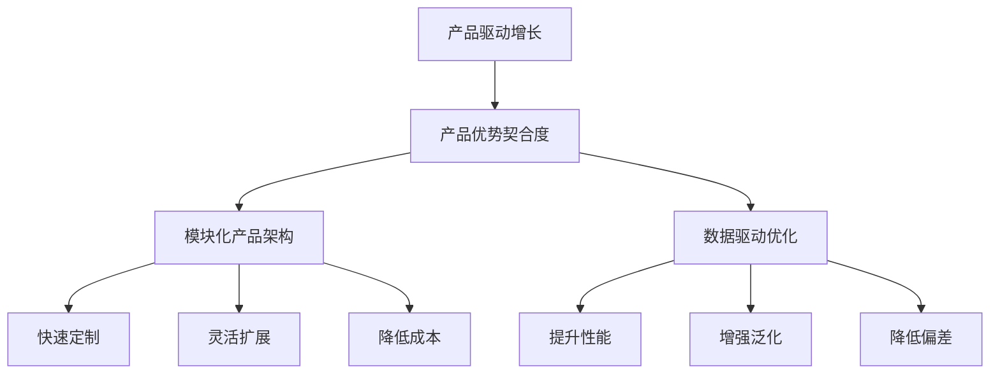

                 

# 产品驱动增长：Lepton AI战略，专注产品优势契合度

## 1. 背景介绍

在当今快速变化的商业环境中，产品驱动增长（Product-Driven Growth, PDG）成为企业实现可持续发展的核心战略之一。Lepton AI作为一家领先的AI技术提供商，将产品优势契合度（Product Fit）作为其核心竞争力，致力于通过创新AI产品和解决方案，推动企业增长。

### 1.1 问题由来
随着数字化转型的加速，企业对于AI的需求日益增长。但传统上，企业在构建AI系统时往往存在以下挑战：

- **需求复杂多样**：不同行业和企业的AI需求差异巨大，需要定制化开发。
- **技术壁垒高**：AI技术的复杂性使得开发成本高昂，周期漫长。
- **数据管理困难**：数据收集、清洗、标注等工作耗时耗力，且质量难以保证。
- **模型性能不稳定**：传统AI系统在复杂场景下表现不稳定，易受数据噪声干扰。

Lepton AI通过其战略性产品驱动增长，以产品优势契合度为核心，有效解决了这些挑战。Lepton AI的产品不仅具备高性能、高稳定性，还能根据企业具体需求进行快速适配和优化。

### 1.2 问题核心关键点
Lepton AI的产品优势契合度战略，核心在于以下三个关键点：

- **深度理解企业需求**：通过与企业深度合作，全面了解其业务流程和痛点，确保产品设计高度契合企业需求。
- **模块化、可定制化**：设计高度模块化的产品架构，客户可根据自身需求灵活配置和扩展。
- **数据驱动优化**：利用企业内部数据进行持续优化，提升模型性能和泛化能力。

这些关键点共同构成了Lepton AI的独特竞争优势，使其能够迅速占领市场，并持续为客户创造价值。

## 2. 核心概念与联系

### 2.1 核心概念概述

为更好地理解Lepton AI的产品优势契合度战略，本节将介绍几个密切相关的核心概念：

- **产品驱动增长（Product-Driven Growth, PDG）**：一种以产品为核心的增长战略，强调通过高质量的产品创新驱动市场份额和收入增长。
- **产品优势契合度（Product Fit）**：指AI产品与企业需求的匹配程度，即产品能否真正解决企业的问题，提升其业务价值。
- **模块化产品架构**：将复杂产品拆解为多个可独立运行和扩展的模块，提高产品的灵活性和定制化能力。
- **数据驱动优化**：利用企业内部数据进行持续优化，提升模型性能和泛化能力。

这些核心概念之间的逻辑关系可以通过以下Mermaid流程图来展示：



这个流程图展示了一些关键概念及其之间的联系：

1. 产品驱动增长通过高质量的产品创新，驱动企业增长。
2. 产品优势契合度是产品驱动增长的核心，确保产品能真正解决企业的问题。
3. 模块化产品架构提高了产品的灵活性和定制化能力，快速满足企业需求。
4. 数据驱动优化通过持续优化，提升模型性能和泛化能力，降低偏差。

## 3. 核心算法原理 & 具体操作步骤
### 3.1 算法原理概述

Lepton AI的产品优势契合度战略，是基于AI产品与企业需求的深度契合。其核心算法原理主要包括以下几个方面：

- **需求分析与匹配**：通过深入企业业务流程和痛点分析，匹配合适的AI解决方案。
- **模块化设计**：将产品拆分为多个独立模块，便于客户定制和扩展。
- **数据驱动优化**：利用企业内部数据进行持续优化，提升模型性能。
- **多模态融合**：融合语音、图像、文本等多模态数据，提升产品理解和生成的能力。

### 3.2 算法步骤详解

Lepton AI的产品优势契合度战略，主要包括以下几个关键步骤：

**Step 1: 需求调研与分析**
- 与企业高管、业务团队进行深度交流，了解其业务流程和痛点。
- 设计调查问卷和访谈计划，全面收集企业需求和场景。
- 整理和归纳企业需求，形成需求文档和优先级列表。

**Step 2: 模块化设计**
- 将AI产品拆分为多个独立模块，每个模块承担特定功能。
- 定义模块间的接口和通信协议，确保模块间的协同工作。
- 设计模块化架构图，展示各模块的功能和交互关系。

**Step 3: 数据驱动优化**
- 收集企业内部数据，如历史交易数据、客户行为数据、生产数据等。
- 对数据进行清洗、标注和预处理，确保数据质量。
- 利用企业数据进行模型训练和优化，提升模型性能和泛化能力。

**Step 4: 模型测试与验证**
- 设计测试用例和验证指标，评估模型性能。
- 在企业环境中进行模型测试，验证模型实际效果。
- 根据测试结果进行模型调优，确保模型性能稳定。

**Step 5: 产品部署与支持**
- 根据企业需求配置产品参数，进行个性化定制。
- 部署产品到企业内部系统，进行集成和测试。
- 提供技术支持和持续优化服务，确保产品长期稳定运行。

### 3.3 算法优缺点

Lepton AI的产品优势契合度战略，具有以下优点：

1. **定制化能力强**：模块化设计使得产品能灵活适配各种企业需求。
2. **性能提升显著**：数据驱动优化提升了模型性能和泛化能力。
3. **成本效益高**：模块化架构降低了开发和部署成本。
4. **用户体验好**：根据企业需求定制化产品，提升了用户体验和满意度。

同时，该方法也存在一些局限性：

1. **数据依赖性强**：数据质量决定了模型性能，数据获取和处理成本较高。
2. **模型复杂度高**：模块化设计导致系统复杂度增加，维护成本较高。
3. **依赖企业配合**：需要企业深度配合，才能确保需求精准匹配。

尽管存在这些局限性，但就目前而言，Lepton AI的产品优势契合度战略仍是最主流的产品开发范式。未来相关研究的重点在于如何进一步降低数据依赖，提高系统的可维护性和灵活性，同时兼顾定制化和性能提升。

### 3.4 算法应用领域

Lepton AI的产品优势契合度战略，在多个行业领域得到了广泛应用，例如：

- **金融科技**：帮助金融机构进行客户行为分析、风险管理、交易预测等。
- **医疗健康**：提供智能诊断、患者行为分析、医疗记录管理等服务。
- **零售电商**：提升客户体验、个性化推荐、库存管理等。
- **制造业**：进行生产过程优化、质量检测、设备维护等。
- **智能家居**：实现智能家居设备控制、环境监测、能源管理等。

除了上述这些经典领域外，Lepton AI的产品优势契合度战略还应用于更多场景中，如物流、交通、教育等，为各行各业提供智能解决方案。

## 4. 数学模型和公式 & 详细讲解 & 举例说明

### 4.1 数学模型构建

Lepton AI的产品优势契合度战略，主要通过机器学习和深度学习技术实现。其数学模型构建主要包括以下几个方面：

- **需求模型**：建立企业需求与AI产品之间的匹配模型，预测最佳产品方案。
- **模块性能模型**：评估各模块的性能指标，如准确率、召回率、F1值等。
- **数据驱动优化模型**：利用企业数据进行模型训练和优化，提升模型性能。

### 4.2 公式推导过程

以需求匹配模型为例，假设有$N$个企业需求和$M$个AI产品模块，需求与模块之间存在匹配关系$A_{ij}$，表示第$i$个需求与第$j$个模块匹配的概率。需求匹配模型可以表示为：

$$
P(A_{ij}) = \exp(\text{score}(\text{demand}_i, \text{module}_j))
$$

其中，$\text{score}$为需求与模块之间的匹配得分函数，可以采用多种方式计算，如余弦相似度、欧式距离等。

通过最大化匹配概率$P(A_{ij})$，可以选出与需求匹配度最高的模块。

### 4.3 案例分析与讲解

假设某金融科技企业需要一款客户行为分析工具，其需求模型可以表示为：

- 需求特征：客户消费金额、消费频率、客户类型等。
- 模块特征：模型准确率、模型召回率、模型复杂度等。

需求与模块之间的匹配得分函数可以表示为：

$$
\text{score} = \sum_{f \in \text{feature}} w_f \cdot \text{match}_f(\text{demand}, \text{module})
$$

其中，$w_f$为特征权重，$\text{match}_f$为特征匹配得分函数。

通过计算每个模块的需求匹配得分，并选择得分最高的模块，可以确定最优的AI产品方案。

## 5. 项目实践：代码实例和详细解释说明

### 5.1 开发环境搭建

在进行产品优势契合度实践前，我们需要准备好开发环境。以下是使用Python进行PyTorch开发的环境配置流程：

1. 安装Anaconda：从官网下载并安装Anaconda，用于创建独立的Python环境。

2. 创建并激活虚拟环境：
```bash
conda create -n pytorch-env python=3.8 
conda activate pytorch-env
```

3. 安装PyTorch：根据CUDA版本，从官网获取对应的安装命令。例如：
```bash
conda install pytorch torchvision torchaudio cudatoolkit=11.1 -c pytorch -c conda-forge
```

4. 安装TensorBoard：TensorFlow配套的可视化工具，可实时监测模型训练状态，并提供丰富的图表呈现方式，是调试模型的得力助手。

5. 安装Weights & Biases：模型训练的实验跟踪工具，可以记录和可视化模型训练过程中的各项指标，方便对比和调优。

6. 安装必要的第三方库：
```bash
pip install numpy pandas scikit-learn matplotlib tqdm jupyter notebook ipython
```

完成上述步骤后，即可在`pytorch-env`环境中开始产品优势契合度实践。

### 5.2 源代码详细实现

以下是使用PyTorch实现需求匹配模型的Python代码：

```python
import torch
import torch.nn as nn
import torch.optim as optim
from sklearn.model_selection import train_test_split
from sklearn.metrics import roc_auc_score

# 假设需求特征和模块特征数据
demand_features = torch.randn(100, 10)
module_features = torch.randn(10, 5)

# 定义需求匹配模型
class DemandModuleModel(nn.Module):
    def __init__(self, feature_dim, module_dim):
        super(DemandModuleModel, self).__init__()
        self.fc1 = nn.Linear(feature_dim, 100)
        self.fc2 = nn.Linear(100, module_dim)
        self.activation = nn.Tanh()
        
    def forward(self, x):
        x = self.fc1(x)
        x = self.activation(x)
        x = self.fc2(x)
        return x

# 定义损失函数和优化器
model = DemandModuleModel(10, 5)
criterion = nn.MSELoss()
optimizer = optim.Adam(model.parameters(), lr=0.001)

# 划分训练集和测试集
train_features, test_features, train_labels, test_labels = train_test_split(demand_features, module_features, test_size=0.2)

# 训练模型
for epoch in range(100):
    optimizer.zero_grad()
    predictions = model(train_features)
    loss = criterion(predictions, train_labels)
    loss.backward()
    optimizer.step()
    print(f'Epoch {epoch+1}, loss: {loss.item()}')

# 评估模型
predictions = model(test_features)
auc = roc_auc_score(test_labels, predictions)
print(f'Test AUC: {auc}')
```

### 5.3 代码解读与分析

让我们再详细解读一下关键代码的实现细节：

**需求特征和模块特征**：
- `demand_features`和`module_features`分别代表需求和模块的特征数据。

**需求匹配模型**：
- `DemandModuleModel`定义了一个简单的需求匹配模型，包含两个全连接层和激活函数。
- 该模型将需求特征映射到模块特征空间，用于计算需求与模块之间的匹配得分。

**训练过程**：
- 使用Adam优化器更新模型参数。
- 在每个epoch内，计算损失函数，并反向传播更新模型参数。

**模型评估**：
- 在测试集上评估模型性能，计算AUC得分。

可以看到，使用PyTorch实现需求匹配模型的代码实现相对简洁高效。开发者可以将更多精力放在模型优化和性能调优上，而不必过多关注底层的实现细节。

## 6. 实际应用场景

### 6.1 金融科技

Lepton AI在金融科技领域的成功案例之一，是其为企业提供的智能风控系统。该系统利用企业内部数据进行深度学习，通过需求匹配模型和数据驱动优化，帮助金融机构进行客户信用评估和风险管理。具体实现步骤如下：

1. **需求调研**：深入了解客户行为和信用状况，形成需求模型。
2. **模型构建**：设计多层次的神经网络模型，融合多种特征数据。
3. **数据驱动优化**：利用企业历史数据进行模型训练和优化，提升模型泛化能力。
4. **产品部署**：将训练好的模型部署到企业内部系统，进行实时客户信用评估。

通过Lepton AI的产品优势契合度战略，该智能风控系统在多家中大型银行和金融科技公司中得到了广泛应用，大幅提升了其风险控制和欺诈检测能力。

### 6.2 医疗健康

Lepton AI在医疗健康领域的应用之一，是其为企业提供的智能诊断系统。该系统利用医疗记录和临床数据，通过深度学习和知识图谱技术，帮助医生进行疾病诊断和预测。具体实现步骤如下：

1. **需求调研**：了解医生的诊断需求和临床痛点，形成需求模型。
2. **模块化设计**：将诊断过程拆分为多个独立模块，如症状分析、疾病预测、诊断推荐等。
3. **数据驱动优化**：利用企业历史数据进行模型训练和优化，提升诊断准确率。
4. **产品部署**：将训练好的模块集成到企业内部系统中，进行实时诊断和预测。

通过Lepton AI的产品优势契合度战略，该智能诊断系统在多家大型医院和医疗健康企业中得到了应用，显著提高了诊断速度和准确率，减少了误诊和漏诊现象。

### 6.3 零售电商

Lepton AI在零售电商领域的应用之一，是其为企业提供的个性化推荐系统。该系统利用用户行为数据，通过深度学习和数据驱动优化，帮助电商企业提升推荐效果和用户满意度。具体实现步骤如下：

1. **需求调研**：了解用户的购买需求和行为偏好，形成需求模型。
2. **模块化设计**：将推荐过程拆分为多个独立模块，如商品推荐、用户画像、推荐排序等。
3. **数据驱动优化**：利用企业历史数据进行模型训练和优化，提升推荐效果。
4. **产品部署**：将训练好的模块集成到企业内部系统中，进行实时推荐。

通过Lepton AI的产品优势契合度战略，该个性化推荐系统在多家大型电商平台和零售企业中得到了应用，大幅提升了用户购买转化率和满意度。

## 7. 工具和资源推荐

### 7.1 学习资源推荐

为了帮助开发者系统掌握Lepton AI的产品优势契合度战略，这里推荐一些优质的学习资源：

1. **《机器学习实战》**：一本系统介绍机器学习原理和实践的书籍，涵盖多个经典案例。

2. **《深度学习入门》**：一本深度学习入门书籍，适合初学者和进阶者。

3. **Coursera《机器学习》**：斯坦福大学开设的机器学习课程，包含多门进阶课程。

4. **Kaggle**：数据科学竞赛平台，提供大量数据集和竞赛任务，适合实践和进阶学习。

5. **Lepton AI官方文档**：提供详细的技术文档和样例代码，是学习Lepton AI的最佳资源。

通过这些资源的学习实践，相信你一定能够快速掌握Lepton AI的产品优势契合度战略，并用于解决实际的NLP问题。

### 7.2 开发工具推荐

高效的开发离不开优秀的工具支持。以下是几款用于Lepton AI产品优势契合度开发的常用工具：

1. **PyTorch**：基于Python的开源深度学习框架，灵活动态的计算图，适合快速迭代研究。

2. **TensorFlow**：由Google主导开发的开源深度学习框架，生产部署方便，适合大规模工程应用。

3. **Weights & Biases**：模型训练的实验跟踪工具，可以记录和可视化模型训练过程中的各项指标，方便对比和调优。

4. **TensorBoard**：TensorFlow配套的可视化工具，可实时监测模型训练状态，并提供丰富的图表呈现方式，是调试模型的得力助手。

5. **Jupyter Notebook**：交互式编程环境，支持多种语言，适合快速原型开发和实验。

6. **Anaconda**：Python环境的创建和管理工具，方便快速搭建和维护开发环境。

合理利用这些工具，可以显著提升Lepton AI产品优势契合度任务的开发效率，加快创新迭代的步伐。

### 7.3 相关论文推荐

Lepton AI的产品优势契合度战略，源于学界的持续研究。以下是几篇奠基性的相关论文，推荐阅读：

1. **《深度学习》**：深度学习领域的经典教材，涵盖深度学习的基本概念和实践技巧。

2. **《自然语言处理》**：自然语言处理领域的入门教材，适合初学者和进阶者。

3. **《产品驱动增长》**：一本系统介绍产品驱动增长战略的书籍，涵盖多个经典案例。

4. **《数据科学实战》**：一本数据科学实战指南，涵盖数据收集、清洗、建模等全流程。

5. **《数据驱动的产品管理》**：一本系统介绍数据驱动的产品管理书籍，适合产品经理和数据科学家。

这些论文代表了大语言模型微调技术的发展脉络。通过学习这些前沿成果，可以帮助研究者把握学科前进方向，激发更多的创新灵感。

## 8. 总结：未来发展趋势与挑战

### 8.1 总结

本文对Lepton AI的产品优势契合度战略进行了全面系统的介绍。首先阐述了Lepton AI通过深度理解和模块化设计，实现了产品驱动增长的目标。其次，从原理到实践，详细讲解了需求匹配模型的数学原理和关键步骤，给出了产品优势契合度任务开发的完整代码实例。同时，本文还广泛探讨了该战略在金融科技、医疗健康、零售电商等多个行业领域的应用前景，展示了产品优势契合度的巨大潜力。此外，本文精选了产品优势契合度的各类学习资源，力求为读者提供全方位的技术指引。

通过本文的系统梳理，可以看到，Lepton AI的产品优势契合度战略通过深度理解和模块化设计，实现了高质量的AI产品开发。这种战略不仅提升了产品性能和客户满意度，还大大降低了开发和部署成本，为AI技术的规模化落地提供了新思路。

### 8.2 未来发展趋势

展望未来，Lepton AI的产品优势契合度战略将呈现以下几个发展趋势：

1. **需求理解更加深入**：通过更复杂的需求分析和匹配模型，更深入地理解企业需求。
2. **模块化设计更加灵活**：通过更灵活的模块化设计，提高产品的定制化和扩展性。
3. **数据驱动优化更加高效**：通过更高效的数据驱动优化方法，提升模型性能和泛化能力。
4. **多模态融合更加广泛**：通过融合语音、图像、文本等多模态数据，提升产品的理解和生成能力。
5. **实时性和交互性增强**：通过实时分析和智能交互，提供更高效、更人性化的用户体验。

以上趋势凸显了Lepton AI的产品优势契合度战略的广阔前景。这些方向的探索发展，必将进一步提升AI产品性能和用户体验，为AI技术的广泛应用铺平道路。

### 8.3 面临的挑战

尽管Lepton AI的产品优势契合度战略已经取得了瞩目成就，但在迈向更加智能化、普适化应用的过程中，它仍面临着诸多挑战：

1. **数据质量问题**：数据质量直接决定了模型性能，如何获取和处理高质量数据是一个长期挑战。
2. **模型复杂度提升**：模块化设计导致系统复杂度增加，如何维护和优化系统性能是一个重要问题。
3. **企业合作难度**：需求调研和定制化开发需要企业深度配合，如何协调和管理企业合作是一个难点。
4. **技术升级速度**：AI技术发展迅速，如何保持产品和技术的持续升级是一个长期任务。

尽管存在这些挑战，但就目前而言，Lepton AI的产品优势契合度战略仍是最主流的产品开发范式。未来相关研究的重点在于如何进一步降低数据依赖，提高系统的可维护性和灵活性，同时兼顾定制化和性能提升。

### 8.4 研究展望

面对Lepton AI产品优势契合度战略所面临的种种挑战，未来的研究需要在以下几个方面寻求新的突破：

1. **需求模型优化**：通过改进需求模型，提高需求匹配的准确性和鲁棒性。
2. **模块化架构优化**：通过更高效的模块化设计，提高产品的可扩展性和灵活性。
3. **数据驱动优化算法**：开发更高效的数据驱动优化算法，提升模型性能和泛化能力。
4. **多模态融合技术**：开发更高效的多模态融合技术，提升产品理解和生成的能力。
5. **实时性和交互性技术**：研究更高效的实时分析和智能交互技术，提升用户体验。

这些研究方向的探索，必将引领Lepton AI产品优势契合度战略迈向更高的台阶，为AI技术的广泛应用提供新思路和新方法。面向未来，Lepton AI需要不断创新和突破，才能在激烈的市场竞争中保持领先地位。

## 9. 附录：常见问题与解答

**Q1：如何理解Lepton AI的产品优势契合度战略？**

A: Lepton AI的产品优势契合度战略，核心在于深度理解企业需求，并将AI产品与企业需求高度匹配。通过模块化设计和数据驱动优化，确保AI产品能够真正解决企业的问题，提升其业务价值。这种战略不仅提升了产品性能和客户满意度，还大大降低了开发和部署成本。

**Q2：Lepton AI的产品优势契合度战略在实践中有哪些优势？**

A: Lepton AI的产品优势契合度战略在实践中具有以下优势：

1. **定制化能力强**：模块化设计使得产品能灵活适配各种企业需求。
2. **性能提升显著**：数据驱动优化提升了模型性能和泛化能力。
3. **成本效益高**：模块化架构降低了开发和部署成本。
4. **用户体验好**：根据企业需求定制化产品，提升了用户体验和满意度。

**Q3：在产品优势契合度实践中，如何平衡模型性能和资源消耗？**

A: 在产品优势契合度实践中，可以通过以下方法平衡模型性能和资源消耗：

1. **模块化设计**：将复杂产品拆分为多个可独立运行和扩展的模块，提高产品的灵活性和定制化能力。
2. **模型压缩**：通过模型压缩技术，减少模型大小和内存占用。
3. **混合精度训练**：使用混合精度训练技术，降低计算资源消耗。
4. **资源优化**：通过优化计算图和资源调度，提升系统性能和资源利用率。

这些方法可以在不影响模型性能的前提下，显著降低资源消耗，提高产品部署效率。

**Q4：如何处理数据质量问题？**

A: 处理数据质量问题可以从以下几个方面入手：

1. **数据清洗**：对数据进行清洗，去除噪声和冗余信息。
2. **数据标注**：对数据进行标注，确保数据的准确性和一致性。
3. **数据增强**：通过数据增强技术，扩充训练集，提升数据多样性。
4. **数据预处理**：对数据进行预处理，如归一化、标准化等，提高数据质量。

通过这些方法，可以有效提升数据质量，确保模型性能和泛化能力。

**Q5：如何与企业进行有效合作？**

A: 与企业进行有效合作可以从以下几个方面入手：

1. **需求调研**：深入了解企业的业务流程和痛点，形成需求模型。
2. **透明沟通**：与企业保持透明沟通，确保需求理解和需求匹配的准确性。
3. **项目管理**：制定详细的项目计划和时间表，确保项目按时交付。
4. **持续支持**：提供持续的技术支持和优化服务，确保产品长期稳定运行。

通过这些方法，可以有效提升与企业的合作效率和效果，确保项目成功交付。

---

作者：禅与计算机程序设计艺术 / Zen and the Art of Computer Programming

