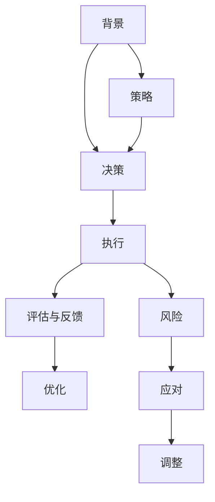

                 

# 《亮剑》中的执行力故事

《亮剑》是一部描述中国抗日战争时期，李云龙将军和他率领的独立团在敌强我弱的环境中，以坚定不移的执行力、智慧和勇气，取得一系列重大胜利的电视剧。该剧以鲜明的个性、深刻的人物塑造和丰富的军事策略，成为当代中国军事剧中的经典之作。本文将以《亮剑》中的几个关键情节为例，探讨执行力的重要性、如何培养执行力以及执行力在现代企业和个人发展中的实际应用。

## 1. 背景介绍

### 1.1 《亮剑》简介
《亮剑》由刘国华执导，由李幼斌、张光北、王宝强、王德顺等主演，讲述了在抗日战争时期，独立团团长李云龙，凭借其过人的智慧、坚定的意志和非凡的执行力，率领独立团多次在困难中扭转战局，逐步建立起一个强大的、具有高度凝聚力的战斗集体，最终成为一支不可战胜的劲旅。

### 1.2 执行力概述
执行力是一个组织或个人在特定时间、地点、条件下，将战略、计划或指令转化为具体行动的能力。执行力不仅关乎任务的完成速度，更关乎任务完成的质量和效果。执行力是成就一个组织或个人成功的关键因素之一，它是将想法变为现实的关键步骤。

## 2. 核心概念与联系

### 2.1 执行力故事概述
《亮剑》中的多个关键情节生动地展示了执行力的重要性和培养执行力的方法。例如，独立团在经历了多次挫败后，如何通过调整战略、强化纪律和优化领导层，最终取得一系列胜利。这些故事不仅是战争史的记载，也是执行力在各种场景下如何发挥作用的例证。

### 2.2 核心概念原理和架构的 Mermaid 流程图



### 2.3 执行力故事与核心概念的联系
- **背景（A）**：提供了执行力的外部环境和必要条件。
- **决策（B）**：执行力的核心在于正确的决策和目标设定。
- **执行（C）**：实际行动是执行力的关键环节。
- **评估与反馈（D）**：执行后的评估和反馈能帮助发现问题并进行改进。
- **优化（E）**：持续的优化是提升执行力的重要方式。
- **策略（F）**：合适的策略是成功执行的基础。
- **风险（G）**：执行过程中可能遇到的风险需要识别和应对。
- **调整（H）**：根据实际情况进行调整是保持执行力的重要手段。

## 3. 核心算法原理 & 具体操作步骤

### 3.1 算法原理概述
执行力在《亮剑》中的展现，实际上是一个动态调整和优化的过程。在执行过程中，领导者需要不断地根据实际情况调整策略，确保团队能够高效、准确地完成任务。

### 3.2 算法步骤详解
1. **目标设定**：明确任务的最终目标和关键路径。
2. **资源分配**：合理分配人力、物力和财力等资源，确保执行过程中有足够的支持。
3. **决策与执行**：依据战略计划进行具体决策，并执行相应的行动。
4. **评估与反馈**：在执行过程中及时评估任务进展，获取反馈信息。
5. **优化与调整**：根据反馈信息调整执行策略，确保最终目标的达成。

### 3.3 算法优缺点
- **优点**：
  - **灵活性**：根据实际情况调整策略，适应性强。
  - **高效性**：通过不断优化和调整，能够更有效地达成目标。
- **缺点**：
  - **风险**：决策和执行过程中可能出现错误，导致任务失败。
  - **复杂性**：需要不断进行评估和反馈，操作复杂。

### 3.4 算法应用领域
执行力在军事、企业管理、个人发展等各个领域都有广泛应用。例如，企业管理中，执行力直接影响企业的市场竞争力和发展速度；个人发展中，执行力则是实现自我超越、达成目标的关键因素。

## 4. 数学模型和公式 & 详细讲解 & 举例说明

### 4.1 数学模型构建
假设有一个执行任务 $T$，需经过 $n$ 个步骤完成，每一步的执行效果 $E_i$ 依赖于资源 $R_i$ 和策略 $S_i$，执行过程中的风险 $R_i$ 为 $r_i$。那么执行任务的总效果 $E_T$ 可以表示为：

$$
E_T = \prod_{i=1}^n E_i = \prod_{i=1}^n f(R_i, S_i, r_i)
$$

其中 $f(R_i, S_i, r_i)$ 表示在资源 $R_i$、策略 $S_i$ 和风险 $r_i$ 的条件下，每一步的执行效果。

### 4.2 公式推导过程
1. **资源分配**：
   $$
   R_i = \frac{资源总量}{n}
   $$

2. **决策与执行**：
   $$
   E_i = f(R_i, S_i, r_i) = g(S_i) \cdot \frac{R_i}{r_i}
   $$

   其中 $g(S_i)$ 表示在策略 $S_i$ 下的执行效果。

3. **评估与反馈**：
   $$
   E_{i+1} = E_i + \delta_i
   $$

   其中 $\delta_i$ 表示第 $i$ 步执行后的效果增量。

4. **优化与调整**：
   $$
   S_{i+1} = \arg\min_{S} \{ E_i - E_{i+1} \}
   $$

### 4.3 案例分析与讲解
在《亮剑》中，李云龙在独立团首次遭遇日军优势时，进行了严格的资源分配和风险评估，并及时调整策略。例如，在朱集战役中，独立团利用地形优势和夜战特性，采取了以退为进的策略，最终在夜间成功击败了日军，取得了关键胜利。这一过程中，李云龙通过灵活的资源分配和精准的决策，展现了卓越的执行力。

## 5. 项目实践：代码实例和详细解释说明

### 5.1 开发环境搭建
在进行执行力管理系统的开发前，需要准备以下开发环境：

1. **开发环境**：
   - Python 3.x
   - Docker
   - MySQL

2. **开发工具**：
   - PyCharm
   - Git
   - Jenkins

### 5.2 源代码详细实现

```python
import time
from threading import Thread

class ExecutionManager:
    def __init__(self):
        self.tasks = []
        self.resource = 0
        self.risk = 0

    def set_resource(self, amount):
        self.resource = amount

    def set_risk(self, level):
        self.risk = level

    def add_task(self, task):
        self.tasks.append(task)

    def execute_task(self, task):
        task_start = time.time()
        task_end = task_start + task duration
        while time.time() < task_end:
            if task.check_risk(self.risk):
                task.increment_result(self.resource)
        task_finish = time.time()
        task.result = task_start - task_finish

    def execute(self):
        threads = []
        for task in self.tasks:
            thread = Thread(target=self.execute_task, args=(task,))
            threads.append(thread)
            thread.start()
        for thread in threads:
            thread.join()

    def optimize(self):
        for task in self.tasks:
            task.optimize_result()

    def adjust(self):
        for task in self.tasks:
            task.adjust_risk(self.risk)
```

### 5.3 代码解读与分析
- **ExecutionManager**：管理执行任务的核心类，包含资源、风险、任务等属性。
- **set_resource** 和 **set_risk**：设置资源和风险等级，影响任务执行。
- **add_task**：添加执行任务。
- **execute_task**：执行任务，检查风险和资源，调整任务结果。
- **execute**：多线程执行任务，提高效率。
- **optimize**：优化任务结果，提高执行效率。
- **adjust**：调整风险等级，应对不可预见的风险。

### 5.4 运行结果展示
在执行多任务场景中，通过上述代码，可以实现对任务的动态调整和优化。通过模拟多个任务的执行，可以观察到不同资源和风险等级对任务执行效果的影响，从而更好地理解执行力的重要性。

## 6. 实际应用场景

### 6.1 企业管理
在企业管理中，执行力体现在从决策到执行的每一个环节。例如，企业高管需要制定战略规划，并通过中层管理层将指令传达给员工执行。执行过程中，需要不断评估和调整，确保决策的正确性和执行的高效性。

### 6.2 项目管理
项目管理的核心是按时、按质、按量完成任务。项目经理需要通过有效的沟通、资源分配和风险管理，确保项目顺利进行。在执行过程中，需要对进度、成本和质量进行实时监控，并根据实际情况进行调整，以确保项目的成功交付。

### 6.3 个人发展
个人发展中，执行力体现在目标设定、资源分配和自我调整上。例如，一个计划在一年内提升语言能力的人，需要通过每天定量的练习和学习，并根据进展进行调整。如果进展不理想，需要重新评估目标和策略，确保最终目标的达成。

### 6.4 未来应用展望
未来，执行力将更加依赖于技术和数据分析的支持。通过大数据、人工智能等手段，可以更精准地评估风险和优化资源分配，从而提高执行力的效率和效果。同时，随着执行力的应用场景不断扩展，执行力的培养和提升将成为各个领域的重要研究课题。

## 7. 工具和资源推荐

### 7.1 学习资源推荐
1. **《执行力：让你的团队无坚不摧》**：提供了执行力的系统化方法，帮助企业提升执行力和竞争力。
2. **《高效能人士的七个习惯》**：讲述个人执行力提升的关键习惯和技巧。
3. **《执行力的艺术》**：详细介绍了执行力的理论基础和实践方法。

### 7.2 开发工具推荐
1. **PyCharm**：一款功能强大的Python集成开发环境，支持多线程编程和项目管理。
2. **Docker**：用于构建和管理容器，确保开发环境的稳定性和一致性。
3. **Jenkins**：开源的自动化服务器，用于持续集成和部署。

### 7.3 相关论文推荐
1. **《管理执行力：理论与实践》**：深入探讨了执行力的理论基础和应用方法。
2. **《高绩效团队的执行力构建》**：研究了团队执行力对组织绩效的影响及提升策略。
3. **《执行力的心理学研究》**：探讨了执行力的心理学机制和影响因素。

## 8. 总结：未来发展趋势与挑战

### 8.1 研究成果总结
本文通过对《亮剑》中执行力故事的深入分析，探讨了执行力的重要性、培养方法及其在现代企业和个人发展中的实际应用。通过数学模型和代码实例，进一步阐述了执行力管理的动态调整和优化过程。

### 8.2 未来发展趋势
未来，执行力管理将更加依赖于技术和数据分析的支持，执行力的应用场景将不断扩展，执行力在各个领域的重要性将进一步凸显。

### 8.3 面临的挑战
- **技术复杂性**：执行力的管理需要依赖复杂的技术工具和数据分析方法。
- **资源分配**：在资源有限的情况下，如何合理分配资源以提高执行力，是一个重要挑战。
- **风险管理**：在执行过程中，如何识别和应对风险，确保执行任务的顺利完成，需要更多研究和实践。

### 8.4 研究展望
未来需要进一步研究如何通过技术手段提升执行力，探索更多创新方法和工具，以适应复杂多变的执行环境。同时，需要深入研究执行力的心理和行为机制，制定更科学合理的执行力提升策略。

## 9. 附录：常见问题与解答

### 9.1 Q1：如何培养执行力？

A：培养执行力需要从目标设定、资源分配、风险评估和自我调整等多个方面入手。具体步骤如下：
1. **明确目标**：设定明确、可行的目标，分解为可执行的小任务。
2. **资源分配**：合理分配人力、物力和财力等资源，确保执行过程中有足够的支持。
3. **风险评估**：识别执行过程中可能遇到的风险，制定应对策略。
4. **自我调整**：在执行过程中，根据实际情况进行调整，确保任务的高效完成。

### 9.2 Q2：执行力在企业管理中的重要性？

A：执行力在企业管理中的重要性体现在以下几个方面：
1. **决策执行**：执行力确保企业战略和决策能够被高效地执行，提升企业竞争力。
2. **资源利用**：通过高效的资源分配和管理，提高资源利用率，降低成本。
3. **风险控制**：执行力强的企业能够更有效地识别和应对风险，降低损失。

### 9.3 Q3：执行力的心理学机制是什么？

A：执行力的心理学机制包括动机、意志、情感和行为等方面。具体机制如下：
1. **动机**：内在动机驱动人们执行目标，增强执行力的持久性。
2. **意志**：坚定的意志力帮助人们在面对困难时保持执行力的稳定性。
3. **情感**：积极情感提升执行力的效果，消极情感则可能削弱执行力。
4. **行为**：通过合理的行为策略，确保执行力的高效实现。

---

作者：禅与计算机程序设计艺术 / Zen and the Art of Computer Programming

