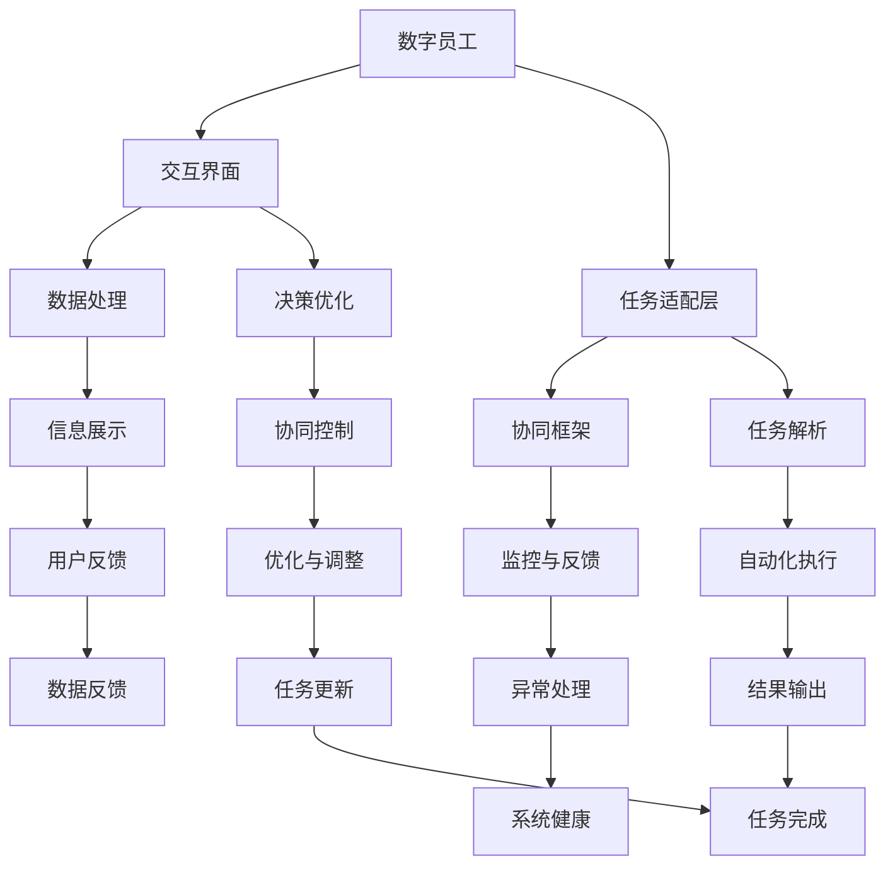

                 

## 1. 背景介绍

随着人工智能技术的快速发展，数字员工(Digital Employee)的概念应运而生。数字员工是指由软件系统、自动化工具和智能算法构成的虚拟助手，能够辅助人类完成重复性、规则性、高效率的业务任务。数字员工的出现，极大地提升了企业生产力和创新能力，推动了智能化转型进程。然而，如何实现人与AI的深度融合，构建高效协同的合作模式，仍是一个亟待解决的问题。本文将深入探讨人+AI数字员工的高效协同模式，提供一套全面的解决方案，助力企业智能化转型。

## 2. 核心概念与联系

### 2.1 核心概念概述

在探讨人+AI数字员工的高效协同模式前，我们先明确几个核心概念：

- **数字员工(Digital Employee)**：由软件系统、自动化工具和智能算法构成的虚拟助手，能够辅助人类完成特定任务。常见的数字员工包括聊天机器人、自动化流程助手、智能推荐系统等。
- **人机协同(Human-AI Collaboration)**：指人类与AI系统共同完成目标任务的合作过程。通过人机协同，可以实现高效、精准、智能的业务流程。
- **交互界面(UI/UX)**：交互界面是连接人机协同系统的桥梁，负责展示数据、接收指令、反馈结果等。一个好的交互界面设计，能够提高用户的使用体验，增强人机协同的效果。
- **任务适配层(Task Adapting Layer)**：任务适配层是数字员工与特定任务交互的中间层，负责任务解析、数据处理、决策优化等功能，将复杂任务简化为可执行操作。
- **协同框架(Collaboration Framework)**：协同框架是一个结构化、模块化的系统设计，支持多种数字员工协同工作，提升整体效能和灵活性。

### 2.2 核心概念原理和架构的 Mermaid 流程图



### 2.3 核心概念之间的联系

- 数字员工与交互界面协同工作，通过友好的用户界面接收任务和指令。
- 任务适配层根据用户指令解析任务需求，并通过协同框架协调多个数字员工协同完成任务。
- 数据处理和决策优化层对数据进行分析和优化，提高任务执行效率。
- 任务解析和自动化执行层将复杂任务简化为可执行操作，确保任务顺利完成。
- 监控与反馈、优化与调整层对系统进行实时监控，及时处理异常和问题，不断优化系统性能。
- 信息展示和用户反馈层提供任务执行结果，收集用户反馈，提升用户体验。

## 3. 核心算法原理 & 具体操作步骤

### 3.1 算法原理概述

人+AI数字员工的高效协同模式，通过构建一个统一的任务适配层，实现人机协同系统的模块化和组件化设计。该系统主要由以下几个关键组件构成：

- **用户交互层**：负责与用户交互，接收用户指令和任务需求。
- **任务解析层**：对任务需求进行解析，将其转换为可执行操作。
- **自动化执行层**：执行解析后的任务操作，实现任务的自动化处理。
- **决策优化层**：基于数据反馈和任务结果，优化决策和任务执行策略。
- **监控与反馈层**：监控任务执行过程，收集用户反馈，优化系统性能。

该系统通过任务适配层的抽象和封装，将复杂的任务分解为可执行操作，简化了系统的设计和实现。同时，通过协同框架的支持，系统能够灵活扩展和整合多个数字员工，提升整体效能和灵活性。

### 3.2 算法步骤详解

基于以上算法原理，人+AI数字员工的高效协同模式通常包括以下关键步骤：

1. **需求接收与解析**：用户通过交互界面提交任务需求，系统自动解析任务内容，生成可执行操作。

2. **任务执行与监控**：任务适配层根据解析后的任务，调用对应的数字员工执行任务，同时监控任务执行过程，确保任务按时完成。

3. **数据收集与分析**：监控与反馈层收集任务执行数据和用户反馈，进行实时分析，优化任务执行策略。

4. **优化与调整**：决策优化层基于数据反馈，调整任务执行策略，提升系统效能和用户体验。

5. **结果展示与反馈**：信息展示层将任务执行结果展示给用户，收集用户反馈，优化系统性能。

### 3.3 算法优缺点

人+AI数字员工的高效协同模式有以下优点：

- **提升效率**：自动化执行和协同框架能够显著提高任务执行效率，减少人工干预。
- **降低成本**：数字员工可以替代大量重复性、低价值的工作，减少人力成本。
- **增强灵活性**：协同框架和任务适配层能够灵活扩展和整合不同数字员工，提升系统灵活性。

同时，该模式也存在一些局限性：

- **技术依赖**：系统依赖于先进的技术和算法，对技术要求较高。
- **初始投入**：系统搭建和初始化需要较大的技术投入，对小型企业可能不适用。
- **安全与隐私**：数字员工处理敏感数据时，需严格保障数据安全与隐私。

### 3.4 算法应用领域

人+AI数字员工的高效协同模式在多个领域具有广泛的应用前景：

- **客服行业**：通过数字员工处理客户咨询，提升客户服务质量，减少人力成本。
- **金融行业**：利用数字员工进行风险评估、客户理财等，提高金融服务效率和精准度。
- **医疗行业**：通过数字员工辅助诊断、预约挂号等，提升医疗服务效率，改善患者体验。
- **电商行业**：通过数字员工进行订单处理、客户推荐等，提升电商服务质量和客户满意度。
- **制造业**：利用数字员工进行生产调度、质量检测等，提高生产效率和产品质量。

## 4. 数学模型和公式 & 详细讲解 & 举例说明

### 4.1 数学模型构建

本节将构建一个简单的任务适配层，以数字员工处理客户咨询为例。假设客户咨询为自然语言描述，系统将其转换为结构化操作进行处理。

- **输入**：客户咨询的自然语言描述 $X$。
- **输出**：系统执行的任务操作 $Y$。

### 4.2 公式推导过程

系统根据客户咨询的自然语言描述 $X$，通过自然语言处理(NLP)技术，解析出任务需求。假设有 $n$ 种可能的执行操作，系统需要计算每个操作的概率 $P_i(X)$，选取概率最大的操作 $i$ 作为执行任务 $Y_i$。

假设 $P_i(X)$ 可以通过以下模型计算：

$$ P_i(X) = \frac{e^{s_i(X)}}{\sum_{j=1}^n e^{s_j(X)}} $$

其中，$s_i(X)$ 为第 $i$ 种操作的语义表示向量，通过预训练模型计算得出。

### 4.3 案例分析与讲解

以客户咨询“我想查询产品价格”为例，系统解析出任务需求为“查询价格”，计算每种可能的执行操作（如访问数据库、调用API等）的概率，选取概率最大的操作执行。具体计算如下：

- 操作1：访问数据库
- 操作2：调用API
- 操作3：提示用户重新输入

设操作1、2、3的语义表示向量分别为 $s_1, s_2, s_3$，通过预训练模型计算得到：

- $s_1 = (0.1, 0.2, 0.3, 0.4)$
- $s_2 = (0.2, 0.1, 0.5, 0.2)$
- $s_3 = (0.5, 0.3, 0.2, 0.0)$

计算各操作的概率：

- $P_1(X) = \frac{e^{0.1}}{e^{0.1} + e^{0.2} + e^{0.3} + e^{0.4}} = 0.4$
- $P_2(X) = \frac{e^{0.2}}{e^{0.1} + e^{0.2} + e^{0.3} + e^{0.4}} = 0.2$
- $P_3(X) = \frac{e^{0.5}}{e^{0.1} + e^{0.2} + e^{0.3} + e^{0.4}} = 0.4$

根据最大似然估计，操作1和操作3的概率最大，因此系统执行的操作为：

- $Y = 1$：访问数据库
- $Y = 3$：提示用户重新输入

系统将查询结果展示给用户，并根据用户反馈进行优化。

## 5. 项目实践：代码实例和详细解释说明

### 5.1 开发环境搭建

以下是使用Python和Flask框架搭建数字员工系统的环境配置流程：

1. 安装Anaconda：从官网下载并安装Anaconda，用于创建独立的Python环境。

2. 创建并激活虚拟环境：
```bash
conda create -n digital-employee python=3.8 
conda activate digital-employee
```

3. 安装Flask：
```bash
pip install Flask
```

4. 安装NLP工具库：
```bash
pip install nltk transformers
```

5. 安装Websocket库：
```bash
pip install Flask-SocketIO
```

完成上述步骤后，即可在`digital-employee`环境中开始系统开发。

### 5.2 源代码详细实现

以下是一个简单的数字员工系统代码实现，包括客户咨询的处理流程：

```python
from flask import Flask, render_template
from flask_socketio import SocketIO
from transformers import T5Tokenizer, T5ForConditionalGeneration
import nltk

app = Flask(__name__)
app.config['SECRET_KEY'] = 'secret!'
socketio = SocketIO(app)

# 加载模型和预处理工具
tokenizer = T5Tokenizer.from_pretrained('t5-small')
model = T5ForConditionalGeneration.from_pretrained('t5-small')

# 定义客户咨询处理函数
@app.route('/consult', methods=['POST'])
def handle_consult():
    consult_text = request.form['consult_text']
    consult_tokens = tokenizer.encode(consult_text, return_tensors='pt')
    generated_tokens = model.generate(consult_tokens)
    consult_result = tokenizer.decode(generated_tokens[0], skip_special_tokens=True)
    return render_template('consult_result.html', result=consult_result)

# 定义WebSocket消息处理函数
@socketio.on('consult_message')
def handle_consult_message(message):
    consult_text = message['text']
    consult_tokens = tokenizer.encode(consult_text, return_tensors='pt')
    generated_tokens = model.generate(consult_tokens)
    consult_result = tokenizer.decode(generated_tokens[0], skip_special_tokens=True)
    print(consult_result)
    socketio.emit('consult_result', {'result': consult_result})

if __name__ == '__main__':
    socketio.run(app)
```

### 5.3 代码解读与分析

代码分为以下几个关键部分：

**Flask和SocketIO**：
- Flask：用于创建Web服务器，接收用户请求。
- SocketIO：用于处理WebSocket连接，实现实时通信。

**模型加载与预处理**：
- 加载T5模型和预处理工具，用于自然语言处理。

**处理函数**：
- `handle_consult`：处理用户提交的咨询请求，通过模型生成回复结果，并展示在页面上。
- `handle_consult_message`：处理WebSocket连接下的咨询消息，实时生成回复结果并广播给客户端。

**Web页面展示**：
- `consult_result.html`：展示咨询结果的Web页面，接收服务器端的回复结果。

### 5.4 运行结果展示

运行以上代码后，启动Flask服务器：

```bash
python app.py
```

在Web浏览器中访问`http://127.0.0.1:5000/consult`，提交咨询请求，服务器将自动生成回复结果并展示在页面上。同时，也可以通过WebSocket连接实时接收和展示咨询消息和回复结果。

## 6. 实际应用场景

### 6.1 智能客服

在智能客服场景中，数字员工通过自然语言处理技术，自动解析客户咨询内容，执行相应的任务操作，提供快速、精准的客户服务。以下是一个智能客服系统的应用示例：

- **需求接收与解析**：客户通过Web页面或移动端应用提交咨询请求，系统自动解析任务需求。
- **任务执行与监控**：系统调用对应的数字员工处理任务，实时监控任务执行过程。
- **数据收集与分析**：系统收集客户反馈和任务执行数据，进行实时分析，优化任务执行策略。
- **优化与调整**：根据数据反馈，调整任务执行策略，提高系统效率和客户满意度。
- **结果展示与反馈**：系统将处理结果展示给客户，收集用户反馈，优化系统性能。

### 6.2 金融理财

在金融理财场景中，数字员工通过自然语言处理技术，分析客户的财务需求，提供个性化的理财建议。以下是一个金融理财系统的应用示例：

- **需求接收与解析**：客户通过Web页面提交理财需求，系统自动解析任务需求。
- **任务执行与监控**：系统调用对应的数字员工处理任务，实时监控任务执行过程。
- **数据收集与分析**：系统收集客户的财务数据和理财需求，进行实时分析，优化理财策略。
- **优化与调整**：根据数据反馈，调整理财策略，提高理财建议的精准度和客户满意度。
- **结果展示与反馈**：系统将理财建议展示给客户，收集用户反馈，优化理财服务。

### 6.3 医疗诊断

在医疗诊断场景中，数字员工通过自然语言处理技术，分析病人的病历记录，提供精准的诊断建议。以下是一个医疗诊断系统的应用示例：

- **需求接收与解析**：病人通过Web页面提交病历记录，系统自动解析任务需求。
- **任务执行与监控**：系统调用对应的数字员工处理任务，实时监控任务执行过程。
- **数据收集与分析**：系统收集病人的病历数据和诊断需求，进行实时分析，优化诊断策略。
- **优化与调整**：根据数据反馈，调整诊断策略，提高诊断建议的精准度和病人满意度。
- **结果展示与反馈**：系统将诊断建议展示给病人，收集病人反馈，优化诊断服务。

## 7. 工具和资源推荐

### 7.1 学习资源推荐

为了帮助开发者系统掌握人+AI数字员工的高效协同模式，这里推荐一些优质的学习资源：

1. 《深度学习：理论、算法与应用》：介绍深度学习的基本原理和应用，适合初学者和进阶学习者。
2. 《NLP实战指南》：深入讲解自然语言处理技术的实现方法和应用场景。
3. 《Flask Web开发实战》：介绍Flask框架的高级应用，适合有经验的开发者。
4. 《T5模型详解与实战》：介绍T5模型在自然语言处理中的应用，适合深度学习爱好者。
5. 《Transformers速成手册》：快速上手Transformers库的使用，适合有NLP背景的开发者。

通过对这些资源的学习实践，相信你一定能够快速掌握人+AI数字员工的高效协同模式，并用于解决实际的业务问题。

### 7.2 开发工具推荐

高效的开发离不开优秀的工具支持。以下是几款用于人+AI数字员工协同系统开发的常用工具：

1. Flask：轻量级的Web开发框架，灵活、易用，适合快速原型开发。
2. SocketIO：支持WebSocket连接的实时通信库，适合构建实时交互系统。
3. Transformers库：HuggingFace开发的NLP工具库，集成了多个SOTA语言模型，支持高效的自然语言处理。
4. Jupyter Notebook：交互式开发环境，支持代码编写、数据展示和实时调试。
5. Visual Studio Code：轻量级的开发工具，支持多种语言和插件，适合代码编写和调试。

合理利用这些工具，可以显著提升人+AI数字员工协同系统的开发效率，加快创新迭代的步伐。

### 7.3 相关论文推荐

人+AI数字员工的高效协同模式涉及多个领域的技术，以下是几篇奠基性的相关论文，推荐阅读：

1. "Human-AI Collaboration: A Survey of Challenges and Opportunities"：综述人机协同技术的发展和未来方向。
2. "Deep Reinforcement Learning for Task-Driven Virtual Assistants"：介绍基于深度强化学习的虚拟助手设计。
3. "Natural Language Processing in the ICU: Building a Smart Monitoring System"：探讨NLP技术在重症监护病房的应用。
4. "Towards Explainable AI: Understanding and Interpreting Machine Learning Models"：讨论机器学习模型的可解释性问题，对人+AI数字员工系统的解释性需求具有参考价值。
5. "The Rise of AI Chatbots in Customer Service: A Survey of Their Status and Impact"：综述AI聊天机器人技术在客服领域的应用和发展。

这些论文代表了大语言模型微调技术的发展脉络。通过学习这些前沿成果，可以帮助研究者把握学科前进方向，激发更多的创新灵感。

## 8. 总结：未来发展趋势与挑战

### 8.1 研究成果总结

人+AI数字员工的高效协同模式，通过构建统一的任务适配层，实现人机协同系统的模块化和组件化设计。该系统能够高效、精准、智能地执行任务，提高企业生产力和创新能力。

### 8.2 未来发展趋势

展望未来，人+AI数字员工的高效协同模式将呈现以下几个发展趋势：

1. **AI能力增强**：数字员工将具备更强的自然语言处理和决策优化能力，能够处理更加复杂和多样化的任务。
2. **数据驱动优化**：系统将更加依赖数据驱动的优化策略，通过实时数据分析，不断提升任务执行的效率和精准度。
3. **协同框架升级**：协同框架将更加灵活和模块化，支持更多的数字员工协同工作，提升整体效能和灵活性。
4. **多模态协同**：数字员工将支持多模态数据的处理和融合，结合视觉、语音等多模态信息，提升任务执行的全面性和智能性。
5. **人机协同增强**：系统将更加注重人机协同的互动和反馈，增强用户体验和系统稳定性。

### 8.3 面临的挑战

尽管人+AI数字员工的高效协同模式已经取得了显著成果，但在迈向更加智能化、普适化应用的过程中，仍面临诸多挑战：

1. **技术复杂性**：系统依赖于先进的技术和算法，对技术要求较高，需要持续的技术投入和维护。
2. **数据隐私与安全性**：数字员工处理敏感数据时，需严格保障数据隐私和安全性，避免数据泄露和滥用。
3. **系统集成与互操作性**：系统需要与现有的业务系统无缝集成，提升系统的互操作性和扩展性。
4. **人机协同优化**：需要进一步优化人机协同的互动和反馈，提升系统的用户体验和用户满意度。
5. **系统监控与异常处理**：系统需要实时监控任务执行过程，及时处理异常和问题，确保系统稳定性和可靠性。

### 8.4 研究展望

未来的研究需要在以下几个方面寻求新的突破：

1. **AI能力提升**：通过改进自然语言处理和决策优化算法，增强数字员工的处理能力和智能化水平。
2. **数据驱动优化**：探索数据驱动的优化策略，通过实时数据分析，不断提升任务执行的效率和精准度。
3. **多模态协同**：结合视觉、语音等多模态信息，提升数字员工的任务执行全面性和智能性。
4. **人机协同优化**：优化人机协同的互动和反馈机制，增强用户体验和系统稳定性。
5. **系统监控与异常处理**：通过实时监控和异常处理机制，提升系统的可靠性和稳定性。

只有勇于创新、敢于突破，才能不断拓展人+AI数字员工的高效协同模式，构建更加智能、高效的业务系统，推动企业智能化转型。

## 9. 附录：常见问题与解答

**Q1：人+AI数字员工的高效协同模式如何提高企业生产力？**

A: 人+AI数字员工的高效协同模式通过自动化处理重复性、规则性任务，显著提升企业生产效率。数字员工能够24小时不间断工作，减少人力成本，提高任务执行的准确性和一致性。此外，数字员工可以辅助人类进行复杂任务的处理，提升整体工作效率。

**Q2：如何构建高效的任务适配层？**

A: 构建高效的任务适配层需要考虑以下几个方面：
1. 任务解析算法：使用先进的自然语言处理技术，准确解析任务需求。
2. 任务执行策略：设计合理的任务执行策略，简化任务操作。
3. 任务监控与反馈：实时监控任务执行过程，收集用户反馈，不断优化任务执行策略。
4. 任务优化与调整：基于数据分析，优化任务执行策略，提升系统效能。

**Q3：如何确保数字员工的数据安全与隐私？**

A: 确保数字员工的数据安全与隐私需要从以下几个方面入手：
1. 数据加密：对敏感数据进行加密处理，防止数据泄露。
2. 权限管理：严格控制数据访问权限，确保只有授权人员能够访问敏感数据。
3. 审计与监控：对数据访问和使用进行审计和监控，防止数据滥用。
4. 安全培训：对使用数字员工的员工进行安全培训，提高安全意识。

**Q4：如何优化人机协同的互动与反馈？**

A: 优化人机协同的互动与反馈需要从以下几个方面入手：
1. 用户界面设计：设计友好的用户界面，提高用户的使用体验。
2. 自然语言处理：使用先进的自然语言处理技术，准确理解和解析用户指令。
3. 实时反馈机制：提供实时反馈机制，及时告知用户任务执行状态和结果。
4. 用户满意度评估：定期评估用户满意度，根据反馈不断优化系统性能。

**Q5：如何构建多模态协同的数字员工系统？**

A: 构建多模态协同的数字员工系统需要考虑以下几个方面：
1. 多模态数据融合：结合视觉、语音、文本等多模态数据，进行统一分析和处理。
2. 多模态任务执行：设计多模态任务执行策略，支持多模态任务协同处理。
3. 多模态用户界面：设计支持多模态数据输入和输出的用户界面，提高用户体验。

通过以上常见问题的解答，相信你一定能够更好地理解和应用人+AI数字员工的高效协同模式，推动企业智能化转型。

---

作者：禅与计算机程序设计艺术 / Zen and the Art of Computer Programming

