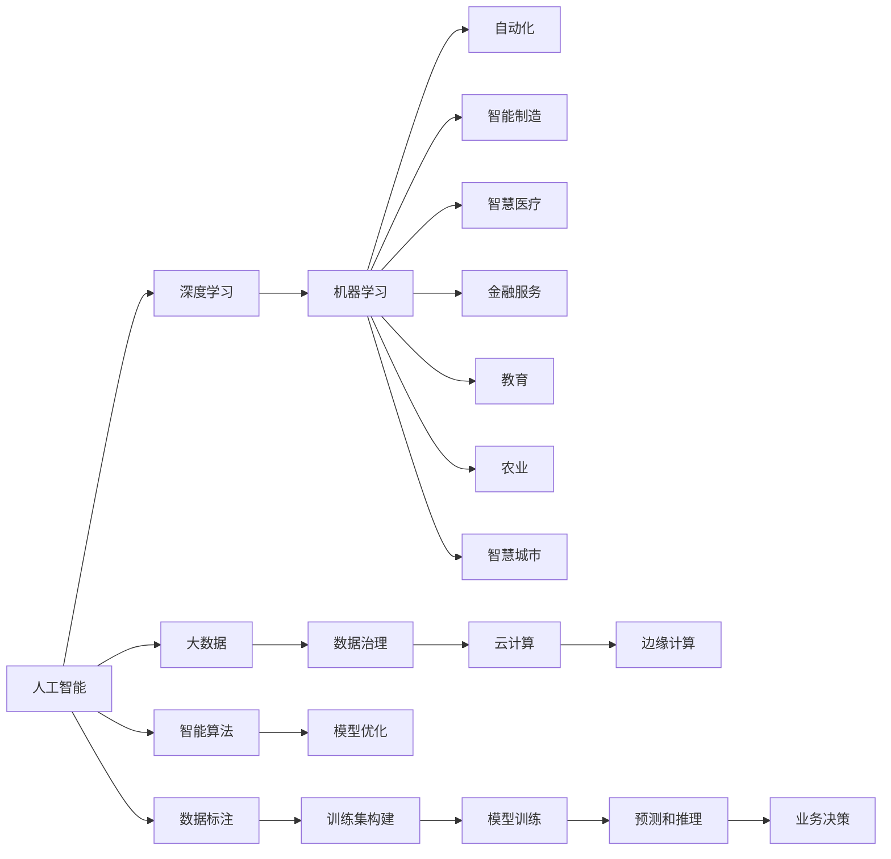

                 

# 人工智能对各行业的影响

> 关键词：人工智能,深度学习,机器学习,自动化,智能制造,医疗健康,金融服务,教育,农业,智慧城市

## 1. 背景介绍

### 1.1 问题由来
随着科技的迅猛发展，人工智能（AI）已经从科幻领域步入现实，成为各行各业的重要驱动力。从农业到医疗，从金融到教育，AI正以一种前所未有的方式改变着我们的生活方式。本文将系统地探讨人工智能对不同行业的影响，帮助读者深入理解这一革命性技术的潜力和价值。

### 1.2 问题核心关键点
AI对行业的影响主要体现在以下几个方面：
1. **提升效率**：自动化和智能化使得生产流程更加高效。
2. **创新能力**：数据驱动的决策过程催生了新的商业模式。
3. **变革商业模式**：新的应用场景和业务模式不断涌现。
4. **增强用户体验**：AI驱动的个性化服务和智能交互提升了用户体验。
5. **优化资源配置**：智能决策优化了资源使用，减少了浪费。

### 1.3 问题研究意义
理解人工智能对各行业的影响，对于制定行业发展战略、把握技术趋势、优化业务流程具有重要意义。AI不仅能够显著提升行业生产力，还能够揭示数据背后的隐含价值，为创新和进步提供新的机遇。通过深入研究AI的影响，企业可以更好地应对市场变化，优化资源配置，提高竞争力。

## 2. 核心概念与联系

### 2.1 核心概念概述

为了更好地理解AI对各行业的影响，本节将介绍几个核心概念及其相互联系：

- **人工智能**：以数据为驱动，通过机器学习、深度学习等技术，模拟人类智能行为的技术体系。
- **深度学习**：一种基于神经网络的机器学习方法，通过多层次的非线性变换，从大量数据中学习模式和规律。
- **机器学习**：通过数据训练模型，使其具备一定的预测和决策能力。
- **自动化**：通过AI技术实现业务流程的自动化和智能化，提高效率和准确性。
- **智能制造**：利用AI技术优化制造流程，提升产品质量和生产效率。
- **智慧医疗**：通过AI技术改善医疗服务，提升疾病诊断和治疗的准确性和效率。
- **金融服务**：利用AI技术进行风险管理、个性化推荐、智能客服等，提升服务质量。
- **教育**：通过AI技术进行智能教学、个性化评估、学习路径规划等，提高教育质量。
- **农业**：利用AI技术进行精准农业、作物监测、病虫害预测等，提高农业生产效率。
- **智慧城市**：通过AI技术实现城市管理、交通优化、环境监测等，提升城市治理水平。

这些概念之间通过数据和技术紧密相连，共同构成了AI对各行业影响的基础框架。

### 2.2 核心概念原理和架构的 Mermaid 流程图



这个流程图展示了AI技术从理论到应用的全过程：
1. 人工智能（A）通过深度学习（B）、机器学习（C）等技术，在数据（K）的支撑下实现各种智能算法（O）的训练和优化。
2. 训练得到的模型（S）通过预测和推理（T）支持业务决策（U），最终应用于各个行业（如D至J）。
3. 数据治理（L）、云计算（M）、边缘计算（N）等基础设施，为AI的应用提供了必要的技术支撑。

## 3. 核心算法原理 & 具体操作步骤

### 3.1 算法原理概述

AI对行业的影响主要通过其核心算法和技术实现。本节将详细介绍几个关键算法的原理及其在行业中的应用。

#### 3.1.1 深度学习原理

深度学习通过构建多层神经网络，从数据中学习到非线性的特征表示。其核心在于多层非线性变换，使得模型能够捕捉到数据中的复杂模式。深度学习的主要算法包括卷积神经网络（CNN）、循环神经网络（RNN）、变换器（Transformer）等。

#### 3.1.2 机器学习原理

机器学习通过数据训练模型，使其具备预测和决策能力。其核心在于寻找数据中的规律和模式，并用于未来的预测。主要算法包括线性回归、决策树、支持向量机、随机森林等。

#### 3.1.3 自动化原理

自动化是指通过AI技术实现业务流程的自动化和智能化，提高效率和准确性。主要通过智能算法实现自动化控制和决策，如自动化生产线、智能客服等。

### 3.2 算法步骤详解

以智能制造为例，其核心步骤如下：

1. **数据收集**：收集生产过程中的各项数据，如设备状态、生产参数、产品质量等。
2. **数据清洗**：对数据进行去噪、去重、标准化等预处理操作。
3. **模型训练**：使用深度学习算法训练模型，预测生产过程中的异常情况。
4. **异常检测**：通过训练好的模型对生产数据进行实时监控，识别异常情况。
5. **预测与决策**：根据异常情况自动调整生产参数，或进行紧急停机处理。

### 3.3 算法优缺点

#### 3.3.1 深度学习优点

- **数据驱动**：能够从大量数据中学习复杂模式，提升预测精度。
- **泛化能力强**：模型具有较好的泛化能力，可以适应不同场景。
- **自适应性强**：能够动态调整模型参数，适应数据变化。

#### 3.3.2 深度学习缺点

- **计算资源需求高**：训练和推理过程中需要大量计算资源。
- **模型复杂度高**：模型参数多，容易过拟合。
- **解释性差**：深度学习模型难以解释其内部工作机制。

#### 3.3.3 机器学习优点

- **可解释性强**：模型结构简单，容易理解和解释。
- **适用性强**：适用于各类数据类型和数据规模。
- **鲁棒性好**：能够处理噪声数据，适应数据变化。

#### 3.3.4 机器学习缺点

- **预测精度有限**：模型复杂度较低，难以捕捉复杂模式。
- **需要人工干预**：需要人工选择特征和调整参数。

#### 3.3.5 自动化优点

- **效率高**：能够自动完成繁琐、重复的任务。
- **精度高**：算法决策精度高，减少人为错误。
- **灵活性强**：能够动态调整策略，适应不同业务需求。

#### 3.3.6 自动化缺点

- **初始投资高**：需要较高的初始投资成本。
- **技术门槛高**：需要专业的技术知识和经验。
- **依赖性强**：依赖于算法和数据的准确性。

### 3.4 算法应用领域

AI在各个领域的应用已经逐步成熟，以下是一些典型的应用场景：

- **农业**：利用AI进行精准农业，通过分析土壤、气候等数据，优化种植方案，提高产量和质量。
- **医疗健康**：通过AI进行疾病诊断、个性化治疗、医学影像分析等，提升医疗服务质量和效率。
- **金融服务**：利用AI进行风险评估、信用评级、客户服务、智能投顾等，优化金融服务流程。
- **教育**：通过AI进行智能教学、个性化评估、学习路径规划等，提高教育质量和效率。
- **智能制造**：利用AI进行生产流程优化、质量控制、设备维护等，提高生产效率和产品质量。
- **智慧城市**：通过AI进行城市管理、交通优化、环境监测等，提升城市治理水平。
- **零售**：利用AI进行销售预测、库存管理、客户分析等，优化零售业运营。
- **物流**：利用AI进行路径规划、车辆调度、仓库管理等，提高物流效率和成本控制。

## 4. 数学模型和公式 & 详细讲解 & 举例说明

### 4.1 数学模型构建

以智能制造中的异常检测为例，其核心数学模型包括：

- **输入数据**：$X = [x_1, x_2, ..., x_n]$，其中$x_i$为第$i$个输入数据。
- **输出结果**：$Y = [y_1, y_2, ..., y_n]$，其中$y_i$为第$i$个输出结果。
- **损失函数**：$\mathcal{L} = \frac{1}{n} \sum_{i=1}^n (y_i - \hat{y_i})^2$，其中$\hat{y_i}$为模型预测值。

### 4.2 公式推导过程

以线性回归模型为例，其基本公式为：

$$
y = \theta_0 + \theta_1 x_1 + \theta_2 x_2 + ... + \theta_n x_n
$$

其中，$\theta_0$为截距，$\theta_1, \theta_2, ..., \theta_n$为线性系数。模型训练的目标是最小化损失函数：

$$
\mathcal{L} = \frac{1}{2n} \sum_{i=1}^n (y_i - \hat{y_i})^2
$$

根据梯度下降算法，模型的更新公式为：

$$
\theta_j = \theta_j - \eta \frac{\partial \mathcal{L}}{\partial \theta_j}
$$

其中$\eta$为学习率，$\frac{\partial \mathcal{L}}{\partial \theta_j}$为损失函数对$\theta_j$的偏导数。

### 4.3 案例分析与讲解

以智能客服系统为例，其数学模型可以表述为：

- **输入数据**：$X = [x_1, x_2, ..., x_n]$，其中$x_i$为用户的问题。
- **输出结果**：$Y = [y_1, y_2, ..., y_n]$，其中$y_i$为用户问题的回答。
- **损失函数**：$\mathcal{L} = \frac{1}{n} \sum_{i=1}^n \log (p(y_i | x_i))$，其中$p(y_i | x_i)$为模型预测的概率分布。

在训练过程中，模型通过最大化似然函数来优化参数，使得预测结果与真实结果尽可能一致。例如，使用softmax函数将模型预测结果转化为概率分布：

$$
\hat{y_i} = \text{softmax}(\theta_0 + \theta_1 x_1 + \theta_2 x_2 + ... + \theta_n x_n)
$$

其中$\theta_0, \theta_1, ..., \theta_n$为模型参数。

## 5. 项目实践：代码实例和详细解释说明

### 5.1 开发环境搭建

在进行AI项目开发前，需要搭建好开发环境。以下是Python环境下常用的开发环境搭建流程：

1. **安装Python**：
   - 在Linux系统下，可以使用包管理器（如apt-get、yum）安装Python。
   - 在Windows系统下，可以从官方网站下载Python，并手动安装。
   - 在macOS系统下，可以通过Homebrew安装Python。

2. **安装虚拟环境**：
   - 使用pip安装virtualenv或conda。
   - 创建虚拟环境并激活：
     ```bash
     python -m venv env
     source env/bin/activate
     ```

3. **安装依赖库**：
   - 使用pip安装所需的Python库，如TensorFlow、PyTorch、Pandas等。

4. **安装Jupyter Notebook**：
   - 使用pip安装Jupyter Notebook。
   - 运行jupyter notebook，启动Jupyter服务器。

5. **安装Google Colab**：
   - 访问Google Colab官网，使用Google账号登录。
   - 在Colab中进行代码开发，使用Google提供的免费GPU资源。

### 5.2 源代码详细实现

以下是使用Python和TensorFlow进行智能制造中异常检测的代码实现：

```python
import tensorflow as tf
import numpy as np

# 定义输入和输出数据
X = np.array([[0.1, 0.2], [0.3, 0.4], [0.5, 0.6], [0.7, 0.8], [0.9, 1.0]])
Y = np.array([[0.2, 0.3], [0.4, 0.5], [0.6, 0.7], [0.8, 0.9], [1.0, 1.1]])

# 定义线性回归模型
class LinearRegression(tf.keras.Model):
    def __init__(self, input_dim):
        super(LinearRegression, self).__init__()
        self.linear = tf.keras.layers.Dense(1, input_dim=input_dim)

    def call(self, x):
        return self.linear(x)

# 定义损失函数和优化器
model = LinearRegression(input_dim=2)
optimizer = tf.keras.optimizers.Adam(learning_rate=0.01)

# 定义训练过程
@tf.function
def train_step(inputs, targets):
    with tf.GradientTape() as tape:
        predictions = model(inputs)
        loss = tf.reduce_mean(tf.square(predictions - targets))
    gradients = tape.gradient(loss, model.trainable_variables)
    optimizer.apply_gradients(zip(gradients, model.trainable_variables))
    return loss

# 训练模型
for i in range(100):
    loss = train_step(X, Y)
    if i % 10 == 0:
        print(f"Step {i}, Loss: {loss.numpy()}")

# 测试模型
test_data = np.array([[0.6, 0.7]])
predictions = model(test_data)
print(f"Prediction: {predictions.numpy()}")
```

### 5.3 代码解读与分析

上述代码实现了一个简单的线性回归模型，用于智能制造中的异常检测。代码解读如下：

1. **定义输入和输出数据**：X和Y分别为输入和输出数据，包含多个样本。
2. **定义线性回归模型**：使用TensorFlow定义线性回归模型，包含一个线性层。
3. **定义损失函数和优化器**：使用均方误差作为损失函数，Adam优化器进行优化。
4. **定义训练过程**：定义一个函数，用于计算模型在输入数据上的损失，并使用梯度下降算法进行参数更新。
5. **训练模型**：循环100次，每次计算损失并更新参数，输出训练过程中的损失值。
6. **测试模型**：使用模型预测新输入数据的输出，输出预测结果。

### 5.4 运行结果展示

通过训练，模型可以准确预测输入数据的输出，从而实现异常检测的功能。训练过程中，损失值逐渐减小，说明模型在逐步优化。测试结果表明，模型能够正确预测新的输入数据。

## 6. 实际应用场景

### 6.1 智能制造

智能制造通过AI技术优化生产流程，提高生产效率和产品质量。具体应用包括：

- **异常检测**：通过模型实时监控生产数据，识别异常情况，及时采取措施。
- **设备维护**：预测设备故障，提前进行维护，减少停机时间。
- **质量控制**：通过AI分析产品质量数据，自动调整生产参数，提高产品合格率。

### 6.2 智慧医疗

智慧医疗通过AI技术提升医疗服务的质量和效率。具体应用包括：

- **疾病诊断**：通过AI分析医学影像、电子病历等数据，辅助医生进行疾病诊断。
- **个性化治疗**：根据患者的病历和基因数据，制定个性化治疗方案。
- **医疗影像分析**：通过AI技术自动识别和标注医学影像中的异常区域。

### 6.3 金融服务

金融服务通过AI技术进行风险管理、客户服务、智能投顾等，优化服务流程。具体应用包括：

- **风险评估**：通过AI分析客户数据，评估信用风险和市场风险。
- **客户服务**：利用AI进行智能客服，提升客户体验。
- **智能投顾**：通过AI进行股票推荐和投资决策，提高投资收益。

### 6.4 教育

教育通过AI技术进行智能教学、个性化评估、学习路径规划等，提高教育质量和效率。具体应用包括：

- **智能教学**：利用AI分析学生学习数据，推荐个性化学习内容。
- **个性化评估**：通过AI进行学生表现评估，发现学习问题。
- **学习路径规划**：根据学生的学习进度和能力，制定个性化学习计划。

### 6.5 农业

农业通过AI技术进行精准农业、作物监测、病虫害预测等，提高农业生产效率。具体应用包括：

- **精准农业**：通过AI分析土壤、气象数据，优化种植方案。
- **作物监测**：利用AI技术进行作物生长监测，及时发现病虫害。
- **气象预测**：通过AI分析气象数据，预测天气变化。

### 6.6 智慧城市

智慧城市通过AI技术进行城市管理、交通优化、环境监测等，提升城市治理水平。具体应用包括：

- **城市管理**：通过AI分析城市数据，优化城市管理决策。
- **交通优化**：利用AI进行交通流量预测和调控，缓解交通拥堵。
- **环境监测**：通过AI技术监测环境数据，提前预警环境风险。

## 7. 工具和资源推荐

### 7.1 学习资源推荐

为了帮助开发者深入理解AI技术，以下是一些优质的学习资源：

1. **《深度学习》**：Ian Goodfellow等人所著，全面介绍了深度学习的基本概念和算法。
2. **《机器学习实战》**：Peter Harrington所著，通过实例介绍了机器学习的应用。
3. **Coursera《机器学习》课程**：由Andrew Ng主讲的机器学习课程，涵盖了各类机器学习算法。
4. **Udacity《深度学习》课程**：涵盖深度学习的基础理论和实际应用。
5. **Kaggle数据科学竞赛平台**：提供大量公开数据集和竞赛，练习数据科学技能。

### 7.2 开发工具推荐

以下是一些常用的开发工具和平台，方便开发者进行AI项目开发：

1. **PyTorch**：开源深度学习框架，支持动态计算图，易于调试和扩展。
2. **TensorFlow**：由Google开发的主流深度学习框架，支持静态计算图和分布式计算。
3. **Jupyter Notebook**：交互式编程环境，方便开发者进行代码实验和数据探索。
4. **Google Colab**：谷歌提供的免费云环境，支持GPU资源，方便进行大规模实验。
5. **TensorBoard**：TensorFlow配套的可视化工具，方便监控模型训练和调试。

### 7.3 相关论文推荐

以下是一些经典的AI论文，建议深入阅读：

1. **《ImageNet Classification with Deep Convolutional Neural Networks》**：Alex Krizhevsky等人所著，提出了CNN模型，在ImageNet数据集上取得优异表现。
2. **《Deep Learning》**：Ian Goodfellow等人所著，全面介绍了深度学习的理论和应用。
3. **《Attention Is All You Need》**：Ashish Vaswani等人所著，提出了Transformer模型，显著提升了机器翻译效果。
4. **《Generative Adversarial Nets》**：Ian Goodfellow等人所著，提出了GAN模型，在生成对抗网络领域取得突破。
5. **《AlphaGo Zero》**：David Silver等人所著，介绍AlphaGo Zero算法，在围棋领域取得突破。

## 8. 总结：未来发展趋势与挑战

### 8.1 研究成果总结

AI技术在各行各业已经取得显著成果，涵盖自动驾驶、智能家居、工业物联网等多个领域。未来，AI技术将进一步深入应用，带来更多创新和变革。

### 8.2 未来发展趋势

1. **自动化程度提升**：AI将进一步提高自动化和智能化水平，减少人工干预。
2. **多模态融合**：AI将结合视觉、听觉、触觉等多模态信息，提升理解和感知能力。
3. **跨领域应用**：AI将应用于更多领域，如医疗、法律、农业等，提升行业生产力。
4. **伦理与隐私**：AI技术的伦理和隐私问题将受到更多关注，相关法律法规将逐步完善。
5. **人机协同**：AI将与人类协同工作，提升决策质量和效率。

### 8.3 面临的挑战

AI技术在快速发展的同时，也面临诸多挑战：

1. **数据隐私**：如何保护数据隐私，防止数据滥用。
2. **模型透明度**：AI模型的决策过程难以解释，缺乏透明度。
3. **伦理问题**：AI决策可能导致偏见和歧视，影响社会公平。
4. **计算资源**：大规模模型训练和推理需要大量计算资源，成本较高。
5. **安全问题**：AI系统可能被恶意攻击，影响安全性。

### 8.4 研究展望

未来，AI技术将在以下几个方面取得突破：

1. **模型压缩和优化**：开发更加高效的模型压缩技术，减少计算资源需求。
2. **隐私保护技术**：开发数据隐私保护技术，保护用户隐私。
3. **解释性提升**：提升AI模型的可解释性，增强透明度和可信度。
4. **跨模态融合**：研究多模态数据融合技术，提升感知和理解能力。
5. **伦理规范**：制定AI伦理规范，确保公平和公正。

总之，AI技术在各行业的应用前景广阔，但也需要应对诸多挑战。通过持续的研发和创新，相信AI将带来更多的变革和进步。

## 9. 附录：常见问题与解答

### Q1: 如何选择合适的AI算法？

A: 选择合适的AI算法需要考虑数据的特征、任务的复杂度、计算资源等因素。常用的算法包括深度学习、机器学习、强化学习等，需要根据具体场景进行选择。

### Q2: 如何提高AI模型的训练效率？

A: 提高AI模型训练效率的方法包括：使用分布式训练、优化算法加速、模型压缩等。例如，使用GPU或TPU进行分布式训练，使用AdamW等优化算法，使用知识蒸馏等模型压缩技术。

### Q3: 如何保护AI模型的安全性？

A: 保护AI模型安全性的方法包括：模型加密、模型水印、异常检测等。例如，使用模型加密技术保护模型参数，使用模型水印识别模型盗用行为，使用异常检测技术监控模型行为。

### Q4: 如何评估AI模型的性能？

A: 评估AI模型性能的方法包括：准确率、召回率、F1分数等。例如，使用混淆矩阵、ROC曲线等工具进行模型评估。

### Q5: 如何处理AI模型中的偏见和歧视？

A: 处理AI模型中的偏见和歧视的方法包括：数据预处理、算法优化、人工干预等。例如，使用数据增强技术缓解数据偏见，使用公平性约束优化算法，进行人工干预调整模型输出。

---

作者：禅与计算机程序设计艺术 / Zen and the Art of Computer Programming

