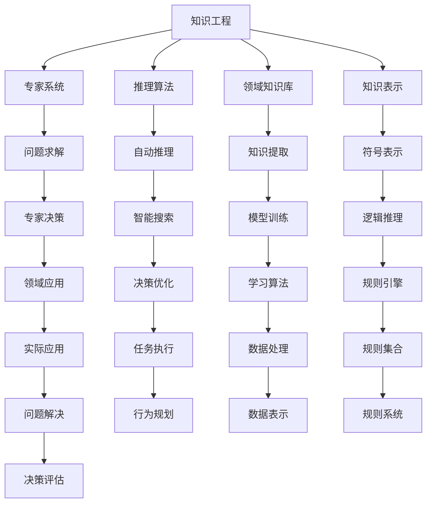

                 

# 人工智能术语的首次提出

> 关键词：人工智能,机器学习,深度学习,计算机科学,历史背景,发展历程,未来展望

## 1. 背景介绍

人工智能（Artificial Intelligence, AI）一词最早由计算机科学家约翰·麦卡锡（John McCarthy）于1956年提出，至今已有60多年的发展历程。人工智能的诞生标志着计算机科学的重大飞跃，奠定了现代计算机技术的坚实基础，对社会、经济、文化等多个领域产生了深远影响。

人工智能的发展经历了多个阶段，从早期基于符号逻辑的知识工程系统，到基于专家系统的推理系统，再到基于机器学习、深度学习的神经网络系统。每一阶段的发展，都离不开前沿理论的探索和实践的创新。

## 2. 核心概念与联系

### 2.1 核心概念概述

人工智能是一门研究如何让计算机系统模拟人类智能行为的技术。核心概念包括：

- 知识工程：通过构建领域知识库，实现基于规则的专家系统，解决特定领域的实际问题。
- 机器学习：让计算机系统通过学习大量数据，自动提取规律和模式，实现数据驱动的决策和推理。
- 深度学习：一种特殊的机器学习方法，通过多层次的神经网络结构，实现对数据的高效抽象和处理。
- 自然语言处理（NLP）：研究如何让计算机理解和处理人类语言，包括文本分类、机器翻译、语音识别等。
- 计算机视觉（CV）：研究如何让计算机理解和处理视觉信息，包括图像识别、目标检测、场景理解等。
- 机器人学：研究如何让机器人在各种环境中自动执行复杂任务，实现人机协作。

### 2.2 核心概念原理和架构的 Mermaid 流程图



这个流程图展示了人工智能核心概念之间的逻辑关系：

1. 知识工程通过构建领域知识库和知识表示，实现专家系统的推理和决策。
2. 机器学习和深度学习通过对大量数据进行学习，提取规律和模式，实现智能搜索和自动推理。
3. NLP和CV研究如何让计算机理解和处理自然语言和视觉信息。
4. 机器人学实现机器人在复杂环境中的自动执行任务，并与人协作。

这些核心概念共同构成了人工智能的研究框架，推动了计算机科学的不断进步。

## 3. 核心算法原理 & 具体操作步骤

### 3.1 算法原理概述

人工智能的核心算法主要分为两大类：基于规则的算法和基于数据的算法。

- 基于规则的算法：通过构建领域专家知识库，将问题分解成一系列规则，实现决策和推理。
- 基于数据的算法：通过学习大量数据，自动提取数据中的规律和模式，实现数据驱动的决策和推理。

这两种算法各有优缺点。基于规则的算法适用于特定领域的专家系统，但需要大量的人工参与，难以处理复杂多变的数据。基于数据的算法适用于处理大规模数据，但需要大量的标注数据，且难以解释决策过程。

### 3.2 算法步骤详解

人工智能算法的典型步骤如下：

1. 数据收集：收集领域内的大量数据，包括文本、图像、音频等。
2. 数据预处理：对数据进行清洗、归一化、特征提取等预处理，准备数据输入模型。
3. 模型选择：选择合适的机器学习或深度学习模型，并进行参数初始化。
4. 模型训练：使用训练数据对模型进行训练，优化模型参数，使其拟合训练数据。
5. 模型评估：使用测试数据对模型进行评估，计算模型的准确率、召回率、F1值等指标。
6. 模型应用：将模型应用于实际问题，进行数据推理和决策。
7. 模型优化：根据评估结果，对模型进行优化调整，提升模型性能。

### 3.3 算法优缺点

人工智能算法的优缺点如下：

- 优点：
  - 适用于处理大规模数据
  - 能够自动提取数据中的规律和模式
  - 决策过程可以优化调整，提升性能
- 缺点：
  - 需要大量的标注数据
  - 难以解释决策过程
  - 可能会产生过拟合

### 3.4 算法应用领域

人工智能技术在多个领域得到了广泛应用，例如：

- 自然语言处理：文本分类、机器翻译、语音识别等。
- 计算机视觉：图像识别、目标检测、场景理解等。
- 机器人学：自动驾驶、智能制造、服务机器人等。
- 医疗健康：疾病诊断、治疗方案推荐、个性化医疗等。
- 金融行业：风险评估、智能投顾、信用评分等。
- 教育领域：智能辅导、学习推荐、作业批改等。

## 4. 数学模型和公式 & 详细讲解 & 举例说明

### 4.1 数学模型构建

人工智能算法通常使用数学模型进行建模。以下是一些典型的人工智能模型：

- 决策树：基于树形结构进行分类和回归。
- 支持向量机（SVM）：通过寻找最优的超平面进行分类。
- 神经网络：通过多层次的非线性变换进行数据处理。
- 贝叶斯网络：通过贝叶斯定理进行概率推理和预测。

### 4.2 公式推导过程

以神经网络为例，其基本原理可以表示为：

$$
\hat{y} = \sigma(\boldsymbol{W} \boldsymbol{x} + b)
$$

其中，$\hat{y}$ 为输出，$\boldsymbol{x}$ 为输入，$\boldsymbol{W}$ 为权重矩阵，$b$ 为偏置项，$\sigma$ 为激活函数。

神经网络的训练过程可以使用反向传播算法，通过不断调整权重矩阵和偏置项，最小化损失函数。

### 4.3 案例分析与讲解

以神经网络在图像分类任务中的应用为例，其具体步骤如下：

1. 数据准备：收集图像数据，进行预处理。
2. 模型设计：设计多层神经网络，选择激活函数和损失函数。
3. 模型训练：使用训练数据对模型进行训练，优化模型参数。
4. 模型评估：使用测试数据对模型进行评估，计算准确率。
5. 模型应用：将模型应用于实际图像分类任务，进行推理。

## 5. 项目实践：代码实例和详细解释说明

### 5.1 开发环境搭建

人工智能项目通常使用Python进行开发，以下是Python开发环境搭建的步骤：

1. 安装Python：从官网下载并安装Python。
2. 安装Pip：使用Python自带的pip工具安装第三方库。
3. 安装TensorFlow和Keras：TensorFlow和Keras是目前最流行的深度学习框架。
4. 安装其他库：如NumPy、Pandas、Scikit-learn等常用库。

### 5.2 源代码详细实现

以下是使用Keras框架进行图像分类任务的Python代码：

```python
from keras.models import Sequential
from keras.layers import Conv2D, MaxPooling2D, Flatten, Dense
from keras.datasets import mnist

# 加载数据集
(x_train, y_train), (x_test, y_test) = mnist.load_data()

# 数据预处理
x_train = x_train.reshape(x_train.shape[0], 28, 28, 1)
x_test = x_test.reshape(x_test.shape[0], 28, 28, 1)
x_train = x_train.astype('float32') / 255
x_test = x_test.astype('float32') / 255

# 构建模型
model = Sequential()
model.add(Conv2D(32, kernel_size=(3, 3), activation='relu', input_shape=(28, 28, 1)))
model.add(MaxPooling2D(pool_size=(2, 2)))
model.add(Flatten())
model.add(Dense(128, activation='relu'))
model.add(Dense(10, activation='softmax'))

# 编译模型
model.compile(loss='categorical_crossentropy', optimizer='adam', metrics=['accuracy'])

# 训练模型
model.fit(x_train, y_train, epochs=10, batch_size=128, validation_data=(x_test, y_test))

# 评估模型
loss, accuracy = model.evaluate(x_test, y_test)
print('Test accuracy:', accuracy)
```

### 5.3 代码解读与分析

代码实现主要分为数据准备、模型设计、模型训练、模型评估和模型应用几个步骤。

- 数据准备：将MNIST数据集加载并预处理。
- 模型设计：设计一个包含卷积层、池化层、全连接层的神经网络。
- 模型训练：使用训练数据对模型进行训练，优化模型参数。
- 模型评估：使用测试数据对模型进行评估，计算准确率。
- 模型应用：使用模型对测试集进行分类，输出预测结果。

## 6. 实际应用场景

### 6.1 金融行业

人工智能在金融行业的应用主要包括以下几个方面：

- 风险评估：通过分析客户的交易记录和行为数据，评估其信用风险和违约概率。
- 智能投顾：根据客户的风险偏好和投资目标，自动推荐投资组合和资产配置。
- 信用评分：通过分析客户的个人信息和行为数据，自动生成信用评分。
- 市场预测：通过分析历史交易数据和市场信息，预测股票价格和市场趋势。

### 6.2 医疗健康

人工智能在医疗健康领域的应用主要包括以下几个方面：

- 疾病诊断：通过分析医学影像和病历数据，辅助医生进行疾病诊断。
- 治疗方案推荐：根据患者的病情和历史数据，推荐最佳治疗方案。
- 个性化医疗：通过分析基因信息和电子病历，制定个性化治疗方案。
- 智能辅助诊断：通过自然语言处理技术，自动提取和分析医学文献，辅助医生进行诊断。

### 6.3 教育领域

人工智能在教育领域的应用主要包括以下几个方面：

- 智能辅导：通过分析学生的学习行为和成绩数据，自动生成个性化辅导方案。
- 学习推荐：根据学生的学习兴趣和知识水平，推荐合适的学习资源和课程。
- 作业批改：通过自然语言处理技术，自动批改学生的作业和答案。
- 学习分析：通过分析学生的学习数据，评估学习效果和提供改进建议。

## 7. 工具和资源推荐

### 7.1 学习资源推荐

以下是一些推荐的学习资源，帮助读者深入理解人工智能：

1. 《深度学习》（Deep Learning）：Ian Goodfellow等著，详细介绍了深度学习的原理和实践。
2. 《机器学习实战》（Machine Learning in Action）：Peter Harrington著，通过实践案例介绍了机器学习的经典算法。
3. 《人工智能：一种现代方法》（Artificial Intelligence: A Modern Approach）：Stuart Russell和Peter Norvig著，是一本经典的人工智能教材。
4. Coursera和edX等在线课程平台，提供了大量高质量的人工智能课程。
5. GitHub等代码分享平台，可以下载和分享人工智能项目的代码和数据集。

### 7.2 开发工具推荐

以下是一些推荐的人工智能开发工具，帮助开发者快速开发和部署人工智能模型：

1. TensorFlow和PyTorch：目前最流行的深度学习框架，提供了丰富的API和模型库。
2. Keras：一个高级API，简化了深度学习模型的开发。
3. Jupyter Notebook：一个交互式开发环境，支持Python和其他语言。
4. Anaconda：一个科学计算环境，提供了丰富的第三方库和工具。
5. Scikit-learn：一个机器学习库，提供了多种机器学习算法和工具。

### 7.3 相关论文推荐

以下是一些推荐的人工智能论文，帮助读者了解前沿研究进展：

1. 《Deep Residual Learning for Image Recognition》（ResNet论文）：提出了残差网络（ResNet），提高了深度神经网络的性能。
2. 《ImageNet Classification with Deep Convolutional Neural Networks》（AlexNet论文）：首次在大规模数据集上训练深度神经网络，取得了优异的效果。
3. 《Attention is All You Need》（Transformer论文）：提出了Transformer模型，改变了深度学习模型的结构和训练方式。
4. 《Language Models are Unsupervised Multitask Learners》（GPT-2论文）：展示了大规模语言模型的强大零样本学习能力。
5. 《AdaLoRA: Adaptive Low-Rank Adaptation for Parameter-Efficient Fine-Tuning》：提出了一种参数高效的微调方法，减少了微调中的参数量。

## 8. 总结：未来发展趋势与挑战

### 8.1 研究成果总结

人工智能技术在过去的几十年中取得了巨大的进展，推动了计算机科学的发展。其核心算法从早期的基于规则的专家系统，发展到现在的基于数据的深度学习模型，展示了计算机科学的强大生命力。

### 8.2 未来发展趋势

人工智能的未来发展趋势如下：

1. 深度学习模型的可解释性：随着模型的复杂性不断增加，模型的可解释性成为了一个重要的问题。未来的研究将致力于提高模型的透明度和可解释性，使其更容易被理解和接受。
2. 自动机器学习（AutoML）：自动机器学习技术将帮助非专业人士快速构建和优化机器学习模型，降低机器学习的门槛。
3. 跨领域知识融合：未来的研究将致力于将人工智能与其他学科的知识进行融合，如自然语言处理、计算机视觉、机器人学等。
4. 联邦学习：联邦学习技术将帮助多个机构共同构建和优化机器学习模型，保护数据隐私和安全性。
5. 人工智能伦理和安全：未来的研究将致力于解决人工智能伦理和安全问题，如算法偏见、隐私保护、数据安全等。

### 8.3 面临的挑战

人工智能技术在发展过程中还面临着以下挑战：

1. 数据隐私和安全性：随着人工智能应用的广泛普及，数据隐私和安全问题变得越来越重要。如何在保护用户隐私的前提下，开发和部署人工智能应用，是一个亟待解决的问题。
2. 算法偏见和歧视：人工智能算法可能会学习到数据中的偏见和歧视，导致不公平的决策和结果。如何在设计和训练模型时消除偏见和歧视，是一个重要的研究方向。
3. 算力需求和成本：深度学习模型的复杂性越来越高，需要大量的计算资源和能源。如何在降低成本的同时，提高模型的性能和效率，是一个重要的课题。
4. 人工智能伦理和社会责任：人工智能技术的发展带来了许多伦理和社会问题，如就业替代、社会分化等。如何在发展人工智能技术的同时，关注伦理和社会责任，是一个重要的挑战。

### 8.4 研究展望

未来的研究将在以下几个方面进行深入探索：

1. 高效模型和算法：未来的研究将致力于开发更加高效和轻量化的模型和算法，降低计算成本和能源消耗。
2. 人工智能伦理和安全：未来的研究将致力于解决人工智能伦理和安全问题，如算法偏见、隐私保护、数据安全等。
3. 跨学科融合：未来的研究将致力于将人工智能与其他学科的知识进行融合，如自然语言处理、计算机视觉、机器人学等。
4. 人工智能伦理和社会责任：未来的研究将致力于解决人工智能伦理和社会责任问题，如就业替代、社会分化等。

总之，人工智能技术正处于蓬勃发展的阶段，未来的研究将推动其在更广泛的领域得到应用，为人类的生产和生活带来更多的便利和变革。

## 9. 附录：常见问题与解答

### Q1: 什么是人工智能？

A: 人工智能是一种研究如何让计算机系统模拟人类智能行为的技术，涵盖自然语言处理、计算机视觉、机器人学等多个领域。

### Q2: 人工智能的核心算法有哪些？

A: 人工智能的核心算法主要包括基于规则的算法和基于数据的算法。其中，基于规则的算法通过构建领域知识库，实现决策和推理；基于数据的算法通过学习大量数据，自动提取规律和模式，实现数据驱动的决策和推理。

### Q3: 人工智能有哪些应用领域？

A: 人工智能在金融、医疗、教育、制造业等多个领域得到了广泛应用，如风险评估、疾病诊断、智能辅导、智能制造等。

### Q4: 如何提高人工智能算法的可解释性？

A: 提高人工智能算法的可解释性可以从以下几个方面入手：
1. 使用可解释的模型，如决策树、线性回归等。
2. 引入可解释的技术，如模型压缩、特征选择等。
3. 增加模型的透明度，如可视化模型的决策路径、规则等。

### Q5: 人工智能未来的发展趋势是什么？

A: 人工智能未来的发展趋势包括：
1. 深度学习模型的可解释性。
2. 自动机器学习（AutoML）。
3. 跨领域知识融合。
4. 联邦学习。
5. 人工智能伦理和安全。

