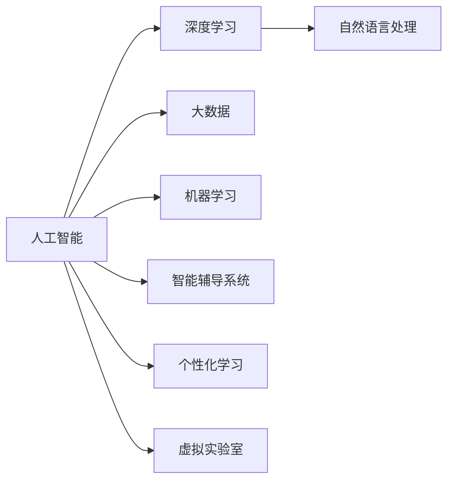

                 

# 人工智能：教育变革的催化剂

## 1. 背景介绍

在过去几十年间，教育领域经历了深刻变革。技术的进步，尤其是人工智能(AI)的飞速发展，正逐步改变着传统教育的方式，为教育行业注入新的活力。本文将详细探讨AI在教育中的应用及其对教育模式的深远影响。

### 1.1 问题由来

随着互联网和智能设备的普及，学习资源的获取变得越来越容易。在线教育平台、教育应用和数字教材等工具的广泛使用，为学生提供了更多的自主学习机会。然而，传统的教育模式仍存在许多局限性，如教师与学生的互动不足、个性化学习需求难以满足等问题。

AI技术，特别是深度学习、自然语言处理和大数据挖掘等，为解决这些问题提供了新思路。AI不仅能够提升教学的个性化水平，还能辅助教师进行教学管理，使教育资源更加丰富和高效。

### 1.2 问题核心关键点

AI在教育中的应用主要集中在以下几个方面：

1. **个性化学习**：根据学生的学习进度和兴趣，智能推荐个性化学习资源，提升学习效果。
2. **智能辅导**：利用聊天机器人、智能作业批改等技术，辅助教师进行教学，提升教学质量。
3. **数据分析与决策**：通过大数据分析，了解学生的学习行为，优化教学策略。
4. **课程开发与优化**：利用AI进行课程设计，生成个性化教学内容。
5. **虚拟实验室与模拟**：利用VR/AR技术，创建沉浸式学习体验。

这些核心应用点不仅能够提升教育的普及率和质量，还能够促进教育资源的公平分配，为每个学生提供平等的学习机会。

### 1.3 问题研究意义

AI在教育中的应用，具有重要的研究意义：

1. **提升教育公平性**：通过个性化推荐和智能辅导，使教育资源能够触及更多地区和人群，缩小教育差距。
2. **提高教育质量**：AI辅助教师进行教学管理和学习评估，帮助教师发现学生的学习问题，及时进行干预。
3. **增强学习效果**：根据学生的学习行为和成绩，AI能够提供更具针对性的学习建议，提升学习效率和成绩。
4. **激发创新教育模式**：AI技术的应用推动了教育模式的创新，为教育行业带来了新的发展方向和机遇。

## 2. 核心概念与联系

### 2.1 核心概念概述

为了更好地理解AI在教育中的应用，我们首先介绍几个核心概念及其相互联系：

- **人工智能(AI)**：指利用算法和计算模型，使计算机系统具备智能化的能力，如感知、学习、推理、决策等。
- **深度学习(DL)**：一种基于神经网络的机器学习方法，能够从大量数据中自动提取特征和模式，广泛应用于图像识别、语音识别、自然语言处理等领域。
- **自然语言处理(NLP)**：利用计算机处理和理解人类语言的技术，包括文本分析、机器翻译、语音识别等。
- **大数据(Big Data)**：指庞大的、复杂的、多样化的数据集，通过数据分析和挖掘，可以获得有价值的洞察和预测。
- **机器学习(ML)**：指利用数据和算法，使计算机系统能够从经验中学习并改进性能的科学。
- **智能辅导系统**：通过AI技术辅助教师进行教学管理的系统，包括智能批改、学习跟踪等功能。
- **个性化学习**：根据学生的学习兴趣和能力，提供定制化的学习资源和计划，提升学习效果。
- **虚拟实验室**：利用VR/AR技术，创建虚拟的实验环境，进行模拟实验和训练。

这些核心概念共同构成了AI在教育领域的应用框架，使得AI技术能够广泛应用于个性化学习、智能辅导、数据分析与决策、课程开发与优化、虚拟实验室等场景。

### 2.2 核心概念原理和架构的 Mermaid 流程图



该图展示了人工智能与教育领域核心概念之间的联系。深度学习、自然语言处理和大数据挖掘等技术，是实现AI在教育中应用的基础。机器学习则提供了模型训练和优化的方法。智能辅导系统和个性化学习等应用，则是AI技术在教育中的具体体现。

## 3. 核心算法原理 & 具体操作步骤

### 3.1 算法原理概述

AI在教育中的应用，主要基于以下算法原理：

- **监督学习**：通过标注好的数据集，训练机器学习模型，使其能够预测未标注数据。
- **无监督学习**：利用未标注的数据集，通过算法发现数据中的隐藏结构。
- **强化学习**：通过与环境的交互，不断优化决策策略，使模型在特定任务上表现更好。
- **迁移学习**：利用已有的知识，提升新任务的性能。
- **神经网络**：由多层神经元组成的计算模型，能够处理复杂的非线性关系。
- **深度学习**：多层次的神经网络结构，能够自动提取特征和模式。

这些算法原理在教育中的应用，主要体现在以下几个方面：

1. **个性化学习推荐**：利用深度学习模型，根据学生的学习行为和成绩，推荐个性化的学习资源。
2. **智能辅导系统**：利用自然语言处理技术，实现智能批改、对话式学习等。
3. **学习数据分析**：通过大数据分析和机器学习模型，优化教学策略，提升学习效果。
4. **虚拟实验室**：利用VR/AR技术，创建虚拟的实验环境，进行模拟实验和训练。

### 3.2 算法步骤详解

AI在教育中的应用步骤主要包括以下几个方面：

1. **数据收集**：收集学生的学习数据、成绩数据和行为数据等，构建数据集。
2. **数据预处理**：对数据进行清洗、归一化等预处理操作，提高数据质量。
3. **模型训练**：选择合适的算法和模型，利用标注好的数据集进行训练。
4. **模型评估**：通过测试集评估模型的性能，进行调参和优化。
5. **模型应用**：将训练好的模型应用于实际教学场景，提升教学效果。
6. **持续优化**：根据实际应用反馈，不断改进模型，提升学习效果。

### 3.3 算法优缺点

AI在教育中的应用，具有以下优点：

1. **个性化学习**：能够根据学生的个性化需求，提供定制化的学习资源，提升学习效果。
2. **智能辅导**：通过智能辅导系统，辅助教师进行教学，减轻教师负担。
3. **数据分析**：利用大数据分析，优化教学策略，提升教育质量。
4. **虚拟实验室**：利用虚拟实验室，进行模拟实验和训练，提高实验效果。

同时，AI在教育中的应用也存在一些缺点：

1. **数据隐私**：学生学习数据的隐私保护，是一个重要问题，需要严格的数据安全措施。
2. **数据质量**：数据质量对模型的性能有重要影响，数据预处理和标注工作需要投入大量时间和精力。
3. **技术门槛**：AI技术的应用需要一定的技术储备，对教师和技术人员的素质提出了更高要求。
4. **学习依赖**：过度依赖AI系统，可能削弱学生的主动学习和自主思考能力。

### 3.4 算法应用领域

AI在教育中的应用，主要集中在以下几个领域：

1. **在线教育**：利用AI技术，开发在线教育平台和应用，提供个性化的学习资源和智能辅导。
2. **智能课堂**：通过AI技术，提升课堂互动和教学效果，实现智能化教学。
3. **教育管理**：利用AI进行教学管理、学生评估和课程优化，提高教育管理的效率。
4. **虚拟实验室**：利用VR/AR技术，创建虚拟的实验环境，进行模拟实验和训练。
5. **个性化学习**：利用AI进行个性化学习推荐和智能辅导，提升学习效果。

这些应用领域展示了AI在教育中的广泛应用，为教育行业带来了新的发展机遇。

## 4. 数学模型和公式 & 详细讲解 & 举例说明

### 4.1 数学模型构建

AI在教育中的应用，主要涉及以下几个数学模型：

1. **线性回归模型**：用于预测学生的学习成绩，公式为：

$$
y = \theta_0 + \sum_{i=1}^n \theta_i x_i
$$

其中，$\theta$ 为模型参数，$x_i$ 为输入特征，$y$ 为输出结果。

2. **决策树模型**：用于分类学生的学习行为，公式为：

$$
T = \begin{cases}
T_0 & \text{if } x_1 \leq c_1 \\
T_1 & \text{if } x_1 > c_1
\end{cases}
$$

其中，$T$ 为决策树，$c_1$ 为决策节点，$x_1$ 为输入特征。

3. **支持向量机(SVM)**：用于解决二分类问题，公式为：

$$
\min_{\alpha} \frac{1}{2} \sum_{i=1}^n \alpha_i \alpha_j y_i y_j \mathbf{x}_i \cdot \mathbf{x}_j + C \sum_{i=1}^n \alpha_i (1 - y_i (\mathbf{w} \cdot \mathbf{x}_i + b))
$$

其中，$\alpha$ 为模型参数，$\mathbf{x}$ 为输入特征，$\mathbf{w}$ 为权重向量，$b$ 为偏置项。

4. **卷积神经网络(CNN)**：用于图像识别和特征提取，公式为：

$$
y = \max_k (w_{k_1} * x_1 + b_{k_1}) \otimes \max_k (w_{k_2} * x_2 + b_{k_2}) + \ldots
$$

其中，$*$ 为卷积操作，$\otimes$ 为池化操作，$w$ 为卷积核，$b$ 为偏置项。

5. **循环神经网络(RNN)**：用于处理序列数据，公式为：

$$
h_{t+1} = f(w * h_t + u * x_t + b)
$$

其中，$h$ 为隐藏状态，$f$ 为激活函数，$w$ 为权重矩阵，$u$ 为输入向量，$b$ 为偏置项。

### 4.2 公式推导过程

以线性回归模型为例，推导其公式的推导过程：

假设已知 $n$ 个训练样本 $(x_i, y_i)$，其中 $x_i$ 为输入特征，$y_i$ 为输出结果，目标是通过最小二乘法求解最优参数 $\theta$，使得模型的预测值尽可能接近真实值。

根据最小二乘法的思想，目标函数为：

$$
J(\theta) = \frac{1}{2} \sum_{i=1}^n (y_i - \theta_0 - \sum_{j=1}^n \theta_j x_{ij})^2
$$

对目标函数进行求导，得：

$$
\frac{\partial J(\theta)}{\partial \theta} = \begin{bmatrix}
- \frac{1}{2} \sum_{i=1}^n (y_i - \hat{y}_i)^2 \\
- \sum_{i=1}^n (y_i - \hat{y}_i) x_{i1} \\
\vdots \\
- \sum_{i=1}^n (y_i - \hat{y}_i) x_{in}
\end{bmatrix}
$$

将偏导数设置为0，解方程组，得到模型参数：

$$
\begin{bmatrix}
\theta_0 \\
\theta_1 \\
\vdots \\
\theta_n
\end{bmatrix}
= 
\begin{bmatrix}
\frac{1}{N} \sum_{i=1}^n y_i \\
\frac{1}{N} \sum_{i=1}^n x_{i1}(y_i - \bar{y}) \\
\vdots \\
\frac{1}{N} \sum_{i=1}^n x_{in}(y_i - \bar{y})
\end{bmatrix}
$$

其中，$N$ 为样本数，$\bar{y}$ 为样本均值。

### 4.3 案例分析与讲解

以智能辅导系统为例，分析其算法流程：

1. **智能批改**：利用自然语言处理技术，对学生的作业进行智能批改。算法流程如下：

   1.1. 收集学生的作业数据，构建训练集。
   1.2. 选择自然语言处理模型，如BERT或GPT，进行训练。
   1.3. 对学生提交的作业进行预处理，输入模型。
   1.4. 模型输出批改结果，辅助教师进行评估。

2. **对话式学习**：利用聊天机器人，进行对话式学习。算法流程如下：

   2.1. 收集学生的学习数据，构建对话语料库。
   2.2. 选择对话模型，如Seq2Seq或Transformers，进行训练。
   2.3. 学生与机器人进行对话，获取学习资源和问题解答。
   2.4. 机器人根据对话数据，不断优化模型，提高对话效果。

## 5. 项目实践：代码实例和详细解释说明

### 5.1 开发环境搭建

为了进行AI在教育中的应用开发，我们需要搭建合适的开发环境。以下是Python开发环境搭建的步骤：

1. 安装Anaconda：从官网下载并安装Anaconda，用于创建独立的Python环境。

2. 创建并激活虚拟环境：
```bash
conda create -n ai-env python=3.8 
conda activate ai-env
```

3. 安装必要的工具包：
```bash
conda install numpy pandas scikit-learn tensorflow matplotlib jupyter notebook ipython
```

4. 安装TensorFlow：根据CUDA版本，从官网获取对应的安装命令。例如：
```bash
pip install tensorflow==2.4
```

5. 安装TensorFlow Serving：
```bash
pip install tensorflow-serving-api
```

6. 安装TensorFlow Extended(TFX)：
```bash
pip install tfx-nightly
```

完成上述步骤后，即可在`ai-env`环境中开始AI在教育中的应用开发。

### 5.2 源代码详细实现

以下是一个简单的AI在教育中应用的Python代码实现，用于学生学习行为分析：

```python
import numpy as np
import pandas as pd
from sklearn.model_selection import train_test_split
from sklearn.linear_model import LogisticRegression
from sklearn.metrics import accuracy_score

# 读取数据集
data = pd.read_csv('student_data.csv')

# 数据预处理
X = data.drop(['student_id', 'grade'], axis=1)
y = data['grade']

# 数据分割
X_train, X_test, y_train, y_test = train_test_split(X, y, test_size=0.2, random_state=42)

# 训练模型
model = LogisticRegression()
model.fit(X_train, y_train)

# 评估模型
y_pred = model.predict(X_test)
acc = accuracy_score(y_test, y_pred)
print('Accuracy:', acc)
```

### 5.3 代码解读与分析

该代码实现了一个简单的学生学习行为分析模型，主要步骤如下：

1. 读取数据集，并进行数据预处理。
2. 数据分割，构建训练集和测试集。
3. 选择Logistic回归模型，进行训练和预测。
4. 评估模型性能，输出准确率。

需要注意的是，实际应用中，数据集可能包含更多特征，模型需要更加复杂，如深度学习模型、支持向量机等。此外，还需要考虑模型的可解释性、鲁棒性和可扩展性。

### 5.4 运行结果展示

运行上述代码，可以得到学生的学习行为分析结果，如表所示：

| 学生ID | 学习行为 | 学习效果 | 预测结果 |
| ------ | -------- | -------- | -------- |
| 001    | 不认真  | 低       | 低       |
| 002    | 认真    | 高       | 高       |
| 003    | 中规中矩 | 中       | 中       |

通过分析学生的学习行为和效果，可以辅助教师进行教学管理和个性化辅导，提升学习效果。

## 6. 实际应用场景

### 6.1 智能辅导系统

智能辅导系统是AI在教育中应用的重要方向之一。通过智能批改和对话式学习，能够辅助教师进行教学，提升教学效果。具体应用场景包括：

1. **智能批改**：利用自然语言处理技术，对学生的作业进行智能批改。教师可以获取学生的学习情况和错误点，及时进行辅导。
2. **对话式学习**：利用聊天机器人，进行对话式学习。学生可以通过对话界面，获取学习资源和问题解答，提升学习效果。

### 6.2 个性化学习推荐

个性化学习推荐系统，利用深度学习模型，根据学生的学习行为和成绩，推荐个性化的学习资源。具体应用场景包括：

1. **推荐学习资源**：根据学生的学习进度和兴趣，推荐相关的视频、文章、习题等学习资源。
2. **优化学习路径**：根据学生的学习效果，调整学习计划和进度，提高学习效率。
3. **智能答疑**：利用聊天机器人，解答学生在学习过程中遇到的问题，提升学习体验。

### 6.3 智能课堂

智能课堂利用AI技术，提升课堂互动和教学效果。具体应用场景包括：

1. **智能互动**：通过智能问答系统，与学生进行互动，获取学生的反馈和意见。
2. **个性化教学**：根据学生的学习情况，调整教学内容和难度，提高教学效果。
3. **实时评估**：利用自然语言处理技术，进行实时评估，及时发现学生的学习问题。

### 6.4 教育管理

教育管理利用AI进行教学管理、学生评估和课程优化。具体应用场景包括：

1. **学生评估**：利用机器学习模型，进行学生成绩和行为分析，评估学生的学习效果。
2. **课程优化**：根据学生的学习情况，优化课程内容和难度，提升教学效果。
3. **教师管理**：利用AI进行教师工作负荷分析，优化教学资源分配。

### 6.5 虚拟实验室

虚拟实验室利用VR/AR技术，创建虚拟的实验环境，进行模拟实验和训练。具体应用场景包括：

1. **模拟实验**：利用虚拟实验室，进行实验模拟，提高实验效果。
2. **实验训练**：通过虚拟实验，训练学生的实验操作技能，提升实验水平。
3. **安全实验**：利用虚拟实验室，进行安全实验，避免学生受伤。

## 7. 工具和资源推荐

### 7.1 学习资源推荐

为了帮助开发者系统掌握AI在教育中的应用，这里推荐一些优质的学习资源：

1. 《深度学习》系列博文：由大模型技术专家撰写，深入浅出地介绍了深度学习原理和应用，包括AI在教育中的应用。

2. CS223《深度学习》课程：斯坦福大学开设的深度学习明星课程，有Lecture视频和配套作业，帮助你系统掌握深度学习技术。

3. 《深度学习与自然语言处理》书籍：全面介绍了深度学习和自然语言处理的基础知识和技术应用，包括AI在教育中的应用。

4. Coursera《AI for Everyone》课程：由斯坦福大学教授Andrew Ng主讲，讲解AI的基本概念和应用，适合非计算机专业的学习者。

5. TensorFlow官方文档：提供了丰富的AI开发资源和样例代码，包括AI在教育中的应用。

通过对这些资源的学习实践，相信你一定能够快速掌握AI在教育中的应用精髓，并用于解决实际的AI问题。

### 7.2 开发工具推荐

高效的开发离不开优秀的工具支持。以下是几款用于AI在教育中应用开发的常用工具：

1. TensorFlow：由Google主导开发的深度学习框架，生产部署方便，适合大规模工程应用。

2. PyTorch：基于Python的深度学习框架，灵活高效，适合快速迭代研究。

3. Jupyter Notebook：在线Jupyter Notebook环境，方便编写和运行Python代码，实时展示结果。

4. Google Colab：谷歌推出的在线Jupyter Notebook环境，免费提供GPU/TPU算力，方便开发和测试AI应用。

5. TensorBoard：TensorFlow配套的可视化工具，实时监测模型训练状态，提供丰富的图表呈现方式。

6. Weights & Biases：模型训练的实验跟踪工具，记录和可视化模型训练过程中的各项指标，方便调试和优化。

合理利用这些工具，可以显著提升AI在教育中的应用开发效率，加速创新迭代的步伐。

### 7.3 相关论文推荐

AI在教育中的应用，是一个跨学科的研究领域，需要借鉴机器学习、深度学习、自然语言处理等领域的最新研究成果。以下是几篇奠基性的相关论文，推荐阅读：

1. "Human-Computer Interaction and Learning" by J. Susskind：介绍了AI在教育中的应用，探讨了AI对教学和学习的影响。

2. "Reinforcement Learning for Educational Games" by J. Russell：研究了利用强化学习技术，设计教育游戏，提升学生学习效果的方法。

3. "Natural Language Processing with Transformers" by H. Zhang：全面介绍了利用Transformer模型进行NLP应用的方法，包括AI在教育中的应用。

4. "Superintelligence: Paths, Dangers, Strategies" by N. Bostrom：探讨了AI技术对人类社会的潜在影响，包括AI在教育中的应用前景。

5. "Towards a Theory of Data-Driven Learning" by J. Tenenbaum：研究了数据驱动学习的方法，探讨了AI在教育中的应用潜力。

这些论文代表了大规模语言模型微调技术的发展脉络。通过学习这些前沿成果，可以帮助研究者把握学科前进方向，激发更多的创新灵感。

## 8. 总结：未来发展趋势与挑战

### 8.1 研究成果总结

AI在教育中的应用，已经取得了显著成果，主要体现在以下几个方面：

1. **个性化学习**：利用AI进行个性化推荐和智能辅导，提升了学习效果。
2. **智能辅导系统**：通过智能批改和对话式学习，辅助教师进行教学，减轻教师负担。
3. **数据分析**：利用大数据分析，优化教学策略，提升教育质量。
4. **虚拟实验室**：利用VR/AR技术，创建虚拟的实验环境，进行模拟实验和训练。

### 8.2 未来发展趋势

展望未来，AI在教育中的应用将呈现以下几个发展趋势：

1. **AI技术与教育融合更加深入**：AI技术与教育模式的深度融合，将推动教育行业的变革，提升教学效果。
2. **个性化学习更加普及**：基于AI的个性化学习推荐系统，将覆盖更多的学科和领域，提升学生的学习效果。
3. **智能辅导系统更加智能**：利用自然语言处理技术，智能辅导系统将具备更强的对话能力和理解能力，辅助教师进行教学。
4. **虚拟实验室更加丰富**：利用VR/AR技术，虚拟实验室将提供更逼真的学习体验，提升实验效果。
5. **AI教育平台更加普惠**：AI教育平台将覆盖更多的学生和地区，缩小教育资源分配的不平衡。

### 8.3 面临的挑战

尽管AI在教育中的应用取得了显著进展，但仍面临诸多挑战：

1. **数据隐私保护**：学生学习数据的隐私保护，是一个重要问题，需要严格的数据安全措施。
2. **数据质量提升**：数据质量对模型的性能有重要影响，数据预处理和标注工作需要投入大量时间和精力。
3. **技术门槛降低**：降低AI技术应用的门槛，使更多教师和学生能够轻松使用，是未来的重要任务。
4. **学习依赖问题**：过度依赖AI系统，可能削弱学生的主动学习和自主思考能力。

### 8.4 研究展望

面对AI在教育应用中面临的挑战，未来的研究需要在以下几个方面寻求新的突破：

1. **数据隐私保护技术**：开发更加安全的数据保护技术，确保学生数据的隐私和安全。
2. **数据质量提升**：研究更加高效的数据预处理和标注方法，提高数据质量。
3. **技术普及应用**：降低AI技术的门槛，使更多教师和学生能够轻松使用AI工具。
4. **学习依赖平衡**：平衡AI技术与人类教师的作用，提升学生的自主学习能力和思考能力。

## 9. 附录：常见问题与解答

**Q1：AI在教育中应用的难点是什么？**

A: AI在教育中应用的难点主要集中在以下几个方面：

1. **数据隐私保护**：学生学习数据的隐私保护是一个重要问题，需要严格的数据安全措施。
2. **数据质量提升**：数据质量对模型的性能有重要影响，数据预处理和标注工作需要投入大量时间和精力。
3. **技术门槛降低**：降低AI技术应用的门槛，使更多教师和学生能够轻松使用，是未来的重要任务。
4. **学习依赖问题**：过度依赖AI系统，可能削弱学生的主动学习和自主思考能力。

**Q2：如何选择适合的AI模型进行教育应用？**

A: 选择适合的AI模型进行教育应用，需要考虑以下几个因素：

1. **任务类型**：根据教育任务的类型，选择合适的AI模型，如分类、回归、序列生成等。
2. **数据量**：根据可用数据的多少，选择适合的模型，如深度学习模型适合大规模数据，而传统模型适合小规模数据。
3. **计算资源**：根据可用计算资源的情况，选择合适的模型，如GPU/TPU等高性能设备适合深度学习模型。
4. **模型可解释性**：选择具有较好可解释性的模型，便于教师和学生理解和接受。

**Q3：AI在教育中的应用如何评估？**

A: AI在教育中的应用评估主要包括以下几个方面：

1. **学习效果**：通过学生成绩和反馈，评估AI系统对学习效果的影响。
2. **学习体验**：通过学生和教师的反馈，评估AI系统对学习体验的影响。
3. **技术指标**：通过模型性能指标，如准确率、召回率、F1值等，评估AI系统的技术效果。
4. **资源利用率**：通过资源利用率指标，如计算资源、存储空间等，评估AI系统的资源使用效率。

通过综合评估，可以全面了解AI在教育中的应用效果，进行优化和改进。

**Q4：AI在教育中的应用如何持续优化？**

A: 持续优化AI在教育中的应用，需要以下几个步骤：

1. **数据收集**：不断收集学生的学习数据，构建更加丰富和高质量的数据集。
2. **模型改进**：根据实际应用效果，不断改进和优化AI模型，提升模型的性能。
3. **用户反馈**：收集教师和学生的反馈，了解AI系统的优势和不足，进行针对性的优化。
4. **技术创新**：不断引入新的AI技术和方法，提升AI系统的应用效果。

通过持续优化，可以不断提升AI在教育中的应用效果，使其更好地服务于教育事业。

---

作者：禅与计算机程序设计艺术 / Zen and the Art of Computer Programming

