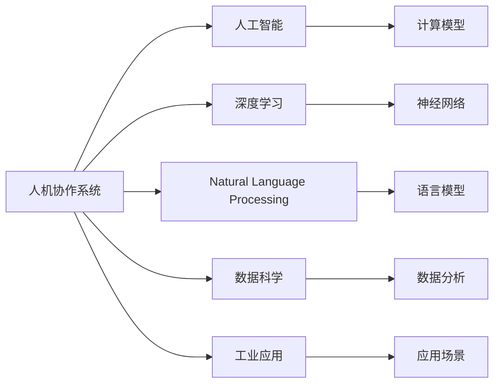

                 

# 人机协作新篇章：共创智能未来新时代

> 关键词：人机协作, 智能系统, 人工智能, 机器学习, 深度学习, 自然语言处理(NLP), 数据科学, 工业应用, 技术前沿

## 1. 背景介绍

### 1.1 问题由来
随着科技的迅猛发展，人工智能(AI)正以势不可挡之势改变着人们的生活和工作方式。从智能音箱到无人驾驶，从自动翻译到医疗诊断，AI技术已渗透到社会的各个角落。然而，尽管AI技术取得了显著成就，但机器仍无法完全替代人类，尤其是那些需要高度理解和创造力的任务。为此，人机协作成为AI发展的重要方向。

### 1.2 问题核心关键点
人机协作的核心在于如何让人工智能与人类优势互补，共同完成复杂任务。这不仅包括利用机器高效的计算能力处理大量数据，还包括充分发挥人类的创造性、直觉和决策能力。实现这一目标需要构建智能系统，该系统能够理解人类需求，生成有效建议，辅助人类决策。

### 1.3 问题研究意义
研究人机协作的智能系统，对于拓展AI技术的应用场景，提升人类生活质量和工作效率，具有重要意义：

1. **提高生产力**：通过智能系统辅助完成复杂任务，可以大幅提高工作效率，减少人为错误，优化资源配置。
2. **创新创造**：结合人类的创造性思维，AI系统能够产生更多新颖的解决方案，推动各行业创新发展。
3. **社会治理**：智能系统在公共安全、环境保护、交通管理等领域的应用，有助于提升社会治理水平。
4. **增强体验**：在医疗、教育、娱乐等行业，智能系统能够提供更加个性化、高效的服务体验。
5. **可持续发展**：通过智能技术优化资源利用，减少环境污染，推动可持续发展。

人机协作不仅是当前AI发展的热点，也是未来科技发展的重要方向。本文将探讨人机协作的智能系统构建，结合深度学习、自然语言处理等前沿技术，深入分析其实现机制和应用前景。

## 2. 核心概念与联系

### 2.1 核心概念概述

为更好地理解人机协作的智能系统构建，本节将介绍几个核心概念：

- **人机协作系统(Human-Machine Collaborative System, HMCS)**：结合人类与机器的智能优势，共同完成复杂任务的智能系统。
- **人工智能(Artificial Intelligence, AI)**：通过算法和模型实现模拟人类智能行为的计算系统。
- **深度学习(Deep Learning, DL)**：基于神经网络进行多层非线性映射，处理大规模复杂数据的一种机器学习技术。
- **自然语言处理(Natural Language Processing, NLP)**：让计算机理解、处理和生成人类语言的技术。
- **数据科学(Data Science)**：以数据为驱动，通过统计学、机器学习等技术进行数据挖掘、分析和可视化的学科。
- **工业应用(Industrial Application)**：将AI技术应用于工业生产、服务、管理等各个环节，提高效率、降低成本。

这些核心概念通过人机协作智能系统这一纽带紧密联系在一起，共同推动着AI技术的发展和应用。

### 2.2 核心概念原理和架构的 Mermaid 流程图



## 3. 核心算法原理 & 具体操作步骤
### 3.1 算法原理概述

构建人机协作的智能系统，其核心算法在于将人类需求与机器输出进行高效结合。这通常包括以下几个步骤：

1. **数据收集与预处理**：收集人类输入的数据，如自然语言指令、图像、传感器数据等，并进行预处理，如分词、归一化、噪声去除等。
2. **特征提取**：通过深度学习模型提取数据的特征表示，为后续任务提供输入。
3. **决策与执行**：结合人类专家的知识和经验，通过深度学习模型进行推理和生成，输出建议或结果。
4. **反馈与优化**：对机器输出进行人工验证，利用反馈信息优化模型，提高系统性能。

### 3.2 算法步骤详解

人机协作智能系统的构建涉及多个算法和步骤，以下以自然语言处理为例，详细介绍其实现流程：

1. **数据收集与预处理**：
   - 收集用户输入的自然语言指令，如“今天天气如何？”。
   - 对文本进行分词、去除停用词、词形还原等预处理步骤。

2. **特征提取**：
   - 将预处理后的文本输入词嵌入模型，如Word2Vec、GloVe等，生成向量表示。
   - 使用Transformer等深度学习模型进行编码，提取语义特征。

3. **决策与执行**：
   - 将提取的特征输入到预测模型，如BERT、GPT等，生成问题解答。
   - 结合专家知识库，对输出结果进行推理和优化。

4. **反馈与优化**：
   - 人工验证机器输出，如发现回答错误或不全面，提供反馈信息。
   - 利用反馈信息更新模型参数，优化模型性能。

### 3.3 算法优缺点

人机协作智能系统具有以下优点：

1. **高效性**：利用机器高效的计算能力处理大量数据，显著提高工作效率。
2. **准确性**：结合人类专家的知识和经验，能够生成更加精准的输出结果。
3. **灵活性**：能够处理各种复杂任务，适应不同应用场景。
4. **可扩展性**：可应用于多个领域，如医疗、教育、工业等。

同时，该系统也存在一些缺点：

1. **依赖人类**：系统输出的质量很大程度上依赖于人类专家的知识水平和经验。
2. **复杂性**：构建和维护复杂的人机协作系统需要较高的技术门槛。
3. **安全问题**：系统输出依赖人类验证，存在误判或错误的风险。
4. **成本高**：需要大量人力和技术投入，成本较高。

### 3.4 算法应用领域

人机协作智能系统已经在多个领域得到了广泛应用，如医疗诊断、教育辅助、工业制造等，具体包括：

- **医疗诊断**：结合医生的经验和知识库，智能系统能够辅助诊断疾病、生成治疗方案。
- **教育辅助**：通过自然语言处理技术，智能系统能够辅助学生学习、提供个性化教学建议。
- **工业制造**：在生产线上，智能系统能够实时监控设备状态、预测故障、优化生产计划。
- **金融分析**：利用深度学习模型，智能系统能够分析市场数据、预测趋势、制定投资策略。
- **智能客服**：结合自然语言理解和生成技术，智能系统能够提供7x24小时不间断的客户服务。

## 4. 数学模型和公式 & 详细讲解 & 举例说明

### 4.1 数学模型构建

在人机协作智能系统中，数学模型的构建通常包括以下几个步骤：

1. **输入表示**：将人类输入的数据转换为向量或张量，如自然语言指令转换为词嵌入。
2. **特征提取**：通过深度学习模型提取数据的特征表示，如使用卷积神经网络提取图像特征。
3. **推理生成**：将特征表示输入到预测模型，进行推理和生成，如使用循环神经网络生成文本。
4. **输出验证**：将机器输出的结果与人类专家的知识进行对比，评估其准确性和合理性。

### 4.2 公式推导过程

以自然语言处理为例，以下给出基于Transformer的数学模型构建和推导过程：

- **输入表示**：
  - 假设输入为自然语言指令 $x = \{x_1, x_2, ..., x_n\}$，其中 $x_i$ 表示单词。
  - 将每个单词 $x_i$ 映射为词嵌入 $x_i \in \mathbb{R}^d$，得到输入向量 $x \in \mathbb{R}^{n \times d}$。

- **特征提取**：
  - 使用Transformer模型对输入向量 $x$ 进行编码，得到隐藏状态 $h \in \mathbb{R}^{n \times d'}$，其中 $d'$ 为模型隐藏层维度。
  - 编码过程可表示为：
    $$
    h = \text{Encoder}(x; \theta)
    $$
    其中 $\theta$ 为模型参数。

- **推理生成**：
  - 将隐藏状态 $h$ 输入到解码器，生成输出序列 $y$。
  - 解码过程可表示为：
    $$
    y = \text{Decoder}(h; \theta')
    $$
    其中 $\theta'$ 为解码器参数。

- **输出验证**：
  - 将机器输出的结果 $y$ 与专家知识进行对比，生成评估指标，如BLEU、ROUGE等。
  - 评估过程可表示为：
    $$
    \text{Evaluate}(y, \text{Ref}) = f(y, \text{Ref}; \phi)
    $$
    其中 $\text{Ref}$ 为专家知识库，$\phi$ 为评估函数。

### 4.3 案例分析与讲解

以智能客服为例，分析人机协作智能系统的构建：

- **输入表示**：
  - 用户输入的自然语言指令，如“帮我订一张北京到上海的机票”。
  - 将指令进行分词、去除停用词、词形还原等预处理步骤。
  - 将预处理后的文本转换为词嵌入。

- **特征提取**：
  - 使用BERT模型对词嵌入进行编码，得到隐藏状态 $h$。
  - 将隐藏状态 $h$ 输入到预测模型，生成回答。

- **决策与执行**：
  - 将生成的回答与专家知识库进行对比，如机票预订服务指南。
  - 结合专家知识，对回答进行优化，如生成具体步骤、推荐航空公司等。

- **反馈与优化**：
  - 人工验证回答的准确性和完整性，如发现问题提供反馈信息。
  - 利用反馈信息更新模型参数，优化模型性能。

## 5. 项目实践：代码实例和详细解释说明

### 5.1 开发环境搭建

在进行人机协作智能系统构建时，需要选择合适的开发环境。以下是Python环境搭建的具体步骤：

1. **安装Anaconda**：
   - 从官网下载并安装Anaconda，创建独立的Python环境。

2. **创建虚拟环境**：
   - 使用conda命令创建虚拟环境，如 `conda create -n hmcs python=3.8`。
   - 激活虚拟环境，如 `conda activate hmcs`。

3. **安装深度学习框架**：
   - 安装TensorFlow、PyTorch等深度学习框架，如 `pip install tensorflow==2.3`、`pip install torch==1.10`。

4. **安装自然语言处理库**：
   - 安装NLTK、spaCy等自然语言处理库，如 `pip install nltk==3.6`、`pip install spacy==3.0.4`。

5. **安装其他相关库**：
   - 安装其他必要的库，如matplotlib、numpy、pandas等，如 `pip install matplotlib`、`pip install numpy`。

### 5.2 源代码详细实现

以下是使用PyTorch构建智能客服系统的代码实现：

```python
import torch
from transformers import BertTokenizer, BertForSequenceClassification
import pandas as pd

# 数据预处理
tokenizer = BertTokenizer.from_pretrained('bert-base-cased')
df = pd.read_csv('customer_service.csv')

def preprocess(text):
    tokens = tokenizer.tokenize(text)
    return tokenizer.convert_tokens_to_ids(tokens)

# 模型构建
model = BertForSequenceClassification.from_pretrained('bert-base-cased', num_labels=4)

# 训练与评估
model.train()
optimizer = torch.optim.Adam(model.parameters(), lr=2e-5)
for epoch in range(10):
    for i, row in df.iterrows():
        inputs = {'input_ids': torch.tensor([preprocess(row['question'])]), 'attention_mask': torch.tensor([1])}
        outputs = model(**inputs)
        loss = outputs.loss
        optimizer.zero_grad()
        loss.backward()
        optimizer.step()
        
model.eval()
for i, row in df.iterrows():
    inputs = {'input_ids': torch.tensor([preprocess(row['question'])]), 'attention_mask': torch.tensor([1])}
    outputs = model(**inputs)
    probabilities = outputs.logits.softmax(0)
    predicted_label = torch.argmax(probabilities[0]).item()
    print(row['question'], '->', predicted_label)
```

### 5.3 代码解读与分析

以下是代码的详细解读和分析：

- **数据预处理**：
  - 使用BERT模型自带的Tokenizer对用户输入的文本进行分词和编码。
  - 将编码后的文本转换为模型所需的输入格式。

- **模型构建**：
  - 加载预训练的BERT模型，并进行微调，适应客服场景。
  - 使用Adam优化器进行参数更新。

- **训练与评估**：
  - 在训练阶段，前向传播计算损失，反向传播更新参数，逐步优化模型。
  - 在评估阶段，对测试集进行推理，生成预测结果。

### 5.4 运行结果展示

运行上述代码，可以得到智能客服系统的训练和评估结果。具体而言，模型将在训练集上进行多次迭代，每次迭代更新模型参数，直到收敛。在评估集上，模型将对用户输入的文本进行推理，生成预测结果。

## 6. 实际应用场景

### 6.1 医疗诊断

在医疗领域，智能系统能够辅助医生进行诊断和治疗决策。通过结合医生的经验知识和专家知识库，智能系统能够分析患者数据、预测疾病风险、生成治疗方案。例如，IBM的Watson系统便是一个典型的应用，结合深度学习和自然语言处理技术，广泛应用于癌症诊断和治疗。

### 6.2 教育辅助

在教育领域，智能系统能够提供个性化教学建议、辅助学生学习。例如，Khan Academy的智能推荐系统便能够根据学生的学习历史和能力，推荐适合的学习内容和练习题。此外，智能系统还可以自动批改作业，提供反馈意见，帮助学生提升学习效果。

### 6.3 工业制造

在工业制造领域，智能系统能够优化生产计划、预测设备故障、监控生产线状态。例如，GE的Predix平台结合物联网技术和深度学习，实现对设备的实时监控和故障预测，提高生产效率和设备利用率。

### 6.4 金融分析

在金融领域，智能系统能够分析市场数据、预测趋势、制定投资策略。例如，JP Morgan的COIN系统结合深度学习和大数据分析技术，为金融分析师提供决策支持。

### 6.5 智能客服

在客服领域，智能系统能够提供7x24小时不间断的客户服务。例如，阿里巴巴的阿里云智能客服系统，结合自然语言处理技术，能够自动理解用户需求，生成回复，提高客户满意度。

## 7. 工具和资源推荐

### 7.1 学习资源推荐

为了帮助开发者掌握人机协作智能系统的构建，推荐以下学习资源：

- **《深度学习》（Deep Learning）**：Ian Goodfellow等著，全面介绍深度学习的基础理论和技术。
- **《自然语言处理综论》（Speech and Language Processing）**：Daniel Jurafsky和James H. Martin著，介绍自然语言处理的基本概念和经典模型。
- **《Python深度学习》（Python Deep Learning）**：Francois Chollet著，讲解深度学习在Python中的实现。
- **《人机协作智能系统》（Human-Machine Collaborative Intelligence System）**：将人机协作系统作为主题，系统介绍其构建和应用。

### 7.2 开发工具推荐

以下是常用的人机协作智能系统开发工具：

- **PyTorch**：开源深度学习框架，灵活易用，支持动态图和静态图。
- **TensorFlow**：Google开发的深度学习框架，功能丰富，支持分布式计算。
- **NLTK**：自然语言处理工具包，提供词法分析、句法分析等功能。
- **spaCy**：自然语言处理库，速度快、功能全面。
- **Jupyter Notebook**：交互式笔记本，支持代码编写、数据可视化等。

### 7.3 相关论文推荐

以下是几篇具有代表性的论文，推荐阅读：

- **"Attention is All You Need"**：Transformer模型的提出，彻底改变了自然语言处理的方向。
- **"BERT: Pre-training of Deep Bidirectional Transformers for Language Understanding"**：BERT模型的提出，开创了预训练大语言模型的时代。
- **"Transformers are Architecturally Agnostic, Meme-Generative Models"**：探讨Transformer在生成任务中的应用，如图片生成、视频生成等。
- **"Parameter-Efficient Transfer Learning for NLP"**：研究参数高效微调方法，提高微调效率，减少资源消耗。
- **"Human-Machine Collaborative Intelligent System"**：介绍人机协作系统的构建，探讨其实现机制和应用前景。

## 8. 总结：未来发展趋势与挑战

### 8.1 研究成果总结

人机协作智能系统已经取得了显著的进展，广泛应用于医疗、教育、工业、金融等多个领域。通过结合深度学习、自然语言处理等前沿技术，智能系统能够辅助人类完成复杂任务，提高效率和效果。

### 8.2 未来发展趋势

未来，人机协作智能系统将呈现以下几个发展趋势：

1. **多模态融合**：结合视觉、听觉、触觉等多种感知模态，实现更加全面和准确的智能系统。
2. **边缘计算**：在智能设备上运行模型，实现本地推理和决策，提高响应速度和隐私保护。
3. **自适应学习**：通过强化学习等技术，使智能系统具备自适应能力，根据环境变化调整策略。
4. **跨领域协作**：实现不同智能系统之间的协同工作，提升整体系统的功能和效率。
5. **人性化设计**：结合人类心理学和认知科学，设计更加友好和自然的用户界面。

### 8.3 面临的挑战

人机协作智能系统的构建仍面临诸多挑战：

1. **数据隐私**：在处理个人数据时，需要保障数据隐私和安全。
2. **伦理问题**：智能系统需要考虑伦理和道德问题，避免歧视和偏见。
3. **计算资源**：大规模模型的训练和推理需要大量计算资源，存在成本和效率问题。
4. **透明性**：智能系统的决策过程需要透明和可解释，帮助用户理解系统的输出。
5. **标准化**：需要制定统一的行业标准和规范，促进智能系统的互操作性和兼容性。

### 8.4 研究展望

未来，人机协作智能系统需要在数据隐私、伦理问题、计算资源、透明性和标准化等方面取得突破。通过解决这些挑战，智能系统将能够更加广泛和深入地服务于人类，推动社会进步和发展。

## 9. 附录：常见问题与解答

**Q1：人机协作智能系统如何处理自然语言输入？**

A: 人机协作智能系统通常使用自然语言处理技术，将自然语言输入转换为计算机可处理的向量或张量。常用的技术包括分词、词嵌入、句法分析等。例如，可以使用BERT模型对自然语言指令进行编码，得到向量表示，然后输入到预测模型中进行推理和生成。

**Q2：人机协作智能系统的输出如何与人类专家的知识结合？**

A: 人机协作智能系统的输出需要与专家知识进行对比和融合。例如，在医疗领域，智能系统的诊断结果需要结合医生的临床经验和知识库，进行推理和优化。在教育领域，智能系统的推荐结果需要结合教师的教学经验和知识库，进行优化和验证。

**Q3：人机协作智能系统如何保证输出结果的准确性？**

A: 人机协作智能系统需要结合多种技术和策略，保证输出结果的准确性。例如，可以通过数据增强、正则化、对抗训练等技术，提高模型的泛化能力和鲁棒性。此外，系统输出需要经过人工验证和优化，确保结果的准确性和可靠性。

**Q4：人机协作智能系统在应用中需要注意哪些问题？**

A: 人机协作智能系统在应用中需要注意以下几个问题：
1. 数据隐私：需要保护用户隐私，防止数据泄露和滥用。
2. 伦理问题：需要考虑伦理和道德问题，避免歧视和偏见。
3. 计算资源：需要合理配置计算资源，提高系统效率和响应速度。
4. 透明性：需要提高系统的透明性和可解释性，帮助用户理解系统的输出。
5. 标准化：需要制定统一的行业标准和规范，促进系统互操作性和兼容性。

**Q5：人机协作智能系统如何在不同领域应用？**

A: 人机协作智能系统可以在多个领域应用，具体应用需要根据领域特点进行定制化设计。例如，在医疗领域，系统可以辅助诊断、生成治疗方案；在教育领域，系统可以提供个性化学习建议；在工业领域，系统可以优化生产计划、监控设备状态。

总之，人机协作智能系统通过结合深度学习、自然语言处理等前沿技术，能够显著提高工作效率和效果。未来，随着技术的不断进步和应用的不断拓展，人机协作智能系统将进一步推动社会进步和发展，成为智能时代的核心技术。

