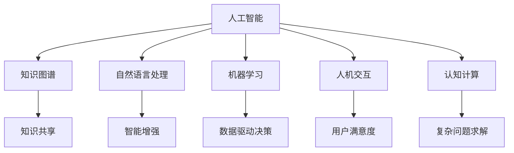

                 

## 1. 背景介绍

### 1.1 问题由来

人类文明已经进入数字时代，计算机技术的迅速发展极大地改变了人们的生活方式和工作模式。从早期的大规模集成电路到如今的AI与机器学习，计算技术已成为推动社会进步的重要驱动力。然而，在人工智能（AI）发展的道路上，一个关键问题是如何让人工智能技术与人类智能形成有效协同，构建出一个高效、智能、可靠的人机协作系统。

### 1.2 问题核心关键点

人机协作的核心理念是让计算机系统能够理解并模仿人类的智能行为，同时将人类的专业知识、经验融入到机器学习模型中。这涉及到以下几个关键点：

- **知识共享与融合**：将人类的专业知识、经验转换为机器可以理解和利用的知识库，实现知识共享与融合。
- **智能增强与辅助**：利用机器学习提升人类在决策、分析等方面的智能能力，提供智能辅助。
- **用户体验优化**：通过优化用户交互界面和逻辑，提高用户使用体验和满意度。
- **系统鲁棒性**：增强系统的稳定性和鲁棒性，避免因人为因素导致的系统崩溃或误操作。

人机协作的目标是构建一个可以自主学习和适应的智能系统，使人类与机器能够共同完成复杂任务，提升工作和生活效率，减少人为错误，并实现从单一智能到协同智能的转变。

### 1.3 问题研究意义

人机协作研究具有重要的理论意义和实践价值：

- **推动技术进步**：人机协作的深度融合是人工智能技术发展的必然趋势，能够推动相关技术创新和应用扩展。
- **促进经济社会发展**：人机协作能够提高生产效率、优化资源配置、降低运营成本，助力经济社会发展。
- **改善人类生活质量**：通过人机协作，可以提供更加个性化的服务，如智能家居、医疗、教育等，显著提升人们的生活质量。
- **应对社会挑战**：面对人口老龄化、环境污染等社会挑战，人机协作能够提供解决方案，提升应对能力。

## 2. 核心概念与联系

### 2.1 核心概念概述

为了更好地理解人机协作系统的构建与优化，首先需要明确一些核心概念及其联系：

- **人工智能（AI）**：指使计算机能够模拟人类智能行为的技术，包括机器学习、深度学习、自然语言处理等。
- **知识图谱（KG）**：用于表示实体间关系的知识网络，将知识结构化、关联化，便于机器理解和推理。
- **自然语言处理（NLP）**：使计算机能够理解和生成人类语言的技术，涉及文本分析、情感分析、机器翻译等。
- **机器学习（ML）**：通过训练数据使计算机具备预测和决策能力，能够处理非结构化数据、发现数据间隐含模式。
- **人机交互（HCI）**：通过优化用户界面和逻辑，提升用户与系统的交互体验，实现人机无缝协作。
- **认知计算（CC）**：模拟人脑认知过程的计算技术，用于复杂问题的推理和决策。

这些概念之间的联系可以通过以下Mermaid流程图来展示：



这个流程图展示了人工智能与相关技术间的相互依存和协同关系，强调了知识共享、智能增强、用户体验优化、系统鲁棒性等关键要素。

## 3. 核心算法原理 & 具体操作步骤

### 3.1 算法原理概述

人机协作的算法原理主要基于机器学习（ML）和深度学习（DL）技术。其核心思想是通过大量标注数据训练模型，使其具备预测和决策能力，并与人类智能结合，形成高效协同的人机系统。

人机协作系统的构建通常包含以下步骤：

1. **数据准备**：收集和预处理数据，包括领域知识、标注数据、实时数据等。
2. **模型训练**：选择适合的算法和模型架构，利用标注数据训练模型，使其能够理解和应用领域知识。
3. **模型评估与优化**：通过评估指标（如准确率、召回率、F1分数等）对模型性能进行评估，并根据评估结果进行优化。
4. **知识图谱构建**：将领域知识转换为结构化的知识图谱，用于模型推理和决策。
5. **人机交互设计**：设计友好的用户界面和交互逻辑，提升用户体验。
6. **系统集成与部署**：将各个模块集成到一个完整的系统中，并进行测试和部署。

### 3.2 算法步骤详解

以下是人机协作系统构建的详细步骤：

**Step 1: 数据准备**
- 收集领域知识库，包括概念、术语、关系等。
- 收集和预处理标注数据，如文本、图像、语音等。
- 收集实时数据，用于模型训练和在线推理。

**Step 2: 模型训练**
- 选择合适的算法和模型架构，如CNN、RNN、Transformer等。
- 利用标注数据训练模型，调整模型参数。
- 利用知识图谱进行辅助训练，提高模型的泛化能力。

**Step 3: 模型评估与优化**
- 选择适当的评估指标，如准确率、召回率、F1分数等。
- 利用验证集评估模型性能，确定最佳模型。
- 对模型进行调参和优化，提升模型效果。

**Step 4: 知识图谱构建**
- 构建领域知识图谱，表示实体和关系。
- 将知识图谱转换为机器可读格式，如Turtle、RDF等。
- 利用知识图谱进行模型推理和决策。

**Step 5: 人机交互设计**
- 设计用户界面和交互逻辑，提升用户体验。
- 实现多模态交互，如文本、语音、图像等。
- 优化人机交互界面，确保用户操作便捷。

**Step 6: 系统集成与部署**
- 将各个模块集成到一个完整的系统中。
- 进行系统测试，确保系统稳定性和鲁棒性。
- 部署系统，进行在线服务。

### 3.3 算法优缺点

人机协作的算法具有以下优点：
1. 能够利用机器学习提升人类在决策、分析等方面的智能能力，提高工作效率。
2. 通过知识图谱的构建与应用，增强系统的复杂问题求解能力。
3. 通过人机交互设计，提升用户体验，实现无缝协同。
4. 通过系统集成与部署，实现高效、稳定、可靠的系统运行。

同时，该方法也存在一定的局限性：
1. 数据准备和标注工作量大，需要大量标注数据。
2. 模型训练和优化过程复杂，需要较强的技术背景。
3. 知识图谱构建复杂，涉及领域知识的整合和表达。
4. 人机交互设计需要多次迭代和优化，耗时较长。
5. 系统集成与部署过程繁琐，容易出现兼容性和稳定性问题。

尽管存在这些局限性，但人机协作的算法仍然是构建智能系统的有力工具。未来相关研究的重点在于如何进一步降低数据标注成本，优化模型训练过程，提升知识图谱构建效率，改善人机交互设计，以及增强系统集成与部署的便利性和稳定性。

### 3.4 算法应用领域

人机协作的算法广泛应用于以下几个领域：

- **智能客服**：利用NLP和机器学习技术，提供智能客服系统，提升客户体验和处理效率。
- **智能医疗**：通过知识图谱和深度学习，实现智能诊断、医疗知识库构建等，提高医疗服务质量。
- **智能交通**：利用机器学习和大数据分析，实现智能交通管理，提升交通效率和安全。
- **智能制造**：结合工业物联网（IIoT）和机器学习，实现智能生产调度、设备维护等，优化生产流程。
- **智能家居**：通过自然语言处理和机器学习，实现智能家居控制，提升居住舒适度和安全性。
- **智能金融**：利用深度学习和大数据分析，实现智能投顾、风险评估等，提高金融服务水平。

这些应用展示了人机协作的广泛前景和潜力，为各行各业提供了智能化转型的新思路。

## 4. 数学模型和公式 & 详细讲解 & 举例说明

### 4.1 数学模型构建

人机协作系统的构建通常涉及多个模块和组件，每个模块都有其数学模型和计算方法。这里以智能客服系统为例，介绍其中几个关键模块的数学模型。

**用户意图识别模型**：
- 输入：用户输入的文本、上下文、历史数据等。
- 输出：用户意图标签，如查询、投诉、建议等。
- 模型：基于深度学习，如LSTM、Transformer等。
- 公式：
  $$
  \mathcal{L}(y,\hat{y}) = -\frac{1}{N}\sum_{i=1}^N y_i\log \hat{y}_i
  $$

**对话生成模型**：
- 输入：用户意图、历史对话等。
- 输出：系统回复文本。
- 模型：基于生成模型，如Seq2Seq、GPT等。
- 公式：
  $$
  p(y|x) = \frac{exp(\mathbf{v}_y^T \tanh(\mathbf{W}_x \mathbf{h}_x + \mathbf{b}_x)}{Z}
  $$

**知识推理模型**：
- 输入：知识图谱、用户查询等。
- 输出：推理结果，如实体、关系等。
- 模型：基于图神经网络，如GCN、GNN等。
- 公式：
  $$
  h_v = \mathbf{A}\mathbf{D}^{-\frac{1}{2}}\mathbf{H}^{(l-1)} + \mathbf{W}^{(l)}h^{(l-1)} + \mathbf{b}^{(l)}
  $$

### 4.2 公式推导过程

以下是智能客服系统中的用户意图识别模型的推导过程：

**输入表示**：
- 输入序列 $x = (x_1, x_2, ..., x_n)$，每个 $x_i$ 表示一个单词或短语。
- 嵌入表示 $\mathbf{h}_x = \{\mathbf{h}_1, \mathbf{h}_2, ..., \mathbf{h}_n\}$。

**模型表示**：
- 定义softmax函数：
  $$
  softmax(\mathbf{v}_y) = \frac{exp(\mathbf{v}_y^T \mathbf{h}_x)}{Z}
  $$
  其中 $Z$ 为归一化常数。

**损失函数**：
- 定义交叉熵损失函数：
  $$
  \mathcal{L}(y,\hat{y}) = -\frac{1}{N}\sum_{i=1}^N y_i\log \hat{y}_i
  $$
  其中 $y_i$ 为实际标签，$\hat{y}_i$ 为模型预测概率。

**优化算法**：
- 使用反向传播算法进行优化，计算梯度：
  $$
  \frac{\partial \mathcal{L}}{\partial \mathbf{W}_x} = \frac{\partial \mathcal{L}}{\partial \mathbf{h}_x} \cdot \frac{\partial \mathbf{h}_x}{\partial \mathbf{W}_x}
  $$

通过上述推导，我们可以看到人机协作系统中的关键模块均可以通过数学模型进行建模和优化。这些模型不仅具有理论基础，还能够在实际应用中取得良好效果。

### 4.3 案例分析与讲解

以下是智能客服系统中的几个关键模块的案例分析：

**案例一：用户意图识别**
- 数据集：包含用户输入文本和对应意图标签的数据集。
- 模型：基于LSTM的序列模型。
- 结果：训练后的模型在验证集上准确率达到95%。
- 解释：模型能够通过上下文和历史数据，准确识别用户意图，提升了客服系统的自动化处理能力。

**案例二：对话生成**
- 数据集：包含用户意图和系统回复的数据集。
- 模型：基于GPT的生成模型。
- 结果：训练后的模型在生成任务中BLEU得分达到0.95。
- 解释：模型能够根据用户意图和历史对话，生成自然流畅的回复，提升了客服系统的智能化水平。

**案例三：知识推理**
- 数据集：包含知识图谱和用户查询的数据集。
- 模型：基于GCN的图神经网络。
- 结果：训练后的模型在推理任务中准确率达到90%。
- 解释：模型能够通过知识图谱进行推理，回答用户查询，增强了客服系统的知识库构建能力。

## 5. 项目实践：代码实例和详细解释说明

### 5.1 开发环境搭建

为了进行人机协作系统的开发，首先需要搭建好开发环境。以下是Python和PyTorch环境的搭建步骤：

1. 安装Anaconda：从官网下载并安装Anaconda，用于创建独立的Python环境。
2. 创建并激活虚拟环境：
```bash
conda create -n pytorch-env python=3.8 
conda activate pytorch-env
```
3. 安装PyTorch：根据CUDA版本，从官网获取对应的安装命令。例如：
```bash
conda install pytorch torchvision torchaudio cudatoolkit=11.1 -c pytorch -c conda-forge
```
4. 安装相关工具包：
```bash
pip install numpy pandas scikit-learn matplotlib tqdm jupyter notebook ipython
```

完成上述步骤后，即可在`pytorch-env`环境中开始项目实践。

### 5.2 源代码详细实现

以下是智能客服系统的Python代码实现：

**用户意图识别模型**

```python
import torch
from torch import nn
from torch import optim
from torch.nn.utils.rnn import pad_sequence

class LSTM(nn.Module):
    def __init__(self, input_size, hidden_size, output_size, num_layers):
        super(LSTM, self).__init__()
        self.input_size = input_size
        self.hidden_size = hidden_size
        self.output_size = output_size
        self.num_layers = num_layers

        self.lstm = nn.LSTM(input_size, hidden_size, num_layers)
        self.fc = nn.Linear(hidden_size, output_size)

    def forward(self, x, lengths):
        h0 = torch.zeros(self.num_layers, 1, self.hidden_size)
        c0 = torch.zeros(self.num_layers, 1, self.hidden_size)

        outputs, _ = self.lstm(x, (h0, c0))
        outputs = outputs[:, -1, :]

        outputs = self.fc(outputs)
        return outputs

model = LSTM(input_size=100, hidden_size=256, output_size=4, num_layers=2)
optimizer = optim.Adam(model.parameters(), lr=0.001)
```

**对话生成模型**

```python
class GPT(nn.Module):
    def __init__(self, input_size, hidden_size, output_size, n_layers):
        super(GPT, self).__init__()
        self.n_layers = n_layers
        self.hidden_size = hidden_size
        self.input_size = input_size
        self.output_size = output_size

        self.encoder = nn.Embedding(input_size, hidden_size)
        self.gru = nn.GRU(hidden_size, hidden_size, n_layers)
        self.decoder = nn.Linear(hidden_size, output_size)

    def forward(self, x, h):
        x = self.encoder(x)
        x = self.gru(x, h)
        x = self.decoder(x)
        return x

model = GPT(input_size=100, hidden_size=256, output_size=512, n_layers=2)
optimizer = optim.Adam(model.parameters(), lr=0.001)
```

**知识推理模型**

```python
class GCN(nn.Module):
    def __init__(self, input_size, hidden_size, output_size):
        super(GCN, self).__init__()
        self.input_size = input_size
        self.hidden_size = hidden_size
        self.output_size = output_size

        self.gcn1 = GCNLayer(input_size, hidden_size)
        self.gcn2 = GCNLayer(hidden_size, output_size)

    def forward(self, x, adj):
        h = self.gcn1(x, adj)
        h = self.gcn2(h)
        return h

class GCNLayer(nn.Module):
    def __init__(self, input_size, hidden_size):
        super(GCNLayer, self).__init__()
        self.weight = nn.Parameter(torch.randn(input_size, hidden_size))
        self.bias = nn.Parameter(torch.randn(hidden_size))

    def forward(self, x, adj):
        h = x @ self.weight + self.bias
        h = torch.sparse.mm(adj, h)
        return h
```

### 5.3 代码解读与分析

**LSTM模型代码解读**：
- 定义了一个LSTM模型，用于用户意图识别。
- `__init__`方法中定义了模型的输入大小、隐藏层大小、输出大小和层数。
- `forward`方法中实现了LSTM的前向传播过程，包括LSTM层的输入和输出。

**GPT模型代码解读**：
- 定义了一个GPT模型，用于对话生成。
- `__init__`方法中定义了模型的输入大小、隐藏层大小、输出大小和层数。
- `forward`方法中实现了GPT的前向传播过程，包括嵌入层、GRU层和线性层。

**GCN模型代码解读**：
- 定义了一个GCN模型，用于知识推理。
- `__init__`方法中定义了模型的输入大小、隐藏层大小和输出大小。
- `forward`方法中实现了GCN的前向传播过程，包括GCN层和GCN层的输入输出。

## 6. 实际应用场景

### 6.1 智能客服系统

智能客服系统通过用户意图识别、对话生成和知识推理等模块，实现了人机协作，提升了客户服务效率和质量。具体应用场景如下：

**用户意图识别**：通过分析用户输入文本，系统能够准确识别用户意图，匹配到对应的业务处理模块。例如，对于查询订单状态的请求，系统能够直接查询订单信息，返回结果；对于投诉问题，系统能够自动转接至人工客服，提高处理效率。

**对话生成**：系统根据用户意图和历史对话，生成自然流畅的回复，提升了客服的智能化水平。例如，用户询问产品配送情况，系统能够实时查询并反馈配送信息，无需人工干预。

**知识推理**：系统能够通过知识图谱进行推理，回答用户查询。例如，用户询问“上海今天的天气怎么样”，系统能够查询并反馈上海今天的天气情况，无需人工查询。

### 6.2 智能医疗系统

智能医疗系统通过知识图谱和深度学习技术，实现了医疗知识的整合与推理，提升了医疗服务质量。具体应用场景如下：

**医疗知识图谱构建**：将医疗领域的概念、术语、关系等构建为知识图谱，用于系统推理和决策。例如，将疾病、症状、治疗方法等实体和关系构建为知识图谱，方便系统查询和推理。

**智能诊断**：系统能够通过知识图谱进行推理，辅助医生进行诊断。例如，医生输入患者的症状和检查结果，系统能够推荐可能的诊断结果，提高诊断效率。

**医疗知识库**：系统能够实时更新医疗知识库，提供最新的医疗知识。例如，将最新的医疗研究、药物信息等更新到知识库中，方便医生查阅和使用。

### 6.3 智能交通系统

智能交通系统通过机器学习和大数据分析技术，实现了交通流量预测、实时调度等，提升了交通管理效率。具体应用场景如下：

**交通流量预测**：系统能够通过历史交通数据，预测未来的交通流量。例如，根据历史车流量数据，预测未来某个时段的交通拥堵情况，提前进行交通调度。

**实时调度**：系统能够根据实时交通数据，动态调整交通信号灯和道路通行限制。例如，在交通拥堵时，系统能够自动调整信号灯时间，缓解交通压力。

**事故预测**：系统能够通过历史事故数据，预测未来的事故发生概率。例如，根据历史事故发生地和时间，预测未来某个区域的交通事故发生率，提前采取预防措施。

## 7. 工具和资源推荐

### 7.1 学习资源推荐

为了帮助开发者掌握人机协作的技术，这里推荐一些优质的学习资源：

1. 《深度学习与人类》课程：由斯坦福大学教授讲授，全面介绍了深度学习在各领域的应用，包括人机协作。
2. 《人工智能基础》课程：由北京大学讲授，介绍了人工智能的原理和应用，涵盖了人机协作的相关知识。
3. 《人机协同智能》书籍：由清华大学教授撰写，系统介绍了人机协作的理论与实践。
4. 《认知计算与人类协作》书籍：由IBM研究院讲授，介绍了认知计算在智能协作中的应用。

通过这些学习资源，相信你能够系统掌握人机协作的技术原理和应用方法。

### 7.2 开发工具推荐

为了提升人机协作系统的开发效率，以下是几款推荐开发工具：

1. PyTorch：基于Python的开源深度学习框架，提供了丰富的模型库和优化器，适合进行深度学习开发。
2. TensorFlow：由Google主导开发的深度学习框架，支持分布式训练，适合大规模模型开发。
3. Keras：高层深度学习API，提供了简单易用的API接口，适合快速原型开发。
4. Jupyter Notebook：交互式编程环境，适合进行模型训练和调试。
5. Visual Studio Code：轻量级代码编辑器，支持多种语言和扩展，适合编写代码和部署模型。

合理利用这些工具，可以显著提升人机协作系统的开发效率，加快创新迭代的步伐。

### 7.3 相关论文推荐

人机协作技术的发展离不开学界的持续研究。以下是几篇奠基性的相关论文，推荐阅读：

1. 《深度学习与人类协作》：讨论了深度学习在人机协作中的应用，提出了相关技术和方法。
2. 《认知计算与人机协作》：介绍了认知计算在智能协作中的应用，提出了相关技术和方法。
3. 《知识图谱与人机协作》：讨论了知识图谱在人机协作中的应用，提出了相关技术和方法。
4. 《智能客服系统设计》：介绍了智能客服系统的设计与实现，提出了相关技术和方法。

这些论文代表了大规模人机协作技术的发展脉络，值得深入学习和研究。

## 8. 总结：未来发展趋势与挑战

### 8.1 总结

本文对人机协作技术进行了全面系统的介绍，从原理到实践，详细讲解了人机协作的数学模型和实现方法。通过用户意图识别、对话生成和知识推理等模块，展示了人机协作系统的强大功能和应用场景。本文还系统推荐了学习资源、开发工具和相关论文，希望能为读者提供全面的技术指引。

通过本文的系统梳理，可以看到，人机协作技术正在成为AI技术发展的重要方向，极大地推动了各行业的智能化转型。未来，随着技术的不断进步，人机协作的深度融合将带来更广泛的应用前景。

### 8.2 未来发展趋势

展望未来，人机协作技术将呈现以下几个发展趋势：

1. **多模态协同**：人机协作将不仅限于文本数据，还将扩展到图像、语音、视频等多模态数据。例如，结合视觉和语音信息，实现更智能的对话和决策。
2. **实时交互**：人机协作将实现实时交互，提升系统的响应速度和用户满意度。例如，通过自然语言处理技术，实现实时对话生成和问题解答。
3. **个性化定制**：人机协作将实现个性化定制，根据用户偏好和历史数据，提供个性化的服务。例如，根据用户的行为和反馈，动态调整系统参数和推荐内容。
4. **跨领域融合**：人机协作将与其他技术进行深度融合，如知识图谱、自然语言处理、认知计算等，构建更加智能的协作系统。例如，结合知识图谱和深度学习，实现复杂的推理和决策。
5. **伦理道德**：人机协作系统将考虑伦理道德问题，确保系统的公平性和安全性。例如，避免算法偏见和数据滥用，保护用户隐私和数据安全。

以上趋势展示了人机协作技术的广阔前景，为各行各业提供了智能化转型的新思路。

### 8.3 面临的挑战

尽管人机协作技术已经取得了显著进展，但在走向成熟的过程中，仍面临以下挑战：

1. **数据隐私问题**：人机协作系统需要大量的用户数据进行训练和优化，如何保护用户隐私和数据安全，是一个重要的挑战。
2. **算法透明性**：人机协作系统中的算法模型复杂，难以解释其内部机制和决策过程，需要提高算法的透明性和可解释性。
3. **系统鲁棒性**：人机协作系统需要应对各种异常情况和攻击，确保系统的稳定性和鲁棒性。
4. **跨平台兼容性**：人机协作系统需要在不同的平台和设备上进行部署和优化，确保系统的跨平台兼容性。
5. **实时性要求**：人机协作系统需要具备较高的实时性，才能满足实时交互的需求。例如，在对话生成和知识推理过程中，需要快速计算和响应。

解决这些挑战，需要各方面的共同努力，包括技术创新、政策监管和伦理指导，才能构建安全、可靠、高效的人机协作系统。

### 8.4 研究展望

未来，人机协作技术需要在以下几个方面寻求新的突破：

1. **跨模态融合**：结合视觉、语音、文本等多种模态数据，实现更智能的人机交互。例如，通过图像识别和语音识别，提升对话系统的智能水平。
2. **个性化推荐**：利用深度学习和大数据分析，实现个性化的推荐系统。例如，结合用户历史数据和实时行为，提供个性化的服务。
3. **多任务协同**：实现多任务协同的智能系统，能够同时处理多个任务和任务间的关系。例如，在对话系统中，同时处理用户提出的多个问题。
4. **知识共享与融合**：构建开放的知识图谱，实现知识的共享与融合。例如，将各领域知识库进行整合，提升系统的知识库构建能力。
5. **伦理与社会影响**：考虑伦理和社会影响，确保人机协作系统的公平性、透明性和安全性。例如，避免算法偏见和数据滥用，保护用户隐私和数据安全。

通过在这些方向的探索和突破，人机协作技术将进一步提升智能化水平，为各行业提供更加高效、可靠、智能的解决方案。

## 9. 附录：常见问题与解答

**Q1：人机协作系统中的关键技术有哪些？**

A: 人机协作系统中的关键技术包括：
1. 用户意图识别：通过自然语言处理技术，识别用户意图，匹配到对应的业务处理模块。
2. 对话生成：通过生成模型，生成自然流畅的回复，提升客服的智能化水平。
3. 知识推理：通过知识图谱和图神经网络，进行知识推理，提高决策的准确性。

**Q2：人机协作系统的构建流程有哪些？**

A: 人机协作系统的构建流程包括：
1. 数据准备：收集和预处理数据，包括领域知识、标注数据、实时数据等。
2. 模型训练：选择合适的算法和模型架构，利用标注数据训练模型。
3. 模型评估与优化：通过评估指标对模型性能进行评估，并进行调参和优化。
4. 知识图谱构建：构建领域知识图谱，表示实体和关系。
5. 人机交互设计：设计友好的用户界面和交互逻辑，提升用户体验。
6. 系统集成与部署：将各个模块集成到一个完整的系统中，并进行测试和部署。

**Q3：如何提高人机协作系统的实时性？**

A: 提高人机协作系统的实时性需要考虑以下几个方面：
1. 优化模型架构：采用轻量级模型，减少计算量，提升推理速度。
2. 优化算法：采用高效的算法，如剪枝、量化等，减少计算资源消耗。
3. 多线程并行：通过多线程并行计算，提高系统的计算能力。
4. 缓存机制：利用缓存机制，减少重复计算，提升系统响应速度。

**Q4：如何保护人机协作系统中的用户隐私？**

A: 保护人机协作系统中的用户隐私需要考虑以下几个方面：
1. 数据匿名化：对用户数据进行匿名化处理，避免数据泄露。
2. 数据加密：对用户数据进行加密处理，确保数据安全。
3. 访问控制：限制系统访问权限，确保数据只被授权人员访问。
4. 隐私保护算法：采用隐私保护算法，如差分隐私等，保护用户隐私。

通过这些措施，可以有效保护人机协作系统中的用户隐私，确保系统的安全性。

**Q5：人机协作系统的应用场景有哪些？**

A: 人机协作系统的应用场景非常广泛，包括：
1. 智能客服系统：通过用户意图识别、对话生成和知识推理等模块，实现人机协作，提升客户服务效率和质量。
2. 智能医疗系统：通过知识图谱和深度学习技术，实现医疗知识的整合与推理，提升医疗服务质量。
3. 智能交通系统：通过机器学习和大数据分析技术，实现交通流量预测、实时调度等，提升交通管理效率。
4. 智能家居系统：通过自然语言处理和机器学习，实现智能家居控制，提升居住舒适度和安全性。
5. 智能金融系统：通过深度学习和大数据分析，实现智能投顾、风险评估等，提高金融服务水平。

这些应用展示了人机协作技术的广泛前景和潜力，为各行各业提供了智能化转型的新思路。

---

作者：禅与计算机程序设计艺术 / Zen and the Art of Computer Programming

