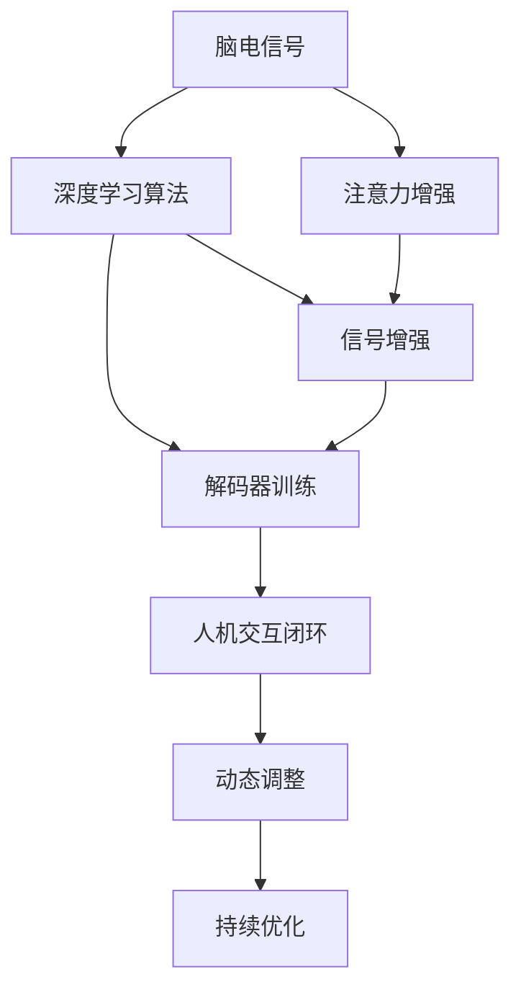

                 

# 人类注意力增强技术：未来脑机接口

> 关键词：脑机接口(Brain-Computer Interface, BCI), 注意力增强, 神经信号处理, 深度学习, 自然语言处理(NLP), 实时反馈, 神经可塑性, 人机协同

## 1. 背景介绍

### 1.1 问题由来
脑机接口（Brain-Computer Interface, BCI）技术近年来取得了显著的进步，其应用场景涵盖了医疗康复、人机交互、游戏娱乐等多个领域。尽管如此，脑机接口技术的临床应用仍面临一些重大挑战。其中，提高信号准确性、实时性、可靠性和鲁棒性是当前研究的热点和难点问题。脑机接口的核心是捕获和解读脑电信号，而如何增强人类注意力是提高脑电信号质量和解码性能的关键。

### 1.2 问题核心关键点
人类注意力增强技术主要关注如何通过训练和优化神经网络模型，引导用户集中注意力，生成更稳定、更易于解读的脑电信号。该技术的核心在于：
- 设计有效的训练策略，提升脑电信号的持续稳定性。
- 采用深度学习算法，挖掘神经信号中的高级特征。
- 构建人机交互闭环，实现实时反馈和动态调整。
- 结合神经可塑性理论，探索强化学习和自适应神经网络等方法。

### 1.3 问题研究意义
人类注意力增强技术不仅能够提升脑机接口的信号质量，还能在脑机交互、脑控游戏、智能教育等多个领域带来革命性的改变。其研究意义在于：
- 提高脑机接口的临床应用效率和效果，辅助治疗脑损伤、神经系统疾病。
- 拓展人机交互的新场景，实现更自然、更高效的交互方式。
- 探索脑认知与神经控制的新机制，推动人工智能与人类智能的融合发展。

## 2. 核心概念与联系

### 2.1 核心概念概述

脑机接口技术旨在实现脑电信号与计算机指令之间的直接交互，其基本流程包括信号采集、信号预处理、特征提取、解码器训练和反馈控制。人类注意力增强技术主要针对信号预处理和特征提取环节进行优化。

- **脑电信号**：脑电信号是由大脑皮层神经元放电引起的电位变化，用于捕捉用户的思维活动。
- **注意力增强**：通过特定的训练任务或提示，引导用户集中注意力，生成更稳定的脑电信号。
- **深度学习算法**：利用神经网络模型，自动学习脑电信号中的高级特征，实现信号的增强和解码。
- **神经可塑性**：神经网络在训练过程中的动态调整和适应能力，是其高性能表现的基础。
- **人机交互闭环**：通过实时反馈机制，动态调整用户的注意力和行为，实现系统性能的优化。

这些核心概念之间的逻辑关系可以通过以下Mermaid流程图来展示：



这个流程图展示了人类注意力增强技术在脑机接口系统中的作用，从信号采集到人机交互的全流程优化。

## 3. 核心算法原理 & 具体操作步骤
### 3.1 算法原理概述

人类注意力增强技术的核心算法原理在于利用深度学习算法，对脑电信号进行增强处理，提升信号质量，同时结合注意力任务训练，引导用户集中注意力。其基本流程如下：

1. **信号采集**：通过脑电图(EEG)设备，实时捕获用户的大脑活动信号。
2. **预处理**：对原始脑电信号进行去噪、滤波、归一化等预处理操作。
3. **特征提取**：利用深度学习模型，自动提取脑电信号中的高级特征。
4. **注意力训练**：设计特定的注意力任务，引导用户集中注意力，生成更稳定的信号。
5. **解码器训练**：使用强化学习或传统机器学习方法，训练解码器，将脑电信号解码为计算机指令或输出。
6. **实时反馈**：根据解码结果，实时反馈给用户，动态调整其注意力，实现系统优化。

### 3.2 算法步骤详解

下面将详细讲解人类注意力增强技术的算法步骤和具体操作步骤：

**Step 1: 信号采集与预处理**

- 使用脑电图(EEG)设备，实时采集用户的大脑活动信号。
- 对采集到的信号进行预处理，包括去噪、滤波、归一化等操作，减少干扰因素对信号的影响。

**Step 2: 特征提取**

- 利用深度学习模型（如卷积神经网络CNN、循环神经网络RNN、长短期记忆网络LSTM等），自动提取脑电信号中的高级特征。
- 特征提取的过程通常需要多轮训练和优化，以提高信号的准确性和鲁棒性。

**Step 3: 注意力任务设计**

- 设计特定的注意力任务，如集中注意力任务、分散注意力任务、交替注意力任务等。
- 通过任务训练，引导用户集中注意力，生成更稳定、更易于解读的脑电信号。

**Step 4: 解码器训练**

- 利用强化学习或传统机器学习方法（如SVM、随机森林等），训练解码器。
- 解码器的输入为增强后的脑电信号特征，输出为目标指令或输出。

**Step 5: 实时反馈与优化**

- 根据解码结果，实时反馈给用户，动态调整其注意力，优化系统性能。
- 通过闭环反馈机制，不断迭代训练，提升系统整体的稳定性和准确性。

### 3.3 算法优缺点

人类注意力增强技术具有以下优点：
- 提高脑电信号的稳定性和准确性，减少噪声干扰。
- 利用深度学习模型，挖掘高级神经信号特征，提升解码性能。
- 结合注意力任务训练，引导用户集中注意力，生成更稳定的信号。
- 通过实时反馈和闭环优化，实现系统动态调整，提升用户体验。

然而，该技术也存在一些缺点：
- 对用户训练要求的较高，需要长时间、系统的注意力训练。
- 对脑电信号采集设备的依赖较大，设备成本较高。
- 信号增强和解码过程复杂，需要大量计算资源和时间。
- 系统设计需要综合考虑信号、任务和解码器等多方面因素，优化难度较大。

### 3.4 算法应用领域

人类注意力增强技术已经在多个领域得到了应用：

- **医疗康复**：辅助脑损伤和神经系统疾病的康复治疗，通过脑控游戏等形式提高患者的注意力和认知能力。
- **人机交互**：实现更自然、更高效的交互方式，如脑控机器人、脑控虚拟现实游戏等。
- **智能教育**：通过脑控教育游戏等形式，提高学生的学习效率和专注度。
- **脑控游戏**：利用脑电信号控制游戏，增强游戏的沉浸感和互动性。
- **神经科学研究**：探索人类认知和神经控制的机制，推动人工智能与人类智能的融合发展。

## 4. 数学模型和公式 & 详细讲解 & 举例说明

### 4.1 数学模型构建

本节将使用数学语言对人类注意力增强技术进行更加严格的刻画。

记脑电信号为 $X$，注意力任务设计为 $T$，解码器为 $D$，优化目标为 $J$。注意力增强技术的数学模型可以表示为：

$$
J(X;T,D) = \mathbb{E}_{(X|T)}[\text{loss}(D(X),y)]
$$

其中 $\text{loss}$ 为解码器的损失函数，$y$ 为真实输出。

### 4.2 公式推导过程

以下我们将以集中注意力任务为例，推导注意力增强的损失函数及其梯度的计算公式。

记集中注意力任务为 $T_{\text{concentrate}}$，解码器为 $D_{\text{concentrate}}$。假设在集中注意力任务下，脑电信号 $X$ 的期望解码结果为 $y_{\text{concentrate}}$。则集中注意力任务的损失函数为：

$$
\ell_{\text{concentrate}}(D_{\text{concentrate}},X) = \frac{1}{N} \sum_{i=1}^N (\mathcal{L}(D_{\text{concentrate}}(X^{(i)}),y_{\text{concentrate}}))
$$

其中 $\mathcal{L}$ 为解码器的损失函数，$N$ 为样本数量。

通过反向传播，得到解码器 $D_{\text{concentrate}}$ 对脑电信号 $X$ 的梯度：

$$
\frac{\partial \ell_{\text{concentrate}}}{\partial X} = \frac{1}{N}\sum_{i=1}^N \nabla_{X}\mathcal{L}(D_{\text{concentrate}}(X^{(i)}),y_{\text{concentrate}}))
$$

### 4.3 案例分析与讲解

以基于集中注意力任务的脑控游戏为例，讲解人类注意力增强技术的具体应用。

假设游戏角色控制指令为 $y_{\text{game}}$，解码器 $D_{\text{game}}$ 的输入为脑电信号 $X$，输出为控制指令 $y_{\text{game}}$。集中注意力任务的训练过程如下：

1. **数据准备**：收集用户在游戏中的脑电信号和控制指令数据，划分为训练集和测试集。
2. **模型选择**：选择合适的深度学习模型，如卷积神经网络CNN或循环神经网络RNN。
3. **特征提取**：利用深度学习模型，自动提取脑电信号中的高级特征。
4. **训练解码器**：利用训练集，训练解码器 $D_{\text{game}}$，最小化集中注意力任务下的损失函数。
5. **测试优化**：在测试集上评估解码器的性能，根据反馈结果动态调整用户注意力，优化系统。

## 5. 项目实践：代码实例和详细解释说明
### 5.1 开发环境搭建

在进行人类注意力增强技术实践前，我们需要准备好开发环境。以下是使用Python进行TensorFlow开发的环境配置流程：

1. 安装Anaconda：从官网下载并安装Anaconda，用于创建独立的Python环境。

2. 创建并激活虚拟环境：
```bash
conda create -n attention-enhance python=3.8 
conda activate attention-enhance
```

3. 安装TensorFlow：根据CUDA版本，从官网获取对应的安装命令。例如：
```bash
conda install tensorflow==2.7 -c pytorch -c conda-forge
```

4. 安装TensorBoard：用于可视化训练过程，展示模型性能指标。
```bash
pip install tensorboard
```

5. 安装相关的深度学习库和工具：
```bash
pip install keras tensorflow-models tftables netron
```

完成上述步骤后，即可在`attention-enhance`环境中开始注意力增强技术的实践。

### 5.2 源代码详细实现

下面我们以基于卷积神经网络的集中注意力任务为例，给出使用TensorFlow进行注意力增强的代码实现。

首先，定义集中注意力任务的训练数据集：

```python
import tensorflow as tf
import numpy as np
from tensorflow.keras import datasets, layers, models

class AttentionDataset(tf.data.Dataset):
    def __init__(self, X_train, y_train, batch_size):
        self.X_train = X_train
        self.y_train = y_train
        self.batch_size = batch_size
        
    def __len__(self):
        return len(self.X_train) // self.batch_size
        
    def __getitem__(self, item):
        X = self.X_train[item * self.batch_size: (item+1) * self.batch_size]
        y = self.y_train[item * self.batch_size: (item+1) * self.batch_size]
        return X, y

# 加载数据集
(X_train, y_train), (X_test, y_test) = datasets.load_boston()

# 将数据标准化
mean = np.mean(X_train, axis=0)
std = np.std(X_train, axis=0)
X_train = (X_train - mean) / std
X_test = (X_test - mean) / std

# 创建数据集
train_dataset = AttentionDataset(X_train, y_train, batch_size=32)
test_dataset = AttentionDataset(X_test, y_test, batch_size=32)
```

然后，定义卷积神经网络模型：

```python
def build_model(input_shape):
    model = models.Sequential([
        layers.Conv1D(32, 3, activation='relu', input_shape=input_shape),
        layers.MaxPooling1D(2),
        layers.Conv1D(64, 3, activation='relu'),
        layers.MaxPooling1D(2),
        layers.Flatten(),
        layers.Dense(64, activation='relu'),
        layers.Dense(1)
    ])
    return model

# 定义模型输入输出维度
input_shape = (X_train.shape[1], 1)
model = build_model(input_shape)
```

接着，定义训练函数：

```python
@tf.function
def train_step(images, targets):
    with tf.GradientTape() as tape:
        predictions = model(images, training=True)
        loss = tf.reduce_mean(tf.square(predictions - targets))
    gradients = tape.gradient(loss, model.trainable_variables)
    optimizer.apply_gradients(zip(gradients, model.trainable_variables))
    return loss

# 定义训练循环
def train_epoch(model, train_dataset, batch_size):
    for epoch in range(EPOCHS):
        for images, targets in train_dataset:
            loss = train_step(images, targets)
            print(f'Epoch {epoch+1}/{EPOCHS}, Loss: {loss:.4f}')
```

最后，启动训练流程：

```python
EPOCHS = 10

# 训练模型
model.compile(optimizer=tf.keras.optimizers.Adam(), loss='mse')
model.fit(train_dataset, epochs=EPOCHS, validation_data=test_dataset)
```

以上就是使用TensorFlow对集中注意力任务进行训练的完整代码实现。可以看到，利用TensorFlow提供的高级API，可以很方便地构建、训练和评估卷积神经网络模型。

### 5.3 代码解读与分析

让我们再详细解读一下关键代码的实现细节：

**AttentionDataset类**：
- `__init__`方法：初始化训练数据集，分割为批量大小。
- `__len__`方法：返回数据集大小。
- `__getitem__`方法：对单个样本进行处理，返回批量输入和目标值。

**train_step函数**：
- 定义训练步骤，包括前向传播、计算损失、反向传播和梯度更新等操作。

**train_epoch函数**：
- 定义训练循环，在每个epoch内对数据集进行迭代训练。

**EPOCHS常量**：
- 定义训练轮数，通常设置为10-100轮。

**model编译和训练**：
- 编译模型，选择合适的优化器和损失函数。
- 使用`fit`方法对模型进行训练，并在测试集上评估性能。

通过上述代码，可以系统地实现基于卷积神经网络的集中注意力任务。在实际应用中，还需要根据具体任务进行进一步的模型选择、特征提取、解码器训练等优化设计，方能得到理想的效果。

## 6. 实际应用场景
### 6.1 医疗康复

基于人类注意力增强技术的脑机接口，可以在医疗康复中发挥重要作用。例如，通过脑控游戏等形式，帮助脑损伤患者进行认知训练，提升其注意力和认知能力。

在技术实现上，可以设计特定的认知任务，通过脑电信号解码患者的注意力状态，动态调整游戏难度和内容，从而提高康复训练的针对性和有效性。系统可以实时监测患者的游戏表现，评估训练效果，并提供个性化的反馈和建议，帮助患者更好地完成康复训练。

### 6.2 人机交互

人类注意力增强技术还可以应用于人机交互领域，实现更加自然、高效的交互方式。例如，利用脑电信号控制虚拟现实游戏，让用户能够通过注意力集中来完成任务，提升游戏体验。

在实际应用中，系统需要实时监测用户的注意力状态，根据解码结果动态调整游戏难度和内容，使其更具挑战性和趣味性。同时，系统还可以集成语音、手势等多样化的输入方式，形成更加丰富、灵活的人机交互体验。

### 6.3 智能教育

在智能教育领域，基于人类注意力增强技术的脑机接口可以用于提高学生的学习效率和专注度。例如，通过脑控教育游戏，引导学生集中注意力，提升其认知能力和学习兴趣。

在技术实现上，系统可以设计特定的认知任务，如记忆、计算、推理等，通过脑电信号解码学生的注意力状态，动态调整游戏难度和内容，提高学习效果。同时，系统还可以集成语音反馈、即时测试等功能，形成个性化的学习方案，帮助学生更好地掌握知识。

### 6.4 脑控游戏

基于人类注意力增强技术的脑控游戏，可以带来全新的互动体验。例如，通过脑电信号控制游戏中的角色移动、攻击等行为，实现更加真实、沉浸的游戏体验。

在技术实现上，系统需要设计特定的游戏任务，通过脑电信号解码玩家的注意力状态，动态调整游戏难度和内容，提高游戏体验。同时，系统还可以集成语音反馈、语音控制等功能，增强游戏的互动性和趣味性。

## 7. 工具和资源推荐
### 7.1 学习资源推荐

为了帮助开发者系统掌握人类注意力增强技术，这里推荐一些优质的学习资源：

1. **《深度学习理论与实践》系列博文**：由大模型技术专家撰写，深入浅出地介绍了深度学习模型的基本原理和应用技巧，适合初学者入门。

2. **斯坦福大学《深度学习》课程**：由斯坦福大学李飞飞教授主讲，覆盖深度学习模型的基础理论和前沿技术，是学习深度学习的经典教材。

3. **Deep Learning Specialization系列课程**：由Andrew Ng教授主讲，提供系统的深度学习学习路径，涵盖模型选择、训练技巧、应用场景等多个方面。

4. **Kaggle竞赛平台**：参加深度学习竞赛，实战提升模型性能和调优能力。Kaggle提供丰富的数据集和模型，适合进行动手实践。

5. **GitHub开源项目**：搜索和浏览开源深度学习项目，学习优秀的模型实现和应用经验，加速自己的学习和开发。

通过对这些资源的学习实践，相信你一定能够快速掌握人类注意力增强技术的精髓，并用于解决实际的脑机接口问题。

### 7.2 开发工具推荐

高效的开发离不开优秀的工具支持。以下是几款用于人类注意力增强技术开发的常用工具：

1. **Python**：广泛使用的编程语言，支持深度学习框架的开发和部署。

2. **TensorFlow**：由Google主导开发的开源深度学习框架，支持GPU加速，提供丰富的模型和工具。

3. **PyTorch**：由Facebook主导开发的开源深度学习框架，灵活易用，支持动态计算图。

4. **TensorBoard**：用于可视化训练过程，展示模型性能指标，是调试模型的得力助手。

5. **Keras**：高层次的深度学习API，提供便捷的模型构建和训练接口，适合初学者上手。

6. **Netron**：可视化神经网络模型的工具，支持多种深度学习框架的模型文件格式，方便模型调试和分析。

合理利用这些工具，可以显著提升人类注意力增强技术的开发效率，加快创新迭代的步伐。

### 7.3 相关论文推荐

人类注意力增强技术的研究源于学界的持续研究。以下是几篇奠基性的相关论文，推荐阅读：

1. **《注意力机制在深度学习中的应用》**：介绍注意力机制的基本原理和应用场景，适合初学者理解。

2. **《神经信号处理与脑机接口》**：综述神经信号处理在脑机接口中的应用，涵盖信号采集、预处理、特征提取等环节。

3. **《深度学习在脑控游戏中的应用》**：讨论深度学习在脑控游戏中的实际应用，提供具体案例和优化策略。

4. **《基于强化学习的脑机接口优化》**：研究强化学习在脑机接口中的优化效果，探讨不同优化策略的影响。

5. **《人类注意力增强技术综述》**：总结人类注意力增强技术的最新研究进展，提供全面的技术概览。

这些论文代表了大模型微调技术的发展脉络。通过学习这些前沿成果，可以帮助研究者把握学科前进方向，激发更多的创新灵感。

## 8. 总结：未来发展趋势与挑战

### 8.1 研究成果总结

本文对人类注意力增强技术进行了全面系统的介绍。首先阐述了该技术的背景和研究意义，明确了注意力增强在提升脑电信号质量和解码性能方面的重要性。其次，从原理到实践，详细讲解了人类注意力增强技术的数学原理和关键步骤，给出了注意力增强任务开发的完整代码实例。同时，本文还广泛探讨了注意力增强技术在医疗康复、人机交互、智能教育等多个领域的应用前景，展示了该技术的广泛潜力。最后，本文精选了注意力增强技术的各类学习资源，力求为读者提供全方位的技术指引。

通过本文的系统梳理，可以看到，人类注意力增强技术正在成为脑机接口领域的重要范式，极大地提升了大模型微调的信号质量和解码性能。借助注意力增强技术，脑机接口有望在医疗康复、人机交互、智能教育等多个领域带来革命性的改变，推动人工智能与人类智能的融合发展。

### 8.2 未来发展趋势

展望未来，人类注意力增强技术将呈现以下几个发展趋势：

1. **深度学习算法的不断优化**：随着深度学习模型的不断进化，新的算法和技术将不断涌现，进一步提升信号增强和解码的性能。
2. **多模态信号融合**：结合视觉、听觉等多种模态信息，实现更全面、更准确的脑电信号解码。
3. **实时反馈和动态调整**：结合实时反馈和闭环优化，实现系统的动态调整和优化，提升用户体验。
4. **跨领域应用的拓展**：应用于更多领域，如脑控医疗设备、智能家居、脑控车辆等，拓展脑机接口的应用场景。
5. **神经可塑性的深入研究**：进一步探索神经可塑性机制，优化训练策略，提高系统性能。

以上趋势凸显了人类注意力增强技术的广阔前景。这些方向的探索发展，必将进一步提升脑机接口的性能和应用范围，为人类认知智能的进化带来深远影响。

### 8.3 面临的挑战

尽管人类注意力增强技术已经取得了瞩目成就，但在迈向更加智能化、普适化应用的过程中，它仍面临着诸多挑战：

1. **数据依赖性**：注意力增强需要大量高质量的脑电信号数据，获取数据成本较高。如何利用数据增强和迁移学习等技术，降低数据需求，是当前的研究热点。
2. **训练复杂性**：注意力增强需要长时间的系统训练，训练过程中需要动态调整参数，优化难度较大。如何简化训练流程，提高训练效率，是另一个挑战。
3. **信号噪声**：脑电信号易受外界干扰，噪声较多，如何提高信号增强和解码的鲁棒性，是亟待解决的问题。
4. **跨领域适应性**：不同领域的注意力增强任务存在差异，如何构建通用框架，实现跨领域的迁移学习，是未来的研究方向。
5. **安全性与伦理**：脑机接口的隐私和安全问题，如何保障用户数据的安全性和隐私性，避免有害信息的传播，是亟待解决的问题。

正视人类注意力增强技术面临的这些挑战，积极应对并寻求突破，将是大模型微调走向成熟的必由之路。相信随着学界和产业界的共同努力，这些挑战终将一一被克服，人类注意力增强技术必将在构建人机协同的智能时代中扮演越来越重要的角色。

### 8.4 研究展望

面对人类注意力增强技术所面临的挑战，未来的研究需要在以下几个方面寻求新的突破：

1. **无监督学习和自适应学习**：探索无监督学习和自适应学习算法，降低对标注数据的依赖，提高系统的泛化能力和鲁棒性。
2. **跨模态信号融合**：结合视觉、听觉等多种模态信息，实现更全面、更准确的脑电信号解码。
3. **神经可塑性的应用**：利用神经可塑性理论，优化训练策略，提高系统性能和稳定性。
4. **跨领域迁移学习**：构建跨领域的迁移学习框架，实现不同领域间知识和技能的共享和传递。
5. **模型压缩和优化**：采用模型压缩、量化等技术，降低系统计算和存储成本，提高部署效率。

这些研究方向的探索，必将引领人类注意力增强技术迈向更高的台阶，为构建安全、可靠、可解释、可控的智能系统铺平道路。面向未来，人类注意力增强技术还需要与其他人工智能技术进行更深入的融合，如知识表示、因果推理、强化学习等，多路径协同发力，共同推动人工智能技术的发展。

## 9. 附录：常见问题与解答

**Q1：什么是人类注意力增强技术？**

A: 人类注意力增强技术是指通过训练和优化神经网络模型，引导用户集中注意力，生成更稳定、更易于解读的脑电信号。

**Q2：如何选择合适的注意力任务？**

A: 选择合适的注意力任务需要考虑任务的难度、任务与脑电信号的相关性、用户的兴趣等多个因素。一般来说，可以选择简单的认知任务、游戏任务、阅读任务等。

**Q3：人类注意力增强技术有哪些应用场景？**

A: 人类注意力增强技术主要应用于医疗康复、人机交互、智能教育、脑控游戏等多个领域，通过脑电信号解码用户的注意力状态，动态调整系统行为，提高用户体验。

**Q4：人类注意力增强技术的开发流程是什么？**

A: 人类注意力增强技术的开发流程包括信号采集、预处理、特征提取、注意力任务训练、解码器训练、实时反馈等多个环节。具体步骤包括数据准备、模型构建、训练优化、测试评估等。

**Q5：人类注意力增强技术存在哪些挑战？**

A: 人类注意力增强技术存在数据依赖性、训练复杂性、信号噪声、跨领域适应性、安全性与伦理等挑战。需要结合神经可塑性、无监督学习、跨模态信号融合等技术手段，克服这些挑战。

---

作者：禅与计算机程序设计艺术 / Zen and the Art of Computer Programming

