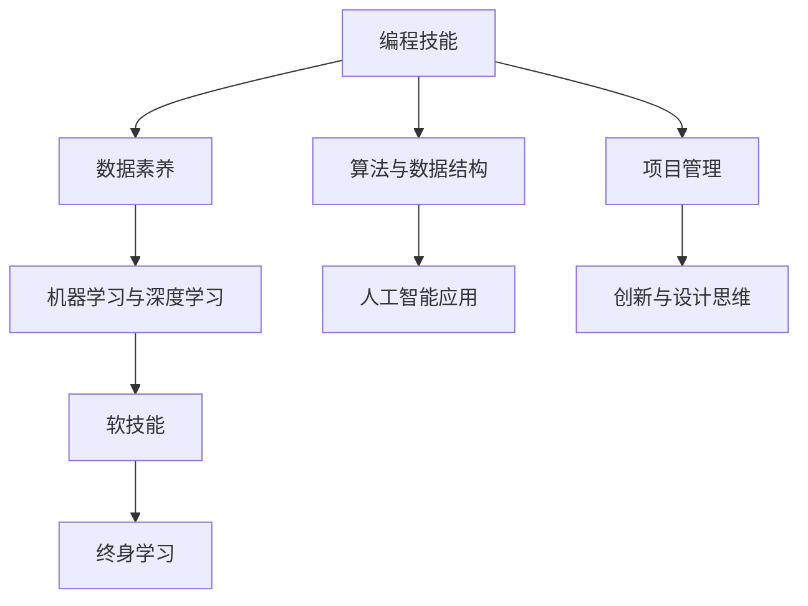

                 

# 人类计算：AI时代的未来技能需求与培训发展

> 关键词：人工智能,机器学习,数据科学,编程技能,数据素养,软技能,终身学习

## 1. 背景介绍

### 1.1 问题由来

在过去的几十年里，人工智能（AI）技术迅猛发展，已经渗透到了我们生活的方方面面。无论是自动驾驶汽车、智能家居系统，还是医疗诊断、金融风控，AI技术正在改变着我们的生产和生活方式。然而，在享受AI技术带来便利的同时，我们也不得不面对随之而来的挑战：如何培养适应AI时代的人才？

随着技术的不断进步，AI技术本身也在快速变化，其复杂性和难度不断提高。AI人才不仅要掌握传统的编程、数学和统计知识，还要具备更宽泛的跨学科能力和软技能。这意味着AI教育必须紧跟技术发展的步伐，不断更新和优化课程内容，以确保未来职场上的AI人才能够适应不断变化的AI技术和市场需求。

### 1.2 问题核心关键点

AI时代对人才技能的需求发生了显著变化。以下是我们认为在AI时代人才必须具备的关键技能和素养：

- **编程技能**：熟练掌握至少一种编程语言（如Python、R、Java等），并了解基本的算法和数据结构。
- **数据素养**：具备理解和处理大数据的能力，包括数据清洗、预处理和可视化。
- **机器学习与深度学习**：掌握基本机器学习算法，理解神经网络结构，能够实现模型训练、调优和评估。
- **软技能**：如批判性思维、问题解决、团队合作和沟通能力，这些是跨领域协作和创新所必需的。
- **终身学习**：在快速变化的技术环境中，持续学习和适应新知识是非常重要的。

## 2. 核心概念与联系

### 2.1 核心概念概述

为了更好地理解AI时代的技能需求和培训发展，我们首先定义一些关键概念：

- **AI技能**：指在人工智能领域所需的技术能力和知识，包括编程、数据处理、机器学习、深度学习、软技能等。
- **数据素养**：指理解和处理数据的能力，包括数据清洗、预处理、可视化和分析。
- **机器学习和深度学习**：指利用算法和模型从数据中学习知识，并用于预测、分类和聚类等任务。
- **软技能**：指与技术能力无关的人际交往和协作能力，如沟通、团队合作、项目管理等。
- **终身学习**：指在职业生涯中持续学习和提升技能，以适应技术环境的快速变化。

这些核心概念相互关联，共同构成了AI时代人才的技能框架。理解这些概念的联系，将有助于我们设计出更加全面和有效的培训体系。

### 2.2 核心概念原理和架构的 Mermaid 流程图



这个流程图展示了AI技能和素养之间的关系和层次。编程技能是基础，数据素养和机器学习能力是核心，软技能和终身学习是保障。算法与数据结构是编程技能的具体应用，人工智能应用则直接关联到实际问题解决。项目管理、创新与设计思维则是软技能在技术实践中的具体体现。

## 3. 核心算法原理 & 具体操作步骤

### 3.1 算法原理概述

AI时代的人才培养，其核心在于如何构建一个综合性的技能培训体系。以下是一些关键算法的原理和操作步骤：

- **分层教学**：将技能分成多个层次，从基础到高级，逐步提升学生的技能水平。例如，首先教授编程基础和数据素养，然后深入机器学习和深度学习，最后提升软技能和终身学习。
- **项目导向学习**：通过实际项目和案例研究，让学生在实践中学习AI技能。项目导向学习能够增强学生的实际应用能力和问题解决能力。
- **持续反馈**：通过定期的项目评审和反馈，帮助学生及时调整学习方向，提升学习效果。
- **跨学科融合**：将AI技能与其他学科知识进行融合，如计算机科学与生物医学、金融工程等。跨学科融合有助于培养具有跨领域视野的复合型人才。
- **软技能培训**：通过情景模拟、角色扮演等方法，提升学生的软技能，如沟通、团队合作和领导力。

### 3.2 算法步骤详解

以下是一个简化的AI人才培养流程，包括了核心步骤和操作指南：

1. **需求分析**：
   - 调研行业需求，确定所需技能和素养。
   - 制定教学目标和评估标准。

2. **课程设计**：
   - 设计分层教学大纲，涵盖从基础到高级的所有技能。
   - 引入跨学科融合课程，拓展学生视野。
   - 设计项目导向课程，提高实际应用能力。

3. **教学实施**：
   - 采用分层教学，逐步提升学生技能。
   - 引入项目导向学习，增强实践能力。
   - 定期进行项目评审，提供持续反馈。

4. **评估与改进**：
   - 通过定期的学习评估和项目评审，检验学习效果。
   - 根据评估结果，优化教学内容和方式。
   - 引入终身学习机制，鼓励持续学习。

### 3.3 算法优缺点

AI人才培养的算法具有以下优点：

- **全面性**：通过分层教学和跨学科融合，能够全面覆盖AI所需技能和素养。
- **实践性**：项目导向学习和持续反馈，能够提升学生的实际应用能力和问题解决能力。
- **灵活性**：通过灵活的教学设计和持续的评估改进，能够适应技术环境的快速变化。

但同时也存在一些缺点：

- **成本高**：设计、实施和评估一个全面的AI培训体系需要大量的人力和物力投入。
- **复杂性**：需要跨学科的知识和技能，设计、实施和评估过程较为复杂。
- **个性化不足**：大规模培训可能难以完全满足每个学生的个性化需求。

### 3.4 算法应用领域

AI人才培养的算法已经广泛应用于各类教育机构和培训机构。以下是一些典型的应用领域：

- **高等教育**：许多大学和学院已经开设了AI相关的本科和研究生课程，涵盖了编程、数据素养、机器学习、深度学习、软技能和终身学习。
- **职业培训**：很多公司和组织提供AI相关的职业培训，旨在提升现有员工的技能水平，以满足业务需求。
- **在线教育**：如Coursera、edX、Udacity等在线教育平台，提供了丰富的AI课程和项目，适合不同层次的学习者。
- **校企合作**：许多大学和企业合作，开展AI人才培养项目，将理论知识与实际应用紧密结合。
- **社区学习**：社区学院、行业协会和开源社区也提供各种AI培训课程和资源，满足不同人群的学习需求。

## 4. 数学模型和公式 & 详细讲解 & 举例说明

### 4.1 数学模型构建

在AI教育中，数学模型和公式的构建至关重要。以下是一些典型的数学模型及其应用：

1. **线性回归模型**：
   $$
   y = \beta_0 + \beta_1x_1 + \beta_2x_2 + \cdots + \beta_nx_n + \epsilon
   $$
   用于预测和分析数据，帮助理解变量之间的关系。

2. **决策树模型**：
   $$
   T = \{(条件, 分支), \ldots\}
   $$
   用于分类和回归任务，通过树形结构模拟决策过程。

3. **支持向量机模型**：
   $$
   f(x) = \sum_{i=1}^m \alpha_iy_iK(x, x_i) - \frac{1}{2}\sum_{i=1}^m \sum_{j=1}^m \alpha_i\alpha_jy_iy_jK(x_i, x_j) + C\sum_{i=1}^m \alpha_i(1-y_i)
   $$
   用于分类和回归任务，通过最大化边界判别，提高模型泛化能力。

4. **神经网络模型**：
   $$
   y = \sigma(\mathbf{W}\mathbf{x} + b)
   $$
   用于非线性建模和复杂任务，通过多层结构模拟人脑神经网络。

### 4.2 公式推导过程

以下是一些关键数学模型的推导过程：

1. **线性回归模型推导**：
   $$
   \mathbf{y} = \mathbf{X}\mathbf{\beta} + \mathbf{\epsilon}
   $$
   其中，$\mathbf{y}$ 是目标变量，$\mathbf{X}$ 是特征矩阵，$\mathbf{\beta}$ 是模型参数，$\mathbf{\epsilon}$ 是误差项。通过最小化均方误差，求解 $\mathbf{\beta}$，得到线性回归模型。

2. **决策树模型推导**：
   通过递归地选择最优的特征和分裂点，构建决策树模型。特征选择的目标是最大化信息增益，分裂点的选择目标是最大化纯度提升。

3. **支持向量机模型推导**：
   通过最大化边界判别，求解支持向量，构建决策边界。该模型的目标是最大化边界的间隔，同时最小化支持向量的数量。

4. **神经网络模型推导**：
   通过多层神经元的前向传播和反向传播，更新权重和偏置，最小化损失函数，求解模型参数。反向传播算法利用链式法则计算梯度，通过迭代更新参数，训练神经网络模型。

### 4.3 案例分析与讲解

以线性回归模型为例，分析其在实际应用中的使用场景和推导过程：

- **使用场景**：线性回归模型常用于预测和分析连续型变量，如房价预测、股票价格预测等。
- **推导过程**：假设我们有一组房价数据，通过最小二乘法求解线性回归模型。首先，定义损失函数：
   $$
   L(\beta) = \frac{1}{2n}\sum_{i=1}^n(y_i - \hat{y}_i)^2
   $$
   其中，$y_i$ 是真实房价，$\hat{y}_i$ 是预测房价，$\beta$ 是模型参数。通过求解损失函数的最小值，求解 $\beta$，得到线性回归模型：
   $$
   \hat{y} = \beta_0 + \beta_1x_1 + \beta_2x_2 + \cdots + \beta_nx_n
   $$

## 5. 项目实践：代码实例和详细解释说明

### 5.1 开发环境搭建

以下是使用Python进行AI人才培养的开发环境配置流程：

1. **安装Python**：
   - 下载并安装Python解释器。
   - 将Python添加到系统PATH环境变量中。

2. **安装科学计算库**：
   - 安装NumPy、Pandas、SciPy、Scikit-Learn等科学计算库，用于数据处理和机器学习。

3. **安装深度学习库**：
   - 安装TensorFlow、PyTorch等深度学习库，用于构建和训练神经网络模型。

4. **安装可视化库**：
   - 安装Matplotlib、Seaborn等可视化库，用于数据可视化。

5. **安装项目管理工具**：
   - 安装Jupyter Notebook、Git等项目管理工具，用于代码管理和版本控制。

完成上述步骤后，即可在开发环境中进行AI人才培养的代码实现。

### 5.2 源代码详细实现

以下是使用Python实现线性回归模型的示例代码：

```python
import numpy as np

# 生成样本数据
x = np.random.rand(100, 2)
y = 3*x[:,0] + 2*x[:,1] + np.random.normal(0, 1, 100)

# 定义损失函数
def mse(y_true, y_pred):
    return np.mean((y_true - y_pred)**2)

# 定义梯度下降算法
def gradient_descent(x, y, learning_rate=0.01, num_epochs=1000):
    m = len(y)
    beta = np.zeros(x.shape[1])
    for epoch in range(num_epochs):
        y_pred = np.dot(x, beta)
        gradient = 2/m * x.T.dot(y_pred - y)
        beta -= learning_rate * gradient
    return beta

# 训练线性回归模型
beta = gradient_descent(x, y)

# 使用训练好的模型进行预测
x_test = np.array([[0.5, 0.5]])
y_pred = np.dot(x_test, beta)
print("Predicted price:", y_pred)
```

### 5.3 代码解读与分析

这段代码展示了如何使用梯度下降算法训练线性回归模型，并进行房价预测。

- **数据生成**：首先生成一组随机样本数据，其中真实房价 $y$ 由线性模型 $y = 3x_1 + 2x_2 + \epsilon$ 生成，其中 $\epsilon$ 是随机误差。
- **损失函数定义**：使用均方误差作为损失函数，衡量预测值与真实值之间的差异。
- **梯度下降算法实现**：通过循环迭代，使用梯度下降算法更新模型参数 $\beta$，最小化损失函数。
- **模型训练**：在训练集上训练模型，得到模型参数 $\beta$。
- **预测房价**：使用训练好的模型对测试集进行预测，输出预测房价。

## 6. 实际应用场景

### 6.1 智能推荐系统

智能推荐系统是AI教育中的一个重要应用场景。通过机器学习和深度学习技术，可以为用户推荐个性化的学习资源，提升学习效果。

- **推荐算法**：协同过滤、基于内容的推荐、矩阵分解等。
- **模型训练**：使用用户的历史行为数据（如浏览记录、评分记录等）进行训练，得到推荐模型。
- **实际应用**：根据用户当前行为，实时推荐学习资源，如课程、视频、文档等。

### 6.2 自动化评估系统

自动化评估系统可以实时监测学生的学习情况，提供反馈和建议，帮助学生持续改进。

- **评估指标**：作业完成情况、测验成绩、项目进度等。
- **模型训练**：使用学生的历史学习数据进行训练，得到评估模型。
- **实际应用**：根据学生的当前学习行为，自动评估其学习效果，提供个性化的反馈和建议。

### 6.3 在线课程推荐

在线课程推荐系统可以根据学生的学习行为和偏好，推荐适合的课程和资源，帮助学生规划学习路径。

- **推荐算法**：基于内容的推荐、协同过滤、混合推荐等。
- **模型训练**：使用学生的学习历史数据进行训练，得到推荐模型。
- **实际应用**：根据学生的当前学习状态和兴趣，推荐适合的课程和资源，优化学习路径。

### 6.4 未来应用展望

随着AI技术的不断进步，AI教育将迎来更多创新和突破，以下是一些未来应用展望：

- **自适应学习系统**：根据学生的学习情况和反馈，动态调整教学内容和难度，实现个性化学习。
- **虚拟现实（VR）和增强现实（AR）教学**：通过虚拟和增强现实技术，提供沉浸式学习体验，提升学习效果。
- **情感计算**：通过情感分析技术，监测学生的学习情绪和反馈，提供实时支持。
- **混合式学习**：结合线上和线下教学，提供灵活多样的学习模式，满足不同学生的需求。

## 7. 工具和资源推荐

### 7.1 学习资源推荐

为了帮助开发者和学生系统掌握AI技能，我们推荐以下学习资源：

1. **Coursera**：提供广泛的AI课程，包括机器学习、深度学习、数据科学等，由斯坦福大学、麻省理工学院等知名大学和机构提供。

2. **edX**：提供多门AI课程，涵盖从入门到高级的内容，包括AI基础、深度学习、自然语言处理等。

3. **Udacity**：提供实践导向的AI课程，注重实战能力和项目经验。

4. **Kaggle**：提供大量的AI竞赛和数据集，通过竞赛提升实战能力。

5. **GitHub**：提供丰富的AI开源项目和代码库，帮助开发者学习和应用AI技术。

6. **AI中文社区**：提供中文AI学习资源和交流平台，适合中文开发者和学生。

### 7.2 开发工具推荐

以下是几款常用的AI开发工具：

1. **Jupyter Notebook**：Python开发环境，支持代码和数据可视化，方便学习和分享。

2. **TensorFlow**：由Google开发的深度学习框架，支持高效的模型构建和训练。

3. **PyTorch**：由Facebook开发的深度学习框架，支持动态图和静态图，易于使用和部署。

4. **Scikit-Learn**：Python科学计算库，提供简单易用的机器学习算法和工具。

5. **Matplotlib**：Python可视化库，支持丰富的图表绘制功能。

6. **Git**：版本控制工具，支持代码管理和协作。

### 7.3 相关论文推荐

以下是几篇代表性的AI教育相关论文，推荐阅读：

1. **"Deep Learning with Python: A Practical Introduction" by François Chollet**：深度学习入门书籍，介绍了TensorFlow和Keras的使用。

2. **"Learning to Learn" by Yann LeCun**：介绍机器学习的理论基础和实践技巧，适合学习基础和进阶内容。

3. **"Artificial Intelligence: A Modern Approach" by Stuart Russell and Peter Norvig**：AI领域经典教材，涵盖广泛的AI理论和应用。

4. **"Human-AI Collaboration: Changing the Essence of Human-Computer Interaction" by Binaet Alam**：探讨AI时代的人机协作新模式。

5. **"Towards a Universal Curriculum for AI and Machine Learning" by Andrew Ng**：提出AI和机器学习教育的标准化课程体系。

## 8. 总结：未来发展趋势与挑战

### 8.1 研究成果总结

AI教育是一个不断演进和发展的领域，以下是一些重要的研究成果和趋势：

- **分层教学**：将技能分成多个层次，从基础到高级，逐步提升学生技能。
- **项目导向学习**：通过实际项目和案例研究，提升学生的实际应用能力。
- **持续反馈**：定期进行项目评审和反馈，提升学习效果。
- **跨学科融合**：将AI技能与其他学科知识进行融合，拓展学生视野。
- **软技能培训**：通过情景模拟和角色扮演等方法，提升学生的软技能。
- **终身学习**：引入终身学习机制，鼓励持续学习。

### 8.2 未来发展趋势

未来AI教育将呈现以下发展趋势：

1. **更加注重软技能**：随着技术的不断进步，软技能的重要性将日益突出。学生需要具备更强的沟通、团队合作和领导力。
2. **跨学科融合**：AI教育将与其他学科知识进行更紧密的融合，培养跨领域复合型人才。
3. **实践导向学习**：更加注重实践能力和项目经验的培养，提升学生的实际应用能力。
4. **个性化学习**：通过自适应学习系统和情感计算技术，实现个性化学习体验。
5. **混合式学习**：结合线上和线下教学，提供灵活多样的学习模式。

### 8.3 面临的挑战

AI教育在快速发展的同时，也面临着一些挑战：

1. **成本高**：设计、实施和评估一个全面的AI培训体系需要大量的人力和物力投入。
2. **复杂性**：需要跨学科的知识和技能，设计、实施和评估过程较为复杂。
3. **个性化不足**：大规模培训可能难以完全满足每个学生的个性化需求。
4. **数据隐私和安全**：在数据收集和处理过程中，需要保护学生隐私和数据安全。

### 8.4 研究展望

未来AI教育需要在以下几个方面进行研究：

1. **跨学科教育**：将AI教育与其他学科知识进行更紧密的融合，培养跨领域复合型人才。
2. **个性化学习**：通过自适应学习系统和情感计算技术，实现个性化学习体验。
3. **混合式学习**：结合线上和线下教学，提供灵活多样的学习模式。
4. **软技能培训**：通过情景模拟和角色扮演等方法，提升学生的软技能。
5. **终身学习**：引入终身学习机制，鼓励持续学习。
6. **数据隐私和安全**：在数据收集和处理过程中，保护学生隐私和数据安全。

## 9. 附录：常见问题与解答

**Q1：AI教育是否需要掌握编程技能？**

A: 是的，编程技能是AI教育的基础。学生需要掌握至少一种编程语言（如Python、R、Java等），并了解基本的算法和数据结构。编程技能是理解和应用机器学习、深度学习等AI技术的前提。

**Q2：数据素养在AI教育中扮演什么角色？**

A: 数据素养是AI教育中非常重要的一部分。学生需要具备理解和处理大数据的能力，包括数据清洗、预处理和可视化。数据素养能够帮助学生更好地利用数据，提升机器学习模型的性能。

**Q3：AI教育是否需要掌握软技能？**

A: 是的，软技能是AI教育中不可或缺的一部分。学生需要具备批判性思维、问题解决、团队合作和沟通能力，这些是跨领域协作和创新所必需的。软技能能够帮助学生更好地适应职场，提升团队协作能力。

**Q4：AI教育是否需要终身学习？**

A: 是的，终身学习是AI教育的重要组成部分。在快速变化的技术环境中，持续学习和适应新知识是非常重要的。学生需要不断更新和提升技能，才能在职业生涯中保持竞争力。

**Q5：AI教育是否需要跨学科融合？**

A: 是的，跨学科融合是AI教育的重要方向。AI教育需要与其他学科知识进行融合，培养跨领域复合型人才。例如，AI教育可以与生物医学、金融工程、物理学等学科结合，培养更多具有跨学科视野的复合型人才。

---

作者：禅与计算机程序设计艺术 / Zen and the Art of Computer Programming

