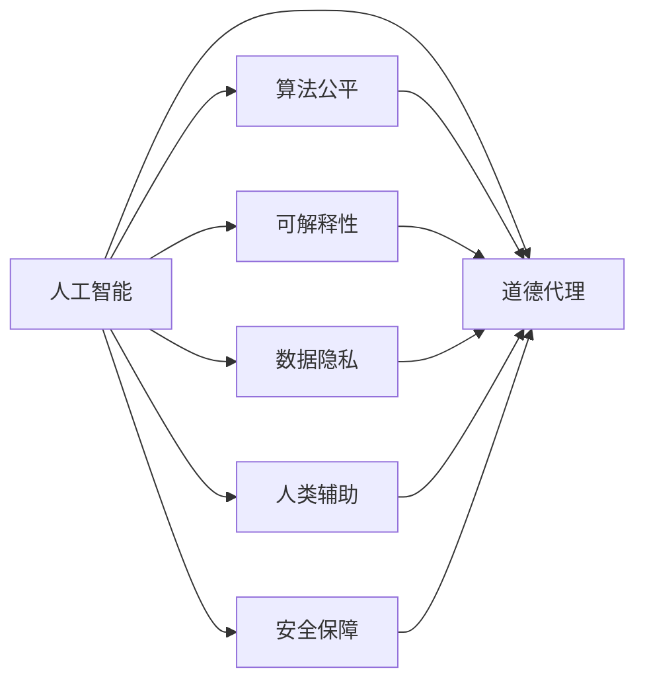

                 

# 人类计算：AI时代的道德代理和责任

> 关键词：人工智能, 道德代理, 责任, 算法公平, 可解释性, 数据隐私, 人类辅助, 安全保障

## 1. 背景介绍

### 1.1 问题由来

随着人工智能技术的迅速发展，AI系统已经在各行各业中广泛应用。从自动驾驶到智能客服，从智能推荐到工业自动化，AI系统正逐步改变着人们的生活方式和工作方式。然而，随着AI系统影响力的增大，其决策的透明度和责任归属问题也日益凸显。

近年来，一系列AI引发的伦理和社会问题引起广泛关注。如自动驾驶汽车交通事故的责任归属、AI辅助医疗系统的诊断失误、AI推荐系统的信息误导等。这些问题引发了关于AI系统决策透明性和责任归属的激烈讨论，成为全球技术治理的重要课题。

## 2. 核心概念与联系

### 2.1 核心概念概述

为更好地理解AI时代的道德代理和责任问题，本节将介绍几个关键概念：

- **人工智能(AI)**：模拟人类智能行为的技术，包括学习、推理、自然语言处理、视觉识别等。AI系统通过算法和模型对输入数据进行分析和决策。
- **道德代理(Moral Agency)**：AI系统作为人类行为的代理，其决策应符合社会道德和法律规范。道德代理要求AI系统具备一定的责任感和伦理意识。
- **算法公平(Algorithmic Fairness)**：AI系统在处理数据和进行决策时应避免偏见和歧视，保证不同群体得到公平对待。
- **可解释性(Explainability)**：AI系统应具备良好的决策可解释性，使人类能够理解和信任其决策过程。
- **数据隐私(Data Privacy)**：AI系统处理个人数据时，应尊重个人隐私，保障数据安全。
- **人类辅助(Human-in-the-Loop)**：AI系统应在人类监督下运行，人类负责监督和干预AI的决策过程。
- **安全保障(Security)**：AI系统应具备必要的安全机制，防止被恶意利用和攻击。

这些核心概念之间通过一定的逻辑关系和运作机制相互连接。以下将通过Mermaid流程图展示这些概念之间的联系：



这个图表展示了AI系统如何在多个维度上实现道德代理，保障公平性、可解释性、隐私、人类辅助和安全保障。

## 3. 核心算法原理 & 具体操作步骤

### 3.1 算法原理概述

AI系统的道德代理和责任问题，本质上是通过算法和模型决策过程的公平性、可解释性和安全性来体现的。这些特性是实现道德代理的关键要素。

- **公平性**：要求AI系统在处理数据和进行决策时，不因种族、性别、年龄、经济地位等非相关因素而产生偏见。
- **可解释性**：要求AI系统的决策过程应具有可理解性，便于人类分析和监督。
- **安全性**：要求AI系统具备必要的安全机制，防止被恶意利用和攻击。

这些特性需要在算法设计和模型训练过程中进行考虑，并在实际应用中进行评估和改进。

### 3.2 算法步骤详解

基于以上原理，AI系统的道德代理和责任问题的算法步骤可以分为以下几个关键步骤：

1. **数据预处理**：清洗和标准化数据，避免数据偏见。
2. **模型训练**：选择适当的模型架构和损失函数，训练模型。
3. **公平性评估**：使用公平性指标（如均等机会、对错率、平衡误差等）评估模型的公平性。
4. **可解释性设计**：在设计模型时考虑可解释性，使用可解释性工具（如LIME、SHAP等）分析模型决策过程。
5. **安全评估**：评估模型的鲁棒性和对抗性，采用对抗训练、数据加密等手段保障模型安全。
6. **道德审核**：引入伦理专家对模型进行审核，确保其符合社会道德规范。
7. **用户反馈**：收集用户反馈，不断改进模型。

### 3.3 算法优缺点

基于上述算法步骤，AI系统的道德代理和责任问题有以下优缺点：

**优点**：
- **公平性保障**：通过公平性评估和改进，可以显著减少数据和决策中的偏见。
- **可解释性提升**：可解释性设计和工具的使用，提高了模型决策的透明度和可信度。
- **安全性增强**：安全评估和改进措施，可以防止模型被恶意利用和攻击。

**缺点**：
- **资源消耗**：公平性评估和可解释性设计可能需要额外的计算资源和时间。
- **模型复杂性**：考虑道德和安全性，可能需要设计更复杂的模型架构。
- **用户接受度**：过于复杂的模型可能用户难以理解和使用，降低用户满意度。

### 3.4 算法应用领域

AI系统的道德代理和责任问题广泛应用在以下领域：

- **医疗诊断**：AI辅助诊断系统的决策过程需透明和可解释，避免误诊和漏诊。
- **金融风控**：AI信用评分模型的决策需公平和透明，避免歧视和偏见。
- **司法判决**：AI辅助审判系统的决策需符合伦理规范，保障司法公正。
- **推荐系统**：AI推荐系统的决策需公平且可解释，避免信息误导。
- **智能客服**：AI客服系统的决策需透明和负责任，保障用户体验。
- **自动驾驶**：AI自动驾驶系统的决策需安全且透明，避免交通事故和伦理争议。

## 4. 数学模型和公式 & 详细讲解 & 举例说明

### 4.1 数学模型构建

AI系统的道德代理和责任问题，可以通过数学模型进行建模和分析。以下构建一个简单的AI决策模型：

假设AI系统接收输入数据$x$，通过模型$M$输出决策$y$。模型的训练目标是最小化预测错误率，即：

$$
\min_{M} \mathbb{E}_{(x,y) \sim D} [\ell(M(x),y)]
$$

其中$\ell$为损失函数，$D$为数据分布。

### 4.2 公式推导过程

为了保证AI系统的公平性，我们需要引入公平性约束条件。假设模型$M$在处理数据时存在偏见，对于不同群体的预测误差不同。我们可以使用统计差值$\Delta(y_i)$来度量这种偏见，其中$y_i$为真实标签，$\hat{y}_i$为模型预测结果。

公平性约束条件可以表示为：

$$
\Delta(y_i) = \mathbb{E}_{x \sim D} [M(x)|y_i=1] - \mathbb{E}_{x \sim D} [M(x)|y_i=0]
$$

$$
\min_{M} \mathbb{E}_{(x,y) \sim D} [\ell(M(x),y)] \text{ subject to } \Delta(y_i) = 0
$$

为了提升模型的可解释性，我们可以使用LIME或SHAP等工具，对模型决策过程进行分析。这些工具可以通过局部线性近似和累积贡献值等方法，解释模型的决策过程，并可视化决策的依赖因素。

### 4.3 案例分析与讲解

假设一个银行信用评分模型，该模型接收客户的收入、信用历史、职业等数据，输出客户的信用评分。为了保证公平性，我们需要收集不同群体的数据，并分析模型的偏见。使用均等机会和平衡误差等指标，可以评估模型的公平性。

为了提升模型的可解释性，我们可以使用LIME工具，对模型决策过程进行分析。通过可视化每个特征对决策的贡献值，可以帮助银行理解模型的决策逻辑，并对模型进行调整。

## 5. 项目实践：代码实例和详细解释说明

### 5.1 开发环境搭建

在项目实践中，我们需要使用Python和相关库进行开发。以下是环境配置步骤：

1. 安装Python 3.7以上版本。
2. 安装Pip依赖管理工具。
3. 安装Scikit-Learn、Pandas等数据处理库。
4. 安装TensorFlow或PyTorch等深度学习框架。
5. 安装LIME或SHAP等可解释性工具。

### 5.2 源代码详细实现

以下是一个简单的AI决策模型的实现，包括数据预处理、模型训练、公平性评估和可解释性分析：

```python
import pandas as pd
import numpy as np
from sklearn.preprocessing import StandardScaler
from sklearn.model_selection import train_test_split
from sklearn.linear_model import LogisticRegression
from sklearn.metrics import accuracy_score, f1_score
import lime
import lime.lime_tabular

# 数据预处理
data = pd.read_csv('data.csv')
data = data.dropna()
X = data[['income', 'credit_history', 'occupation']]
y = data['credit_score']
X_train, X_test, y_train, y_test = train_test_split(X, y, test_size=0.2, random_state=42)

# 模型训练
scaler = StandardScaler()
X_train = scaler.fit_transform(X_train)
X_test = scaler.transform(X_test)
model = LogisticRegression()
model.fit(X_train, y_train)

# 公平性评估
from sklearn.metrics import confusion_matrix

# 计算均等机会
y_pred = model.predict(X_test)
conf_matrix = confusion_matrix(y_test, y_pred)
eq_opportunity = 1 - (conf_matrix[1,1] + conf_matrix[0,0]) / (np.sum(conf_matrix))

# 计算平衡误差
balanced_error = (np.abs(conf_matrix[1,1] - conf_matrix[1,0]) + np.abs(conf_matrix[0,1] - conf_matrix[0,0])) / (np.sum(conf_matrix))

# 输出结果
print(f'均等机会: {eq_opportunity:.2f}')
print(f'平衡误差: {balanced_error:.2f}')

# 可解释性分析
explainer = lime.lime_tabular.LimeTabularExplainer(X_train, feature_names=['income', 'credit_history', 'occupation'], class_names=['0', '1'])
# 选择一个测试样本
test_idx = 0
# 解释该样本的决策过程
exp = explainer.explain_instance(X_test.iloc[test_idx], model.predict_proba)
# 可视化决策依赖因素
exp.show_in_notebook(show_all=False)
```

### 5.3 代码解读与分析

以上代码实现了一个简单的信用评分模型，并进行了公平性评估和可解释性分析。代码的具体解释如下：

1. 数据预处理：使用Pandas加载数据，并使用Scikit-Learn进行数据标准化处理。
2. 模型训练：使用Scikit-Learn的LogisticRegression模型进行训练。
3. 公平性评估：计算均等机会和平衡误差，评估模型的公平性。
4. 可解释性分析：使用LIME工具，解释模型对特定样本的决策过程。
5. 结果输出：输出公平性评估结果和可解释性分析结果。

## 6. 实际应用场景

### 6.1 医疗诊断

AI辅助医疗诊断系统在提高诊断效率的同时，也面临着伦理和公平性问题。例如，某些医院可能存在种族和性别偏见，导致对不同群体的诊断效果不同。AI系统的道德代理和责任问题，可以通过公平性评估和可解释性设计来改善。

在实际应用中，医疗系统需要引入伦理专家对AI系统进行审核，确保其决策过程透明且符合伦理规范。同时，使用可解释性工具，可以帮助医生理解AI系统的诊断逻辑，提高诊断准确性和可信度。

### 6.2 金融风控

金融风控系统使用AI进行信用评分和风险评估，但同时也需要考虑公平性和可解释性。例如，某些银行可能存在对低收入群体的偏见，导致信用评分不公。AI系统的道德代理和责任问题，可以通过公平性评估和可解释性设计来改善。

在实际应用中，金融系统需要引入伦理专家对AI系统进行审核，确保其决策过程透明且符合伦理规范。同时，使用可解释性工具，可以帮助银行理解AI系统的评分逻辑，提高评分准确性和可信度。

### 6.3 司法判决

AI辅助审判系统在提高审判效率的同时，也面临着伦理和公平性问题。例如，某些司法系统可能存在种族和性别偏见，导致对不同群体的判决结果不同。AI系统的道德代理和责任问题，可以通过公平性评估和可解释性设计来改善。

在实际应用中，司法系统需要引入伦理专家对AI系统进行审核，确保其决策过程透明且符合伦理规范。同时，使用可解释性工具，可以帮助法官理解AI系统的判决逻辑，提高判决准确性和可信度。

## 7. 工具和资源推荐

### 7.1 学习资源推荐

为了帮助开发者系统掌握AI系统的道德代理和责任问题，以下推荐一些优质的学习资源：

1. **《AI的伦理与法律》**：深度探讨AI系统的伦理和法律问题，提供丰富的案例和实践建议。
2. **Coursera《人工智能伦理》**：斯坦福大学开设的AI伦理课程，涵盖多个重要议题，并使用案例教学法。
3. **IEEE《人工智能伦理指南》**：IEEE发布的AI伦理指南，提供伦理设计和审核建议。
4. **AI公平与透明性工作组**：全球AI伦理专家组成的平台，提供公平性评估和可解释性设计指南。
5. **LIME文档**：LIME工具的使用手册和文档，详细介绍可解释性分析方法。

通过学习这些资源，相信你一定能够系统掌握AI系统的道德代理和责任问题，并用于解决实际的AI应用问题。

### 7.2 开发工具推荐

以下是几款用于AI系统道德代理和责任问题开发的常用工具：

1. **TensorFlow**：谷歌开源的深度学习框架，支持大规模分布式训练和模型部署。
2. **PyTorch**：Facebook开源的深度学习框架，支持动态计算图和灵活的设计。
3. **Scikit-Learn**：Python的数据处理和机器学习库，提供丰富的算法和工具。
4. **LIME**：可解释性工具，用于分析机器学习模型的决策过程。
5. **SHAP**：可解释性工具，提供全局和局部可解释性分析。
6. **TensorBoard**：TensorFlow的可视化工具，用于监控模型训练和部署状态。
7. **Kaggle**：数据科学和机器学习竞赛平台，提供丰富的数据集和模型验证环境。

合理利用这些工具，可以显著提升AI系统道德代理和责任问题的开发效率，加速创新迭代的步伐。

### 7.3 相关论文推荐

AI系统的道德代理和责任问题是一个前沿的学术研究领域，以下推荐几篇奠基性的相关论文：

1. **《公平的机器学习》**：提出公平性评估和改进方法，避免AI系统的偏见和歧视。
2. **《可解释的AI》**：探讨可解释性设计和评估方法，提高AI系统的透明度和可信度。
3. **《安全机器学习》**：研究机器学习系统的安全性和鲁棒性，防止被恶意利用和攻击。
4. **《伦理机器学习》**：探讨机器学习系统的伦理设计和审核方法，确保系统符合伦理规范。
5. **《AI的伦理和社会影响》**：研究AI系统的社会影响和伦理问题，提供伦理设计和评估建议。

这些论文代表了大语言模型微调技术的发展脉络。通过学习这些前沿成果，可以帮助研究者把握学科前进方向，激发更多的创新灵感。

## 8. 总结：未来发展趋势与挑战

### 8.1 研究成果总结

本文对AI系统的道德代理和责任问题进行了全面系统的介绍。首先阐述了AI系统在各个领域的广泛应用和面临的伦理问题，明确了道德代理和责任在AI系统中的重要性和必要性。其次，从原理到实践，详细讲解了AI系统道德代理和责任问题的算法步骤和关键技术，给出了完整的代码实例和详细解释说明。同时，本文还广泛探讨了AI系统道德代理和责任问题在多个行业领域的应用前景，展示了其在实际落地中的广泛应用。此外，本文精选了道德代理和责任问题的各类学习资源，力求为读者提供全方位的技术指引。

通过本文的系统梳理，可以看到，AI系统的道德代理和责任问题是一个多维度、多层次的复杂问题，涉及数据、模型、算法、法律、伦理等多个方面。只有从多个维度协同发力，才能实现AI系统的道德代理和责任，构建安全、可靠、可解释、可控的智能系统。

### 8.2 未来发展趋势

展望未来，AI系统的道德代理和责任问题将呈现以下几个发展趋势：

1. **多模态融合**：AI系统将越来越多地结合视觉、语音、文本等多模态数据，提升系统的综合决策能力。
2. **可解释性提升**：AI系统的决策过程将更加透明和可解释，增强用户信任和接受度。
3. **公平性改进**：AI系统将在多个维度上进行公平性评估和改进，避免偏见和歧视。
4. **安全机制完善**：AI系统将具备更完善的安全机制，防止被恶意利用和攻击。
5. **伦理规范强化**：AI系统的设计和应用将受到更严格的伦理规范约束，确保系统符合社会道德。
6. **自动化治理**：AI系统将自动进行伦理审核和决策优化，提高系统的智能化水平。

以上趋势凸显了AI系统道德代理和责任问题的广阔前景。这些方向的探索发展，必将进一步提升AI系统的性能和应用范围，为构建人机协同的智能时代带来深远影响。

### 8.3 面临的挑战

尽管AI系统的道德代理和责任问题已经取得了不少进展，但在迈向更加智能化、普适化应用的过程中，它仍面临着诸多挑战：

1. **数据偏见问题**：AI系统可能会继承数据中的偏见，导致决策不公平。
2. **可解释性挑战**：复杂的AI系统难以解释其决策过程，降低用户信任。
3. **安全性问题**：AI系统可能被恶意利用，造成严重后果。
4. **伦理规范缺失**：AI系统的伦理规范体系尚未健全，缺乏明确指导。
5. **资源消耗高**：AI系统的道德代理和责任问题需要大量计算资源和时间。

这些挑战需要更多跨学科的合作和研究，才能解决AI系统的道德代理和责任问题。只有从数据、算法、伦理等多个维度协同发力，才能构建安全、可靠、可解释、可控的智能系统。

### 8.4 研究展望

面对AI系统道德代理和责任问题所面临的种种挑战，未来的研究需要在以下几个方面寻求新的突破：

1. **多模态融合技术**：研究如何更好地融合视觉、语音、文本等多模态数据，提升系统的综合决策能力。
2. **可解释性提升方法**：开发更加有效的可解释性工具，增强AI系统的决策透明度。
3. **公平性评估算法**：研究公平性评估的新方法，提升AI系统的公平性。
4. **安全机制设计**：设计更完善的安全机制，防止AI系统被恶意利用。
5. **伦理规范体系**：构建AI系统的伦理规范体系，确保其符合社会道德。
6. **自动化治理方法**：研究自动进行伦理审核和决策优化的方法，提高系统的智能化水平。

这些研究方向的探索，必将引领AI系统道德代理和责任问题迈向更高的台阶，为构建安全、可靠、可解释、可控的智能系统铺平道路。面向未来，AI系统道德代理和责任问题还需要与其他人工智能技术进行更深入的融合，如知识表示、因果推理、强化学习等，多路径协同发力，共同推动自然语言理解和智能交互系统的进步。只有勇于创新、敢于突破，才能不断拓展AI系统的边界，让智能技术更好地造福人类社会。

## 9. 附录：常见问题与解答

**Q1：AI系统的道德代理和责任问题是否适用于所有应用场景？**

A: AI系统的道德代理和责任问题适用于大多数应用场景，尤其是涉及敏感决策和伦理争议的场景。但在某些特定领域，如军事、司法等，可能需要更严格的伦理审查和监管。

**Q2：如何评估AI系统的公平性？**

A: AI系统的公平性可以通过均等机会、对错率、平衡误差等指标进行评估。使用这些指标可以发现模型在处理不同群体时是否存在偏见。同时，可以通过调整模型架构和损失函数，进行公平性改进。

**Q3：可解释性分析有哪些工具？**

A: 常用的可解释性分析工具包括LIME、SHAP、TreeExplainer等。这些工具可以通过局部线性近似和累积贡献值等方法，解释模型的决策过程，并可视化决策的依赖因素。

**Q4：如何提高AI系统的安全性？**

A: AI系统的安全性可以通过对抗训练、数据加密、模型裁剪等方法进行保障。使用对抗样本进行训练，可以提高模型的鲁棒性；使用数据加密技术，可以保护数据安全；使用模型裁剪技术，可以减小模型尺寸，提高推理速度。

**Q5：如何确保AI系统的可解释性？**

A: AI系统的可解释性可以通过可解释性设计和工具实现。使用LIME、SHAP等工具，可以可视化模型的决策过程，并解释决策依赖因素。同时，在模型设计时，考虑可解释性特征，增强模型的透明度和可信度。

这些问题的解答，有助于进一步理解AI系统的道德代理和责任问题，并指导实际应用中的技术实施。通过不断探索和优化，相信AI系统能够更好地服务于人类，构建安全、可靠、可解释、可控的智能社会。

---

作者：禅与计算机程序设计艺术 / Zen and the Art of Computer Programming

