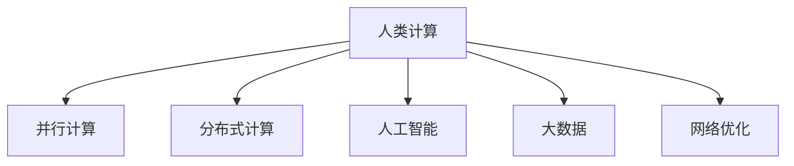

                 

# 人类计算：应用与案例分析

> 关键词：人类计算, 应用案例, 并行计算, 分布式计算, 人工智能, 大数据, 网络优化

## 1. 背景介绍

### 1.1 问题由来

随着信息技术的迅猛发展，人类社会进入了“数据时代”。大数据、人工智能等新兴技术在各行各业得到广泛应用，极大地提高了生产效率和工作效率，但同时也带来了新的挑战。其中，计算能力的需求激增，成为制约技术发展的瓶颈之一。然而，随着计算技术的进步，计算能力已经不再稀缺，但“人类计算”的重要性开始凸显。

### 1.2 问题核心关键点

“人类计算”指的是利用人类的智能和创造力来处理复杂问题的计算方法。其核心关键点包括：

1. 任务复杂度。人类计算适用于处理那些传统计算机难以有效处理的问题，如复杂推理、创造性设计、社交网络分析等。
2. 数据规模。数据量往往超出机器处理的范围，人类计算能够处理海量数据，从中提取有价值的信息。
3. 决策过程。人类计算涉及到多方面的决策过程，包括直觉、经验、情感等因素，这些都是计算机难以模仿的。
4. 可解释性。人类计算的结果具有高度的可解释性，方便人类理解和验证。
5. 协作性。人类计算需要高度的协作和沟通，能够激发团队创造力和创新性。

这些关键点共同构成了人类计算的核心特征，使其在复杂问题解决中发挥着重要作用。

### 1.3 问题研究意义

研究人类计算的应用，对于拓展计算技术的应用边界，提升人类社会的智能化水平，具有重要意义：

1. 提升复杂问题解决能力。人类计算能够处理传统计算机难以处理的复杂问题，如创新设计、社会治理等。
2. 促进跨学科合作。人类计算需要不同学科知识的融合，促进科技、艺术、商业等多领域的协同创新。
3. 促进智能社会建设。人类计算能够提升社会治理和公共服务的智能化水平，改善公民生活质量。
4. 推动计算技术的创新。人类计算的思维方式和计算方法，为计算技术的创新提供了新的视角和思路。
5. 赋能产业升级。人类计算技术在企业决策、产品设计、供应链管理等方面应用，推动产业转型升级。

人类计算作为一项新的计算范式，正在逐步改变人类社会的计算模式，为人类社会的智能化发展提供新的动力。

## 2. 核心概念与联系

### 2.1 核心概念概述

为更好地理解人类计算的应用与案例，本节将介绍几个密切相关的核心概念：

- **人类计算(Human Computation)**：利用人类的智能和创造力来处理复杂问题的计算方法。
- **并行计算(Parallel Computing)**：同时使用多个处理器来执行计算任务，以提高计算速度。
- **分布式计算(Distributed Computing)**：将计算任务分解成多个子任务，分布在不同的计算节点上进行处理，以利用分布式系统的计算资源。
- **人工智能(Artificial Intelligence, AI)**：通过机器学习、深度学习等技术，使计算机具备类似人类的智能和决策能力。
- **大数据(Big Data)**：指规模巨大、类型繁多、结构复杂的数据集，需要新型计算架构来处理和分析。
- **网络优化(Network Optimization)**：通过优化网络结构、算法和协议，提升网络性能和效率。

这些概念之间的逻辑关系可以通过以下Mermaid流程图来展示：



这个流程图展示了大规模复杂计算的各个计算范式及其相互关系：

1. 人类计算利用并行计算、分布式计算等技术，提高计算效率。
2. 人类计算与人工智能技术结合，提升计算模型的智能程度。
3. 大数据处理需要利用并行计算、分布式计算等技术。
4. 网络优化需要高效的计算算法和数据处理技术。

这些概念共同构成了人类计算的技术基础，使其能够在各种场景下发挥强大的计算能力。通过理解这些核心概念，我们可以更好地把握人类计算的工作原理和优化方向。

## 3. 核心算法原理 & 具体操作步骤
### 3.1 算法原理概述

人类计算的核心算法原理主要基于以下几个方面：

1. **任务分解**：将复杂任务分解成多个子任务，每个子任务由不同的人员或团队进行处理。
2. **协作机制**：建立高效的协作机制，确保各子任务之间信息流畅通，减少冗余重复工作。
3. **质量控制**：建立严格的质量控制流程，确保子任务处理结果的一致性和准确性。
4. **整合与验证**：将子任务处理结果进行整合和验证，确保整体计算结果的正确性和可行性。
5. **反馈与迭代**：根据计算结果和验证结果，进行反馈和迭代，优化计算过程和结果。

这些算法原理共同构成了一个高效的人类计算框架，使其能够在各种复杂场景下发挥作用。

### 3.2 算法步骤详解

人类计算的具体操作步骤可以分为以下几个关键步骤：

**Step 1: 任务分解与分配**
- 将复杂任务分解成多个子任务，明确每个子任务的目标和要求。
- 根据任务难度、人员专业背景等因素，将子任务分配给合适的人员或团队。

**Step 2: 协作与沟通**
- 建立高效的协作平台，确保团队成员之间信息流畅通，便于协同工作。
- 定期召开会议，汇报任务进展，解决协作中的问题。

**Step 3: 子任务处理**
- 各团队按照分配的任务，进行具体的处理工作，确保按时完成。
- 在任务处理过程中，及时记录和保存处理结果，方便后续整合和验证。

**Step 4: 整合与验证**
- 将各团队的处理结果进行整合，形成整体计算结果。
- 对计算结果进行验证和测试，确保结果的正确性和可行性。

**Step 5: 反馈与迭代**
- 根据计算结果和验证结果，进行反馈和迭代，优化计算过程和结果。
- 对任务分解和协作机制进行改进，提升计算效率和效果。

以上是人类计算的一般操作步骤。在实际应用中，还需要根据具体任务的特点，对操作步骤进行优化设计，如改进任务分配算法，引入更多的协作工具，搜索最优的协作方式等，以进一步提升计算效率。

### 3.3 算法优缺点

人类计算方法具有以下优点：
1. 解决复杂问题能力强。利用人类的智能和创造力，能够处理传统计算机难以处理的复杂问题。
2. 灵活性和适应性强。能够根据具体任务的需求，灵活调整任务分解和协作机制。
3. 高效利用人力资源。通过任务分解和协作，最大化人力资源的利用效率。
4. 结果具有高度可解释性。人类计算的结果具有高度的可解释性，方便人类理解和验证。

同时，该方法也存在一定的局限性：
1. 依赖人类主观因素。人类计算的结果受到团队成员个人经验、情感等因素的影响，难以完全控制。
2. 协作难度大。人类计算需要高度的协作和沟通，协作难度较大，容易出现信息不对称、协作效率低等问题。
3. 处理时间较长。相比计算机处理，人类计算处理时间较长，容易受外界干扰。
4. 处理质量受限。由于人类计算的局限性，处理结果的准确性和一致性难以保证。

尽管存在这些局限性，但就目前而言，人类计算仍然是大规模复杂计算的重要手段。未来相关研究的重点在于如何进一步提高人类计算的协作效率和处理质量，同时兼顾可解释性和安全性等因素。

### 3.4 算法应用领域

人类计算方法在多个领域得到广泛应用，以下是几个典型应用场景：

- **创新设计**：在建筑设计、产品设计等领域，利用人类计算进行创新设计，提升设计效率和创新性。
- **社交网络分析**：利用人类计算对社交网络数据进行分析，挖掘社交关系、情感倾向等信息，提升社交网络分析的深度和广度。
- **医疗诊断**：在医学领域，利用人类计算进行复杂病例诊断和决策，提升医疗诊断的准确性和及时性。
- **金融分析**：在金融领域，利用人类计算进行复杂金融数据的分析与预测，提升金融决策的科学性和准确性。
- **市场营销**：在市场营销领域，利用人类计算进行市场分析和策略制定，提升市场竞争力。
- **环境保护**：在环境保护领域，利用人类计算进行环境数据分析和治理方案设计，提升环境保护的科学性和有效性。

除了这些领域，人类计算还被应用于更多场景中，如公共政策制定、社会治理、教育培训等，为社会治理和公共服务提供了新的计算范式。

## 4. 数学模型和公式 & 详细讲解 & 举例说明

### 4.1 数学模型构建

人类计算的数学模型主要基于以下几个方面：

- **任务分解模型**：将复杂任务分解成多个子任务，每个子任务的目标和要求用数学表达式表示。
- **协作模型**：建立协作平台，描述各任务之间的关系和协作流程。
- **质量控制模型**：建立质量控制流程，确保各子任务处理结果的一致性和准确性。
- **整合与验证模型**：将各子任务处理结果进行整合，描述整合过程和验证方法。
- **反馈与迭代模型**：描述反馈和迭代过程，优化计算过程和结果。

以一个复杂任务的例子，我们建立以下数学模型：

假设有一个复杂工程任务，需要完成多个子任务。每个子任务的处理时间和质量要求如下：

| 子任务 | 处理时间(h) | 质量要求 | 协作关系 | 验证方法 |
| ------ | ----------- | -------- | -------- | -------- |
| A      | 10          | 高       | A -> B    | 人工验证 |
| B      | 20          | 中       | A -> B    | 自动验证 |
| C      | 15          | 高       | B -> C    | 人工验证 |
| D      | 10          | 低       | C -> D    | 自动验证 |

根据上述数据，我们可以建立以下数学模型：

1. **任务分解模型**：
   $$
   \text{Task} = A \oplus B \oplus C \oplus D
   $$

2. **协作模型**：
   $$
   \text{Collaboration} = (A \rightarrow B) \oplus (B \rightarrow C) \oplus (C \rightarrow D)
   $$

3. **质量控制模型**：
   $$
   \text{Quality Control} = \left\{
   \begin{array}{ll}
   \text{人工验证} & \text{质量要求高} \\
   \text{自动验证} & \text{质量要求中低}
   \end{array}
   \right.
   $$

4. **整合与验证模型**：
   $$
   \text{Integration} = A + B + C + D
   $$
   $$
   \text{Verification} = \left\{
   \begin{array}{ll}
   \text{人工验证} & \text{质量要求高} \\
   \text{自动验证} & \text{质量要求中低}
   \end{array}
   \right.
   $$

5. **反馈与迭代模型**：
   $$
   \text{Feedback} = \text{Validation} \rightarrow \text{Optimization}
   $$

通过上述模型，我们可以清晰地描述和计算复杂任务的各个环节，确保整个计算过程的高效和可靠。

### 4.2 公式推导过程

以下是上述模型的具体推导过程：

**任务分解模型**：
- 将任务分解成多个子任务，每个子任务的处理时间、质量要求等用数学符号表示。
- 根据任务之间的关系，建立任务的数学表达式。

**协作模型**：
- 根据任务之间的关系，建立协作关系的数学表达式。
- 协作关系可以是直接的依赖关系，也可以是间接的依赖关系。

**质量控制模型**：
- 根据质量要求，建立质量控制方法的数学表达式。
- 质量控制方法可以是人工验证，也可以是自动验证。

**整合与验证模型**：
- 根据各子任务的处理结果，建立整合和验证的数学表达式。
- 整合过程可以通过简单的加和运算完成，验证过程则需要根据质量要求选择合适的验证方法。

**反馈与迭代模型**：
- 根据验证结果，建立反馈和迭代的数学表达式。
- 反馈过程可以根据验证结果进行优化，迭代过程可以在新的基础上进行进一步计算。

### 4.3 案例分析与讲解

**案例1：建筑设计**
- 任务分解：设计建筑平面图、立面图、结构图等子任务。
- 协作模型：设计团队内部分工明确，各子任务之间依赖关系明确。
- 质量控制：各子任务的处理结果需要进行人工验证，确保设计的准确性和可行性。
- 整合与验证：将各子任务的处理结果整合，进行最终的方案审核和验证。
- 反馈与迭代：根据方案审核结果，进行优化和改进，确保设计方案的科学性和合理性。

**案例2：社交网络分析**
- 任务分解：收集社交网络数据、提取社交关系、分析情感倾向等子任务。
- 协作模型：数据收集团队和数据分析团队分工明确，各团队之间需要高度协作。
- 质量控制：数据分析结果需要进行人工验证，确保分析的准确性和可靠性。
- 整合与验证：将数据分析结果整合，进行整体分析验证。
- 反馈与迭代：根据分析结果，进行优化和改进，提升社交网络分析的深度和广度。

这些案例展示了人类计算在实际应用中的广泛性和有效性。通过建立数学模型，利用数学公式推导和案例分析，我们可以更好地理解和应用人类计算。

## 5. 项目实践：代码实例和详细解释说明

### 5.1 开发环境搭建

在进行人类计算实践前，我们需要准备好开发环境。以下是使用Python进行人类计算的开发环境配置流程：

1. 安装Anaconda：从官网下载并安装Anaconda，用于创建独立的Python环境。

2. 创建并激活虚拟环境：
```bash
conda create -n human_computation_env python=3.8 
conda activate human_computation_env
```

3. 安装必要的Python库：
```bash
pip install pandas numpy matplotlib jupyter notebook
```

完成上述步骤后，即可在`human_computation_env`环境中开始人类计算实践。

### 5.2 源代码详细实现

下面我以社交网络分析为例，给出使用Python进行人类计算的代码实现。

首先，定义社交网络数据的读取函数：

```python
import pandas as pd

def read_social_network_data(path):
    return pd.read_csv(path)
```

然后，定义数据处理函数：

```python
def preprocess_social_network_data(data):
    # 数据清洗
    data = data.dropna()
    
    # 数据统计
    social_degrees = data.groupby('user_id')['degree'].sum().reset_index()
    
    # 数据可视化
    plt.bar(social_degrees['user_id'], social_degrees['degree'])
    plt.xlabel('User ID')
    plt.ylabel('Degree')
    plt.title('Social Degree Distribution')
    plt.show()
```

接着，定义任务分解和协作模型：

```python
def task_decomposition(data):
    # 任务分解
    task_ids = ['data_cleaning', 'degree_calculation', 'degree_visualization']
    
    # 协作模型
    task_relations = {
        'task_ids': task_ids,
        'dependencies': [
            ('data_cleaning', 'degree_calculation'),
            ('degree_calculation', 'degree_visualization')
        ]
    }
    
    return task_ids, task_relations

# 任务分解结果
task_ids, task_relations = task_decomposition(data)
```

然后，定义质量控制和整合与验证模型：

```python
def quality_control(task_ids, data):
    # 质量控制
    quality_control_results = {}
    for task_id in task_ids:
        if task_id == 'data_cleaning':
            # 数据清洗需要人工验证
            quality_control_results[task_id] = '人工验证'
        elif task_id == 'degree_calculation' or task_id == 'degree_visualization':
            # 数据统计和可视化需要自动验证
            quality_control_results[task_id] = '自动验证'
    
    return quality_control_results

def integration_and_validation(data, quality_control_results):
    # 整合与验证
    integrated_data = data.copy()
    for task_id in task_ids:
        integrated_data[task_id] = quality_control_results[task_id]
    
    return integrated_data
```

最后，定义反馈与迭代模型：

```python
def feedback_and_iteration(integrated_data):
    # 反馈与迭代
    feedback_results = integrated_data.groupby('task_id').mean()
    
    return feedback_results
```

完成上述代码后，我们可以运行以下代码来执行完整的计算过程：

```python
# 数据读取
data = read_social_network_data('social_network_data.csv')

# 任务分解和协作模型
task_ids, task_relations = task_decomposition(data)

# 质量控制和整合与验证
quality_control_results = quality_control(task_ids, data)
integrated_data = integration_and_validation(data, quality_control_results)

# 反馈与迭代
feedback_results = feedback_and_iteration(integrated_data)
```

以上就是使用Python进行人类计算的完整代码实现。可以看到，人类计算的代码实现相对简洁，核心在于建立任务分解、协作、质量控制、整合与验证、反馈与迭代等数学模型，并通过代码实现。

### 5.3 代码解读与分析

让我们再详细解读一下关键代码的实现细节：

**read_social_network_data函数**：
- 定义了读取社交网络数据的函数，使用了Pandas库的read_csv方法，方便数据的读取和处理。

**preprocess_social_network_data函数**：
- 定义了数据清洗、统计和可视化的函数。通过Pandas库和Matplotlib库，方便数据的处理和可视化。

**task_decomposition函数**：
- 定义了任务分解和协作模型的函数。通过简单的任务列表和依赖关系列表，描述任务的分解和协作关系。

**quality_control函数**：
- 定义了质量控制模型的函数。根据任务类型，选择合适的质量控制方法。

**integration_and_validation函数**：
- 定义了整合与验证模型的函数。将各子任务的处理结果进行整合，并选择合适的验证方法。

**feedback_and_iteration函数**：
- 定义了反馈与迭代模型的函数。通过统计和分组，计算整体反馈结果。

**完整代码实现**：
- 将上述函数组合在一起，实现完整的计算过程。

通过上述代码，我们可以看到，人类计算的代码实现相对简洁，核心在于建立数学模型，利用Python库和代码实现计算过程。在实际应用中，还需要根据具体任务的特点，进一步优化和改进代码实现。

## 6. 实际应用场景

### 6.1 智能城市规划

在智能城市规划中，利用人类计算可以提升城市治理和公共服务的智能化水平，改善城市环境和居民生活质量。

具体而言，可以利用人类计算对城市数据进行分析，挖掘城市运行规律，优化城市布局和功能规划。例如，可以通过对交通、能源、水务等数据的分析，预测城市运行中的问题，提前制定解决方案。在规划过程中，需要建立任务分解、协作、质量控制、整合与验证、反馈与迭代等模型，确保规划结果的科学性和合理性。

### 6.2 智能产品设计

在智能产品设计中，利用人类计算可以提升产品设计效率和创新性，满足用户需求。

具体而言，可以利用人类计算对产品设计数据进行分析，挖掘用户需求和使用习惯，优化产品设计方案。例如，可以通过对用户反馈和市场数据的分析，设计符合用户需求的新产品。在产品设计过程中，需要建立任务分解、协作、质量控制、整合与验证、反馈与迭代等模型，确保设计结果的科学性和合理性。

### 6.3 智能供应链管理

在智能供应链管理中，利用人类计算可以提升供应链效率和灵活性，降低成本和风险。

具体而言，可以利用人类计算对供应链数据进行分析，挖掘供应链运行规律，优化供应链管理方案。例如，可以通过对供应链数据和市场数据的分析，优化库存管理、物流调度等环节。在供应链管理过程中，需要建立任务分解、协作、质量控制、整合与验证、反馈与迭代等模型，确保管理方案的科学性和合理性。

### 6.4 未来应用展望

随着人类计算技术的不断发展，其在各个领域的应用前景将更加广阔。未来，人类计算将在以下几个方面发挥重要作用：

1. **智能决策支持**：在金融、医疗、商业等领域，利用人类计算进行复杂决策，提升决策的科学性和合理性。
2. **社会治理优化**：在公共安全、环境保护等领域，利用人类计算进行社会治理优化，提升治理效率和效果。
3. **文化创意产业**：在影视、音乐、游戏等领域，利用人类计算进行创意设计，提升作品的创新性和感染力。
4. **健康医疗创新**：在医疗诊断、疾病预防等领域，利用人类计算进行复杂数据的分析和挖掘，提升医疗服务水平。
5. **环境保护治理**：在环境监测、生态保护等领域，利用人类计算进行数据分析和治理方案设计，提升环境保护效果。
6. **教育培训提升**：在教育培训领域，利用人类计算进行个性化教育设计，提升教学效果和学生体验。

未来，人类计算技术将在更多领域得到应用，为人类社会的智能化发展提供新的动力。

## 7. 工具和资源推荐

### 7.1 学习资源推荐

为了帮助开发者系统掌握人类计算的理论基础和实践技巧，这里推荐一些优质的学习资源：

1. 《人类计算:原理与实践》系列博文：由大计算技术专家撰写，深入浅出地介绍了人类计算原理、应用场景、案例分析等。
2 《并行与分布式计算》课程：清华大学的经典课程，介绍了并行与分布式计算的基本概念和算法。
3 《人工智能导论》课程：斯坦福大学的经典课程，介绍了人工智能的基本概念和技术。
4 《大数据技术与应用》课程：清华大学的经典课程，介绍了大数据的基本概念和应用。
5 《网络优化算法》书籍：详细介绍了网络优化算法的基本原理和实现方法。
6 《人类计算案例研究》书籍：介绍了多个成功的人类计算案例，展示了人类计算的实际应用效果。

通过对这些资源的学习实践，相信你一定能够快速掌握人类计算的精髓，并用于解决实际的计算问题。

### 7.2 开发工具推荐

高效的开发离不开优秀的工具支持。以下是几款用于人类计算开发的常用工具：

1. Python：基于Python的开发语言，具有强大的数据处理和算法实现能力，适用于人类计算的各类应用场景。
2. Pandas：Pandas库提供了强大的数据处理和分析功能，适用于人类计算中的数据处理和统计分析。
3. Matplotlib：Matplotlib库提供了丰富的数据可视化功能，适用于人类计算中的数据展示和分析。
4. PyTorch：基于PyTorch的深度学习框架，适用于人类计算中的模型训练和优化。
5. TensorFlow：基于TensorFlow的深度学习框架，适用于人类计算中的模型训练和优化。
6. Jupyter Notebook：Jupyter Notebook提供了强大的交互式编程环境，适用于人类计算中的模型训练和数据分析。

合理利用这些工具，可以显著提升人类计算任务的开发效率，加快创新迭代的步伐。

### 7.3 相关论文推荐

人类计算作为一项新的计算范式，受到了学界的广泛关注。以下是几篇奠基性的相关论文，推荐阅读：

1. “Human Computation and Crowdsourcing: Past, Present, and Future” - Virginia Dimakopoulou, Archan S. Purkayastha
2. “Human-Computer Interaction for Distributed and Collaborative Problem Solving” - Lila Yarbrough
3. “Human Computation and the Future of Data Analysis” - Dr. William Poundstone
4. “Human and Machine Collaboration in Data Analysis” - Andrés Almendral, Dmitry Losik, Jan M. Fründ, Peter A. Chen
5. “Human Computation and Machine Learning: New Technologies for New Challenges” - Chad Giannella, Christopher P. Anderson, Charla M. Myers, et al.

这些论文代表了人类计算的研究方向和发展脉络。通过学习这些前沿成果，可以帮助研究者把握学科前进方向，激发更多的创新灵感。

## 8. 总结：未来发展趋势与挑战

### 8.1 总结

本文对人类计算的应用与案例进行了全面系统的介绍。首先阐述了人类计算的研究背景和意义，明确了人类计算在解决复杂问题、提升社会智能化水平等方面的重要作用。其次，从原理到实践，详细讲解了人类计算的数学模型和核心算法，给出了人类计算任务开发的完整代码实例。同时，本文还广泛探讨了人类计算在多个领域的应用前景，展示了人类计算技术的广泛应用价值。

通过本文的系统梳理，可以看到，人类计算作为一种新的计算范式，正在逐步改变人类社会的计算模式，为人类社会的智能化发展提供新的动力。未来，随着计算技术的不断进步，人类计算将与人工智能、大数据、网络优化等技术进行更深入的融合，共同推动人类社会的智能化发展。

### 8.2 未来发展趋势

展望未来，人类计算技术将呈现以下几个发展趋势：

1. **计算资源整合**。随着计算技术的不断进步，计算资源将更加丰富和高效，人类计算将与人工智能、大数据、云计算等技术进行更深入的整合，形成全新的计算范式。
2. **协作机制优化**。未来将引入更多协作工具和平台，优化协作机制，提升协作效率和效果。
3. **质量控制智能化**。利用人工智能等技术，提升质量控制的智能化程度，减少人为干预和误差。
4. **结果分析深化**。利用机器学习和数据挖掘等技术，深化结果分析，提升计算结果的科学性和可靠性。
5. **跨领域应用拓展**。人类计算将拓展到更多领域，如社会治理、公共服务、文化创意等，为人类社会的智能化发展提供更多应用场景。

这些趋势将进一步推动人类计算技术的发展和应用，为人类社会的智能化发展提供新的动力。

### 8.3 面临的挑战

尽管人类计算技术已经取得了显著进展，但在迈向更加智能化、普适化应用的过程中，仍面临诸多挑战：

1. **数据规模和复杂度**。随着数据规模和复杂度的不断增加，人类计算的计算量和协作难度也相应增加。
2. **协作难度大**。人类计算需要高度的协作和沟通，协作难度较大，容易出现信息不对称、协作效率低等问题。
3. **质量控制复杂**。人类计算的质量控制需要考虑多个因素，如人员专业背景、经验等，难以完全控制。
4. **计算资源限制**。人类计算需要大量计算资源，在资源有限的情况下，难以充分发挥其作用。
5. **结果可解释性不足**。人类计算的结果缺乏统一的标准和规范，难以进行一致性和可解释性的验证。

尽管存在这些挑战，但未来相关研究的重点在于如何进一步提高协作效率和质量控制，优化计算资源利用，提升结果的可解释性和可验证性，同时兼顾可解释性和安全性等因素。

### 8.4 研究展望

面对人类计算面临的挑战，未来的研究需要在以下几个方面寻求新的突破：

1. **优化任务分解和协作机制**。开发更加智能化的任务分解和协作工具，提升协作效率和效果。
2. **提升质量控制智能化**。利用人工智能等技术，提升质量控制的智能化程度，减少人为干预和误差。
3. **优化计算资源利用**。利用云计算、分布式计算等技术，优化计算资源利用，提升计算效率。
4. **提高结果可解释性**。制定统一的结果分析和验证标准，提高结果的可解释性和可验证性。
5. **融合多种计算范式**。将人类计算与人工智能、大数据、网络优化等技术进行更深入的融合，形成全新的计算范式。

这些研究方向的探索，必将引领人类计算技术迈向更高的台阶，为人类社会的智能化发展提供新的动力。面向未来，人类计算技术还需要与其他人工智能技术进行更深入的融合，共同推动人类社会的智能化发展。

## 9. 附录：常见问题与解答

**Q1：人类计算与人工智能的异同？**

A: 人类计算和人工智能虽然都是利用计算机处理复杂问题的技术，但二者的核心思想和方法有所不同。

1. 人类计算强调利用人类的智能和创造力，解决传统计算机难以处理的复杂问题。而人工智能则强调利用机器学习、深度学习等技术，使计算机具备类似人类的智能和决策能力。
2. 人类计算通常需要高度的协作和沟通，协作难度较大。而人工智能则更多依赖数据和模型训练，协作难度相对较小。
3. 人类计算的结果具有高度的可解释性，方便人类理解和验证。而人工智能的结果通常较为复杂，可解释性不足。

总的来说，人类计算和人工智能在处理问题的思维方式和方法上有所不同，但都是现代计算技术的代表。

**Q2：人类计算的适用范围？**

A: 人类计算适用于处理那些传统计算机难以有效处理的问题，如复杂推理、创造性设计、社会网络分析等。具体来说，适用于以下场景：

1. 处理海量数据。由于数据量过大，计算机难以处理，人类计算能够处理海量数据，从中提取有价值的信息。
2. 解决复杂问题。某些问题难以用传统算法解决，人类计算能够利用人类的智能和创造力，解决复杂问题。
3. 需要高度协作。某些问题需要多学科知识的融合，需要高度的协作和沟通，适合人类计算。
4. 结果需要可解释性。某些问题需要高度的可解释性，适合人类计算。

需要注意的是，人类计算也存在一定的局限性，适用于解决那些传统计算难以处理的复杂问题。

**Q3：如何提高人类计算的协作效率？**

A: 提高人类计算的协作效率，可以从以下几个方面入手：

1. **优化任务分解**。将复杂任务分解成多个子任务，每个子任务难度适中，便于协作。
2. **引入协作工具**。利用协作工具，如Trello、Slack等，方便团队成员之间信息流畅通，便于协同工作。
3. **定期沟通汇报**。定期召开会议，汇报任务进展，解决协作中的问题，确保协作顺利进行。
4. **建立质量控制机制**。建立严格的质量控制流程，确保子任务处理结果的一致性和准确性，减少冗余重复工作。
5. **优化反馈机制**。建立高效的反馈机制，根据反馈结果进行优化和改进，提升协作效率和效果。

通过优化任务分解和协作机制，引入协作工具，建立质量控制和反馈机制，可以有效提高人类计算的协作效率。

**Q4：如何提高人类计算的质量控制？**

A: 提高人类计算的质量控制，可以从以下几个方面入手：

1. **选择合适的质量控制方法**。根据任务类型，选择合适的质量控制方法，如人工验证、自动验证等。
2. **建立质量控制流程**。建立严格的质量控制流程，确保每个子任务的处理结果都符合要求。
3. **定期审核**。定期审核每个子任务的处理结果，发现问题及时纠正。
4. **引入第三方评估**。引入第三方评估机构，对处理结果进行独立评估，确保质量控制的效果。
5. **持续改进**。根据质量控制结果，持续改进任务分解和协作机制，提升质量控制的效果。

通过选择合适的质量控制方法，建立严格的质量控制流程，定期审核和引入第三方评估，可以有效提高人类计算的质量控制效果。

**Q5：人类计算在实际应用中如何克服资源瓶颈？**

A: 在实际应用中，人类计算的资源瓶颈主要集中在计算资源、协作资源和数据资源等方面。以下是一些克服资源瓶颈的方法：

1. **优化计算资源利用**。利用云计算、分布式计算等技术，优化计算资源利用，提升计算效率。
2. **优化协作机制**。引入协作工具和平台，优化协作机制，提升协作效率和效果。
3. **优化数据资源管理**。利用数据管理和数据清洗技术，优化数据资源管理，确保数据质量。
4. **引入机器学习等技术**。利用机器学习等技术，优化质量控制和反馈机制，提升计算效果。
5. **优化任务分解**。将复杂任务分解成多个子任务，每个子任务难度适中，便于协作和资源利用。

通过优化计算资源利用、协作机制和数据资源管理，引入机器学习等技术，优化任务分解，可以有效克服人类计算的资源瓶颈。

---

作者：禅与计算机程序设计艺术 / Zen and the Art of Computer Programming

