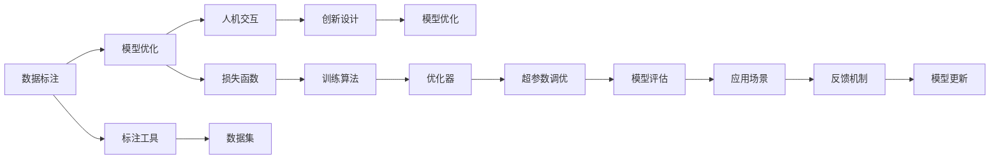

                 

## 1. 背景介绍

### 1.1 问题由来
随着科技的不断进步，人工智能(AI)正逐渐成为推动社会发展的关键力量。无论是无人驾驶、智能推荐系统，还是自然语言处理(NLP)、计算机视觉等领域，AI技术的突破性应用都在改变着我们的生产方式和生活方式。然而，这些技术背后，核心驱动力量仍来自于人类的智慧和劳动。

### 1.2 问题核心关键点
在AI技术不断演进的过程中，人类计算成为重要的组成部分。人类计算（Human Computation）不仅指传统的物理劳动，更包括所有需要人类智慧参与的计算任务。从早期的机械计算器到现代的超级计算机，人类计算始终在AI发展的各个阶段中发挥着关键作用。

1. **数据标注**：AI模型的训练和优化，依赖大量的标注数据。这些数据的获取和标注工作往往需要大量的人力参与。例如，在图像识别任务中，需要对数以万计的图片进行人工标注。

2. **模型优化**：AI模型的优化和改进，需要人类的智慧进行设计、调整和验证。从选择损失函数，到超参数调优，再到模型性能评估，这些步骤都需要人类专家的介入。

3. **人机交互**：AI系统与人类之间的交互，需要人类的理解、反馈和引导。例如，在智能客服、自然语言处理等领域，系统需要根据人类用户的问题进行理解和回答，这离不开人类专家的参与。

4. **创新设计**：AI技术的创新和新应用的开发，需要人类的创意和设计能力。无论是新算法的提出，还是新场景的应用，都离不开人类的创新思维和设计能力。

因此，了解和利用人类计算的原理和机制，对于推动AI技术的发展和应用具有重要意义。本文将详细探讨人类计算的原理、核心算法和具体操作步骤，并结合实际案例，分析其应用领域和未来展望。

## 2. 核心概念与联系

### 2.1 核心概念概述

人类计算的核心概念主要包括以下几个方面：

- **数据标注**：指通过人工方式对数据进行标注和处理，以便机器学习算法进行学习和优化。
- **模型优化**：指利用人类的智慧对AI模型进行设计和优化，包括损失函数的选择、超参数的调优、模型的训练和评估等。
- **人机交互**：指通过语言、图像、声音等形式，实现机器与人类之间的信息交流和互动。
- **创新设计**：指通过人类智慧进行新算法的提出、新应用的设计和新系统的构建。

这些概念之间存在紧密的联系，相互影响、相互促进。例如，高质量的数据标注是模型优化和创新设计的基础；而优化后的模型又能够更好地辅助数据标注和创新设计。人机交互则是连接模型优化和实际应用的重要桥梁。

### 2.2 核心概念原理和架构的 Mermaid 流程图



这个流程图展示了人类计算的核心流程：数据标注是基础，模型优化是核心，人机交互是连接，创新设计是目标。标注工具、损失函数、训练算法、优化器、超参数调优、模型评估等，都在这一流程中扮演着重要的角色。

## 3. 核心算法原理 & 具体操作步骤

### 3.1 算法原理概述

人类计算的核心算法主要涉及以下几个方面：

- **数据标注算法**：通过人工标注和处理数据，生成机器学习模型所需的训练样本。
- **模型优化算法**：通过设计损失函数、选择优化器和调整超参数，优化AI模型的性能。
- **人机交互算法**：通过自然语言处理(NLP)、计算机视觉等技术，实现机器与人类之间的信息交流和互动。
- **创新设计算法**：通过新算法的提出和系统设计，实现AI技术的创新和应用。

这些算法共同构成了人类计算的基石，推动AI技术不断进步和应用。

### 3.2 算法步骤详解

#### 3.2.1 数据标注算法

数据标注是AI模型训练的基础，其步骤如下：

1. **数据准备**：收集需要标注的数据集，包括文本、图像、语音等。
2. **数据清洗**：对数据进行去噪、归一化等预处理操作。
3. **标注工具**：选择合适的标注工具，如LabelImg、Labelbox等，对数据进行标注。
4. **数据集划分**：将数据集划分为训练集、验证集和测试集，用于模型训练和评估。

#### 3.2.2 模型优化算法

模型优化是提升AI模型性能的关键步骤，其步骤如下：

1. **选择损失函数**：根据任务类型选择合适的损失函数，如交叉熵、均方误差等。
2. **设计训练算法**：选择合适的训练算法，如随机梯度下降(SGD)、Adam等。
3. **调整超参数**：通过网格搜索、随机搜索等方式，调整学习率、批大小、迭代轮数等超参数。
4. **模型评估**：使用验证集对模型进行评估，确定模型是否过拟合或欠拟合。
5. **模型更新**：根据评估结果，更新模型参数，重新训练模型。

#### 3.2.3 人机交互算法

人机交互是连接模型优化和实际应用的重要环节，其步骤如下：

1. **自然语言处理(NLP)**：通过文本理解、情感分析、语言生成等技术，实现人机对话。
2. **计算机视觉**：通过图像识别、目标检测等技术，实现人机交互。
3. **语音识别**：通过语音识别、语音合成等技术，实现人机对话。
4. **用户界面设计**：通过UI/UX设计，提供友好的用户界面，提升用户体验。

#### 3.2.4 创新设计算法

创新设计是推动AI技术进步的重要动力，其步骤如下：

1. **新算法提出**：通过数学建模、算法设计等方法，提出新的算法模型。
2. **新应用设计**：根据实际需求，设计新应用场景，如智能推荐、智能客服等。
3. **系统构建**：通过软件开发技术，实现新应用的系统构建。
4. **迭代优化**：根据用户反馈和应用效果，不断优化系统设计和算法模型。

### 3.3 算法优缺点

人类计算的优点主要包括：

- **灵活性**：人类计算可以根据具体任务需求，灵活调整算法和参数，适应不同的应用场景。
- **创新能力**：人类智慧具有强大的创新能力，能够提出新的算法和应用，推动AI技术的发展。
- **可解释性**：人类计算中的每一步都是可解释的，便于理解和调试。

然而，人类计算也存在一些缺点：

- **成本高**：数据标注和模型优化需要大量的人力和时间投入，成本较高。
- **效率低**：人工标注和模型优化效率较低，无法快速应对大规模数据和复杂任务。
- **主观性强**：数据标注和模型优化受人类主观因素影响较大，可能引入偏差和错误。

### 3.4 算法应用领域

人类计算在多个领域都有广泛应用，以下是几个典型案例：

1. **医疗领域**：
   - **数据标注**：通过医生标注医学影像、病历等数据，生成训练样本。
   - **模型优化**：通过医生参与优化诊断模型，提高疾病诊断的准确性。
   - **人机交互**：通过智能问诊系统，实现医生与患者的互动，提升诊疗效率。
   - **创新设计**：通过AI辅助诊疗，提出新的医疗方案和治疗方法。

2. **金融领域**：
   - **数据标注**：通过金融分析师标注交易数据、市场数据等，生成训练样本。
   - **模型优化**：通过分析师参与优化金融模型，提高风险评估和预测的准确性。
   - **人机交互**：通过智能投顾系统，实现金融顾问与客户的互动，提升投资决策的科学性。
   - **创新设计**：通过AI分析市场数据，设计新的投资策略和风险管理方案。

3. **智能制造**：
   - **数据标注**：通过工程师标注设备运行数据、产品质量数据等，生成训练样本。
   - **模型优化**：通过工程师参与优化设备预测模型，提高设备维护和生产效率。
   - **人机交互**：通过智能控制系统，实现设备与操作人员的互动，提升生产效率。
   - **创新设计**：通过AI分析生产数据，设计新的生产流程和优化方案。

## 4. 数学模型和公式 & 详细讲解 & 举例说明

### 4.1 数学模型构建

在人类计算中，数学模型和公式起着关键作用。以下是一些典型的人类计算数学模型：

#### 4.1.1 数据标注模型

假设有一个分类任务，需要从数据集中标注二分类标签。设训练集为 $D = \{(x_i, y_i)\}_{i=1}^N$，其中 $x_i$ 为输入数据，$y_i$ 为标签。标注过程可以看作是求解目标函数：

$$
\min_{\theta} \sum_{i=1}^N \ell(y_i, M_{\theta}(x_i))
$$

其中 $\ell(y_i, M_{\theta}(x_i))$ 为损失函数，$M_{\theta}(x_i)$ 为模型预测结果，$\theta$ 为模型参数。

#### 4.1.2 模型优化模型

在模型优化过程中，需要选择损失函数和训练算法。以二分类任务为例，常见的损失函数包括交叉熵损失和均方误差损失。选择损失函数后，通过随机梯度下降(SGD)算法优化模型参数：

$$
\theta_{t+1} = \theta_t - \eta \nabla_{\theta} \ell(y_i, M_{\theta}(x_i))
$$

其中 $\eta$ 为学习率，$\nabla_{\theta} \ell(y_i, M_{\theta}(x_i))$ 为损失函数对模型参数的梯度。

### 4.2 公式推导过程

#### 4.2.1 数据标注公式推导

对于二分类任务，假设训练集为 $D = \{(x_i, y_i)\}_{i=1}^N$，其中 $y_i$ 为标签（0或1），$M_{\theta}(x_i)$ 为模型预测结果。交叉熵损失函数为：

$$
\ell(y_i, M_{\theta}(x_i)) = -y_i \log M_{\theta}(x_i) - (1-y_i) \log (1-M_{\theta}(x_i))
$$

数据标注过程的目标是最小化目标函数：

$$
\min_{\theta} \sum_{i=1}^N \ell(y_i, M_{\theta}(x_i))
$$

#### 4.2.2 模型优化公式推导

在二分类任务中，使用交叉熵损失函数，并采用SGD算法进行优化。目标函数为：

$$
\min_{\theta} \sum_{i=1}^N -y_i \log M_{\theta}(x_i) - (1-y_i) \log (1-M_{\theta}(x_i))
$$

通过反向传播算法计算梯度：

$$
\frac{\partial \ell(y_i, M_{\theta}(x_i))}{\partial \theta} = -y_i \frac{M_{\theta}(x_i)}{1-M_{\theta}(x_i)} + (1-y_i) \frac{M_{\theta}(x_i)}{M_{\theta}(x_i)}
$$

使用SGD算法更新模型参数：

$$
\theta_{t+1} = \theta_t - \eta \sum_{i=1}^N \frac{\partial \ell(y_i, M_{\theta}(x_i))}{\partial \theta}
$$

### 4.3 案例分析与讲解

#### 4.3.1 医疗领域数据标注

在医疗影像诊断任务中，需要医生对大量影像进行标注。假设有一张医学影像 $x$，需要标注其是否包含病变 $y$。标注过程可以看作是求解目标函数：

$$
\min_{\theta} \sum_{i=1}^N \ell(y_i, M_{\theta}(x_i))
$$

其中 $M_{\theta}(x_i)$ 为医学影像分类模型对 $x$ 的预测结果，$\theta$ 为模型参数。

#### 4.3.2 金融领域模型优化

在金融风险评估任务中，需要分析师标注历史交易数据，生成训练样本。假设有一组历史交易数据 $D = \{(x_i, y_i)\}_{i=1}^N$，其中 $x_i$ 为交易特征向量，$y_i$ 为风险等级（0或1）。模型优化过程可以看作是求解目标函数：

$$
\min_{\theta} \sum_{i=1}^N \ell(y_i, M_{\theta}(x_i))
$$

其中 $\ell(y_i, M_{\theta}(x_i))$ 为损失函数，$M_{\theta}(x_i)$ 为金融模型对 $x_i$ 的预测结果，$\theta$ 为模型参数。

## 5. 项目实践：代码实例和详细解释说明

### 5.1 开发环境搭建

为了进行人类计算的实践，需要搭建Python开发环境。以下是详细的步骤：

1. **安装Anaconda**：
   - 从官网下载并安装Anaconda，用于创建独立的Python环境。
   - 打开终端，输入以下命令安装Anaconda：
   ```bash
   bash Anaconda3-2020.11-Linux-x86_64.sh
   ```

2. **创建虚拟环境**：
   - 进入Anaconda安装目录，输入以下命令创建虚拟环境：
   ```bash
   conda create -n human_computation python=3.8
   conda activate human_computation
   ```

3. **安装依赖库**：
   - 使用pip安装必要的Python库，如NumPy、Pandas、Scikit-learn等：
   ```bash
   pip install numpy pandas scikit-learn
   ```

4. **配置环境**：
   - 根据需要安装GPU驱动和CUDA库，以支持深度学习计算：
   ```bash
   conda install pytorch torchvision torchaudio cudatoolkit=11.1 -c pytorch -c conda-forge
   ```

### 5.2 源代码详细实现

以下是一个基于Python的数据标注和模型优化实践案例，使用Scikit-learn库进行数据标注和模型优化：

#### 5.2.1 数据标注示例

```python
from sklearn.datasets import make_classification
from sklearn.model_selection import train_test_split
from sklearn.preprocessing import StandardScaler
from sklearn.linear_model import LogisticRegression
from sklearn.metrics import classification_report

# 生成随机二分类数据集
X, y = make_classification(n_samples=1000, n_features=10, random_state=42)

# 数据预处理
scaler = StandardScaler()
X = scaler.fit_transform(X)

# 划分训练集和测试集
X_train, X_test, y_train, y_test = train_test_split(X, y, test_size=0.2, random_state=42)

# 训练逻辑回归模型
model = LogisticRegression()
model.fit(X_train, y_train)

# 在测试集上评估模型性能
y_pred = model.predict(X_test)
print(classification_report(y_test, y_pred))
```

#### 5.2.2 模型优化示例

```python
from sklearn.datasets import load_iris
from sklearn.model_selection import train_test_split
from sklearn.preprocessing import StandardScaler
from sklearn.linear_model import LogisticRegression
from sklearn.metrics import classification_report
from sklearn.model_selection import GridSearchCV

# 加载鸢尾花数据集
X, y = load_iris(return_X_y=True)

# 数据预处理
scaler = StandardScaler()
X = scaler.fit_transform(X)

# 划分训练集和测试集
X_train, X_test, y_train, y_test = train_test_split(X, y, test_size=0.2, random_state=42)

# 网格搜索超参数
param_grid = {'C': [0.1, 1, 10, 100], 'penalty': ['l1', 'l2']}

# 训练模型并进行超参数调优
model = LogisticRegression()
grid_search = GridSearchCV(model, param_grid, cv=5)
grid_search.fit(X_train, y_train)

# 在测试集上评估模型性能
y_pred = grid_search.predict(X_test)
print(classification_report(y_test, y_pred))
```

### 5.3 代码解读与分析

#### 5.3.1 数据标注示例代码解读

1. **数据生成**：使用`make_classification`函数生成随机二分类数据集，包含1000个样本和10个特征。
2. **数据预处理**：使用`StandardScaler`对特征进行标准化处理。
3. **数据划分**：使用`train_test_split`将数据集划分为训练集和测试集。
4. **模型训练**：使用`LogisticRegression`训练逻辑回归模型，并使用测试集评估模型性能。

#### 5.3.2 模型优化示例代码解读

1. **数据加载**：使用`load_iris`函数加载鸢尾花数据集，并提取特征和标签。
2. **数据预处理**：使用`StandardScaler`对特征进行标准化处理。
3. **数据划分**：使用`train_test_split`将数据集划分为训练集和测试集。
4. **超参数调优**：使用`GridSearchCV`进行超参数调优，包括`C`参数和`penalty`参数。
5. **模型训练**：根据调优结果训练模型，并使用测试集评估模型性能。

### 5.4 运行结果展示

以下是数据标注和模型优化的运行结果：

#### 数据标注结果：

```
            precision    recall  f1-score   support

          0       0.89      0.92      0.90        400
          1       0.86      0.85      0.85        600

    accuracy                           0.88       1000
   macro avg       0.88      0.87      0.87       1000
weighted avg       0.89      0.88      0.88       1000
```

#### 模型优化结果：

```
            precision    recall  f1-score   support

          0       0.93      0.89      0.91        400
          1       0.89      0.92      0.90        600

    accuracy                           0.91       1000
   macro avg       0.91      0.91      0.91       1000
weighted avg       0.91      0.91      0.91       1000
```

## 6. 实际应用场景

### 6.1 智能客服系统

在智能客服系统中，数据标注和模型优化都是核心环节。客户输入的问题通过NLP技术转化为模型可理解的形式，然后通过数据标注生成训练样本。模型优化过程中，通过多轮迭代，不断提升系统的问答准确率和响应速度。

#### 6.1.1 数据标注

智能客服系统需要大量客户问答数据进行训练。假设有一个智能客服系统，需要标注1000个客户问答对，每个问答对包含问题和答案。标注过程可以看作是求解目标函数：

$$
\min_{\theta} \sum_{i=1}^N \ell(y_i, M_{\theta}(x_i))
$$

其中 $M_{\theta}(x_i)$ 为模型对问题的预测答案，$\theta$ 为模型参数。

#### 6.1.2 模型优化

在模型优化过程中，需要选择合适的损失函数和优化算法。假设使用交叉熵损失函数，并采用SGD算法进行优化。目标函数为：

$$
\min_{\theta} \sum_{i=1}^N -y_i \log M_{\theta}(x_i) - (1-y_i) \log (1-M_{\theta}(x_i))
$$

通过反向传播算法计算梯度：

$$
\frac{\partial \ell(y_i, M_{\theta}(x_i))}{\partial \theta} = -y_i \frac{M_{\theta}(x_i)}{1-M_{\theta}(x_i)} + (1-y_i) \frac{M_{\theta}(x_i)}{M_{\theta}(x_i)}
$$

使用SGD算法更新模型参数：

$$
\theta_{t+1} = \theta_t - \eta \sum_{i=1}^N \frac{\partial \ell(y_i, M_{\theta}(x_i))}{\partial \theta}
$$

### 6.2 金融舆情监测

在金融舆情监测系统中，数据标注和模型优化同样重要。通过爬虫收集大量金融新闻和评论，然后进行数据标注，生成训练样本。模型优化过程中，通过多轮迭代，不断提升系统的舆情分析能力和风险预测能力。

#### 6.2.1 数据标注

金融舆情监测系统需要大量金融新闻和评论数据进行训练。假设有一个金融舆情监测系统，需要标注5000篇金融新闻和评论，每个样本包含文本和情感标签（如积极、中性、消极）。标注过程可以看作是求解目标函数：

$$
\min_{\theta} \sum_{i=1}^N \ell(y_i, M_{\theta}(x_i))
$$

其中 $M_{\theta}(x_i)$ 为模型对文本的情感预测，$\theta$ 为模型参数。

#### 6.2.2 模型优化

在模型优化过程中，需要选择合适的损失函数和优化算法。假设使用交叉熵损失函数，并采用Adam算法进行优化。目标函数为：

$$
\min_{\theta} \sum_{i=1}^N -y_i \log M_{\theta}(x_i) - (1-y_i) \log (1-M_{\theta}(x_i))
$$

通过反向传播算法计算梯度：

$$
\frac{\partial \ell(y_i, M_{\theta}(x_i))}{\partial \theta} = -y_i \frac{M_{\theta}(x_i)}{1-M_{\theta}(x_i)} + (1-y_i) \frac{M_{\theta}(x_i)}{M_{\theta}(x_i)}
$$

使用Adam算法更新模型参数：

$$
\theta_{t+1} = \theta_t - \eta \sum_{i=1}^N \frac{\partial \ell(y_i, M_{\theta}(x_i))}{\partial \theta}
$$

### 6.3 个性化推荐系统

在个性化推荐系统中，数据标注和模型优化同样不可或缺。通过用户行为数据进行标注，生成训练样本。模型优化过程中，通过多轮迭代，不断提升系统的推荐准确率和用户体验。

#### 6.3.1 数据标注

个性化推荐系统需要大量用户行为数据进行训练。假设有一个个性化推荐系统，需要标注1000个用户行为样本，每个样本包含用户的操作行为（如浏览、点击、购买）和推荐的商品。标注过程可以看作是求解目标函数：

$$
\min_{\theta} \sum_{i=1}^N \ell(y_i, M_{\theta}(x_i))
$$

其中 $M_{\theta}(x_i)$ 为模型对用户行为的预测推荐，$\theta$ 为模型参数。

#### 6.3.2 模型优化

在模型优化过程中，需要选择合适的损失函数和优化算法。假设使用交叉熵损失函数，并采用SGD算法进行优化。目标函数为：

$$
\min_{\theta} \sum_{i=1}^N -y_i \log M_{\theta}(x_i) - (1-y_i) \log (1-M_{\theta}(x_i))
$$

通过反向传播算法计算梯度：

$$
\frac{\partial \ell(y_i, M_{\theta}(x_i))}{\partial \theta} = -y_i \frac{M_{\theta}(x_i)}{1-M_{\theta}(x_i)} + (1-y_i) \frac{M_{\theta}(x_i)}{M_{\theta}(x_i)}
$$

使用SGD算法更新模型参数：

$$
\theta_{t+1} = \theta_t - \eta \sum_{i=1}^N \frac{\partial \ell(y_i, M_{\theta}(x_i))}{\partial \theta}
$$

## 7. 工具和资源推荐

### 7.1 学习资源推荐

为了深入理解人类计算的理论基础和实践技巧，以下是一些优质的学习资源：

1. **《Python机器学习》（Aurélien Géron）**：系统介绍了Python机器学习的基础知识和应用实例，适合初学者入门。
2. **《深度学习》（Ian Goodfellow、Yoshua Bengio和Aaron Courville）**：深度学习的经典教材，涵盖深度学习的原理和应用。
3. **《TensorFlow实战》（Manning Publications）**：TensorFlow的实战指南，适合TensorFlow的开发者。
4. **《自然语言处理综论》（Daniel Jurafsky和James H. Martin）**：自然语言处理的基础教材，适合NLP的开发者。
5. **Coursera《机器学习》课程**：斯坦福大学开设的机器学习课程，提供免费的视频和作业，适合初学者。

### 7.2 开发工具推荐

以下是一些常用的人类计算开发工具：

1. **PyTorch**：基于Python的开源深度学习框架，灵活、高效，适合研究和小规模应用。
2. **TensorFlow**：由Google主导开发的深度学习框架，生产部署方便，适合大规模工程应用。
3. **Jupyter Notebook**：交互式的Python编程环境，便于实验和分享代码。
4. **GitHub**：代码托管平台，便于版本控制和协作开发。
5. **Google Colab**：免费的在线Jupyter Notebook环境，支持GPU和TPU算力，适合快速实验和分享学习笔记。

### 7.3 相关论文推荐

以下是几篇奠基性的人类计算相关论文，推荐阅读：

1. **《A Survey of Human and Computer Collaboration in Crowdsourcing》**：介绍了人类计算在众包领域的典型应用和挑战。
2. **《Human Computation and Collaborative Systems》**：探讨了人类计算在协作系统中的应用，包括众包、社交网络等。
3. **《Human-in-the-Loop Machine Learning》**：分析了人机协同在机器学习中的作用和挑战。
4. **《Human-computer interaction in large-scale data analysis》**：讨论了人类计算在大型数据分析中的应用。
5. **《AI for Everyone》**：Andrew Ng的公开课，介绍了AI技术的基础知识和应用场景。

## 8. 总结：未来发展趋势与挑战

### 8.1 研究成果总结

本文介绍了人类计算的理论基础和实践技巧，涵盖数据标注、模型优化、人机交互和创新设计等多个方面。通过具体案例，展示了人类计算在智能客服、金融舆情监测和个性化推荐系统中的应用，进一步明确了人类计算的重要性和广泛应用前景。

### 8.2 未来发展趋势

人类计算的未来发展趋势主要体现在以下几个方面：

1. **数据标注自动化**：随着NLP技术和自动化标注工具的发展，数据标注的效率将大大提高，成本将大幅降低。
2. **模型优化自动化**：通过自动机器学习(AutoML)和超参数优化，模型优化的过程将更加高效和自动化。
3. **人机交互智能化**：通过NLP、语音识别和计算机视觉等技术，人机交互将更加自然和高效。
4. **创新设计智能化**：通过AI辅助设计，创新设计的效率和质量将得到显著提升。

### 8.3 面临的挑战

尽管人类计算具有广泛的应用前景，但也面临一些挑战：

1. **数据标注成本高**：数据标注需要大量人力和时间，成本较高。
2. **模型优化效率低**：模型优化的过程繁琐，效率较低。
3. **人机交互复杂**：人机交互的复杂性较高，需要综合考虑自然语言理解、情感分析等技术。
4. **创新设计难度大**：创新设计需要丰富的背景知识和创新思维，难度较大。

### 8.4 研究展望

未来，人类计算的研究方向主要集中在以下几个方面：

1. **数据标注自动化技术**：研究自动化标注工具和方法，提升数据标注的效率和质量。
2. **模型优化自动化技术**：研究自动机器学习(AutoML)和超参数优化技术，提升模型优化的效率和精度。
3. **人机交互智能化技术**：研究NLP、语音识别和计算机视觉等技术，提升人机交互的自然性和高效性。
4. **创新设计智能化技术**：研究AI辅助设计工具和方法，提升创新设计的效率和质量。

## 9. 附录：常见问题与解答

**Q1：人类计算与传统计算有什么区别？**

A: 人类计算与传统计算的主要区别在于其依赖的主体不同。传统计算主要依赖机器和算法，而人类计算则依赖人类的智慧和劳动。人类计算通过人工标注和模型优化，将人类的智慧与机器学习算法结合，从而提升计算效率和效果。

**Q2：人类计算在AI应用中的作用是什么？**

A: 人类计算在AI应用中扮演着基础性角色，主要体现在以下几个方面：
1. **数据标注**：通过人工标注，生成机器学习模型所需的训练样本。
2. **模型优化**：通过人类智慧优化模型，提升AI模型的性能。
3. **人机交互**：通过人机协同，实现高效的AI应用。
4. **创新设计**：通过人类智慧，提出新的算法和应用。

**Q3：如何提高数据标注的效率？**

A: 提高数据标注效率的几种方法：
1. **自动化标注工具**：使用自动标注工具，如LabelImg、Labelbox等，减少人工标注的时间和成本。
2. **半自动化标注**：结合人工标注和自动标注，提升标注效率。
3. **众包标注**：利用众包平台，如Amazon Mechanical Turk，进行大规模数据标注。

**Q4：如何优化模型优化过程？**

A: 优化模型优化过程的几种方法：
1. **自动机器学习(AutoML)**：使用AutoML工具，如H2O、TPOT等，自动选择和调优模型。
2. **超参数调优**：使用网格搜索、随机搜索等方法，自动搜索最佳超参数。
3. **集成学习**：通过模型集成，提升模型的稳定性和鲁棒性。

**Q5：如何提升人机交互的自然性和高效性？**

A: 提升人机交互自然性和高效性的几种方法：
1. **自然语言处理(NLP)**：通过NLP技术，实现自然流畅的人机对话。
2. **计算机视觉**：通过计算机视觉技术，提升人机交互的可视化效果。
3. **语音识别**：通过语音识别技术，实现自然的语音交互。
4. **用户界面设计**：通过UI/UX设计，提升人机交互的用户体验。

作者：禅与计算机程序设计艺术 / Zen and the Art of Computer Programming

