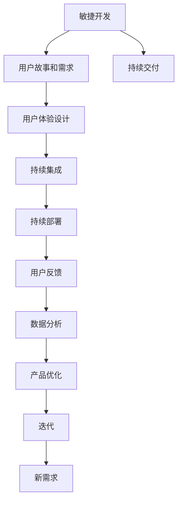

                 

## 1. 背景介绍

### 1.1 问题由来
在软件开发领域，一个核心挑战是如何将一个创新的想法快速转化为可用的产品。这不仅需要技术上的实现，还需要对市场、用户需求、商业模式等有深刻的理解。近年来，敏捷开发、DevOps、产品驱动的工程实践等理念的兴起，都在不同程度上推动了这一进程。然而，尽管这些方法有所成效，许多团队仍然难以在快速迭代与持续交付之间找到平衡，导致项目延期、功能变更频繁、用户需求响应缓慢等问题。

### 1.2 问题核心关键点
快速实现从想法到产品的过程，关键在于以下几个方面：

- **跨部门协作**：产品开发往往需要跨部门协作，包括产品、设计、开发、测试、运维等多个团队。如何在不同部门间高效沟通、协作，是一个关键点。

- **需求理解与分析**：准确理解用户需求，并将其转化为可实现的功能，是产品开发的基础。

- **敏捷与迭代**：采用敏捷开发和快速迭代的方法，能够更快响应市场和用户反馈，提升产品竞争力。

- **持续交付与部署**：建立自动化流水线，实现快速构建、测试和部署，能够大幅缩短产品从想法到市场的时间。

- **用户体验优化**：不断收集用户反馈，迭代改进产品体验，提升用户满意度。

- **数据分析与优化**：通过数据分析，识别产品问题、优化产品功能，实现精准定位。

### 1.3 问题研究意义
快速实现从想法到产品，对于提升团队效率、缩短产品开发周期、增强市场竞争力具有重要意义：

- **提高开发效率**：通过跨部门协作、敏捷开发等方法，能够显著提高开发效率，缩短项目周期。
- **增强市场响应**：快速迭代和持续交付，使得团队能够更快地响应市场变化和用户需求。
- **提升用户满意度**：通过不断优化用户体验，提升用户满意度，增强用户粘性。
- **优化资源配置**：通过数据分析和反馈，优化资源配置，提升资源利用效率。

## 2. 核心概念与联系

### 2.1 核心概念概述

为更好地理解从想法到产品的快速实现过程，本节将介绍几个密切相关的核心概念：

- **敏捷开发**：一种以用户为中心、迭代式、增量式软件开发方法，强调快速响应变化、持续交付。
- **DevOps**：一种结合软件开发和运维的实践理念，旨在通过持续集成、持续部署等方法，实现快速交付和高可用性。
- **持续交付**：在软件开发中，持续交付是指在短时间内频繁地将代码交付给客户，以确保产品快速上市。
- **用户故事和需求**：在敏捷开发中，用户故事和需求文档用于描述用户需求，指导产品设计和开发。
- **用户体验设计**：关注用户在使用产品时的体验，通过交互设计、界面设计等方法提升产品可用性。
- **数据分析**：通过收集和分析用户数据，识别产品问题，指导产品优化和迭代。

这些核心概念之间的逻辑关系可以通过以下Mermaid流程图来展示：



这个流程图展示了大语言模型的核心概念及其之间的关系：

1. 敏捷开发提供快速迭代和交付的方法。
2. 用户故事和需求指导产品设计和开发。
3. 用户体验设计提升产品可用性。
4. 持续集成和持续部署保证快速交付。
5. 用户反馈和数据分析指导产品优化。
6. 产品优化推动新需求生成。
7. 新需求进入下一个迭代循环。

这些概念共同构成了从想法到产品快速实现的核心框架，使其能够在各种场景下发挥作用。通过理解这些核心概念，我们可以更好地把握从想法到产品的实现流程。

## 3. 核心算法原理 & 具体操作步骤
### 3.1 算法原理概述

从想法到产品的快速实现，本质上是一个迭代优化的过程。其核心思想是：通过敏捷开发和持续交付的方法，快速构建产品原型，收集用户反馈，并通过数据分析和用户体验优化，不断迭代提升产品性能。

形式化地，假设产品的初始想法为 $I$，经过 $n$ 次迭代，最终实现为 $P_n$，则产品实现过程可以表示为：

$$
P_n = f(I, n)
$$

其中 $f$ 为迭代函数，表示从初始想法到最终产品实现的过程。

### 3.2 算法步骤详解

从想法到产品的快速实现，一般包括以下几个关键步骤：

**Step 1: 产品构思与规划**
- 定义产品目标和愿景，明确产品定位。
- 收集相关需求，进行需求分析和优先级排序。
- 制定产品路线图和发布计划。

**Step 2: 敏捷开发与迭代**
- 组建跨部门团队，包括产品、设计、开发、测试等角色。
- 使用敏捷开发框架（如Scrum）进行迭代，每个迭代周期通常为2-4周。
- 每个迭代开始时，确定任务列表和优先级。
- 团队成员进行并行开发，定期进行站会、代码评审、设计评审等活动。
- 每个迭代结束时，进行功能演示和反馈收集。

**Step 3: 持续集成与部署**
- 搭建持续集成(CI)环境，自动化构建和测试。
- 使用容器化技术（如Docker）打包应用，确保环境一致性。
- 设置持续部署(CD)管道，自动化部署到生产环境。
- 使用监控工具（如ELK Stack）实时监控系统状态。

**Step 4: 用户体验优化**
- 设计原型和用户界面(UI)，通过用户测试获取反馈。
- 进行A/B测试，比较不同方案的效果。
- 根据用户反馈和数据指标，不断优化用户体验。

**Step 5: 数据分析与优化**
- 设置关键绩效指标(KPI)，监控产品表现。
- 收集用户行为数据，分析用户需求和行为模式。
- 使用机器学习和大数据技术，优化产品功能。
- 定期进行用户调研，获取用户反馈。

### 3.3 算法优缺点

从想法到产品的快速实现方法，具有以下优点：
1. 快速迭代：通过敏捷开发和持续交付，能够快速响应市场和用户需求，缩短产品上市时间。
2. 灵活性高：敏捷开发方法强调快速响应变化，能够适应市场和技术环境的快速变化。
3. 用户体验优化：通过不断优化用户体验，提升用户满意度，增强用户粘性。
4. 数据分析驱动：通过数据分析指导产品优化和迭代，实现精准定位。

同时，该方法也存在一定的局限性：
1. 资源投入高：跨部门协作和持续交付需要较高的人力和技术资源投入。
2. 沟通复杂：不同部门之间的沟通和协作可能存在协调难度。
3. 风险控制难：快速迭代可能导致质量控制难度增加，风险控制不足。
4. 技术债务积累：频繁变更可能导致技术债务积累，系统复杂度增加。

尽管存在这些局限性，但就目前而言，快速实现从想法到产品的方法仍是软件开发领域的主流实践。未来相关研究的重点在于如何进一步提高迭代效率，降低沟通成本，增强质量控制，避免技术债务。

### 3.4 算法应用领域

从想法到产品的快速实现方法，在软件开发和产品开发中已经得到了广泛的应用，适用于各种规模和类型的项目，例如：

- 移动应用开发：快速开发和迭代移动应用，获取用户反馈，不断优化用户体验。
- 网站和web应用开发：构建高可用性的网站和web应用，通过持续集成和部署，快速交付新功能。
- 企业级系统开发：开发企业级应用，采用敏捷开发方法，提升开发效率和用户满意度。
- 产品设计和原型制作：设计原型和用户界面(UI)，通过用户测试和数据分析，不断优化产品设计。
- 游戏开发：快速迭代游戏开发过程，通过A/B测试和用户反馈，优化游戏体验。

除了这些常见应用外，快速实现从想法到产品的方法还被创新性地应用到更多场景中，如工业自动化、智能制造、智慧城市等，为传统行业数字化转型升级提供了新的技术路径。

## 4. 数学模型和公式 & 详细讲解 & 举例说明
### 4.1 数学模型构建

本节将使用数学语言对从想法到产品的快速实现过程进行更加严格的刻画。

假设产品的初始想法为 $I$，经过 $n$ 次迭代，最终实现为 $P_n$，则产品实现过程可以表示为：

$$
P_n = f(I, n)
$$

其中 $f$ 为迭代函数，表示从初始想法到最终产品实现的过程。

为了更好地理解这个迭代过程，我们可以将其拆解为多个子过程，例如用户故事和需求分析、敏捷开发、用户体验优化、数据分析与优化等。每个子过程可以用数学公式来表示。

### 4.2 公式推导过程

以下我们以敏捷开发和持续交付为例，推导迭代函数 $f$ 的表达形式。

**敏捷开发迭代函数**：

假设每次迭代的时间为 $T$，敏捷团队的规模为 $S$，每个迭代周期内完成的用户故事数为 $N$，则每次迭代后的产品功能增长率为：

$$
G = \frac{N}{S} \cdot \frac{T}{1}
$$

其中 $S$ 为开发团队规模，$T$ 为迭代周期，$N$ 为每次迭代完成的用户故事数。

经过 $n$ 次迭代后，产品功能总增量为：

$$
G_n = n \cdot G
$$

因此，经过 $n$ 次迭代后的产品功能实现 $P_n$ 可以表示为：

$$
P_n = I + G_n = I + n \cdot G
$$

其中 $I$ 为产品初始想法，$G$ 为每次迭代的产品功能增长率，$n$ 为迭代次数。

**持续交付函数**：

假设每次迭代的时间为 $T$，每次迭代的自动化测试时间为 $T_{test}$，持续集成和持续部署的自动化时间为 $T_{cd}$，则每次迭代后的总交付时间 $D$ 为：

$$
D = T + T_{test} + T_{cd}
$$

因此，经过 $n$ 次迭代后的总交付时间 $T_n$ 可以表示为：

$$
T_n = n \cdot D
$$

经过 $n$ 次迭代后的产品交付时间 $T_{prod}$ 可以表示为：

$$
T_{prod} = I + T_n = I + n \cdot D
$$

其中 $I$ 为产品初始想法，$D$ 为每次迭代的总交付时间，$n$ 为迭代次数。

### 4.3 案例分析与讲解

下面我们以开发一款移动应用为例，说明如何应用上述数学模型来指导从想法到产品的快速实现。

假设该应用的初始想法为 $I$，开发团队规模为 $S=10$，每个迭代周期为 $T=2$ 周，每次迭代完成的平均用户故事数为 $N=20$，每次迭代的总交付时间为 $D=3$ 天。

**敏捷开发**：

- 每次迭代后的产品功能增长率 $G$ 为 $\frac{20}{10} \cdot \frac{7}{1} = 14$。
- 经过 $n$ 次迭代后的产品功能实现 $P_n$ 为 $I + n \cdot 14$。

**持续交付**：

- 每次迭代后的总交付时间 $D$ 为 $3$ 天。
- 经过 $n$ 次迭代后的总交付时间 $T_n$ 为 $n \cdot 3$ 天。
- 经过 $n$ 次迭代后的产品交付时间 $T_{prod}$ 为 $I + 3n$ 天。

通过上述数学模型，我们可以得出该应用的敏捷开发和持续交付过程的详细计算公式。在实际开发中，我们根据具体需求和环境，调整这些参数，以适应不同的产品和团队需求。

## 5. 项目实践：代码实例和详细解释说明
### 5.1 开发环境搭建

在进行快速实现从想法到产品的实践前，我们需要准备好开发环境。以下是使用Python进行DevOps开发的环境配置流程：

1. 安装Anaconda：从官网下载并安装Anaconda，用于创建独立的Python环境。

2. 创建并激活虚拟环境：
```bash
conda create -n devops-env python=3.8 
conda activate devops-env
```

3. 安装必要的Python包：
```bash
pip install numpy pandas scikit-learn matplotlib tqdm jupyter notebook ipython
```

4. 配置Git和GitHub：
```bash
git init
git remote add origin https://github.com/<your-repo-url>
```

完成上述步骤后，即可在`devops-env`环境中开始开发实践。

### 5.2 源代码详细实现

下面我们以构建一款移动应用为例，给出使用Jenkins和Docker进行持续集成和持续部署的PyTorch代码实现。

首先，定义一个简单的Jenkins流水线：

```yaml
pipeline {
    agent none

    stages {
        stage('Build') {
            steps {
                sh 'echo "Building the project..."'
                sh 'python build.py'
            }
        }

        stage('Test') {
            steps {
                sh 'echo "Running tests..."'
                sh 'python test.py'
            }
        }

        stage('Package') {
            steps {
                sh 'echo "Packaging the project..."'
                sh 'python package.py'
            }
        }

        stage('Deploy') {
            steps {
                sh 'echo "Deploying the project..."'
                sh 'docker push <your-docker-repo-url>/<your-app-name>:latest'
            }
        }
    }
}
```

然后，定义一个简单的Dockerfile：

```dockerfile
FROM python:3.8
WORKDIR /app
COPY requirements.txt .
RUN pip install --no-cache-dir -r requirements.txt
COPY . .
CMD ["python", "app.py"]
```

最后，编写一个简单的Python应用程序，用于构建和部署：

```python
import os
import requests
import json

class BuildApp:
    def __init__(self):
        self.build_dir = 'build'
        self.test_dir = 'test'
        self.package_dir = 'package'
        self.deploy_url = 'https://hub.docker.com/api/v1/repo/<your-repo-url>/<your-app-name>/push'

    def build(self):
        os.system(f'python build.py > {self.build_dir}/app')

    def test(self):
        os.system(f'python test.py > {self.test_dir}/test-results.txt')

    def package(self):
        os.system(f'python package.py > {self.package_dir}/app.tar.gz')

    def deploy(self):
        with open(f'{self.package_dir}/app.tar.gz') as f:
            response = requests.post(self.deploy_url, data={'data': f.read()})
            if response.status_code == 200:
                print('Deploy succeeded!')
            else:
                print('Deploy failed:', response.text)

if __name__ == '__main__':
    app = BuildApp()
    app.build()
    app.test()
    app.package()
    app.deploy()
```

### 5.3 代码解读与分析

让我们再详细解读一下关键代码的实现细节：

**Jenkins流水线**：
- 通过配置YAML格式的流水线脚本，定义了构建、测试、打包、部署四个阶段。
- 每个阶段包含一系列命令，用于执行具体任务。

**Dockerfile**：
- 从Python 3.8官方镜像开始，安装必要的Python包和依赖。
- 复制应用代码到工作目录，并设置CMD命令，指定启动应用程序的命令。

**Python应用程序**：
- 定义了构建、测试、打包、部署四个方法，分别对应Jenkins流水线的四个阶段。
- 在每个方法中，使用`os.system`调用具体命令，完成相应任务。
- 在`__main__`中，按照顺序调用四个方法，完成完整的项目构建和部署流程。

通过上述代码，我们可以看到，通过Jenkins和Docker实现持续集成和持续部署，能够显著提升从想法到产品的实现效率。开发者可以将更多精力放在应用程序的核心功能开发上，而不必关注构建、测试、部署等辅助任务。

## 6. 实际应用场景
### 6.1 智能客服系统

基于快速实现从想法到产品的方法，智能客服系统可以快速迭代和持续交付，提升客户咨询体验和问题解决效率。

在技术实现上，可以收集企业内部的历史客服对话记录，将问题和最佳答复构建成监督数据，在此基础上对预训练语言模型进行微调。微调后的语言模型能够自动理解用户意图，匹配最合适的答案模板进行回复。对于客户提出的新问题，还可以接入检索系统实时搜索相关内容，动态组织生成回答。如此构建的智能客服系统，能大幅提升客户咨询体验和问题解决效率。

### 6.2 金融舆情监测

金融机构需要实时监测市场舆论动向，以便及时应对负面信息传播，规避金融风险。传统的人工监测方式成本高、效率低，难以应对网络时代海量信息爆发的挑战。基于快速实现从想法到产品的方法，金融舆情监测系统可以快速构建和部署，提升监测效率和精准度。

具体而言，可以收集金融领域相关的新闻、报道、评论等文本数据，并对其进行主题标注和情感标注。在此基础上，对预训练语言模型进行微调，使其能够自动判断文本属于何种主题，情感倾向是正面、中性还是负面。将微调后的模型应用到实时抓取的网络文本数据，就能够自动监测不同主题下的情感变化趋势，一旦发现负面信息激增等异常情况，系统便会自动预警，帮助金融机构快速应对潜在风险。

### 6.3 个性化推荐系统

当前的推荐系统往往只依赖用户的历史行为数据进行物品推荐，无法深入理解用户的真实兴趣偏好。基于快速实现从想法到产品的方法，个性化推荐系统可以更好地挖掘用户行为背后的语义信息，从而提供更精准、多样的推荐内容。

在实践中，可以收集用户浏览、点击、评论、分享等行为数据，提取和用户交互的物品标题、描述、标签等文本内容。将文本内容作为模型输入，用户的后续行为（如是否点击、购买等）作为监督信号，在此基础上对预训练语言模型进行微调。微调后的模型能够从文本内容中准确把握用户的兴趣点。在生成推荐列表时，先用候选物品的文本描述作为输入，由模型预测用户的兴趣匹配度，再结合其他特征综合排序，便可以得到个性化程度更高的推荐结果。

### 6.4 未来应用展望

随着快速实现从想法到产品的方法不断发展，基于微调的方法将在更多领域得到应用，为传统行业带来变革性影响。

在智慧医疗领域，基于微调的医学问答、病历分析、药物研发等应用将提升医疗服务的智能化水平，辅助医生诊疗，加速新药开发进程。

在智能教育领域，微调技术可应用于作业批改、学情分析、知识推荐等方面，因材施教，促进教育公平，提高教学质量。

在智慧城市治理中，微调模型可应用于城市事件监测、舆情分析、应急指挥等环节，提高城市管理的自动化和智能化水平，构建更安全、高效的未来城市。

此外，在企业生产、社会治理、文娱传媒等众多领域，基于快速实现从想法到产品的方法的人工智能应用也将不断涌现，为经济社会发展注入新的动力。相信随着技术的日益成熟，快速实现从想法到产品的方法必将成为软件开发的重要范式，推动人工智能技术在垂直行业的规模化落地。

## 7. 工具和资源推荐
### 7.1 学习资源推荐

为了帮助开发者系统掌握快速实现从想法到产品的理论基础和实践技巧，这里推荐一些优质的学习资源：

1. 《敏捷软件开发实践》：由Eric Ries所著，介绍了敏捷开发的核心思想和实践方法，是敏捷开发的重要参考书。

2. DevOps: Continuous Delivery and Continuous Deployment：由George Q. Schwaber和Patrick Debois所著，系统讲解了DevOps的原理和实践。

3. 《持续交付：构建、测试和部署现代应用程序》：由Jez Humble和David Farley所著，介绍了持续交付的基本原理和实现方法。

4. 《UML基础》：由Booch所著，介绍了统一建模语言UML的基础知识和应用方法。

5. 《精益创业》：由Eric Ries所著，介绍了精益创业的核心思想和实践方法。

通过对这些资源的学习实践，相信你一定能够快速掌握快速实现从想法到产品的精髓，并用于解决实际的开发问题。
###  7.2 开发工具推荐

高效的开发离不开优秀的工具支持。以下是几款用于快速实现从想法到产品的常用工具：

1. Jenkins：开源的持续集成和持续交付(CI/CD)工具，支持丰富的插件，用于构建、测试、部署自动化。

2. Docker：开源的容器化技术，用于实现应用部署的一致性和可移植性。

3. GitLab CI/CD：GitLab提供的CI/CD工具，集成在GitLab平台中，支持高度自动化和可视化。

4. GitHub Actions：GitHub提供的CI/CD工具，支持持续集成和自动化部署。

5. GitHub Pages：GitHub提供的静态网站托管服务，用于快速部署和分享代码。

6. JIRA：强大的项目管理工具，支持敏捷开发、问题追踪、任务分配等功能。

合理利用这些工具，可以显著提升从想法到产品的开发效率，加快创新迭代的步伐。

### 7.3 相关论文推荐

快速实现从想法到产品的方法，源于学界的持续研究。以下是几篇奠基性的相关论文，推荐阅读：

1. Agile Manifesto：敏捷开发宣言，定义了敏捷开发的核心价值观和原则。

2. Continuous Delivery: Reliable Software Releases through Build, Test, and Deployment Automation：由Jez Humble和David Farley所著，介绍了持续交付的基本原理和实现方法。

3. Design Patterns：由Erich Gamma等所著，介绍了经典的软件设计模式，是软件工程的重要参考书。

4. Designing Data-Intensive Applications：由Martin Kleppmann所著，介绍了大数据架构和实现方法。

5. Lean Startup：由Eric Ries所著，介绍了精益创业的核心思想和实践方法。

这些论文代表了大语言模型微调技术的发展脉络。通过学习这些前沿成果，可以帮助研究者把握学科前进方向，激发更多的创新灵感。

## 8. 总结：未来发展趋势与挑战
### 8.1 总结

本文对快速实现从想法到产品的快速实现过程进行了全面系统的介绍。首先阐述了快速实现从想法到产品的背景和意义，明确了敏捷开发、持续交付等方法的核心价值。其次，从原理到实践，详细讲解了快速实现从想法到产品的数学模型和关键步骤，给出了具体代码实例。同时，本文还广泛探讨了快速实现从想法到产品在多个行业领域的应用前景，展示了其巨大的潜力。此外，本文精选了快速实现从想法到产品的方法的各类学习资源，力求为读者提供全方位的技术指引。

通过本文的系统梳理，可以看到，快速实现从想法到产品的方法正在成为软件开发领域的重要范式，极大地提高了开发效率、缩短了产品上市时间、增强了市场响应和用户满意度。未来，伴随敏捷开发和持续交付方法的不断演进，相信快速实现从想法到产品的方法将进一步提升软件开发的质量和效率，为软件开发带来革命性的变化。

### 8.2 未来发展趋势

展望未来，快速实现从想法到产品的方法将呈现以下几个发展趋势：

1. 敏捷开发和持续交付将进一步普及。随着敏捷开发理念的深入人心，越来越多的企业将采用敏捷开发方法，提升开发效率和用户满意度。

2. 云原生技术将得到广泛应用。云原生技术包括容器化、微服务、自动化等方法，将进一步推动软件开发和运维的自动化，提升系统的可扩展性和可维护性。

3. DevOps将进一步融合。DevOps融合了软件开发和运维的各个环节，通过持续集成、持续部署等方法，实现快速构建、测试和部署，提升系统稳定性和用户体验。

4. 人工智能技术将进一步融入。人工智能技术，如自然语言处理、机器学习、数据科学等，将进一步融入软件开发，提升产品的智能性和用户体验。

5. 多模态开发将得到推广。多模态开发将融合视觉、语音、文本等多种模态数据，提升系统的感知能力和交互体验。

以上趋势凸显了快速实现从想法到产品的方法的广阔前景。这些方向的探索发展，必将进一步提升软件开发的质量和效率，为软件开发带来革命性的变化。

### 8.3 面临的挑战

尽管快速实现从想法到产品的方法已经取得了显著成效，但在迈向更加智能化、普适化应用的过程中，它仍面临着诸多挑战：

1. 技术债务积累。敏捷开发和快速迭代可能导致技术债务积累，系统复杂度增加，维护成本提高。

2. 团队协作难度。跨部门协作和持续交付需要较高的人力和技术资源投入，沟通成本较高。

3. 需求变化应对。敏捷开发强调快速响应变化，但频繁变更可能导致需求不明确，功能实现不稳定。

4. 质量控制不足。快速迭代可能导致质量控制难度增加，缺陷和错误风险较高。

5. 自动化工具限制。现有自动化工具可能无法满足复杂的需求和流程，需要定制化开发。

6. 用户体验优化难度。用户体验优化需要跨团队协作和用户反馈，实施难度较高。

正视这些挑战，积极应对并寻求突破，将是大语言模型微调技术走向成熟的必由之路。相信随着学界和产业界的共同努力，这些挑战终将一一被克服，快速实现从想法到产品的方法必将在构建人机协同的智能时代中扮演越来越重要的角色。

### 8.4 研究展望

面对快速实现从想法到产品所面临的种种挑战，未来的研究需要在以下几个方面寻求新的突破：

1. 探索更高效敏捷开发框架。开发更高效敏捷开发框架，提高开发效率和用户满意度。

2. 开发更强大持续交付工具。开发更强大的持续交付工具，提升系统稳定性和自动化水平。

3. 研究更智能软件开发模型。研究更智能软件开发模型，提升系统的智能性和用户体验。

4. 引入更多跨学科技术。引入更多跨学科技术，如自然语言处理、机器学习、数据科学等，提升系统的感知能力和交互体验。

5. 加强自动化工具开发。加强自动化工具开发，提升开发效率和系统稳定性。

6. 优化用户体验优化流程。优化用户体验优化流程，提高用户体验优化效果。

这些研究方向的探索，必将引领快速实现从想法到产品的方法迈向更高的台阶，为软件开发带来革命性的变化。面向未来，快速实现从想法到产品的方法还需要与其他人工智能技术进行更深入的融合，如知识表示、因果推理、强化学习等，多路径协同发力，共同推动软件开发的质量和效率。只有勇于创新、敢于突破，才能不断拓展软件开发的边界，让软件开发技术更好地服务于社会和经济。

## 9. 附录：常见问题与解答

**Q1：如何选择合适的敏捷开发框架？**

A: 选择合适的敏捷开发框架需要考虑多个因素，包括项目规模、团队规模、开发环境、需求复杂度等。常用的敏捷开发框架包括Scrum、Kanban、Lean等，每种框架都有其适用的场景。

**Q2：持续集成和持续部署如何实现？**

A: 持续集成和持续部署通常通过CI/CD工具实现。常用的CI/CD工具包括Jenkins、GitLab CI/CD、GitHub Actions等。通过配置YAML脚本，定义构建、测试、部署等步骤，实现自动化构建和部署。

**Q3：如何处理敏捷开发中的技术债务？**

A: 技术债务通常由频繁变更和复杂架构引起。解决技术债务的方法包括重构代码、拆分复杂模块、使用设计模式等。定期进行代码审计和技术审查，可以有效识别和处理技术债务。

**Q4：敏捷开发和持续交付中的风险控制如何实现？**

A: 风险控制通常通过代码审查、单元测试、集成测试、自动化测试等手段实现。通过持续集成和持续部署，及时发现和修复代码缺陷，提高系统的稳定性和可靠性。

**Q5：敏捷开发和持续交付中的用户体验优化如何实现？**

A: 用户体验优化通常通过用户测试、A/B测试、数据分析等手段实现。通过持续迭代，不断优化产品功能和界面设计，提升用户体验。

这些问题是快速实现从想法到产品过程中常见的挑战和疑问，通过理解和解决这些问题，可以快速提高敏捷开发和持续交付的效率和效果。

---

作者：禅与计算机程序设计艺术 / Zen and the Art of Computer Programming

