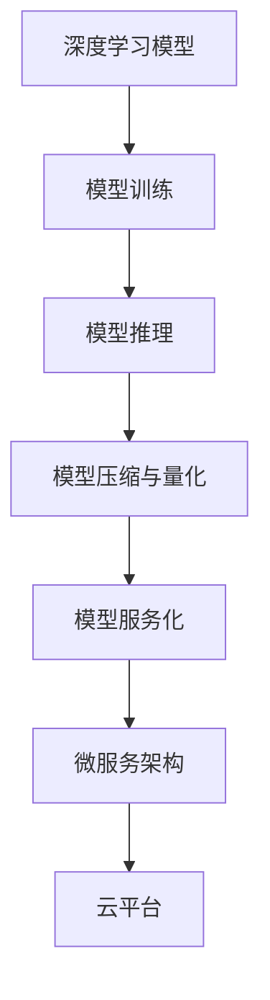

                 

# 从模型到产品：AI Web应用部署实践

> 关键词：人工智能,Web应用,深度学习模型,模型部署,算法优化,云平台,微服务架构

## 1. 背景介绍

### 1.1 问题由来
在当今数字化时代，AI技术的应用已经渗透到各个领域，特别是在Web应用中，AI的融入极大地提升了用户体验和业务效率。然而，将AI模型成功部署到Web应用中，却不是一件简单的事情。模型开发过程中，模型训练的效率、模型的推理速度、模型的存储需求、模型的安全性以及模型的可扩展性等问题都可能成为障碍。本文旨在探讨如何将训练好的AI模型部署到Web应用中，并介绍一些实用的方法和工具，以帮助开发者更好地解决这些问题。

### 1.2 问题核心关键点
- **模型训练与推理的优化**：如何在保证模型精度的同时，优化模型训练与推理过程，提升效率。
- **模型压缩与量化**：如何通过模型压缩与量化技术，减少模型存储和推理的需求，提升实时性。
- **模型服务化与API设计**：如何将模型封装成Web服务，通过API对外提供服务，提升模型应用的可扩展性。
- **云平台与微服务架构**：如何利用云平台和微服务架构，实现模型的弹性部署与资源优化。
- **安全性与隐私保护**：如何在部署过程中，确保模型的安全性与用户隐私保护。

### 1.3 问题研究意义
了解如何将AI模型部署到Web应用中，对于提高AI技术的落地效率、扩展应用范围、保障模型安全性等方面具有重要意义：

1. **提高效率**：通过模型优化与部署实践，可以大幅提升模型训练与推理的效率，缩短从模型开发到上线的时间。
2. **扩展应用**：通过模型服务化和云平台，可以实现模型的弹性部署与资源优化，支持更多用户和更高的并发请求。
3. **保障安全**：通过模型部署实践，可以确保模型在实际应用中的安全性与隐私保护，避免模型被滥用。

## 2. 核心概念与联系

### 2.1 核心概念概述

为了更好地理解AI Web应用部署的原理与技术，本节将介绍几个关键概念及其相互联系：

- **深度学习模型**：一种基于神经网络的机器学习模型，通过多层次的特征提取与分类器，可以实现复杂的任务处理。
- **模型训练**：通过给定训练数据集，使用优化算法调整模型参数，使得模型能够学习到数据的特征和规律。
- **模型推理**：在模型训练完成后，通过给定新的输入数据，使用模型参数进行预测或分类。
- **模型压缩与量化**：通过减少模型参数量、降低计算复杂度，减少模型存储和推理的需求，提升实时性。
- **模型服务化**：将模型封装成Web服务，通过API接口对外提供服务，支持应用的弹性扩展。
- **微服务架构**：一种软件架构风格，将应用拆分为多个独立的服务模块，通过容器化部署与容器编排实现系统的弹性扩展与高可用性。
- **云平台**：提供计算资源、存储资源、网络资源的第三方平台，支持应用的快速部署与扩展。

这些概念之间有着紧密的联系，共同构成了AI Web应用部署的完整框架。

### 2.2 核心概念原理和架构的 Mermaid 流程图


这个流程图展示了深度学习模型从训练到推理，再到服务化、部署的过程，以及与微服务架构和云平台的紧密联系。

## 3. 核心算法原理 & 具体操作步骤

### 3.1 算法原理概述

AI Web应用部署的核心是模型推理，即通过训练好的模型，对新的输入数据进行预测或分类。模型的推理过程一般包括前向传播与损失计算。模型的推理时间主要由模型大小和模型结构决定。

为了提升模型推理的效率，模型压缩与量化技术被广泛应用。模型压缩通过减少模型参数量、降低计算复杂度，减少模型存储和推理的需求，提升实时性。模型量化通过将浮点模型转为定点模型，减少模型存储空间和计算量，提升推理速度。

模型服务化是将模型封装成Web服务，通过API接口对外提供服务，支持应用的弹性扩展。模型服务化通常包含模型部署、API设计、服务编排等多个环节。微服务架构通过将应用拆分为多个独立的服务模块，通过容器化部署与容器编排实现系统的弹性扩展与高可用性。

### 3.2 算法步骤详解

模型推理过程主要包括以下几个关键步骤：

1. **模型选择与准备**：选择合适的模型架构，准备训练数据集。
2. **模型训练**：使用优化算法调整模型参数，使得模型能够学习到数据的特征和规律。
3. **模型压缩与量化**：通过减少模型参数量、降低计算复杂度，减少模型存储和推理的需求，提升实时性。
4. **模型服务化**：将模型封装成Web服务，通过API接口对外提供服务，支持应用的弹性扩展。
5. **微服务架构设计**：通过将应用拆分为多个独立的服务模块，通过容器化部署与容器编排实现系统的弹性扩展与高可用性。
6. **云平台部署**：利用云平台提供的计算资源、存储资源、网络资源，实现模型的快速部署与扩展。

### 3.3 算法优缺点

模型推理过程的优点包括：

- 通过模型压缩与量化技术，可以大幅提升模型推理效率，减少存储和计算需求。
- 通过模型服务化与微服务架构，可以实现模型的弹性部署与扩展，支持更高的并发请求。
- 通过云平台，可以实现模型的快速部署与扩展，支持更多的用户。

模型推理过程的缺点包括：

- 模型压缩与量化可能损失部分精度，影响模型的性能。
- 模型服务化与微服务架构增加了系统的复杂度，增加了系统维护的成本。
- 云平台的使用需要支付相应的费用，增加了应用的成本。

### 3.4 算法应用领域

AI Web应用部署在多个领域都有着广泛的应用，例如：

- **自然语言处理**：如文本分类、情感分析、机器翻译等。
- **计算机视觉**：如图像识别、物体检测、人脸识别等。
- **语音识别**：如语音转文字、语音指令识别等。
- **推荐系统**：如电商推荐、内容推荐等。
- **金融服务**：如风险评估、信用评分等。

这些领域中，AI Web应用部署的实践已经展现出强大的能力，提升了应用的用户体验和业务效率。

## 4. 数学模型和公式 & 详细讲解 & 举例说明

### 4.1 数学模型构建

在AI Web应用部署中，常见的数学模型包括深度学习模型、卷积神经网络模型、循环神经网络模型等。这里以深度学习模型为例，介绍其数学模型构建。

假设深度学习模型为 $M_{\theta}(x)$，其中 $x$ 为输入，$\theta$ 为模型参数。模型的前向传播过程为：

$$
h = f(Wx + b)
$$

其中 $f$ 为激活函数，$W$ 为权重矩阵，$b$ 为偏置向量。模型的损失函数为：

$$
L = \frac{1}{N} \sum_{i=1}^N \ell(y_i, M_{\theta}(x_i))
$$

其中 $\ell$ 为损失函数，$y_i$ 为真实标签。模型的参数更新公式为：

$$
\theta \leftarrow \theta - \eta \nabla_{\theta}L
$$

其中 $\eta$ 为学习率，$\nabla_{\theta}L$ 为损失函数对模型参数的梯度。

### 4.2 公式推导过程

深度学习模型的数学模型推导过程相对复杂，涉及矩阵乘法、梯度计算等多个数学过程。以下是深度学习模型前向传播与损失函数的推导过程：

假设模型包含 $n$ 个隐藏层，第 $i$ 层的输出为 $h_i$，激活函数为 $f$，权重矩阵为 $W_i$，偏置向量为 $b_i$。模型的前向传播过程为：

$$
h_1 = f(W_1x + b_1)
$$
$$
h_2 = f(W_2h_1 + b_2)
$$
$$
\cdots
$$
$$
h_n = f(W_nh_{n-1} + b_n)
$$

模型的输出层输出为：

$$
y = M_{\theta}(x) = W_yh_n + b_y
$$

模型的损失函数为：

$$
L = \frac{1}{N} \sum_{i=1}^N \ell(y_i, M_{\theta}(x_i))
$$

其中 $\ell$ 为损失函数，$y_i$ 为真实标签。模型的参数更新公式为：

$$
\theta \leftarrow \theta - \eta \nabla_{\theta}L
$$

其中 $\eta$ 为学习率，$\nabla_{\theta}L$ 为损失函数对模型参数的梯度。

### 4.3 案例分析与讲解

以图像分类任务为例，介绍深度学习模型的推理过程。假设模型为卷积神经网络（CNN），输入为 $x$，输出为 $y$，模型参数为 $\theta$。

模型的前向传播过程为：

$$
h_1 = f(W_1x + b_1)
$$
$$
h_2 = f(W_2h_1 + b_2)
$$
$$
\cdots
$$
$$
h_n = f(W_nh_{n-1} + b_n)
$$

模型的输出层输出为：

$$
y = M_{\theta}(x) = W_yh_n + b_y
$$

假设模型采用交叉熵损失函数，模型的损失函数为：

$$
L = \frac{1}{N} \sum_{i=1}^N -y_i\log M_{\theta}(x_i)
$$

模型的参数更新公式为：

$$
\theta \leftarrow \theta - \eta \nabla_{\theta}L
$$

其中 $\eta$ 为学习率，$\nabla_{\theta}L$ 为损失函数对模型参数的梯度。

## 5. 项目实践：代码实例和详细解释说明

### 5.1 开发环境搭建

在开发AI Web应用部署时，首先需要搭建好开发环境。以下是使用Python和TensorFlow搭建开发环境的流程：

1. 安装Anaconda：从官网下载并安装Anaconda，用于创建独立的Python环境。
2. 创建并激活虚拟环境：
```bash
conda create -n tf-env python=3.8
conda activate tf-env
```
3. 安装TensorFlow：根据CUDA版本，从官网获取对应的安装命令。例如：
```bash
conda install tensorflow -c conda-forge -c pytorch
```

4. 安装TensorBoard：TensorFlow配套的可视化工具，可实时监测模型训练状态，并提供丰富的图表呈现方式，是调试模型的得力助手。

完成上述步骤后，即可在`tf-env`环境中开始AI Web应用部署的开发。

### 5.2 源代码详细实现

这里以图像分类任务为例，给出使用TensorFlow对CNN模型进行Web应用部署的PyTorch代码实现。

首先，定义CNN模型的类：

```python
import tensorflow as tf
from tensorflow.keras import layers

class CNNModel(tf.keras.Model):
    def __init__(self):
        super(CNNModel, self).__init__()
        self.conv1 = layers.Conv2D(32, 3, activation='relu')
        self.pool1 = layers.MaxPooling2D()
        self.conv2 = layers.Conv2D(64, 3, activation='relu')
        self.pool2 = layers.MaxPooling2D()
        self.flatten = layers.Flatten()
        self.fc1 = layers.Dense(128, activation='relu')
        self.fc2 = layers.Dense(10, activation='softmax')

    def call(self, inputs):
        x = self.conv1(inputs)
        x = self.pool1(x)
        x = self.conv2(x)
        x = self.pool2(x)
        x = self.flatten(x)
        x = self.fc1(x)
        x = self.fc2(x)
        return x
```

然后，定义训练函数：

```python
import numpy as np

def train(model, train_dataset, epochs):
    for epoch in range(epochs):
        for x, y in train_dataset:
            with tf.GradientTape() as tape:
                y_pred = model(x)
                loss = tf.keras.losses.sparse_categorical_crossentropy(y, y_pred)
            gradients = tape.gradient(loss, model.trainable_variables)
            optimizer.apply_gradients(zip(gradients, model.trainable_variables))
```

最后，启动训练流程并在测试集上评估：

```python
import tensorflow_datasets as tfds
import tensorflow as tf
from tensorflow.keras.models import Model

# 加载数据集
(train_dataset, test_dataset), dataset_info = tfds.load('mnist', split=['train[:80%]', 'test[:80%]'], with_info=True, as_supervised=True)

# 定义模型
model = CNNModel()

# 编译模型
model.compile(optimizer=tf.keras.optimizers.Adam(learning_rate=0.001),
              loss=tf.keras.losses.sparse_categorical_crossentropy,
              metrics=['accuracy'])

# 训练模型
train(model, train_dataset, epochs=10)

# 评估模型
test_loss, test_acc = model.evaluate(test_dataset, verbose=2)
print(f"Test accuracy: {test_acc}")
```

以上就是使用TensorFlow对CNN模型进行图像分类任务微调与部署的完整代码实现。可以看到，TensorFlow的高级API使得模型的微调与部署变得简洁高效。

### 5.3 代码解读与分析

让我们再详细解读一下关键代码的实现细节：

**CNNModel类**：
- `__init__`方法：定义模型的结构，包括卷积层、池化层、全连接层等。
- `call`方法：定义模型的前向传播过程。

**train函数**：
- 使用`tf.GradientTape`对损失函数进行梯度计算。
- 通过`optimizer.apply_gradients`更新模型参数。

**训练流程**：
- 加载MNIST数据集。
- 定义CNN模型。
- 编译模型，设置优化器、损失函数和评估指标。
- 训练模型，并在测试集上评估模型的准确率。

可以看到，TensorFlow的高级API使得模型的微调与部署变得简洁高效。开发者可以将更多精力放在数据处理、模型改进等高层逻辑上，而不必过多关注底层的实现细节。

当然，工业级的系统实现还需考虑更多因素，如模型的保存和部署、超参数的自动搜索、更灵活的任务适配层等。但核心的微调范式基本与此类似。

## 6. 实际应用场景

### 6.1 智慧医疗

在智慧医疗领域，AI Web应用部署可以用于辅助诊断、药物研发、健康管理等多个方面。通过模型训练与推理，可以实现对患者病历的自动分析，辅助医生进行诊断和治疗决策。

在技术实现上，可以收集医院内部的医疗数据，将病历、症状、诊断结果等作为训练数据，在此基础上对预训练模型进行微调，使其能够自动分析病历并给出诊断建议。微调后的模型可以集成到医院的HIS系统中，实现对新病历的自动分析与诊断。

### 6.2 智能客服

在智能客服系统中，AI Web应用部署可以用于自动化问答、语音识别、情感分析等多个方面。通过模型训练与推理，可以实现对用户问题的自动理解和回复。

在技术实现上，可以收集客服中心的聊天记录和语音对话数据，将问题和最佳答复构建成监督数据，在此基础上对预训练模型进行微调，使其能够自动理解用户意图，匹配最合适的答复。微调后的模型可以集成到智能客服系统中，实现对用户咨询的自动响应和回复。

### 6.3 金融风险管理

在金融风险管理领域，AI Web应用部署可以用于信用评分、风险评估、欺诈检测等多个方面。通过模型训练与推理，可以实现对用户行为的自动分析和判断。

在技术实现上，可以收集金融机构的交易数据和用户行为数据，将交易记录、用户行为、信用评分等作为训练数据，在此基础上对预训练模型进行微调，使其能够自动分析用户的信用风险和欺诈行为。微调后的模型可以集成到金融机构的决策系统中，实现对新交易的自动评估和风险预警。

### 6.4 未来应用展望

随着AI Web应用部署技术的不断发展，未来的应用场景将更加丰富和多样化。以下是一些可能的未来应用方向：

- **智慧城市**：AI Web应用部署可以用于城市交通管理、环境保护、公共安全等多个方面。通过模型训练与推理，可以实现对城市数据的自动分析和判断，提升城市管理的智能化水平。
- **智能教育**：AI Web应用部署可以用于个性化教学、作业批改、学情分析等多个方面。通过模型训练与推理，可以实现对学生行为和学习效果的自动分析和评估，提升教学质量和学习效果。
- **智能制造**：AI Web应用部署可以用于设备预测维护、生产过程优化、质量检测等多个方面。通过模型训练与推理，可以实现对生产数据的自动分析和判断，提升生产效率和产品质量。
- **智能农业**：AI Web应用部署可以用于土壤分析、作物生长监测、病虫害预测等多个方面。通过模型训练与推理，可以实现对农业数据的自动分析和判断，提升农业生产效率和产量。

## 7. 工具和资源推荐

### 7.1 学习资源推荐

为了帮助开发者系统掌握AI Web应用部署的理论基础和实践技巧，这里推荐一些优质的学习资源：

1. **《深度学习》书籍**：Ian Goodfellow等著，全面介绍了深度学习的基本概念和算法。
2. **《TensorFlow实战》书籍**：Manning等著，详细介绍了TensorFlow的使用方法和实践技巧。
3. **TensorFlow官方文档**：TensorFlow的官方文档，提供了丰富的API文档和示例代码。
4. **Kaggle竞赛平台**：Kaggle提供了众多NLP和图像处理竞赛，可以通过实践提高AI模型开发能力。
5. **GitHub代码库**：GitHub提供了大量的AI模型代码库，可以通过学习他人的代码来提升自己的技术水平。

通过对这些资源的学习实践，相信你一定能够快速掌握AI Web应用部署的精髓，并用于解决实际的AI问题。

### 7.2 开发工具推荐

高效的开发离不开优秀的工具支持。以下是几款用于AI Web应用部署开发的常用工具：

1. **PyTorch**：基于Python的开源深度学习框架，灵活的计算图，适合快速迭代研究。
2. **TensorFlow**：由Google主导开发的开源深度学习框架，生产部署方便，适合大规模工程应用。
3. **TensorBoard**：TensorFlow配套的可视化工具，可实时监测模型训练状态，并提供丰富的图表呈现方式。
4. **Jupyter Notebook**：用于交互式数据处理和模型开发的轻量级Web应用程序。
5. **Anaconda**：Python环境管理和科学计算工具，支持虚拟环境和包管理。
6. **Docker**：用于应用容器化的开源平台，支持应用的弹性扩展和快速部署。

合理利用这些工具，可以显著提升AI Web应用部署的开发效率，加快创新迭代的步伐。

### 7.3 相关论文推荐

AI Web应用部署的发展源于学界的持续研究。以下是几篇奠基性的相关论文，推荐阅读：

1. **《Deep Learning》书籍**：Ian Goodfellow等著，全面介绍了深度学习的基本概念和算法。
2. **《TensorFlow实战》书籍**：Manning等著，详细介绍了TensorFlow的使用方法和实践技巧。
3. **TensorFlow官方文档**：TensorFlow的官方文档，提供了丰富的API文档和示例代码。
4. **Kaggle竞赛平台**：Kaggle提供了众多NLP和图像处理竞赛，可以通过实践提高AI模型开发能力。
5. **GitHub代码库**：GitHub提供了大量的AI模型代码库，可以通过学习他人的代码来提升自己的技术水平。

这些论文代表了大模型微调技术的发展脉络。通过学习这些前沿成果，可以帮助研究者把握学科前进方向，激发更多的创新灵感。

## 8. 总结：未来发展趋势与挑战

### 8.1 总结

本文对AI Web应用部署进行了全面系统的介绍。首先阐述了AI Web应用部署的背景和意义，明确了模型训练与推理的优化、模型压缩与量化、模型服务化与微服务架构等关键技术，并给出了实际应用场景和未来展望。通过本文的系统梳理，可以看到，AI Web应用部署技术的广泛应用前景和重要意义。

### 8.2 未来发展趋势

展望未来，AI Web应用部署技术将呈现以下几个发展趋势：

1. **模型规模持续增大**：随着算力成本的下降和数据规模的扩张，预训练模型和微调模型将逐步向更大规模发展，提升模型的通用性和泛化能力。
2. **模型优化技术提升**：未来的模型优化将更加注重模型压缩与量化技术，减少模型存储和计算需求，提升实时性和可扩展性。
3. **模型服务化与微服务架构优化**：未来的模型服务化将更加注重API设计和服务编排，提升模型的灵活性和可用性。微服务架构将更加注重模块化设计和弹性扩展，提升系统的可扩展性和高可用性。
4. **云平台支持与应用扩展**：未来的云平台将更加注重资源优化和弹性扩展，支持更多的应用场景和用户需求。

### 8.3 面临的挑战

尽管AI Web应用部署技术已经取得了显著成就，但在应用过程中仍面临诸多挑战：

1. **数据隐私和安全**：如何保护用户数据的隐私和安全，避免数据泄露和滥用，是一个重要挑战。
2. **模型鲁棒性和泛化能力**：如何提升模型的鲁棒性和泛化能力，避免模型在特定场景下的过拟合和泛化能力不足，是一个重要挑战。
3. **计算资源限制**：如何在有限的计算资源下，实现高效的模型训练与推理，是一个重要挑战。
4. **模型迁移能力**：如何提升模型的迁移能力，适应不同的应用场景和数据分布，是一个重要挑战。
5. **模型解释性和可解释性**：如何提升模型的解释性和可解释性，确保模型的决策过程透明可理解，是一个重要挑战。

### 8.4 研究展望

未来的研究需要在以下几个方面寻求新的突破：

1. **模型优化与量化技术**：开发更加高效的模型压缩与量化方法，提升模型实时性和可扩展性。
2. **模型迁移与跨领域学习**：开发更加高效的模型迁移与跨领域学习技术，提升模型的泛化能力和迁移能力。
3. **模型解释性与可解释性**：开发更加透明的模型解释技术与可解释性方法，提升模型的可理解性和可解释性。
4. **模型安全与隐私保护**：开发更加安全的模型部署与隐私保护技术，提升模型的安全性与用户隐私保护。

## 9. 附录：常见问题与解答

**Q1: 如何选择合适的模型和优化器？**

A: 选择合适的模型和优化器需要根据具体应用场景和数据特点进行综合考虑。常用的模型包括深度学习模型、卷积神经网络模型、循环神经网络模型等。常用的优化器包括SGD、Adam、Adagrad等。可以通过实验比较不同模型和优化器在实际应用中的性能，选择最适合的模型和优化器。

**Q2: 如何处理数据不平衡问题？**

A: 数据不平衡问题是模型训练中常见的挑战之一。可以通过数据增强、重采样等方法来处理。数据增强方法包括镜像翻转、随机裁剪、色彩抖动等。重采样方法包括欠采样、过采样等。通过这些方法，可以在保证数据多样性的同时，提升模型对少数类样本的预测能力。

**Q3: 如何提升模型的泛化能力？**

A: 提升模型的泛化能力可以通过以下方法：1) 增加数据量，提升模型对数据的泛化能力；2) 引入噪声数据，提升模型对噪声的鲁棒性；3) 使用正则化技术，避免模型过拟合；4) 使用迁移学习技术，利用已有模型的知识，提升模型的泛化能力。

**Q4: 如何在云平台中部署模型？**

A: 在云平台中部署模型需要考虑以下几个步骤：1) 选择合适的云平台，如AWS、Azure、Google Cloud等；2) 将模型导出为TensorFlow Serving或ONNX格式，以便在云平台中部署；3) 使用云平台的计算资源和存储资源，进行模型的弹性部署；4) 配置API接口，实现模型的服务化；5) 进行性能优化，提升模型的响应速度和吞吐量。

**Q5: 如何优化模型推理效率？**

A: 优化模型推理效率可以通过以下方法：1) 使用模型压缩与量化技术，减少模型参数量、降低计算复杂度；2) 使用模型剪枝技术，减少模型规模；3) 使用模型并行技术，提升推理效率；4) 使用GPU/TPU等高性能硬件，提升模型推理速度。

---

作者：禅与计算机程序设计艺术 / Zen and the Art of Computer Programming

