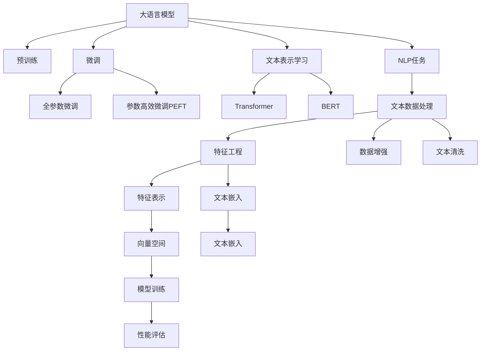

                 

# 从零开始大模型开发与微调：文本数据处理

> 关键词：大模型开发,数据预处理,文本表示,微调,Transformer,BERT,自然语言处理(NLP),预训练

## 1. 背景介绍

### 1.1 问题由来
近年来，随着深度学习技术的快速发展，大规模预训练语言模型（Large Pre-trained Language Models, LPLMs）在自然语言处理（Natural Language Processing, NLP）领域取得了巨大的突破。这些模型通过在海量无标签文本数据上进行预训练，学习到了丰富的语言知识和常识，如BERT、GPT等。

大模型的出现不仅极大地提升了NLP任务的性能，同时也推动了NLP技术的广泛应用。然而，这些模型通常在通用大规模文本数据上预训练，难以适应特定领域的特定任务。为此，研究者们提出了微调（Fine-tuning）的方法，即在大模型基础上，使用特定领域的少量标注数据进行微调，以提升模型在特定任务上的性能。

### 1.2 问题核心关键点
微调的本质是通过任务特定的有标签数据，优化模型在特定任务上的表现，使其具备更强的泛化能力。然而，大模型的微调也面临诸多挑战，如模型过拟合、标注数据稀缺、计算成本高等问题。本文将系统性地介绍文本数据处理在大模型微调中的应用，从数据预处理、文本表示学习、模型微调等角度，探讨如何高效、准确地使用文本数据提升大模型的性能。

### 1.3 问题研究意义
文本数据处理在大模型微调中的合理应用，对于拓展大模型的应用场景，提升模型在特定领域、特定任务上的性能，具有重要意义：

1. **提升模型性能**：文本数据处理可以显著提升模型在特定任务上的表现，使其具备更强的泛化能力。
2. **降低开发成本**：预训练模型可以作为初始化参数，节省了从头训练所需的巨大计算资源和时间成本。
3. **加快模型迭代**：通过快速微调和迭代，加速模型优化过程，提高模型开发效率。
4. **促进应用落地**：文本数据处理使得NLP技术更容易应用于各行各业，推动技术落地。

## 2. 核心概念与联系

### 2.1 核心概念概述

为更好地理解文本数据处理在大模型微调中的应用，本节将介绍几个关键概念：

- **大语言模型(Large Language Model, LLM)**：如BERT、GPT等，通过在大规模无标签文本数据上进行预训练，学习到丰富的语言知识。
- **预训练(Pre-training)**：在大规模无标签文本数据上进行自监督学习任务，如语言建模，使得模型学习到语言的基础表示。
- **微调(Fine-tuning)**：在预训练模型的基础上，使用特定领域的少量标注数据进行有监督学习，优化模型在特定任务上的性能。
- **文本表示学习(Text Representation Learning)**：将文本数据转化为向量形式，便于模型理解和处理。
- **Transformer架构**：一种基于自注意力机制的深度学习架构，广泛应用于大语言模型中。
- **BERT模型**：一种基于Transformer的预训练语言模型，通过双向语言建模进行预训练，并引入掩码机制和预测任务。
- **自然语言处理(NLP)**：涉及文本数据的理解、生成、分析等任务，是人工智能领域的重要分支。

这些概念之间的逻辑关系可以通过以下Mermaid流程图来展示：



这个流程图展示了文本数据处理在大模型微调中的应用流程：

1. 大语言模型通过预训练学习到语言知识。
2. 使用特定领域的文本数据进行微调，优化模型在特定任务上的性能。
3. 文本数据通过处理，转化为模型可以理解的特征向量。
4. 利用Transformer等架构，进行文本表示学习。
5. 在文本表示基础上，进行微调优化。
6. 使用文本数据处理、特征工程等技术，提升模型效果。

## 3. 核心算法原理 & 具体操作步骤
### 3.1 算法原理概述

文本数据处理在大模型微调中，主要涉及以下几个步骤：

- **数据预处理**：将原始文本数据转化为模型可接受的输入格式。
- **文本表示学习**：将文本数据转化为向量形式，便于模型理解和处理。
- **模型微调**：在预训练模型基础上，使用特定领域的少量标注数据进行有监督学习，优化模型在特定任务上的性能。

微调的目标是通过有标签数据，使得模型能够更好地适应特定领域和特定任务，提升模型在特定任务上的表现。文本数据处理是实现这一目标的重要环节。

### 3.2 算法步骤详解

#### 3.2.1 数据预处理

数据预处理是大模型微调的重要步骤，其核心目标是将原始文本数据转化为模型可以理解的输入格式。主要步骤包括：

1. **文本清洗**：去除噪声、停用词等无关信息，保留有用内容。
2. **分词**：将文本分割成词或子词，便于模型处理。
3. **标记化**：将文本转化为模型可以接受的格式，如ID序列。
4. **数据增强**：通过随机变换、回译等方式，扩充训练数据集。

例如，对于文本清洗，可以使用正则表达式或现成的文本清洗库，如NLTK、spaCy等。对于分词，可以使用现成的分词库，如jieba、NLTK等。对于标记化，可以使用现成的标记化工具，如BertTokenizer、WordPieceTokenizer等。

#### 3.2.2 文本表示学习

文本表示学习是将文本数据转化为向量形式的过程。常用的文本表示学习方法包括：

1. **词袋模型(Bag-of-Words, BOW)**：将文本转化为词频向量。
2. **词嵌入(Word Embedding)**：将词转化为高维向量，如Word2Vec、GloVe等。
3. **预训练语言模型(Pre-trained Language Models)**：如BERT、GPT等，通过在大规模无标签文本数据上进行预训练，学习到丰富的语言知识。

以BERT模型为例，其在预训练过程中，使用掩码语言模型和下一句预测任务，学习到了丰富的语言表示。在微调时，可以直接使用预训练的BERT模型，或者在其基础上进行微调。

#### 3.2.3 模型微调

模型微调是在预训练模型的基础上，使用特定领域的少量标注数据进行有监督学习，优化模型在特定任务上的性能。主要步骤包括：

1. **任务适配层设计**：根据任务类型，设计合适的输出层和损失函数。
2. **优化器选择**：选择合适的优化算法及其参数，如Adam、SGD等，设置学习率、批大小、迭代轮数等。
3. **正则化技术应用**：如L2正则、Dropout、Early Stopping等，防止模型过度适应小规模训练集。
4. **模型训练**：使用标注数据训练模型，最小化损失函数。
5. **性能评估**：在测试集上评估模型性能，对比微调前后的精度提升。

以BERT模型为例，其微调过程包括：

1. 加载预训练的BERT模型。
2. 设计任务适配层，如分类层、回归层等。
3. 选择优化器，如AdamW，设置学习率、批大小等。
4. 在标注数据集上进行有监督学习，最小化损失函数。
5. 在测试集上评估模型性能。

#### 3.2.4 数据增强与对抗训练

数据增强和对抗训练是提升模型性能的重要手段。数据增强通过随机变换扩充训练集，对抗训练通过引入对抗样本提高模型鲁棒性。

1. **数据增强**：通过随机变换、回译等方式扩充训练集。
2. **对抗训练**：通过引入对抗样本，提高模型鲁棒性。

例如，在文本分类任务中，可以使用句子替换、单词替换、文本回译等方法进行数据增强。在对抗训练中，可以通过加入对抗样本，提高模型对噪声和扰动的鲁棒性。

### 3.3 算法优缺点

文本数据处理在大模型微调中具有以下优点：

1. **提升模型性能**：通过合理的文本数据处理，提升模型在特定任务上的表现。
2. **降低开发成本**：预训练模型可以作为初始化参数，节省从头训练所需的巨大计算资源和时间成本。
3. **加快模型迭代**：通过快速微调和迭代，加速模型优化过程，提高模型开发效率。

同时，文本数据处理也存在以下局限性：

1. **依赖标注数据**：微调的效果很大程度上取决于标注数据的质量和数量，获取高质量标注数据的成本较高。
2. **文本理解难度大**：文本数据复杂多样，难以通过简单的处理方式彻底理解。
3. **算法复杂度高**：文本数据处理算法复杂度较高，需要大量的预处理和模型训练。

尽管存在这些局限性，但就目前而言，文本数据处理仍是文本数据处理在大模型微调中的核心技术。未来相关研究的重点在于如何进一步降低文本数据处理的复杂度，提高处理效率，同时兼顾可解释性和伦理安全性等因素。

### 3.4 算法应用领域

文本数据处理在大模型微调中，已在多个领域得到广泛应用，例如：

- **文本分类**：如情感分析、主题分类、意图识别等。通过微调使模型学习文本-标签映射。
- **命名实体识别**：识别文本中的人名、地名、机构名等特定实体。通过微调使模型掌握实体边界和类型。
- **关系抽取**：从文本中抽取实体之间的语义关系。通过微调使模型学习实体-关系三元组。
- **问答系统**：对自然语言问题给出答案。将问题-答案对作为微调数据，训练模型学习匹配答案。
- **机器翻译**：将源语言文本翻译成目标语言。通过微调使模型学习语言-语言映射。
- **文本摘要**：将长文本压缩成简短摘要。将文章-摘要对作为微调数据，使模型学习抓取要点。
- **对话系统**：使机器能够与人自然对话。将多轮对话历史作为上下文，微调模型进行回复生成。

除了上述这些经典任务外，文本数据处理技术还被创新性地应用于更多场景中，如可控文本生成、常识推理、代码生成、数据增强等，为NLP技术带来了全新的突破。随着预训练模型和文本数据处理方法的不断进步，相信NLP技术将在更广阔的应用领域大放异彩。

## 4. 数学模型和公式 & 详细讲解 & 举例说明
### 4.1 数学模型构建

本文以BERT模型为例，介绍其在文本数据处理中的应用。

BERT模型在预训练过程中，使用掩码语言模型和下一句预测任务进行训练。其公式化表示为：

$$
\mathcal{L}_{\text{Masked LM}} = -\frac{1}{N}\sum_{i=1}^N \sum_{k=1}^N log(p_{x_i, k})
$$

其中，$N$为样本数，$x_i$为输入文本，$k$为预测位置。$p_{x_i, k}$为模型在输入$x_i$下，对位置$k$的预测概率。

在微调过程中，我们可以设计任务适配层，如分类层、回归层等，最小化损失函数$\mathcal{L}$：

$$
\mathcal{L} = \frac{1}{N}\sum_{i=1}^N \ell(M_{\theta}(x_i), y_i)
$$

其中，$M_{\theta}$为微调后的模型，$y_i$为样本标签，$\ell$为损失函数。

### 4.2 公式推导过程

以BERT模型在文本分类任务上的微调为例，介绍其微调公式的推导过程。

假设模型$M_{\theta}$在输入$x$上的输出为$\hat{y}=M_{\theta}(x)$，表示样本属于正类的概率。真实标签$y \in \{0,1\}$。则二分类交叉熵损失函数定义为：

$$
\ell(M_{\theta}(x),y) = -[y\log \hat{y} + (1-y)\log (1-\hat{y})]
$$

将其代入经验风险公式，得：

$$
\mathcal{L}(\theta) = -\frac{1}{N}\sum_{i=1}^N [y_i\log M_{\theta}(x_i)+(1-y_i)\log(1-M_{\theta}(x_i))]
$$

根据链式法则，损失函数对参数$\theta_k$的梯度为：

$$
\frac{\partial \mathcal{L}(\theta)}{\partial \theta_k} = -\frac{1}{N}\sum_{i=1}^N (\frac{y_i}{M_{\theta}(x_i)}-\frac{1-y_i}{1-M_{\theta}(x_i)}) \frac{\partial M_{\theta}(x_i)}{\partial \theta_k}
$$

其中$\frac{\partial M_{\theta}(x_i)}{\partial \theta_k}$可进一步递归展开，利用自动微分技术完成计算。

在得到损失函数的梯度后，即可带入参数更新公式，完成模型的迭代优化。重复上述过程直至收敛，最终得到适应下游任务的最优模型参数$\theta^*$。

### 4.3 案例分析与讲解

以BERT模型在情感分析任务上的微调为例，介绍其实际应用。

假设我们有情感分析任务的数据集，其中包含电影评论和其情感标签。我们可以将评论作为输入，情感标签作为标注数据，在BERT模型上进行微调。

1. **数据预处理**：对评论进行清洗、分词、标记化等处理。
2. **特征提取**：使用BERT模型将评论转化为向量表示。
3. **模型微调**：在标注数据集上进行有监督学习，最小化损失函数。
4. **性能评估**：在测试集上评估模型性能，对比微调前后的精度提升。

在实际应用中，我们还可以结合数据增强、对抗训练等技术，进一步提升模型效果。

## 5. 项目实践：代码实例和详细解释说明
### 5.1 开发环境搭建

在进行微调实践前，我们需要准备好开发环境。以下是使用Python进行PyTorch开发的环境配置流程：

1. 安装Anaconda：从官网下载并安装Anaconda，用于创建独立的Python环境。

2. 创建并激活虚拟环境：
```bash
conda create -n pytorch-env python=3.8 
conda activate pytorch-env
```

3. 安装PyTorch：根据CUDA版本，从官网获取对应的安装命令。例如：
```bash
conda install pytorch torchvision torchaudio cudatoolkit=11.1 -c pytorch -c conda-forge
```

4. 安装Transformers库：
```bash
pip install transformers
```

5. 安装各类工具包：
```bash
pip install numpy pandas scikit-learn matplotlib tqdm jupyter notebook ipython
```

完成上述步骤后，即可在`pytorch-env`环境中开始微调实践。

### 5.2 源代码详细实现

这里我们以BERT模型在情感分析任务上的微调为例，给出使用Transformers库的PyTorch代码实现。

首先，定义情感分析任务的数据处理函数：

```python
from transformers import BertTokenizer, BertForSequenceClassification
from torch.utils.data import Dataset
import torch

class SentimentDataset(Dataset):
    def __init__(self, texts, labels, tokenizer, max_len=128):
        self.texts = texts
        self.labels = labels
        self.tokenizer = tokenizer
        self.max_len = max_len
        
    def __len__(self):
        return len(self.texts)
    
    def __getitem__(self, item):
        text = self.texts[item]
        label = self.labels[item]
        
        encoding = self.tokenizer(text, return_tensors='pt', max_length=self.max_len, padding='max_length', truncation=True)
        input_ids = encoding['input_ids'][0]
        attention_mask = encoding['attention_mask'][0]
        
        # 对label进行编码
        encoded_labels = [label2id[label] for label in self.labels] 
        encoded_labels.extend([label2id['O']] * (self.max_len - len(encoded_labels)))
        labels = torch.tensor(encoded_labels, dtype=torch.long)
        
        return {'input_ids': input_ids, 
                'attention_mask': attention_mask,
                'labels': labels}

# 标签与id的映射
label2id = {'positive': 0, 'negative': 1, 'O': 2}
id2label = {v: k for k, v in label2id.items()}

# 创建dataset
tokenizer = BertTokenizer.from_pretrained('bert-base-cased')

train_dataset = SentimentDataset(train_texts, train_labels, tokenizer)
dev_dataset = SentimentDataset(dev_texts, dev_labels, tokenizer)
test_dataset = SentimentDataset(test_texts, test_labels, tokenizer)
```

然后，定义模型和优化器：

```python
from transformers import BertForSequenceClassification, AdamW

model = BertForSequenceClassification.from_pretrained('bert-base-cased', num_labels=len(label2id))

optimizer = AdamW(model.parameters(), lr=2e-5)
```

接着，定义训练和评估函数：

```python
from torch.utils.data import DataLoader
from tqdm import tqdm
from sklearn.metrics import classification_report

device = torch.device('cuda') if torch.cuda.is_available() else torch.device('cpu')
model.to(device)

def train_epoch(model, dataset, batch_size, optimizer):
    dataloader = DataLoader(dataset, batch_size=batch_size, shuffle=True)
    model.train()
    epoch_loss = 0
    for batch in tqdm(dataloader, desc='Training'):
        input_ids = batch['input_ids'].to(device)
        attention_mask = batch['attention_mask'].to(device)
        labels = batch['labels'].to(device)
        model.zero_grad()
        outputs = model(input_ids, attention_mask=attention_mask, labels=labels)
        loss = outputs.loss
        epoch_loss += loss.item()
        loss.backward()
        optimizer.step()
    return epoch_loss / len(dataloader)

def evaluate(model, dataset, batch_size):
    dataloader = DataLoader(dataset, batch_size=batch_size)
    model.eval()
    preds, labels = [], []
    with torch.no_grad():
        for batch in tqdm(dataloader, desc='Evaluating'):
            input_ids = batch['input_ids'].to(device)
            attention_mask = batch['attention_mask'].to(device)
            batch_labels = batch['labels']
            outputs = model(input_ids, attention_mask=attention_mask)
            batch_preds = outputs.logits.argmax(dim=2).to('cpu').tolist()
            batch_labels = batch_labels.to('cpu').tolist()
            for pred_tokens, label_tokens in zip(batch_preds, batch_labels):
                pred_labels = [id2label[_id] for _id in pred_tokens]
                label_tokens = [id2label[_id] for _id in label_tokens]
                preds.append(pred_labels[:len(label_tokens)])
                labels.append(label_tokens)
                
    print(classification_report(labels, preds))
```

最后，启动训练流程并在测试集上评估：

```python
epochs = 5
batch_size = 16

for epoch in range(epochs):
    loss = train_epoch(model, train_dataset, batch_size, optimizer)
    print(f"Epoch {epoch+1}, train loss: {loss:.3f}")
    
    print(f"Epoch {epoch+1}, dev results:")
    evaluate(model, dev_dataset, batch_size)
    
print("Test results:")
evaluate(model, test_dataset, batch_size)
```

以上就是使用PyTorch对BERT模型进行情感分析任务微调的完整代码实现。可以看到，得益于Transformers库的强大封装，我们可以用相对简洁的代码完成BERT模型的加载和微调。

### 5.3 代码解读与分析

让我们再详细解读一下关键代码的实现细节：

**SentimentDataset类**：
- `__init__`方法：初始化文本、标签、分词器等关键组件。
- `__len__`方法：返回数据集的样本数量。
- `__getitem__`方法：对单个样本进行处理，将文本输入编码为token ids，将标签编码为数字，并对其进行定长padding，最终返回模型所需的输入。

**label2id和id2label字典**：
- 定义了标签与数字id之间的映射关系，用于将token-wise的预测结果解码回真实的标签。

**训练和评估函数**：
- 使用PyTorch的DataLoader对数据集进行批次化加载，供模型训练和推理使用。
- 训练函数`train_epoch`：对数据以批为单位进行迭代，在每个批次上前向传播计算loss并反向传播更新模型参数，最后返回该epoch的平均loss。
- 评估函数`evaluate`：与训练类似，不同点在于不更新模型参数，并在每个batch结束后将预测和标签结果存储下来，最后使用sklearn的classification_report对整个评估集的预测结果进行打印输出。

**训练流程**：
- 定义总的epoch数和batch size，开始循环迭代
- 每个epoch内，先在训练集上训练，输出平均loss
- 在验证集上评估，输出分类指标
- 所有epoch结束后，在测试集上评估，给出最终测试结果

可以看到，PyTorch配合Transformers库使得BERT微调的代码实现变得简洁高效。开发者可以将更多精力放在数据处理、模型改进等高层逻辑上，而不必过多关注底层的实现细节。

当然，工业级的系统实现还需考虑更多因素，如模型的保存和部署、超参数的自动搜索、更灵活的任务适配层等。但核心的微调范式基本与此类似。

## 6. 实际应用场景
### 6.1 智能客服系统

基于大语言模型微调的对话技术，可以广泛应用于智能客服系统的构建。传统客服往往需要配备大量人力，高峰期响应缓慢，且一致性和专业性难以保证。而使用微调后的对话模型，可以7x24小时不间断服务，快速响应客户咨询，用自然流畅的语言解答各类常见问题。

在技术实现上，可以收集企业内部的历史客服对话记录，将问题和最佳答复构建成监督数据，在此基础上对预训练对话模型进行微调。微调后的对话模型能够自动理解用户意图，匹配最合适的答案模板进行回复。对于客户提出的新问题，还可以接入检索系统实时搜索相关内容，动态组织生成回答。如此构建的智能客服系统，能大幅提升客户咨询体验和问题解决效率。

### 6.2 金融舆情监测

金融机构需要实时监测市场舆论动向，以便及时应对负面信息传播，规避金融风险。传统的人工监测方式成本高、效率低，难以应对网络时代海量信息爆发的挑战。基于大语言模型微调的文本分类和情感分析技术，为金融舆情监测提供了新的解决方案。

具体而言，可以收集金融领域相关的新闻、报道、评论等文本数据，并对其进行主题标注和情感标注。在此基础上对预训练语言模型进行微调，使其能够自动判断文本属于何种主题，情感倾向是正面、中性还是负面。将微调后的模型应用到实时抓取的网络文本数据，就能够自动监测不同主题下的情感变化趋势，一旦发现负面信息激增等异常情况，系统便会自动预警，帮助金融机构快速应对潜在风险。

### 6.3 个性化推荐系统

当前的推荐系统往往只依赖用户的历史行为数据进行物品推荐，无法深入理解用户的真实兴趣偏好。基于大语言模型微调技术，个性化推荐系统可以更好地挖掘用户行为背后的语义信息，从而提供更精准、多样的推荐内容。

在实践中，可以收集用户浏览、点击、评论、分享等行为数据，提取和用户交互的物品标题、描述、标签等文本内容。将文本内容作为模型输入，用户的后续行为（如是否点击、购买等）作为监督信号，在此基础上微调预训练语言模型。微调后的模型能够从文本内容中准确把握用户的兴趣点。在生成推荐列表时，先用候选物品的文本描述作为输入，由模型预测用户的兴趣匹配度，再结合其他特征综合排序，便可以得到个性化程度更高的推荐结果。

### 6.4 未来应用展望

随着大语言模型微调技术的发展，其在更多领域的应用前景广阔。

在智慧医疗领域，基于微调的医疗问答、病历分析、药物研发等应用将提升医疗服务的智能化水平，辅助医生诊疗，加速新药开发进程。

在智能教育领域，微调技术可应用于作业批改、学情分析、知识推荐等方面，因材施教，促进教育公平，提高教学质量。

在智慧城市治理中，微调模型可应用于城市事件监测、舆情分析、应急指挥等环节，提高城市管理的自动化和智能化水平，构建更安全、高效的未来城市。

此外，在企业生产、社会治理、文娱传媒等众多领域，基于大模型微调的人工智能应用也将不断涌现，为经济社会发展注入新的动力。相信随着技术的日益成熟，微调方法将成为人工智能落地应用的重要范式，推动人工智能技术在垂直行业的规模化落地。总之，微调需要开发者根据具体任务，不断迭代和优化模型、数据和算法，方能得到理想的效果。

## 7. 工具和资源推荐
### 7.1 学习资源推荐

为了帮助开发者系统掌握大语言模型微调的理论基础和实践技巧，这里推荐一些优质的学习资源：

1. 《Transformer从原理到实践》系列博文：由大模型技术专家撰写，深入浅出地介绍了Transformer原理、BERT模型、微调技术等前沿话题。

2. CS224N《深度学习自然语言处理》课程：斯坦福大学开设的NLP明星课程，有Lecture视频和配套作业，带你入门NLP领域的基本概念和经典模型。

3. 《Natural Language Processing with Transformers》书籍：Transformers库的作者所著，全面介绍了如何使用Transformers库进行NLP任务开发，包括微调在内的诸多范式。

4. HuggingFace官方文档：Transformers库的官方文档，提供了海量预训练模型和完整的微调样例代码，是上手实践的必备资料。

5. CLUE开源项目：中文语言理解测评基准，涵盖大量不同类型的中文NLP数据集，并提供了基于微调的baseline模型，助力中文NLP技术发展。

通过对这些资源的学习实践，相信你一定能够快速掌握大语言模型微调的精髓，并用于解决实际的NLP问题。
###  7.2 开发工具推荐

高效的开发离不开优秀的工具支持。以下是几款用于大语言模型微调开发的常用工具：

1. PyTorch：基于Python的开源深度学习框架，灵活动态的计算图，适合快速迭代研究。大部分预训练语言模型都有PyTorch版本的实现。

2. TensorFlow：由Google主导开发的开源深度学习框架，生产部署方便，适合大规模工程应用。同样有丰富的预训练语言模型资源。

3. Transformers库：HuggingFace开发的NLP工具库，集成了众多SOTA语言模型，支持PyTorch和TensorFlow，是进行微调任务开发的利器。

4. Weights & Biases：模型训练的实验跟踪工具，可以记录和可视化模型训练过程中的各项指标，方便对比和调优。与主流深度学习框架无缝集成。

5. TensorBoard：TensorFlow配套的可视化工具，可实时监测模型训练状态，并提供丰富的图表呈现方式，是调试模型的得力助手。

6. Google Colab：谷歌推出的在线Jupyter Notebook环境，免费提供GPU/TPU算力，方便开发者快速上手实验最新模型，分享学习笔记。

合理利用这些工具，可以显著提升大语言模型微调任务的开发效率，加快创新迭代的步伐。

### 7.3 相关论文推荐

大语言模型和微调技术的发展源于学界的持续研究。以下是几篇奠基性的相关论文，推荐阅读：

1. Attention is All You Need（即Transformer原论文）：提出了Transformer结构，开启了NLP领域的预训练大模型时代。

2. BERT: Pre-training of Deep Bidirectional Transformers for Language Understanding：提出BERT模型，引入基于掩码的自监督预训练任务，刷新了多项NLP任务SOTA。

3. Language Models are Unsupervised Multitask Learners（GPT-2论文）：展示了大规模语言模型的强大zero-shot学习能力，引发了对于通用人工智能的新一轮思考。

4. Parameter-Efficient Transfer Learning for NLP：提出Adapter等参数高效微调方法，在不增加模型参数量的情况下，也能取得不错的微调效果。

5. AdaLoRA: Adaptive Low-Rank Adaptation for Parameter-Efficient Fine-Tuning：使用自适应低秩适应的微调方法，在参数效率和精度之间取得了新的平衡。

6. Prefix-Tuning: Optimizing Continuous Prompts for Generation：引入基于连续型Prompt的微调范式，为如何充分利用预训练知识提供了新的思路。

这些论文代表了大语言模型微调技术的发展脉络。通过学习这些前沿成果，可以帮助研究者把握学科前进方向，激发更多的创新灵感。

## 8. 总结：未来发展趋势与挑战

### 8.1 总结

本文对文本数据处理在大模型微调中的应用进行了全面系统的介绍。首先阐述了文本数据处理在大模型微调中的核心作用，明确了其在提升模型性能、降低开发成本、加快模型迭代等方面的重要意义。其次，从数据预处理、文本表示学习、模型微调等角度，详细讲解了文本数据处理在大模型微调中的应用流程和关键步骤。最后，本文还探讨了文本数据处理在多个领域的应用场景，展示了其在实际应用中的强大潜力和广阔前景。

通过本文的系统梳理，可以看到，文本数据处理在大模型微调中的合理应用，对于拓展大模型的应用场景，提升模型在特定领域、特定任务上的性能，具有重要意义。未来，随着大语言模型微调技术的发展，文本数据处理技术将进一步融合到预训练模型中，实现更加高效的模型优化。

### 8.2 未来发展趋势

展望未来，文本数据处理在大模型微调中，将呈现以下几个发展趋势：

1. **文本表示学习技术不断发展**：随着深度学习技术的发展，文本表示学习技术将不断进步，如BERT、GPT等预训练模型的性能将进一步提升。

2. **参数高效微调方法层出不穷**：未来将涌现更多参数高效的微调方法，如Prefix-Tuning、LoRA等，在减小模型参数量的情况下，仍能取得不错的微调效果。

3. **数据增强与对抗训练应用广泛**：数据增强和对抗训练是提升模型性能的重要手段，未来将在更多场景中得到应用。

4. **跨领域知识融合加强**：文本数据处理将更好地与外部知识库、规则库等专家知识结合，形成更加全面、准确的信息整合能力。

5. **预训练与微调深度融合**：未来的大模型将同时兼顾预训练与微调，通过预训练-微调-再微调的过程，不断优化模型性能。

6. **多模态文本处理技术发展**：未来文本数据处理技术将更广泛地应用于图像、视频、语音等多模态数据，提升模型对现实世界的理解能力。

以上趋势凸显了文本数据处理在大模型微调中的重要性和潜力。这些方向的探索发展，必将进一步提升NLP系统的性能和应用范围，为人类认知智能的进化带来深远影响。

### 8.3 面临的挑战

尽管文本数据处理在大模型微调中取得了显著成效，但在迈向更加智能化、普适化应用的过程中，它仍面临诸多挑战：

1. **标注数据稀缺**：对于一些特定的领域和任务，获取高质量标注数据成本较高，影响微调效果。

2. **模型鲁棒性不足**：面对域外数据时，微调模型的泛化性能可能下降，鲁棒性有待提升。

3. **数据理解难度大**：文本数据复杂多样，难以通过简单的处理方式彻底理解，处理复杂度较高。

4. **算法复杂度高**：文本数据处理算法复杂度较高，需要大量的预处理和模型训练，开发难度较大。

尽管存在这些挑战，但通过技术创新和优化，文本数据处理技术仍将在大模型微调中发挥重要作用，推动NLP技术的发展和应用。

### 8.4 研究展望

未来，文本数据处理技术需要在以下几个方面进行更深入的研究和探索：

1. **无监督和半监督学习**：探索无监督和半监督学习范式，最大限度利用非结构化数据，实现更加灵活高效的微调。

2. **多领域知识整合**：将符号化的先验知识与神经网络模型进行融合，引导微调过程学习更准确、合理的语言模型。

3. **多模态文本处理**：研究图像、视频、语音等多模态数据的处理技术，提升模型对现实世界的理解能力。

4. **跨领域知识融合**：将不同领域的知识整合到文本表示学习中，提升模型的泛化能力。

5. **算法优化**：研究更加高效、灵活的文本数据处理算法，降低开发复杂度。

6. **模型鲁棒性提升**：研究鲁棒性提升技术，提高模型对噪声和扰动的抵抗能力。

这些研究方向将推动文本数据处理技术的不断进步，进一步提升NLP模型的性能和应用范围。面向未来，文本数据处理技术必将在大模型微调中发挥更大的作用，推动NLP技术的普及和应用。

## 9. 附录：常见问题与解答

**Q1：如何选择合适的文本表示方法？**

A: 选择文本表示方法主要考虑以下几个方面：
1. **任务类型**：不同类型的任务适合不同的文本表示方法。如文本分类任务适合使用向量表示，而文本生成任务适合使用Transformer模型。
2. **数据特性**：不同来源和性质的数据需要选择不同的表示方法。如新闻文本适合使用BERT模型，而技术文档适合使用Word2Vec模型。
3. **模型复杂度**：考虑模型的训练和推理复杂度。如对于大规模数据集，选择参数高效的模型，如LoRA、AdaLoRA等。

**Q2：文本数据清洗的常用方法有哪些？**

A: 文本数据清洗的常用方法包括：
1. **去除停用词**：去除文本中常见的停用词，如“的”、“是”等。
2. **去除噪声**：去除文本中的非文本内容，如HTML标签、数字等。
3. **分词**：将文本分割成词或子词，便于模型处理。
4. **词干提取**：将文本中的单词还原为其词干形式，减少词汇多样性。
5. **大小写统一**：将文本中的单词转换为统一的大小写形式。

**Q3：数据增强的常用方法有哪些？**

A: 数据增强的常用方法包括：
1. **随机替换**：随机替换文本中的某些单词，增加数据多样性。
2. **随机回译**：将文本随机回译为其他语言，增加数据多样性。
3. **随机删除**：随机删除文本中的某些单词，增加数据多样性。
4. **随机插入**：随机插入单词或词组，增加数据多样性。
5. **数据扩充**：使用同义词替换、近义词替换等方法，扩充训练集。

**Q4：数据增强的常用工具有哪些？**

A: 数据增强的常用工具包括：
1. NLTK：Python自然语言处理库，提供各种文本处理功能。
2. spaCy：Python自然语言处理库，支持分词、标注等操作。
3. BackTranslation：回译工具，可以将文本翻译为其他语言。
4. Pyroof：Python数据增强库，支持各种数据增强方法。
5. textattack：数据攻击工具，可以生成对抗样本。

**Q5：数据增强在微调中的作用有哪些？**

A: 数据增强在微调中的作用包括：
1. **增加数据多样性**：通过数据增强，增加训练数据的多样性，提升模型泛化能力。
2. **减少过拟合**：通过数据增强，减少模型对训练集的过拟合，提升模型泛化能力。
3. **提高鲁棒性**：通过数据增强，提高模型对噪声和扰动的鲁棒性。
4. **提升效果**：通过数据增强，提升模型在特定任务上的效果。

这些工具和资源可以帮助开发者更好地进行文本数据处理，提升大模型微调的效果。总之，文本数据处理是大模型微调的重要环节，需要通过合理的方法和工具，提升模型的性能和泛化能力。

---

作者：禅与计算机程序设计艺术 / Zen and the Art of Computer Programming

