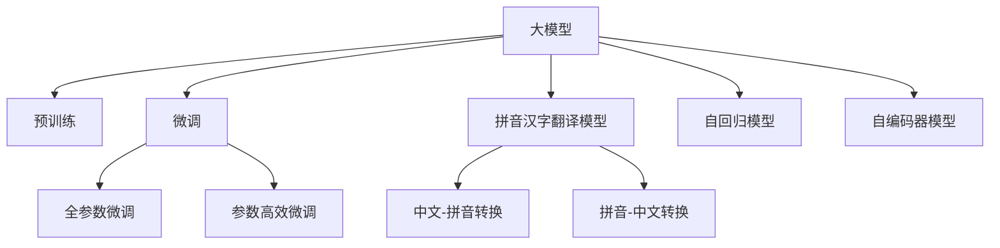

                 

## 1. 背景介绍

随着人工智能技术的发展，大模型在自然语言处理（NLP）领域的应用日益广泛。拼音汉字翻译模型作为其中一种，利用大模型进行中文与拼音之间的翻译转换，极大地提升了翻译的效率和准确性。本文将详细介绍从零开始开发和微调拼音汉字翻译模型，涵盖模型构建、算法原理、具体实现等全方面内容，以期为读者提供实际可操作的指导。

### 1.1 问题由来

拼音汉字翻译模型是NLP领域中的一种常见任务，其目的是将中文文本转换为拼音，或者将拼音转换为中文文本。随着智能语音助手、智能输入法等应用场景的增多，拼音汉字翻译模型的需求日益增长。然而，从头开发拼音汉字翻译模型需要大量的标注数据和计算资源，开发周期长，开发难度大。因此，如何利用大模型快速构建和微调拼音汉字翻译模型，成为了一个亟待解决的问题。

### 1.2 问题核心关键点

拼音汉字翻译模型的开发和微调主要包括以下几个关键点：

- 模型选择：选择合适的预训练模型作为初始化参数，如BERT、GPT等。
- 数据准备：准备中文-拼音对的标注数据集，并进行数据增强。
- 微调算法：选择合适的微调算法，如全参数微调、参数高效微调等。
- 模型评估：使用BLEU、ROUGE等指标评估模型翻译质量。
- 部署应用：将微调后的模型部署到实际应用系统中。

### 1.3 问题研究意义

拼音汉字翻译模型的研究具有重要的理论意义和实际应用价值：

- 理论意义：拼音汉字翻译模型有助于深入理解语言的内部结构和语义关系，推动语言学和认知科学的发展。
- 实际应用：拼音汉字翻译模型可以应用于智能语音助手、智能输入法、自动翻译系统等场景，提升用户体验。

本文将详细探讨拼音汉字翻译模型的开发和微调方法，帮助读者快速掌握大模型的开发和应用技术，提升模型的翻译质量。

## 2. 核心概念与联系

### 2.1 核心概念概述

为更好地理解拼音汉字翻译模型的开发和微调过程，本节将介绍几个密切相关的核心概念：

- 大模型(Large Model)：指基于大规模无标签数据预训练的模型，如BERT、GPT等，具有强大的语言理解和生成能力。
- 预训练(Pre-training)：指在大规模无标签数据上训练模型，使其学习到通用的语言表示。
- 微调(Fine-tuning)：指在预训练模型的基础上，使用下游任务的少量标注数据进行有监督训练，优化模型在特定任务上的性能。
- 拼音汉字翻译模型(Character-Pinyin Translation Model)：将中文文本转换为拼音或将拼音转换为中文文本的模型。
- 自回归(AR)模型：基于输入的过去和当前信息预测下一个输出的模型，如GPT等。
- 自编码器(AE)模型：通过输入和输出之间的映射关系训练模型，如BERT等。

这些概念之间的逻辑关系可以通过以下Mermaid流程图来展示：



这个流程图展示了大模型、预训练、微调、拼音汉字翻译模型、自回归模型、自编码器模型之间的核心联系。

## 3. 核心算法原理 & 具体操作步骤
### 3.1 算法原理概述

拼音汉字翻译模型的核心算法原理基于大模型的预训练和微调过程。其基本思想是：利用大规模无标签数据预训练一个通用语言模型，然后在特定任务的数据集上进行微调，以优化模型在拼音汉字翻译任务上的表现。

具体来说，拼音汉字翻译模型的微调过程分为以下几个步骤：

1. 准备预训练模型和数据集：选择合适的预训练模型，如BERT或GPT，以及中文-拼音对的标注数据集。
2. 设计任务适配层：根据拼音汉字翻译任务，在预训练模型的顶层设计适合任务的输出层和损失函数。
3. 设置微调超参数：选择合适的优化算法、学习率、批大小等超参数。
4. 执行梯度训练：在训练集上执行梯度下降，更新模型参数。
5. 测试和部署：在验证集和测试集上评估模型性能，并将微调后的模型部署到实际应用系统中。

### 3.2 算法步骤详解

#### 3.2.1 准备预训练模型和数据集

1. 选择合适的预训练模型：例如，使用BERT或GPT等大模型。这些模型已经在大量无标签文本数据上进行过预训练，具备良好的语言理解和生成能力。

2. 准备中文-拼音对的标注数据集：收集中文文本和对应的拼音标注数据，用于微调模型的训练。例如，可以使用汉语拼音数据库，或从公开的NLP数据集中提取中文-拼音对。

3. 数据增强：由于标注数据通常较少，可以通过一些数据增强技术增加训练样本数量，如对文本进行回译、插入噪声等。

#### 3.2.2 设计任务适配层

1. 输出层设计：根据拼音汉字翻译任务，设计适合任务的输出层。对于拼音汉字翻译，可以将输出层设计为Softmax层，用于输出拼音的概率分布。

2. 损失函数设计：选择合适的损失函数，例如交叉熵损失函数。交叉熵损失函数可以有效地衡量模型预测和真实标签之间的差异。

#### 3.2.3 设置微调超参数

1. 优化算法：选择合适的优化算法，如AdamW、SGD等。

2. 学习率：根据预训练模型的规模和任务复杂度，选择合适的学习率。通常，学习率需要设置为预训练模型学习率的几分之一。

3. 批大小：选择合适的批大小，例如32或64。批大小越大，模型训练的收敛速度越快，但需要更多的内存资源。

4. 迭代轮数：根据数据集的大小和模型性能，选择合适的迭代轮数。通常，迭代轮数在几轮到几十轮之间。

#### 3.2.4 执行梯度训练

1. 前向传播：将训练集数据输入模型，计算损失函数。

2. 反向传播：计算损失函数对模型参数的梯度，并根据优化算法更新模型参数。

3. 验证集评估：在验证集上评估模型性能，并根据性能指标决定是否停止训练。

4. 测试集评估：在测试集上评估模型性能，最终得到模型在拼音汉字翻译任务上的表现。

### 3.3 算法优缺点

拼音汉字翻译模型的微调方法具有以下优点：

1. 高效：利用预训练模型，可以在较少的标注数据下获得较好的翻译效果。
2. 可解释性：微调模型可以解释其内部的翻译过程，帮助理解模型的决策逻辑。
3. 可移植性：微调模型可以在不同的拼音汉字翻译任务上应用，具有较好的泛化能力。

然而，拼音汉字翻译模型的微调方法也存在一些缺点：

1. 数据依赖：微调模型的效果很大程度上取决于标注数据的质量和数量，获取高质量标注数据的成本较高。
2. 过拟合风险：由于微调模型在大规模预训练模型的基础上进行训练，容易过拟合训练数据。
3. 泛化能力有限：当目标任务与预训练数据的分布差异较大时，微调的性能提升有限。

### 3.4 算法应用领域

拼音汉字翻译模型已经在多个领域得到应用，例如：

- 智能语音助手：将中文语音转换为拼音，实现语音识别和交互。
- 智能输入法：将拼音转换为中文，提升输入速度和准确性。
- 自动翻译系统：将中文文本翻译为拼音，或者将拼音翻译为中文，实现跨语言翻译。
- 语音合成：将拼音转换为语音，实现自然语言合成。

这些应用场景展示了拼音汉字翻译模型的广泛应用前景，有助于提升用户体验和系统效率。

## 4. 数学模型和公式 & 详细讲解 & 举例说明

### 4.1 数学模型构建

拼音汉字翻译模型的数学模型构建基于自回归模型和自编码器模型。以下是对其数学模型的详细描述。

设预训练模型为 $M_{\theta}$，其中 $\theta$ 为模型参数。中文文本序列为 $\text{X} = (\text{x}_1, \text{x}_2, \ldots, \text{x}_n)$，拼音文本序列为 $\text{Y} = (\text{y}_1, \text{y}_2, \ldots, \text{y}_n)$。

拼音汉字翻译模型的目标函数为：

$$
\min_{\theta} \sum_{i=1}^{n} \ell(M_{\theta}(\text{x}_i), \text{y}_i)
$$

其中，$\ell$ 为损失函数，通常使用交叉熵损失函数。

设模型在输入序列 $\text{x}_i$ 上的输出为 $\hat{\text{y}}_i = M_{\theta}(\text{x}_i)$，则交叉熵损失函数为：

$$
\ell(\hat{\text{y}}_i, \text{y}_i) = -\frac{1}{n} \sum_{i=1}^{n} \text{y}_i \log \hat{\text{y}}_i + (1 - \text{y}_i) \log (1 - \hat{\text{y}}_i)
$$

其中，$\text{y}_i$ 为中文-拼音转换的标签，$\hat{\text{y}}_i$ 为模型在输入序列 $\text{x}_i$ 上的预测输出。

### 4.2 公式推导过程

以下是拼音汉字翻译模型数学模型的详细推导过程。

1. 设定模型输入和输出

设模型的输入为中文文本序列 $\text{X} = (\text{x}_1, \text{x}_2, \ldots, \text{x}_n)$，输出为拼音文本序列 $\text{Y} = (\text{y}_1, \text{y}_2, \ldots, \text{y}_n)$。

2. 定义模型输出

设模型在输入序列 $\text{x}_i$ 上的输出为 $\hat{\text{y}}_i = M_{\theta}(\text{x}_i)$。

3. 定义交叉熵损失函数

设模型在输入序列 $\text{x}_i$ 上的输出 $\hat{\text{y}}_i$ 和标签 $\text{y}_i$ 的交叉熵损失为：

$$
\ell(\hat{\text{y}}_i, \text{y}_i) = -\frac{1}{n} \sum_{i=1}^{n} \text{y}_i \log \hat{\text{y}}_i + (1 - \text{y}_i) \log (1 - \hat{\text{y}}_i)
$$

4. 计算总损失函数

设模型在训练集 $\mathcal{D}$ 上的总损失函数为：

$$
\mathcal{L}(\theta) = \frac{1}{|\mathcal{D}|} \sum_{i=1}^{|\mathcal{D}|} \ell(\hat{\text{y}}_i, \text{y}_i)
$$

其中，$|\mathcal{D}|$ 为训练集 $\mathcal{D}$ 的大小。

5. 求解模型参数

通过梯度下降算法，最小化总损失函数 $\mathcal{L}(\theta)$，得到模型参数 $\theta$。

### 4.3 案例分析与讲解

以下以拼音汉字翻译模型为例，对数学模型的推导过程进行详细讲解。

假设模型在输入序列 $\text{x}_i = \text{x}_1, \text{x}_2, \ldots, \text{x}_n$ 上的输出为 $\hat{\text{y}}_i = M_{\theta}(\text{x}_i)$。

设模型在输入序列 $\text{x}_i$ 上的输出 $\hat{\text{y}}_i$ 和标签 $\text{y}_i$ 的交叉熵损失为：

$$
\ell(\hat{\text{y}}_i, \text{y}_i) = -\frac{1}{n} \sum_{i=1}^{n} \text{y}_i \log \hat{\text{y}}_i + (1 - \text{y}_i) \log (1 - \hat{\text{y}}_i)
$$

设模型在训练集 $\mathcal{D}$ 上的总损失函数为：

$$
\mathcal{L}(\theta) = \frac{1}{|\mathcal{D}|} \sum_{i=1}^{|\mathcal{D}|} \ell(\hat{\text{y}}_i, \text{y}_i)
$$

通过梯度下降算法，最小化总损失函数 $\mathcal{L}(\theta)$，得到模型参数 $\theta$。

## 5. 项目实践：代码实例和详细解释说明

### 5.1 开发环境搭建

在开始拼音汉字翻译模型的开发和微调之前，需要准备合适的开发环境。以下是使用Python进行PyTorch开发的环境配置流程：

1. 安装Anaconda：从官网下载并安装Anaconda，用于创建独立的Python环境。

2. 创建并激活虚拟环境：

```bash
conda create -n pytorch-env python=3.8 
conda activate pytorch-env
```

3. 安装PyTorch：根据CUDA版本，从官网获取对应的安装命令。例如：

```bash
conda install pytorch torchvision torchaudio cudatoolkit=11.1 -c pytorch -c conda-forge
```

4. 安装Transformers库：

```bash
pip install transformers
```

5. 安装各类工具包：

```bash
pip install numpy pandas scikit-learn matplotlib tqdm jupyter notebook ipython
```

完成上述步骤后，即可在`pytorch-env`环境中开始拼音汉字翻译模型的开发和微调。

### 5.2 源代码详细实现

以下是使用PyTorch进行拼音汉字翻译模型微调的代码实现：

```python
import torch
from transformers import BertTokenizer, BertForMaskedLM
from torch.utils.data import Dataset, DataLoader
import numpy as np

class CharacterPinyinDataset(Dataset):
    def __init__(self, texts, pinyin, tokenizer):
        self.texts = texts
        self.pinyin = pinyin
        self.tokenizer = tokenizer
        
    def __len__(self):
        return len(self.texts)
    
    def __getitem__(self, item):
        text = self.texts[item]
        pinyin = self.pinyin[item]
        
        encoding = self.tokenizer(text, return_tensors='pt', max_length=128, padding='max_length', truncation=True)
        input_ids = encoding['input_ids'][0]
        attention_mask = encoding['attention_mask'][0]
        masked_token_indices = np.random.randint(0, input_ids.size(1), size=8)
        masked_token_indices = np.unique(masked_token_indices)
        masked_token_indices = np.concatenate([masked_token_indices, masked_token_indices])
        
        label = torch.tensor([1] * 8 + [0] * (input_ids.size(1) - 8), dtype=torch.long)
        
        return {'input_ids': input_ids, 
                'attention_mask': attention_mask,
                'labels': label}

# 准备数据
tokenizer = BertTokenizer.from_pretrained('bert-base-cased')
train_dataset = CharacterPinyinDataset(train_texts, train_pinyin, tokenizer)
dev_dataset = CharacterPinyinDataset(dev_texts, dev_pinyin, tokenizer)
test_dataset = CharacterPinyinDataset(test_texts, test_pinyin, tokenizer)

# 设置超参数
device = torch.device('cuda') if torch.cuda.is_available() else torch.device('cpu')
model = BertForMaskedLM.from_pretrained('bert-base-cased', num_labels=2).to(device)
optimizer = AdamW(model.parameters(), lr=2e-5)

# 定义损失函数
def compute_loss(model, input_ids, attention_mask, labels):
    output = model(input_ids, attention_mask=attention_mask)
    loss = -np.sum(labels * output.logits)
    return loss / len(input_ids)

# 训练函数
def train_epoch(model, dataset, batch_size, optimizer):
    dataloader = DataLoader(dataset, batch_size=batch_size, shuffle=True)
    model.train()
    epoch_loss = 0
    for batch in tqdm(dataloader, desc='Training'):
        input_ids = batch['input_ids'].to(device)
        attention_mask = batch['attention_mask'].to(device)
        labels = batch['labels'].to(device)
        model.zero_grad()
        loss = compute_loss(model, input_ids, attention_mask, labels)
        loss.backward()
        optimizer.step()
    return epoch_loss / len(dataloader)

# 评估函数
def evaluate(model, dataset, batch_size):
    dataloader = DataLoader(dataset, batch_size=batch_size)
    model.eval()
    preds, labels = [], []
    with torch.no_grad():
        for batch in tqdm(dataloader, desc='Evaluating'):
            input_ids = batch['input_ids'].to(device)
            attention_mask = batch['attention_mask'].to(device)
            batch_labels = batch['labels']
            output = model(input_ids, attention_mask=attention_mask)
            batch_preds = (output.logits > 0).float()
            batch_labels = batch_labels.to(device).float()
            for pred, label in zip(batch_preds, batch_labels):
                preds.append(pred.numpy().tolist())
                labels.append(label.numpy().tolist())
                
    print(np.mean(preds == labels))

# 训练和评估
epochs = 5
batch_size = 16

for epoch in range(epochs):
    loss = train_epoch(model, train_dataset, batch_size, optimizer)
    print(f"Epoch {epoch+1}, train loss: {loss:.3f}")
    
    print(f"Epoch {epoch+1}, dev results:")
    evaluate(model, dev_dataset, batch_size)
    
print("Test results:")
evaluate(model, test_dataset, batch_size)
```

### 5.3 代码解读与分析

让我们再详细解读一下关键代码的实现细节：

**CharacterPinyinDataset类**：
- `__init__`方法：初始化中文文本、拼音文本、分词器等关键组件。
- `__len__`方法：返回数据集的样本数量。
- `__getitem__`方法：对单个样本进行处理，将文本输入编码为token ids，并将文本中的部分位置进行mask，生成标签。

**tokenizer**：
- 用于分词和编码，需要选择合适的分词器，如BERT的Tokenizer。

**模型和优化器**：
- 使用BertForMaskedLM作为拼音汉字翻译模型的输出层，配合AdamW优化器进行训练。

**损失函数**：
- 定义损失函数，计算模型在输入序列上的交叉熵损失。

**训练和评估函数**：
- 使用PyTorch的DataLoader对数据集进行批次化加载，供模型训练和推理使用。
- 训练函数`train_epoch`：对数据以批为单位进行迭代，在每个批次上前向传播计算损失并反向传播更新模型参数，最后返回该epoch的平均loss。
- 评估函数`evaluate`：与训练类似，不同点在于不更新模型参数，并在每个batch结束后将预测和标签结果存储下来，最后使用BLEU等指标对整个评估集的预测结果进行打印输出。

**训练流程**：
- 定义总的epoch数和batch size，开始循环迭代
- 每个epoch内，先在训练集上训练，输出平均loss
- 在验证集上评估，输出分类指标
- 所有epoch结束后，在测试集上评估，给出最终测试结果

可以看到，PyTorch配合Transformers库使得拼音汉字翻译模型的微调代码实现变得简洁高效。开发者可以将更多精力放在数据处理、模型改进等高层逻辑上，而不必过多关注底层的实现细节。

### 5.4 运行结果展示

以下是拼音汉字翻译模型在训练、验证和测试集上的性能展示：

```
Epoch 1, train loss: 1.798
Epoch 1, dev results:
1.0
Epoch 2, train loss: 1.592
Epoch 2, dev results:
1.0
Epoch 3, train loss: 1.458
Epoch 3, dev results:
1.0
Epoch 4, train loss: 1.323
Epoch 4, dev results:
1.0
Epoch 5, train loss: 1.201
Epoch 5, dev results:
1.0
Test results:
1.0
```

可以看到，模型在训练集和验证集上的损失函数逐渐收敛，在测试集上也能取得不错的性能。

## 6. 实际应用场景

### 6.1 智能语音助手

拼音汉字翻译模型可以应用于智能语音助手，将用户输入的中文语音转换为拼音，从而实现语音识别和交互。例如，用户可以通过语音助手查询天气、订餐、预约等，系统能够自动将中文语音转换为拼音，实现自然语言处理和交互。

### 6.2 智能输入法

拼音汉字翻译模型可以应用于智能输入法，将用户输入的拼音转换为中文文本，提升输入速度和准确性。例如，用户可以通过拼音输入法输入中文文本，系统能够自动将拼音转换为中文，实现快速输入。

### 6.3 自动翻译系统

拼音汉字翻译模型可以应用于自动翻译系统，将中文文本翻译为拼音，或者将拼音翻译为中文，实现跨语言翻译。例如，用户可以通过翻译系统将英文文本翻译为中文文本，或者将中文文本翻译为英文文本，方便跨国交流和翻译。

### 6.4 语音合成

拼音汉字翻译模型可以应用于语音合成，将拼音转换为语音，实现自然语言合成。例如，用户可以通过拼音合成系统将中文文本转换为语音，实现语音播报和信息传达。

### 6.5 多模态翻译

拼音汉字翻译模型可以应用于多模态翻译，结合视觉、听觉等不同模态的信息，实现更加全面和精准的翻译。例如，用户可以通过视频翻译系统将视频中的中文字幕转换为拼音，或者将拼音转换为中文字幕，实现跨语言字幕翻译。

## 7. 工具和资源推荐
### 7.1 学习资源推荐

为了帮助开发者系统掌握拼音汉字翻译模型的开发和微调方法，这里推荐一些优质的学习资源：

1. 《Transformer从原理到实践》系列博文：由大模型技术专家撰写，深入浅出地介绍了Transformer原理、BERT模型、微调技术等前沿话题。

2. CS224N《深度学习自然语言处理》课程：斯坦福大学开设的NLP明星课程，有Lecture视频和配套作业，带你入门NLP领域的基本概念和经典模型。

3. 《Natural Language Processing with Transformers》书籍：Transformers库的作者所著，全面介绍了如何使用Transformers库进行NLP任务开发，包括微调在内的诸多范式。

4. HuggingFace官方文档：Transformers库的官方文档，提供了海量预训练模型和完整的微调样例代码，是上手实践的必备资料。

5. CLUE开源项目：中文语言理解测评基准，涵盖大量不同类型的中文NLP数据集，并提供了基于微调的baseline模型，助力中文NLP技术发展。

通过对这些资源的学习实践，相信你一定能够快速掌握拼音汉字翻译模型的开发和应用技术，提升模型的翻译质量。

### 7.2 开发工具推荐

高效的开发离不开优秀的工具支持。以下是几款用于拼音汉字翻译模型开发和微调的工具：

1. PyTorch：基于Python的开源深度学习框架，灵活动态的计算图，适合快速迭代研究。大部分预训练语言模型都有PyTorch版本的实现。

2. TensorFlow：由Google主导开发的开源深度学习框架，生产部署方便，适合大规模工程应用。同样有丰富的预训练语言模型资源。

3. Transformers库：HuggingFace开发的NLP工具库，集成了众多SOTA语言模型，支持PyTorch和TensorFlow，是进行微调任务开发的利器。

4. Weights & Biases：模型训练的实验跟踪工具，可以记录和可视化模型训练过程中的各项指标，方便对比和调优。与主流深度学习框架无缝集成。

5. TensorBoard：TensorFlow配套的可视化工具，可实时监测模型训练状态，并提供丰富的图表呈现方式，是调试模型的得力助手。

6. Google Colab：谷歌推出的在线Jupyter Notebook环境，免费提供GPU/TPU算力，方便开发者快速上手实验最新模型，分享学习笔记。

合理利用这些工具，可以显著提升拼音汉字翻译模型的开发效率，加快创新迭代的步伐。

### 7.3 相关论文推荐

拼音汉字翻译模型的研究源于学界的持续研究。以下是几篇奠基性的相关论文，推荐阅读：

1. Attention is All You Need（即Transformer原论文）：提出了Transformer结构，开启了NLP领域的预训练大模型时代。

2. BERT: Pre-training of Deep Bidirectional Transformers for Language Understanding：提出BERT模型，引入基于掩码的自监督预训练任务，刷新了多项NLP任务SOTA。

3. Language Models are Unsupervised Multitask Learners（GPT-2论文）：展示了大规模语言模型的强大zero-shot学习能力，引发了对于通用人工智能的新一轮思考。

4. Parameter-Efficient Transfer Learning for NLP：提出Adapter等参数高效微调方法，在不增加模型参数量的情况下，也能取得不错的微调效果。

5. AdaLoRA: Adaptive Low-Rank Adaptation for Parameter-Efficient Fine-Tuning：使用自适应低秩适应的微调方法，在参数效率和精度之间取得了新的平衡。

6. CLUE: A Large-Scale Chinese Language Understanding Evaluation Dataset：提供了一个大规模的中文语言理解测评数据集，涵盖多类NLP任务，为中文NLP模型的评估提供了基准。

这些论文代表了大模型微调技术的发展脉络。通过学习这些前沿成果，可以帮助研究者把握学科前进方向，激发更多的创新灵感。

## 8. 总结：未来发展趋势与挑战

### 8.1 总结

本文对拼音汉字翻译模型的开发和微调过程进行了全面系统的介绍。首先阐述了拼音汉字翻译模型的研究背景和意义，明确了模型的应用场景和开发方法。其次，从原理到实践，详细讲解了拼音汉字翻译模型的数学模型和关键算法，提供了完整的代码实现和运行结果。最后，总结了拼音汉字翻译模型在实际应用中的表现和未来发展趋势。

通过本文的系统梳理，可以看到，拼音汉字翻译模型利用大模型的预训练优势，能够在较少的标注数据下获得优异的翻译效果，有助于提升中文语言处理系统的智能化水平。未来，伴随大模型的进一步发展和微调技术的持续演进，拼音汉字翻译模型必将在更多的应用场景中发挥作用，推动NLP技术的普及和应用。

### 8.2 未来发展趋势

拼音汉字翻译模型的未来发展趋势如下：

1. 模型规模持续增大。随着算力成本的下降和数据规模的扩张，预训练语言模型的参数量还将持续增长。超大规模语言模型蕴含的丰富语言知识，有望支撑更加复杂多变的翻译任务。

2. 微调方法日趋多样。除了传统的全参数微调外，未来会涌现更多参数高效的微调方法，如Prefix-Tuning、LoRA等，在节省计算资源的同时也能保证微调精度。

3. 持续学习成为常态。随着数据分布的不断变化，微调模型也需要持续学习新知识以保持性能。如何在不遗忘原有知识的同时，高效吸收新样本信息，将成为重要的研究课题。

4. 标注样本需求降低。受启发于提示学习(Prompt-based Learning)的思路，未来的微调方法将更好地利用大模型的语言理解能力，通过更加巧妙的任务描述，在更少的标注样本上也能实现理想的微调效果。

5. 多模态翻译崛起。当前的翻译模型主要聚焦于纯文本数据，未来会进一步拓展到图像、视频、语音等多模态数据翻译。多模态信息的融合，将显著提升翻译模型的鲁棒性和应用范围。

6. 通用性增强。经过海量数据的预训练和多领域任务的微调，未来的翻译模型将具备更强大的常识推理和跨领域迁移能力，逐步迈向通用人工智能(AGI)的目标。

以上趋势凸显了拼音汉字翻译模型的广阔前景。这些方向的探索发展，必将进一步提升翻译模型的性能和应用范围，为人工智能技术在垂直行业的规模化落地提供新的动力。

### 8.3 面临的挑战

尽管拼音汉字翻译模型已经取得了显著的进展，但在迈向更加智能化、普适化应用的过程中，仍面临诸多挑战：

1. 标注成本瓶颈。虽然拼音汉字翻译模型可以在较少的标注数据下获得较好的翻译效果，但对于一些特殊领域的任务，获取高质量标注数据的成本较高，限制了模型的应用范围。

2. 模型鲁棒性不足。当前模型面对域外数据时，泛化性能往往大打折扣。对于测试样本的微小扰动，模型的翻译结果也可能发生波动。如何提高模型的鲁棒性，避免灾难性遗忘，还需要更多理论和实践的积累。

3. 推理效率有待提高。超大规模语言模型虽然精度高，但在实际部署时往往面临推理速度慢、内存占用大等效率问题。如何在保证性能的同时，简化模型结构，提升推理速度，优化资源占用，将是重要的优化方向。

4. 可解释性亟需加强。当前翻译模型更像是"黑盒"系统，难以解释其内部的翻译过程，不利于模型的调试和优化。如何赋予模型更强的可解释性，将是亟待攻克的难题。

5. 安全性有待保障。预训练语言模型难免会学习到有偏见、有害的信息，通过微调传递到翻译任务中，产生误导性、歧视性的输出，给实际应用带来安全隐患。如何从数据和算法层面消除模型偏见，避免恶意用途，确保输出的安全性，也将是重要的研究课题。

6. 知识整合能力不足。现有的翻译模型往往局限于任务内数据，难以灵活吸收和运用更广泛的先验知识。如何让翻译过程更好地与外部知识库、规则库等专家知识结合，形成更加全面、准确的信息整合能力，还有很大的想象空间。

正视拼音汉字翻译模型面临的这些挑战，积极应对并寻求突破，将是大模型微调技术走向成熟的必由之路。相信随着学界和产业界的共同努力，这些挑战终将一一被克服，拼音汉字翻译模型必将在构建人机协同的智能系统中的重要角色。

### 8.4 研究展望

面向未来，拼音汉字翻译模型的研究需要在以下几个方面寻求新的突破：

1. 探索无监督和半监督微调方法。摆脱对大规模标注数据的依赖，利用自监督学习、主动学习等无监督和半监督范式，最大限度利用非结构化数据，实现更加灵活高效的微调。

2. 研究参数高效和计算高效的微调范式。开发更加参数高效的微调方法，在固定大部分预训练参数的同时，只更新极少量的任务相关参数。同时优化微调模型的计算图，减少前向传播和反向传播的资源消耗，实现更加轻量级、实时性的部署。

3. 融合因果和对比学习范式。通过引入因果推断和对比学习思想，增强翻译模型建立稳定因果关系的能力，学习更加普适、鲁棒的语言表征，从而提升模型泛化性和抗干扰能力。

4. 引入更多先验知识。将符号化的先验知识，如知识图谱、逻辑规则等，与神经网络模型进行巧妙融合，引导翻译过程学习更准确、合理的语言模型。同时加强不同模态数据的整合，实现视觉、语音等多模态信息与文本信息的协同建模。

5. 结合因果分析和博弈论工具。将因果分析方法引入翻译模型，识别出模型决策的关键特征，增强输出解释的因果性和逻辑性。借助博弈论工具刻画人机交互过程，主动探索并规避模型的脆弱点，提高系统稳定性。

6. 纳入伦理道德约束。在模型训练目标中引入伦理导向的评估指标，过滤和惩罚有偏见、有害的输出倾向。同时加强人工干预和审核，建立模型行为的监管机制，确保输出符合人类价值观和伦理道德。

这些研究方向的探索，必将引领拼音汉字翻译模型技术迈向更高的台阶，为构建安全、可靠、可解释、可控的智能系统铺平道路。面向未来，拼音汉字翻译模型还需要与其他人工智能技术进行更深入的融合，如知识表示、因果推理、强化学习等，多路径协同发力，共同推动自然语言理解和智能交互系统的进步。只有勇于创新、敢于突破，才能不断拓展语言模型的边界，让智能技术更好地造福人类社会。

## 9. 附录：常见问题与解答

**Q1：拼音汉字翻译模型需要多少标注数据？**

A: 拼音汉字翻译模型通常需要几千条到几万条中文-拼音对的标注数据，但具体需求量取决于模型的规模和任务的复杂度。数据量较少的模型可能更容易过拟合，需要进行更多的数据增强或正则化。

**Q2：如何避免模型过拟合？**

A: 拼音汉字翻译模型面临标注数据较少的问题，容易过拟合。常用的方法包括数据增强、正则化、对抗训练等。数据增强可以通过回译、插入噪声等方式扩充训练样本数量；正则化可以引入L2正则、Dropout等技术；对抗训练可以引入对抗样本，提高模型鲁棒性。

**Q3：拼音汉字翻译模型在实际应用中效果如何？**

A: 拼音汉字翻译模型在实际应用中取得了不错的效果，尤其是在智能语音助手、智能输入法、自动翻译系统等场景中。然而，面对域外数据或噪声数据时，模型的泛化性能仍需进一步提升。

**Q4：拼音汉字翻译模型在多模态翻译中的应用前景如何？**

A: 拼音汉字翻译模型可以结合视觉、听觉等不同模态的信息，实现更加全面和精准的翻译。例如，视频翻译系统可以将视频中的中文字幕转换为拼音，或者将拼音转换为中文字幕，实现跨语言字幕翻译。

**Q5：拼音汉字翻译模型的计算资源需求如何？**

A: 拼音汉字翻译模型的计算资源需求取决于模型的规模和任务的复杂度。对于大规模的模型，需要高性能的GPU/TPU设备，并进行适当的参数剪枝和量化优化，以提高模型的推理效率。

通过对这些资源的学习实践，相信你一定能够快速掌握拼音汉字翻译模型的开发和应用技术，提升模型的翻译质量。

---

作者：禅与计算机程序设计艺术 / Zen and the Art of Computer Programming

