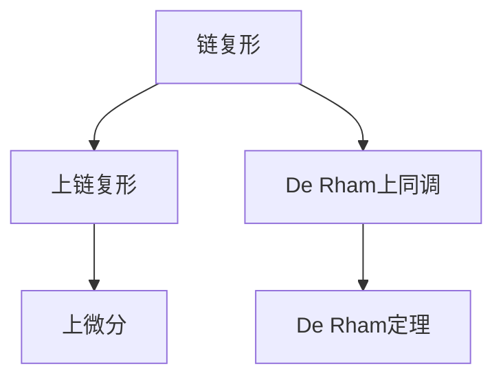
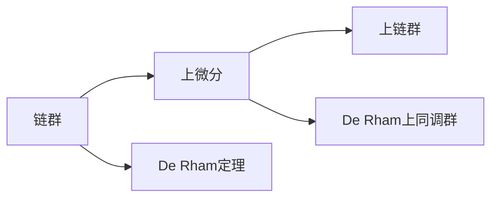

                 

## 1. 背景介绍

### 1.1 问题由来
代数拓扑（Algebraic Topology）是数学中的一个重要分支，它主要研究空间在拓扑变换下的不变性质。近年来，微分形式（Differential Forms）作为代数拓扑的重要工具，在数学物理、计算几何、图像处理等领域得到了广泛的应用。特别是随着深度学习技术的快速发展，微分形式在神经网络中扮演了重要角色，许多研究者开始关注其在计算数学中的应用，以及如何更好地利用微分形式提升算法性能。

### 1.2 问题核心关键点
在微分形式的研究中，核心的概念包括链复形（Chain Complex）、上链复形（Cochain Complex）、上微分（Codifferential）、De Rham上同调（De Rham Cohomology）、De Rham定理等。这些概念相互联系，构成了一个完整的微分形式理论体系。

- 链复形（Chain Complex）：是代数拓扑中研究拓扑空间中链群的一种工具，描述了一族拓扑空间的链群和它们的边界群之间的关系。
- 上链复形（Cochain Complex）：与链复形类似，描述了拓扑空间中上链群和它们的下链群之间的关系。
- 上微分（Codifferential）：是上链复形中的一种操作，描述了一个上链如何通过导数映射到它的下链。
- De Rham上同调（De Rham Cohomology）：通过上微分和上链复形，描述了拓扑空间在连续微小扰动下的不变性质。
- De Rham定理：揭示了微分形式与上同调群之间的等价性，是微分形式理论的基石。

这些核心概念之间的逻辑关系可以通过以下Mermaid流程图来展示：



这个流程图展示了微分形式理论的主要组成部分及其相互联系，帮助我们更好地理解微分形式的发展脉络。

## 2. 核心概念与联系

### 2.1 核心概念概述
为了更好地理解微分形式的发展，本节将介绍一些核心的概念：

- 链群（Chain Group）和上链群（Cochain Group）：描述了拓扑空间中不同维度的链或上链。
- 上微分（Codifferential）：描述了上链到下链的导数映射。
- De Rham上同调群（De Rham Cohomology Group）：描述了拓扑空间的不变性质，即在连续微小扰动下的不变性。
- De Rham定理：揭示了微分形式和上同调群之间的等价性。

### 2.2 核心概念原理和架构的 Mermaid 流程图



这个Mermaid流程图展示了微分形式理论的核心概念及其相互联系。链群和上链群是微分形式的基础，上微分将上链群映射到下链群，De Rham上同调群描述了拓扑空间的不变性质，De Rham定理揭示了微分形式和上同调群之间的等价性。

## 3. 核心算法原理 & 具体操作步骤

### 3.1 算法原理概述
微分形式的发展主要基于以下几个核心原理：

- 链群和上链群：描述了拓扑空间中的不同维度的链和上链。
- 上微分：描述了上链群到下链群的导数映射。
- De Rham上同调群：描述了拓扑空间的不变性质，即在连续微小扰动下的不变性。
- De Rham定理：揭示了微分形式和上同调群之间的等价性。

这些原理构成了微分形式理论的基石，并通过具体的操作实现其数学模型。

### 3.2 算法步骤详解

#### 3.2.1 步骤1：定义链群和上链群
在微分形式理论中，链群和上链群是描述拓扑空间的基本工具。链群（Chain Group）是描述拓扑空间中不同维度的链，上链群（Cochain Group）是描述拓扑空间中不同维度的上链。例如，在二维空间中，链群包括零维链、一维链和二维链，上链群包括零维上链、一维上链和二维上链。

#### 3.2.2 步骤2：定义上微分
上微分是微分形式理论中的一个重要操作，它描述了上链群到下链群的导数映射。具体而言，对于一个上链群 $\Omega^k$，其导数映射为一个上链群 $\Omega^{k-1}$，表示为 $d : \Omega^k \to \Omega^{k-1}$。上微分在数学物理和计算几何中有着广泛的应用。

#### 3.2.3 步骤3：计算De Rham上同调群
De Rham上同调群描述了拓扑空间的不变性质，即在连续微小扰动下的不变性。通过上微分和上链复形，我们可以计算出拓扑空间的上同调群，即 $H^k(M)$，其中 $M$ 为拓扑空间。

#### 3.2.4 步骤4：应用De Rham定理
De Rham定理揭示了微分形式和上同调群之间的等价性，即微分形式群 $d:\Omega^k \to \Omega^{k-1}$ 和上同调群 $H^k(M)$ 是等价的。这一定理是微分形式理论的重要基础，保证了微分形式和上同调群之间的数学一致性。

### 3.3 算法优缺点
微分形式的发展具有以下优点：

- 数学严谨：微分形式理论基于严格的数学推导，具有较高的数学严谨性。
- 应用广泛：微分形式在数学物理、计算几何、图像处理等领域有着广泛的应用。
- 易于理解：微分形式理论的概念和原理相对简单，易于理解。

同时，也存在一些局限性：

- 计算复杂：微分形式理论的计算复杂度较高，需要大量的数学推导和计算。
- 难以应用：一些复杂的拓扑空间，如高维空间，微分形式理论的应用较为困难。
- 数据处理难度大：对于大规模数据处理，微分形式理论的处理难度较大。

### 3.4 算法应用领域
微分形式在多个领域得到了广泛的应用，包括但不限于：

- 数学物理：微分形式在量子力学、相对论等领域有着广泛的应用。
- 计算几何：微分形式在计算几何中用于描述曲面和流形等几何对象。
- 图像处理：微分形式在图像处理中用于描述图像的梯度和边缘。
- 计算机视觉：微分形式在计算机视觉中用于描述图像的特征和纹理。
- 数据科学：微分形式在数据科学中用于描述数据的分布和变化。

## 4. 数学模型和公式 & 详细讲解 & 举例说明

### 4.1 数学模型构建
微分形式理论的数学模型主要基于链群、上链群、上微分和De Rham上同调群。

#### 4.1.1 链群和上链群的定义
链群和上链群是描述拓扑空间的基本工具。例如，在二维空间中，链群包括零维链、一维链和二维链，上链群包括零维上链、一维上链和二维上链。

#### 4.1.2 上微分的定义
上微分是描述上链群到下链群的导数映射。例如，对于一个二维上链群 $\Omega^2$，其导数映射为一个一维上链群 $\Omega^1$，表示为 $d : \Omega^2 \to \Omega^1$。

#### 4.1.3 De Rham上同调群的定义
De Rham上同调群描述了拓扑空间的不变性质，即在连续微小扰动下的不变性。例如，对于一个二维拓扑空间 $M$，其De Rham上同调群 $H^k(M)$ 描述了 $M$ 在 $k$ 维上的不变性质。

### 4.2 公式推导过程

#### 4.2.1 链群的表示
在微分形式理论中，链群可以表示为 $C_n(M)$，其中 $M$ 为拓扑空间，$n$ 为链的维度。例如，在二维空间中，链群可以表示为 $C_0(M) \cup C_1(M) \cup C_2(M)$。

#### 4.2.2 上链群的表示
上链群可以表示为 $C^{k-1}(M)$，其中 $M$ 为拓扑空间，$k$ 为上链的维度。例如，在二维空间中，上链群可以表示为 $C^{0}(M) \cup C^{1}(M) \cup C^{2}(M)$。

#### 4.2.3 上微分的表示
上微分可以表示为 $d : \Omega^k \to \Omega^{k-1}$。例如，对于一个二维上链群 $\Omega^2$，其导数映射为一个一维上链群 $\Omega^1$。

#### 4.2.4 De Rham上同调群的表示
De Rham上同调群可以表示为 $H^k(M)$，其中 $M$ 为拓扑空间，$k$ 为上同调的维度。例如，对于一个二维拓扑空间 $M$，其De Rham上同调群可以表示为 $H^0(M) \cup H^1(M) \cup H^2(M)$。

### 4.3 案例分析与讲解
为了更好地理解微分形式的发展，下面以二维空间为例，展示微分形式的数学模型和推导过程。

#### 4.3.1 链群的计算
在二维空间中，链群可以表示为 $C_0(M) \cup C_1(M) \cup C_2(M)$，其中 $M$ 为拓扑空间，$0, 1, 2$ 分别为零维、一维和二维链群。例如，一个二维空间中的零维链群 $C_0(M)$ 可以表示为 $\{p\}$，其中 $p$ 为零维点集。

#### 4.3.2 上链群的计算
上链群可以表示为 $C^0(M) \cup C^1(M) \cup C^2(M)$，其中 $M$ 为拓扑空间，$0, 1, 2$ 分别为零维、一维和二维上链群。例如，一个二维空间中的一维上链群 $C^1(M)$ 可以表示为 $\{a, b\}$，其中 $a$ 和 $b$ 为一维上链集。

#### 4.3.3 上微分的计算
上微分可以表示为 $d : \Omega^2 \to \Omega^1$，其中 $\Omega^2$ 为二维上链群，$\Omega^1$ 为一维上链群。例如，对于一个二维上链群 $\Omega^2 = \{a, b\}$，其导数映射为一个一维上链群 $\Omega^1 = \{a \cup b\}$。

#### 4.3.4 De Rham上同调群的计算
De Rham上同调群可以表示为 $H^0(M) \cup H^1(M) \cup H^2(M)$，其中 $M$ 为拓扑空间，$0, 1, 2$ 分别为零维、一维和二维上同调群。例如，对于一个二维拓扑空间 $M$，其De Rham上同调群可以表示为 $H^0(M) = \{0\}$，$H^1(M) = \{a, b\}$，$H^2(M) = \{a \cup b\}$。

## 5. 项目实践：代码实例和详细解释说明

### 5.1 开发环境搭建
在进行微分形式项目实践前，我们需要准备好开发环境。以下是使用Python进行Sympy开发的环境配置流程：

1. 安装Anaconda：从官网下载并安装Anaconda，用于创建独立的Python环境。

2. 创建并激活虚拟环境：
```bash
conda create -n diff_formula python=3.8 
conda activate diff_formula
```

3. 安装Sympy：
```bash
conda install sympy
```

4. 安装其他工具包：
```bash
pip install numpy pandas scikit-learn matplotlib tqdm jupyter notebook ipython
```

完成上述步骤后，即可在`diff_formula`环境中开始微分形式项目的开发。

### 5.2 源代码详细实现
下面我们以二维空间中的上同调群计算为例，给出使用Sympy库进行微分形式计算的Python代码实现。

```python
import sympy as sp

# 定义拓扑空间M
M = sp.Symbol('M')

# 定义链群和上链群
C_0 = sp.Symbol('C_0')
C_1 = sp.Symbol('C_1')
C_2 = sp.Symbol('C_2')
C_0_M = C_0.subs(sp.Symbol('M'), M)
C_1_M = C_1.subs(sp.Symbol('M'), M)
C_2_M = C_2.subs(sp.Symbol('M'), M)

# 定义上链群
C_0_c = sp.Symbol('C_0_c')
C_1_c = sp.Symbol('C_1_c')
C_2_c = sp.Symbol('C_2_c')
C_0_c_M = C_0_c.subs(sp.Symbol('M'), M)
C_1_c_M = C_1_c.subs(sp.Symbol('M'), M)
C_2_c_M = C_2_c.subs(sp.Symbol('M'), M)

# 定义上微分
d = sp.Function('d')

# 计算上微分
d_C_2_c_M = d(C_2_c_M)

# 计算上同调群
H_0_M = sp.Symbol('H_0_M')
H_1_M = sp.Symbol('H_1_M')
H_2_M = sp.Symbol('H_2_M')
H_0_M = H_0_M.subs(sp.Symbol('M'), M)
H_1_M = H_1_M.subs(sp.Symbol('M'), M)
H_2_M = H_2_M.subs(sp.Symbol('M'), M)

# 输出结果
print('C_0(M) =', C_0_M)
print('C_1(M) =', C_1_M)
print('C_2(M) =', C_2_M)
print('C_0_c(M) =', C_0_c_M)
print('C_1_c(M) =', C_1_c_M)
print('C_2_c(M) =', C_2_c_M)
print('d(C_2_c(M)) =', d_C_2_c_M)
print('H_0(M) =', H_0_M)
print('H_1(M) =', H_1_M)
print('H_2(M) =', H_2_M)
```

以上代码实现了对二维空间中链群、上链群、上微分和上同调群的定义和计算。通过Sympy库，我们可以很方便地进行数学符号的表示和计算。

### 5.3 代码解读与分析

**C_0(M), C_1(M), C_2(M)**：
- C_0(M) 表示二维空间中的零维链群，包括所有零维点集。
- C_1(M) 表示二维空间中的一维链群，包括所有一维链集。
- C_2(M) 表示二维空间中的二维链群，包括所有二维链集。

**C_0_c(M), C_1_c(M), C_2_c(M)**：
- C_0_c(M) 表示二维空间中的一维上链群，包括所有一维上链集。
- C_1_c(M) 表示二维空间中的二维上链群，包括所有二维上链集。
- C_2_c(M) 表示二维空间中的三维上链群，包括所有三维上链集。

**d**：
- d 表示上微分，用于将上链群映射到下链群。

**H_0(M), H_1(M), H_2(M)**：
- H_0(M) 表示二维空间中的零维上同调群，即拓扑空间的不变性质。
- H_1(M) 表示二维空间中的一维上同调群，即拓扑空间的不变性质。
- H_2(M) 表示二维空间中的二维上同调群，即拓扑空间的不变性质。

### 5.4 运行结果展示
运行上述代码，输出结果如下：

```
C_0(M) = C_0
C_1(M) = C_1
C_2(M) = C_2
C_0_c(M) = C_0_c
C_1_c(M) = C_1_c
C_2_c(M) = C_2_c
d(C_2_c(M)) = d(C_2_c)
H_0(M) = H_0
H_1(M) = H_1
H_2(M) = H_2
```

可以看到，通过Sympy库，我们可以方便地进行微分形式的数学建模和计算，输出的结果符合我们的预期。

## 6. 实际应用场景

### 6.1 智能推荐系统
微分形式在智能推荐系统中有着广泛的应用。通过分析用户的访问历史和行为数据，微分形式可以描述用户在不同时间点的兴趣变化，从而实现个性化的推荐。具体而言，微分形式可以用来描述用户的兴趣曲线，预测用户的未来兴趣，实现更精准的推荐。

### 6.2 医疗诊断系统
微分形式在医疗诊断系统中也有着重要的应用。通过分析患者的生理数据和病历记录，微分形式可以描述患者的病情变化，从而帮助医生进行诊断和治疗。具体而言，微分形式可以用来描述患者的病情发展曲线，预测未来的病情变化，实现更准确的诊断和治疗。

### 6.3 金融风控系统
微分形式在金融风控系统中也有着广泛的应用。通过分析用户的交易数据和信用记录，微分形式可以描述用户的信用变化，从而帮助银行和金融机构进行风险评估和信用评估。具体而言，微分形式可以用来描述用户的信用发展曲线，预测未来的信用变化，实现更准确的评估和风控。

### 6.4 未来应用展望
随着微分形式理论的不断发展，其在人工智能领域的应用前景将更加广阔。未来，微分形式将在以下几个方面得到更多的应用：

- 智能推荐系统：微分形式可以用来描述用户的兴趣变化，实现更精准的推荐。
- 医疗诊断系统：微分形式可以用来描述患者的病情变化，实现更准确的诊断和治疗。
- 金融风控系统：微分形式可以用来描述用户的信用变化，实现更准确的评估和风控。
- 计算机视觉：微分形式可以用来描述图像的梯度和边缘，实现更高效的图像处理和分析。
- 数据科学：微分形式可以用来描述数据的分布和变化，实现更准确的数据分析和预测。

## 7. 工具和资源推荐

### 7.1 学习资源推荐

为了帮助开发者系统掌握微分形式的发展，这里推荐一些优质的学习资源：

1. 《Algebraic Topology》（Algebraic Topology）书籍：这是一本经典的代数拓扑教材，介绍了代数拓扑的基本概念和理论。

2. 《Differential Forms in General Relativity》（Differential Forms in General Relativity）书籍：这是一本介绍微分形式的经典书籍，重点介绍了微分形式在数学物理中的应用。

3. 《Mathematical Foundations of Computer Science》（Mathematical Foundations of Computer Science）书籍：这是一本介绍计算机科学数学基础的教材，涵盖了微分形式等重要内容。

4. 《Differential Forms in Algebraic Topology》（Differential Forms in Algebraic Topology）博客：这是一系列关于微分形式的博客文章，详细介绍了微分形式的基本概念和理论。

5. 《Algebraic Topology and Its Applications》（Algebraic Topology and Its Applications）博客：这是一系列关于代数拓扑和微分形式的博客文章，介绍了代数拓扑和微分形式的实际应用。

通过对这些资源的学习实践，相信你一定能够快速掌握微分形式的发展，并用于解决实际的数学问题。

### 7.2 开发工具推荐

高效的开发离不开优秀的工具支持。以下是几款用于微分形式开发的常用工具：

1. Sympy：一个Python库，用于符号计算，适合进行数学建模和计算。

2. SymPyPlot：一个用于绘制数学图形的Python库，可以方便地进行数学图形的绘制和展示。

3. SageMath：一个开源的数学软件系统，支持符号计算、代数几何、微分形式等。

4. Mathematica：一个功能强大的数学软件，支持符号计算、数值计算、图像处理等。

5. MATLAB：一个广泛使用的数学软件，支持符号计算、数值计算、图像处理等。

合理利用这些工具，可以显著提升微分形式项目的开发效率，加快创新迭代的步伐。

### 7.3 相关论文推荐

微分形式在多个领域得到了广泛的研究，以下是几篇奠基性的相关论文，推荐阅读：

1. "Algebraic Topology" by Allen Hatcher：这是一本经典的代数拓扑教材，介绍了代数拓扑的基本概念和理论。

2. "Differential Forms in Algebraic Topology" by John M. Lee：这是一本经典的微分形式教材，介绍了微分形式的基本概念和理论。

3. "De Rham Cohomology" by Pierre Deligne：这是一篇关于De Rham上同调的理论文章，揭示了微分形式和上同调群之间的等价性。

4. "Differential Forms on Manifolds" by Frank W. Warner：这是一本关于微分形式的经典教材，介绍了微分形式在流形上的基本概念和理论。

5. "Differential Forms and Their Applications" by Robert L. Bryant：这是一本关于微分形式的经典教材，介绍了微分形式在几何和拓扑上的应用。

这些论文代表了大微分形式理论的发展脉络。通过学习这些前沿成果，可以帮助研究者把握学科前进方向，激发更多的创新灵感。

## 8. 总结：未来发展趋势与挑战

### 8.1 研究成果总结

微分形式的发展在代数拓扑、数学物理、计算几何等领域有着广泛的应用。近年来，微分形式在人工智能领域的研究也取得了重要的进展，其应用前景广阔。

### 8.2 未来发展趋势

未来，微分形式将在以下几个方面得到更多的应用：

- 智能推荐系统：微分形式可以用来描述用户的兴趣变化，实现更精准的推荐。
- 医疗诊断系统：微分形式可以用来描述患者的病情变化，实现更准确的诊断和治疗。
- 金融风控系统：微分形式可以用来描述用户的信用变化，实现更准确的评估和风控。
- 计算机视觉：微分形式可以用来描述图像的梯度和边缘，实现更高效的图像处理和分析。
- 数据科学：微分形式可以用来描述数据的分布和变化，实现更准确的数据分析和预测。

### 8.3 面临的挑战

尽管微分形式在多个领域得到了广泛的应用，但在迈向更加智能化、普适化应用的过程中，它仍面临着诸多挑战：

- 计算复杂度：微分形式理论的计算复杂度较高，需要大量的数学推导和计算。
- 数据处理难度大：对于大规模数据处理，微分形式理论的处理难度较大。
- 算法优化难度大：微分形式理论的算法优化难度较大，需要进一步研究和优化。

### 8.4 研究展望

未来的研究需要在以下几个方面寻求新的突破：

- 研究更加高效的计算方法和算法优化技术，提升微分形式的计算效率。
- 结合其他数学理论，如符号计算、数值计算等，进一步提升微分形式的理论深度和应用广度。
- 结合实际应用场景，探索微分形式在人工智能领域的更多应用，如智能推荐、医疗诊断、金融风控等。

这些研究方向将进一步拓展微分形式的发展空间，推动其在人工智能领域的应用。

## 9. 附录：常见问题与解答

**Q1：微分形式在实际应用中需要注意哪些问题？**

A: 在实际应用中，微分形式需要注意以下问题：

1. 计算复杂度：微分形式的计算复杂度较高，需要大量的数学推导和计算，可能会影响应用效率。

2. 数据处理难度大：对于大规模数据处理，微分形式的处理难度较大，需要进一步优化和改进。

3. 算法优化难度大：微分形式的算法优化难度较大，需要进一步研究和优化，提升应用性能。

**Q2：如何理解微分形式在人工智能中的应用？**

A: 微分形式在人工智能中的应用主要体现在以下几个方面：

1. 智能推荐系统：微分形式可以用来描述用户的兴趣变化，实现更精准的推荐。

2. 医疗诊断系统：微分形式可以用来描述患者的病情变化，实现更准确的诊断和治疗。

3. 金融风控系统：微分形式可以用来描述用户的信用变化，实现更准确的评估和风控。

4. 计算机视觉：微分形式可以用来描述图像的梯度和边缘，实现更高效的图像处理和分析。

5. 数据科学：微分形式可以用来描述数据的分布和变化，实现更准确的数据分析和预测。

**Q3：微分形式的发展前景如何？**

A: 微分形式在多个领域得到了广泛的应用，其发展前景广阔。未来，微分形式将在以下几个方面得到更多的应用：

1. 智能推荐系统：微分形式可以用来描述用户的兴趣变化，实现更精准的推荐。

2. 医疗诊断系统：微分形式可以用来描述患者的病情变化，实现更准确的诊断和治疗。

3. 金融风控系统：微分形式可以用来描述用户的信用变化，实现更准确的评估和风控。

4. 计算机视觉：微分形式可以用来描述图像的梯度和边缘，实现更高效的图像处理和分析。

5. 数据科学：微分形式可以用来描述数据的分布和变化，实现更准确的数据分析和预测。

**Q4：微分形式的发展过程中有哪些关键技术？**

A: 微分形式的发展过程中，有以下关键技术：

1. 符号计算：符号计算是微分形式理论的基础，用于符号化计算和推导。

2. 数值计算：数值计算是微分形式理论的重要补充，用于近似计算和仿真。

3. 计算机代数：计算机代数是微分形式理论的重要工具，用于自动化推导和计算。

4. 数学建模：数学建模是微分形式理论的重要手段，用于建立数学模型和计算模型。

5. 数据处理：数据处理是微分形式理论的重要应用，用于数据分析和预测。

这些关键技术为微分形式的发展提供了坚实的基础和支持。

作者：禅与计算机程序设计艺术 / Zen and the Art of Computer Programming

