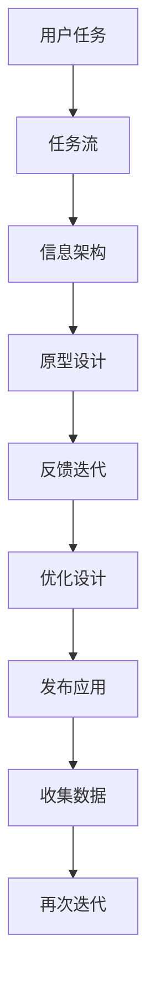

                 

# 任务导向设计思维在CUI中的详细应用解析

## 1. 背景介绍

### 1.1 问题由来

在现代信息技术快速发展的背景下，用户接口设计（CUI，Computer User Interface）成为了提升用户体验的重要手段。然而，在CUI设计中，如何平衡功能性与易用性、信息与操作等，成为一项复杂且富有挑战性的任务。任务导向设计思维（Task-Oriented Design Thinking, TODT）作为一款具有强大应用潜力的设计方法，其关注核心任务与用户需求，推动设计向更深层次的用户体验优化。

在CUI设计中，任务导向设计思维的应用已经成为设计领域的关注焦点。其能够将复杂的交互过程简化，提升用户操作效率，增强用户体验，进而提升用户满意度与使用频率。

### 1.2 问题核心关键点

任务导向设计思维的核心在于将用户体验中心化，强调用户任务在产品设计中的主导地位。主要关键点包括：

- **用户任务**：明确用户完成任务的具体场景与步骤，并以此为核心进行设计。
- **用户流程**：分析用户完成特定任务时的行为路径与互动方式，优化每个步骤的操作。
- **设计优先级**：根据任务完成的高效性和易用性，设定不同功能与信息的重要程度。
- **用户反馈**：重视用户对设计效果的真实反馈，进行持续迭代优化。

这些核心关键点构成了一个以用户为中心，以任务为中心的设计框架，为用户与系统之间搭建了沟通的桥梁。

## 2. 核心概念与联系

### 2.1 核心概念概述

任务导向设计思维（TODT）结合了用户中心的设计思想和面向任务的设计方法，专注于提升用户完成特定任务时的体验。其核心概念包括：

- **任务**：用户意图完成的具体活动或过程。
- **任务流**：用户完成任务的连续步骤和操作路径。
- **信息架构**：设计中组织信息的框架，确保信息按照任务相关性排序。
- **原型设计**：通过快速原型构建与用户交互，验证设计思路与效果。

这些概念通过流程化的步骤相互联系，构成了任务导向设计思维的实践体系。

### 2.2 核心概念原理和架构的 Mermaid 流程图



这个流程图展示了任务导向设计思维从任务定义到原型设计再到持续迭代优化的全过程。

## 3. 核心算法原理 & 具体操作步骤

### 3.1 算法原理概述

任务导向设计思维的核心算法原理是基于用户任务路径和信息架构，进行用户操作流程的优化与设计原型构建。具体步骤如下：

1. **任务分析**：对用户的具体任务进行深入分析，明确任务的目标、输入与输出。
2. **任务流设计**：分析用户完成任务的步骤与流程，设定每个步骤的操作方式。
3. **信息架构构建**：根据任务相关性，设计信息组织结构，简化信息检索与理解。
4. **原型设计**：构建可交互原型，验证设计思路与用户体验。
5. **反馈迭代**：收集用户反馈，持续优化设计原型。

### 3.2 算法步骤详解

#### 3.2.1 任务分析

任务分析是任务导向设计思维的第一步，主要包括以下几个步骤：

1. **明确任务目标**：确定用户希望通过产品实现的具体目标。
2. **识别用户输入与输出**：分析用户需要输入的信息与系统输出的结果。
3. **任务路径分析**：绘制用户完成任务的步骤与流程，确定每个步骤的具体行为。

#### 3.2.2 任务流设计

任务流设计关注于用户完成任务的具体操作步骤，主要包括以下几个方面：

1. **操作步骤设定**：定义用户操作的具体动作，如点击、滑动、输入等。
2. **步骤顺序编排**：根据任务逻辑，对操作步骤进行合理编排，提升操作流程的连贯性与流畅性。
3. **交互方式选择**：选择与任务相关的交互方式，如按钮、滑块、复选框等。

#### 3.2.3 信息架构构建

信息架构的设计旨在简化信息的检索与理解，主要包括以下几个步骤：

1. **信息分类**：对任务相关的信息进行分类，确保信息按照重要性与相关性排序。
2. **信息组织**：设计信息的层次结构，构建清晰的导航与检索路径。
3. **信息展示**：选择合适的信息展示方式，确保用户易于理解与操作。

#### 3.2.4 原型设计

原型设计是任务导向设计思维的核心环节，主要包括以下几个步骤：

1. **功能模块划分**：根据任务需求，划分功能模块与页面布局。
2. **交互设计**：设计用户界面与交互元素，确保操作顺畅、直观。
3. **原型构建**：使用设计工具构建可交互原型，如Sketch、Axure等。
4. **用户测试**：对原型进行用户测试，验证设计思路与用户体验。

#### 3.2.5 反馈迭代

反馈迭代是任务导向设计思维的持续优化阶段，主要包括以下几个步骤：

1. **用户反馈收集**：收集用户对原型的使用体验与意见反馈。
2. **问题识别与分析**：识别用户在使用过程中遇到的问题，分析其原因。
3. **优化设计与改进**：根据反馈结果，优化设计原型与操作流程。
4. **测试与验证**：重复测试与优化过程，直到用户满意度达到预期。

### 3.3 算法优缺点

任务导向设计思维具有以下优点：

- **用户中心**：强调用户体验，以用户任务为核心，提升用户满意度。
- **操作简便**：简化用户操作步骤，提升操作效率。
- **信息清晰**：优化信息架构，简化信息检索与理解。

同时，任务导向设计思维也存在一些缺点：

- **设计复杂**：需要详细分析用户任务与操作路径，设计过程较为繁琐。
- **依赖反馈**：依赖用户反馈进行持续优化，设计周期较长。
- **灵活性受限**：对于突发或复杂任务，设计变更可能较为困难。

### 3.4 算法应用领域

任务导向设计思维在CUI设计中有着广泛的应用，特别是在以下领域：

- **移动应用**：简化用户操作步骤，提升用户体验。
- **网站设计**：优化信息架构，提升用户信息检索与使用效率。
- **智能设备**：设计简洁易用的交互界面，提升用户操作体验。
- **企业信息系统**：优化业务流程，提升工作效率与操作便捷性。
- **车载系统**：简化操作路径，提升用户驾驶与导航体验。

## 4. 数学模型和公式 & 详细讲解 & 举例说明

### 4.1 数学模型构建

任务导向设计思维的数学模型构建主要基于任务路径与信息架构。假设用户任务路径包含 $n$ 个步骤，每个步骤的操作时间与难度分别为 $t_i$ 和 $d_i$，信息结构包含 $m$ 个信息类别，信息重要性指数为 $w_j$。

则设计任务的总完成时间 $T$ 可表示为：

$$
T = \sum_{i=1}^n t_i + \sum_{j=1}^m w_j \times c_j
$$

其中 $c_j$ 表示用户访问信息类别 $j$ 的频率。

### 4.2 公式推导过程

在推导公式前，先定义以下变量：

- $t_i$：用户完成第 $i$ 个任务步骤所需时间。
- $d_i$：用户完成第 $i$ 个任务步骤的难度系数。
- $w_j$：信息类别 $j$ 对用户任务完成的重要性。
- $c_j$：用户访问信息类别 $j$ 的频率。

根据任务路径和信息架构，设计总完成时间 $T$ 的推导如下：

1. **任务路径时间计算**：
$$
T_{task} = \sum_{i=1}^n t_i \times d_i
$$

2. **信息结构时间计算**：
$$
T_{info} = \sum_{j=1}^m w_j \times c_j
$$

3. **总完成时间计算**：
$$
T = T_{task} + T_{info}
$$

### 4.3 案例分析与讲解

以一个在线购物网站的CUI设计为例，分析任务导向设计思维的应用。

#### 4.3.1 任务路径分析

1. **用户任务**：在线购物。
2. **输入与输出**：用户输入搜索关键词、浏览商品、选择商品、结算付款等。
3. **任务路径**：
   - 进入网站，输入关键词
   - 浏览搜索结果
   - 选择商品，查看商品详情
   - 添加到购物车
   - 结算付款

#### 4.3.2 信息架构设计

1. **信息分类**：
   - 商品分类信息：服装、家居、电子产品等
   - 用户评价信息：用户评分、评论
   - 价格与优惠信息：打折信息、促销活动

2. **信息组织**：
   - 商品分类信息展示在顶部导航栏
   - 用户评价信息展示在商品详情页底部
   - 价格与优惠信息实时更新，展示在商品详情页右侧

3. **信息展示**：
   - 商品分类信息以图标形式展示
   - 用户评价信息以星级与文本形式展示
   - 价格与优惠信息以标签形式展示

#### 4.3.3 原型设计

1. **功能模块划分**：
   - 首页：展示商品分类与热销商品
   - 搜索结果页：展示搜索结果、商品图片与信息
   - 商品详情页：展示商品图片、描述、价格、用户评价
   - 购物车页：展示已选商品与购物车信息
   - 结算页：展示商品信息、价格、优惠信息

2. **交互设计**：
   - 搜索框：用户输入关键词进行搜索
   - 商品图片：用户点击图片查看商品详情
   - 商品详情：用户选择商品添加到购物车
   - 购物车：用户查看已选商品与结算

3. **原型构建**：
   - 使用Sketch或Axure等设计工具构建原型
   - 进行用户测试，收集反馈

4. **用户测试**：
   - 邀请用户测试原型
   - 记录用户操作步骤与时间
   - 分析用户反馈与问题

#### 4.3.4 反馈迭代

1. **用户反馈收集**：
   - 问卷调查
   - 用户访谈
   - 使用数据分析工具

2. **问题识别与分析**：
   - 分析用户操作步骤与时间
   - 识别用户操作难点与信息检索障碍

3. **优化设计与改进**：
   - 优化商品分类展示方式
   - 优化商品图片展示方式
   - 优化用户评价展示方式

4. **测试与验证**：
   - 再次邀请用户测试优化后的原型
   - 收集反馈与数据
   - 持续优化设计，直至用户满意度达到预期

## 5. 项目实践：代码实例和详细解释说明

### 5.1 开发环境搭建

1. **安装设计工具**：安装Sketch、Axure、Figma等设计工具，并进行配置。
2. **搭建开发环境**：安装Python、PyCharm等开发工具，配置开发环境。
3. **准备数据集**：准备任务路径与信息结构的数据集，并进行数据清洗与处理。
4. **选择算法**：选择适合的任务导向设计思维算法，如任务路径优化算法、信息结构优化算法等。

### 5.2 源代码详细实现

以下是一个简单的原型设计示例，使用Python语言和Sketch工具：

```python
import sketchpy as sk

# 定义任务路径与信息架构
task_path = ["search", "browse", "details", "add_to_cart", "checkout"]
info_structure = ["product_categories", "user_reviews", "prices"]

# 构建原型
sk.open_document()
sk.add_component(task_path[0])
sk.add_component(task_path[1])
sk.add_component(task_path[2])
sk.add_component(task_path[3])
sk.add_component(task_path[4])

# 添加信息架构
sk.add_component(info_structure[0])
sk.add_component(info_structure[1])
sk.add_component(info_structure[2])

# 保存原型
sk.save_document("CUI_design原型.sketch")
```

### 5.3 代码解读与分析

1. **任务路径设定**：通过sketchpy库在Sketch中添加任务路径组件。
2. **信息架构设计**：在任务路径组件之间添加信息架构组件，实现信息结构的可视化。
3. **原型保存**：将设计好的原型保存到Sketch文件中，以便后续用户测试与反馈。

### 5.4 运行结果展示

运行上述代码，可以在Sketch中生成一个初步的CUI设计原型。可以通过Sketch的测试工具，模拟用户操作，记录操作步骤与时间，进行初步的用户测试。

## 6. 实际应用场景

### 6.1 智能设备

任务导向设计思维在智能设备中的应用，可以提升用户操作体验，简化操作步骤。例如，智能音箱中的语音交互设计，用户只需说出指令即可完成播放、查询、控制等操作。

#### 6.1.1 设计思路

1. **任务分析**：用户希望通过语音指令控制智能音箱。
2. **任务流设计**：用户说出指令，智能音箱识别并执行。
3. **信息架构构建**：将常用指令分类展示在音箱界面上。
4. **原型设计**：设计简洁易用的语音交互界面。
5. **反馈迭代**：通过用户反馈，优化语音识别与指令执行。

#### 6.1.2 案例分析

1. **任务路径分析**：
   - 用户说出指令
   - 智能音箱识别指令
   - 执行指令

2. **信息架构设计**：
   - 常用指令分类展示在界面上
   - 每个指令配有简要说明与图片

3. **原型设计**：
   - 设计简洁易用的语音界面
   - 语音识别与指令执行快速响应

4. **反馈迭代**：
   - 通过用户反馈，优化语音识别准确率
   - 优化指令执行速度与响应

### 6.2 企业信息系统

任务导向设计思维在企业信息系统中的应用，可以优化业务流程，提升工作效率与操作便捷性。例如，ERP系统中的订单处理流程设计。

#### 6.2.1 设计思路

1. **任务分析**：用户希望快速处理订单。
2. **任务流设计**：用户输入订单信息，系统生成订单，打印订单单据。
3. **信息架构构建**：将订单信息分类展示在界面上。
4. **原型设计**：设计简洁易用的订单处理界面。
5. **反馈迭代**：通过用户反馈，优化订单处理流程。

#### 6.2.2 案例分析

1. **任务路径分析**：
   - 用户输入订单信息
   - 系统生成订单
   - 打印订单单据

2. **信息架构设计**：
   - 订单信息分类展示在界面上
   - 订单状态实时更新

3. **原型设计**：
   - 设计简洁易用的订单界面
   - 快速生成与打印订单单据

4. **反馈迭代**：
   - 通过用户反馈，优化订单输入与处理速度
   - 优化订单状态显示与更新

### 6.3 车载系统

任务导向设计思维在车载系统中的应用，可以简化用户操作路径，提升驾驶与导航体验。例如，车载导航系统中的路线规划设计。

#### 6.3.1 设计思路

1. **任务分析**：用户希望快速规划并导航至目的地。
2. **任务流设计**：用户输入目的地，系统规划并展示导航路线。
3. **信息架构构建**：将导航路线分类展示在界面上。
4. **原型设计**：设计简洁易用的导航界面。
5. **反馈迭代**：通过用户反馈，优化导航路线与体验。

#### 6.3.2 案例分析

1. **任务路径分析**：
   - 用户输入目的地
   - 系统规划导航路线
   - 展示导航路线

2. **信息架构设计**：
   - 导航路线分类展示在界面上
   - 导航状态实时更新

3. **原型设计**：
   - 设计简洁易用的导航界面
   - 快速规划与展示导航路线

4. **反馈迭代**：
   - 通过用户反馈，优化导航路线规划
   - 优化导航状态显示与更新

## 7. 工具和资源推荐

### 7.1 学习资源推荐

1. **书籍**：《用户体验设计指南》、《设计心理学》等，系统介绍用户中心设计与用户体验优化。
2. **在线课程**：Udacity的《用户体验设计基础》、Coursera的《用户体验设计》等，深入讲解用户中心设计方法与实践。
3. **博客与文章**：Nielsen Norman Group的《设计心理学》、Smashing Magazine的《用户体验设计》等，提供丰富的设计案例与实践经验。
4. **工具与资源**：Sketch、Axure、Figma等设计工具，提供强大的原型设计与用户测试功能。

### 7.2 开发工具推荐

1. **设计工具**：Sketch、Axure、Figma等，支持原型设计与用户测试。
2. **开发工具**：PyCharm、Eclipse等，支持开发与测试。
3. **版本控制**：Git、SVN等，支持代码版本控制与协作开发。

### 7.3 相关论文推荐

1. **《用户中心设计：基于任务导向的设计思维》**：系统介绍任务导向设计思维的理论基础与应用实践。
2. **《用户体验设计：用户中心的设计方法》**：深入分析用户中心设计方法的原理与实现。
3. **《智能设备中的交互设计》**：探讨智能设备中用户交互设计的方法与实践。
4. **《企业信息系统中的用户体验设计》**：研究企业信息系统中的用户体验优化方法与策略。

## 8. 总结：未来发展趋势与挑战

### 8.1 研究成果总结

任务导向设计思维在CUI设计中的应用，已经取得了显著的成效。通过系统分析用户任务与操作路径，优化信息架构与原型设计，极大提升了用户体验与操作效率。未来，任务导向设计思维将继续在CUI设计中发挥重要作用。

### 8.2 未来发展趋势

1. **智能化与个性化**：结合人工智能技术，实现个性化任务导向设计。例如，根据用户行为与偏好，优化任务路径与信息架构。
2. **跨平台与跨设备**：设计跨平台与跨设备的CUI，提升用户在不同设备上的体验一致性。
3. **交互式与动态化**：引入交互式与动态化的设计方法，提升用户体验与操作灵活性。例如，基于用户操作动态调整界面布局与展示方式。
4. **多模态与情感计算**：结合多模态技术与情感计算方法，提升CUI设计的情感化与人性化。

### 8.3 面临的挑战

1. **用户需求多样性**：不同用户的需求与偏好不同，设计需要兼顾多样性与个性化。
2. **技术复杂性**：结合人工智能与多模态技术的复杂设计，需要跨学科的协作与技术支持。
3. **设计周期长**：系统化与科学化的设计方法，设计周期较长，需要持续迭代优化。
4. **数据隐私与安全**：设计过程中涉及用户数据的收集与处理，需要严格的数据隐私与安全保障。

### 8.4 研究展望

未来，任务导向设计思维将继续在CUI设计中发挥重要作用，结合人工智能与多模态技术，提升用户体验与操作效率。同时，需要注重用户需求的多样性、设计的复杂性与数据的隐私与安全问题，推动CUI设计向更科学、更智能、更人性化的方向发展。

## 9. 附录：常见问题与解答

### Q1：任务导向设计思维适用于所有CUI设计吗？

A: 任务导向设计思维适用于大部分CUI设计，尤其是面向用户完成特定任务的设计。然而，对于一些突发性或复杂任务，需要结合其他设计方法与技术手段进行优化。

### Q2：如何评估任务导向设计思维的效果？

A: 评估任务导向设计思维的效果，需要从用户满意度、操作效率、信息检索与理解三个维度进行综合评估。可以通过用户调研、用户测试、数据统计等方法，分析任务导向设计思维的效果与改进方向。

### Q3：如何优化任务导向设计思维的设计流程？

A: 优化任务导向设计思维的设计流程，可以从以下几个方面入手：
1. **任务分析**：深入分析用户需求与任务路径，明确任务目标与用户输入输出。
2. **任务流设计**：简化用户操作步骤，优化任务流路径，提升操作效率。
3. **信息架构构建**：优化信息结构，简化信息检索与理解。
4. **原型设计**：快速构建可交互原型，进行用户测试与反馈。
5. **反馈迭代**：重视用户反馈，持续优化设计原型与操作流程。

### Q4：任务导向设计思维与用户中心设计有何区别？

A: 任务导向设计思维与用户中心设计方法有相似之处，但更注重用户完成任务的具体步骤与操作路径。用户中心设计方法更关注用户需求与行为，更注重整体用户体验的优化。

### Q5：任务导向设计思维与用户中心设计如何结合？

A: 任务导向设计思维与用户中心设计可以结合使用，将任务导向设计思维用于具体任务的优化，用户中心设计方法用于整体用户体验的优化。结合二者，可以提升CUI设计的科学性与系统性。

---

作者：禅与计算机程序设计艺术 / Zen and the Art of Computer Programming

