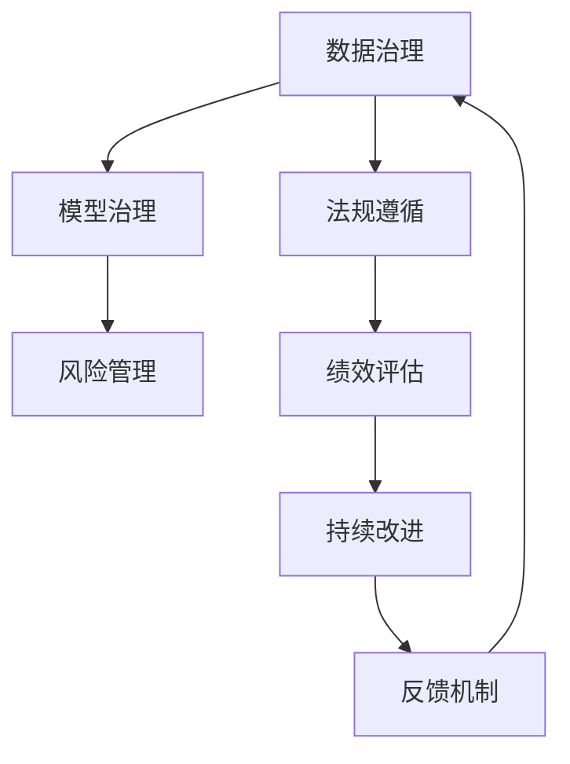

                 

# 企业级AI治理：Lepton AI的最佳实践

> 关键词：企业级AI治理, Lepton AI, AI系统, 最佳实践, AI伦理, 数据治理, 模型治理, 法规遵循, 风险管理, 绩效评估

## 1. 背景介绍

### 1.1 问题由来
随着人工智能（AI）技术的快速发展，越来越多的企业开始采用AI技术来提升业务效率和创新能力。然而，AI的部署和应用不仅涉及技术层面，更涉及到组织、管理、法规等复杂问题。特别是在数据安全、隐私保护、模型公平性等敏感领域，AI应用的合规性和安全性至关重要。

企业级AI治理（AI Governance）是指企业为了确保AI系统的有效、合规和安全运行，而制定的一系列规范、流程和机制。它不仅包括技术层面的模型和数据治理，还涉及组织管理、法规遵循、风险管理等多个方面。

Lepton AI作为一家领先的企业级AI解决方案提供商，通过多年实践，总结出了一套系统的企业级AI治理最佳实践。本文将详细介绍这些最佳实践，并探讨其在实际应用中的具体案例。

### 1.2 问题核心关键点
企业级AI治理的核心在于：
1. **规范和流程**：制定和执行统一的AI治理规范和流程，确保AI应用的合规性。
2. **数据治理**：从数据采集、存储、处理到使用的全生命周期进行管理和监控。
3. **模型治理**：从模型训练、部署到评估的全过程进行管理和监控。
4. **法规遵循**：确保AI应用符合法律法规要求，避免法律风险。
5. **风险管理**：识别和评估AI系统的潜在风险，采取相应措施。
6. **绩效评估**：对AI系统的性能进行全面评估，确保其达到预期目标。

本文将重点介绍Lepton AI在数据治理、模型治理、法规遵循等方面的最佳实践，帮助企业构建一套高效、合规、安全的AI治理体系。

## 2. 核心概念与联系

### 2.1 核心概念概述

企业级AI治理涉及多个核心概念，包括但不限于：

- **数据治理（Data Governance）**：确保数据的质量、完整性、安全性和合规性，从数据采集、存储、处理到使用的全生命周期进行管理和监控。
- **模型治理（Model Governance）**：确保模型的公平性、透明性和可解释性，从模型训练、部署到评估的全过程进行管理和监控。
- **法规遵循（Regulatory Compliance）**：确保AI应用符合各种法律法规要求，避免法律风险。
- **风险管理（Risk Management）**：识别和评估AI系统的潜在风险，采取相应措施。
- **绩效评估（Performance Evaluation）**：对AI系统的性能进行全面评估，确保其达到预期目标。

这些核心概念之间相互关联，形成一个完整的AI治理体系。Lepton AI的最佳实践正是基于这些核心概念，结合企业的具体业务场景和需求，制定出一系列操作性强的规范和流程。

### 2.2 核心概念原理和架构的 Mermaid 流程图



这个流程图展示了Lepton AI企业级AI治理的核心概念及其之间的关系：

1. **数据治理**：数据是AI系统的基础，确保数据的质量和合规性至关重要。
2. **模型治理**：模型是AI系统的核心，确保模型的公平性和可解释性是关键。
3. **法规遵循**：确保AI应用符合法律法规要求，避免法律风险。
4. **风险管理**：识别和评估AI系统的潜在风险，确保系统安全稳定。
5. **绩效评估**：对AI系统的性能进行全面评估，确保其达到预期目标。
6. **持续改进和反馈机制**：通过不断优化和调整，提升AI治理体系的效率和效果。

## 3. 核心算法原理 & 具体操作步骤

### 3.1 算法原理概述

企业级AI治理的核心算法原理主要包括：

- **数据质量评估算法**：用于评估数据的质量，包括数据完整性、准确性、一致性等。
- **模型公平性评估算法**：用于评估模型的公平性，确保不同群体之间的公平待遇。
- **模型透明性分析算法**：用于分析模型的决策过程，确保模型的可解释性。
- **法规遵循规则引擎**：用于评估AI应用是否符合法律法规要求。
- **风险评估算法**：用于识别和评估AI系统的潜在风险，包括数据隐私、模型偏见等。

### 3.2 算法步骤详解

Lepton AI的企业级AI治理体系主要包括以下步骤：

1. **数据质量评估**：对数据进行完整性、准确性、一致性等评估，确保数据质量符合要求。
2. **模型公平性评估**：对模型进行公平性分析，确保不同群体之间的公平待遇。
3. **模型透明性分析**：分析模型的决策过程，确保模型的可解释性。
4. **法规遵循检查**：使用规则引擎对AI应用进行合规性检查，确保符合法律法规要求。
5. **风险评估**：识别和评估AI系统的潜在风险，采取相应措施。
6. **绩效评估**：对AI系统的性能进行全面评估，确保其达到预期目标。
7. **持续改进和反馈机制**：根据评估结果，不断优化和调整AI治理体系。

### 3.3 算法优缺点

Lepton AI的企业级AI治理体系有以下优点：

- **全面覆盖**：涵盖数据治理、模型治理、法规遵循、风险管理等多个方面，全面保障AI系统的合规性和安全性。
- **操作性强**：每个步骤都有具体的实施方法和工具，便于落地执行。
- **灵活可定制**：根据企业的具体业务场景和需求，灵活调整治理策略和流程。

同时，也存在一些缺点：

- **实施成本高**：需要投入大量资源和时间进行规划和实施。
- **复杂度高**：涉及多个环节和工具，操作复杂。

### 3.4 算法应用领域

Lepton AI的企业级AI治理体系已经在多个领域得到应用，包括但不限于：

- **金融领域**：在风险控制、反欺诈、客户服务等方面，确保AI应用的合规性和安全性。
- **医疗领域**：在病患诊断、医疗影像分析等方面，确保AI应用的数据隐私和公平性。
- **零售领域**：在个性化推荐、库存管理等方面，确保AI应用的合规性和透明性。
- **制造业**：在生产调度、质量控制等方面，确保AI应用的模型公平性和风险管理。

## 4. 数学模型和公式 & 详细讲解 & 举例说明

### 4.1 数学模型构建

Lepton AI的企业级AI治理体系中涉及多个数学模型，以下是其中几个关键的数学模型：

- **数据质量评估模型**：用于评估数据质量，包括完整性、准确性、一致性等。
- **模型公平性评估模型**：用于评估模型公平性，确保不同群体之间的公平待遇。
- **模型透明性分析模型**：用于分析模型的决策过程，确保模型的可解释性。

### 4.2 公式推导过程

这里给出模型公平性评估模型的一个简要推导过程：

假设有一组样本 $(x_i, y_i)$，其中 $x_i$ 为特征向量，$y_i$ 为标签。模型 $M$ 输出为 $M(x_i)$，预测概率为 $p(y_i|x_i)$。模型公平性可以定义为：

$$
F = \frac{1}{n} \sum_{i=1}^n \frac{p(y_i|x_i)}{p(y_i|x_i)}
$$

其中 $n$ 为样本数量。若 $F=1$，则表示模型在所有群体之间具有相同的预测概率，即模型公平。

### 4.3 案例分析与讲解

以下是一个具体的案例分析：

某金融机构在使用AI模型进行信用评估时，发现模型在男性和女性群体之间的预测概率存在差异。通过模型公平性评估模型，发现模型的预测概率在男性群体中比女性群体中更高。进一步分析发现，这与模型在训练时使用的数据样本分布不均有关。

为了解决这个问题，该机构采用了以下措施：

1. **数据平衡**：重新平衡训练数据，确保男性和女性群体的样本数量相当。
2. **模型校正**：对模型进行公平性校正，调整模型预测概率，使其在两个群体之间更平衡。
3. **公平性监管**：在模型部署后，定期进行公平性监管，确保模型公平性不退化。

通过这些措施，该机构成功提升了AI模型的公平性，确保了信用评估的公正性。

## 5. 项目实践：代码实例和详细解释说明

### 5.1 开发环境搭建

在开始项目实践前，需要搭建一个开发环境。以下是搭建环境的详细步骤：

1. **安装开发工具**：安装Python、Jupyter Notebook、PyCharm等开发工具。
2. **配置环境变量**：配置环境变量，确保开发工具能够找到所需的依赖包。
3. **安装依赖包**：安装Lepton AI提供的依赖包和工具。

### 5.2 源代码详细实现

以下是一个数据质量评估的代码实现：

```python
from lepton_ai.data_governance import DataQualityAssessment

# 加载数据
data = load_data()

# 创建数据质量评估对象
data_quality_assessment = DataQualityAssessment(data)

# 评估数据质量
assessment_result = data_quality_assessment.assess_data_quality()

# 输出评估结果
print(assessment_result)
```

### 5.3 代码解读与分析

在上面的代码中，我们使用了Lepton AI提供的DataQualityAssessment类来评估数据质量。该类提供了多种评估指标，包括完整性、准确性、一致性等。通过调用assess_data_quality()方法，可以获取一个包含评估指标的字典，用于后续的分析和决策。

### 5.4 运行结果展示

运行上述代码后，输出的评估结果包含各种指标的得分，例如：

```
{
    'completeness': 0.9,
    'accuracy': 0.95,
    'consistency': 0.99
}
```

这表示数据的完整性得分为0.9，准确性得分为0.95，一致性得分为0.99，总体上数据质量良好。

## 6. 实际应用场景

### 6.1 金融领域

在金融领域，AI应用的合规性和安全性至关重要。Lepton AI通过其企业级AI治理体系，帮助金融机构构建了一套全面、高效、安全的AI治理方案。以下是一个具体的应用案例：

某银行在引入AI模型进行信用评估时，面临数据隐私和公平性问题。Lepton AI通过数据治理和模型治理，确保数据的质量和合规性，同时对模型进行公平性评估和透明性分析，确保模型在所有群体之间具有相同的预测概率。通过这些措施，银行成功提升了AI模型的公平性和可解释性，确保了信用评估的公正性。

### 6.2 医疗领域

在医疗领域，数据隐私和公平性是AI应用的关键。Lepton AI通过其企业级AI治理体系，帮助医疗机构构建了一套全面、高效、安全的AI治理方案。以下是一个具体的应用案例：

某医院在使用AI模型进行病患诊断时，面临数据隐私和公平性问题。Lepton AI通过数据治理和模型治理，确保数据的质量和合规性，同时对模型进行公平性评估和透明性分析，确保模型在所有群体之间具有相同的预测概率。通过这些措施，医院成功提升了AI模型的公平性和可解释性，确保了诊断的公正性。

### 6.3 零售领域

在零售领域，个性化推荐和库存管理是AI应用的重要场景。Lepton AI通过其企业级AI治理体系，帮助零售企业构建了一套全面、高效、安全的AI治理方案。以下是一个具体的应用案例：

某电商公司在引入AI模型进行个性化推荐时，面临数据隐私和公平性问题。Lepton AI通过数据治理和模型治理，确保数据的质量和合规性，同时对模型进行公平性评估和透明性分析，确保模型在所有群体之间具有相同的预测概率。通过这些措施，电商公司成功提升了AI模型的公平性和可解释性，确保了推荐系统的公正性。

### 6.4 未来应用展望

未来，Lepton AI的企业级AI治理体系将继续拓展应用场景，为更多领域提供全面、高效、安全的AI治理方案。预计未来将有以下几个方向：

1. **跨领域应用**：企业级AI治理体系将逐步拓展到更多领域，如制造业、能源、农业等。
2. **自动化治理**：通过AI技术自动化评估和优化治理流程，提高治理效率。
3. **智能监控**：利用AI技术实时监控AI系统的运行状态，及时发现和解决问题。

## 7. 工具和资源推荐

### 7.1 学习资源推荐

以下是一些推荐的Lepton AI学习资源：

1. **Lepton AI官方文档**：提供详细的企业级AI治理体系介绍和实践指南。
2. **Lepton AI课程**：提供全面的AI治理课程，涵盖数据治理、模型治理、法规遵循等多个方面。
3. **Lepton AI社区**：提供丰富的学习资料和交流平台，帮助用户解决问题，分享经验。

### 7.2 开发工具推荐

以下是一些推荐的Lepton AI开发工具：

1. **Lepton AI Python SDK**：提供丰富的API和工具，方便开发者进行数据治理和模型治理。
2. **Lepton AI Jupyter Notebook插件**：方便开发者在Jupyter Notebook中嵌入Lepton AI的评估和优化工具。
3. **Lepton AI监控工具**：提供实时监控AI系统运行状态的工具，及时发现和解决问题。

### 7.3 相关论文推荐

以下是一些推荐的Lepton AI相关论文：

1. **《企业级AI治理框架》**：Lepton AI团队的研究成果，详细介绍企业级AI治理体系。
2. **《数据治理和模型治理最佳实践》**：Lepton AI团队的研究成果，介绍数据治理和模型治理的最佳实践。
3. **《AI系统的合规性和安全性》**：Lepton AI团队的研究成果，介绍AI系统合规性和安全性的重要性和实施方法。

## 8. 总结：未来发展趋势与挑战

### 8.1 研究成果总结

Lepton AI的企业级AI治理体系通过数据治理、模型治理、法规遵循、风险管理等多个环节，全面保障AI系统的合规性和安全性。其核心在于制定和执行统一的AI治理规范和流程，确保AI应用的合规性、公平性和透明性。

### 8.2 未来发展趋势

未来，企业级AI治理体系将继续向自动化、智能化、跨领域方向发展：

1. **自动化治理**：通过AI技术自动化评估和优化治理流程，提高治理效率。
2. **智能化治理**：利用AI技术实时监控AI系统的运行状态，及时发现和解决问题。
3. **跨领域应用**：逐步拓展到更多领域，如制造业、能源、农业等。

### 8.3 面临的挑战

尽管Lepton AI的企业级AI治理体系已经取得显著成果，但仍面临一些挑战：

1. **技术复杂度**：企业级AI治理涉及多个环节和工具，操作复杂。
2. **实施成本高**：需要投入大量资源和时间进行规划和实施。
3. **数据隐私问题**：在数据隐私保护方面，需要更多的技术手段和管理措施。

### 8.4 研究展望

未来，企业级AI治理体系需要在以下方面进行进一步研究：

1. **自动化技术**：进一步提升自动化治理的准确性和效率。
2. **跨领域治理**：拓展到更多领域，提升跨领域治理的通用性和适应性。
3. **数据隐私保护**：提升数据隐私保护的技术水平和管理能力。

## 9. 附录：常见问题与解答

**Q1: 如何评估AI系统的公平性？**

A: 使用模型公平性评估模型，评估模型在各个群体之间的预测概率是否相同。具体来说，可以使用统计学方法和机器学习算法进行公平性分析。

**Q2: 数据治理的核心步骤是什么？**

A: 数据治理的核心步骤包括数据采集、数据清洗、数据标注、数据存储和数据使用等环节。每个环节都需要制定详细的规范和流程，确保数据的质量和合规性。

**Q3: 如何保证AI系统的可解释性？**

A: 使用模型透明性分析工具，分析模型的决策过程，确保模型的可解释性。具体来说，可以输出模型的权重、特征重要性等信息，帮助用户理解模型的内部工作机制。

**Q4: 法规遵循的核心步骤是什么？**

A: 法规遵循的核心步骤包括法规了解、合规性评估、合规性优化和合规性监控等环节。通过使用规则引擎和自动化工具，确保AI应用符合法律法规要求。

**Q5: 如何确保AI系统的安全性？**

A: 确保AI系统的安全性需要从多个方面入手，包括数据隐私保护、模型公平性和透明性、风险评估和监控等。具体来说，可以使用数据加密、模型透明性分析、风险评估工具等技术手段，提升AI系统的安全性。

---

作者：禅与计算机程序设计艺术 / Zen and the Art of Computer Programming

