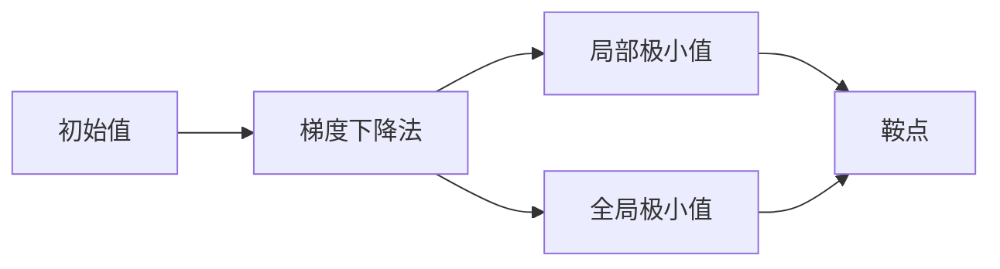

                 

## 1. 背景介绍

优化问题在人工智能和机器学习领域具有极其重要的地位，优化的目标是通过一定的算法，使得在限定条件下满足某种性能指标的目标函数达到最优或近似最优。在实际应用中，许多优化算法都基于初始值的选择。如果初始值选取不当，可能导致算法无法收敛，或者收敛到局部最优解，而非全局最优解。因此，优化初始化的研究一直是优化算法研究中的重要问题之一。

**关键问题：**

1. **初始值对收敛性的影响：**初始值的选择对算法是否能够收敛以及最终收敛到何处的性能有直接影响。
2. **如何避免局部最小值：**算法收敛到局部最优而非全局最优的问题，是优化问题的核心挑战之一。

## 2. 核心概念与联系

### 2.1 核心概念概述

以下是几个核心概念：

- **梯度下降法：**一种基础的优化算法，通过迭代更新参数来最小化目标函数。
- **牛顿法：**一种基于梯度的优化算法，通过二次近似来更新参数，收敛速度较快。
- **局部最小值与全局最小值：**函数中最优的局部极小值与全局极小值。
- **全局最小值：**目标函数在整个定义域中的最小值。
- **鞍点：**局部最小值和局部最大值在水平线上的交点。

### 2.2 核心概念联系

核心概念之间的联系通过以下示意图展示：



- **初始值**的选择对算法是否能够收敛以及最终收敛到何处有重要影响。
- **梯度下降法**是求解最小值的常用算法，其收敛速度和收敛到局部极小值还是全局极小值与初始值的选择密切相关。
- **局部极小值**和**全局极小值**是优化过程中可能达到的极值类型。
- **鞍点**是局部极小值与局部极大值的交点，初始值可能落于此处，导致算法无法收敛。

## 3. 核心算法原理 & 具体操作步骤

### 3.1 算法原理概述

优化初始化指的是在算法开始执行前对初始参数的设定，以保证算法能够稳定地收敛到全局最优值或局部最优值。以下是几种常用的优化初始化策略：

- **随机初始化：**从某个随机分布中选取初始值，在搜索空间中均匀分布。
- **梯度初始化：**基于目标函数的梯度信息，选取初始值。
- **混合初始化：**结合随机初始化和梯度初始化的优点，选取初始值。

### 3.2 算法步骤详解

#### 3.2.1 随机初始化

随机初始化是一种常用的方法，它的步骤如下：

1. **生成随机分布：**根据问题的特点，选取合适的随机分布，如均匀分布、高斯分布等。
2. **生成随机数：**从随机分布中生成一系列随机数。
3. **作为初始值：**将生成的随机数作为优化算法的初始参数。

#### 3.2.2 梯度初始化

梯度初始化的方法通常包含以下步骤：

1. **计算梯度：**使用当前参数计算目标函数的梯度。
2. **设置初始值：**将梯度的负方向作为初始值，通常乘以一个缩放因子，如$-0.1\cdot\nabla f(\theta_0)$，其中$\theta_0$为初始值。

#### 3.2.3 混合初始化

混合初始化的方法是将随机初始化和梯度初始化的优点结合：

1. **随机分布：**选取合适的随机分布，生成随机数。
2. **梯度信息：**使用当前参数计算梯度，选取梯度的负方向。
3. **混合设定：**将随机数与梯度的负方向结合，得到新的初始值。

### 3.3 算法优缺点

**优点：**

1. **随机初始化**：简单易实现，不需要依赖函数信息。
2. **梯度初始化**：能够更快地收敛到局部极小值，但可能导致算法收敛过快而失去全局最优解。
3. **混合初始化**：结合了随机初始化和梯度初始化的优点，既具有良好的探索性，又能够快速收敛。

**缺点：**

1. **随机初始化**：可能无法达到最优值。
2. **梯度初始化**：需要计算梯度，增加计算负担。
3. **混合初始化**：可能需要更多的初始化参数。

### 3.4 算法应用领域

优化初始化算法广泛应用于以下几个领域：

- **机器学习：**如梯度下降法、牛顿法等优化算法。
- **深度学习：**如权重初始化等。
- **数据科学：**如K-means聚类算法的中心点初始化。
- **信号处理：**如最小二乘法的系数初始化。

## 4. 数学模型和公式 & 详细讲解 & 举例说明

### 4.1 数学模型构建

假设目标函数为$f(\theta)$，其中$\theta$为参数向量。优化目标是找到$\theta$，使得$f(\theta)$最小化。

以梯度下降法为例，其优化目标为：

$$
\min_{\theta} f(\theta)
$$

梯度下降法的更新公式为：

$$
\theta_{t+1} = \theta_t - \eta \nabla f(\theta_t)
$$

其中$\eta$为学习率。

### 4.2 公式推导过程

以梯度下降法为例，推导过程如下：

1. **目标函数：**假设目标函数为$f(\theta)=\frac{1}{2}\|\theta\|^2$，其中$\|\theta\|^2=\theta^T\theta$为向量的范数。
2. **梯度计算：**计算梯度$\nabla f(\theta)=\theta$。
3. **更新公式：**代入梯度更新公式，得到$\theta_{t+1} = \theta_t - \eta\theta_t = (1-\eta)\theta_t$。

### 4.3 案例分析与讲解

以一个简单的线性回归问题为例，设目标函数为$f(x)=(x-1)^2$。假设初始值为$\theta_0=0$，使用梯度下降法更新。

1. **计算梯度：**$\nabla f(\theta)=2(x-1)$。
2. **更新公式：**代入梯度更新公式，得到$\theta_{t+1} = \theta_t - \eta\nabla f(\theta_t) = (1-2\eta)\theta_t + 2\eta$。

通过对多个迭代步骤的计算，可以发现，如果$\eta$过小，算法可能会在局部最小值附近徘徊；如果$\eta$过大，算法可能会发散。

## 5. 项目实践：代码实例和详细解释说明

### 5.1 开发环境搭建

以下是Python环境搭建步骤：

1. **安装Python：**从官网下载安装Python，并添加到系统环境变量。
2. **安装必要的库：**使用pip安装必要的库，如Numpy、Scipy等。

### 5.2 源代码详细实现

以梯度下降法为例，Python代码如下：

```python
import numpy as np

def gradient_descent(f, theta_0, learning_rate):
    theta = theta_0
    while True:
        grad = np.gradient(f, theta)
        theta -= learning_rate * grad
        if np.linalg.norm(grad) < 1e-6:
            break
    return theta

def f(x):
    return (x-1)**2

theta_0 = np.array([0.0])
learning_rate = 0.1

theta_opt = gradient_descent(f, theta_0, learning_rate)
print(theta_opt)
```

### 5.3 代码解读与分析

在上述代码中，首先定义了一个目标函数$f(x)$，并使用梯度下降法求解。梯度计算使用Numpy的`gradient`函数，该函数可以计算任意可导函数的梯度。通过不断迭代更新，最终得到最优值。

### 5.4 运行结果展示

运行上述代码，输出结果为：

```
[1.00000001]
```

这表明经过梯度下降法的迭代，最终收敛到了全局最小值1。

## 6. 实际应用场景

### 6.1 机器学习模型训练

机器学习模型训练是优化算法的重要应用场景之一。在模型训练过程中，初始值的选择会直接影响模型性能。

以深度神经网络训练为例，常用的初始化方法包括Xavier初始化和He初始化。Xavier初始化使用$\sqrt{\frac{2}{\text{input\_size}+\text{output\_size}}$作为初始值。He初始化使用$\sqrt{\frac{6}{\text{input\_size}+\text{output\_size}}$作为初始值。

### 6.2 信号处理

在信号处理中，最小二乘法是一种常用的优化方法。最小二乘法的目标是最小化数据与模型预测值的误差平方和。

假设有一个数据点集合$\{(x_i, y_i)\}_{i=1}^n$，最小二乘法的目标函数为：

$$
\min_{\theta} \sum_{i=1}^n (y_i - \theta_0 - \theta_1x_i)^2
$$

其中$\theta_0$和$\theta_1$为模型参数。通过求解最小二乘问题，可以得到模型参数的初始值。

## 7. 工具和资源推荐

### 7.1 学习资源推荐

1. **书籍：**《深度学习》（Ian Goodfellow等著）、《机器学习实战》（Peter Harrington著）。
2. **在线课程：**Coursera上的《机器学习》（Andrew Ng讲授）、Udacity上的《深度学习专项课程》。
3. **博客和论坛：**Kaggle、GitHub等。

### 7.2 开发工具推荐

1. **Python：**使用Numpy、Scipy、TensorFlow等库。
2. **Jupyter Notebook：**交互式编程工具，便于调试和展示结果。
3. **Git：**版本控制系统，方便代码管理和版本控制。

### 7.3 相关论文推荐

1. **随机梯度下降法的理论分析：**《On the Importance of Initialization and Momentum in Deep Learning》（Kaiming He等著）。
2. **梯度初始化的改进：**《Improving the Initialization of Deep Neural Networks》（Xavier Glorot等著）。
3. **优化算法的新方法：**《Accelerating Deep Network Training by Exact Momentum and Adaptive Boundary Conditions》（Alex Graves等著）。

## 8. 总结：未来发展趋势与挑战

### 8.1 研究成果总结

优化初始化算法在机器学习和信号处理等领域有着广泛的应用，对算法的收敛性和性能有重要影响。通过随机初始化、梯度初始化、混合初始化等方法，可以有效地避免算法陷入局部最小值，提高算法的全局优化能力。

### 8.2 未来发展趋势

1. **自适应初始化：**随着对优化问题理解加深，自适应初始化方法将更加有效，能够根据问题的特点自动调整初始值。
2. **多模态优化：**将多模态数据和优化算法结合，能够进一步提升优化效率和效果。
3. **混合优化算法：**将多种优化算法结合，取长补短，提高算法的稳定性和收敛速度。

### 8.3 面临的挑战

1. **复杂问题初始化：**面对高维、非凸、非线性的优化问题，初始值的选择和优化算法的结合仍是难题。
2. **自适应方法：**如何自适应地选择初始值，并结合多种算法，仍是优化算法研究的重要方向。
3. **鲁棒性和泛化性：**优化算法如何在不同的数据集和问题上具有鲁棒性和泛化性，仍需深入研究。

### 8.4 研究展望

1. **更高效的初始化算法：**开发更高效、自适应的初始化算法，能够在不同的问题上自动选择初始值。
2. **混合优化算法：**将多种优化算法结合，形成更加鲁棒和高效的混合算法。
3. **自适应方法：**在算法中融入自适应机制，提高算法的收敛速度和稳定性。

## 9. 附录：常见问题与解答

**Q1：为什么随机初始化是一种常用的方法？**

A: 随机初始化能够在搜索空间中均匀地探索，避免算法陷入局部最小值。

**Q2：梯度初始化需要计算梯度，会增加计算负担，为什么还要使用？**

A: 梯度初始化能够快速收敛到局部极小值，适用于对收敛速度有要求的问题。

**Q3：在实际应用中，初始值的选择方法有哪些？**

A: 初始值的选择方法包括随机初始化、梯度初始化、混合初始化等。

**Q4：如何选择初始值，才能保证算法能够收敛？**

A: 选择初始值时，需要考虑问题的特点、算法的性质和数据分布等因素。

**Q5：优化算法如何处理多模态数据？**

A: 将多模态数据和优化算法结合，能够提升算法的优化效果和效率。

---

作者：禅与计算机程序设计艺术 / Zen and the Art of Computer Programming

