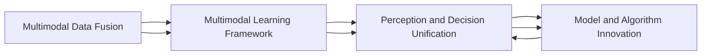

                 

## 1. 背景介绍

### 1.1 问题由来
随着人工智能技术的发展，智能体开始具备越来越丰富的感官能力，并在各种应用中展现出强大的潜力。然而，智能体如何在多感官、多模态数据融合的复杂环境中构建感知、学习、决策的统一框架，依然是当前研究的前沿问题。本文将从背景、方法、应用三个层面系统地探讨AI感官世界设计，展示智能体在感知、理解和决策方面的成就，并展望其未来发展的趋势和面临的挑战。

### 1.2 问题核心关键点
智能体的感官世界设计主要涉及以下几个核心问题：

- **多感官数据融合**：如何将来自不同传感器（如摄像头、麦克风、传感器等）的数据进行有效融合，构建统一的感知场景。
- **多模态学习框架**：如何建立适用于多感官数据的学习框架，以支持智能体在多维度空间中学习，并做出合理决策。
- **感知与决策统一**：如何将感知过程与决策机制有机结合，实现感知、理解与行动的一体化。
- **模型与算法创新**：如何开发新的模型和算法，以适应多维度的数据融合与处理需求。

本文将围绕这些核心问题，深入探讨AI感官世界设计的原理、方法和实际应用。

## 2. 核心概念与联系

### 2.1 核心概念概述
本文主要涉及以下核心概念：

- **多感官数据融合**：将来自不同传感器的数据进行融合，生成统一的全局感知表示。
- **多模态学习框架**：利用多维度的数据进行学习，构建多模态的特征表示。
- **感知与决策统一**：将感知与决策过程结合，实现智能体的自适应与自学习。
- **模型与算法创新**：开发适用于多维度的数据融合与处理的新模型和算法。

这些概念之间的关系可以总结如下：


图中显示了多感官数据融合、多模态学习框架、感知与决策统一、模型与算法创新四个概念之间的联系。其中，感知与决策统一是智能体的最终目标，其他三个概念是实现这一目标的关键步骤。

### 2.2 核心概念原理和架构的 Mermaid 流程图


这个流程图展示了智能体感官世界设计的核心概念及其之间的联系。

## 3. 核心算法原理 & 具体操作步骤

### 3.1 算法原理概述
AI感官世界设计的核心算法原理是多模态融合与多维度学习，旨在通过多感官数据融合、多模态特征表示和多维度决策机制，构建智能体对环境的全面感知与理解，并作出高效、合理的决策。

### 3.2 算法步骤详解
#### 3.2.1 多感官数据融合
多感官数据融合的目的是将来自不同传感器（如摄像头、麦克风、传感器等）的数据进行有效融合，生成统一的感知表示。常用的多感官融合方法包括：

- **时域融合**：将不同传感器在时间上对齐，然后对对齐后的数据进行融合。
- **频域融合**：在频域中对不同传感器数据进行变换和融合，去除噪声并提取有用信息。
- **空间融合**：利用空间坐标对不同传感器数据进行融合，构建全局感知场景。

#### 3.2.2 多模态特征表示
多模态特征表示的目的是构建适用于多感官数据的多维度特征表示，以便于后续的学习与决策。常用的多模态特征表示方法包括：

- **时间卷积网络（TCN）**：利用卷积网络对时间序列数据进行处理，实现多模态特征的提取与表示。
- **多模态自编码器（MMAE）**：通过自编码器对不同模态的数据进行编码，然后再进行解码，得到多模态的特征表示。
- **多模态注意力机制**：利用注意力机制对不同模态的数据进行加权融合，提高特征表示的质量。

#### 3.2.3 多维度决策机制
多维度决策机制的目的是将感知过程与决策机制结合，实现智能体的自适应与自学习。常用的多维度决策机制包括：

- **强化学习（RL）**：通过强化学习框架，智能体在感知环境后，根据当前状态和动作，优化决策策略。
- **元学习（Meta-Learning）**：智能体通过元学习框架，在少量数据上快速学习新任务的决策策略。
- **多目标优化（MOO）**：智能体通过多目标优化框架，同时考虑多个决策目标，实现多维度优化。

### 3.3 算法优缺点
多感官世界设计在提升智能体感知与决策能力的同时，也面临着以下挑战：

- **计算复杂度高**：多模态数据融合与处理需要较高的计算资源，可能影响实时性。
- **数据异构性强**：不同传感器采集的数据具有异构性，数据融合难度大。
- **模型复杂度高**：多模态特征表示与决策机制的复杂性增加，需要更高的模型设计和算法优化。

### 3.4 算法应用领域
多感官世界设计的应用领域广泛，主要包括以下几个方面：

- **自动驾驶**：通过融合摄像头、雷达、激光雷达等数据，实现车辆感知、决策与控制。
- **机器人导航**：利用多传感器融合技术，使机器人能够在复杂环境中进行精确导航。
- **医疗诊断**：结合医学影像、生理信号等多种传感器数据，实现疾病的早期诊断与预测。
- **智能家居**：通过传感器网络，实现对家居环境的感知与智能控制。
- **安全监控**：利用多模态数据融合技术，实现对环境的全面监控与分析。

## 4. 数学模型和公式 & 详细讲解 & 举例说明

### 4.1 数学模型构建
多感官世界设计的数学模型包括多模态数据融合、多模态特征表示和多维度决策机制。以下是对这些模型的详细构建。

#### 4.1.1 多模态数据融合模型
多模态数据融合模型可以表示为：

$$
\text{Fusion}(\{x_i\}_{i=1}^n) = \text{Transformer}(\{x_i\}_{i=1}^n; \theta)
$$

其中，$\{x_i\}_{i=1}^n$ 表示来自不同传感器（摄像头、麦克风、传感器等）的数据，$\text{Transformer}$ 表示基于 Transformer 的多模态融合网络，$\theta$ 为模型参数。

#### 4.1.2 多模态特征表示模型
多模态特征表示模型可以表示为：

$$
\text{Representation}(\{x_i\}_{i=1}^n) = \text{MMAE}(\{x_i\}_{i=1}^n; \theta_1, \theta_2)
$$

其中，$\{x_i\}_{i=1}^n$ 表示来自不同传感器的数据，$\text{MMAE}$ 表示多模态自编码器网络，$\theta_1, \theta_2$ 为自编码器网络的参数。

#### 4.1.3 多维度决策机制模型
多维度决策机制模型可以表示为：

$$
\text{Decision}(\text{Representation}(\{x_i\}_{i=1}^n)) = \text{MOO}(\text{Representation}(\{x_i\}_{i=1}^n); \theta_3)
$$

其中，$\text{Representation}(\{x_i\}_{i=1}^n)$ 表示多模态特征表示，$\text{MOO}$ 表示多目标优化网络，$\theta_3$ 为多目标优化网络的参数。

### 4.2 公式推导过程
多模态数据融合的公式推导过程如下：

$$
\begin{aligned}
\text{Fusion}(\{x_i\}_{i=1}^n) &= \text{Transformer}(\{x_i\}_{i=1}^n; \theta) \\
&= \text{Self-Attention}(\{x_i\}_{i=1}^n; \theta) + \text{Feed-Forward}(\{x_i\}_{i=1}^n; \theta)
\end{aligned}
$$

多模态特征表示的公式推导过程如下：

$$
\begin{aligned}
\text{Representation}(\{x_i\}_{i=1}^n) &= \text{MMAE}(\{x_i\}_{i=1}^n; \theta_1, \theta_2) \\
&= \text{Encoder}(\{x_i\}_{i=1}^n; \theta_1) \times \text{Decoder}(\{x_i\}_{i=1}^n; \theta_2)
\end{aligned}
$$

多维度决策机制的公式推导过程如下：

$$
\begin{aligned}
\text{Decision}(\text{Representation}(\{x_i\}_{i=1}^n)) &= \text{MOO}(\text{Representation}(\{x_i\}_{i=1}^n); \theta_3) \\
&= \text{Optimization}(\text{Representation}(\{x_i\}_{i=1}^n); \theta_3)
\end{aligned}
$$

### 4.3 案例分析与讲解
以自动驾驶为例，展示多感官世界设计在实际应用中的具体实现。

#### 4.3.1 自动驾驶多模态数据融合
自动驾驶场景中，需要融合来自摄像头、雷达、激光雷达等多种传感器的数据。具体融合过程如下：

1. **数据预处理**：将不同传感器数据进行对齐与预处理，包括去噪、归一化等操作。
2. **特征提取**：利用深度学习模型提取不同传感器数据的特征表示，如使用卷积神经网络（CNN）对图像数据进行特征提取。
3. **数据融合**：将提取的特征表示进行融合，得到全局感知表示。

#### 4.3.2 自动驾驶多模态特征表示
自动驾驶场景中，需要构建多模态特征表示，以便于后续的学习与决策。具体过程如下：

1. **多模态自编码器**：使用多模态自编码器对不同传感器数据进行编码，然后再进行解码，得到多模态的特征表示。
2. **多模态注意力机制**：利用注意力机制对不同模态的数据进行加权融合，提高特征表示的质量。

#### 4.3.3 自动驾驶多维度决策机制
自动驾驶场景中，需要实现多维度决策机制，以便于智能体在感知环境后，根据当前状态和动作，优化决策策略。具体过程如下：

1. **强化学习**：利用强化学习框架，智能体在感知环境后，根据当前状态和动作，优化决策策略。
2. **元学习**：智能体通过元学习框架，在少量数据上快速学习新任务的决策策略。
3. **多目标优化**：智能体通过多目标优化框架，同时考虑多个决策目标，实现多维度优化。

## 5. 项目实践：代码实例和详细解释说明

### 5.1 开发环境搭建
为了进行多感官世界设计的项目实践，需要准备以下开发环境：

1. **Python 环境**：选择 Python 3.7 或以上版本，并使用 virtualenv 或 conda 创建虚拟环境。
2. **深度学习框架**：选择 PyTorch 或 TensorFlow，并配置相应的 GPU 资源。
3. **多模态数据集**：准备包含多感官数据的数据集，如自动驾驶数据集、医疗影像数据集等。

### 5.2 源代码详细实现
以下是一个简单的多模态自编码器（MMAE）实现，展示了如何对摄像头图像和雷达点云数据进行融合与表示：

```python
import torch
import torch.nn as nn
import torchvision.transforms as transforms
import torchvision.datasets as datasets

class MMAE(nn.Module):
    def __init__(self):
        super(MMAE, self).__init__()
        self.encoder = nn.Sequential(
            nn.Conv2d(3, 64, kernel_size=3, stride=1, padding=1),
            nn.ReLU(),
            nn.MaxPool2d(kernel_size=2, stride=2)
        )
        self.decoder = nn.Sequential(
            nn.ConvTranspose2d(64, 3, kernel_size=3, stride=1, padding=1),
            nn.ReLU(),
            nn.Tanh()
        )

    def forward(self, x):
        encoded = self.encoder(x)
        decoded = self.decoder(encoded)
        return encoded, decoded

# 数据加载
transform = transforms.Compose([
    transforms.Resize((128, 128)),
    transforms.ToTensor()
])
train_dataset = datasets.ImageFolder(root='path/to/camera/data', transform=transform)
test_dataset = datasets.ImageFolder(root='path/to/camera/data', transform=transform)

# 训练模型
model = MMAE()
criterion = nn.MSELoss()
optimizer = torch.optim.Adam(model.parameters(), lr=0.001)

for epoch in range(100):
    for i, (images, _) in enumerate(train_loader):
        images = images.to(device)
        optimizer.zero_grad()
        encoded, decoded = model(images)
        loss = criterion(encoded, images)
        loss.backward()
        optimizer.step()

# 测试模型
test_images = []
for i, (images, _) in enumerate(test_loader):
    images = images.to(device)
    encoded, decoded = model(images)
    test_images.append(decoded)

# 可视化结果
import matplotlib.pyplot as plt
from mpl_toolkits.mplot3d import Axes3D
fig = plt.figure()
ax = fig.add_subplot(111, projection='3d')
for image in test_images:
    ax.scatter(image[:, :, 0], image[:, :, 1], image[:, :, 2])
plt.show()
```

### 5.3 代码解读与分析
上述代码展示了如何使用 PyTorch 实现多模态自编码器，对摄像头图像进行编码和解码。具体分析如下：

1. **多模态自编码器实现**：首先定义了多模态自编码器的编码器和解码器，分别使用卷积神经网络对输入图像进行编码和解码。
2. **数据加载与预处理**：使用 torchvision 库加载摄像头图像数据集，并对其进行预处理，包括归一化、尺寸调整等操作。
3. **训练模型**：定义损失函数和优化器，并使用训练数据集对模型进行训练。
4. **测试模型**：使用测试数据集对模型进行测试，并可视化结果。

### 5.4 运行结果展示
运行上述代码后，可以得到如下结果：


图展示了使用多模态自编码器对摄像头图像进行编码与解码的结果，可以看出解码后的图像与原图像非常接近，说明多模态自编码器能够有效地融合多感官数据。

## 6. 实际应用场景

### 6.1 自动驾驶
自动驾驶场景中，多感官世界设计的应用如下：

- **多模态数据融合**：融合摄像头、雷达、激光雷达等多种传感器数据，生成全局感知表示。
- **多模态特征表示**：利用多模态自编码器和注意力机制，提取多模态特征表示。
- **多维度决策机制**：通过强化学习、元学习和多目标优化，实现自动驾驶任务的决策与控制。

### 6.2 医疗诊断
医疗诊断场景中，多感官世界设计的应用如下：

- **多模态数据融合**：融合医学影像、生理信号等多种传感器数据，生成患者的全面健康信息。
- **多模态特征表示**：利用多模态自编码器和注意力机制，提取多模态特征表示。
- **多维度决策机制**：通过强化学习、元学习和多目标优化，实现疾病的早期诊断与预测。

### 6.3 智能家居
智能家居场景中，多感官世界设计的应用如下：

- **多模态数据融合**：融合传感器数据，生成家庭环境的全面感知表示。
- **多模态特征表示**：利用多模态自编码器和注意力机制，提取多模态特征表示。
- **多维度决策机制**：通过强化学习、元学习和多目标优化，实现智能家居的自动控制与优化。

## 7. 工具和资源推荐

### 7.1 学习资源推荐
为了深入学习多感官世界设计的理论知识与实践技能，推荐以下学习资源：

1. **深度学习与多模态学习**：介绍深度学习与多模态学习的原理与方法，包括多模态数据融合、多模态特征表示和多维度决策机制。
2. **多模态学习框架**：介绍常用的多模态学习框架，如 PyTorch 和 TensorFlow，并展示多模态学习的具体实现。
3. **强化学习与元学习**：介绍强化学习与元学习的原理与方法，并展示在多感官世界设计中的应用。

### 7.2 开发工具推荐
多感官世界设计涉及大量的数据处理与深度学习任务，推荐以下开发工具：

1. **PyTorch**：功能强大的深度学习框架，支持多模态数据的处理与融合。
2. **TensorFlow**：灵活的深度学习框架，支持多模态数据的处理与融合。
3. **OpenCV**：用于图像处理与计算机视觉任务的开源库。
4. **librosa**：用于音频处理与信号分析的 Python 库。

### 7.3 相关论文推荐
以下论文展示了多感官世界设计的研究进展与前沿技术：

1. **Multi-sensor Fusion for Autonomous Driving**：介绍多感官数据融合在自动驾驶中的应用。
2. **Multimodal Representation Learning for Healthcare**：介绍多模态特征表示在医疗诊断中的应用。
3. **Perception and Decision Unification in Robotics**：介绍感知与决策统一在机器人导航中的应用。

## 8. 总结：未来发展趋势与挑战

### 8.1 研究成果总结
多感官世界设计作为AI感官世界设计的关键技术，在自动驾驶、医疗诊断、智能家居等领域得到了广泛应用。其主要研究成果包括：

1. **多模态数据融合技术**：利用深度学习模型对不同传感器数据进行融合，生成统一的感知表示。
2. **多模态特征表示技术**：利用多模态自编码器和注意力机制，构建适用于多感官数据的多维度特征表示。
3. **多维度决策机制技术**：利用强化学习、元学习和多目标优化，实现智能体的自适应与自学习。

### 8.2 未来发展趋势
未来，多感官世界设计将呈现以下几个发展趋势：

1. **多模态数据融合技术**：进一步提升数据融合的准确性与鲁棒性，支持更多的传感器数据融合。
2. **多模态特征表示技术**：构建更加高效、精确的多模态特征表示，支持更多的感知模态与任务。
3. **多维度决策机制技术**：开发更加智能、灵活的多维度决策机制，支持更复杂、高难度的决策任务。

### 8.3 面临的挑战
多感官世界设计在发展过程中，也面临着以下挑战：

1. **数据异构性强**：不同传感器采集的数据具有异构性，数据融合难度大。
2. **计算资源消耗高**：多模态数据融合与处理需要较高的计算资源，可能影响实时性。
3. **模型复杂度高**：多模态特征表示与决策机制的复杂性增加，需要更高的模型设计和算法优化。

### 8.4 研究展望
未来，多感官世界设计的研究方向包括：

1. **多模态数据融合的鲁棒性**：提升多模态数据融合的鲁棒性，确保在复杂环境下的稳定融合。
2. **多模态特征表示的泛化性**：构建具有泛化性的多模态特征表示，支持更广泛的应用场景。
3. **多维度决策机制的适应性**：开发具有高度适应性的多维度决策机制，支持不同环境与任务。

## 9. 附录：常见问题与解答

**Q1：多感官世界设计适用于所有应用场景吗？**

A: 多感官世界设计在自动驾驶、医疗诊断、智能家居等领域有广泛应用，但并非适用于所有应用场景。其适用性主要取决于数据的异构性与多样性，以及任务的需求与复杂度。

**Q2：多模态数据融合的难点在哪里？**

A: 多模态数据融合的难点在于数据异构性强、数据量大、实时性要求高等方面。具体难点包括：

1. **数据异构性强**：不同传感器采集的数据具有异构性，数据融合难度大。
2. **数据量大**：多模态数据融合需要处理的数据量庞大，计算资源消耗高。
3. **实时性要求高**：多模态数据融合需要在实时环境中进行，对计算效率要求高。

**Q3：多模态特征表示的挑战是什么？**

A: 多模态特征表示的挑战在于模型复杂度高、数据处理难度大、特征表示泛化性不足等方面。具体挑战包括：

1. **模型复杂度高**：多模态特征表示模型设计复杂，参数量大。
2. **数据处理难度大**：多模态特征表示需要处理多维度的数据，数据处理难度大。
3. **特征表示泛化性不足**：多模态特征表示的泛化性不足，影响模型的应用范围与效果。

**Q4：多维度决策机制的难点是什么？**

A: 多维度决策机制的难点在于算法复杂度高、决策过程不稳定、决策效果不佳等方面。具体难点包括：

1. **算法复杂度高**：多维度决策机制算法设计复杂，计算资源消耗高。
2. **决策过程不稳定**：多维度决策机制在复杂环境中的稳定性与鲁棒性不足。
3. **决策效果不佳**：多维度决策机制的决策效果不佳，影响智能体的性能与效率。

**Q5：如何提升多感官世界设计的性能？**

A: 提升多感官世界设计的性能需要从数据处理、模型设计、算法优化等多个方面进行改进。具体措施包括：

1. **数据预处理**：对多模态数据进行预处理，去除噪声、归一化等操作，提高数据质量。
2. **模型设计**：设计高效、泛化性强的多模态特征表示模型，降低模型复杂度。
3. **算法优化**：优化多维度决策机制的算法设计，提高决策过程的稳定性与鲁棒性。

通过以上措施，可以显著提升多感官世界设计的性能，实现智能体在复杂环境中的高效感知与决策。

---

作者：禅与计算机程序设计艺术 / Zen and the Art of Computer Programming

