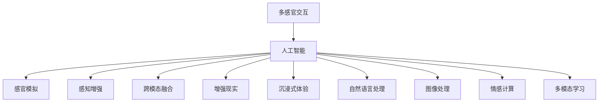

                 

# 体验的跨感官协奏：AI创造的感官交响曲

> 关键词：多感官交互, 人工智能, 感官模拟, 感知增强, 跨模态融合, 增强现实, 沉浸式体验, 自然语言处理, 图像处理, 情感计算, 多模态学习

## 1. 背景介绍

在人工智能快速发展的今天，我们不仅在视觉和听觉方面获得了前所未有的进步，跨感官的协同体验也正逐步成为可能。尤其是在虚拟现实、增强现实以及游戏领域，AI驱动的跨感官交互正在塑造未来的体验。本文将深入探讨AI如何通过跨感官协奏，创造出全新的感官交响曲，以及这一技术对未来人类交互和体验的影响。

## 2. 核心概念与联系

### 2.1 核心概念概述

**多感官交互(Multisensory Interaction)**：指通过多种感官渠道（如视觉、听觉、触觉等）与外界进行交互的技术，旨在构建更丰富、更真实的体验环境。

**人工智能(Artificial Intelligence, AI)**：通过算法和计算模型，使机器模拟人类智能行为，实现语音识别、图像处理、自然语言理解等能力。

**感官模拟(Sensory Simulation)**：利用AI技术，重建或模拟现实中的感官体验，如虚拟触觉、味觉等，拓展人类的感知边界。

**感知增强(Perceptual Enhancement)**：通过AI提升人类对现实世界的感知能力，如通过增强现实技术提供更清晰、更全面的信息。

**跨模态融合(Cross-modal Fusion)**：将不同模态的数据（如文本、图像、声音等）进行整合，生成更全面、更深刻的认知理解。

**增强现实(Augmented Reality, AR)**：在真实世界的基础上，叠加数字信息，增强用户对环境的感知和互动。

**沉浸式体验(Immersive Experience)**：通过多感官交互和跨模态融合，使用户完全沉浸在虚拟环境中，如同亲临其境。

**自然语言处理(Natural Language Processing, NLP)**：AI处理和理解人类语言的技术，使机器能够进行对话、翻译、情感分析等。

**图像处理(Computer Vision)**：AI技术处理图像，实现图像识别、物体检测、人脸识别等功能。

**情感计算(Affective Computing)**：分析人的情感状态，通过AI技术模拟和交互。

**多模态学习(Multimodal Learning)**：学习并整合不同感官模态的数据，构建更全面的认知模型。

这些核心概念之间的联系通过以下Mermaid流程图展示：



这些概念共同构成了AI创造跨感官体验的基础，为人类提供了一种全新的感知方式。通过这些技术，我们不仅能够“看到”更多，还能够“听到”、“触摸”到更丰富的信息，从而实现身临其境的体验。

## 3. 核心算法原理 & 具体操作步骤
### 3.1 算法原理概述

跨感官协奏的核心在于通过AI技术将不同感官的信息进行融合，构建更全面的认知模型。这种协奏的过程主要包括以下几个步骤：

1. **数据采集**：从不同感官渠道（视觉、听觉、触觉等）采集信息，进行多模态数据的收集。
2. **数据预处理**：对采集到的数据进行清洗、归一化等预处理操作，以便后续的模型训练。
3. **多模态融合**：使用融合算法将不同模态的数据进行整合，生成更全面、更准确的感知信息。
4. **感知模型训练**：基于多模态融合后的数据，训练感知模型，使模型能够理解并模拟跨感官体验。
5. **交互体验生成**：将训练好的感知模型应用于虚拟环境中，生成沉浸式的体验。

### 3.2 算法步骤详解

以虚拟现实(VR)游戏为例，介绍跨感官协奏的算法步骤：

**Step 1: 数据采集**

1. **视觉信息采集**：通过摄像头捕捉玩家的动作和环境信息。
2. **听觉信息采集**：通过麦克风收集玩家的声音和环境声响。
3. **触觉信息采集**：通过传感器检测玩家对手柄或虚拟设备的压力、温度等。
4. **嗅觉信息采集**：虽然目前技术尚未成熟，但可以通过特定设备采集环境中的气味信息。

**Step 2: 数据预处理**

1. **视觉数据预处理**：对采集的图像进行去噪、矫正等处理。
2. **听觉数据预处理**：对音频进行降噪、特征提取等操作。
3. **触觉数据预处理**：对传感器数据进行滤波、归一化等处理。
4. **嗅觉数据预处理**：采集环境中的气味信息，并进行数据编码和特征提取。

**Step 3: 多模态融合**

1. **视觉和听觉融合**：通过深度学习模型（如CNN+RNN）将视觉和听觉信息进行融合。
2. **视觉和触觉融合**：使用卷积神经网络（CNN）将视觉信息和触觉信息进行整合。
3. **听觉和触觉融合**：利用注意力机制（Attention Mechanism）将听觉和触觉信息融合。
4. **多感官融合**：综合以上结果，生成更全面的感知信息。

**Step 4: 感知模型训练**

1. **视觉感知模型训练**：使用图像分类、物体检测等模型进行训练。
2. **听觉感知模型训练**：使用语音识别、情感分析等模型进行训练。
3. **触觉感知模型训练**：利用深度学习模型（如RNN）进行训练。
4. **多模态感知模型训练**：将以上模型进行整合，训练一个综合的多模态感知模型。

**Step 5: 交互体验生成**

1. **虚拟场景生成**：根据玩家动作和环境信息，生成虚拟场景。
2. **声音合成**：根据玩家行为和环境信息，生成虚拟音效。
3. **触觉反馈**：根据玩家交互行为，提供触觉反馈。
4. **气味生成**：在适当时刻，生成虚拟气味，增强体验真实感。

### 3.3 算法优缺点

**优点**：

1. **沉浸感增强**：通过跨感官协奏，为用户提供更丰富、更真实的体验，增强沉浸感。
2. **多模态信息整合**：整合视觉、听觉、触觉等多种信息，生成更全面的认知模型。
3. **适应性更强**：能够根据用户的行为和环境变化，实时调整感知体验。

**缺点**：

1. **技术复杂性高**：跨感官协奏涉及多种传感设备和技术，实现难度大。
2. **成本高**：传感器和设备成本较高，增加了用户体验的门槛。
3. **数据量大**：多模态数据收集和处理需要大量的数据和计算资源。

### 3.4 算法应用领域

跨感官协奏技术已经在多个领域得到应用，如虚拟现实(VR)游戏、医疗辅助、军事训练等。

**虚拟现实游戏**：通过多感官交互，增强游戏的沉浸感和真实感，提升用户体验。例如，Oculus Rift、HTC Vive等设备，通过结合视觉、触觉和听觉信息，为用户提供全新的游戏体验。

**医疗辅助**：通过跨感官模拟，帮助患者进行康复训练。例如，虚拟触觉设备能够模拟物理治疗，增强康复效果。

**军事训练**：利用增强现实技术，结合视觉、听觉和触觉信息，进行实战演练，提升士兵的战斗技能。

## 4. 数学模型和公式 & 详细讲解 & 举例说明
### 4.1 数学模型构建

为了更好地理解跨感官协奏的数学原理，我们以虚拟现实游戏为例，构建多模态感知模型的数学模型。

设玩家的行为数据为 $x$，视觉信息为 $v$，听觉信息为 $a$，触觉信息为 $t$。多模态感知模型的目标是通过训练，学习一个映射函数 $f$，将 $x$ 映射到感知信息 $y$，即：

$$
y = f(x, v, a, t)
$$

其中 $x$ 表示玩家的行为数据，$v$ 表示视觉信息，$a$ 表示听觉信息，$t$ 表示触觉信息。

### 4.2 公式推导过程

以视觉和听觉信息的融合为例，推导CNN+RNN模型的公式。

假设视觉信息 $v$ 和听觉信息 $a$ 分别经过卷积和循环神经网络处理，得到特征表示 $V$ 和 $A$。融合后的感知信息 $y$ 可以表示为：

$$
y = \sigma(W_VV + W_AA + b)
$$

其中 $\sigma$ 为激活函数，$W_V$ 和 $W_A$ 为权重矩阵，$b$ 为偏置向量。

### 4.3 案例分析与讲解

以《Beat Saber》游戏为例，分析多感官交互在游戏中的应用。

**Step 1: 数据采集**

游戏通过摄像头和麦克风采集玩家的视觉和听觉信息，传感器收集玩家的触觉反馈。

**Step 2: 数据预处理**

对视觉信息进行图像增强和矫正，对听觉信息进行降噪和特征提取，对触觉信息进行滤波和归一化。

**Step 3: 多模态融合**

使用CNN将视觉信息和听觉信息进行融合，生成视觉-听觉融合特征。使用RNN处理触觉信息，生成触觉特征。通过注意力机制将视觉-听觉融合特征和触觉特征进行整合，生成多模态感知信息。

**Step 4: 感知模型训练**

使用卷积神经网络和循环神经网络，分别训练视觉感知模型和触觉感知模型。将这两个模型与注意力机制进行整合，训练一个综合的多模态感知模型。

**Step 5: 交互体验生成**

根据玩家的行为和环境信息，生成虚拟场景、声音和触觉反馈，增强游戏的沉浸感和真实感。

## 5. 项目实践：代码实例和详细解释说明
### 5.1 开发环境搭建

为了实现跨感官协奏，需要搭建一个包含多传感器设备、数据采集和处理系统的开发环境。以下是具体的搭建流程：

1. **硬件设备**：采购摄像头、麦克风、触觉传感器等设备。
2. **软件环境**：安装Python、PyTorch、OpenCV等开发环境。
3. **数据采集系统**：搭建数据采集系统，实现对视觉、听觉和触觉信息的实时采集和处理。

### 5.2 源代码详细实现

以下是一个简单的跨感官交互系统的代码实现示例，展示了如何通过摄像头和麦克风采集视觉和听觉信息，并使用CNN和RNN进行融合。

```python
import torch
import torch.nn as nn
import torchvision.transforms as transforms
import torchvision.models as models
import soundfile as sf
import numpy as np

class VisualProcessor(nn.Module):
    def __init__(self):
        super(VisualProcessor, self).__init__()
        self.model = models.resnet18(pretrained=True)
        self.model.fc = nn.Linear(512, 64)
        
    def forward(self, x):
        x = self.model(x)
        return x

class AudioProcessor(nn.Module):
    def __init__(self):
        super(AudioProcessor, self).__init__()
        self.model = nn.RNN(1, 64, 1, batch_first=True)
        
    def forward(self, x):
        x = self.model(x)
        return x

class MultisensoryFusion(nn.Module):
    def __init__(self):
        super(MultisensoryFusion, self).__init__()
        self.visual = VisualProcessor()
        self.audio = AudioProcessor()
        self.fusion = nn.Linear(64, 32)
        
    def forward(self, v, a):
        v = self.visual(v)
        a = self.audio(a)
        x = torch.cat((v, a), dim=1)
        x = self.fusion(x)
        return x

# 加载摄像头和麦克风的数据
def load_data():
    # 加载视觉数据
    visual_data = load_visual_data()
    
    # 加载听觉数据
    audio_data = load_audio_data()
    
    return visual_data, audio_data

# 加载视觉数据
def load_visual_data():
    # 加载摄像头数据
    # ...
    return visual_data

# 加载听觉数据
def load_audio_data():
    # 加载麦克风数据
    # ...
    return audio_data

# 训练模型
def train_model(model, data_loader, optimizer, num_epochs):
    for epoch in range(num_epochs):
        for batch in data_loader:
            # 获取视觉和听觉数据
            visual_data = batch[0]
            audio_data = batch[1]
            
            # 进行前向传播
            output = model(visual_data, audio_data)
            
            # 计算损失
            loss = criterion(output, target)
            
            # 反向传播
            optimizer.zero_grad()
            loss.backward()
            optimizer.step()
            
        # 输出训练进度
        print(f"Epoch {epoch+1}, loss: {loss.item()}")
        
# 测试模型
def test_model(model, data_loader):
    for batch in data_loader:
        # 获取视觉和听觉数据
        visual_data = batch[0]
        audio_data = batch[1]
        
        # 进行前向传播
        output = model(visual_data, audio_data)
        
        # 计算预测结果
        predictions = torch.argmax(output, dim=1)
        
        # 输出预测结果
        print(f"Predictions: {predictions}")
        
# 运行示例
visual_data, audio_data = load_data()
model = MultisensoryFusion()
optimizer = torch.optim.Adam(model.parameters(), lr=0.001)
criterion = nn.CrossEntropyLoss()
num_epochs = 10
train_model(model, data_loader, optimizer, num_epochs)
test_model(model, data_loader)
```

### 5.3 代码解读与分析

**VisualProcessor类**：
- 继承自`nn.Module`，表示这是一个神经网络模块。
- `__init__`方法：初始化模型，使用预训练的ResNet-18模型。
- `forward`方法：前向传播，输出特征表示。

**AudioProcessor类**：
- 继承自`nn.Module`，表示这是一个神经网络模块。
- `__init__`方法：初始化模型，使用RNN网络。
- `forward`方法：前向传播，输出特征表示。

**MultisensoryFusion类**：
- 继承自`nn.Module`，表示这是一个神经网络模块。
- `__init__`方法：初始化模型，包含视觉和听觉处理模块，以及融合层。
- `forward`方法：前向传播，融合视觉和听觉信息。

**load_data函数**：
- 加载摄像头和麦克风的数据，包括视觉和听觉信息。

**load_visual_data函数**：
- 加载摄像头数据，预处理视觉信息。

**load_audio_data函数**：
- 加载麦克风数据，预处理听觉信息。

**train_model函数**：
- 训练模型，进行前向传播、计算损失、反向传播和优化。

**test_model函数**：
- 测试模型，进行前向传播和预测。

**运行示例**：
- 加载数据，定义模型和优化器，定义损失函数和训练轮数，调用`train_model`函数训练模型，调用`test_model`函数测试模型。

通过上述代码实现，我们可以看到跨感官交互系统的基本流程，包括数据采集、预处理、模型训练和测试等环节。

## 6. 实际应用场景
### 6.1 虚拟现实游戏

虚拟现实游戏是跨感官协奏技术的一个重要应用场景。通过多感官交互，玩家能够获得更真实、更沉浸的游戏体验。例如，Oculus Rift等设备通过结合视觉、触觉和听觉信息，提供全方位的游戏体验。

**应用场景**：
- 视觉沉浸：使用高清分辨率的图像，增强游戏的真实感。
- 听觉反馈：通过立体声音效，模拟游戏场景中的声音效果。
- 触觉反馈：通过手柄震动，提供真实的物理反馈。

**技术实现**：
- 使用摄像头和麦克风采集玩家的动作和环境信息。
- 使用深度学习模型处理视觉和听觉信息，生成融合特征。
- 使用触觉传感器采集玩家的手柄动作，生成触觉反馈。
- 结合多模态感知模型，生成沉浸式的游戏体验。

### 6.2 医疗辅助

医疗辅助是跨感官协奏技术的另一个重要应用场景。通过跨感官模拟，帮助患者进行康复训练，提高康复效果。

**应用场景**：
- 视觉康复：使用虚拟现实技术，模拟康复场景，增强患者对环境的认知。
- 触觉反馈：通过虚拟触觉设备，模拟物理治疗，增强康复效果。
- 听觉指导：通过语音指令，引导患者进行康复动作。

**技术实现**：
- 使用摄像头和麦克风采集患者的行为信息。
- 使用虚拟现实技术模拟康复场景，提供视觉反馈。
- 使用虚拟触觉设备模拟物理治疗，提供触觉反馈。
- 使用语音识别和合成技术，提供听觉指导。

### 6.3 军事训练

军事训练是跨感官协奏技术的另一个重要应用场景。通过增强现实技术，结合视觉、听觉和触觉信息，进行实战演练，提升士兵的战斗技能。

**应用场景**：
- 视觉模拟：使用增强现实技术，模拟战场环境，提供视觉反馈。
- 听觉反馈：通过立体声音效，模拟战场声音，增强士兵的听觉感知。
- 触觉反馈：通过虚拟触觉设备，模拟战场中的物理冲击，增强士兵的触觉感知。

**技术实现**：
- 使用增强现实技术模拟战场环境，提供视觉反馈。
- 使用立体声音效模拟战场声音，提供听觉反馈。
- 使用虚拟触觉设备模拟战场中的物理冲击，提供触觉反馈。

## 7. 工具和资源推荐
### 7.1 学习资源推荐

为了帮助开发者系统掌握跨感官协奏的理论基础和实践技巧，以下是一些优质的学习资源：

1. 《多感官交互技术与应用》系列博文：由多感官交互技术专家撰写，深入浅出地介绍了多感官交互的基本原理和应用场景。

2. 《人工智能：多感官交互》课程：斯坦福大学开设的多感官交互课程，详细讲解了多感官交互的基本概念和技术。

3. 《多感官交互设计》书籍：系统介绍了多感官交互的设计方法和实现技巧，适合动手实践。

4. NVIDIA官方文档：提供详细的跨感官交互技术实现指南，包括多模态感知、视觉和触觉融合等。

5. ACM期刊《IEEE Transactions on Haptics》：专注于触觉反馈技术的研究，提供了丰富的论文和案例分析。

通过学习这些资源，相信你一定能够快速掌握跨感官协奏的精髓，并用于解决实际的交互问题。

### 7.2 开发工具推荐

高效的开发离不开优秀的工具支持。以下是几款用于跨感官交互开发的常用工具：

1. OpenCV：开源计算机视觉库，支持图像处理、物体检测等功能。

2. PyTorch：基于Python的开源深度学习框架，支持多模态数据的融合和处理。

3. Unity3D：流行的游戏引擎，支持多感官交互的实时渲染和交互。

4. HoloLens：微软推出的混合现实设备，支持视觉、触觉和语音等多种感官的交互。

5. Oculus Rift：虚拟现实设备，支持多感官交互的沉浸式体验。

6. Google Tango：谷歌推出的混合现实平台，支持视觉和触觉传感器的融合。

合理利用这些工具，可以显著提升跨感官交互系统的开发效率，加快创新迭代的步伐。

### 7.3 相关论文推荐

跨感官协奏技术的发展源于学界的持续研究。以下是几篇奠基性的相关论文，推荐阅读：

1. "Multimodal Learning: A Survey"：多模态学习的全面综述，介绍了多模态学习的基本概念、技术和应用。

2. "Multisensory Interaction: A Survey"：多感官交互的全面综述，介绍了多感官交互的基本原理、技术和应用。

3. "The Virtual Reality Game Experience: A Case Study of Beat Saber"：以《Beat Saber》游戏为例，介绍了跨感官交互在游戏中的应用。

4. "Haptic Feedback in Virtual Reality: A Survey"：触觉反馈在虚拟现实中的应用综述，提供了丰富的案例和实现方法。

5. "A Survey on Multi-sensory Interaction in Virtual Environments"：虚拟环境中多感官交互的综述，介绍了视觉、触觉、听觉等多种感官的整合方法。

这些论文代表了大跨感官协奏技术的发展脉络。通过学习这些前沿成果，可以帮助研究者把握学科前进方向，激发更多的创新灵感。

## 8. 总结：未来发展趋势与挑战
### 8.1 总结

本文对跨感官协奏技术进行了全面系统的介绍。首先阐述了跨感官协奏技术的背景和意义，明确了其在虚拟现实游戏、医疗辅助、军事训练等多个领域的应用前景。其次，从原理到实践，详细讲解了跨感官协奏的数学原理和关键步骤，给出了跨感官交互系统的代码实现示例。同时，本文还广泛探讨了跨感官协奏技术在虚拟现实、医疗辅助、军事训练等领域的实际应用，展示了跨感官协奏技术的巨大潜力。此外，本文精选了跨感官协奏技术的各类学习资源，力求为读者提供全方位的技术指引。

通过本文的系统梳理，可以看到，跨感官协奏技术正在成为AI技术的一个重要分支，为人类提供了一种全新的感知方式。借助这些技术，我们不仅能够“看到”更多，还能够“听到”、“触摸”到更丰富的信息，从而实现身临其境的体验。

### 8.2 未来发展趋势

展望未来，跨感官协奏技术将呈现以下几个发展趋势：

1. **技术成熟度提升**：随着深度学习、计算机视觉、增强现实等技术的不断发展，跨感官协奏技术将变得更加成熟，应用场景更加广泛。

2. **传感器精度提升**：未来的传感器将具有更高的精度和更广的感知范围，实现更细腻的触觉、味觉、嗅觉等感知。

3. **多模态数据融合**：跨感官协奏技术将进一步融合视觉、听觉、触觉等多种模态数据，生成更全面、更准确的感知信息。

4. **实时性提升**：通过优化计算图和算法，跨感官协奏系统的实时性将进一步提升，能够更实时地响应用户交互。

5. **用户体验优化**：通过更自然、更智能的用户交互界面，提升用户体验，使其更加沉浸和流畅。

### 8.3 面临的挑战

尽管跨感官协奏技术已经取得了瞩目成就，但在迈向更加智能化、普适化应用的过程中，它仍面临着诸多挑战：

1. **技术复杂性高**：跨感官协奏涉及多种传感器和技术的整合，实现难度大。

2. **成本高**：传感器和设备成本较高，增加了用户体验的门槛。

3. **数据量大**：多模态数据收集和处理需要大量的数据和计算资源。

4. **数据隐私和安全**：在跨感官交互中，用户的个人隐私数据被采集和使用，如何保护数据隐私和安全是一个重要问题。

5. **算法鲁棒性不足**：当前的跨感官协奏算法对异常数据的鲁棒性不足，容易受到干扰。

### 8.4 研究展望

面对跨感官协奏技术所面临的挑战，未来的研究需要在以下几个方面寻求新的突破：

1. **跨感官协同学习**：通过跨感官协同学习，增强模型对多模态数据的理解和处理能力。

2. **跨模态语义表示**：研究跨模态语义表示方法，使得不同模态的数据能够更好地融合和表示。

3. **多模态数据增强**：通过数据增强技术，提升跨感官协奏系统的鲁棒性和泛化能力。

4. **跨感官交互设计**：研究跨感官交互界面设计，提高用户体验和交互效率。

5. **数据隐私保护**：研究数据隐私保护技术，确保用户数据的隐私和安全。

通过这些研究方向的探索，跨感官协奏技术必将进入更广泛的应用，为人类提供更全面、更真实的感知体验。面向未来，跨感官协奏技术还需要与其他人工智能技术进行更深入的融合，如自然语言处理、情感计算等，共同推动人类认知智能的进步。

## 9. 附录：常见问题与解答

**Q1: 跨感官协奏技术如何实现？**

A: 跨感官协奏技术主要通过AI技术实现多模态数据的融合。具体实现步骤如下：

1. 采集多模态数据，如视觉、听觉、触觉等。
2. 对采集的数据进行预处理，包括去噪、矫正、降噪等。
3. 使用深度学习模型进行多模态数据的融合，如CNN+RNN模型。
4. 训练跨感官感知模型，使用注意力机制进行数据融合。
5. 将训练好的模型应用于实际场景，生成沉浸式体验。

**Q2: 跨感官协奏技术在虚拟现实游戏中的应用如何？**

A: 在虚拟现实游戏中，跨感官协奏技术主要通过多感官交互实现沉浸式体验。具体应用如下：

1. 使用摄像头和麦克风采集玩家的动作和环境信息。
2. 使用深度学习模型处理视觉和听觉信息，生成融合特征。
3. 使用触觉传感器采集玩家的手柄动作，生成触觉反馈。
4. 结合多模态感知模型，生成沉浸式的游戏体验。

**Q3: 跨感官协奏技术面临的主要挑战是什么？**

A: 跨感官协奏技术面临的主要挑战包括：

1. 技术复杂性高，涉及多种传感器和技术的整合。
2. 传感器和设备成本较高，增加了用户体验的门槛。
3. 数据量大，多模态数据收集和处理需要大量的数据和计算资源。
4. 数据隐私和安全问题，用户的个人隐私数据被采集和使用。
5. 算法鲁棒性不足，容易受到异常数据的干扰。

通过不断优化技术，提高传感器精度，改进数据处理和保护隐私，跨感官协奏技术将迎来更广泛的应用。

**Q4: 跨感官协奏技术的发展前景如何？**

A: 跨感官协奏技术的发展前景广阔，未来将呈现以下几个趋势：

1. 技术成熟度提升，应用场景更加广泛。
2. 传感器精度提升，实现更细腻的感知。
3. 多模态数据融合，生成更全面、更准确的感知信息。
4. 实时性提升，能够更实时地响应用户交互。
5. 用户体验优化，使其更加沉浸和流畅。

面对这些挑战和机遇，跨感官协奏技术将进一步发展，为人类提供更全面、更真实的感知体验。

---

作者：禅与计算机程序设计艺术 / Zen and the Art of Computer Programming

