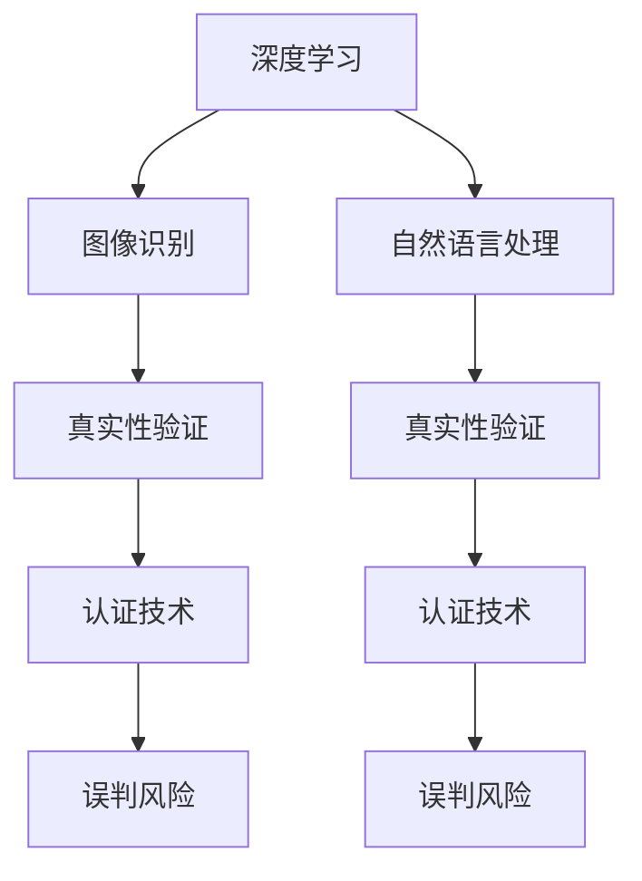

                 

# 体验真实性验证：AI时代的authenticity检测

> 关键词：AI 真实性验证, 深度学习, 图像识别, 自然语言处理, 数据隐私, 认证技术, 误判风险

## 1. 背景介绍

### 1.1 问题由来

在人工智能(AI)日益普及的今天，数据和模型的真实性验证成为了保障AI系统可靠性和可信性的关键。无论是在图像识别、自然语言处理等技术应用，还是在医疗诊断、金融预测等领域，真实性验证都能极大地提升系统性能和用户信任度。

### 1.2 问题核心关键点

真实性验证的核心在于通过深度学习等算法，对输入数据和模型输出的真实性进行评估，识别和排除可能的伪造、篡改或噪声数据。其核心原理是对数据进行特征提取，并通过训练好的模型对提取特征进行判别，最终生成一个代表真实性的评分。

### 1.3 问题研究意义

真实性验证技术的应用，可以有效避免AI系统因输入数据不真实导致的误判，保障AI应用的可靠性与安全性，对金融、医疗、司法等行业尤为重要。然而，随着伪造技术的不断进步，真实性验证也面临着新的挑战，如何在复杂多变的场景中实现高效、准确的验证，是当前研究的热点问题。

## 2. 核心概念与联系

### 2.1 核心概念概述

为更好地理解AI真实性验证，我们首先需要介绍几个关键概念：

- **AI 真实性验证**：指通过深度学习等算法，对输入数据和模型输出的真实性进行评估，识别和排除可能的伪造、篡改或噪声数据。

- **深度学习**：一种基于神经网络的机器学习方法，通过多层神经元的组合，从数据中提取高级特征，用于分类、回归、生成等任务。

- **图像识别**：识别图像中的对象、场景、文字等，是AI真实性验证的重要组成部分。

- **自然语言处理**：理解和处理人类语言的技术，包括语言理解、生成、翻译等，也是真实性验证的重要应用场景。

- **数据隐私**：在真实性验证过程中，保护数据隐私，防止个人信息泄露，是技术应用的关键考量点。

- **认证技术**：通过技术手段对数据源、模型输出进行认证，确保其真实性和可信度。

- **误判风险**：真实性验证可能出现误判，即真实数据被误判为伪造，或伪造数据被误判为真实，对AI系统的可信度造成负面影响。

这些核心概念之间的逻辑关系可以通过以下Mermaid流程图来展示：



这个流程图展示了深度学习在图像和自然语言处理中的应用，以及通过真实性验证和认证技术对数据和模型输出的验证过程。

## 3. 核心算法原理 & 具体操作步骤

### 3.1 算法原理概述

AI 真实性验证的核心算法原理基于深度学习，特别是卷积神经网络（CNN）和循环神经网络（RNN）在图像和文本处理中的应用。其核心步骤包括：

1. **数据预处理**：对输入数据进行归一化、标准化等处理，以保证模型输入的一致性。
2. **特征提取**：利用卷积神经网络（CNN）或循环神经网络（RNN）对数据进行特征提取，生成高维表示。
3. **真实性评分生成**：将提取的特征输入到一个分类模型（如支持向量机SVM、决策树、随机森林等）进行训练，生成一个代表真实性的评分。
4. **输出结果解释**：对真实性评分进行解释，生成对验证结果的解释报告。

### 3.2 算法步骤详解

AI 真实性验证的具体操作步骤如下：

**Step 1: 数据收集与预处理**

- 收集用于训练和验证的标注数据集，数据集应包含真实数据和伪造数据的混合样本。
- 对数据进行预处理，包括数据清洗、去噪、归一化等，确保数据的一致性和可用性。

**Step 2: 特征提取**

- 使用卷积神经网络（CNN）或循环神经网络（RNN）对预处理后的数据进行特征提取。
- CNN适用于图像数据，通过卷积层、池化层等操作提取图像特征。
- RNN适用于文本数据，通过LSTM、GRU等模型提取文本特征。

**Step 3: 真实性评分生成**

- 将提取的特征输入到一个分类模型中，进行训练。
- 模型学习区分真实数据和伪造数据的特征差异，生成一个真实性评分。
- 评分越高，表示数据越可能是真实的；评分越低，表示数据越可能是伪造的。

**Step 4: 输出结果解释**

- 根据真实性评分生成对验证结果的解释报告。
- 解释报告应包含模型的判断依据、可能的伪造手段、建议的后续处理措施等。
- 解释报告应具备可理解性，帮助用户理解验证过程和结果。

### 3.3 算法优缺点

AI 真实性验证算法具有以下优点：

1. **高效性**：通过深度学习模型，能在较短时间内处理大量数据，提高验证效率。
2. **准确性**：利用深度学习模型的强大特征提取能力，能有效识别伪造和篡改数据。
3. **泛化能力**：经过大量数据训练，模型能适应不同类型和来源的数据。

然而，该算法也存在以下缺点：

1. **数据依赖**：算法的性能依赖于标注数据的数量和质量，高质量标注数据难以获取。
2. **模型复杂度**：深度学习模型通常参数较多，计算复杂度较高。
3. **解释性不足**：模型内部的决策过程难以解释，缺乏透明性。
4. **误判风险**：误判风险高，可能将真实数据误判为伪造，或将伪造数据误判为真实。

### 3.4 算法应用领域

AI 真实性验证在多个领域中都有广泛应用：

- **金融风控**：检测金融交易中的欺诈行为，保障资金安全。
- **医疗诊断**：验证医疗影像的真实性，提高诊断准确性。
- **网络安全**：检测恶意软件、钓鱼网站等网络威胁，保护用户安全。
- **内容审核**：对社交媒体、新闻网站等平台上的内容进行真实性验证，防止虚假信息的传播。
- **智能合约**：验证智能合约中的数据真实性，保障合约执行的公平性和可信度。

## 4. 数学模型和公式 & 详细讲解 & 举例说明

### 4.1 数学模型构建

AI 真实性验证的数学模型通常基于深度学习模型，如卷积神经网络（CNN）和循环神经网络（RNN）。下面以CNN模型为例，展示其构建过程。

- **输入层**：将预处理后的图像数据输入到模型中。
- **卷积层**：通过卷积操作提取图像的局部特征，形成特征图。
- **池化层**：对特征图进行降维处理，减少计算量。
- **全连接层**：将池化后的特征图转换为高维表示。
- **输出层**：将高维表示输入到一个分类模型中，生成真实性评分。

### 4.2 公式推导过程

设输入图像为 $x \in \mathbb{R}^{n \times h \times w \times c}$，其中 $n$ 为样本数量，$h$ 和 $w$ 分别为图像的高度和宽度，$c$ 为通道数。设卷积层参数为 $W_k \in \mathbb{R}^{k \times k \times c \times m_k}$，$k$ 为卷积核大小，$m_k$ 为卷积核数量。则卷积操作可以表示为：

$$
y_k = \sigma\left( \sum_{i=1}^{m_k} \sum_{j=1}^{n} W_{ki} * x_{ij} + b_k \right)
$$

其中 $\sigma$ 为激活函数，$*$ 表示卷积运算，$b_k$ 为偏置项。

经过多层的卷积和池化操作，生成的高维表示可以表示为：

$$
y = [y_1; y_2; \cdots; y_{m}] = \text{pooling}(\cdots (\sigma\left( \sum_{i=1}^{m_k} \sum_{j=1}^{n} W_{ki} * x_{ij} + b_k \right))
$$

最终将高维表示输入到一个分类模型中，生成真实性评分：

$$
s = \text{sigmoid}\left( \sum_{i=1}^{m} W_i^T y_i + b \right)
$$

其中 $W_i$ 为全连接层参数，$b$ 为偏置项，$\text{sigmoid}$ 为激活函数。

### 4.3 案例分析与讲解

以金融交易的欺诈检测为例，展示AI 真实性验证的应用过程：

- **数据收集**：收集历史交易数据，标记其中包含欺诈行为的数据为“真实”，标记未包含欺诈行为的数据为“伪造”。
- **数据预处理**：对交易数据进行清洗、去噪、归一化等处理。
- **特征提取**：使用卷积神经网络对交易数据进行特征提取，生成高维表示。
- **真实性评分生成**：将高维表示输入到一个分类模型中，生成真实性评分。
- **结果解释**：根据真实性评分生成对交易数据的解释报告，指出可能的欺诈手段和建议的后续处理措施。

## 5. 项目实践：代码实例和详细解释说明

### 5.1 开发环境搭建

在进行AI 真实性验证的项目实践中，首先需要搭建好开发环境。以下是使用Python进行TensorFlow开发的开发环境配置流程：

1. 安装Anaconda：从官网下载并安装Anaconda，用于创建独立的Python环境。
2. 创建并激活虚拟环境：
```bash
conda create -n tensorflow-env python=3.8 
conda activate tensorflow-env
```
3. 安装TensorFlow：根据CUDA版本，从官网获取对应的安装命令。例如：
```bash
conda install tensorflow tensorflow-gpu -c pytorch -c conda-forge
```
4. 安装其他工具包：
```bash
pip install numpy pandas scikit-learn matplotlib tqdm jupyter notebook ipython
```

完成上述步骤后，即可在`tensorflow-env`环境中开始项目实践。

### 5.2 源代码详细实现

下面以图像识别中的深度学习模型为例，展示AI 真实性验证的代码实现。

```python
import tensorflow as tf
from tensorflow.keras import layers

# 定义CNN模型
def build_model(input_shape):
    model = tf.keras.Sequential()
    model.add(layers.Conv2D(32, kernel_size=(3, 3), activation='relu', input_shape=input_shape))
    model.add(layers.MaxPooling2D(pool_size=(2, 2)))
    model.add(layers.Conv2D(64, kernel_size=(3, 3), activation='relu'))
    model.add(layers.MaxPooling2D(pool_size=(2, 2)))
    model.add(layers.Flatten())
    model.add(layers.Dense(64, activation='relu'))
    model.add(layers.Dense(1, activation='sigmoid'))
    return model

# 训练模型
def train_model(model, train_dataset, validation_dataset, batch_size, epochs):
    model.compile(optimizer='adam', loss='binary_crossentropy', metrics=['accuracy'])
    model.fit(train_dataset, validation_data=validation_dataset, batch_size=batch_size, epochs=epochs)

# 加载数据集
(train_images, train_labels), (test_images, test_labels) = tf.keras.datasets.mnist.load_data()
train_images = train_images.reshape(-1, 28, 28, 1) / 255.0
test_images = test_images.reshape(-1, 28, 28, 1) / 255.0

# 训练模型
model = build_model((28, 28, 1))
train_model(model, train_images, test_images, batch_size=32, epochs=10)

# 评估模型
test_loss, test_acc = model.evaluate(test_images, test_labels)
print(f'Test accuracy: {test_acc}')
```

### 5.3 代码解读与分析

让我们再详细解读一下关键代码的实现细节：

**build_model函数**：
- 定义一个包含卷积层、池化层和全连接层的CNN模型。
- 卷积层和池化层用于提取图像特征，全连接层用于将高维表示映射到二分类任务的真实性评分上。

**train_model函数**：
- 编译模型，指定优化器、损失函数和评估指标。
- 使用训练数据集训练模型，并在验证数据集上进行评估。

**数据加载与预处理**：
- 使用TensorFlow的Keras API加载MNIST数据集，并对其进行归一化处理。
- 定义输入数据的形状，训练模型，并在测试集上评估其性能。

**训练流程**：
- 定义模型的结构和参数，使用Adam优化器进行训练。
- 设置训练轮数和批大小，使用训练数据集进行模型训练。
- 在验证数据集上评估模型性能，输出测试准确率。

可以看到，TensorFlow的Keras API使得模型的构建和训练变得简单高效，开发者可以更多地关注模型的优化和调参。

## 6. 实际应用场景

### 6.1 金融风控

AI 真实性验证在金融风控中具有重要应用，能够有效检测和防范金融欺诈行为，保护用户的财产安全。金融机构的交易数据通常包含大量历史和实时交易记录，通过真实性验证技术，可以有效识别出可疑交易和欺诈行为，防止资金损失。

### 6.2 医疗诊断

在医疗诊断中，AI 真实性验证可以用于验证医疗影像的真实性，防止伪造或篡改的影像数据进入医疗系统，影响诊断结果。医疗影像数据通常包含高维度和复杂的信息，通过深度学习模型，可以有效识别出伪造的影像数据，提高医疗诊断的准确性和可靠性。

### 6.3 网络安全

网络安全领域中，AI 真实性验证可以用于检测恶意软件、钓鱼网站等网络威胁，保护用户信息安全。通过真实性验证技术，可以有效识别出恶意代码和虚假网站，防止用户被诱导进行敏感操作，保障网络环境的安全性。

### 6.4 内容审核

社交媒体、新闻网站等平台上的内容审核，是AI 真实性验证的重要应用场景。平台上的内容通常包含大量用户生成内容，可能存在虚假信息、诽谤言论等不良内容，通过真实性验证技术，可以有效识别出虚假内容，防止其传播，保障平台内容的健康性。

## 7. 工具和资源推荐

### 7.1 学习资源推荐

为了帮助开发者系统掌握AI 真实性验证的理论基础和实践技巧，这里推荐一些优质的学习资源：

1. 《深度学习》系列博文：由大模型技术专家撰写，深入浅出地介绍了深度学习原理、图像识别、自然语言处理等前沿话题。

2. 《自然语言处理》课程：斯坦福大学开设的NLP明星课程，有Lecture视频和配套作业，带你入门NLP领域的基本概念和经典模型。

3. 《计算机视觉与深度学习》书籍：详细介绍了计算机视觉领域的深度学习算法和技术，涵盖了图像识别、物体检测、图像生成等主题。

4. Weights & Biases：模型训练的实验跟踪工具，可以记录和可视化模型训练过程中的各项指标，方便对比和调优。与主流深度学习框架无缝集成。

5. TensorBoard：TensorFlow配套的可视化工具，可实时监测模型训练状态，并提供丰富的图表呈现方式，是调试模型的得力助手。

通过对这些资源的学习实践，相信你一定能够快速掌握AI 真实性验证的精髓，并用于解决实际的AI问题。

### 7.2 开发工具推荐

高效的开发离不开优秀的工具支持。以下是几款用于AI 真实性验证开发的常用工具：

1. TensorFlow：基于Python的开源深度学习框架，灵活动态的计算图，适合快速迭代研究。TensorFlow提供了丰富的预训练模型和优化器，方便开发者进行微调。

2. PyTorch：基于Python的开源深度学习框架，动态计算图，适合灵活实验和部署。PyTorch的模型训练速度较快，适合大规模数据集的处理。

3. TensorFlow Hub：提供了大量预训练模型和算法库，方便开发者快速搭建和优化模型。

4. Weights & Biases：模型训练的实验跟踪工具，可以记录和可视化模型训练过程中的各项指标，方便对比和调优。

5. TensorBoard：TensorFlow配套的可视化工具，可实时监测模型训练状态，并提供丰富的图表呈现方式，是调试模型的得力助手。

6. Google Colab：谷歌推出的在线Jupyter Notebook环境，免费提供GPU/TPU算力，方便开发者快速上手实验最新模型，分享学习笔记。

合理利用这些工具，可以显著提升AI 真实性验证任务的开发效率，加快创新迭代的步伐。

### 7.3 相关论文推荐

AI 真实性验证技术的发展源于学界的持续研究。以下是几篇奠基性的相关论文，推荐阅读：

1. ImageNet Classification with Deep Convolutional Neural Networks：提出卷积神经网络（CNN）模型，展示了其在图像识别中的强大能力。

2. ResNet：提出残差网络（ResNet），解决了深层网络训练中的梯度消失问题，提高了模型的深度和精度。

3. Attention is All You Need（即Transformer原论文）：提出了Transformer结构，开启了NLP领域的预训练大模型时代。

4. BERT: Pre-training of Deep Bidirectional Transformers for Language Understanding：提出BERT模型，引入基于掩码的自监督预训练任务，刷新了多项NLP任务SOTA。

5. Adversarial Examples in the Physical World：提出了对抗样本的概念，揭示了深度学习模型的脆弱性。

这些论文代表了大模型真实性验证技术的发展脉络。通过学习这些前沿成果，可以帮助研究者把握学科前进方向，激发更多的创新灵感。

## 8. 总结：未来发展趋势与挑战

### 8.1 研究成果总结

本文对AI 真实性验证方法进行了全面系统的介绍。首先阐述了AI 真实性验证的研究背景和意义，明确了其在金融、医疗、网络安全等领域的应用价值。其次，从原理到实践，详细讲解了深度学习在图像和文本处理中的应用，展示了AI 真实性验证的完整代码实例。同时，本文还广泛探讨了真实性验证方法在多个行业领域的应用前景，展示了其广泛的应用潜力。最后，本文精选了真实性验证技术的各类学习资源，力求为读者提供全方位的技术指引。

通过本文的系统梳理，可以看到，AI 真实性验证技术在保障AI系统可靠性、安全性方面发挥了重要作用，但其面对的挑战也不容忽视。如何在复杂多变的场景中实现高效、准确的验证，将是未来研究的重要方向。

### 8.2 未来发展趋势

展望未来，AI 真实性验证技术将呈现以下几个发展趋势：

1. **多模态验证**：未来将融合视觉、文本、音频等多模态信息进行验证，提高验证的全面性和准确性。

2. **弱监督学习**：在标注数据不足的情况下，利用弱监督学习技术，通过未标注数据进行训练，提高验证方法的鲁棒性。

3. **动态验证**：随着数据分布的不断变化，真实性验证方法需要具备动态适应新数据的能力，及时更新验证模型。

4. **跨领域验证**：AI 真实性验证方法将具备跨领域验证能力，能够在不同领域和场景中进行验证。

5. **零样本验证**：利用预训练模型和数据增强技术，实现零样本下的验证，减少对标注数据的依赖。

6. **联邦验证**：在隐私保护的前提下，利用联邦学习技术，实现跨机构、跨平台的验证。

以上趋势凸显了AI 真实性验证技术的广阔前景。这些方向的探索发展，必将进一步提升AI系统的可信度和安全性，推动AI技术在各行业的广泛应用。

### 8.3 面临的挑战

尽管AI 真实性验证技术已经取得了显著成果，但在其应用过程中仍面临诸多挑战：

1. **标注成本高**：高质量标注数据的获取成本较高，难以适应大规模应用场景。

2. **误判风险高**：真实性验证算法可能出现误判，将真实数据误判为伪造，或将伪造数据误判为真实，影响系统可信度。

3. **模型复杂度高**：深度学习模型参数较多，计算复杂度高，难以适应实时性要求高的场景。

4. **数据隐私问题**：在真实性验证过程中，需要保护数据隐私，防止数据泄露。

5. **跨领域适应性差**：验证方法在不同领域和场景中的适应性较差，难以进行跨领域验证。

6. **对抗样本攻击**：真实性验证算法可能受到对抗样本攻击，降低验证的可靠性。

### 8.4 研究展望

面对AI 真实性验证技术面临的挑战，未来的研究需要在以下几个方面寻求新的突破：

1. **弱监督和无监督学习**：研究在少标注、无标注数据下进行真实性验证的方法，提高验证方法的鲁棒性。

2. **可解释性和透明度**：研究模型的解释性和透明度，帮助用户理解验证过程和结果，增强系统的可信度。

3. **跨领域验证**：研究跨领域、跨模态的真实性验证方法，提高验证方法的泛化性和适应性。

4. **对抗样本防御**：研究防御对抗样本攻击的方法，增强验证算法的鲁棒性。

5. **联邦验证**：研究联邦学习技术在真实性验证中的应用，提高验证方法的隐私保护性和跨平台适应性。

6. **模型压缩与加速**：研究模型压缩与加速技术，提高验证算法的实时性和计算效率。

这些研究方向的探索，必将引领AI 真实性验证技术迈向更高的台阶，为构建可信、安全的AI系统提供有力保障。面向未来，AI 真实性验证技术还需要与其他人工智能技术进行更深入的融合，如因果推理、强化学习等，协同发力，共同推动AI技术的进步和发展。

## 9. 附录：常见问题与解答

**Q1：如何缓解AI 真实性验证中的误判风险？**

A: 误判风险是AI 真实性验证中的一大挑战。缓解误判风险的方法包括：

1. **数据增强**：通过对抗样本生成、数据扩充等方法，提高验证模型的鲁棒性。
2. **模型集成**：通过多个验证模型的集成，减少单一模型误判的风险。
3. **动态验证**：实时监测数据分布的变化，及时更新验证模型。
4. **弱监督学习**：利用弱监督学习技术，通过未标注数据进行训练，提高模型的泛化能力。

**Q2：AI 真实性验证在实际应用中如何保护数据隐私？**

A: 在AI 真实性验证过程中，保护数据隐私至关重要。以下是一些常用的隐私保护方法：

1. **差分隐私**：通过在数据中加入噪声，保护个体数据的隐私。
2. **联邦学习**：在分布式环境中，利用联邦学习技术，保护数据不离开本地节点，提高数据安全性。
3. **匿名化**：通过数据匿名化、脱敏等方法，保护数据的隐私。
4. **访问控制**：对数据进行严格的访问控制，限制对数据的访问权限，防止数据泄露。

**Q3：AI 真实性验证在实时性要求高的场景中如何实现？**

A: 在实时性要求高的场景中，AI 真实性验证需要快速高效地进行。以下是一些优化方法：

1. **模型压缩与加速**：通过模型压缩和加速技术，提高模型的推理速度。
2. **轻量级模型**：使用轻量级模型进行快速验证，减少计算资源消耗。
3. **多模型融合**：通过多模型融合，提高验证的实时性和准确性。

**Q4：如何提升AI 真实性验证方法的跨领域适应性？**

A: 提升AI 真实性验证方法的跨领域适应性，需要从以下几个方面进行优化：

1. **数据跨领域融合**：利用跨领域数据进行模型训练，提高模型的泛化能力。
2. **模型跨领域微调**：在不同领域中进行微调，使模型具备跨领域适应性。
3. **领域无关特征提取**：研究领域无关的特征提取方法，提高模型在不同领域的适应性。

**Q5：AI 真实性验证方法如何防御对抗样本攻击？**

A: 对抗样本攻击是AI 真实性验证中的一大挑战。以下是一些常用的对抗样本防御方法：

1. **对抗样本生成**：通过生成对抗样本，提高验证模型的鲁棒性。
2. **模型鲁棒性增强**：利用鲁棒性增强技术，提高模型对对抗样本的抵抗能力。
3. **多模型融合**：通过多模型融合，降低对抗样本攻击的影响。

---

作者：禅与计算机程序设计艺术 / Zen and the Art of Computer Programming

