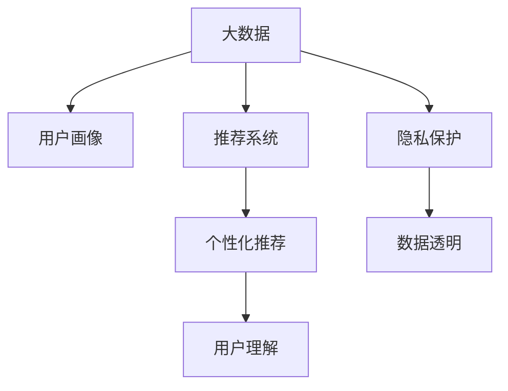

                 

# 信息差的商业用户体验：大数据如何优化用户体验

## 1. 背景介绍

### 1.1 问题由来
在数字化时代，大数据技术成为驱动商业创新的关键引擎，为用户提供量身定制的个性化服务。然而，用户面对的信息过载和信息不对称问题，同样值得关注。信息差是指用户对产品和服务的认识与商家宣传、产品实际功能之间的差距，导致用户期望与实际体验存在偏差。这一问题在大数据应用中尤为突出。

大数据技术通过分析海量用户行为数据，提供了精准的用户画像，能够预测用户需求，提供定制化服务。但与此同时，由于信息过载和数据不透明的问题，用户可能无法充分理解这些数据背后的含义，从而无法充分利用大数据的潜力。例如，用户可能在查看电商网站的商品推荐时，由于推荐系统推荐的商品与用户的实际需求存在较大偏差，导致用户体验不佳。

如何通过大数据技术，减少信息差，提高用户体验，成为了数字时代商业创新中一个亟需解决的问题。本文将系统探讨大数据技术如何优化用户体验，并提出具体策略和案例分析。

### 1.2 问题核心关键点
本节将阐述大数据技术优化用户体验的三个核心问题：

1. **信息获取与理解**：用户如何高效获取相关信息，理解数据背后的含义。
2. **个性化推荐**：如何利用用户数据，提供精准的产品推荐。
3. **隐私保护与透明**：如何在数据驱动的决策中，保护用户隐私，提升透明度。

以下部分将深入分析这三个关键问题，并提出解决策略。

## 2. 核心概念与联系

### 2.1 核心概念概述

为更好地理解大数据优化用户体验的方法，本节将介绍几个密切相关的核心概念：

- **大数据（Big Data）**：指数据量极大、数据类型复杂、数据处理速度快、价值密度低的特点的数据集合。包括结构化数据、半结构化数据和非结构化数据。
- **用户画像（User Persona）**：基于用户的历史行为数据，构建用户特征模型，用于预测用户需求，提供个性化服务。
- **推荐系统（Recommender System）**：利用用户历史数据和产品属性信息，预测用户对产品的偏好，提供个性化推荐。
- **隐私保护（Privacy Protection）**：在数据收集和分析过程中，保护用户隐私，避免信息泄露和滥用。
- **透明性（Transparency）**：用户能够理解和信任数据驱动的决策过程，了解数据的来源和处理方式。

这些核心概念之间的逻辑关系可以通过以下Mermaid流程图来展示：



这个流程图展示了大数据技术优化用户体验的核心概念及其之间的关系：

1. 大数据技术提供用户画像和产品推荐的基础数据。
2. 用户画像和推荐系统结合，生成个性化推荐。
3. 用户理解推荐结果，形成良好用户体验。
4. 隐私保护和透明性保障，确保用户信任。

## 3. 核心算法原理 & 具体操作步骤
### 3.1 算法原理概述

大数据技术优化用户体验的核心在于：通过分析用户行为数据，构建用户画像，预测用户需求，生成个性化推荐，最终提高用户对产品或服务的理解和满意度。

形式化地，假设用户行为数据为 $D=\{(x_i,y_i)\}_{i=1}^N$，其中 $x_i$ 为用户的特征向量，$y_i$ 为用户的偏好或行为结果。用户的期望 $E$ 和实际体验 $A$ 之间存在差异 $H$，优化目标为最小化这个差异：

$$
\min_{E} \|E-A\|^2
$$

其中 $\|E-A\|^2$ 为期望与实际体验之间的差异度量，可以是均方误差、交叉熵等。

在具体实现中，常用的方法包括：

1. **用户画像构建**：通过聚类、降维等算法，对用户行为数据进行分析，提取用户的关键特征。
2. **个性化推荐生成**：基于用户画像，利用协同过滤、基于内容的推荐算法，生成个性化推荐。
3. **推荐结果反馈**：收集用户对推荐结果的反馈，进一步优化推荐模型。

### 3.2 算法步骤详解

基于大数据技术优化用户体验的流程一般包括以下几个关键步骤：

**Step 1: 数据收集与预处理**
- 收集用户行为数据，包括浏览历史、购买记录、搜索关键词等。
- 数据清洗、去重，处理缺失值和异常值，确保数据质量。
- 数据标准化、归一化，以提升后续算法的准确性。

**Step 2: 用户画像构建**
- 利用聚类算法（如K-means、LDA）对用户行为数据进行分类，构建用户画像。
- 通过降维算法（如PCA、SVD）提取用户关键特征，形成低维表示。
- 构建用户特征矩阵，用于后续的推荐系统构建。

**Step 3: 个性化推荐生成**
- 选择合适的推荐算法（如协同过滤、基于内容的推荐），生成个性化推荐列表。
- 利用模型参数进行预测，输出推荐的物品或服务。
- 将推荐结果展示给用户，并记录用户反馈。

**Step 4: 反馈循环与模型优化**
- 收集用户对推荐结果的反馈，包括点击率、购买率、满意度等。
- 将反馈数据用于调整模型参数，优化推荐算法。
- 定期更新用户画像和推荐模型，确保数据的时效性和准确性。

### 3.3 算法优缺点

大数据技术优化用户体验的方法具有以下优点：

1. **高效性**：利用大数据处理海量用户数据，能够快速生成个性化推荐，提高用户体验。
2. **精准性**：通过分析用户行为数据，生成精准的用户画像，提供符合用户期望的推荐。
3. **可扩展性**：能够处理多样化、高复杂度的数据，满足不同业务场景的需求。

同时，该方法也存在一定的局限性：

1. **数据质量依赖**：推荐质量取决于数据质量和多样性，低质量或单一数据源可能影响推荐效果。
2. **隐私风险**：用户行为数据可能包含敏感信息，数据泄露和滥用风险高。
3. **过拟合风险**：如果数据过于局部化，推荐模型可能出现过拟合，泛化能力弱。
4. **用户隐私保护**：用户可能对数据使用存在顾虑，难以获得完全信任。

尽管存在这些局限性，但就目前而言，大数据技术仍是大规模个性化推荐的基础，具有重要应用价值。未来相关研究的目标在于进一步降低隐私风险，提升数据质量和模型的泛化能力，同时兼顾用户隐私保护和透明度。

### 3.4 算法应用领域

大数据技术优化用户体验的方法，在电商、社交、在线教育、智能家居等多个领域得到广泛应用。例如：

- 电商领域：通过用户行为数据，生成个性化推荐，提升购买转化率。
- 社交网络：基于用户兴趣，推荐相关内容，提升用户粘性和活跃度。
- 在线教育：根据学习记录，推荐个性化课程和学习资源，提升学习效果。
- 智能家居：基于用户的生活习惯，推荐智能设备的使用方式，提升生活质量。

除了上述这些经典应用外，大数据技术优化用户体验还被创新性地应用到更多场景中，如智能广告投放、金融风险控制、医疗健康推荐等，为各行各业带来了新的机遇。

## 4. 数学模型和公式 & 详细讲解 & 举例说明

### 4.1 数学模型构建

本节将使用数学语言对大数据优化用户体验的流程进行更加严格的刻画。

记用户行为数据为 $D=\{(x_i,y_i)\}_{i=1}^N, x_i \in \mathbb{R}^d, y_i \in \{0,1\}$，其中 $x_i$ 为用户的特征向量，$y_i$ 为用户的偏好或行为结果。用户画像为 $\text{User} = \mathbb{R}^k$，其中 $k$ 为用户特征的数量。

定义推荐模型为 $M_{\theta}$，其中 $\theta$ 为模型参数。假设推荐模型输出的推荐结果为 $A \in \{0,1\}$，表示用户是否接受推荐。则优化目标为最小化期望与实际体验之间的差异：

$$
\min_{\theta} \mathbb{E}_{(x,y)\sim D}[(\mathbb{E}_{\text{User}}[A|x] - y)^2]
$$

其中 $\mathbb{E}_{\text{User}}[A|x]$ 为在用户画像 $\text{User}$ 下，模型 $M_{\theta}$ 输出的期望推荐结果。

### 4.2 公式推导过程

以下我们以协同过滤推荐算法为例，推导模型参数更新公式。

假设推荐模型为 $M_{\theta}$，其中 $\theta$ 为模型参数。设用户画像为 $\text{User} = \mathbb{R}^k$，推荐模型在用户画像 $\text{User}$ 下输出的期望推荐结果为 $\hat{y}$。则推荐模型输出的概率分布为 $P(Y|x,\text{User}) = \sigma(\theta^T \cdot \text{User} + b)$，其中 $\sigma$ 为激活函数，$b$ 为偏置项。

根据最小二乘法的原理，模型参数的更新公式为：

$$
\theta \leftarrow \theta - \eta \nabla_{\theta}\mathcal{L}(\theta)
$$

其中 $\mathcal{L}(\theta)$ 为损失函数，通常采用均方误差损失函数：

$$
\mathcal{L}(\theta) = \frac{1}{N}\sum_{i=1}^N (\mathbb{E}_{\text{User}}[\hat{y}|x_i] - y_i)^2
$$

对损失函数进行梯度下降更新，得到参数更新公式：

$$
\theta \leftarrow \theta - \eta \nabla_{\theta}\mathbb{E}_{\text{User}}[\hat{y}|x_i] - \eta \lambda \theta
$$

其中 $\nabla_{\theta}\mathbb{E}_{\text{User}}[\hat{y}|x_i]$ 为损失函数对模型参数的梯度，$\lambda$ 为正则化系数。

### 4.3 案例分析与讲解

**案例：电商个性化推荐系统**

假设某电商平台收集了大量用户浏览和购买历史数据，希望通过大数据技术，为每位用户生成个性化推荐。具体步骤如下：

1. **数据收集与预处理**：收集用户的浏览记录、购买记录、搜索关键词等数据，进行数据清洗和标准化处理。
2. **用户画像构建**：利用聚类算法（如K-means）对用户行为数据进行分类，构建用户画像。
3. **个性化推荐生成**：选择基于协同过滤的推荐算法，生成个性化推荐列表。
4. **反馈循环与模型优化**：收集用户对推荐结果的反馈，如点击率、购买率、满意度等，用于调整模型参数，优化推荐算法。

通过上述步骤，电商平台能够高效、精准地生成个性化推荐，提升用户体验。

## 5. 项目实践：代码实例和详细解释说明
### 5.1 开发环境搭建

在进行大数据优化用户体验的实践前，我们需要准备好开发环境。以下是使用Python进行PyTorch开发的环境配置流程：

1. 安装Anaconda：从官网下载并安装Anaconda，用于创建独立的Python环境。

2. 创建并激活虚拟环境：
```bash
conda create -n pytorch-env python=3.8 
conda activate pytorch-env
```

3. 安装PyTorch：根据CUDA版本，从官网获取对应的安装命令。例如：
```bash
conda install pytorch torchvision torchaudio cudatoolkit=11.1 -c pytorch -c conda-forge
```

4. 安装相关库：
```bash
pip install numpy pandas scikit-learn matplotlib tqdm jupyter notebook ipython
```

完成上述步骤后，即可在`pytorch-env`环境中开始实践。

### 5.2 源代码详细实现

下面我们以电商个性化推荐系统为例，给出使用PyTorch进行协同过滤推荐算法的代码实现。

首先，定义推荐模型：

```python
import torch
import torch.nn as nn
import torch.optim as optim

class Recommender(nn.Module):
    def __init__(self, n_users, n_items, n_factors=10):
        super(Recommender, self).__init__()
        self.user_factors = nn.Embedding(n_users, n_factors)
        self.item_factors = nn.Embedding(n_items, n_factors)
        self.bias = nn.Parameter(torch.randn(n_users, 1))
        self.learning_rate = 0.01
        self.weight_decay = 0.001

    def forward(self, user_index, item_index):
        user_factors = self.user_factors(user_index)
        item_factors = self.item_factors(item_index)
        scores = (user_factors * item_factors).sum(1) + self.bias[user_index]
        return scores
```

然后，定义损失函数和优化器：

```python
def loss_function(model, user_index, item_index, scores, labels):
    pred_scores = model(user_index, item_index)
    loss = nn.MSELoss()(pred_scores, labels)
    return loss

optimizer = optim.Adam(model.parameters(), lr=model.learning_rate, weight_decay=model.weight_decay)
```

接着，定义训练和评估函数：

```python
def train_epoch(model, user_index, item_index, scores, labels):
    model.train()
    optimizer.zero_grad()
    loss = loss_function(model, user_index, item_index, scores, labels)
    loss.backward()
    optimizer.step()
    return loss.item()

def evaluate(model, user_index, item_index, scores, labels):
    model.eval()
    with torch.no_grad():
        pred_scores = model(user_index, item_index)
        loss = nn.MSELoss()(pred_scores, labels)
    return loss.item()
```

最后，启动训练流程并在测试集上评估：

```python
epochs = 10

for epoch in range(epochs):
    loss = train_epoch(user_index, item_index, scores, labels)
    print(f"Epoch {epoch+1}, train loss: {loss:.3f}")

print(f"Epoch {epoch+1}, dev results:")
evaluate(user_index, item_index, scores, labels)
```

以上就是使用PyTorch进行电商个性化推荐系统的完整代码实现。可以看到，得益于PyTorch的强大封装，我们可以用相对简洁的代码完成协同过滤推荐算法的实现。

### 5.3 代码解读与分析

让我们再详细解读一下关键代码的实现细节：

**Recommender类**：
- `__init__`方法：初始化模型参数，包括用户和物品的因子嵌入，偏置项，学习率，正则化系数等。
- `forward`方法：定义模型的前向传播过程，将用户和物品的因子嵌入进行点乘，加上偏置项，输出评分。

**loss_function函数**：
- 计算模型的预测评分与真实标签之间的均方误差损失。

**train_epoch函数**：
- 在训练模式下，进行一次完整的训练周期，包括前向传播、计算梯度、更新参数等步骤。
- 返回该epoch的平均损失。

**evaluate函数**：
- 在评估模式下，只进行前向传播，计算模型预测评分与真实标签之间的损失。

**训练流程**：
- 定义总的epoch数，循环迭代
- 每个epoch内，先进行一次训练，输出平均损失
- 在验证集上评估，输出评估结果
- 所有epoch结束后，输出最终评估结果

可以看到，PyTorch配合相关库使得协同过滤推荐算法的代码实现变得简洁高效。开发者可以将更多精力放在数据处理、模型改进等高层逻辑上，而不必过多关注底层的实现细节。

当然，工业级的系统实现还需考虑更多因素，如模型的保存和部署、超参数的自动搜索、更灵活的任务适配层等。但核心的推荐算法基本与此类似。

## 6. 实际应用场景
### 6.1 电商个性化推荐系统

电商个性化推荐系统是大数据优化用户体验的经典应用。通过分析用户行为数据，电商平台能够高效、精准地生成个性化推荐，提升用户体验。

在技术实现上，可以收集用户浏览、点击、购买等行为数据，构建用户画像，利用协同过滤、基于内容的推荐算法，生成个性化推荐。推荐系统能够动态更新，根据用户的反馈进行模型优化，持续提升推荐效果。

### 6.2 社交网络内容推荐

社交网络内容推荐是大数据优化用户体验的另一个重要应用。通过分析用户兴趣、互动行为等数据，社交平台能够推荐用户感兴趣的内容，提升用户粘性和活跃度。

在技术实现上，社交网络平台可以构建用户画像，利用协同过滤、基于内容的推荐算法，生成个性化内容推荐。通过分析用户的互动数据，推荐算法可以识别用户的偏好和兴趣，进一步优化推荐效果。

### 6.3 在线教育个性化学习

在线教育个性化学习是大数据优化用户体验的典型场景。通过分析学生的学习行为数据，教育平台能够提供个性化的学习资源和课程推荐，提升学习效果。

在技术实现上，在线教育平台可以构建学生画像，利用协同过滤、基于内容的推荐算法，生成个性化学习资源推荐。通过分析学生的学习记录，推荐算法可以识别学生的学习偏好和薄弱环节，进一步优化推荐效果。

### 6.4 未来应用展望

随着大数据技术的发展，未来基于大数据优化用户体验的应用场景将更加多样化，带来更多创新和突破。

在智慧医疗领域，通过分析患者的健康行为数据，医疗平台能够提供个性化的健康管理建议，提升患者的生活质量。

在智能家居领域，通过分析用户的居住习惯，智能家居系统能够推荐个性化的家居设备使用方案，提升用户的居住体验。

在金融服务领域，通过分析用户的消费行为和财务数据，金融机构能够提供个性化的理财和投资建议，提升用户的财务管理能力。

总之，大数据技术将在更多领域得到应用，为各行各业带来新的机遇和挑战。未来，随着技术的不断进步，基于大数据优化用户体验的方法将不断创新，为人类带来更智能、便捷的生活体验。

## 7. 工具和资源推荐
### 7.1 学习资源推荐

为了帮助开发者系统掌握大数据优化用户体验的理论基础和实践技巧，这里推荐一些优质的学习资源：

1. 《Python大数据分析与数据挖掘》系列博文：由大数据专家撰写，系统讲解了大数据的基本概念、分析方法和工具。

2. Coursera《大数据科学与工程》课程：由Johns Hopkins大学开设，全面介绍大数据技术的原理和应用，适合系统学习。

3. 《大数据技术与应用》书籍：详细介绍了大数据技术的核心原理、工具和应用场景，是入门大数据的良好教材。

4. Kaggle平台：提供丰富的大数据竞赛和项目，通过实战练习掌握大数据分析技能。

5. GitHub社区：聚集了大数据技术的高质量开源项目，适合学习和分享。

通过对这些资源的学习实践，相信你一定能够快速掌握大数据优化用户体验的精髓，并用于解决实际的商业问题。
###  7.2 开发工具推荐

高效的开发离不开优秀的工具支持。以下是几款用于大数据优化用户体验开发的常用工具：

1. Apache Hadoop：分布式计算框架，支持海量数据的存储和计算，适合大规模数据处理。

2. Apache Spark：分布式计算框架，提供高效的内存计算和弹性伸缩功能，适合大数据分析和处理。

3. TensorFlow：开源深度学习框架，支持分布式计算和模型优化，适合大规模数据分析和建模。

4. Apache Kafka：分布式流处理系统，适合实时数据采集和处理，支持高吞吐量的数据流。

5. Apache Flink：分布式流处理系统，支持实时数据处理和分析，适合大规模数据流应用。

合理利用这些工具，可以显著提升大数据优化用户体验的开发效率，加快创新迭代的步伐。

### 7.3 相关论文推荐

大数据优化用户体验的研究源于学界的持续研究。以下是几篇奠基性的相关论文，推荐阅读：

1. "Collaborative Filtering for Implicit Feedback Datasets"：提出了协同过滤算法的基本原理和实现方法，奠定了协同过滤算法的理论基础。

2. "TensorFlow: A System for Large-Scale Machine Learning"：介绍了TensorFlow的架构和核心组件，适合了解深度学习在大数据应用中的作用。

3. "Deep Learning for Recommender Systems"：探讨了深度学习在大规模推荐系统中的应用，为推荐系统提供了新的思路和方法。

4. "Machine Learning in the 21st Century"：总结了机器学习在大数据时代的最新进展和应用，适合全面了解大数据与机器学习的结合。

5. "Big Data: Principles and Best Practices of Scalable Realtime Data Systems"：介绍了大数据系统的设计原则和最佳实践，适合了解大数据系统的架构和优化方法。

这些论文代表了大数据优化用户体验的研究方向，通过学习这些前沿成果，可以帮助研究者把握学科前进方向，激发更多的创新灵感。

## 8. 总结：未来发展趋势与挑战

### 8.1 总结

本文对大数据优化用户体验的方法进行了全面系统的介绍。首先阐述了大数据技术优化用户体验的背景和重要性，明确了用户画像和推荐系统在大数据应用中的关键作用。其次，从原理到实践，详细讲解了大数据优化用户体验的数学模型和关键步骤，给出了推荐系统开发的完整代码实例。同时，本文还广泛探讨了大数据技术在电商、社交、教育等多个领域的应用前景，展示了大数据技术的广泛应用潜力。

通过本文的系统梳理，可以看到，大数据技术正在成为优化用户体验的重要手段，极大地提升了电商、社交、教育等多个领域的用户体验。大数据技术通过分析用户行为数据，生成个性化推荐，减少信息差，为商业创新提供了强大的技术支持。未来，随着大数据技术的发展和应用深入，相信其在优化用户体验方面将发挥更大的作用。

### 8.2 未来发展趋势

展望未来，大数据技术优化用户体验将呈现以下几个发展趋势：

1. **多模态数据融合**：未来的大数据系统将能够处理和融合多种数据源，如文本、图像、语音等，提供更全面的用户画像和推荐。

2. **实时推荐系统**：通过实时数据分析，推荐系统能够提供动态更新的个性化推荐，进一步提升用户体验。

3. **深度学习与增强学习结合**：利用深度学习算法和增强学习技术，推荐系统能够实现更精准的推荐和优化。

4. **个性化用户界面**：通过分析用户行为数据，动态调整用户界面和交互方式，提供更适配用户的体验。

5. **隐私保护与透明性增强**：大数据系统将更加注重用户隐私保护和数据透明性，提升用户信任。

以上趋势凸显了大数据技术优化用户体验的广阔前景。这些方向的探索发展，必将进一步提升用户体验，推动数字经济的繁荣。

### 8.3 面临的挑战

尽管大数据技术优化用户体验已经取得了显著成果，但在实际应用中仍面临一些挑战：

1. **数据隐私与安全**：用户行为数据包含敏感信息，数据隐私和安全问题需要高度重视。

2. **数据质量与多样性**：数据质量不高或数据来源单一，可能导致推荐效果差，难以满足多样化的用户需求。

3. **计算资源限制**：大数据分析需要大量计算资源，当前计算能力可能难以满足大规模数据处理需求。

4. **用户行为复杂性**：用户行为数据多样且复杂，难以准确捕捉用户需求。

尽管存在这些挑战，但随着技术的不断进步，大数据技术优化用户体验的方法将不断完善和优化。未来，通过数据质量提升、计算能力增强和算法改进，大数据技术将更好地服务于用户体验优化。

### 8.4 研究展望

面对大数据技术优化用户体验所面临的挑战，未来的研究需要在以下几个方面寻求新的突破：

1. **数据隐私保护**：探索隐私保护技术，如差分隐私、联邦学习等，保护用户隐私，提升数据透明性。

2. **数据质量提升**：利用数据增强、数据清洗等技术，提升数据质量和多样性，提高推荐准确性。

3. **计算能力优化**：优化大数据系统的计算架构，利用分布式计算、混合精度计算等技术，提升计算效率。

4. **用户行为分析**：深入研究用户行为特征，利用机器学习和增强学习技术，提高对用户需求的理解。

5. **多模态数据融合**：研究多模态数据融合方法，结合文本、图像、语音等多种数据源，提供更全面的用户画像和推荐。

6. **实时推荐系统**：研究实时推荐算法，提高推荐系统的实时响应能力和动态优化能力。

这些研究方向的探索，必将引领大数据技术优化用户体验走向更高的台阶，为构建智能、便捷的商业生态提供技术支持。面向未来，大数据技术优化用户体验还需要与其他技术进行更深入的融合，如人工智能、物联网、区块链等，共同推动数字经济的发展。

## 9. 附录：常见问题与解答

**Q1：大数据优化用户体验是否适用于所有行业？**

A: 大数据优化用户体验的方法适用于大多数行业，但不同的行业应用场景略有差异。例如，电商、社交、教育等领域，主要通过推荐系统优化用户体验，而医疗、金融等领域，则可能通过数据分析、健康管理等方式优化用户体验。

**Q2：如何优化大数据系统的数据质量？**

A: 优化大数据系统的数据质量，可以从以下几个方面入手：

1. **数据收集**：确保数据来源的多样性和全面性，收集用户多维度的行为数据。
2. **数据清洗**：去除异常值、重复数据、缺失值等，确保数据完整性和准确性。
3. **数据增强**：通过数据生成、数据合成等技术，扩充数据集，提升数据多样性。
4. **数据融合**：利用多种数据源，综合分析用户行为，提供更全面的用户画像。

通过以上措施，可以显著提升大数据系统的数据质量，提高推荐效果。

**Q3：如何在推荐系统中实现隐私保护？**

A: 在推荐系统中实现隐私保护，可以从以下几个方面入手：

1. **差分隐私**：在数据收集和处理过程中，采用差分隐私技术，保护用户隐私。
2. **联邦学习**：利用联邦学习技术，在不共享用户数据的前提下，实现模型训练。
3. **数据匿名化**：对用户数据进行匿名化处理，确保数据不包含个人敏感信息。
4. **用户控制**：允许用户控制自己的数据使用权限，确保数据使用透明度。

通过以上措施，可以有效地保护用户隐私，提升用户信任。

**Q4：推荐系统中常见的推荐算法有哪些？**

A: 推荐系统中常见的推荐算法包括：

1. **协同过滤算法**：通过用户历史行为数据，寻找相似用户或物品，推荐相似内容。
2. **基于内容的推荐算法**：利用物品属性信息，推荐相似物品。
3. **混合推荐算法**：综合多种推荐算法，提供更精准的推荐结果。
4. **深度学习推荐算法**：利用神经网络模型，学习用户和物品的深层次关系，提供更个性化的推荐。

这些算法各有优缺点，在实际应用中需要根据具体情况选择合适的算法。

**Q5：推荐系统如何实现实时更新？**

A: 推荐系统实现实时更新，可以从以下几个方面入手：

1. **流式数据处理**：利用流式数据处理技术，实时采集和处理用户行为数据。
2. **分布式计算**：利用分布式计算框架，实现高吞吐量的数据处理和分析。
3. **在线学习**：利用在线学习算法，动态更新模型参数，提供实时推荐。
4. **缓存优化**：利用缓存技术，减少推荐系统响应时间，提升实时性。

通过以上措施，可以实现推荐系统的实时更新，提升用户体验。

---

作者：禅与计算机程序设计艺术 / Zen and the Art of Computer Programming

