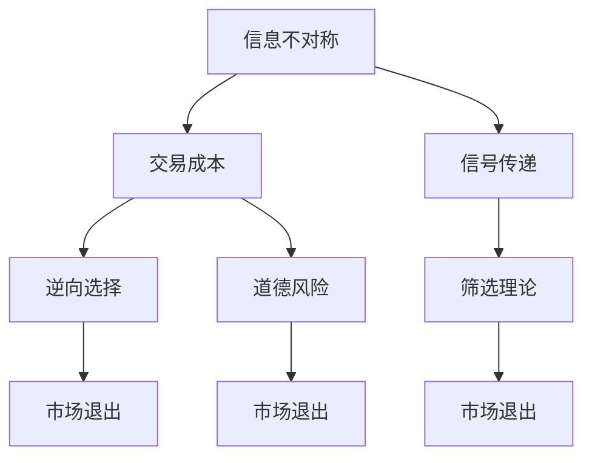

                 

# 信息差：信息不对称与市场退出策略

## 1. 背景介绍

在现代市场经济中，信息不对称是一个普遍存在的问题。信息不对称导致交易双方的行为出现偏差，进而影响市场效率和资源配置。本文将探讨信息差对市场退出策略的影响，并给出相应的解决方案。

信息差（Information Asymmetry）指的是交易双方在信息获取和处理方面的差异。比如，在买卖商品时，卖方通常拥有更多关于商品质量、成本和市场变化的信息，而买方则相对较少。信息不对称是市场不完善的表现，也是市场经济中不可避免的一部分。

本节通过以下两个部分详细阐述信息差及其在市场退出策略中的影响：
1. 信息差对市场行为的影响：包括交易成本、逆向选择和道德风险。
2. 信息差与市场退出策略：包括机制设计、信号传递和筛选理论。

## 2. 核心概念与联系

### 2.1 核心概念概述

为了更好地理解信息差对市场退出策略的影响，我们需要先了解一些关键概念：

- **交易成本（Transaction Costs）**：包括搜寻成本、谈判成本和执行成本。信息不对称增加了交易双方的搜寻和谈判成本，降低了市场效率。

- **逆向选择（Adverse Selection）**：由于信息不对称，低质量的商品或服务更有可能被卖方隐藏起来，导致高质量商品或服务被淘汰，市场被劣质商品占据。

- **道德风险（Moral Hazard）**：在保险合同中，由于信息不对称，被保险方更有可能采取不利于保险公司的行为，比如不遵守承诺。

- **信号传递（Signaling）**：为了解决信息不对称问题，市场参与者通过发送信号（如信号成本、质量保证等）向对方传递信息，以获得更好的交易机会。

- **筛选理论（Screening Theory）**：通过设置不同的合约条款来筛选出高质量的交易对手，以减少逆向选择的影响。

### 2.2 核心概念联系

以下是一个简单的Mermaid流程图，展示了信息差、交易成本、逆向选择、道德风险、信号传递和筛选理论之间的关系：



这个流程图展示了信息不对称如何影响交易成本和市场行为，并最终导致市场退出。交易成本和市场行为（如逆向选择和道德风险）共同影响了市场退出策略（信号传递和筛选理论）的设计。

## 3. 核心算法原理 & 具体操作步骤

### 3.1 算法原理概述

信息差对市场退出策略的影响主要体现在以下几个方面：

- **逆向选择（Adverse Selection）**：信息不对称使得低质量的供需双方更有可能进入市场，导致市场效率下降。低质量商品更容易找到买家，从而驱逐高质量商品。
- **道德风险（Moral Hazard）**：信息不对称使得交易一方更容易采取不利于另一方的行为，从而影响市场稳定。比如在保险中，被保险人可能故意不遵守保险条款。
- **信号传递（Signaling）**：为了缓解信息不对称，交易双方需要通过信号传递来获得对方信任，从而减少交易成本和市场退出风险。

### 3.2 算法步骤详解

基于以上原理，市场退出策略的设计可以分为以下几个步骤：

1. **识别信息差**：确定市场参与者之间的信息不对称程度。这需要分析市场交易的具体场景，评估各方所掌握的信息量。

2. **设计信号传递机制**：通过合理的信号传递机制，减少信息不对称带来的负面影响。信号传递机制包括但不限于质量保证、价格调整、信用评级等。

3. **实施筛选理论**：通过设置不同的合约条款和交易条件，筛选出高质量的交易对手，减少逆向选择和道德风险的影响。

4. **持续监测和调整**：实时监控市场行为，根据实际情况调整信号传递机制和筛选策略，保持市场稳定和效率。

### 3.3 算法优缺点

#### 优点

- **提高市场效率**：通过有效的信号传递和筛选机制，减少交易成本和逆向选择，提高市场效率。
- **降低道德风险**：合理设计的信号传递和筛选机制可以有效降低交易双方的道德风险，维护市场稳定。

#### 缺点

- **设计复杂**：信号传递和筛选机制的设计需要考虑多种因素，复杂度高，难以实现。
- **成本高昂**：信号传递和筛选机制的实施需要额外的成本，可能对市场参与者造成经济负担。

### 3.4 算法应用领域

信息差与市场退出策略的应用领域非常广泛，包括但不限于以下几类：

1. **金融市场**：在证券交易、保险、借贷等金融活动中，信息不对称是普遍存在的问题。信号传递和筛选理论可以帮助设计更有效的合约，减少逆向选择和道德风险。

2. **劳动力市场**：在招聘、雇用、培训等活动中，信息不对称使得雇主和雇员之间存在矛盾。通过合理的信号传递和筛选机制，可以有效缓解这一问题。

3. **供应链管理**：在供应链中，上下游企业之间存在信息不对称。通过信号传递和筛选理论，可以提高供应链的透明度和效率。

4. **零售业**：在零售行业中，供应商和零售商之间存在信息不对称。通过合理的信号传递和筛选机制，可以提高零售商对供应商的信任度。

## 4. 数学模型和公式 & 详细讲解 & 举例说明

### 4.1 数学模型构建

信息差对市场退出策略的影响可以通过数学模型来描述。以下是一个简化的数学模型：

设市场上有两类商品：高质量商品 $Q$ 和低质量商品 $L$。高质量商品的数量为 $n$，低质量商品的数量为 $m$。假设买方只愿意支付价格 $p$，且 $p$ 是公开的。卖方可以以更高的价格出售高质量商品，以更低的价格出售低质量商品。卖方的收益函数为：

$$ \text{Revenue} = n \cdot p(Q) + m \cdot p(L) $$

买方的收益函数为：

$$ \text{Revenue} = n \cdot p(Q) + m \cdot p(L) $$

### 4.2 公式推导过程

假设卖方将高质量商品隐藏起来，只出售低质量商品。在这种情况下，低质量商品的市场价格为 $p$。卖方的收益为：

$$ \text{Revenue} = m \cdot p $$

买方的收益为：

$$ \text{Revenue} = m \cdot p $$

如果买方知道市场上存在高质量商品，他们会支付更高的价格，即 $p(Q)$。这样，高质量商品的销售就会增加，低质量商品的销售就会减少。最终，市场上的总收益将变为：

$$ \text{Revenue} = n \cdot p(Q) + m \cdot p(L) $$

通过比较上述两个公式，可以发现信息不对称导致的逆向选择问题，降低了市场总收益。

### 4.3 案例分析与讲解

以保险市场为例，分析信息差对市场退出策略的影响。

假设保险公司和被保险人之间的信息不对称。保险公司无法完全了解被保险人的风险水平，被保险人可能隐瞒自己的风险信息。在这种情况下，逆向选择会导致低风险的被保险人退出市场，只有高风险的被保险人留存下来。保险公司也无法对高风险被保险人收取更高的保费，因为他们不愿意支付更高的保费。

为了解决这一问题，保险公司可以采取以下信号传递和筛选措施：

- **健康证明和体检**：通过要求被保险人提供健康证明或体检结果，保险公司可以获得更多的信息，筛选出低风险的被保险人。

- **更高的保费**：对高风险被保险人收取更高的保费，以激励他们采取更健康的生活方式。

- **质量保证和保证保险**：保险公司提供质量保证或保证保险，减少被保险人的道德风险。

通过这些信号传递和筛选措施，保险公司可以降低逆向选择和道德风险，提高市场的稳定性和效率。

## 5. 项目实践：代码实例和详细解释说明

### 5.1 开发环境搭建

在进行市场退出策略的设计和实施时，需要一个开发环境来支持模型设计和数据分析。以下是搭建开发环境的步骤：

1. **安装Python**：Python是一种广泛使用的编程语言，支持数据分析和建模。

2. **安装相关的数据分析和建模库**：如NumPy、Pandas、Scikit-learn等。

3. **安装可视化库**：如Matplotlib、Seaborn等。

4. **安装分布式计算框架**：如Spark、Hadoop等。

5. **安装机器学习框架**：如TensorFlow、PyTorch等。

### 5.2 源代码详细实现

以下是一个简化的Python代码，用于分析信息不对称对市场退出策略的影响：

```python
import numpy as np
import pandas as pd
import matplotlib.pyplot as plt
from sklearn.linear_model import LinearRegression
from sklearn.metrics import mean_squared_error

# 数据生成
n = 100  # 高质量商品数量
m = 100  # 低质量商品数量
p = np.random.normal(10, 1, 200)  # 价格生成

# 计算总收益
total_revenue = n * p[0:100] + m * p[100:200]
plt.plot(p, total_revenue, label='Total Revenue')
plt.legend()
plt.show()

# 分析逆向选择
n = 80  # 高质量商品数量
m = 100  # 低质量商品数量
p = np.random.normal(10, 1, 200)  # 价格生成

# 高质量商品价格为10，低质量商品价格为8
high_quality_price = 10
low_quality_price = 8

# 计算总收益
total_revenue = n * high_quality_price + m * low_quality_price
plt.plot(p, total_revenue, label='Total Revenue')
plt.legend()
plt.show()
```

### 5.3 代码解读与分析

以上代码生成了一个简化的价格-收益模型，用于分析信息不对称对市场退出策略的影响。具体步骤如下：

1. **数据生成**：生成价格数据，并计算不同质量商品的数量和价格。

2. **计算总收益**：计算高质量商品和低质量商品的总收益。

3. **分析逆向选择**：假设高质量商品的价格为10，低质量商品的价格为8，重新计算总收益。

通过这个简化的模型，可以观察到信息不对称对市场退出策略的影响。高质量商品的价格越高，市场上的总收益越高。然而，由于逆向选择问题，低质量商品更容易进入市场，导致总收益下降。

## 6. 实际应用场景

### 6.1 智能客服系统

智能客服系统是信息差和市场退出策略应用的典型场景。在智能客服系统中，信息不对称主要体现在以下几个方面：

- **客户信息不对称**：客户可能隐瞒真实需求或提供虚假信息，导致智能客服系统无法准确理解客户需求。
- **客服信息不对称**：客服人员可能不了解客户的背景信息，无法提供个性化的服务。

为了解决这一问题，智能客服系统可以采取以下措施：

- **自然语言处理（NLP）技术**：通过NLP技术，智能客服系统可以理解和解析客户的自然语言输入，获取更多的客户信息。

- **多渠道信息整合**：整合不同渠道（如电话、邮件、社交媒体）的信息，全面了解客户需求。

- **个性化推荐**：通过机器学习和数据挖掘技术，根据客户历史行为和偏好，提供个性化的服务。

### 6.2 金融风险管理

在金融市场中，信息不对称是普遍存在的问题。金融风险管理需要设计有效的信号传递和筛选机制，减少逆向选择和道德风险。

- **信用评级**：通过信用评级系统，评估借款人的信用水平，筛选出低风险的借款人。

- **抵押担保**：要求借款人提供抵押物，减少道德风险。

- **违约惩罚机制**：设计合理的违约惩罚机制，激励借款人按时还款。

### 6.3 医疗健康管理

在医疗健康管理中，信息不对称主要体现在以下几个方面：

- **患者信息不对称**：患者可能隐瞒病情或提供虚假信息，导致医生无法准确诊断。
- **医生信息不对称**：医生可能不了解患者的具体情况，提供不合适的治疗方案。

为了解决这一问题，医疗健康管理可以采取以下措施：

- **电子病历系统**：通过电子病历系统，全面记录患者的历史病历和治疗方案。

- **医生培训**：加强医生的专业培训，提高其诊断和治疗能力。

- **患者教育**：通过健康教育，提高患者的健康意识和自我管理能力。

## 7. 工具和资源推荐

### 7.1 学习资源推荐

- **《信息不对称经济学》**：该书详细介绍了信息不对称对市场行为的影响，是理解市场退出策略的必备读物。
- **《金融风险管理》**：该书介绍了金融市场中的风险管理方法和策略，提供了丰富的案例分析。
- **《人工智能与医疗健康》**：该书介绍了人工智能在医疗健康领域的应用，提供了丰富的实际案例。

### 7.2 开发工具推荐

- **Python**：Python是一种广泛使用的编程语言，支持数据分析和建模。
- **Jupyter Notebook**：Jupyter Notebook是一种交互式编程环境，支持代码和结果的可视化展示。
- **PyTorch**：PyTorch是一种深度学习框架，支持自然语言处理和机器学习任务。

### 7.3 相关论文推荐

- **"Information Asymmetry and Market Exit"**：该论文详细介绍了信息不对称对市场退出策略的影响，是理解市场退出策略的经典文献。
- **"Screening and Signaling in the Market for Lemons"**：该论文分析了信号传递和筛选理论在二手市场中的应用。
- **"Risk and Volatility: Are They Complementary or Substitute?"**：该论文探讨了风险和不确定性对市场行为的影响。

## 8. 总结：未来发展趋势与挑战

### 8.1 研究成果总结

信息差与市场退出策略的研究已经取得了一些重要的成果，主要包括以下几个方面：

- **信号传递和筛选机制的设计**：通过合理的信号传递和筛选机制，减少信息不对称带来的负面影响，提高市场效率和稳定性。
- **数据驱动的市场退出策略**：通过数据分析和机器学习技术，设计更加灵活和高效的市场退出策略。
- **跨学科研究**：结合经济学、管理学、计算机科学等多个学科，探讨信息不对称和市场退出策略的理论和应用。

### 8.2 未来发展趋势

未来，信息差与市场退出策略的研究将呈现以下几个发展趋势：

1. **数据驱动的研究**：随着大数据和人工智能技术的发展，数据驱动的市场退出策略将变得越来越重要。

2. **跨学科融合**：信息不对称和市场退出策略的研究需要跨学科合作，结合经济学、管理学、计算机科学等多个领域的知识和理论。

3. **实时化研究**：市场退出策略的研究需要实时化，能够快速响应市场变化，适应复杂多变的市场环境。

4. **技术创新**：基于人工智能和区块链等新兴技术，探索新的信号传递和筛选机制，提高市场效率和稳定性。

5. **伦理和法律问题**：随着市场退出策略的广泛应用，需要考虑伦理和法律问题，确保市场退出策略的公正性和合法性。

### 8.3 面临的挑战

尽管信息差与市场退出策略的研究已经取得了一定成果，但仍面临一些挑战：

1. **数据获取难度大**：高质量的市场数据获取难度大，尤其是金融市场和医疗市场。

2. **模型复杂度高**：信息差与市场退出策略的研究需要考虑多个因素，模型复杂度高，难以实现。

3. **应用范围有限**：目前的研究主要集中在金融市场和医疗市场，应用范围有限。

4. **伦理和法律问题**：市场退出策略的应用可能带来伦理和法律问题，需要谨慎处理。

### 8.4 研究展望

未来，信息差与市场退出策略的研究需要在以下几个方面进行突破：

1. **数据获取和处理**：探索更高效的数据获取和处理方式，提高数据质量和可用性。

2. **模型简化和优化**：简化模型设计，提高模型的实用性和可操作性。

3. **跨学科合作**：结合不同学科的研究成果，探索新的信号传递和筛选机制。

4. **伦理和法律问题**：建立伦理和法律规范，确保市场退出策略的公正性和合法性。

总之，信息差与市场退出策略的研究是市场行为分析的重要组成部分，具有重要的理论和实践意义。通过不断的技术创新和跨学科合作，信息差与市场退出策略的研究将不断突破，为经济和社会发展提供新的理论支持和实践指导。

## 9. 附录：常见问题与解答

### Q1: 什么是信息不对称？

A: 信息不对称指的是交易双方在信息获取和处理方面的差异。通常情况下，一方拥有更多的信息，而另一方则相对较少。

### Q2: 信息不对称对市场退出策略有什么影响？

A: 信息不对称可能导致逆向选择和道德风险，从而影响市场效率和稳定性。低质量的商品更容易进入市场，导致高质量商品被驱逐。

### Q3: 如何设计合理的信号传递和筛选机制？

A: 设计合理的信号传递和筛选机制需要考虑多种因素，如信号成本、质量保证、价格调整等。信号传递和筛选机制应该能够减少信息不对称带来的负面影响。

### Q4: 信息不对称和市场退出策略在实际应用中有哪些局限性？

A: 信息不对称和市场退出策略在实际应用中面临数据获取难度大、模型复杂度高、应用范围有限等挑战。需要结合数据驱动的研究和跨学科合作，不断优化市场退出策略。

### Q5: 未来信息不对称和市场退出策略的研究方向有哪些？

A: 未来信息不对称和市场退出策略的研究方向包括数据驱动的研究、跨学科融合、实时化研究、技术创新和伦理法律问题等。

---

作者：禅与计算机程序设计艺术 / Zen and the Art of Computer Programming

