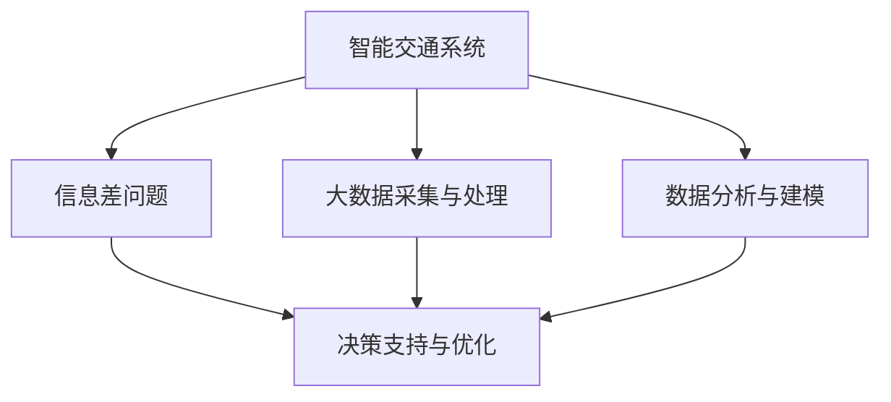

                 

# 信息差：大数据在智能交通中的应用

## 1. 背景介绍

### 1.1 问题由来

随着城市化进程的不断推进，交通拥堵、事故频发、能源浪费等城市病问题日益凸显，亟需通过技术手段来解决。智能交通系统（Intelligent Transportation System, ITS）是其中一种有效的解决方案。ITS 通过集成各种信息技术和传感器设备，对交通状况进行实时监测和分析，进而实现交通流量调控、事故预警、路径优化等功能，极大地提高了交通效率和安全性。

大数据作为智能交通系统的重要组成部分，为交通管理提供了丰富的数据支撑。通过对交通流量、车辆位置、气象条件等数据的深入分析和挖掘，可以为交通管理提供决策依据，优化交通流，降低事故发生率，提升交通系统的整体效率。然而，尽管数据采集和处理技术不断进步，信息差（Information Gap）问题仍然是一个巨大的挑战。

信息差指的是决策者与实际交通状况之间的认知差距，这种差距可能导致错误的决策和资源配置，进而影响交通系统的整体效率和安全。为了缩小信息差，需要充分挖掘和利用大数据，以提高交通管理的准确性和实时性。

### 1.2 问题核心关键点

信息差问题涉及多个方面，包括但不限于：

- **数据采集与处理**：交通数据来源广泛，包括车辆GPS、交通摄像头、雷达、传感器等，数据种类繁多，格式各异，如何高效、准确地采集、存储和处理这些数据，是信息差问题的关键。
- **数据分析与建模**：大数据分析技术的发展为交通管理提供了强大的支持，如何设计合适的算法和模型，从海量数据中提取出有用的信息，是解决信息差问题的核心。
- **决策支持与优化**：将大数据分析结果应用于交通管理决策中，通过动态调整信号灯、优化路径规划等方式，提升交通系统的整体效率和安全性。
- **实时性与准确性**：交通管理需要实时反馈，如何保证大数据分析的实时性和准确性，是确保信息差问题得到有效解决的基础。

本文将围绕大数据在智能交通系统中的应用，详细阐述信息差问题的成因和解决方法，旨在为智能交通系统的优化提供借鉴。

## 2. 核心概念与联系

### 2.1 核心概念概述

为了更好地理解大数据在智能交通系统中的应用，本节将介绍几个关键概念：

- **智能交通系统（ITS）**：通过集成先进的传感器、通信技术和数据分析工具，实现交通流量的实时监测和调控，提升交通效率和安全性。
- **大数据（Big Data）**：指数据量庞大、数据类型多样、数据速度快、数据价值密度低的海量数据集合，涵盖从交通流量、车辆位置到天气条件等多个方面。
- **信息差（Information Gap）**：决策者与实际交通状况之间的认知差距，导致错误的决策和资源配置，影响交通系统的整体效率。
- **数据采集与处理**：涉及数据的采集、存储、清洗和处理等多个环节，是信息差问题解决的基础。
- **数据分析与建模**：通过合适的算法和模型，从大数据中提取出有用的信息，为决策提供支持。
- **决策支持与优化**：将大数据分析结果应用于交通管理决策中，提升交通系统的整体效率和安全性。

这些概念之间的逻辑关系可以通过以下Mermaid流程图来展示：



这个流程图展示了大数据在智能交通系统中的应用流程：

1. 智能交通系统通过各种传感器采集交通数据，并进行初步处理。
2. 大数据采集与处理对初步数据进行清洗和处理，提取出有用的信息。
3. 数据分析与建模利用大数据分析技术，从海量数据中提取出有用的信息。
4. 决策支持与优化将大数据分析结果应用于交通管理决策中，优化交通系统。

## 3. 核心算法原理 & 具体操作步骤

### 3.1 算法原理概述

大数据在智能交通系统中的应用，本质上是利用先进的数据分析技术和算法，从海量交通数据中提取出有用的信息，支持交通管理决策的过程。信息差问题的解决，需要通过数据分析和建模技术，实时监测和分析交通状况，为交通管理提供决策支持。

形式化地，设交通数据集为 $D=\{x_i\}_{i=1}^N$，其中 $x_i$ 表示第 $i$ 个交通数据样本，包括时间、地点、流量、车辆类型等属性。假设交通管理模型的目标是最大化交通效率和安全性，则信息差问题的优化目标为：

$$
\mathop{\arg\max}_{\theta} \sum_{i=1}^N u(x_i,\theta)
$$

其中 $u(x_i,\theta)$ 为交通数据样本 $x_i$ 在模型参数 $\theta$ 下的效用函数，用于衡量交通数据对交通管理决策的影响。

### 3.2 算法步骤详解

大数据在智能交通系统中的应用，主要分为以下几个关键步骤：

**Step 1: 数据采集与处理**
- 选择合适的传感器和数据采集设备，如GPS、交通摄像头、雷达等，实时收集交通数据。
- 将采集到的数据传输到数据中心，进行初步清洗和预处理，如去除噪声、填补缺失值等。

**Step 2: 数据分析与建模**
- 选择合适的数据分析算法，如聚类分析、回归分析、深度学习等，对初步处理后的数据进行进一步分析。
- 设计合适的模型，如线性回归模型、神经网络模型、图模型等，将交通数据转化为可操作的决策支持信息。

**Step 3: 决策支持与优化**
- 将分析后的数据和模型应用于交通管理决策中，动态调整信号灯、优化路径规划等。
- 实时监测交通状况，反馈决策效果，不断调整模型参数，提升决策准确性和实时性。

### 3.3 算法优缺点

大数据在智能交通系统中的应用，具有以下优点：

1. 数据丰富多样：智能交通系统能够采集到海量的交通数据，涵盖交通流量、车辆位置、天气条件等多个方面。
2. 实时性高：通过实时数据采集和处理，能够及时发现交通异常，快速响应。
3. 决策准确性高：大数据分析能够提取出有用的信息，支持决策者做出更准确的判断。

同时，该方法也存在一些局限性：

1. 数据质量参差不齐：不同数据源的数据质量、格式各异，对数据处理和分析带来挑战。
2. 数据量巨大：海量数据的存储和处理需要大量的计算资源和存储资源。
3. 算法复杂度：数据分析和建模算法复杂，需要专业知识和技能。

尽管如此，大数据在智能交通系统中的应用，仍然为交通管理提供了强大的支持，提升了交通系统的整体效率和安全性。

### 3.4 算法应用领域

大数据在智能交通系统中的应用，已经涉及多个领域，包括但不限于：

- **交通流量监控**：通过实时监测交通流量，优化信号灯控制，缓解交通拥堵。
- **路径规划与导航**：利用大数据分析结果，为用户提供最优路径规划，减少出行时间。
- **事故预警与救援**：通过实时监测车辆位置和状态，预测和预警交通事故，提升救援效率。
- **交通需求预测**：通过对历史数据的分析，预测未来的交通需求，指导交通规划和资源配置。
- **智能停车管理**：通过实时监测停车位状态，优化停车资源配置，减少停车等待时间。

## 4. 数学模型和公式 & 详细讲解

### 4.1 数学模型构建

为了更好地理解大数据在智能交通系统中的应用，本节将使用数学语言对相关模型进行详细讲解。

假设交通数据集 $D=\{x_i\}_{i=1}^N$，其中 $x_i$ 表示第 $i$ 个交通数据样本，包括时间、地点、流量、车辆类型等属性。设交通管理模型的目标是最大化交通效率和安全性，则信息差问题的优化目标为：

$$
\mathop{\arg\max}_{\theta} \sum_{i=1}^N u(x_i,\theta)
$$

其中 $u(x_i,\theta)$ 为交通数据样本 $x_i$ 在模型参数 $\theta$ 下的效用函数，用于衡量交通数据对交通管理决策的影响。

### 4.2 公式推导过程

以下我们将推导一种简单的线性回归模型，用于预测交通流量。

设 $x_i=(x_{i1}, x_{i2}, \ldots, x_{in})$ 表示第 $i$ 个交通数据样本，其中 $x_{ik}$ 为第 $k$ 个特征，如时间、天气等。设 $\theta=(\theta_0, \theta_1, \ldots, \theta_n)$ 为模型参数，则线性回归模型的预测值为：

$$
\hat{y_i}=\theta_0 + \theta_1 x_{i1} + \theta_2 x_{i2} + \ldots + \theta_n x_{in}
$$

其中 $\hat{y_i}$ 为第 $i$ 个交通数据样本的预测流量。

假设已知 $n$ 个样本的实际流量和预测流量，则均方误差损失函数为：

$$
\ell(\theta) = \frac{1}{n} \sum_{i=1}^n (y_i - \hat{y_i})^2
$$

其中 $y_i$ 为第 $i$ 个样本的实际流量，$\hat{y_i}$ 为模型预测的流量。

为了最小化损失函数 $\ell(\theta)$，需要求解最优参数 $\theta^*$：

$$
\theta^* = \mathop{\arg\min}_{\theta} \ell(\theta)
$$

根据梯度下降法，可得参数更新公式：

$$
\theta \leftarrow \theta - \eta \nabla_{\theta}\ell(\theta)
$$

其中 $\eta$ 为学习率，$\nabla_{\theta}\ell(\theta)$ 为损失函数对参数 $\theta$ 的梯度，可通过反向传播算法高效计算。

### 4.3 案例分析与讲解

为了更好地理解大数据在智能交通系统中的应用，下面将给出一个具体的案例分析。

假设某城市需要对某条主要道路的交通流量进行预测和调控。该道路的交通流量数据如下表所示：

| 时间 | 时间 | 流量 |
| --- | --- | --- |
| 6:00 | 6:30 | 1000 |
| 7:00 | 7:30 | 1500 |
| 8:00 | 8:30 | 2000 |
| 9:00 | 9:30 | 2500 |
| 10:00 | 10:30 | 3000 |

假设已知当前时间为8:00，需要对下一个时间段（8:30-9:00）的流量进行预测。设预测模型为线性回归模型，特征包括当前时间、天气等。则模型的输入向量为 $x=(8, sunny)$，输出为 $y=\theta_0 + \theta_1 x_{i1} + \theta_2 x_{i2} + \ldots + \theta_n x_{in}$。

通过求解损失函数 $\ell(\theta)$ 的最小值，可得最优参数 $\theta^*$，进而得到流量预测值 $\hat{y}$。

## 5. 项目实践：代码实例和详细解释说明

### 5.1 开发环境搭建

在进行大数据在智能交通系统中的应用开发时，需要准备合适的开发环境。以下是使用Python进行PyTorch开发的环境配置流程：

1. 安装Anaconda：从官网下载并安装Anaconda，用于创建独立的Python环境。

2. 创建并激活虚拟环境：
```bash
conda create -n pytorch-env python=3.8 
conda activate pytorch-env
```

3. 安装PyTorch：根据CUDA版本，从官网获取对应的安装命令。例如：
```bash
conda install pytorch torchvision torchaudio cudatoolkit=11.1 -c pytorch -c conda-forge
```

4. 安装Pandas、NumPy等工具包：
```bash
pip install pandas numpy
```

完成上述步骤后，即可在`pytorch-env`环境中开始大数据在智能交通系统中的应用开发。

### 5.2 源代码详细实现

下面以预测交通流量为例，给出使用PyTorch进行线性回归模型训练的PyTorch代码实现。

首先，定义交通流量数据：

```python
import pandas as pd
import numpy as np

data = pd.read_csv('traffic_data.csv')
data = data[(data['time'] == '8:00') | (data['time'] == '8:30')].drop_duplicates()
data = data.sort_values(by=['time']).reset_index(drop=True)
```

接着，定义特征向量和标签：

```python
X = data[['time', 'weather']]
y = data['traffic_flow']
```

然后，将数据划分为训练集和测试集：

```python
X_train, X_test, y_train, y_test = train_test_split(X, y, test_size=0.2, random_state=42)
```

接着，构建并训练线性回归模型：

```python
from torch import nn, optim
import torch

class LinearRegression(nn.Module):
    def __init__(self, input_dim):
        super(LinearRegression, self).__init__()
        self.linear = nn.Linear(input_dim, 1)

    def forward(self, x):
        return self.linear(x)

model = LinearRegression(X_train.shape[1])

criterion = nn.MSELoss()
optimizer = optim.Adam(model.parameters(), lr=0.01)

for epoch in range(1000):
    optimizer.zero_grad()
    y_pred = model(X_train)
    loss = criterion(y_pred, y_train)
    loss.backward()
    optimizer.step()
    if epoch % 100 == 0:
        print(f"Epoch {epoch}, Loss: {loss.item():.4f}")
```

最后，在测试集上进行预测并输出结果：

```python
model.eval()
with torch.no_grad():
    y_pred_test = model(X_test)
    print(y_pred_test)
```

以上就是使用PyTorch进行交通流量预测的完整代码实现。可以看到，通过构建线性回归模型，我们能够从交通流量数据中提取出有用的信息，预测未来的交通流量。

### 5.3 代码解读与分析

让我们再详细解读一下关键代码的实现细节：

**数据预处理**：
- 使用Pandas库读取数据，并筛选出当前时间和下一个时间段的数据。
- 对数据进行排序和去重处理，以确保数据的顺序和唯一性。

**特征提取与标签定义**：
- 定义特征向量 $X$ 和标签向量 $y$，分别表示时间、天气等特征和交通流量。
- 使用Pandas的train_test_split函数将数据划分为训练集和测试集。

**模型构建与训练**：
- 定义线性回归模型类，包括特征输入、线性层和输出。
- 定义损失函数和优化器，使用均方误差损失函数和Adam优化器。
- 在模型中，使用for循环进行前向传播、损失计算、反向传播和参数更新，直到模型收敛。

**模型评估与预测**：
- 使用eval()函数将模型置于评估模式，并禁用梯度计算。
- 在测试集上使用模型进行预测，并输出结果。

通过以上步骤，我们构建了一个简单的线性回归模型，用于预测交通流量。在实际应用中，需要根据具体问题选择更合适的模型和算法。

## 6. 实际应用场景

### 6.1 智能交通流量监控

大数据在智能交通系统中的应用，已经广泛用于交通流量监控中。通过实时监测交通流量，可以及时发现交通拥堵和异常，优化信号灯控制，缓解交通压力。

具体而言，智能交通监控系统可以利用大数据分析技术，实时监测交通流量、车辆位置等数据，并通过机器学习算法预测交通流量变化趋势。根据预测结果，系统可以动态调整信号灯控制策略，优化交通流，降低交通拥堵。例如，系统可以根据历史数据和实时流量，预测某路段的拥堵情况，提前调整信号灯控制，优化交通流量。

### 6.2 路径规划与导航

大数据在智能交通系统中的应用，还广泛用于路径规划与导航中。通过实时监测交通数据，系统可以为用户提供最优路径规划，减少出行时间，提高出行效率。

具体而言，智能导航系统可以利用大数据分析技术，实时监测交通状况，为用户提供最优路径规划。例如，系统可以根据实时交通数据，预测各路段的通行时间，为用户提供最短路径或最快路径，避开拥堵路段，提高出行效率。此外，系统还可以根据历史数据和实时流量，预测某个区域的交通状况，提前预警，为用户规划最优路径。

### 6.3 事故预警与救援

大数据在智能交通系统中的应用，还广泛用于事故预警与救援中。通过实时监测车辆位置和状态，系统可以预测和预警交通事故，提升救援效率。

具体而言，智能交通系统可以利用大数据分析技术，实时监测车辆位置和状态，预测交通事故发生的可能性。例如，系统可以根据车辆位置和速度，预测某路段的交通事故发生率，提前预警，通知相关部门进行紧急救援。此外，系统还可以根据历史数据和实时流量，预测某个区域的交通事故发生率，提前进行交通管制和紧急疏导。

### 6.4 未来应用展望

随着大数据技术的不断进步，智能交通系统将不断拓展其应用场景，为交通管理提供更强大的支持。未来，大数据在智能交通系统中的应用，将主要体现在以下几个方面：

1. **数据融合与共享**：未来，智能交通系统将更加注重数据的融合与共享，整合来自不同来源的交通数据，提升交通管理的全面性和准确性。例如，系统可以整合交通流量数据、天气数据、道路状况数据等多源数据，综合分析，提供更全面的决策支持。

2. **实时性与精度**：未来，智能交通系统将更加注重数据的实时性和精度，提升交通管理的实时性和准确性。例如，系统可以通过实时数据采集和处理，实现秒级交通状况监测和预警，提升交通管理的实时性和反应速度。

3. **跨领域融合**：未来，智能交通系统将更加注重跨领域的融合，实现交通、交通、环境、能源等领域的协同优化。例如，系统可以整合交通数据、环境数据、能源数据等多领域数据，综合分析，提供更全面的决策支持。

4. **人工智能与大数据结合**：未来，智能交通系统将更加注重人工智能与大数据的结合，提升交通管理的智能化和自动化水平。例如，系统可以利用深度学习算法，从海量交通数据中提取出更深层次的交通规律，提供更准确的决策支持。

## 7. 工具和资源推荐

### 7.1 学习资源推荐

为了帮助开发者系统掌握大数据在智能交通系统中的应用，这里推荐一些优质的学习资源：

1. **《大数据技术与应用》**：系统讲解大数据技术的基本概念、核心技术和应用案例，适合初学者入门。
2. **《Python数据科学手册》**：全面介绍Python在数据科学中的应用，包括数据处理、数据可视化、机器学习等，适合进阶学习。
3. **《深度学习与智能交通》**：讲解深度学习在智能交通系统中的应用，涵盖交通流量预测、路径规划、事故预警等多个方面，适合专业人士学习。
4. **Kaggle竞赛平台**：通过参加Kaggle竞赛，可以积累实践经验，提升数据分析和建模能力。

通过对这些资源的学习实践，相信你一定能够快速掌握大数据在智能交通系统中的应用，并用于解决实际的交通问题。

### 7.2 开发工具推荐

高效的开发离不开优秀的工具支持。以下是几款用于大数据在智能交通系统中的应用开发的常用工具：

1. **Jupyter Notebook**：一个交互式的开发环境，支持Python等语言的代码编写和运行，适合数据分析和建模。
2. **Pandas**：一个数据处理库，支持数据清洗、数据可视化、数据分析等功能，适合数据处理和特征提取。
3. **Scikit-Learn**：一个机器学习库，支持多种算法和模型，适合数据建模和预测。
4. **TensorFlow**：一个深度学习框架，支持多种模型和算法，适合深度学习和神经网络模型构建。
5. **PyTorch**：一个深度学习框架，支持动态计算图，适合快速迭代研究和原型开发。

合理利用这些工具，可以显著提升大数据在智能交通系统中的应用开发效率，加快创新迭代的步伐。

### 7.3 相关论文推荐

大数据在智能交通系统中的应用，源于学界的持续研究。以下是几篇奠基性的相关论文，推荐阅读：

1. **《Big Data for Transportation Management: Opportunities and Challenges》**：介绍大数据在交通管理中的应用机会和挑战，为智能交通系统的发展提供参考。
2. **《Deep Learning for Traffic Flow Prediction》**：讲解深度学习在交通流量预测中的应用，提供多种模型的实现方法和比较分析。
3. **《Real-time Traffic Monitoring and Management using Big Data》**：介绍实时交通监测和管理的实现方法，涵盖数据采集、数据处理和决策支持等多个环节。

这些论文代表了大数据在智能交通系统中的应用方向，可以帮助研究者把握学科前进方向，激发更多的创新灵感。

## 8. 总结：未来发展趋势与挑战

### 8.1 总结

本文对大数据在智能交通系统中的应用进行了全面系统的介绍。首先阐述了大数据在智能交通系统中的应用背景和意义，明确了信息差问题的成因和解决方法。其次，从原理到实践，详细讲解了大数据在智能交通系统中的应用流程，给出了完整的代码实例。同时，本文还广泛探讨了大数据在智能交通系统中的应用场景，展示了其巨大的应用潜力。最后，本文精选了大数据在智能交通系统中的应用工具和资源，力求为开发者提供全方位的技术指引。

通过本文的系统梳理，可以看到，大数据在智能交通系统中的应用，已经成为解决交通管理问题的关键技术，极大地提升了交通系统的整体效率和安全性。未来，伴随大数据技术的不断进步，智能交通系统将更加智能化、自动化，为交通管理提供更强大的支持。

### 8.2 未来发展趋势

展望未来，大数据在智能交通系统中的应用，将呈现以下几个发展趋势：

1. **数据规模持续扩大**：随着物联网、传感器等技术的普及，交通数据的规模将持续扩大，为交通管理提供更丰富的数据支撑。
2. **数据质量不断提高**：未来，智能交通系统将更加注重数据质量的提升，通过数据清洗、数据验证等手段，提高数据的准确性和完整性。
3. **数据融合与共享**：未来，智能交通系统将更加注重数据的融合与共享，整合来自不同来源的交通数据，提升交通管理的全面性和准确性。
4. **实时性与精度**：未来，智能交通系统将更加注重数据的实时性和精度，提升交通管理的实时性和准确性。
5. **跨领域融合**：未来，智能交通系统将更加注重跨领域的融合，实现交通、交通、环境、能源等领域的协同优化。
6. **人工智能与大数据结合**：未来，智能交通系统将更加注重人工智能与大数据的结合，提升交通管理的智能化和自动化水平。

以上趋势凸显了大数据在智能交通系统中的广阔前景。这些方向的探索发展，必将进一步提升交通系统的整体效率和安全性，为交通管理带来新的突破。

### 8.3 面临的挑战

尽管大数据在智能交通系统中的应用已经取得不少成就，但在迈向更加智能化、普适化应用的过程中，它仍面临着诸多挑战：

1. **数据采集与处理**：不同数据源的数据质量、格式各异，对数据处理和分析带来挑战。如何高效、准确地采集、存储和处理海量数据，仍是重要问题。
2. **数据实时性与精度**：实时数据的采集和处理需要高效、可靠的技术支持，如何保证数据的实时性和精度，仍是重要问题。
3. **算法复杂度**：数据分析和建模算法复杂，需要专业知识和技能。如何在保证算法精度和效率的同时，提升算法的可解释性和可部署性，仍是重要问题。
4. **数据隐私与安全**：交通数据涉及个人隐私，如何保护数据隐私和安全，确保数据的合法使用，仍是重要问题。

尽管如此，大数据在智能交通系统中的应用，仍然为交通管理提供了强大的支持，提升了交通系统的整体效率和安全性。未来，通过不断的技术创新和突破，这些问题将逐步得到解决。

### 8.4 研究展望

面对大数据在智能交通系统中的应用所面临的挑战，未来的研究需要在以下几个方面寻求新的突破：

1. **数据采集与处理技术**：开发更加高效、可靠的数据采集和处理技术，提高数据的实时性和精度。例如，利用边缘计算技术，实现数据就地处理和传输，降低数据采集和处理的延迟和成本。
2. **算法复杂度优化**：设计更加高效、可解释的算法，提升算法的效率和可部署性。例如，利用模型压缩、模型优化等技术，提高算法的实时性和资源利用率。
3. **跨领域数据融合**：实现交通、交通、环境、能源等领域的跨领域数据融合，提升交通管理的全面性和准确性。例如，利用多源数据融合技术，整合交通流量数据、天气数据、道路状况数据等多源数据，综合分析，提供更全面的决策支持。
4. **隐私与安全保护**：开发隐私保护和数据安全技术，保护交通数据的隐私和安全。例如，利用差分隐私技术，保护个人隐私，确保数据的合法使用。

这些研究方向的研究突破，必将引领大数据在智能交通系统中的应用进入新的阶段，为交通管理提供更强大的技术支持。

## 9. 附录：常见问题与解答

**Q1：大数据在智能交通系统中的应用是否适用于所有城市？**

A: 大数据在智能交通系统中的应用，在技术上是通用的，但不同城市的数据采集、处理、分析需求不同，需要针对性地设计和调整应用方案。例如，对于交通流量较大、复杂的城市，需要采用更复杂的数据分析算法和模型，实现更精确的交通预测和优化。而对于交通流量较小、简单的城市，则需要采用更简单、高效的数据处理和分析方法，实现高效的交通管理。

**Q2：如何保证数据的实时性与精度？**

A: 保证数据的实时性与精度，需要从数据采集、数据传输、数据处理等多个环节进行优化。具体而言：
1. 数据采集：选择高效的传感器和设备，实时采集交通数据。
2. 数据传输：采用高带宽、低延迟的通信协议，确保数据传输的实时性和可靠性。
3. 数据处理：利用高效的计算资源和算法，实时处理和分析数据，保证数据的精度和及时性。

**Q3：大数据在智能交通系统中的应用是否需要大量投资？**

A: 大数据在智能交通系统中的应用，需要一定的投资，主要包括传感器设备、通信设备、数据存储和计算资源等。但相比于传统交通管理方式，大数据的应用能够显著降低交通管理成本，提升交通系统的整体效率和安全性，具有较高的投资回报率。例如，通过优化信号灯控制，能够减少交通拥堵，提高道路通行能力，降低能源消耗，带来显著的经济效益和社会效益。

**Q4：大数据在智能交通系统中的应用是否存在安全风险？**

A: 大数据在智能交通系统中的应用，涉及到大量的个人和交通数据，存在一定的安全风险。为确保数据安全，需要在数据采集、传输、存储和处理等多个环节采取严格的保护措施：
1. 数据加密：对数据进行加密处理，防止数据泄露和篡改。
2. 访问控制：对数据访问进行严格的权限控制，确保只有授权人员才能访问数据。
3. 隐私保护：采用隐私保护技术，如差分隐私、匿名化等，保护个人隐私。
4. 安全监控：对数据处理和分析过程进行实时监控，防止数据被非法访问和篡改。

通过以上措施，可以有效地降低数据安全风险，保障大数据在智能交通系统中的应用。

**Q5：大数据在智能交通系统中的应用是否需要专业的知识和技能？**

A: 大数据在智能交通系统中的应用，需要一定的专业知识和技能，主要包括数据分析、机器学习、深度学习等方面。因此，需要具备相关知识和技能的团队和人员，进行数据的采集、处理和分析，设计和管理智能交通系统。

作者：禅与计算机程序设计艺术 / Zen and the Art of Computer Programming

