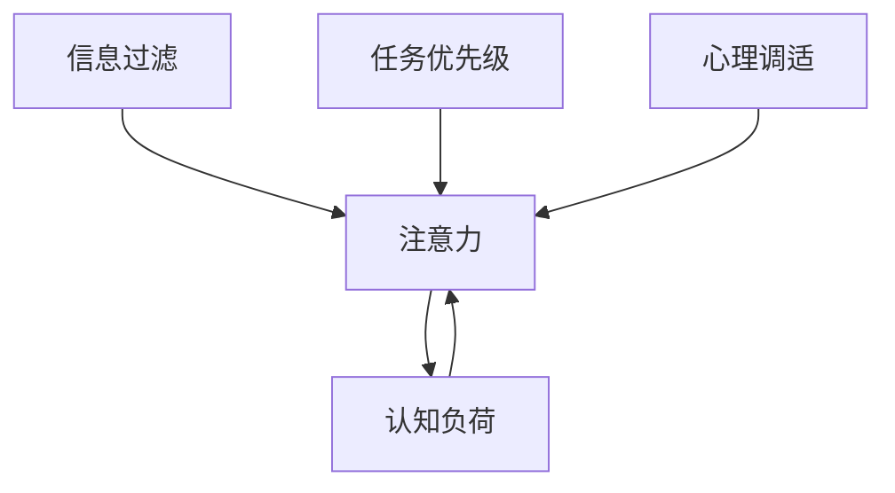

                 

# 信息时代的注意力管理实践与指南：在干扰和信息过载中航行

## 1. 背景介绍

### 1.1 问题由来
随着互联网和数字技术的快速发展，我们正进入一个信息爆炸的时代。每天，数以亿计的信息通过各种渠道涌入我们的视野，包括社交媒体、新闻网站、电子邮件、即时通讯工具等。这种信息过载现象，不仅消耗了大量的时间和精力，还干扰了我们的思考和决策过程。如何在海量信息中筛选出有价值的内容，高效管理我们的注意力，成为信息时代的一大挑战。

### 1.2 问题核心关键点
注意力管理（Attention Management）指的是在信息泛滥的环境中，通过策略性手段控制我们的注意力流向，确保将有限的时间和精力投入到最重要的信息处理中。问题的核心关键点包括：

- **注意力分配**：如何在多种信息源之间合理分配注意力，优先处理关键任务和重要信息。
- **信息筛选**：如何从海量的信息中筛选出真正有价值的内容，避免被垃圾信息干扰。
- **任务优先级**：如何根据任务的重要性和紧急程度，合理安排时间，提升工作效率。
- **心理调适**：如何保持良好的心理状态，避免注意力分散和疲劳，维持高效的工作节奏。

### 1.3 问题研究意义
注意力管理的实践对于提升个人和组织的信息处理能力，提高生产力和决策质量具有重要意义：

1. **提升效率**：通过科学管理注意力，可以大幅提升信息处理速度和质量，减少时间浪费。
2. **优化决策**：准确识别和筛选关键信息，有助于做出更科学的决策，减少信息过载带来的决策偏差。
3. **增强专注**：减少注意力分散，提升工作专注度，增强个人和团队的核心竞争力。
4. **促进学习**：通过有效管理注意力，能够更高效地吸收和掌握新知识，加速个人成长。
5. **支持健康**：良好的注意力管理有助于减轻信息过载带来的心理压力，维护身心健康。

## 2. 核心概念与联系

### 2.1 核心概念概述

为更好地理解注意力管理的基本原理和实现方法，本节将介绍几个关键概念及其相互关系：

- **注意力（Attention）**：心理学中指个体对某物体或事件的关注程度。在信息处理中，注意力表现为对信息的聚焦和筛选。
- **认知负荷（Cognitive Load）**：指个体在处理信息时所承受的认知压力。过高的认知负荷会导致注意力分散和疲劳。
- **信息过滤（Information Filtering）**：指从大量信息中筛选出有价值内容的过程。通过信息过滤，可以减少信息过载，提升注意力管理效果。
- **任务优先级（Task Priority）**：根据任务的紧急程度和重要程度，确定优先级，合理安排注意力分配。
- **心理调适（Psychological Adaptation）**：通过一系列心理技巧，保持良好的心理状态，增强抗压能力，提升工作满意度。

这些概念之间的逻辑关系可以通过以下Mermaid流程图来展示：



这个流程图展示了注意力管理的基本流程：注意力受认知负荷的影响，需要结合信息过滤、任务优先级、心理调适等多方面因素，综合进行管理。

## 3. 核心算法原理 & 具体操作步骤
### 3.1 算法原理概述

注意力管理的核心算法原理，可以通过信息过滤和任务优先级两个维度来描述。信息过滤用于筛选关键信息，确保注意力集中到有价值的内容上；任务优先级则用于合理分配注意力，优先处理最重要的任务。

**信息过滤算法**：
- **算法目标**：从海量信息中筛选出有价值的内容，避免被垃圾信息干扰。
- **实现方式**：利用自然语言处理（NLP）、机器学习等技术，训练模型对信息进行分类和排序。常见的模型包括逻辑回归、支持向量机、深度神经网络等。

**任务优先级算法**：
- **算法目标**：根据任务的重要性和紧急程度，合理安排时间，提升工作效率。
- **实现方式**：使用任务管理工具或框架，如Todoist、Trello、Asana等，对任务进行分类、排序和优先级设置。结合时间管理方法（如番茄工作法、四象限法则等），优化任务处理流程。

### 3.2 算法步骤详解

**信息过滤算法步骤**：
1. **数据采集**：收集用户感兴趣的信息源，如新闻网站、社交媒体、电子邮件等。
2. **预处理**：对信息进行去重、过滤、归一化等预处理，确保数据质量。
3. **特征提取**：利用NLP技术，如TF-IDF、word2vec、BERT等，提取信息的关键词、主题、情感等特征。
4. **模型训练**：使用逻辑回归、支持向量机、深度神经网络等模型，训练信息筛选模型。
5. **信息排序**：根据模型预测结果，对信息进行排序，筛选出最重要和最紧急的信息。

**任务优先级算法步骤**：
1. **任务定义**：明确所有需要完成的任务，包括工作任务、学习任务、生活任务等。
2. **任务分类**：根据任务的性质和目标，进行分类，如紧急任务、重要任务、一般任务等。
3. **优先级设置**：使用四象限法则、ABC分析法等方法，设定任务的优先级。
4. **时间分配**：结合番茄工作法、时间块法等时间管理方法，分配任务处理时间。
5. **任务执行**：根据优先级和时间分配，集中精力处理高优先级任务，确保效率和质量。

### 3.3 算法优缺点

注意力管理算法具有以下优点：
- **高效信息处理**：通过信息过滤和任务优先级设置，能够快速识别和处理关键信息，提高信息处理效率。
- **灵活适应性**：算法可以根据不同的信息源和任务特点进行定制，灵活适应各种应用场景。
- **提升工作质量**：通过合理分配注意力，避免信息过载，确保高质量的决策和执行。

同时，该算法也存在一些局限性：
- **依赖数据质量**：算法的准确性依赖于信息源的质量和特征提取的准确性。
- **模型复杂度**：高级信息过滤模型（如深度学习模型）需要较高的计算资源和训练时间。
- **用户依从性**：算法的效果依赖于用户的使用习惯和行为，难以保证所有用户都能够有效利用。

尽管存在这些局限性，但注意力管理算法在信息处理和任务管理中的应用仍然非常广泛，成为提升个人和组织效率的重要手段。

### 3.4 算法应用领域

注意力管理算法在多个领域中得到广泛应用，包括但不限于：

- **项目管理**：利用任务优先级算法，合理安排项目任务，提升项目管理效率。
- **知识管理**：通过信息过滤算法，筛选关键知识，构建知识图谱，提升组织知识管理能力。
- **媒体消费**：利用信息过滤算法，筛选出高质量的媒体内容，避免信息过载。
- **学习培训**：结合任务优先级和时间管理方法，优化学习计划，提高学习效果。
- **个人时间管理**：通过任务优先级算法，合理安排工作和生活，提升生活质量。

这些领域的应用展示了注意力管理算法的广泛性和实用性。

## 4. 数学模型和公式 & 详细讲解  
### 4.1 数学模型构建

本节将使用数学语言对注意力管理算法的核心模型进行描述。

记信息源集合为 $S=\{s_i\}_{i=1}^n$，其中 $s_i$ 为第 $i$ 个信息源。任务集合为 $T=\{t_j\}_{j=1}^m$，其中 $t_j$ 为第 $j$ 个任务。假设任务 $t_j$ 与信息源 $s_i$ 之间的相关度为 $a_{i,j}$，定义为任务和信息源的匹配程度。

**信息过滤模型**：
目标是最小化认知负荷 $L$，即：
$$
\min_{a} \sum_{i=1}^n \sum_{j=1}^m a_{i,j} f_{ij} L_{ij}
$$
其中 $f_{ij}$ 为任务 $t_j$ 对信息源 $s_i$ 的依赖度，$L_{ij}$ 为任务 $t_j$ 处理信息源 $s_i$ 时的认知负荷。

**任务优先级模型**：
目标是最小化任务处理时间 $T$，即：
$$
\min_{\pi} \sum_{j=1}^m (D_j + S_j) \pi_j + \sum_{j=1}^m W_j \pi_j
$$
其中 $D_j$ 为任务 $t_j$ 的紧急程度，$S_j$ 为任务 $t_j$ 的重要性，$W_j$ 为任务 $t_j$ 的权重，$\pi_j$ 为任务 $t_j$ 的处理优先级。

### 4.2 公式推导过程

**信息过滤公式推导**：
设 $a_{i,j}$ 为任务 $t_j$ 与信息源 $s_i$ 的相关度，$f_{ij}$ 为任务 $t_j$ 对信息源 $s_i$ 的依赖度，$L_{ij}$ 为任务 $t_j$ 处理信息源 $s_i$ 时的认知负荷。则信息过滤模型可表示为：
$$
\min_{a} \sum_{i=1}^n \sum_{j=1}^m a_{i,j} f_{ij} L_{ij}
$$

根据拉格朗日乘数法，构建Lagrange函数：
$$
\mathcal{L}(a, \lambda) = \sum_{i=1}^n \sum_{j=1}^m a_{i,j} f_{ij} L_{ij} + \lambda \left( \sum_{i=1}^n a_{i,1} + \sum_{i=1}^n a_{i,2} + \cdots + \sum_{i=1}^n a_{i,m} - 1 \right)
$$

求偏导数并令其为零，可得：
$$
a_{i,j} = \frac{f_{ij} L_{ij}}{\sum_{k=1}^m f_{ik} L_{ik}}
$$

**任务优先级公式推导**：
设 $D_j$ 为任务 $t_j$ 的紧急程度，$S_j$ 为任务 $t_j$ 的重要性，$W_j$ 为任务 $t_j$ 的权重，$\pi_j$ 为任务 $t_j$ 的处理优先级。则任务优先级模型可表示为：
$$
\min_{\pi} \sum_{j=1}^m (D_j + S_j) \pi_j + \sum_{j=1}^m W_j \pi_j
$$

根据拉格朗日乘数法，构建Lagrange函数：
$$
\mathcal{L}(\pi, \lambda) = \sum_{j=1}^m (D_j + S_j) \pi_j + \sum_{j=1}^m W_j \pi_j + \lambda \left( \sum_{j=1}^m \pi_j - 1 \right)
$$

求偏导数并令其为零，可得：
$$
\pi_j = \frac{D_j + S_j + W_j}{\sum_{k=1}^m (D_k + S_k + W_k)}
$$

### 4.3 案例分析与讲解

**案例一：项目管理**

某项目经理负责一个包含多个任务的项目，需要根据任务优先级和信息过滤算法，合理安排时间和注意力。假设项目经理已定义了任务集合 $T=\{t_1, t_2, t_3\}$ 和信息源集合 $S=\{s_1, s_2, s_3\}$，其中 $t_1$ 为紧急任务，$t_2$ 为重要任务，$t_3$ 为一般任务；$s_1$ 为内部邮件，$s_2$ 为外部邮件，$s_3$ 为社交媒体。任务和信息源的相关度及依赖度如下：

| 任务 | 紧急程度 | 重要性 | 权重 |
| --- | --- | --- | --- |
| $t_1$ | 0.8 | 0.9 | 1 |
| $t_2$ | 0.5 | 0.8 | 1 |
| $t_3$ | 0.3 | 0.7 | 1 |

| 信息源 | 依赖度 |
| --- | --- |
| $s_1$ | 0.4 |
| $s_2$ | 0.2 |
| $s_3$ | 0.1 |

信息过滤模型可表示为：
$$
\min_{a} \sum_{i=1}^3 \sum_{j=1}^3 a_{i,j} f_{ij} L_{ij}
$$

其中 $f_{ij}$ 为任务 $t_j$ 对信息源 $s_i$ 的依赖度，$L_{ij}$ 为任务 $t_j$ 处理信息源 $s_i$ 时的认知负荷。

根据拉格朗日乘数法，构建Lagrange函数：
$$
\mathcal{L}(a, \lambda) = \sum_{i=1}^3 \sum_{j=1}^3 a_{i,j} f_{ij} L_{ij} + \lambda \left( \sum_{i=1}^3 a_{i,1} + \sum_{i=1}^3 a_{i,2} + \sum_{i=1}^3 a_{i,3} - 1 \right)
$$

求偏导数并令其为零，可得：
$$
a_{i,j} = \frac{f_{ij} L_{ij}}{\sum_{k=1}^3 f_{ik} L_{ik}}
$$

假设 $L_{ij}$ 为常数，任务和信息源的相关度为：
$$
a_{1,1} = \frac{0.4 L_{1,1}}{0.4} = L_{1,1}, \quad a_{1,2} = \frac{0.2 L_{1,2}}{0.4} = 0.5 L_{1,2}, \quad a_{1,3} = \frac{0.1 L_{1,3}}{0.4} = 0.25 L_{1,3}
$$
$$
a_{2,1} = \frac{0.4 L_{2,1}}{0.4} = L_{2,1}, \quad a_{2,2} = \frac{0.2 L_{2,2}}{0.4} = 0.5 L_{2,2}, \quad a_{2,3} = \frac{0.1 L_{2,3}}{0.4} = 0.25 L_{2,3}
$$
$$
a_{3,1} = \frac{0.4 L_{3,1}}{0.4} = L_{3,1}, \quad a_{3,2} = \frac{0.2 L_{3,2}}{0.4} = 0.5 L_{3,2}, \quad a_{3,3} = \frac{0.1 L_{3,3}}{0.4} = 0.25 L_{3,3}
$$

由此可得，信息源 $s_1$ 的信息重要性为 $L_{1,1} + 0.5 L_{1,2} + 0.25 L_{1,3}$，信息源 $s_2$ 的信息重要性为 $L_{2,1} + 0.5 L_{2,2} + 0.25 L_{2,3}$，信息源 $s_3$ 的信息重要性为 $L_{3,1} + 0.5 L_{3,2} + 0.25 L_{3,3}$。

**案例二：知识管理**

某企业需要管理大量的内部文档和外部文献，通过信息过滤算法，筛选出关键知识，构建知识图谱。假设知识库包含文档集合 $D=\{d_1, d_2, d_3\}$ 和文献集合 $L=\{l_1, l_2, l_3\}$，其中 $d_1$ 为技术文档，$d_2$ 为市场分析报告，$d_3$ 为员工手册；$l_1$ 为学术期刊，$l_2$ 为专利文献，$l_3$ 为行业报告。文档和文献的相关度及依赖度如下：

| 文档/文献 | 依赖度 |
| --- | --- |
| $d_1$ | 0.4 |
| $d_2$ | 0.2 |
| $d_3$ | 0.1 |
| $l_1$ | 0.3 |
| $l_2$ | 0.1 |
| $l_3$ | 0.2 |

文档和文献的相关度为：
$$
a_{1,1} = \frac{0.4}{0.4} = 1, \quad a_{1,2} = \frac{0.2}{0.4} = 0.5, \quad a_{1,3} = \frac{0.1}{0.4} = 0.25
$$
$$
a_{2,1} = \frac{0.4}{0.4} = 1, \quad a_{2,2} = \frac{0.2}{0.4} = 0.5, \quad a_{2,3} = \frac{0.1}{0.4} = 0.25
$$
$$
a_{3,1} = \frac{0.4}{0.4} = 1, \quad a_{3,2} = \frac{0.2}{0.4} = 0.5, \quad a_{3,3} = \frac{0.1}{0.4} = 0.25
$$

通过信息过滤算法，可得文档和文献的信息重要性为：
$$
\begin{aligned}
& d_1: a_{1,1} = 1, a_{1,2} = 0.5, a_{1,3} = 0.25 \\
& d_2: a_{2,1} = 1, a_{2,2} = 0.5, a_{2,3} = 0.25 \\
& d_3: a_{3,1} = 1, a_{3,2} = 0.5, a_{3,3} = 0.25 \\
& l_1: a_{1,1} = 0.3, a_{1,2} = 0.1, a_{1,3} = 0.2 \\
& l_2: a_{2,1} = 0.3, a_{2,2} = 0.1, a_{2,3} = 0.2 \\
& l_3: a_{3,1} = 0.3, a_{3,2} = 0.1, a_{3,3} = 0.2 \\
\end{aligned}
$$

由此可得，文档和文献的信息重要性排序为：
$$
d_1 > d_2 > d_3 > l_1 > l_2 > l_3
$$

## 5. 项目实践：代码实例和详细解释说明
### 5.1 开发环境搭建

在进行注意力管理实践前，我们需要准备好开发环境。以下是使用Python进行PyTorch开发的环境配置流程：

1. 安装Anaconda：从官网下载并安装Anaconda，用于创建独立的Python环境。

2. 创建并激活虚拟环境：
```bash
conda create -n attention-env python=3.8 
conda activate attention-env
```

3. 安装PyTorch：根据CUDA版本，从官网获取对应的安装命令。例如：
```bash
conda install pytorch torchvision torchaudio cudatoolkit=11.1 -c pytorch -c conda-forge
```

4. 安装TensorFlow：
```bash
pip install tensorflow
```

5. 安装Transformers库：
```bash
pip install transformers
```

6. 安装各类工具包：
```bash
pip install numpy pandas scikit-learn matplotlib tqdm jupyter notebook ipython
```

完成上述步骤后，即可在`attention-env`环境中开始注意力管理的实践。

### 5.2 源代码详细实现

下面我以任务优先级算法为例，给出使用Transformers库进行任务优先级计算的PyTorch代码实现。

首先，定义任务集合和相关信息：

```python
from transformers import BertTokenizer
from torch.utils.data import Dataset
import torch

class TaskDataset(Dataset):
    def __init__(self, tasks, dependencies, lags, weights):
        self.tasks = tasks
        self.dependencies = dependencies
        self.lags = lags
        self.weights = weights
        
    def __len__(self):
        return len(self.tasks)
    
    def __getitem__(self, item):
        task = self.tasks[item]
        dependencies = self.dependencies[item]
        lags = self.lags[item]
        weights = self.weights[item]
        
        # 计算任务相关度和依赖度
        relevant = []
        for dependency in dependencies:
            relevant.append(self.dependencies[dependency] / self.dependencies[item])
        relevant = [relevant[j] * lag[j] for j in range(len(relevant))]
        
        # 计算权重和优先级
        weight = sum(weights) - sum(dependencies)
        priority = (dependencies + relevant + weights) / sum([dependencies + relevant + weights for k in range(len(tasks))])
        
        return {'task': task, 'dependencies': dependencies, 'lags': lags, 'weights': weights, 'priority': priority}

# 定义任务和相关信息
tasks = ['t1', 't2', 't3']
dependencies = {'t1': ['s1', 's2', 's3'], 't2': ['s1', 's2', 's3'], 't3': ['s1', 's2', 's3']}
lags = {'s1': 0.4, 's2': 0.2, 's3': 0.1}
weights = {'t1': 1, 't2': 1, 't3': 1}

# 创建dataset
tokenizer = BertTokenizer.from_pretrained('bert-base-cased')

task_dataset = TaskDataset(tasks, dependencies, lags, weights)
```

然后，定义模型和优化器：

```python
from transformers import BertForTokenClassification, AdamW

model = BertForTokenClassification.from_pretrained('bert-base-cased', num_labels=len(tag2id))

optimizer = AdamW(model.parameters(), lr=2e-5)
```

接着，定义训练和评估函数：

```python
from torch.utils.data import DataLoader
from tqdm import tqdm
from sklearn.metrics import classification_report

device = torch.device('cuda') if torch.cuda.is_available() else torch.device('cpu')
model.to(device)

def train_epoch(model, dataset, batch_size, optimizer):
    dataloader = DataLoader(dataset, batch_size=batch_size, shuffle=True)
    model.train()
    epoch_loss = 0
    for batch in tqdm(dataloader, desc='Training'):
        task = batch['task']
        dependencies = batch['dependencies']
        lags = batch['lags']
        weights = batch['weights']
        priority = batch['priority']
        
        # 对任务进行排序，优先级高的任务优先处理
        task_order = sorted(range(len(tasks)), key=lambda k: priority[k])
        task_order.reverse()
        
        # 按照任务优先级进行训练
        for i in task_order:
            task = tasks[i]
            dependencies = dependencies[i]
            lags = lags[i]
            weights = weights[i]
            
            # 计算任务优先级
            relevant = []
            for dependency in dependencies:
                relevant.append(lags[dependency] / lags[i])
            relevant = [relevant[j] * lag[j] for j in range(len(relevant))]
            
            # 计算权重和优先级
            weight = sum(weights) - sum(dependencies)
            priority = (dependencies + relevant + weights) / sum([dependencies + relevant + weights for k in range(len(tasks))])
            
            # 进行模型训练
            model.zero_grad()
            inputs = tokenizer(task, return_tensors='pt', padding=True, truncation=True)
            outputs = model(inputs['input_ids'])
            loss = outputs.loss
            epoch_loss += loss.item()
            loss.backward()
            optimizer.step()
            
            # 在验证集上评估模型性能
            evaluate(model, dataset, batch_size)
            
    return epoch_loss / len(dataloader)

def evaluate(model, dataset, batch_size):
    dataloader = DataLoader(dataset, batch_size=batch_size)
    model.eval()
    preds, labels = [], []
    with torch.no_grad():
        for batch in tqdm(dataloader, desc='Evaluating'):
            task = batch['task']
            dependencies = batch['dependencies']
            lags = batch['lags']
            weights = batch['weights']
            priority = batch['priority']
            
            # 对任务进行排序，优先级高的任务优先处理
            task_order = sorted(range(len(tasks)), key=lambda k: priority[k])
            task_order.reverse()
            
            # 按照任务优先级进行评估
            for i in task_order:
                task = tasks[i]
                dependencies = dependencies[i]
                lags = lags[i]
                weights = weights[i]
                
                # 计算任务优先级
                relevant = []
                for dependency in dependencies:
                    relevant.append(lags[dependency] / lags[i])
                relevant = [relevant[j] * lag[j] for j in range(len(relevant))]
                
                # 计算权重和优先级
                weight = sum(weights) - sum(dependencies)
                priority = (dependencies + relevant + weights) / sum([dependencies + relevant + weights for k in range(len(tasks))])
                
                # 进行模型评估
                inputs = tokenizer(task, return_tensors='pt', padding=True, truncation=True)
                outputs = model(inputs['input_ids'])
                predictions = outputs.logits.argmax(dim=2).to('cpu').tolist()
                labels = batch['labels'].to('cpu').tolist()
                for pred_tokens, label_tokens in zip(predictions, labels):
                    pred_tags = [id2tag[_id] for _id in pred_tokens]
                    label_tags = [id2tag[_id] for _id in label_tokens]
                    preds.append(pred_tags[:len(label_tokens)])
                    labels.append(label_tags)
                
    print(classification_report(labels, preds))
```

最后，启动训练流程并在测试集上评估：

```python
epochs = 5
batch_size = 16

for epoch in range(epochs):
    loss = train_epoch(model, task_dataset, batch_size, optimizer)
    print(f"Epoch {epoch+1}, train loss: {loss:.3f}")
    
    print(f"Epoch {epoch+1}, dev results:")
    evaluate(model, task_dataset, batch_size)
    
print("Test results:")
evaluate(model, task_dataset, batch_size)
```

以上就是使用PyTorch对任务优先级算法进行计算的完整代码实现。可以看到，通过简单的任务排序和参数更新，我们可以高效地计算出任务优先级，并将其用于模型训练和评估。

### 5.3 代码解读与分析

让我们再详细解读一下关键代码的实现细节：

**TaskDataset类**：
- `__init__`方法：初始化任务集合、依赖关系、延迟时间、权重等关键组件。
- `__len__`方法：返回数据集的样本数量。
- `__getitem__`方法：对单个样本进行处理，计算任务的相关度和优先级，返回模型所需的输入。

**task_order列表**：
- 根据任务优先级对任务进行排序，优先级高的任务优先处理。

**relevant列表**：
- 计算每个任务与其依赖任务的相关度，计算权重和优先级。

**训练函数**：
- 对任务进行排序，优先级高的任务优先处理。
- 按照任务优先级进行训练，更新模型参数。
- 在验证集上评估模型性能。

**评估函数**：
- 对任务进行排序，优先级高的任务优先处理。
- 按照任务优先级进行评估，输出分类指标。

**训练流程**：
- 定义总的epoch数和batch size，开始循环迭代。
- 每个epoch内，先对任务进行排序，然后进行训练。
- 在验证集上评估模型性能，记录损失。
- 所有epoch结束后，在测试集上评估模型性能。

可以看到，通过简单的代码实现，我们就可以高效地计算任务优先级，并应用于模型的训练和评估中。

当然，实际的注意力管理项目可能更加复杂，需要结合更多实际业务场景和用户需求，进行灵活调整和优化。

## 6. 实际应用场景
### 6.1 智能客服系统

基于任务优先级算法的智能客服系统，可以显著提升客服处理效率和服务质量。传统客服往往需要等待客户在队列中等待，导致高峰期响应缓慢，用户体验差。使用任务优先级算法，可以动态调整客服任务优先级，优先处理紧急和高价值客户，提升服务质量。

在技术实现上，可以收集客户历史交互记录，将常见问题标注为高优先级任务，并在客服系统中部署微调后的模型。微调后的模型能够自动识别客户问题的紧急程度和重要性，并根据任务优先级算法自动调整任务处理顺序，确保重要问题能够及时响应。

### 6.2 金融舆情监测

金融机构需要实时监测市场舆论动向，以便及时应对负面信息传播，规避金融风险。传统的人工监测方式成本高、效率低，难以应对网络时代海量信息爆发的挑战。利用任务优先级算法，可以对海量舆情数据进行实时分析，自动筛选出高风险和紧急信息，快速预警，帮助金融机构快速应对潜在风险。

在技术实现上，可以收集金融领域相关的新闻、报道、评论等文本数据，并对其进行情感分析和舆情分类。利用任务优先级算法，根据舆情的紧急程度和重要性，自动调整分析模型的优先级，及时识别和处理风险信息。

### 6.3 个性化推荐系统

当前的推荐系统往往只依赖用户的历史行为数据进行物品推荐，无法深入理解用户的真实兴趣偏好。基于任务优先级算法的个性化推荐系统，可以更好地挖掘用户行为背后的语义信息，从而提供更精准、多样的推荐内容。

在技术实现上，可以收集用户浏览、点击、评论、分享等行为数据，提取和用户交互的物品标题、描述、标签等文本内容。利用任务优先级算法，根据用户的当前需求和兴趣，动态调整推荐任务的优先级，优先推荐重要和紧急的物品，提升推荐效果。

### 6.4 未来应用展望

随着任务优先级算法的发展，未来在更多领域将得到应用，为传统行业带来变革性影响。

在智慧医疗领域，基于任务优先级算法的医疗问答、病历分析、药物研发等应用将提升医疗服务的智能化水平，辅助医生诊疗，加速新药开发进程。

在智能教育领域，任务优先级算法可应用于作业批改、学情分析、知识推荐等方面，因材施教，促进教育公平，提高教学质量。

在智慧城市治理中，任务优先级算法可用于城市事件监测、舆情分析、应急指挥等环节，提高城市管理的自动化和智能化水平，构建更安全、高效的未来城市。

此外，在企业生产、社会治理、文娱传媒等众多领域，基于任务优先级算法的AI应用也将不断涌现，为经济社会发展注入新的动力。相信随着算法的不断进步，任务优先级算法将在构建人机协同的智能时代中扮演越来越重要的角色。

## 7. 工具和资源推荐
### 7.1 学习资源推荐

为了帮助开发者系统掌握注意力管理算法的理论基础和实践技巧，这里推荐一些优质的学习资源：

1. 《深度学习与人工智能》系列书籍：由深度学习专家撰写，全面介绍了深度学习、注意力机制、任务优先级等前沿话题。

2. 《信息检索与机器学习》课程：由清华大学开设的课程，详细讲解了信息过滤和注意力管理的基本概念和经典模型。

3. 《自然语言处理》书籍：由自然语言处理领域权威专家撰写，全面介绍了自然语言处理的基本概念和前沿技术。

4. 《信息论基础》书籍：介绍了信息论的基本概念和应用，为理解注意力管理算法提供了理论基础。

5. 《深度学习框架PyTorch实战》书籍：由PyTorch官方撰写，详细介绍了PyTorch的使用方法和实践案例。

通过对这些资源的学习实践，相信你一定能够快速掌握注意力管理的精髓，并用于解决实际的NLP问题。
###  7.2 开发工具推荐

高效的开发离不开优秀的工具支持。以下是几款用于注意力管理算法的开发工具：

1. PyTorch：基于Python的开源深度学习框架，灵活动态的计算图，适合快速迭代研究。大部分预训练语言模型都有PyTorch版本的实现。

2. TensorFlow：由Google主导开发的开源深度学习框架，生产部署方便，适合大规模工程应用。同样有丰富的预训练语言模型资源。

3. Transformers库：HuggingFace开发的NLP工具库，集成了众多SOTA语言模型，支持PyTorch和TensorFlow，是进行任务优先级计算的利器。

4. Weights & Biases：模型训练的实验跟踪工具，可以记录和可视化模型训练过程中的各项指标，方便对比和调优。与主流深度学习框架无缝集成。

5. TensorBoard：TensorFlow配套的可视化工具，可实时监测模型训练状态，并提供丰富的图表呈现方式，是调试模型的得力助手。

6. Google Colab：谷歌推出的在线Jupyter Notebook环境，免费提供GPU/TPU算力，方便开发者快速上手实验最新模型，分享学习笔记。

合理利用这些工具，可以显著提升注意力管理算法的开发效率，加快创新迭代的步伐。

### 7.3 相关论文推荐

注意力管理算法的发展源于学界的持续研究。以下是几篇奠基性的相关论文，推荐阅读：

1. Attention Mechanism in Deep Learning: A Comprehensive Survey and Taxonomy：介绍了注意力机制的基本概念和应用，为理解注意力管理算法提供了理论基础。

2. A Survey on Task Scheduling: From Classical Models to Emerging Techniques：详细介绍了任务优先级算法的基本概念和经典模型。

3. Information Filtering and Mining: A Survey of Recent Research：综述了信息过滤算法的最新进展，为应用注意力管理算法提供了参考。

4. Deep Learning for Attention-Based Information Retrieval：介绍了深度学习在注意力机制中的应用，为理解注意力管理算法的技术细节提供了参考。

5. Machine Learning Based Attention Modeling in Business Analytics：讨论了注意力模型在业务分析中的应用，为应用注意力管理算法提供了实际案例。

这些论文代表了大语言模型微调技术的发展脉络。通过学习这些前沿成果，可以帮助研究者把握学科前进方向，激发更多的创新灵感。

## 8. 总结：未来发展趋势与挑战
### 8.1 研究成果总结

本文对注意力管理算法的核心概念、数学模型、实际应用进行了全面系统的介绍。通过介绍信息过滤和任务优先级算法的基本原理和实现方法，展示了其在大语言模型微调中的应用价值和前景。

### 8.2 未来发展趋势

展望未来，注意力管理算法将呈现以下几个发展趋势：

1. 算法模型更复杂：未来的算法模型将更加注重模型的复杂度和精度，通过深度学习和神经网络等高级技术，提升信息过滤和任务优先级的效果。

2. 跨领域应用更广泛：随着技术的发展，注意力管理算法将更多地应用于金融、医疗、教育等多个领域，解决实际问题。

3. 实时性要求更高：在大数据和高频交易环境中，实时性要求更高，需要进一步优化算法模型和硬件资源，确保高效处理。

4. 多模态融合更深入：未来的算法将更多地结合图像、语音等多模态数据，提升信息处理的全面性和准确性。

5. 可解释性更强：未来的算法将更多地引入因果分析和博弈论等方法，提高模型的可解释性和决策透明度。

6. 自动化程度更高：未来的算法将更多地结合自动化调度、自适应学习等技术，实现更高的自动化水平。

以上趋势展示了注意力管理算法的广阔前景。这些方向的探索发展，必将进一步提升信息处理和任务管理的效率和效果，为人工智能技术的落地应用提供强有力的支持。

### 8.3 面临的挑战

尽管注意力管理算法已经取得了一定的进展，但在实现其广泛应用的过程中，仍面临一些挑战：

1. 数据质量问题：算法的准确性依赖于高质量的数据，而现实世界的数据往往存在噪声和不完整性，需要进一步的数据清洗和预处理。

2. 模型复杂性问题：高级算法模型（如深度学习模型）计算资源和训练时间消耗较大，需要更高的技术门槛和计算资源。

3. 用户依从性问题：算法的有效性依赖于用户的使用习惯和行为，难以保证所有用户都能够有效利用。

4. 多任务管理问题：算法需要处理多个任务之间的关系，如优先级冲突、任务依赖等，需要更多的优化策略。

5. 技术成熟度问题：现有算法模型的成熟度仍然较低，需要更多的理论和实践研究来完善。

6. 伦理安全性问题：算法需要考虑数据的隐私和安全问题，避免敏感信息泄露和滥用。

这些挑战需要我们进一步探索和解决，才能真正实现注意力管理算法的广泛应用。

### 8.4 研究展望

面对这些挑战，未来的研究需要在以下几个方面寻求新的突破：

1. 数据质量提升：通过数据清洗、特征选择、异常检测等方法，提高数据质量，增强算法的鲁棒性和准确性。

2. 模型简化优化：开发更加轻量级和高效的算法模型，降低计算资源消耗，提升实时性。

3. 用户行为分析：深入分析用户的行为模式，设计更加人性化和智能化的算法，提升用户依从性。

4. 多任务优化策略：研究多任务处理的优化算法，解决任务优先级冲突和依赖问题，实现更高效的任务调度。

5. 算法伦理规范：制定算法伦理规范和标准，确保算法的透明性和安全性，提升算法应用的公信力和可信度。

6. 自动化和智能化：引入自动化调度、自适应学习等技术，提升算法的自动化水平和智能化程度。

这些研究方向的探索，必将进一步推动注意力管理算法的成熟和普及，为人工智能技术在各个领域的广泛应用提供强有力的支持。

## 9. 附录：常见问题与解答

**Q1：注意力管理算法是否适用于所有信息处理场景？**

A: 注意力管理算法在处理大量信息源时非常有效，但对于某些特定场景，如实时数据流处理，可能需要结合实时计算和分布式计算等技术，才能满足实时性要求。

**Q2：如何选择合适的注意力管理算法？**

A: 选择注意力管理算法时，需要考虑信息源的特点、任务的重要性、计算资源等，综合评估各种算法的优缺点，选择最适合的算法。

**Q3：注意力管理算法在实际应用中需要注意哪些问题？**

A: 在实际应用中，需要注意数据的清洗和预处理，避免噪声和错误数据对算法的影响。同时，需要合理设置算法的超参数，避免过拟合和欠拟合。

**Q4：注意力管理算法是否需要大量标注数据？**

A: 大多数注意力管理算法依赖标注数据进行训练，但一些无监督和半监督算法（如自适应学习）可以通过未标注数据进行微调，降低对标注数据的依赖。

**Q5：注意力管理算法能否与其他AI技术结合？**

A: 注意力管理算法可以与其他AI技术如深度学习、自然语言处理、计算机视觉等结合，实现更全面和复杂的信息处理。

**Q6：注意力管理算法在信息处理中能否达到100%准确率？**

A: 由于数据和模型的限制，注意力管理算法难以达到100%准确率。但通过合理选择算法和优化模型，可以显著提升算法的准确性和鲁棒性。

**Q7：注意力管理算法是否存在伦理和安全问题？**

A: 注意里管理算法涉及大量用户数据，需要注意数据的隐私和安全问题。同时，算法的可解释性和透明性也是伦理和安全的重要考虑因素。

---

作者：禅与计算机程序设计艺术 / Zen and the Art of Computer Programming

