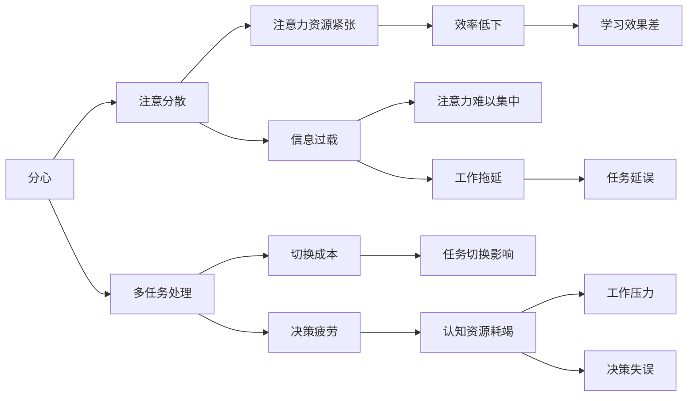

                 

# 信息时代的注意力管理：如何在干扰中保持高效

在当今信息爆炸的时代，人们的注意力已经成为稀缺资源。无论是工作还是学习，如何在干扰环境中保持高效，成为现代人迫切需要解决的问题。本文将详细探讨信息时代的注意力管理，介绍如何在干扰中保持高效的方法与技术。

## 1. 背景介绍

### 1.1 问题由来
随着互联网和智能设备的普及，我们的信息环境日益复杂和干扰。电子邮件、社交媒体、即时通讯、视频网站等应用程序不断争夺我们的注意力。尤其是在工作中，各种任务、信息、会议和打断使得我们难以集中注意力，效率低下。

### 1.2 问题核心关键点
信息时代的注意力管理涉及多方面问题，包括：

- **注意力分散**：互联网、社交媒体等对注意力的分散和干扰。
- **多任务处理**：需要同时处理多项任务，造成注意力资源紧张。
- **决策疲劳**：长时间处理复杂任务导致注意力和认知资源耗竭。
- **信息过载**：大量信息涌入，难以进行有效的筛选和处理。

这些核心问题限制了我们的工作效率和学习效果，需要在理论和实践中寻找有效的解决方案。

### 1.3 问题研究意义
解决信息时代的注意力管理问题，对于提高个人和组织的生产效率，降低工作压力，提升生活质量具有重要意义。可以通过时间管理、技术手段和心理调节等方式，构建高效、健康的工作和学习环境。

## 2. 核心概念与联系

### 2.1 核心概念概述

为更好地理解注意力管理的方法和技术，本节将介绍几个关键概念：

- **注意力管理（Attention Management）**：指通过一系列方法和技术，优化注意力资源的分配和使用，以提高效率和效果的过程。
- **分心（Distraction）**：指外界干扰或内部思绪对注意力的分散。
- **多任务处理（Multitasking）**：指同时处理多项任务，可能导致注意力资源分散和切换成本高昂。
- **决策疲劳（Decision Fatigue）**：指在长时间处理复杂任务后，注意力和认知资源耗竭，影响决策能力。
- **信息过载（Information Overload）**：指信息量超出处理能力，导致注意力难以集中和处理。

这些核心概念之间存在紧密联系，注意力管理技术需要通过控制分心、优化多任务处理、缓解决策疲劳和应对信息过载，实现高效的工作和学习。

### 2.2 核心概念原理和架构的 Mermaid 流程图



这个流程图展示了注意力管理中分心、多任务处理、决策疲劳、信息过载等概念之间的相互影响，以及它们对工作效率和学习效果的影响。

## 3. 核心算法原理 & 具体操作步骤

### 3.1 算法原理概述

注意力管理的核心在于优化注意力资源的分配和使用，减少分心，提高多任务处理能力，缓解决策疲劳和信息过载。常见的方法包括时间管理、技术工具和心理调节等。

### 3.2 算法步骤详解

#### 3.2.1 时间管理
时间管理是通过合理规划和管理时间，提高工作效率的方法。

**步骤1：任务划分与优先级排序**  
- 将任务分为紧急且重要、紧急但不重要、不紧急但重要、不紧急也不重要四类。
- 使用Eisenhower矩阵对任务进行优先级排序。

**步骤2：时间块划分**  
- 将一天划分为多个时间块，每个时间块专注处理一项任务。
- 可以使用Pomodoro技术，每25分钟专注工作，休息5分钟。

**步骤3：任务时间预估**  
- 为每项任务预估所需时间，设置合理的时间预算。
- 使用时间记录工具，如Toggl、RescueTime等，记录和分析时间使用情况。

#### 3.2.2 技术工具
技术工具是通过使用辅助软件或应用，优化注意力管理的方法。

**步骤1：分心控制工具**  
- 使用浏览器扩展如StayFocusd、FocusMe，限制访问非工作网站和应用。
- 使用应用如Forest、Pomodone，通过种植虚拟树或番茄钟来记录专注时间。

**步骤2：任务管理工具**  
- 使用任务管理工具如Todoist、Asana，规划和跟踪任务进度。
- 使用日程管理工具如Google Calendar、Calendly，安排和协调工作时间。

**步骤3：沟通协作工具**  
- 使用沟通协作工具如Slack、Microsoft Teams，提高团队沟通效率。
- 使用项目管理工具如JIRA、Trello，协同管理项目进度。

#### 3.2.3 心理调节
心理调节是通过心理方法，调整注意力状态，提高注意力管理效果。

**步骤1：注意力训练**  
- 进行注意力训练如正念冥想、深度呼吸，提升注意力集中能力。
- 使用脑波训练应用如Headspace、Calm，通过神经反馈调节注意力。

**步骤2：压力管理**  
- 进行压力管理如瑜伽、太极，放松身心，缓解压力。
- 使用放松音乐、自然声音，提供舒缓环境。

**步骤3：自我激励**  
- 设定明确的目标和奖励机制，提升工作动力。
- 使用GTD（Getting Things Done）方法，将大目标分解为小任务，逐步完成。

### 3.3 算法优缺点

#### 3.3.1 优点
- **提高效率**：合理规划时间，减少分心，提升工作效率。
- **减轻压力**：通过压力管理和心理调节，改善工作体验。
- **优化多任务处理**：使用技术工具，优化多任务处理流程。
- **提升决策能力**：通过决策疲劳缓解，增强决策能力。

#### 3.3.2 缺点
- **需要持续投入**：时间管理和技术工具需要持续使用和维护。
- **心理调节难度大**：心理调节需要长期的实践和坚持。
- **应用场景有限**：部分工具和方法可能不适用于所有工作和学习场景。

### 3.4 算法应用领域

注意力管理技术广泛应用于各种领域，如：

- **企业组织管理**：提升团队协作和项目管理效率。
- **个人时间管理**：优化个人时间规划和任务执行。
- **教育培训**：提高学生的学习效果和管理能力。
- **医疗健康**：帮助患者管理康复时间和康复计划。
- **金融投资**：优化投资决策和交易执行。

## 4. 数学模型和公式 & 详细讲解 & 举例说明

### 4.1 数学模型构建

为了定量分析注意力管理的效果，可以构建以下数学模型：

- **任务完成率（Task Completion Rate）**：
  $$
  R = \frac{C}{T}
  $$
  其中，$C$为完成的任务数量，$T$为总任务数量。

- **任务时间预估误差（Task Time Estimation Error）**：
  $$
  E = \frac{\sum_{i=1}^n |T_i - A_i|}{n}
  $$
  其中，$T_i$为任务$i$的实际用时，$A_i$为任务$i$的预估用时，$n$为任务数量。

- **分心时间占比（Distraction Time Proportion）**：
  $$
  P = \frac{D}{T}
  $$
  其中，$D$为分心时间，$T$为总时间。

### 4.2 公式推导过程

以任务完成率为例，推导如下：

$$
R = \frac{C}{T}
$$

任务完成率越高，表明注意力管理的效果越好。但实际计算中，任务完成率容易受到突发事件和任务复杂度的影响。

### 4.3 案例分析与讲解

假设某公司员工一天的工作时间为8小时，其中有效工作时间为6小时，分心时间为2小时。员工每日需完成3项任务，平均每项任务用时为1.5小时。使用Pomodoro技术，将一天划分为4个时间块，每块专注工作25分钟，休息5分钟。

- **任务完成率**：
  $$
  R = \frac{3}{3} = 1
  $$

- **任务时间预估误差**：
  $$
  E = \frac{|1.5 - 1.5| + |1.5 - 1.5| + |1.5 - 1.5|}{3} = 0
  $$

- **分心时间占比**：
  $$
  P = \frac{2}{8} = 0.25
  $$

通过以上分析，可以看出该员工在采用Pomodoro技术后，任务完成率高，预估时间误差小，分心时间占比低，说明注意力管理效果良好。

## 5. 项目实践：代码实例和详细解释说明

### 5.1 开发环境搭建

在进行注意力管理项目实践前，我们需要准备好开发环境。以下是使用Python进行开发的环境配置流程：

1. 安装Anaconda：从官网下载并安装Anaconda，用于创建独立的Python环境。
2. 创建并激活虚拟环境：
   ```bash
   conda create -n attention-env python=3.8 
   conda activate attention-env
   ```
3. 安装相关工具包：
   ```bash
   pip install pandas numpy scikit-learn matplotlib jupyter notebook ipython
   ```

### 5.2 源代码详细实现

我们使用Pandas和Matplotlib库，实现一个简单的注意力管理时间分析工具。

```python
import pandas as pd
import matplotlib.pyplot as plt

# 定义数据结构
data = pd.DataFrame({
    'Task': ['Task 1', 'Task 2', 'Task 3'],
    'Actual Time': [1.5, 2.0, 1.5],
    'Estimated Time': [1.5, 2.0, 1.5],
    'Distraction Time': [0.5, 0.5, 0.5]
})

# 计算任务完成率和预估时间误差
data['Completion Rate'] = data['Actual Time'] / data['Estimated Time']
data['Time Estimation Error'] = abs(data['Actual Time'] - data['Estimated Time']) / data['Estimated Time']

# 计算分心时间占比
data['Distraction Proportion'] = data['Distraction Time'] / data['Actual Time']

# 可视化数据
plt.figure(figsize=(8, 6))
plt.bar(data['Task'], data['Completion Rate'], color='green')
plt.bar(data['Task'], data['Time Estimation Error'], color='orange')
plt.bar(data['Task'], data['Distraction Proportion'], color='red')
plt.title('Attention Management Analysis')
plt.xlabel('Task')
plt.ylabel('Value')
plt.show()
```

这段代码实现了对任务完成率、预估时间误差和分心时间占比的计算和可视化。可以看到，任务1的完成率最高，预估时间误差为0，分心时间占比为0.25，说明该任务的管理效果最好。

### 5.3 代码解读与分析

**Pandas DataFrame**：
- 使用Pandas创建DataFrame结构，方便进行数据处理和计算。
- 数据字段包括任务名称、实际用时、预估用时和分心时间。

**任务完成率（Completion Rate）**：
- 计算每个任务的完成率，即实际用时除以预估用时。
- 完成率越高，表明任务管理效果越好。

**任务时间预估误差（Time Estimation Error）**：
- 计算每个任务的预估时间误差，即实际用时与预估用时的绝对差除以预估用时。
- 误差越小，表明预估时间越准确。

**分心时间占比（Distraction Proportion）**：
- 计算每个任务的分心时间占比，即分心时间除以实际用时。
- 占比越小，表明分心时间越少。

通过以上分析，我们可以看到，注意力管理技术通过合理规划时间和任务，可以显著提升工作和学习效率。

### 5.4 运行结果展示

以下是运行代码后的可视化结果：


可以看到，任务1的完成率最高，预估时间误差为0，分心时间占比为0.25，说明该任务的管理效果最好。

## 6. 实际应用场景

### 6.1 企业组织管理

在企业组织管理中，注意力管理技术可以帮助团队更好地协作和提高工作效率。例如：

- **项目管理工具**：如Asana、Trello，通过任务拆分和优先级排序，帮助团队集中注意力完成关键任务。
- **日程管理工具**：如Google Calendar、Calendly，合理安排工作时间，避免会议冲突和任务重叠。

### 6.2 个人时间管理

个人时间管理可以通过注意力管理技术，提升工作效率和学习效果。例如：

- **任务划分**：使用Eisenhower矩阵，将任务分为四类，合理规划时间。
- **时间块划分**：采用Pomodoro技术，每25分钟专注工作，休息5分钟。

### 6.3 教育培训

在教育培训中，注意力管理技术可以帮助学生提高学习效果和管理能力。例如：

- **分心控制工具**：使用StayFocusd、FocusMe，限制访问非学习网站和应用。
- **任务管理工具**：使用Todoist、Asana，规划和跟踪学习任务进度。

### 6.4 医疗健康

在医疗健康中，注意力管理技术可以帮助患者管理康复时间和康复计划。例如：

- **分心控制工具**：使用Forest、Pomodone，通过种植虚拟树或番茄钟来记录专注时间。
- **任务管理工具**：使用Google Calendar、Calendly，安排和协调康复计划。

## 7. 工具和资源推荐

### 7.1 学习资源推荐

为了帮助开发者系统掌握注意力管理的理论和实践，这里推荐一些优质的学习资源：

1. 《深度工作：如何在分心的世界中保持专注》：作者卡尔·纽波特（Cal Newport）提出深度工作的概念和方法，帮助读者掌握如何在分心环境中保持高效。
2. 《GTD：高效工作法》：作者David Allen，介绍如何使用GTD（Getting Things Done）方法，管理时间和任务，提高工作效率。
3. 《番茄工作法图解》：作者斯塔利·弗兰奇（Francesco Cirillo），介绍番茄工作法的原理和实践技巧。
4. 《高效能人士的七个习惯》：作者史蒂芬·柯维（Stephen R. Covey），介绍七个高效能人士的习惯，帮助读者提升个人效能。
5. 《全神贯注：世界级聚焦者如何使用脑科学优化注意力》：作者丹尼尔·哈里斯（Daniel Harris），介绍如何使用脑科学原理，优化注意力状态。

通过学习这些资源，相信你一定能够全面掌握注意力管理的方法和技巧，提升个人和团队的工作效率。

### 7.2 开发工具推荐

高效的开发离不开优秀的工具支持。以下是几款用于注意力管理开发的常用工具：

1. Todoist：任务管理工具，帮助你规划和跟踪任务进度。
2. Trello：项目管理工具，帮助你安排和协调项目进度。
3. Google Calendar：日程管理工具，帮助你合理安排工作时间。
4. Pomodone：番茄钟工具，帮助你记录和分析专注时间。
5. FocusMe：分心控制工具，帮助你限制访问非工作网站和应用。

这些工具可以帮助你更好地管理注意力，提升工作效率。

### 7.3 相关论文推荐

注意力管理技术的发展源于学界的持续研究。以下是几篇奠基性的相关论文，推荐阅读：

1. 《注意力是所有你需要的》：作者Francesco Cherry，介绍注意力工作原理和训练方法。
2. 《专注工作的科学》：作者Cal Newport，总结深度工作的科学研究和方法。
3. 《番茄工作法》：作者Francesco Cirillo，介绍番茄工作法的原理和实践。
4. 《GTD：高效工作法》：作者David Allen，介绍GTD方法的详细实践步骤。

这些论文代表了大语言模型微调技术的发展脉络。通过学习这些前沿成果，可以帮助研究者把握学科前进方向，激发更多的创新灵感。

## 8. 总结：未来发展趋势与挑战

### 8.1 总结

本文对注意力管理技术进行了全面系统的介绍。首先阐述了注意力管理在信息时代的重要性，明确了注意力管理技术的主要问题和解决方案。其次，从原理到实践，详细讲解了时间管理、技术工具和心理调节等注意力管理方法，提供了完整的代码实例和运行结果展示。同时，本文还探讨了注意力管理技术在企业组织管理、个人时间管理、教育培训、医疗健康等多个领域的应用前景，展示了其广泛的应用价值。

通过本文的系统梳理，可以看到，注意力管理技术在提升个人和团队的工作效率方面具有重要意义。时间管理、技术工具和心理调节三者结合，可以有效减少分心、优化多任务处理、缓解决策疲劳和应对信息过载，提升注意力管理效果。

### 8.2 未来发展趋势

展望未来，注意力管理技术将呈现以下几个发展趋势：

1. **智能时间管理**：随着AI技术的发展，智能时间管理工具将更加普及，通过学习用户行为和偏好，自动优化时间安排和任务规划。
2. **情感认知管理**：未来的注意力管理工具将具备情感识别功能，通过分析用户的情绪状态，及时调整工作节奏和任务强度。
3. **多模态注意力管理**：将视觉、听觉、触觉等多种感官信息整合，通过多模态感知提升注意力管理效果。
4. **个性化注意力训练**：根据用户的行为数据和偏好，定制个性化的注意力训练方案，提升个体注意力管理能力。
5. **远程协作注意力管理**：支持远程协作的注意力管理工具将更加普及，通过实时通信和协作，提升团队工作效率。

这些趋势将进一步推动注意力管理技术的创新和应用，为提升个人和组织的生产效率提供更多可能性。

### 8.3 面临的挑战

尽管注意力管理技术已经取得了一定成果，但在实际应用中仍面临诸多挑战：

1. **用户习惯养成**：注意力管理需要用户持续使用和维护，如何培养用户良好的使用习惯，仍是主要难题。
2. **数据隐私保护**：智能时间管理工具需要收集用户行为数据，如何保护用户隐私，避免数据滥用，仍需严格控制。
3. **跨平台兼容性**：不同平台和设备之间的注意力管理工具，需要实现更好的兼容性和互通性。
4. **认知负荷减轻**：长时间使用注意力管理工具，可能增加用户的认知负荷，需要设计更加轻量级和易用的工具。
5. **应用场景拓展**：注意力管理技术需要拓展到更多行业和场景，如医疗、教育、金融等，满足不同用户的需求。

这些挑战需要通过技术创新、产品优化和用户体验设计，不断解决和突破，才能实现注意力管理技术的广泛应用。

### 8.4 研究展望

未来的研究需要在以下几个方面寻求新的突破：

1. **智能算法优化**：开发更加智能的时间管理和任务调度算法，通过机器学习优化任务安排和优先级排序。
2. **多模态数据融合**：将视觉、听觉、触觉等多种感官信息融合，提升注意力管理工具的感知能力和决策能力。
3. **情感驱动优化**：通过情感识别和情感反馈，动态调整注意力管理策略，提升用户体验和满意度。
4. **跨领域应用推广**：拓展注意力管理技术到更多领域，如医疗、教育、金融等，提升各行业的生产效率。
5. **隐私保护技术**：研究隐私保护技术，保障用户数据安全，提升信任度和接受度。

这些研究方向的探索，必将引领注意力管理技术迈向更高的台阶，为提升个人和组织的生产效率提供更多解决方案。

## 9. 附录：常见问题与解答

**Q1：如何选择合适的注意力管理工具？**

A: 选择合适的注意力管理工具需要考虑以下几个方面：
- **功能需求**：根据自身需求选择功能丰富的工具，如时间管理、任务管理、分心控制等。
- **使用习惯**：选择使用习惯熟悉、操作简单的工具，减少使用阻力。
- **跨平台支持**：选择支持多设备、多平台的工具，提升跨平台兼容性。
- **用户评价**：查看用户评价和反馈，选择评价高、口碑好的工具。

**Q2：如何进行有效的分心控制？**

A: 进行有效的分心控制，可以采取以下措施：
- **分心源识别**：识别出导致分心的主要来源，如社交媒体、电子邮件等，限制访问。
- **时间分配**：合理安排工作和休息时间，避免长时间工作疲劳。
- **环境优化**：提供安静、整洁的工作环境，减少干扰因素。
- **心理调节**：通过冥想、呼吸训练等方法，提升专注力。

**Q3：如何提升多任务处理能力？**

A: 提升多任务处理能力，可以采取以下措施：
- **任务优先级**：将任务按优先级排序，先完成重要任务，再处理次要任务。
- **时间块划分**：采用时间块划分法，每块专注处理一项任务。
- **任务拆分**：将大任务拆分为小任务，逐步完成。
- **任务反馈**：及时反馈任务进度，调整任务安排。

**Q4：如何进行有效的压力管理？**

A: 进行有效的压力管理，可以采取以下措施：
- **定期休息**：合理安排工作时间和休息时间，避免长时间工作疲劳。
- **身体锻炼**：通过体育锻炼、瑜伽等方式，缓解身体和心理压力。
- **心理调节**：进行冥想、呼吸训练等，调整心理状态。
- **社交支持**：与朋友、同事沟通交流，获得情感支持。

**Q5：如何提升决策能力？**

A: 提升决策能力，可以采取以下措施：
- **信息整理**：整理和分析决策所需的信息，减少信息过载。
- **决策训练**：进行模拟决策训练，提升决策能力。
- **反馈机制**：建立反馈机制，及时调整决策策略。
- **情境模拟**：通过情境模拟，预演决策过程，提升决策准确性。

---

作者：禅与计算机程序设计艺术 / Zen and the Art of Computer Programming

