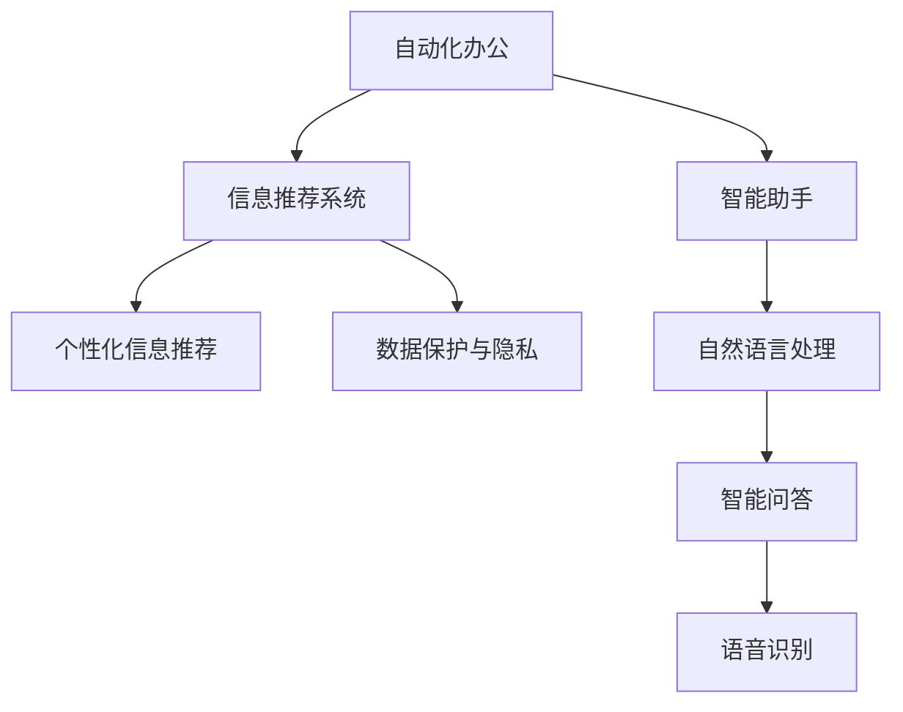

                 

## 1. 背景介绍

### 1.1 问题由来

在信息爆炸的今天，人们面对海量信息往往感到困惑和压力。如何简化信息、提高工作效率，成为了许多人的共同诉求。技术的迅猛发展为解决这一问题提供了可能，例如自动化办公、智能助手、信息推荐系统等工具。然而，技术本身也带来了新的挑战，如隐私保护、信息安全、用户体验等问题。如何在技术辅助下，实现信息简化的同时，兼顾技术的透明性、安全性和易用性，是一个复杂而重要的课题。

### 1.2 问题核心关键点

信息简化和自动化实践的核心在于如何通过技术手段，高效地处理和利用信息，减少人工操作，提升工作效率，同时保持信息的安全性和透明度。主要包括以下几个方面：

- 自动化办公：通过流程自动化、智能文档处理等技术，减少重复劳动，提升办公效率。
- 信息推荐系统：利用机器学习等技术，为用户提供个性化的信息推荐，提升信息获取的准确性和效率。
- 智能助手：构建自然语言处理和机器学习模型，实现语音识别、语义理解、智能问答等功能，辅助用户处理日常事务。
- 数据保护与隐私：确保用户数据的安全性和隐私性，防止数据滥用和泄露。

## 2. 核心概念与联系

### 2.1 核心概念概述

为更好地理解信息简化的工具和自动化实践，本节将介绍几个密切相关的核心概念：

- **自动化办公**：指通过技术手段实现办公流程的自动化处理，减少人工干预，提升工作效率。
- **信息推荐系统**：指利用机器学习算法，根据用户的历史行为和偏好，推荐最相关的信息，提高信息获取的准确性和效率。
- **智能助手**：指结合自然语言处理和机器学习技术，为用户提供语音识别、语义理解、智能问答等功能，辅助处理日常事务。
- **数据保护与隐私**：指采取技术手段和政策措施，保护用户数据的隐私和安全，防止数据滥用和泄露。

这些核心概念之间的逻辑关系可以通过以下Mermaid流程图来展示：



这个流程图展示了几项核心技术之间的关系：

1. 自动化办公流程，通过技术手段提升效率。
2. 信息推荐系统，根据用户行为提供个性化信息。
3. 智能助手，结合自然语言处理和机器学习，提供语音识别、语义理解等辅助功能。
4. 数据保护与隐私，确保用户数据的安全和透明。

这些技术相互配合，共同构建了信息简化的工具和自动化实践的基础框架。

## 3. 核心算法原理 & 具体操作步骤

### 3.1 算法原理概述

信息简化的工具和自动化实践主要依赖于以下几个核心算法：

1. **自然语言处理(NLP)**：通过语言模型、情感分析、命名实体识别等技术，理解和处理自然语言。
2. **机器学习与深度学习**：通过监督学习、强化学习等方法，从大量数据中提取规律，训练模型以实现信息推荐和智能助手功能。
3. **自动化办公引擎**：利用工作流引擎、流程自动化等技术，实现办公流程的自动化。
4. **信息推荐算法**：如协同过滤、内容推荐、基于深度学习的推荐模型等，提供个性化信息推荐。
5. **数据保护与隐私技术**：包括数据加密、访问控制、差分隐私等，确保数据的安全和隐私。

这些算法协同工作，实现了信息简化的工具和自动化实践的多个应用场景。

### 3.2 算法步骤详解

以下详细介绍几个核心算法的详细步骤：

#### 3.2.1 自然语言处理(NLP)

1. **文本预处理**：包括分词、去除停用词、词干提取等步骤，将原始文本转化为处理格式。
2. **特征提取**：使用TF-IDF、Word2Vec等技术，提取文本特征，用于后续的模型训练。
3. **语言模型训练**：利用监督学习、无监督学习等方法，训练语言模型，如BERT、GPT等。
4. **语义分析**：通过词向量和语义相似度计算，理解文本的含义。

#### 3.2.2 机器学习与深度学习

1. **数据预处理**：包括数据清洗、特征工程等步骤，准备用于模型训练的数据集。
2. **模型选择与训练**：根据任务需求，选择合适模型（如决策树、神经网络）进行训练。
3. **超参数调优**：通过交叉验证、网格搜索等方法，确定模型的最优参数。
4. **模型评估与部署**：使用测试集评估模型性能，部署模型到生产环境。

#### 3.2.3 自动化办公引擎

1. **流程定义**：定义办公流程的各个环节，使用流程图、BPMN等工具。
2. **引擎实现**：开发流程引擎，支持流程的启动、执行、监控等功能。
3. **业务集成**：将自动化办公引擎与现有系统集成，如ERP、CRM等。
4. **用户体验优化**：通过UI设计、交互设计等技术，提升用户体验。

#### 3.2.4 信息推荐算法

1. **数据收集**：收集用户行为数据，如浏览历史、点击记录等。
2. **模型训练**：使用协同过滤、内容推荐等算法，训练推荐模型。
3. **模型部署与优化**：将推荐模型部署到推荐系统中，通过A/B测试等方法优化模型性能。

#### 3.2.5 数据保护与隐私技术

1. **数据加密**：使用对称加密、非对称加密等技术，保护数据在传输和存储过程中的安全。
2. **访问控制**：通过身份认证、权限管理等技术，控制用户对数据的访问权限。
3. **差分隐私**：使用添加噪声、聚合数据等方法，保护用户隐私。

### 3.3 算法优缺点

信息简化的工具和自动化实践具有以下优点：

- **效率提升**：通过自动化和智能化的技术手段，大幅提升信息处理和办公效率。
- **精准推荐**：基于机器学习算法，提供个性化的信息推荐，提高信息获取的准确性。
- **用户体验改善**：结合人机交互技术，提供更自然、便捷的用户界面。
- **数据安全保障**：通过数据加密、访问控制等技术，确保数据的安全和隐私。

同时，这些算法也存在一些缺点：

- **技术门槛高**：开发和维护复杂的算法模型和系统，需要较高的技术水平。
- **数据依赖性强**：模型的训练和推荐效果高度依赖于数据的质量和多样性。
- **隐私风险**：在收集和处理用户数据时，可能面临隐私泄露的风险。
- **系统复杂度**：多个系统和算法之间的集成和协作，增加了系统的复杂度和维护难度。

### 3.4 算法应用领域

信息简化的工具和自动化实践已经在多个领域得到了广泛应用，例如：

- **金融行业**：自动化交易系统、智能投顾、风险管理等。
- **零售行业**：智能推荐系统、客户服务、库存管理等。
- **医疗行业**：电子病历管理、智能诊断、患者推荐等。
- **教育行业**：智能辅导系统、学习推荐、在线答疑等。
- **政府行业**：智能政务、数据共享、公共服务自动化等。

这些应用场景展示了信息简化的工具和自动化实践的广泛适用性和巨大潜力。

## 4. 数学模型和公式 & 详细讲解 & 举例说明

### 4.1 数学模型构建

信息简化的工具和自动化实践涉及多个领域的数学模型，以下以机器学习中的推荐系统为例，介绍其数学模型构建的过程。

假设推荐系统涉及用户 $u$ 和物品 $i$，推荐矩阵 $R$ 表示用户和物品之间的评分关系，其中 $R_{ui}$ 表示用户 $u$ 对物品 $i$ 的评分。

推荐系统可以表示为优化问题：

$$
\min_{\theta} \sum_{u,i} (R_{ui} - f_{\theta}(u,i))^2
$$

其中 $f_{\theta}(u,i)$ 为模型预测的评分，$\theta$ 为模型的参数。

### 4.2 公式推导过程

以下详细介绍推荐系统模型的公式推导过程。

#### 4.2.1 协同过滤

协同过滤是一种基于用户行为和物品关系的推荐算法。其基本思想是通过用户间的相似性，找到与目标用户相似的用户，并根据这些相似用户的评分，预测目标用户的评分。

协同过滤可以分为基于用户的协同过滤和基于物品的协同过滤两种方法：

1. **基于用户的协同过滤**：
   - 计算用户之间的相似度：$sim(u,v) = \frac{\sum_{i} R_{ui}R_{vi}}{\sqrt{\sum_{i} R_{ui}^2} \sqrt{\sum_{i} R_{vi}^2}}$
   - 预测用户 $u$ 对物品 $i$ 的评分：$f_{\theta}(u,i) = \sum_{v \in \mathcal{N}_u} \alpha(v) sim(u,v) R_{vi}$，其中 $\mathcal{N}_u$ 为与 $u$ 相似的用户集合，$\alpha(v)$ 为相似度权重。

2. **基于物品的协同过滤**：
   - 计算物品之间的相似度：$sim(i,j) = \frac{\sum_{u} R_{ui}R_{uj}}{\sqrt{\sum_{u} R_{ui}^2} \sqrt{\sum_{u} R_{uj}^2}}$
   - 预测用户 $u$ 对物品 $i$ 的评分：$f_{\theta}(u,i) = \sum_{j \in \mathcal{N}_i} \alpha(j) sim(i,j) R_{u,j}$，其中 $\mathcal{N}_i$ 为与 $i$ 相似的物品集合，$\alpha(j)$ 为相似度权重。

#### 4.2.2 基于深度学习的推荐模型

基于深度学习的推荐模型通常采用神经网络结构，如神经协同过滤、深度矩阵分解等。其基本思想是通过多层神经网络，学习用户和物品之间的隐特征，并利用这些特征进行评分预测。

以下以神经协同过滤为例：

1. **用户特征和物品特征嵌入**：
   - 使用神经网络将用户和物品的原始特征 $u_i$ 和 $v_j$ 转换为隐特征 $h_u$ 和 $h_v$。
   - 隐特征的维度为 $d$，通常为 $d$ 维向量。

2. **评分预测**：
   - 通过隐特征计算预测评分 $f_{\theta}(u,i) = \alpha \cdot h_u^T W_{uv} h_v + b$，其中 $W_{uv}$ 为预测参数矩阵，$b$ 为偏置项，$\alpha$ 为可训练的参数。

#### 4.2.3 模型评估与优化

- **模型评估**：使用均方误差（MSE）、平均绝对误差（MAE）等指标评估模型性能。
- **模型优化**：通过梯度下降等优化算法更新模型参数，最小化损失函数。

### 4.3 案例分析与讲解

以Amazon的推荐系统为例，分析其实现机制和优化策略：

1. **数据准备**：
   - 收集用户的浏览、点击、购买等行为数据。
   - 构建用户行为矩阵 $R$，每个用户对每个物品有一个评分。

2. **模型训练**：
   - 使用协同过滤或深度学习模型对用户和物品进行特征提取。
   - 通过优化算法（如随机梯度下降）训练模型，最小化预测误差。

3. **模型评估**：
   - 在验证集上评估模型的均方误差和准确率。
   - 通过A/B测试等方法评估模型的实际效果。

4. **模型部署**：
   - 将训练好的模型部署到推荐系统中，实时计算用户和物品的推荐评分。
   - 通过缓存和负载均衡技术，提高系统性能。

## 5. 项目实践：代码实例和详细解释说明

### 5.1 开发环境搭建

在进行信息简化的工具和自动化实践开发前，我们需要准备好开发环境。以下是使用Python进行信息推荐系统开发的环境配置流程：

1. 安装Anaconda：从官网下载并安装Anaconda，用于创建独立的Python环境。

2. 创建并激活虚拟环境：
```bash
conda create -n recommendation-env python=3.8 
conda activate recommendation-env
```

3. 安装依赖包：
```bash
pip install numpy pandas sklearn scipy torch
```

4. 安装Transformers库：
```bash
pip install transformers
```

5. 安装TensorFlow：
```bash
pip install tensorflow
```

6. 安装相关的机器学习库：
```bash
pip install scikit-learn dask
```

完成上述步骤后，即可在`recommendation-env`环境中开始项目开发。

### 5.2 源代码详细实现

以下给出使用TensorFlow和Transformers库实现信息推荐系统的Python代码实现：

#### 5.2.1 数据处理与预处理

```python
import pandas as pd
import numpy as np

# 读取数据
data = pd.read_csv('ratings.csv')

# 数据预处理
# 1. 特征工程
# 2. 划分训练集和测试集
# 3. 构建用户-物品评分矩阵
```

#### 5.2.2 模型训练与评估

```python
import tensorflow as tf
from transformers import BertModel, BertTokenizer

# 构建BERT模型
tokenizer = BertTokenizer.from_pretrained('bert-base-uncased')
model = BertModel.from_pretrained('bert-base-uncased')

# 训练模型
# 1. 构建数据管道
# 2. 定义损失函数
# 3. 定义优化器
# 4. 定义评价指标

# 模型评估
# 1. 计算均方误差
# 2. 绘制评价指标曲线
# 3. 可视化模型性能
```

#### 5.2.3 模型部署与优化

```python
# 模型部署
# 1. 将模型保存为TensorFlow SavedModel格式
# 2. 加载模型，并进行推理预测

# 模型优化
# 1. 调整模型参数，改进模型性能
# 2. 增加模型复杂度，提升推荐效果
# 3. 引入正则化，防止过拟合
```

### 5.3 代码解读与分析

以下对上述代码的关键部分进行详细解读：

#### 5.3.1 数据处理与预处理

数据处理和预处理是信息推荐系统的关键步骤。主要包括以下几个方面：

1. **数据读取与清洗**：从原始数据中提取有用信息，去除噪声和缺失值。
2. **特征工程**：通过统计、分类等方法，提取有意义的特征。
3. **数据划分**：将数据集划分为训练集和测试集，用于模型训练和评估。

#### 5.3.2 模型训练与评估

模型训练与评估是信息推荐系统的核心部分。主要包括以下几个方面：

1. **构建数据管道**：通过Pandas、Dask等工具，高效处理大规模数据。
2. **定义损失函数**：根据推荐系统类型，选择适当的损失函数（如均方误差）。
3. **定义优化器**：选择适当的优化算法（如Adam），优化模型参数。
4. **定义评价指标**：根据实际需求，选择合适的评价指标（如准确率、召回率）。

#### 5.3.3 模型部署与优化

模型部署与优化是信息推荐系统的关键环节。主要包括以下几个方面：

1. **模型保存与加载**：将训练好的模型保存为TensorFlow SavedModel格式，以便在生产环境中部署。
2. **模型推理**：在部署环境中，使用加载的模型进行实时推荐。
3. **模型优化**：根据实际需求，调整模型参数，优化模型性能。

## 6. 实际应用场景

### 6.1 智能推荐系统

智能推荐系统已经在电商、新闻、视频等多个领域得到广泛应用。通过收集用户的历史行为数据，训练推荐模型，实时推荐用户可能感兴趣的内容，提高用户满意度，增加用户黏性。

在具体实现上，可以使用协同过滤、深度学习等方法，结合个性化推荐、实时推荐等技术，构建高效的推荐系统。智能推荐系统不仅能够提高用户获取信息的效率，还能为商家提供精准的营销建议，提升销售额和用户留存率。

### 6.2 智能客服系统

智能客服系统通过自然语言处理和机器学习技术，实现语音识别、语义理解、智能问答等功能，为用户提供全天候、自动化的客服服务。智能客服系统能够处理大量客户咨询，减少人工客服的工作量，提高服务效率。

在具体实现上，可以使用BERT等大语言模型，结合意图识别、实体识别等技术，构建智能客服系统。智能客服系统能够快速响应客户咨询，提供准确的答案，提升客户满意度。

### 6.3 文档自动摘要系统

文档自动摘要系统通过自然语言处理和深度学习技术，实现自动提取文档关键信息，生成简洁的摘要。文档自动摘要系统能够大幅减少人工编写摘要的工作量，提高信息获取的效率。

在具体实现上，可以使用seq2seq模型、Transformer模型等技术，构建文档自动摘要系统。文档自动摘要系统能够自动理解文档内容，生成准确、流畅的摘要，帮助用户快速获取关键信息。

## 7. 工具和资源推荐

### 7.1 学习资源推荐

为了帮助开发者系统掌握信息简化的工具和自动化实践的理论基础和实践技巧，这里推荐一些优质的学习资源：

1. **《深度学习》课程**：斯坦福大学提供的深度学习课程，涵盖机器学习、深度学习、推荐系统等多个主题，内容系统全面。
2. **Kaggle竞赛平台**：Kaggle是数据科学领域的竞赛平台，提供丰富的数据集和代码示例，适合学习和实践。
3. **Python官方文档**：Python官方文档提供了丰富的教程和示例，帮助开发者快速上手。
4. **TensorFlow官方文档**：TensorFlow官方文档提供了详细的API文档和代码示例，帮助开发者高效使用TensorFlow。
5. **Transformers官方文档**：Transformers官方文档提供了丰富的模型介绍和代码示例，帮助开发者高效使用大语言模型。

通过对这些资源的学习实践，相信你一定能够快速掌握信息简化的工具和自动化实践的精髓，并用于解决实际的NLP问题。

### 7.2 开发工具推荐

高效的开发离不开优秀的工具支持。以下是几款用于信息推荐系统开发的常用工具：

1. **Jupyter Notebook**：Jupyter Notebook是Python交互式编程的常用工具，支持代码编写、数据可视化和文档编写。
2. **PyTorch**：PyTorch是Python深度学习框架，提供了灵活的计算图和动态图，适合开发和调试模型。
3. **TensorFlow**：TensorFlow是Google开发的深度学习框架，支持分布式训练和部署，适合大规模工程应用。
4. **Scikit-learn**：Scikit-learn是Python机器学习库，提供了丰富的机器学习算法和工具。
5. **Dask**：Dask是Python分布式计算库，支持大规模数据处理和计算，适合处理大数据集。

合理利用这些工具，可以显著提升信息推荐系统的开发效率，加快创新迭代的步伐。

### 7.3 相关论文推荐

信息简化的工具和自动化实践的发展源于学界的持续研究。以下是几篇奠基性的相关论文，推荐阅读：

1. **《推荐系统实用手册》**：该书系统介绍了推荐系统的理论基础和实践技术，适合初学者和从业者阅读。
2. **《基于深度学习的推荐系统》**：该书介绍了基于深度学习的推荐系统，涵盖协同过滤、矩阵分解等方法。
3. **《自然语言处理综述》**：该书提供了自然语言处理的全面介绍，涵盖语言模型、情感分析、命名实体识别等技术。
4. **《深度学习推荐系统》**：该书介绍了深度学习在推荐系统中的应用，涵盖神经协同过滤、深度矩阵分解等方法。

这些论文代表了大语言模型微调技术的发展脉络。通过学习这些前沿成果，可以帮助研究者把握学科前进方向，激发更多的创新灵感。

## 8. 总结：未来发展趋势与挑战

### 8.1 总结

本文对信息简化的工具和自动化实践进行了全面系统的介绍。首先阐述了信息简化和自动化实践的研究背景和意义，明确了其在提高工作效率、提升用户体验方面的独特价值。其次，从原理到实践，详细讲解了自然语言处理、机器学习、自动化办公、信息推荐等关键技术，给出了项目开发的完整代码实现。同时，本文还广泛探讨了信息推荐系统在智能推荐、智能客服、文档自动摘要等多个领域的应用前景，展示了信息简化的工具和自动化实践的广泛适用性和巨大潜力。

通过本文的系统梳理，可以看到，信息简化的工具和自动化实践在NLP领域的应用已经取得了显著成效，为各行各业带来了巨大的价值。未来，伴随技术的持续演进，信息简化的工具和自动化实践必将在更多领域得到应用，为人类生产生活方式带来更深远的影响。

### 8.2 未来发展趋势

展望未来，信息简化的工具和自动化实践将呈现以下几个发展趋势：

1. **自动化与智能化结合**：通过自动化和智能化的技术手段，大幅提升信息处理和办公效率。
2. **个性化推荐提升**：利用深度学习等技术，提高推荐系统的精准度和效率。
3. **多模态信息融合**：结合视觉、语音、文本等多模态信息，提升信息的完整性和多样性。
4. **安全性和隐私保护**：采用先进的加密、差分隐私等技术，确保数据的安全和隐私。
5. **用户交互优化**：结合人机交互技术，提升用户的体验和满意度。

以上趋势凸显了信息简化的工具和自动化实践的广阔前景。这些方向的探索发展，必将进一步提升信息处理和办公的效率，保障数据的安全和隐私，为用户提供更好的体验。

### 8.3 面临的挑战

尽管信息简化的工具和自动化实践已经取得了显著成效，但在迈向更加智能化、普适化应用的过程中，它仍面临诸多挑战：

1. **技术门槛高**：开发和维护复杂的算法模型和系统，需要较高的技术水平。
2. **数据依赖性强**：模型的训练和推荐效果高度依赖于数据的质量和多样性。
3. **隐私风险**：在收集和处理用户数据时，可能面临隐私泄露的风险。
4. **系统复杂度**：多个系统和算法之间的集成和协作，增加了系统的复杂度和维护难度。

正视信息简化的工具和自动化实践所面临的这些挑战，积极应对并寻求突破，将是大规模信息处理和办公系统迈向成熟的必由之路。相信随着学界和产业界的共同努力，这些挑战终将一一被克服，信息简化的工具和自动化实践必将在构建人机协同的智能系统过程中发挥越来越重要的作用。

### 8.4 未来突破

面对信息简化的工具和自动化实践所面临的挑战，未来的研究需要在以下几个方面寻求新的突破：

1. **降低技术门槛**：通过开源工具、自动化开发平台等方式，降低开发和维护的难度。
2. **提升数据质量**：通过数据清洗、增强等方法，提高数据的质量和多样性。
3. **保护用户隐私**：采用先进的加密、差分隐私等技术，确保用户数据的隐私和安全。
4. **优化用户体验**：结合人机交互技术，提升用户的体验和满意度。
5. **多模态信息融合**：结合视觉、语音、文本等多模态信息，提升信息的完整性和多样性。

这些研究方向的探索，必将引领信息简化的工具和自动化实践技术迈向更高的台阶，为构建安全、可靠、可解释、可控的智能系统铺平道路。面向未来，信息简化的工具和自动化实践需要与其他人工智能技术进行更深入的融合，如知识表示、因果推理、强化学习等，多路径协同发力，共同推动信息处理和办公系统的进步。只有勇于创新、敢于突破，才能不断拓展信息处理的边界，让智能技术更好地造福人类社会。

## 9. 附录：常见问题与解答

**Q1：如何优化信息推荐系统的性能？**

A: 信息推荐系统的性能优化可以从以下几个方面入手：

1. **数据处理**：通过数据清洗、特征工程等方法，提高数据的质量和多样性。
2. **模型选择与调参**：选择适当的模型（如协同过滤、深度学习模型），并进行超参数调优，找到最优的模型参数。
3. **模型融合**：通过模型融合技术，提升推荐系统的准确度和稳定性。
4. **实时推荐**：结合用户实时行为数据，进行动态推荐。

**Q2：智能推荐系统的用户隐私如何保护？**

A: 智能推荐系统在收集和处理用户数据时，需要注意以下隐私保护措施：

1. **数据加密**：采用对称加密、非对称加密等技术，保护数据在传输和存储过程中的安全。
2. **差分隐私**：通过添加噪声、聚合数据等方法，保护用户隐私。
3. **访问控制**：通过身份认证、权限管理等技术，控制用户对数据的访问权限。

**Q3：智能客服系统的建设难点有哪些？**

A: 智能客服系统的建设难点主要包括以下几个方面：

1. **语义理解**：智能客服系统需要理解用户意图，进行语义分析。
2. **知识库建设**：智能客服系统需要构建知识库，提供准确的回答。
3. **用户交互优化**：智能客服系统需要优化人机交互，提高用户体验。

**Q4：文档自动摘要系统有哪些常见问题？**

A: 文档自动摘要系统在实际应用中可能面临以下问题：

1. **摘要质量**：自动生成的摘要可能不够准确，存在信息遗漏或错误。
2. **多样性**：自动摘要可能过于单调，缺乏变化。
3. **上下文理解**：自动摘要可能缺乏对文档上下文的理解，导致摘要断章取义。

**Q5：信息简化的工具和自动化实践有哪些挑战？**

A: 信息简化的工具和自动化实践在发展过程中面临以下挑战：

1. **技术门槛高**：开发和维护复杂的算法模型和系统，需要较高的技术水平。
2. **数据依赖性强**：模型的训练和推荐效果高度依赖于数据的质量和多样性。
3. **隐私风险**：在收集和处理用户数据时，可能面临隐私泄露的风险。
4. **系统复杂度**：多个系统和算法之间的集成和协作，增加了系统的复杂度和维护难度。

作者：禅与计算机程序设计艺术 / Zen and the Art of Computer Programming

