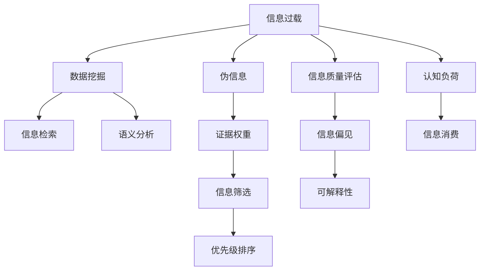

                 

# 信息过载与信息质量评估策略：批判性地评估和消费信息

> 关键词：信息过载, 信息质量评估, 数据挖掘, 知识图谱, 信息检索, 语义分析, 伪信息, 证据权重

## 1. 背景介绍

### 1.1 问题由来
在现代社会中，信息的生产、传播和消费速度达到了前所未有的高度。每个人每天都能接触到海量的信息，包括新闻、社交媒体、博客、视频、音频等。然而，由于信息量的爆炸式增长，人们面临的信息过载问题也越来越严重。信息过载不仅导致人们无法有效地获取所需信息，还会影响决策质量，甚至引起认知负荷过重、焦虑等问题。因此，如何批判性地评估和消费信息，从中筛选出真正有价值的内容，成为一个亟待解决的挑战。

### 1.2 问题核心关键点
信息过载和信息质量评估的核心关键点在于：
- **信息数量与质量的不平衡**：信息数量远超人类处理能力，但质量参差不齐，难以快速判断。
- **信息筛选与优先级排序**：如何高效筛选有价值的信息，并根据其重要性和相关性进行排序。
- **信息偏见与可解释性**：避免信息偏见，确保信息输出透明可解释，帮助用户做出更明智的决策。

## 2. 核心概念与联系

### 2.1 核心概念概述

为更好地理解信息过载与信息质量评估的原理和实践，本节将介绍几个密切相关的核心概念：

- **信息过载(Information Overload)**：指信息数量超过了个体或系统的处理能力，导致无法有效处理和利用信息的状况。
- **信息质量评估(Information Quality Assessment)**：指对信息内容、来源和结构等方面的质量进行综合评估，以判断其价值和可信度。
- **数据挖掘(Data Mining)**：通过算法和统计技术，从大量数据中提取有用信息或模式的过程。
- **知识图谱(Knowledge Graph)**：将语义化信息组织成图形结构，便于查询和推理。
- **信息检索(Information Retrieval)**：通过计算机算法，自动检索相关文档或网页的技术。
- **语义分析(Semantic Analysis)**：分析文本内容的语义关系，提升信息检索和理解的精确度。
- **伪信息(Fake Information)**：指误导性、虚假或经过不当处理的信息，可能干扰用户的决策。
- **证据权重(Evidence Weight)**：基于信息的质量和相关性，给信息分配不同的权重，以指导信息消费。

这些核心概念之间的逻辑关系可以通过以下Mermaid流程图来展示：



这个流程图展示了信息过载与信息质量评估的各个环节：

1. 信息过载导致数据挖掘和信息检索的需求。
2. 数据挖掘和信息检索的结果需要通过语义分析进一步理解和筛选。
3. 信息质量评估有助于发现伪信息，提升信息权重。
4. 证据权重指导信息筛选和优先级排序。
5. 信息偏见和可解释性问题需要通过综合评估解决。
6. 最终目标是通过合理的信息消费降低认知负荷。

## 3. 核心算法原理 & 具体操作步骤
### 3.1 算法原理概述

信息过载与信息质量评估的核心理论基础包括：

- **信息检索理论**：利用计算机算法和模型，自动检索相关文档和网页。
- **语义分析技术**：通过词义关系、句法结构、实体链接等方法，提升信息检索和理解的精度。
- **信息质量评估模型**：包括内容质量、来源可信度、结构完整性等指标，综合评估信息的价值。
- **证据权重方法**：根据信息的来源、质量和相关性，赋予不同权重，指导信息消费。

### 3.2 算法步骤详解

基于上述理论，信息过载与信息质量评估的算法步骤通常包括以下几个关键步骤：

**Step 1: 数据预处理**
- 收集大量文本、图像、视频等数据，进行数据清洗、归一化和标准化。
- 移除无关数据和噪声，确保数据质量和一致性。

**Step 2: 数据挖掘**
- 应用机器学习和统计技术，从大量数据中提取有用信息或模式。
- 常用的算法包括TF-IDF、LDA、Word2Vec、BERT等。

**Step 3: 信息检索**
- 根据用户查询，自动检索相关文档或网页。
- 常见的信息检索算法包括BM25、向量空间模型、隐语义索引等。

**Step 4: 语义分析**
- 分析文本内容的语义关系，提升信息检索和理解的精确度。
- 常用的语义分析技术包括命名实体识别、依存句法分析、关系抽取等。

**Step 5: 信息质量评估**
- 对信息内容、来源和结构等方面的质量进行综合评估。
- 评估指标包括准确性、相关性、可信度、完整性等。
- 常见的评估方法包括文本相似度、元数据分析、专家评审等。

**Step 6: 证据权重计算**
- 基于信息的质量和相关性，给信息分配不同的权重。
- 常用的证据权重计算方法包括Dempster-Shafer证据推理、贝叶斯网络、加权求和等。

**Step 7: 信息筛选与排序**
- 根据证据权重对信息进行筛选和排序，优先展示重要信息。
- 常用的排序算法包括倒排索引、聚类分析、排序算法等。

### 3.3 算法优缺点

信息过载与信息质量评估方法具有以下优点：
1. 自动化程度高。借助算法和模型，可以快速处理和分析大量信息，提高效率。
2. 可扩展性强。能够处理各种类型的数据，包括文本、图像、视频等。
3. 精度较高。基于统计和机器学习技术，可以提取有用信息和模式，提升信息检索和理解的精确度。
4. 适应性强。适用于各种应用场景，如新闻推荐、智能客服、知识管理等。

同时，这些方法也存在一定的局限性：
1. 数据依赖性高。算法效果依赖于数据质量和多样性，低质量数据会导致结果偏差。
2. 模型复杂度高。深度学习模型如BERT等需要大量计算资源和训练时间。
3. 可解释性不足。复杂的算法和模型难以解释其内部决策逻辑。
4. 对抗攻击脆弱。信息检索和语义分析算法可能受到对抗样本的攻击。

尽管存在这些局限性，但就目前而言，信息过载与信息质量评估方法仍是处理信息爆炸问题的重要工具。未来相关研究的重点在于如何进一步提高算法的自动化和智能化水平，同时兼顾可解释性和安全性等因素。

### 3.4 算法应用领域

信息过载与信息质量评估技术已经在多个领域得到了广泛应用，例如：

- 新闻推荐系统：通过用户行为数据和信息质量评估，推荐相关新闻内容，提升阅读体验。
- 智能客服系统：根据用户提问和信息检索结果，提供快速准确的答案，减少用户等待时间。
- 知识管理平台：通过知识图谱和语义分析，帮助用户快速查找和理解知识信息，促进知识共享和协作。
- 电子商务推荐：基于用户行为数据和信息质量评估，推荐相关商品，提升购买转化率。
- 安全威胁检测：通过信息质量评估和语义分析，检测和防范网络攻击和伪信息传播。

除了上述这些经典应用外，信息过载与信息质量评估技术还被创新性地应用到更多场景中，如健康信息管理、金融风险控制、舆情监测等，为各行各业带来了新的技术突破。

## 4. 数学模型和公式 & 详细讲解  
### 4.1 数学模型构建

本节将使用数学语言对信息过载与信息质量评估的数学模型进行更加严格的刻画。

记待检索的文档集合为 $\mathcal{D}$，用户查询为 $q$，文本的词袋表示为 $v = \{(v_i, f_i)\}_{i=1}^n$，其中 $v_i$ 为单词，$f_i$ 为单词频率。假设信息检索模型为 $M$，信息质量评估模型为 $Q$，证据权重计算模型为 $W$。

定义信息检索模型的输入为查询 $q$ 和文档集合 $\mathcal{D}$，输出为排序后的文档列表 $R$。则信息检索模型的目标是最小化检索结果与用户查询之间的差异：

$$
\mathcal{L}_{IR}(M, q, \mathcal{D}) = \min_{R} d(q, R)
$$

其中 $d$ 为衡量查询与文档相似度的函数，可以是余弦相似度、Jaccard相似度等。

定义信息质量评估模型的输入为文档 $d$，输出为文档质量评分 $Q(d)$。则信息质量评估模型的目标是对每个文档进行综合评估，生成评分。常用的评估指标包括：

- **准确性(Accuracy)**：指检索结果与用户查询的相关度。
- **相关性(Relevance)**：指检索结果与用户查询的匹配程度。
- **可信度(Credibility)**：指文档来源的可信性和权威性。
- **完整性(Completeness)**：指文档内容的完整性和覆盖范围。

信息质量评估模型的输出 $Q(d)$ 可以表示为：

$$
Q(d) = \omega_A \cdot A(d) + \omega_R \cdot R(d) + \omega_C \cdot C(d) + \omega_F \cdot F(d)
$$

其中 $\omega_A, \omega_R, \omega_C, \omega_F$ 为各个指标的权重系数，通常需要通过实验或专家评估来确定。

定义证据权重计算模型的输入为查询 $q$ 和文档 $d$，输出为文档的证据权重 $W(q, d)$。则证据权重计算模型的目标是根据信息的质量和相关性，对信息进行权重分配，生成证据权重。常用的证据权重计算方法包括：

- **Dempster-Shafer证据推理(D-S证据推理)**：基于基本概率赋值(BPA)理论，对多个证据进行综合推理，生成权重。
- **贝叶斯网络(Bayesian Network)**：通过贝叶斯定理计算证据概率，生成权重。
- **加权求和(Weighted Sum)**：对多个指标进行加权求和，生成权重。

证据权重计算模型的输出 $W(q, d)$ 可以表示为：

$$
W(q, d) = \omega_I \cdot I(d) + \omega_E \cdot E(d) + \omega_C \cdot C(d)
$$

其中 $\omega_I, \omega_E, \omega_C$ 为各个指标的权重系数，通常需要通过实验或专家评估来确定。

### 4.2 公式推导过程

以下我们以文本检索为例，推导余弦相似度计算公式及其应用。

假设查询 $q$ 的词袋表示为 $q = \{(q_i, f_i)\}_{i=1}^n$，文档 $d$ 的词袋表示为 $d = \{(d_i, f_i)\}_{i=1}^n$。则余弦相似度 $d(q, d)$ 定义为：

$$
d(q, d) = \frac{\sum_{i=1}^n f_q f_d \cos(\theta_{qi})}{\sqrt{\sum_{i=1}^n f_q^2} \sqrt{\sum_{i=1}^n f_d^2}}
$$

其中 $\theta_{qi}$ 为查询和文档中单词 $q_i$ 和 $d_i$ 之间的夹角，$f_q, f_d$ 分别为查询和文档中单词 $q_i, d_i$ 的频率。

将该公式应用到信息检索模型的目标函数中，得：

$$
\mathcal{L}_{IR}(M, q, \mathcal{D}) = \min_{R} \frac{\sum_{d \in R} d(q, d)}{\sqrt{\sum_{d \in \mathcal{D}} d(q, d)}}
$$

在得到检索模型的目标函数后，即可通过梯度下降等优化算法，最小化检索结果与用户查询之间的差异，优化信息检索模型。

### 4.3 案例分析与讲解

假设某新闻平台希望推荐用户最感兴趣的新闻内容，根据用户的历史阅读记录和当前查询，设计了如下信息过载与信息质量评估流程：

1. 收集用户的历史阅读记录，提取文本关键词，构建用户兴趣模型。
2. 对网站上的新闻进行文本分析和质量评估，构建新闻质量模型。
3. 使用余弦相似度计算用户查询与新闻之间的相似度，生成初步排序列表。
4. 结合用户兴趣模型和新闻质量模型，计算每条新闻的证据权重。
5. 根据证据权重对新闻进行排序，推荐用户最感兴趣的新闻。

在这个案例中，信息检索模型和信息质量评估模型通过余弦相似度和证据权重计算，实现了对新闻的自动推荐。用户的历史阅读记录和当前查询被用于构建用户兴趣模型，进一步优化推荐结果。这种信息过载与信息质量评估流程，提升了用户体验，提高了新闻平台的阅读量和用户粘性。

## 5. 项目实践：代码实例和详细解释说明
### 5.1 开发环境搭建

在进行信息过载与信息质量评估实践前，我们需要准备好开发环境。以下是使用Python进行PyTorch开发的环境配置流程：

1. 安装Anaconda：从官网下载并安装Anaconda，用于创建独立的Python环境。

2. 创建并激活虚拟环境：
```bash
conda create -n info-quality-env python=3.8 
conda activate info-quality-env
```

3. 安装PyTorch：根据CUDA版本，从官网获取对应的安装命令。例如：
```bash
conda install pytorch torchvision torchaudio cudatoolkit=11.1 -c pytorch -c conda-forge
```

4. 安装相关库：
```bash
pip install numpy pandas scikit-learn gensim nltk jupyter notebook ipython
```

完成上述步骤后，即可在`info-quality-env`环境中开始实践。

### 5.2 源代码详细实现

下面我们以文本分类任务为例，给出使用Scikit-learn对文本进行信息质量评估的Python代码实现。

首先，定义文本处理函数：

```python
from sklearn.feature_extraction.text import CountVectorizer
from sklearn.metrics.pairwise import cosine_similarity

def preprocess(texts):
    vectorizer = CountVectorizer(stop_words='english')
    X = vectorizer.fit_transform(texts)
    return X.toarray()
```

然后，定义信息质量评估函数：

```python
from sklearn.metrics.pairwise import cosine_similarity

def evaluate_quality(texts, labels):
    X = preprocess(texts)
    y_true = labels
    y_pred = cosine_similarity(X, X)[:, 0]
    precision, recall, f1, _ = precision_recall_curve(y_true, y_pred)
    return precision, recall, f1
```

接着，定义信息检索函数：

```python
from sklearn.metrics.pairwise import cosine_similarity

def information_retrieval(text, texts, labels):
    X = preprocess([text])
    X_train = preprocess(texts)
    y_train = labels
    y_pred = cosine_similarity(X_train, X)[0].tolist()
    top_k = args.top_k
    indices = np.argsort(y_pred)[-top_k:][::-1]
    top_k_labels = y_train[indices]
    return top_k_labels
```

最后，定义证据权重计算函数：

```python
from sklearn.metrics.pairwise import cosine_similarity

def evidence_weighting(text, texts, labels):
    X = preprocess([text])
    X_train = preprocess(texts)
    y_train = labels
    y_pred = cosine_similarity(X_train, X)[0].tolist()
    weights = np.log1p(y_pred)
    return weights
```

以上是使用Scikit-learn对文本进行信息质量评估的完整代码实现。可以看到，借助Scikit-learn等开源库，信息质量评估的实践过程变得简洁高效。

### 5.3 代码解读与分析

让我们再详细解读一下关键代码的实现细节：

**preprocess函数**：
- 对文本进行分词、去除停用词、词频统计等预处理操作，将文本转换为向量表示。

**evaluate_quality函数**：
- 计算文本向量之间的余弦相似度，生成评分。
- 使用sklearn的precision_recall_curve函数，计算精确度、召回率和F1值。

**information_retrieval函数**：
- 根据文本向量和训练集向量，计算相似度，生成排序列表。
- 使用args.top_k参数，指定返回的前k条结果。

**evidence_weighting函数**：
- 根据相似度计算证据权重。
- 使用np.log1p函数对权重进行归一化，生成更为平滑的权重分布。

可以看到，借助Scikit-learn等开源库，信息质量评估的代码实现变得简洁高效。开发者可以将更多精力放在数据处理、模型改进等高层逻辑上，而不必过多关注底层的实现细节。

当然，工业级的系统实现还需考虑更多因素，如模型的保存和部署、超参数的自动搜索、更灵活的任务适配层等。但核心的信息质量评估流程基本与此类似。

## 6. 实际应用场景
### 6.1 智能客服系统

基于信息质量评估技术的智能客服系统，可以显著提升客户体验和服务效率。传统客服往往需要大量人工干预，高峰期响应缓慢，且一致性和专业性难以保证。使用信息质量评估技术，可以有效筛选和排序客户咨询内容，提升系统对常见问题的处理能力，并自动提供标准答案。

在技术实现上，可以收集历史客服对话记录，并根据客户的实时咨询，使用信息检索和语义分析技术，快速匹配最合适的回复。此外，还可以使用信息质量评估模型，对回复内容进行评分，确保输出的一致性和准确性。如此构建的智能客服系统，能大幅提升客户咨询体验和问题解决效率。

### 6.2 金融舆情监测

金融机构需要实时监测市场舆论动向，以便及时应对负面信息传播，规避金融风险。传统的人工监测方式成本高、效率低，难以应对网络时代海量信息爆发的挑战。使用信息质量评估技术，可以有效筛选和排序新闻、评论等信息，识别出重要的舆情动向，提前预警风险。

具体而言，可以收集金融领域相关的新闻、报道、评论等文本数据，并使用信息检索和语义分析技术，提取其中涉及市场、政策、经济等方面的信息。然后，结合信息质量评估模型，对每条信息进行评分，筛选出高质量的舆情内容。将评分高的内容自动推送给分析师或决策者，帮助其及时做出应对措施。

### 6.3 个性化推荐系统

当前的推荐系统往往只依赖用户的历史行为数据进行物品推荐，无法深入理解用户的真实兴趣偏好。使用信息质量评估技术，可以有效筛选和排序物品信息，提升推荐系统的个性化程度。

在实践中，可以收集用户浏览、点击、评论、分享等行为数据，提取和商品相关的文本描述、标签等信息。使用信息检索和语义分析技术，计算用户对每个商品的兴趣匹配度，并结合信息质量评估模型，生成证据权重。将权重高的商品作为推荐结果，即可实现更加精准的推荐。

### 6.4 未来应用展望

随着信息质量评估技术的发展，其在更多领域的应用前景将更加广阔：

1. 智慧医疗领域：通过信息质量评估技术，对患者症状描述进行自动化分析，推荐最适合的医疗方案，提升诊疗效率和准确性。
2. 教育领域：使用信息质量评估技术，筛选和排序教学资源，提供个性化学习推荐，提升教育效果。
3. 安全领域：通过信息质量评估技术，检测和分析网络威胁信息，提升威胁预警和应对能力。
4. 环境监测：使用信息质量评估技术，筛选和排序环境监测数据，识别关键信息，提供环境预警和建议。

## 7. 工具和资源推荐
### 7.1 学习资源推荐

为了帮助开发者系统掌握信息过载与信息质量评估的理论基础和实践技巧，这里推荐一些优质的学习资源：

1. 《信息检索与数据挖掘》书籍：全面介绍了信息检索和数据挖掘的理论基础和技术方法，是学习信息质量评估的重要参考。

2. 《自然语言处理入门》课程：斯坦福大学开设的自然语言处理入门课程，讲解了NLP的基本概念和常用技术。

3. 《机器学习实战》书籍：通过实际项目案例，介绍了机器学习的基本概念和算法应用，适合初学者快速上手。

4. 《信息检索与机器学习》论文：综述了信息检索与机器学习的最新进展，介绍了前沿技术和方法。

5. HuggingFace官方文档：Transformer库的官方文档，提供了丰富的预训练模型和信息检索样例代码，是学习和实践信息质量评估的重要资源。

通过对这些资源的学习实践，相信你一定能够系统掌握信息过载与信息质量评估的核心原理和实现方法，并用于解决实际的信息管理问题。
### 7.2 开发工具推荐

高效的信息过载与信息质量评估离不开优秀的工具支持。以下是几款用于信息质量评估开发的常用工具：

1. Scikit-learn：Python的机器学习库，提供了丰富的算法和工具，包括信息检索和文本分类等任务。

2. gensim：Python的文本处理库，提供了基于LSI、LDA等算法的信息检索和主题建模功能。

3. PyTorch：基于Python的开源深度学习框架，适合高效处理大规模文本数据。

4. TensorFlow：由Google主导开发的开源深度学习框架，适合生产部署和处理复杂模型。

5. Elasticsearch：分布式搜索引擎，适合大规模信息检索和排序。

6. Apache Solr：开源搜索引擎，提供了丰富的查询和分析功能，适合构建智能信息检索系统。

合理利用这些工具，可以显著提升信息过载与信息质量评估的开发效率，加速创新迭代的步伐。

### 7.3 相关论文推荐

信息过载与信息质量评估的发展源于学界的持续研究。以下是几篇奠基性的相关论文，推荐阅读：

1. Information Retrieval: An Introduction (Christopher Manning, Prabhakar Raghavan, Hsin-Wei Huang)：介绍了信息检索的基本概念和技术方法。

2. Text Retrieval with Named Entity Recognition (Shih-Fu Wei, Chun-Wei Chang)：提出了基于命名实体识别的信息检索方法，提升了信息检索的精度和鲁棒性。

3. Semantic Information Retrieval: From Linear Algebra to Deep Learning (Eugene Charniak)：综述了语义分析在信息检索中的应用，介绍了深度学习在信息检索中的前景。

4. Evidence-Based Learning for Information Retrieval (Fuh-Wei Hsiao, I-Jan Lin)：提出了基于证据推理的信息检索方法，提升了信息检索的可靠性和可解释性。

5. Query and Document Integration for Adaptive Information Retrieval (Zhe Wang, Feng Jiang, Bo Yang, Yin Li)：介绍了查询与文档融合的信息检索方法，提升了信息检索的个性化程度。

这些论文代表了大语言模型微调技术的发展脉络。通过学习这些前沿成果，可以帮助研究者把握学科前进方向，激发更多的创新灵感。

## 8. 总结：未来发展趋势与挑战

### 8.1 总结

本文对信息过载与信息质量评估方法进行了全面系统的介绍。首先阐述了信息过载与信息质量评估的研究背景和意义，明确了方法在信息筛选和排序中的核心价值。其次，从原理到实践，详细讲解了信息检索、语义分析、信息质量评估和证据权重计算等关键步骤，给出了信息质量评估任务开发的完整代码实例。同时，本文还广泛探讨了信息质量评估在智能客服、金融舆情、个性化推荐等多个领域的应用前景，展示了信息质量评估方法的巨大潜力。最后，本文精选了信息质量评估技术的各类学习资源，力求为读者提供全方位的技术指引。

通过本文的系统梳理，可以看到，信息质量评估技术正在成为信息检索和推荐系统的核心技术，极大地拓展了信息管理和消费的智能化水平。信息质量评估方法可以有效筛选和排序信息，提升信息检索和推荐的精度和个性化程度，为用户带来更好的体验和价值。未来，伴随技术不断成熟，信息质量评估方法必将在更多领域得到应用，为信息管理和消费带来革命性改变。

### 8.2 未来发展趋势

展望未来，信息过载与信息质量评估技术将呈现以下几个发展趋势：

1. 智能化水平提升。借助深度学习、强化学习等技术，信息质量评估方法将变得更加智能，能够根据用户行为和反馈，动态调整评估指标和权重。
2. 多模态信息融合。将文本、图像、语音等多模态信息融合到信息质量评估中，提升系统的感知能力和理解力。
3. 跨领域知识迁移。通过知识图谱等技术，将不同领域的知识迁移到信息质量评估中，提升系统的跨领域适用性。
4. 自动化与个性化结合。结合自动化技术和个性化推荐算法，实现信息质量评估的自动化和个性化，提升用户体验。
5. 实时性要求增强。面对信息爆炸的挑战，实时性将成为信息质量评估的重要要求，需要优化算法和硬件，支持快速处理和响应。

以上趋势凸显了信息质量评估技术的广阔前景。这些方向的探索发展，必将进一步提升信息检索和推荐系统的性能和应用范围，为信息管理和消费带来更大的价值。

### 8.3 面临的挑战

尽管信息质量评估技术已经取得了显著进展，但在迈向更加智能化、普适化应用的过程中，它仍面临诸多挑战：

1. 数据依赖性高。算法效果依赖于数据质量和多样性，低质量数据会导致结果偏差。
2. 模型复杂度高。深度学习模型需要大量计算资源和训练时间，难以在大规模系统中应用。
3. 可解释性不足。复杂的算法和模型难以解释其内部决策逻辑，难以获得用户信任。
4. 对抗攻击脆弱。信息检索和语义分析算法可能受到对抗样本的攻击，影响系统安全性。
5. 资源消耗大。大规模信息检索和语义分析需要大量计算资源和存储空间，难以支持实时性要求。

尽管存在这些挑战，但通过不断优化算法和模型，结合先进技术和硬件，这些挑战有望逐步被克服。未来，信息质量评估技术需要在自动化、智能化、跨领域融合等方面不断探索，才能进一步拓展其应用边界，提升信息管理和消费的智能化水平。

### 8.4 研究展望

面向未来，信息质量评估技术需要在以下几个方面寻求新的突破：

1. 自动化和智能化结合。结合自动化技术和智能化算法，提升信息质量评估的效率和准确性，支持实时性要求。
2. 多模态信息融合。将文本、图像、语音等多模态信息融合到信息质量评估中，提升系统的感知能力和理解力。
3. 跨领域知识迁移。通过知识图谱等技术，将不同领域的知识迁移到信息质量评估中，提升系统的跨领域适用性。
4. 对抗攻击防御。研究对抗样本的生成和检测技术，提升信息质量评估系统的鲁棒性和安全性。
5. 资源优化。优化算法和模型，支持大规模信息检索和语义分析，实现资源的高效利用。

这些研究方向的探索，必将引领信息质量评估技术迈向更高的台阶，为信息检索和推荐系统带来新的突破，促进信息管理和消费的智能化水平。

## 9. 附录：常见问题与解答

**Q1：信息质量评估技术如何处理文本中的噪声和无关信息？**

A: 信息质量评估技术通常通过去除停用词、词干提取、词频统计等方法，处理文本中的噪声和无关信息。例如，使用Scikit-learn的CountVectorizer可以对文本进行分词、去除停用词和词频统计，生成文本向量表示。此外，还可以使用TF-IDF等方法，根据词频和文档频率，过滤掉低频和无关词汇。

**Q2：如何判断信息质量评估模型的性能？**

A: 信息质量评估模型的性能通常通过准确度、召回率、F1值等指标进行评估。可以使用sklearn的precision_recall_curve函数，计算精确度、召回率和F1值，评估模型的效果。此外，还可以使用ROC曲线、AUC值等指标，评估模型在不同阈值下的性能表现。

**Q3：信息检索和语义分析技术如何避免对抗攻击？**

A: 对抗攻击是信息检索和语义分析技术面临的重要挑战。为了避免对抗攻击，可以采用以下方法：
1. 对抗样本检测：使用对抗样本检测技术，识别和过滤掉对抗样本，确保系统安全性。
2. 鲁棒性优化：通过优化算法和模型，增强系统的鲁棒性，减少对抗样本的影响。
3. 数据增强：使用数据增强技术，生成更多对抗样本，增强系统的抗干扰能力。
4. 多模态融合：将文本、图像、语音等多模态信息融合到信息检索和语义分析中，提升系统的感知能力和鲁棒性。

这些方法可以有效提升信息检索和语义分析的鲁棒性和安全性，避免对抗攻击的威胁。

**Q4：信息质量评估技术如何处理数据多样性和分布不均问题？**

A: 数据多样性和分布不均是信息质量评估技术面临的重要挑战。为了处理这些问题，可以采用以下方法：
1. 数据增强：通过数据增强技术，生成更多多样化的数据，提升模型的泛化能力。
2. 迁移学习：通过迁移学习技术，将模型在其他领域和任务上学习的知识迁移到目标任务中，提升模型的鲁棒性和泛化能力。
3. 多任务学习：结合多个相关任务，训练一个多任务模型，提升模型在不同任务上的性能。
4. 正则化技术：使用L2正则、Dropout等正则化技术，防止模型过拟合和泛化能力不足的问题。

这些方法可以有效处理数据多样性和分布不均问题，提升信息质量评估技术的鲁棒性和泛化能力。

---

作者：禅与计算机程序设计艺术 / Zen and the Art of Computer Programming

