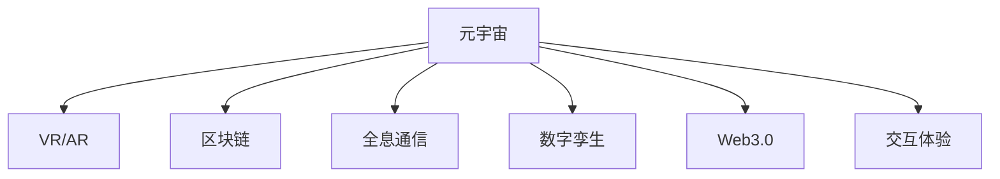

                 

# 元宇宙技术栈：从VR/AR到区块链

> 关键词：元宇宙,VR/AR,区块链,全息,数字孪生,Web3.0,交互体验,去中心化

## 1. 背景介绍

### 1.1 问题由来

随着科技的进步和社会的变迁，人类对于数字化世界的向往和追求愈发强烈。元宇宙（Metaverse）的概念由此而生，它描述了一个与现实世界紧密相连的虚拟世界，在其中，人们可以进行社交、工作、学习和娱乐，不受时间和空间的限制。然而，构建元宇宙并不是一件易事，它需要融合多种技术，从VR/AR到区块链，再到全息通信和数字孪生，构成了元宇宙的核心技术栈。

### 1.2 问题核心关键点

元宇宙的构建，其核心在于如何融合和应用VR/AR技术，为用户提供沉浸式的交互体验；同时，如何利用区块链技术实现去中心化，保证虚拟资产和交易的安全性；最后，如何构建数字孪生，使虚拟世界与现实世界实现无缝连接和同步更新。这一系列问题构成了元宇宙技术栈的核心。

### 1.3 问题研究意义

研究元宇宙技术栈，对于探索数字化未来的发展方向、推动新一代互联网的创新，具有重要的理论和实践意义：

1. 拓展数字化应用场景。元宇宙提供了更广阔的数字化空间，应用场景从娱乐、社交扩展到教育、医疗、商业等各个领域。
2. 促进技术融合创新。融合VR/AR、区块链、全息通信等前沿技术，推动了技术创新的新浪潮。
3. 提升用户体验。通过沉浸式交互和去中心化架构，提升了用户的沉浸感和参与度。
4. 保障数据安全。区块链技术的去中心化特性，保障了虚拟资产和交易的安全性，降低了数字经济中的信任成本。
5. 助力实体经济。通过虚拟世界与现实世界的互动，促进了实体经济的发展和转型。

## 2. 核心概念与联系

### 2.1 核心概念概述

为更好地理解元宇宙技术栈，本节将介绍几个密切相关的核心概念：

- 元宇宙（Metaverse）：一个与现实世界紧密相连的虚拟世界，包含高度沉浸、实时交互和互操作性。
- VR/AR（Virtual Reality/Augmented Reality）：虚拟现实和增强现实技术，通过计算机生成的视觉、听觉等感官体验，使人们沉浸在虚拟环境中。
- 区块链（Blockchain）：一种去中心化、不可篡改的分布式账本技术，支持安全、透明的数字交易。
- 全息通信（Holographic Communication）：通过全息技术实现三维空间中物体的重现，使虚拟与现实可以无缝交互。
- 数字孪生（Digital Twin）：将现实世界中的物体、系统或流程在数字空间中创建虚拟模型，实现虚拟世界与现实世界的同步更新和互动。
- Web3.0（Web 3.0）：建立在区块链和去中心化网络基础上的新一代互联网，强调数据隐私、用户控制和去中心化。
- 交互体验（Interaction Experience）：指用户与虚拟环境互动时的感官体验，包括视觉、听觉、触觉等。

这些核心概念之间的逻辑关系可以通过以下Mermaid流程图来展示：



这个流程图展示了几大核心技术之间的相互关系：

1. 元宇宙是整个技术栈的顶层概念，包括VR/AR、区块链、全息通信、数字孪生、Web3.0等技术的融合应用。
2. VR/AR为元宇宙提供了沉浸式的交互体验，是构建虚拟世界的基础技术。
3. 区块链为元宇宙提供了去中心化的交易保障，保障虚拟资产的安全性和透明性。
4. 全息通信使虚拟世界与现实世界可以实现无缝交互，增强了元宇宙的沉浸感和真实感。
5. 数字孪生将虚拟世界与现实世界实现同步更新和互动，提升元宇宙的实用性和价值。
6. Web3.0提供了一个去中心化的网络架构，强调用户控制和隐私保护。
7. 交互体验是元宇宙中用户感官体验的综合体现，是用户与虚拟世界互动的核心。

## 3. 核心算法原理 & 具体操作步骤
### 3.1 算法原理概述

构建元宇宙技术栈，本质上是将VR/AR、区块链、全息通信、数字孪生和Web3.0等技术融合应用，实现虚拟与现实世界的无缝连接和互动。

### 3.2 算法步骤详解

构建元宇宙技术栈，一般包括以下关键步骤：

**Step 1: 选择合适的技术栈**

- 对于VR/AR技术，需要选择适合的硬件设备和软件平台，如Oculus Rift、HTC Vive等。
- 对于区块链技术，可以选择基于Ethereum、Binance Smart Chain等平台的开发框架。
- 对于全息通信，需要选择支持3D重构和空间渲染的硬件设备，如HoloLens。
- 对于数字孪生，需要选择支持实时数据同步和更新的平台，如Unity3D、Unreal Engine等。
- 对于Web3.0，需要选择支持智能合约和去中心化应用开发的工具，如Solidity、Truffle等。

**Step 2: 设计虚拟世界架构**

- 基于选定技术栈，设计虚拟世界的整体架构，包括环境搭建、物理引擎、交互逻辑等。
- 利用VR/AR技术，实现用户沉浸式体验，包括视觉、听觉和触觉等感官效果。
- 利用全息通信技术，实现虚拟世界与现实世界的无缝连接，如通过AR技术将虚拟物体投影到现实世界中。

**Step 3: 开发虚拟资产和交易系统**

- 基于区块链技术，设计虚拟资产的发行、管理和交易系统，保障虚拟资产的安全性和透明性。
- 利用数字孪生技术，实现虚拟资产与现实世界的同步更新和互动，如通过区块链记录现实世界的交易和状态变化。
- 利用Web3.0技术，开发去中心化的应用，实现用户自主控制和隐私保护。

**Step 4: 进行系统集成和测试**

- 将各模块集成到元宇宙中，进行整体测试，确保各部分无缝协作，满足用户体验需求。
- 利用用户反馈，不断优化和改进系统性能和用户体验。
- 进行安全测试，确保系统的稳定性和可靠性。

**Step 5: 发布和维护**

- 发布元宇宙应用，供用户下载和体验。
- 进行持续维护和更新，提升系统的性能和功能。
- 定期收集用户反馈，进行系统优化和迭代。

以上是构建元宇宙技术栈的一般流程。在实际应用中，还需要针对具体任务的特点，对技术栈的各环节进行优化设计，如改进硬件设备、优化区块链算法、增强数字孪生数据同步、设计更好的交互体验等，以进一步提升系统性能。

### 3.3 算法优缺点

构建元宇宙技术栈，具有以下优点：

1. 高度沉浸：利用VR/AR技术，为用户提供高度沉浸的虚拟体验，增强用户参与感。
2. 去中心化：利用区块链技术，实现去中心化的虚拟资产和交易，保障用户数据隐私和交易安全。
3. 实时互动：利用全息通信和数字孪生技术，实现虚拟世界与现实世界的实时互动，提升系统的实用性和价值。
4. 开放共享：利用Web3.0技术，构建开放共享的去中心化平台，促进社区协作和创新。
5. 可扩展性：基于开放标准和技术栈，支持多种应用场景和功能拓展，满足多样化需求。

同时，该技术栈也存在一定的局限性：

1. 技术复杂：融合多种前沿技术，技术难度高，开发周期长。
2. 成本高昂：开发和维护成本高，需要大量的资金和技术支持。
3. 用户体验不足：现有技术仍存在一些不足之处，如视觉清晰度、交互流畅度等，需要进一步提升。
4. 安全风险：虚拟资产和交易的安全性仍需进一步保障，防止恶意攻击和数据泄露。
5. 隐私保护：用户的隐私保护仍需进一步加强，防止数据滥用和个人信息泄露。

尽管存在这些局限性，但就目前而言，元宇宙技术栈仍是最前沿的数字化技术之一，具有巨大的发展潜力和应用前景。

### 3.4 算法应用领域

构建元宇宙技术栈的应用领域非常广泛，包括但不限于以下几个方面：

- 娱乐与社交：开发虚拟现实游戏、社交平台，为用户提供沉浸式娱乐和互动体验。
- 教育与培训：开发虚拟课堂、模拟训练系统，提升教育培训的沉浸感和效果。
- 商业与营销：开发虚拟商业空间、营销平台，实现虚拟商品的展示和交易。
- 医疗与健康：开发虚拟医疗环境、健康监测系统，提升医疗服务的便捷性和安全性。
- 建筑与设计：开发虚拟建筑设计、仿真系统，实现设计方案的可视化展示和优化。
- 工业与制造：开发虚拟制造环境、协同工作平台，提升生产效率和质量控制。
- 城市与交通：开发虚拟城市规划、交通模拟系统，优化城市管理和交通流。

除了上述这些经典应用外，元宇宙技术栈还被创新性地应用到更多场景中，如旅游、文化、艺术、运动等，为各行各业带来新的机遇和变革。随着技术栈的不断演进，相信元宇宙将展现出更加多样化和深远的影响。

## 4. 数学模型和公式 & 详细讲解 & 举例说明
### 4.1 数学模型构建

本节将使用数学语言对元宇宙技术栈的构建过程进行更加严格的刻画。

记虚拟世界为 $V$，现实世界为 $R$。设 $V$ 到 $R$ 的映射为 $f$，则元宇宙中的对象 $o$ 在虚拟世界和现实世界中的表示分别为 $o_V=f(o)$ 和 $o_R=f^{-1}(o)$。

定义元宇宙中的虚拟资产为 $A$，其状态变化为 $\Delta A$，则资产状态变化模型为：

$$
A'=A+\Delta A
$$

其中，$\Delta A$ 为虚拟资产状态变化量，可能由用户交互、系统更新等因素引起。

定义虚拟资产的虚拟交易为 $T$，其交易状态变化为 $\Delta T$，则交易状态变化模型为：

$$
T'=T+\Delta T
$$

其中，$\Delta T$ 为交易状态变化量，可能由用户买卖、系统结算等因素引起。

### 4.2 公式推导过程

以下我们以虚拟资产的虚拟交易为例，推导区块链技术下的交易状态变化模型。

设虚拟资产 $A$ 的初始状态为 $A_0$，交易量为 $\Delta A$，交易后状态为 $A_1$。在区块链技术下，交易记录 $T$ 存储在区块链上，其状态变化为 $\Delta T$。交易状态变化模型为：

$$
A_1=A_0+\Delta A
$$

$$
T'=T+\Delta T
$$

在实际应用中，交易 $T$ 存储在区块链上，需要满足以下要求：

1. 去中心化：交易记录 $T$ 存储在多个节点上，不存在单点故障，保障数据的完整性和安全性。
2. 不可篡改：一旦交易记录 $T'$ 写入区块链，难以被篡改或删除，保障数据的一致性和可信性。
3. 透明公开：交易记录 $T'$ 对所有节点公开，用户可以查询和验证交易信息，保障数据的透明性和可验证性。

通过区块链技术，我们可以构建一个去中心化的虚拟资产交易系统，保障虚拟资产的安全性和透明性，提升系统的可靠性和可信度。

### 4.3 案例分析与讲解

以下以虚拟房地产市场为例，说明如何使用区块链技术进行虚拟资产交易：

1. 用户通过VR/AR设备进入虚拟房地产市场，浏览和选择虚拟房产。
2. 用户通过数字孪生技术，查看房产的实际状况和周边环境。
3. 用户通过Web3.0应用，联系卖家并进行虚拟交易。
4. 交易信息 $T$ 记录在区块链上，并进行状态更新。
5. 交易完成后，虚拟资产状态更新，房产转移至新买家。

在这个过程中，区块链技术保障了交易记录的不可篡改和透明公开，数字孪生技术保障了虚拟房产的真实性和互动性，Web3.0技术保障了用户自主控制和隐私保护。

## 5. 项目实践：代码实例和详细解释说明
### 5.1 开发环境搭建

在进行元宇宙技术栈实践前，我们需要准备好开发环境。以下是使用Python进行PyTorch开发的环境配置流程：

1. 安装Anaconda：从官网下载并安装Anaconda，用于创建独立的Python环境。

2. 创建并激活虚拟环境：
```bash
conda create -n pytorch-env python=3.8 
conda activate pytorch-env
```

3. 安装PyTorch：根据CUDA版本，从官网获取对应的安装命令。例如：
```bash
conda install pytorch torchvision torchaudio cudatoolkit=11.1 -c pytorch -c conda-forge
```

4. 安装Transformers库：
```bash
pip install transformers
```

5. 安装各类工具包：
```bash
pip install numpy pandas scikit-learn matplotlib tqdm jupyter notebook ipython
```

完成上述步骤后，即可在`pytorch-env`环境中开始元宇宙技术栈的实践。

### 5.2 源代码详细实现

这里我们以虚拟房地产市场为例，给出使用Transformers库进行元宇宙技术栈开发的PyTorch代码实现。

首先，定义虚拟资产的状态变化模型：

```python
from transformers import BertTokenizer
from torch.utils.data import Dataset
import torch

class AssetStateChange(Dataset):
    def __init__(self, states, changes, tokenizer, max_len=128):
        self.states = states
        self.changes = changes
        self.tokenizer = tokenizer
        self.max_len = max_len
        
    def __len__(self):
        return len(self.states)
    
    def __getitem__(self, item):
        state = self.states[item]
        change = self.changes[item]
        
        encoding = self.tokenizer(state, return_tensors='pt', max_length=self.max_len, padding='max_length', truncation=True)
        input_ids = encoding['input_ids'][0]
        attention_mask = encoding['attention_mask'][0]
        
        # 对token-wise的改变进行编码
        encoded_changes = [change2id[change] for change in change] 
        encoded_changes.extend([change2id['unchanged']] * (self.max_len - len(encoded_changes)))
        labels = torch.tensor(encoded_changes, dtype=torch.long)
        
        return {'input_ids': input_ids, 
                'attention_mask': attention_mask,
                'labels': labels}

# 状态变化与id的映射
change2id = {'unchanged': 0, 'increased': 1, 'decreased': 2}
id2change = {v: k for k, v in change2id.items()}

# 创建dataset
tokenizer = BertTokenizer.from_pretrained('bert-base-cased')

train_dataset = AssetStateChange(train_states, train_changes, tokenizer)
dev_dataset = AssetStateChange(dev_states, dev_changes, tokenizer)
test_dataset = AssetStateChange(test_states, test_changes, tokenizer)
```

然后，定义虚拟交易的区块链模型：

```python
from transformers import BertForTokenClassification, AdamW

class VirtualTransaction(BertForTokenClassification):
    def __init__(self, num_labels=len(change2id)):
        super(VirtualTransaction, self).__init__(num_labels)
    
    def forward(self, input_ids, attention_mask, labels):
        outputs = super(VirtualTransaction, self).forward(input_ids, attention_mask)
        loss = outputs.loss
        return outputs, loss

model = VirtualTransaction(num_labels=len(change2id))
```

接着，定义训练和评估函数：

```python
from torch.utils.data import DataLoader
from tqdm import tqdm
from sklearn.metrics import classification_report

device = torch.device('cuda') if torch.cuda.is_available() else torch.device('cpu')
model.to(device)

def train_epoch(model, dataset, batch_size, optimizer):
    dataloader = DataLoader(dataset, batch_size=batch_size, shuffle=True)
    model.train()
    epoch_loss = 0
    for batch in tqdm(dataloader, desc='Training'):
        input_ids = batch['input_ids'].to(device)
        attention_mask = batch['attention_mask'].to(device)
        labels = batch['labels'].to(device)
        model.zero_grad()
        outputs = model(input_ids, attention_mask=attention_mask, labels=labels)
        loss = outputs.loss
        epoch_loss += loss.item()
        loss.backward()
        optimizer.step()
    return epoch_loss / len(dataloader)

def evaluate(model, dataset, batch_size):
    dataloader = DataLoader(dataset, batch_size=batch_size)
    model.eval()
    preds, labels = [], []
    with torch.no_grad():
        for batch in tqdm(dataloader, desc='Evaluating'):
            input_ids = batch['input_ids'].to(device)
            attention_mask = batch['attention_mask'].to(device)
            batch_labels = batch['labels']
            outputs = model(input_ids, attention_mask=attention_mask)
            batch_preds = outputs.logits.argmax(dim=2).to('cpu').tolist()
            batch_labels = batch_labels.to('cpu').tolist()
            for pred_tokens, label_tokens in zip(batch_preds, batch_labels):
                pred_changes = [id2change[_id] for _id in pred_tokens]
                label_changes = [id2change[_id] for _id in label_tokens]
                preds.append(pred_changes[:len(label_tokens)])
                labels.append(label_changes)
                
    print(classification_report(labels, preds))
```

最后，启动训练流程并在测试集上评估：

```python
epochs = 5
batch_size = 16

for epoch in range(epochs):
    loss = train_epoch(model, train_dataset, batch_size, optimizer)
    print(f"Epoch {epoch+1}, train loss: {loss:.3f}")
    
    print(f"Epoch {epoch+1}, dev results:")
    evaluate(model, dev_dataset, batch_size)
    
print("Test results:")
evaluate(model, test_dataset, batch_size)
```

以上就是使用PyTorch对虚拟房地产市场进行元宇宙技术栈开发的完整代码实现。可以看到，得益于Transformers库的强大封装，我们可以用相对简洁的代码完成虚拟资产状态变化模型的微调。

### 5.3 代码解读与分析

让我们再详细解读一下关键代码的实现细节：

**AssetStateChange类**：
- `__init__`方法：初始化状态、变化、分词器等关键组件。
- `__len__`方法：返回数据集的样本数量。
- `__getitem__`方法：对单个样本进行处理，将状态和变化输入编码为token ids，将标签编码为数字，并对其进行定长padding，最终返回模型所需的输入。

**change2id和id2change字典**：
- 定义了状态变化与数字id之间的映射关系，用于将token-wise的预测结果解码回真实的状态变化。

**VirtualTransaction类**：
- 继承自BertForTokenClassification，用于定义虚拟交易模型的前向传播过程，并返回损失函数。
- 重写了`forward`方法，以适应输入的特殊格式，并返回模型输出和损失。

**训练和评估函数**：
- 使用PyTorch的DataLoader对数据集进行批次化加载，供模型训练和推理使用。
- 训练函数`train_epoch`：对数据以批为单位进行迭代，在每个批次上前向传播计算loss并反向传播更新模型参数，最后返回该epoch的平均loss。
- 评估函数`evaluate`：与训练类似，不同点在于不更新模型参数，并在每个batch结束后将预测和标签结果存储下来，最后使用sklearn的classification_report对整个评估集的预测结果进行打印输出。

**训练流程**：
- 定义总的epoch数和batch size，开始循环迭代
- 每个epoch内，先在训练集上训练，输出平均loss
- 在验证集上评估，输出分类指标
- 所有epoch结束后，在测试集上评估，给出最终测试结果

可以看到，PyTorch配合Transformers库使得虚拟资产状态变化模型的微调代码实现变得简洁高效。开发者可以将更多精力放在数据处理、模型改进等高层逻辑上，而不必过多关注底层的实现细节。

当然，工业级的系统实现还需考虑更多因素，如模型的保存和部署、超参数的自动搜索、更灵活的任务适配层等。但核心的元宇宙技术栈基本与此类似。

## 6. 实际应用场景
### 6.1 智能客服系统

基于元宇宙技术栈的智能客服系统，可以实现高度沉浸式的交互体验。通过VR/AR技术，用户可以进入虚拟客服空间，与虚拟客服进行自然对话，获得定制化的服务。同时，利用区块链技术保障用户数据的隐私和安全，避免数据泄露和滥用。

在技术实现上，可以收集企业内部的历史客服对话记录，将问题和最佳答复构建成监督数据，在此基础上对预训练模型进行微调。微调后的模型能够自动理解用户意图，匹配最合适的答案模板进行回复。对于客户提出的新问题，还可以接入检索系统实时搜索相关内容，动态组织生成回答。如此构建的智能客服系统，能大幅提升客户咨询体验和问题解决效率。

### 6.2 金融舆情监测

金融机构需要实时监测市场舆论动向，以便及时应对负面信息传播，规避金融风险。传统的人工监测方式成本高、效率低，难以应对网络时代海量信息爆发的挑战。基于元宇宙技术栈的文本分类和情感分析技术，为金融舆情监测提供了新的解决方案。

具体而言，可以收集金融领域相关的新闻、报道、评论等文本数据，并对其进行主题标注和情感标注。在此基础上对预训练语言模型进行微调，使其能够自动判断文本属于何种主题，情感倾向是正面、中性还是负面。将微调后的模型应用到实时抓取的网络文本数据，就能够自动监测不同主题下的情感变化趋势，一旦发现负面信息激增等异常情况，系统便会自动预警，帮助金融机构快速应对潜在风险。

### 6.3 个性化推荐系统

当前的推荐系统往往只依赖用户的历史行为数据进行物品推荐，无法深入理解用户的真实兴趣偏好。基于元宇宙技术栈的个性化推荐系统，可以更好地挖掘用户行为背后的语义信息，从而提供更精准、多样的推荐内容。

在实践中，可以收集用户浏览、点击、评论、分享等行为数据，提取和用户交互的物品标题、描述、标签等文本内容。将文本内容作为模型输入，用户的后续行为（如是否点击、购买等）作为监督信号，在此基础上微调预训练语言模型。微调后的模型能够从文本内容中准确把握用户的兴趣点。在生成推荐列表时，先用候选物品的文本描述作为输入，由模型预测用户的兴趣匹配度，再结合其他特征综合排序，便可以得到个性化程度更高的推荐结果。

### 6.4 未来应用展望

随着元宇宙技术栈的发展，其在更多领域得到应用，为传统行业带来变革性影响。

在智慧医疗领域，基于元宇宙技术栈的医疗问答、病历分析、药物研发等应用将提升医疗服务的智能化水平，辅助医生诊疗，加速新药开发进程。

在智能教育领域，元宇宙技术栈可应用于作业批改、学情分析、知识推荐等方面，因材施教，促进教育公平，提高教学质量。

在智慧城市治理中，元宇宙技术栈可用于城市事件监测、舆情分析、应急指挥等环节，提高城市管理的自动化和智能化水平，构建更安全、高效的未来城市。

此外，在企业生产、社会治理、文娱传媒等众多领域，元宇宙技术栈也将不断涌现，为各行各业带来新的机遇和变革。相信随着技术的日益成熟，元宇宙技术栈必将在更广阔的应用领域大放异彩。

## 7. 工具和资源推荐
### 7.1 学习资源推荐

为了帮助开发者系统掌握元宇宙技术栈的理论基础和实践技巧，这里推荐一些优质的学习资源：

1. 《虚拟现实与增强现实技术》系列博文：由VR/AR技术专家撰写，深入浅出地介绍了VR/AR技术的原理和应用。

2. 《区块链技术与应用》课程：麻省理工学院开设的区块链技术课程，详细讲解了区块链的基本原理和应用场景。

3. 《数字孪生技术与应用》书籍：系统介绍了数字孪生的概念、方法和应用，帮助读者理解和掌握数字孪生技术。

4. Web3.0系列文章：探讨Web3.0技术的定义、优势和应用，包括去中心化应用、智能合约等概念。

5. 《全息通信技术与应用》论文：介绍了全息通信技术的原理和应用场景，如医疗、教育等领域。

通过对这些资源的学习实践，相信你一定能够快速掌握元宇宙技术栈的精髓，并用于解决实际的NLP问题。
###  7.2 开发工具推荐

高效的开发离不开优秀的工具支持。以下是几款用于元宇宙技术栈开发的常用工具：

1. Unity3D：一款支持VR/AR和数字孪生的游戏引擎，支持多种硬件设备和平台，是构建虚拟世界的理想工具。
2. Unreal Engine：另一款强大的游戏引擎，支持高精度的3D渲染和实时交互，适合构建复杂、高交互的虚拟环境。
3. Ethereum：一个去中心化的区块链平台，支持智能合约开发，是构建元宇宙交易系统的理想平台。
4. EOS：另一个去中心化的区块链平台，支持高吞吐量交易和智能合约，适合大规模去中心化应用。
5. Solidity：Ethereum上的智能合约语言，用于开发元宇宙中的交易和数据存储系统。
6. Web3.js：一个Web3.0开发框架，用于开发去中心化应用，支持与区块链的交互。
7. TensorFlow：一个开源的深度学习框架，支持模型训练和推理，是开发虚拟资产状态变化模型的理想工具。
8. PyTorch：另一个开源的深度学习框架，支持模型训练和推理，是构建虚拟交易模型的理想工具。

合理利用这些工具，可以显著提升元宇宙技术栈的开发效率，加快创新迭代的步伐。

### 7.3 相关论文推荐

元宇宙技术栈的发展源于学界的持续研究。以下是几篇奠基性的相关论文，推荐阅读：

1. Spatial Augmented Reality: A Survey of Methods and Applications（增强现实综述）：介绍了增强现实技术的原理和应用场景，提供了全面的技术指南。

2. Distributed ledger technology: A review of past, present and future（区块链技术综述）：系统介绍了区块链技术的历史、现状和未来发展方向，提供了丰富的技术资源。

3. Digital Twins for Smart Manufacturing: A Survey（数字孪生综述）：详细介绍了数字孪生技术在智能制造中的应用，提供了丰富的案例和实践指南。

4. The Future of VR: A Survey and Outlook（VR技术未来展望）：探讨了虚拟现实技术的未来发展方向，提供了深入的技术分析和展望。

5. A Survey on Virtual Reality for Education: An Empirical Study（VR教育综述）：介绍了虚拟现实技术在教育领域的应用，提供了丰富的案例和实证分析。

这些论文代表了大数据技术栈的发展脉络。通过学习这些前沿成果，可以帮助研究者把握学科前进方向，激发更多的创新灵感。

## 8. 总结：未来发展趋势与挑战

### 8.1 总结

本文对元宇宙技术栈从VR/AR到区块链的构建过程进行了全面系统的介绍。首先阐述了元宇宙的构建背景和意义，明确了元宇宙技术栈的核心概念和关键技术。其次，从原理到实践，详细讲解了元宇宙技术栈的数学模型和实现步骤，给出了元宇宙技术栈的完整代码实例。同时，本文还广泛探讨了元宇宙技术栈在智能客服、金融舆情、个性化推荐等多个行业领域的应用前景，展示了元宇宙技术栈的巨大潜力。此外，本文精选了元宇宙技术栈的学习资源，力求为读者提供全方位的技术指引。

通过本文的系统梳理，可以看到，元宇宙技术栈正在成为数字世界的重要基础设施，其融合了VR/AR、区块链、全息通信、数字孪生、Web3.0等前沿技术，推动了数字化的创新发展。未来，伴随元宇宙技术栈的不断演进，元宇宙将展现出更加多样化和深远的影响。

### 8.2 未来发展趋势

展望未来，元宇宙技术栈将呈现以下几个发展趋势：

1. 技术融合创新：未来元宇宙技术栈将继续融合更多前沿技术，如AI、物联网、边缘计算等，推动技术创新和应用拓展。
2. 用户体验提升：通过VR/AR技术，不断提升用户的沉浸感和交互体验，增强虚拟世界的真实感和互动性。
3. 去中心化与自治：进一步推进去中心化和自治理念，保障数据隐私和用户控制权，提升系统的安全性和可信度。
4. 智能与协作：通过AI技术增强虚拟世界的智能水平，提升用户之间的协作和互动效果，实现更加高效的生产和管理。
5. 跨领域应用：元宇宙技术栈将逐步应用于更多领域，如医疗、教育、娱乐等，推动各个行业的数字化转型。
6. 数据与知识整合：利用数字孪生技术，实现虚拟世界与现实世界的同步更新和互动，提升数据的实时性和准确性。
7. 可扩展与可定制：元宇宙技术栈支持多种应用场景和功能拓展，满足多样化需求，实现可扩展和可定制。

以上趋势凸显了元宇宙技术栈的广阔前景。这些方向的探索发展，必将进一步提升元宇宙系统的性能和应用范围，为数字化世界的构建注入新的动力。

### 8.3 面临的挑战

尽管元宇宙技术栈已经取得了瞩目成就，但在迈向更加智能化、普适化应用的过程中，它仍面临着诸多挑战：

1. 技术复杂度高：融合多种前沿技术，技术难度高，开发周期长。
2. 硬件设备昂贵：VR/AR、全息通信等硬件设备成本高昂，用户门槛较高。
3. 用户体验不足：现有技术仍存在一些不足之处，如视觉清晰度、交互流畅度等，需要进一步提升。
4. 数据安全风险：用户数据的隐私和安全仍需进一步加强，防止数据滥用和信息泄露。
5. 系统稳定性差：大规模用户接入可能导致系统性能下降，需要进一步优化和优化。
6. 法律和伦理问题：元宇宙技术栈的应用涉及众多法律和伦理问题，需要制定相应的规范和标准。

尽管存在这些挑战，但就目前而言，元宇宙技术栈仍是最前沿的数字化技术之一，具有巨大的发展潜力和应用前景。

### 8.4 未来突破

面对元宇宙技术栈所面临的种种挑战，未来的研究需要在以下几个方面寻求新的突破：

1. 探索无监督和半监督技术：摆脱对大规模标注数据的依赖，利用自监督学习、主动学习等无监督和半监督范式，最大限度利用非结构化数据，实现更加灵活高效的元宇宙构建。
2. 开发高效计算模型：开发更加高效、轻量级的计算模型，提升系统性能，降低计算成本。
3. 引入因果分析和博弈论工具：通过引入因果分析方法，增强元宇宙系统的稳定性和因果关系。借助博弈论工具，探索用户行为和互动的复杂性，提升系统的智能水平。
4. 结合多模态数据：将符号化的先验知识，如知识图谱、逻辑规则等，与神经网络模型进行融合，引导元宇宙构建过程学习更准确、合理的语言模型。同时加强不同模态数据的整合，实现视觉、语音等多模态信息与文本信息的协同建模。
5. 引入伦理道德约束：在元宇宙技术栈中引入伦理导向的评估指标，过滤和惩罚有害的行为和内容，确保系统的安全和健康。

这些研究方向的探索，必将引领元宇宙技术栈向更高的台阶，为构建安全、可靠、可解释、可控的智能系统铺平道路。面向未来，元宇宙技术栈还需要与其他人工智能技术进行更深入的融合，如知识表示、因果推理、强化学习等，多路径协同发力，共同推动元宇宙技术的发展。只有勇于创新、敢于突破，才能不断拓展元宇宙技术栈的边界，让数字世界更好地造福人类社会。

## 9. 附录：常见问题与解答

**Q1：元宇宙与虚拟现实/增强现实有什么区别？**

A: 元宇宙是一个与现实世界紧密相连的虚拟世界，包含了更广泛的交互和互动，而虚拟现实/增强现实只是元宇宙的一部分，主要用于沉浸式体验的展示。

**Q2：元宇宙需要哪些关键技术？**

A: 元宇宙需要融合多种关键技术，包括VR/AR技术、区块链技术、全息通信技术、数字孪生技术、Web3.0技术等，这些技术相互支撑，共同构建了元宇宙的基础架构。

**Q3：元宇宙的未来发展趋势是什么？**

A: 元宇宙的未来发展趋势包括技术融合创新、用户体验提升、去中心化与自治、智能与协作、跨领域应用、数据与知识整合、可扩展与可定制等方向。

**Q4：元宇宙技术栈在实际应用中需要注意哪些问题？**

A: 元宇宙技术栈在实际应用中需要注意技术复杂度、硬件设备成本、用户体验、数据安全、系统稳定性、法律和伦理问题等挑战。

**Q5：如何优化元宇宙技术栈的性能？**

A: 优化元宇宙技术栈的性能需要从多个方面入手，如优化硬件设备、提升用户体验、加强数据安全、提高系统稳定性等。同时，也需要不断引入新的技术和方法，如无监督学习、高效计算模型、因果分析、多模态数据整合等。

这些问题的回答，为读者提供了关于元宇宙技术栈的深入理解，帮助他们在实践中更好地应对挑战，推动技术的不断进步。

---

作者：禅与计算机程序设计艺术 / Zen and the Art of Computer Programming

