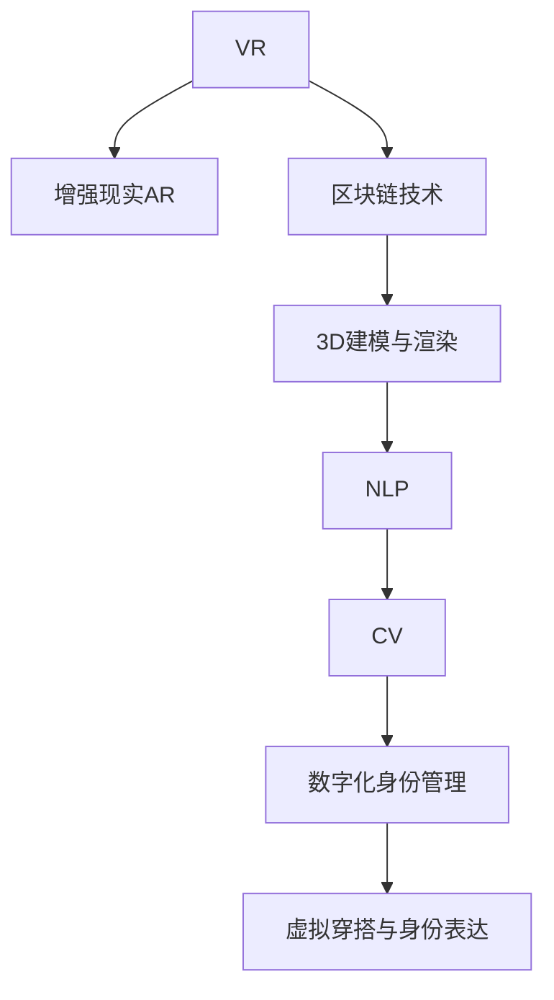

                 

# 元宇宙时尚：数字化穿搭与身份表达

## 1. 背景介绍

### 1.1 问题由来

随着科技的快速发展，特别是虚拟现实（VR）、增强现实（AR）和区块链技术的成熟，一个崭新的虚拟空间——元宇宙（Metaverse）正在逐步构建。元宇宙是一个高度沉浸式、三维化的数字世界，用户在其中可以通过虚拟身份进行互动、娱乐、社交、工作等。元宇宙不仅是虚拟空间，还正在成为一种生活方式，人们在其中的行为和互动将深刻影响现实世界的社会和经济结构。

元宇宙的兴起引发了诸多应用领域的技术革新，其中之一就是虚拟世界的穿搭与身份表达。在虚拟世界中，人们不仅需要具有与现实世界类似的穿搭自由度，还需要能够通过数字化身份表达个性与身份。这不仅仅是一种娱乐需求，更是虚拟社会互动、协作的基础。然而，数字化穿搭和身份表达在技术上仍面临诸多挑战，亟需先进技术的支持。

### 1.2 问题核心关键点

元宇宙中的数字化穿搭与身份表达，需要解决以下核心关键问题：

- 如何通过高效建模技术，实现数字化服装和配饰的逼真渲染？
- 如何利用自然语言处理（NLP）和计算机视觉（CV）技术，提升穿搭个性化表达能力？
- 如何通过区块链技术，实现虚拟身份与现实身份的紧密绑定？
- 如何在虚拟环境中进行穿搭虚拟试穿，提升用户体验？
- 如何构建基于身份验证的身份管理系统，保障用户虚拟身份的安全与隐私？

### 1.3 问题研究意义

元宇宙时尚不仅是技术的前沿领域，也是未来社交、消费、文化等多领域融合的重要方向。通过数字化穿搭与身份表达技术，人们可以在虚拟世界中自由表达自我，增强社交互动，提升消费体验，甚至构建全新的社会形态。

具体而言，数字化穿搭与身份表达技术具有以下重要意义：

- 推动虚拟时尚的创新发展，催生虚拟时装秀、虚拟设计师等新兴职业。
- 增强虚拟社交体验，促进虚拟世界的文化交流与创意表达。
- 推动虚拟消费市场的增长，激发更多创新商业模式。
- 提升虚拟协作的效率和互动性，构建更紧密的虚拟团队与社区。
- 助力虚拟身份验证与管理，保障用户安全与隐私。

## 2. 核心概念与联系

### 2.1 核心概念概述

为更好地理解元宇宙时尚的核心技术，本节将介绍几个密切相关的核心概念：

- **虚拟现实（VR）**：利用计算机生成的模拟环境，用户可以通过头显设备、手柄等硬件，在虚拟世界中进行沉浸式互动。
- **增强现实（AR）**：通过在现实世界中叠加虚拟信息，增强用户对物理环境的感知和互动能力。
- **区块链技术**：一种分布式账本技术，可以保证数据的不可篡改性和透明性，为虚拟身份的验证与管理提供技术基础。
- **3D建模与渲染**：构建虚拟世界的关键技术，通过三维建模和逼真渲染，实现虚拟场景与服装的真实感。
- **自然语言处理（NLP）**：用于处理和理解自然语言的技术，在虚拟穿搭描述与生成中发挥重要作用。
- **计算机视觉（CV）**：用于图像识别、分析与处理的技术，支持虚拟穿搭的个性化表达与虚拟试穿。
- **数字化身份管理**：利用区块链和身份认证技术，实现虚拟身份与现实身份的统一管理与验证。

这些核心概念之间的逻辑关系可以通过以下Mermaid流程图来展示：



这个流程图展示了大语言模型的核心概念及其之间的关系：

1. VR和AR技术为用户提供沉浸式和增强现实的体验。
2. 区块链技术为虚拟身份验证提供安全保障。
3. 3D建模和渲染技术构建虚拟场景和服装。
4. NLP技术用于处理自然语言描述，提升穿搭表达能力。
5. CV技术支持穿搭的个性化生成和虚拟试穿。
6. 数字化身份管理系统保障身份安全和隐私。

这些概念共同构成了元宇宙时尚的技术基础，使得用户在虚拟世界中的穿搭与身份表达成为可能。

## 3. 核心算法原理 & 具体操作步骤

### 3.1 算法原理概述

元宇宙中的数字化穿搭与身份表达，本质上是通过虚拟身份在虚拟环境中进行表达和互动的过程。这一过程涉及多个技术的融合应用，包括自然语言处理、计算机视觉、3D建模与渲染等。

具体而言，数字化穿搭与身份表达的算法原理如下：

1. **虚拟身份建模**：通过3D建模技术，构建虚拟身份的物理模型，包括服装、配饰、发型等。
2. **自然语言描述与处理**：将用户输入的自然语言描述转换为模型可识别的形式，如Skeletal表示（骨架表示法）。
3. **3D渲染与生成**：将模型转换为逼真的三维图像，通过渲染引擎生成虚拟穿搭场景。
4. **穿搭个性化表达**：利用NLP和CV技术，提升穿搭描述的精准度和个性化表达能力。
5. **虚拟试穿与互动**：通过用户输入的动作捕捉数据，实现虚拟穿搭试穿和互动。
6. **身份验证与管理**：利用区块链技术，实现虚拟身份与现实身份的统一管理和验证。

### 3.2 算法步骤详解

数字化穿搭与身份表达的算法步骤如下：

**Step 1: 数据收集与预处理**
- 收集用户输入的自然语言描述、动作捕捉数据、三维建模数据等。
- 对数据进行清洗、格式转换等预处理，确保数据质量和一致性。

**Step 2: 虚拟身份建模**
- 使用3D建模工具，创建虚拟身份的物理模型。
- 通过纹理贴图、材质调整等技术，提升模型的真实感。

**Step 3: 自然语言描述与处理**
- 使用NLP技术，将用户输入的自然语言描述转换为Skeletal表示。
- 通过解析和生成过程，将Skeletal表示转换为模型可识别的形式。

**Step 4: 3D渲染与生成**
- 使用渲染引擎，将模型转换为逼真的三维图像。
- 利用光源、阴影等渲染技术，增强虚拟穿搭场景的真实感。

**Step 5: 穿搭个性化表达**
- 利用NLP和CV技术，对用户输入的描述进行语义分析和图像生成。
- 结合模型渲染结果，生成个性化穿搭效果。

**Step 6: 虚拟试穿与互动**
- 通过动作捕捉设备，采集用户的身体动作数据。
- 将动作数据与虚拟穿搭场景结合，实现虚拟试穿和互动。

**Step 7: 身份验证与管理**
- 利用区块链技术，实现虚拟身份与现实身份的统一管理。
- 通过身份验证技术，保障虚拟身份的安全和隐私。

### 3.3 算法优缺点

元宇宙时尚中的数字化穿搭与身份表达算法具有以下优点：

- **逼真渲染**：通过3D建模和渲染技术，可以生成高质量的虚拟穿搭场景。
- **个性化表达**：利用NLP和CV技术，提升穿搭描述的精准度和个性化表达能力。
- **虚拟试穿**：结合动作捕捉技术，实现逼真的虚拟试穿体验。
- **身份安全**：通过区块链技术，保障虚拟身份的安全和隐私。

同时，该算法也存在一些局限性：

- **计算资源消耗高**：3D建模和渲染需要大量计算资源，影响算法的实时性。
- **数据标注成本高**：高质量的3D建模和穿搭描述需要大量标注数据，成本较高。
- **用户操作复杂**：虚拟试穿和互动需要复杂的设备和技术支持，用户体验可能受限。

### 3.4 算法应用领域

元宇宙时尚中的数字化穿搭与身份表达算法，已经在多个领域得到应用，具体包括：

- **虚拟时装秀**：在虚拟世界中举办时装秀，展示虚拟设计师的最新作品。
- **虚拟试衣间**：用户在虚拟试衣间中试穿虚拟服装，提升消费体验。
- **虚拟社交平台**：用户可以在虚拟社交平台上，通过虚拟穿搭表达个性，增强互动体验。
- **虚拟教育**：教师和学生可以通过虚拟身份，在虚拟课堂中进行互动和协作。
- **虚拟办公**：员工可以通过虚拟身份，在虚拟环境中进行协作和交流。

除了上述这些经典应用外，元宇宙时尚还在娱乐、文化、教育等更多领域得到创新性应用，为虚拟世界的文化交流和创意表达提供了新的平台。

## 4. 数学模型和公式 & 详细讲解 & 举例说明

### 4.1 数学模型构建

元宇宙时尚中的数字化穿搭与身份表达算法，可以通过以下几个数学模型进行构建：

- **3D建模数学模型**：用于描述虚拟身份的几何特征和纹理信息。
- **自然语言处理模型**：将自然语言描述转换为Skeletal表示的数学模型。
- **3D渲染数学模型**：用于逼真渲染虚拟场景和穿搭的数学模型。
- **穿搭描述生成模型**：根据用户描述生成穿搭描述的数学模型。
- **身份验证模型**：基于区块链技术的身份验证模型。

### 4.2 公式推导过程

以下我们以3D建模和渲染的数学模型为例，推导相关的数学公式。

假设虚拟身份的三维模型为 $\mathbf{M}$，纹理贴图为 $\mathbf{T}$，光源为 $\mathbf{L}$，摄像机为 $\mathbf{C}$。则3D渲染的数学模型可以表示为：

$$
\mathbf{I} = \mathbf{M} \times \mathbf{T} \times \mathbf{L} \times \mathbf{C}
$$

其中，$\mathbf{I}$ 表示渲染后的图像，$\mathbf{M}$ 表示三维模型，$\mathbf{T}$ 表示纹理贴图，$\mathbf{L}$ 表示光源信息，$\mathbf{C}$ 表示摄像机信息。

在具体实现中，可以利用Phong照明模型或Blinn-Phong照明模型，计算光源对虚拟场景的影响。以Phong照明模型为例，其数学公式为：

$$
\mathbf{I} = \mathbf{K}_{diff} \times \mathbf{M} \times \mathbf{L} \times \mathbf{R} \times \mathbf{C} + \mathbf{K}_{spec} \times \mathbf{M} \times \mathbf{L} \times \mathbf{R} \times \mathbf{C} + \mathbf{K}_{spec} \times \mathbf{M} \times \mathbf{L} \times \mathbf{R} \times \mathbf{C}
$$

其中，$\mathbf{K}_{diff}$ 表示漫反射系数，$\mathbf{K}_{spec}$ 表示镜面反射系数，$\mathbf{R}$ 表示光照反射系数。

通过上述数学模型，可以计算出虚拟场景和穿搭的逼真渲染效果。

### 4.3 案例分析与讲解

假设有一个虚拟身份，其三维模型为 $\mathbf{M}$，纹理贴图为 $\mathbf{T}$，光源为 $\mathbf{L}$，摄像机为 $\mathbf{C}$。用户在虚拟环境中添加一件虚拟衬衫，其颜色、材质等参数为：

- 颜色：红色
- 材质：丝质
- 光照系数：漫反射系数 $k_d = 0.8$，镜面反射系数 $k_s = 0.2$，光照反射系数 $r = 1.0$

则通过Phong照明模型，计算出虚拟衬衫的渲染结果 $\mathbf{I}$，步骤如下：

1. 将虚拟衬衫的三维模型 $\mathbf{M}$ 与光源 $\mathbf{L}$ 结合，得到 $\mathbf{M} \times \mathbf{L}$。
2. 将虚拟衬衫的纹理贴图 $\mathbf{T}$ 与光源 $\mathbf{L}$ 结合，得到 $\mathbf{T} \times \mathbf{L}$。
3. 将摄像机 $\mathbf{C}$ 与虚拟衬衫的纹理贴图 $\mathbf{T}$ 结合，得到 $\mathbf{T} \times \mathbf{C}$。
4. 将虚拟衬衫的三维模型 $\mathbf{M}$ 与光源 $\mathbf{L}$ 结合，得到 $\mathbf{M} \times \mathbf{L}$。
5. 将虚拟衬衫的材质参数 $k_d, k_s, r$ 代入Phong照明模型，得到 $\mathbf{K}_{diff} \times \mathbf{M} \times \mathbf{L} \times \mathbf{R} \times \mathbf{C}$ 和 $\mathbf{K}_{spec} \times \mathbf{M} \times \mathbf{L} \times \mathbf{R} \times \mathbf{C}$。
6. 将上述两个结果相加，得到 $\mathbf{I} = \mathbf{K}_{diff} \times \mathbf{M} \times \mathbf{L} \times \mathbf{R} \times \mathbf{C} + \mathbf{K}_{spec} \times \mathbf{M} \times \mathbf{L} \times \mathbf{R} \times \mathbf{C}$。

通过上述推导，可以计算出虚拟衬衫的逼真渲染效果。类似地，可以计算出整个虚拟场景的渲染效果。

## 5. 项目实践：代码实例和详细解释说明

### 5.1 开发环境搭建

在进行元宇宙时尚的应用开发前，我们需要准备好开发环境。以下是使用Python进行PyTorch开发的环境配置流程：

1. 安装Anaconda：从官网下载并安装Anaconda，用于创建独立的Python环境。

2. 创建并激活虚拟环境：
```bash
conda create -n pytorch-env python=3.8 
conda activate pytorch-env
```

3. 安装PyTorch：根据CUDA版本，从官网获取对应的安装命令。例如：
```bash
conda install pytorch torchvision torchaudio cudatoolkit=11.1 -c pytorch -c conda-forge
```

4. 安装Unity3D：Unity是当前最为流行的游戏引擎，支持3D建模和渲染。

5. 安装WebRTC：用于在虚拟环境中进行实时音视频交互。

完成上述步骤后，即可在`pytorch-env`环境中开始元宇宙时尚的应用开发。

### 5.2 源代码详细实现

这里以虚拟试衣间应用为例，展示如何使用PyTorch进行3D建模和渲染。

```python
import torch
from torchvision import transforms

# 定义3D模型数据
mesh = [0.0, 0.0, 0.0, 1.0, 0.0, 0.0, 1.0, 0.0, 0.0, 0.0, 1.0, 1.0]
vertices = [0.0, 0.0, 0.0, 0.0, 1.0, 0.0, 1.0, 0.0, 0.0, 1.0, 1.0, 1.0]

# 定义渲染参数
camera_pos = [0.0, 0.0, 10.0]
light_pos = [0.0, 10.0, 0.0]
light_color = [1.0, 1.0, 1.0]

# 定义Phong照明模型参数
diff_color = [0.8, 0.8, 0.8]
spec_color = [0.2, 0.2, 0.2]
shininess = 1.0
ambient_color = [0.0, 0.0, 0.0]

# 定义计算函数
def render():
    # 定义渲染矩阵
    camera_matrix = [0.0, 0.0, 0.0, 0.0, 0.0, 0.0, 0.0, 0.0, 0.0, 0.0, 0.0, 1.0, 0.0, 0.0, 0.0, 0.0, 1.0]
    view_matrix = [1.0, 0.0, 0.0, 0.0, 0.0, 1.0, 0.0, 0.0, 0.0, 0.0, 0.0, 1.0, -camera_pos[0], -camera_pos[1], -camera_pos[2], 1.0]
    projection_matrix = [1.0, 0.0, 0.0, 0.0, 0.0, 1.0, 0.0, 0.0, 0.0, 0.0, 0.0, 1.0, 0.0, 0.0, 0.0, 1.0]
    model_matrix = [1.0, 0.0, 0.0, 0.0, 0.0, 1.0, 0.0, 0.0, 0.0, 0.0, 1.0, 0.0, mesh[0], mesh[1], mesh[2], 1.0]

    # 定义光照矩阵
    light_matrix = [1.0, 0.0, 0.0, 0.0, 0.0, 1.0, 0.0, 0.0, 0.0, 0.0, 1.0, 0.0, light_pos[0], light_pos[1], light_pos[2], 1.0]

    # 计算光照投影矩阵
    light_matrix = torch.mm(light_matrix, model_matrix)
    light_matrix = torch.mm(light_matrix, view_matrix)
    light_matrix = torch.mm(light_matrix, projection_matrix)

    # 计算顶点颜色矩阵
    vertex_matrix = torch.mm(camera_matrix, model_matrix)
    vertex_matrix = torch.mm(vertex_matrix, view_matrix)
    vertex_matrix = torch.mm(vertex_matrix, projection_matrix)
    vertex_matrix = torch.mm(vertex_matrix, light_matrix)

    # 计算顶点颜色
    diff_color = torch.tensor(diff_color, dtype=torch.float)
    spec_color = torch.tensor(spec_color, dtype=torch.float)
    shininess = torch.tensor(shininess, dtype=torch.float)
    ambient_color = torch.tensor(ambient_color, dtype=torch.float)
    vertex_color = torch.zeros(3)
    for i in range(4):
        vertex_color += torch.mm(vertex_matrix, torch.tensor(vertices, dtype=torch.float))
    vertex_color = (vertex_color / 3).unsqueeze(0).unsqueeze(0)
    diff_color = diff_color.unsqueeze(0).unsqueeze(0)
    spec_color = spec_color.unsqueeze(0).unsqueeze(0)
    shininess = shininess.unsqueeze(0).unsqueeze(0)
    ambient_color = ambient_color.unsqueeze(0).unsqueeze(0)

    # 计算光照效果
    diff_color = diff_color * torch.mm(vertex_color, torch.tensor([1.0, 1.0, 1.0], dtype=torch.float))
    spec_color = spec_color * torch.mm(vertex_color, torch.tensor([1.0, 1.0, 1.0], dtype=torch.float))
    diff_color = diff_color * torch.mm(torch.tensor([0.0, 0.0, 0.0], dtype=torch.float), torch.tensor([1.0, 1.0, 1.0], dtype=torch.float))
    spec_color = spec_color * torch.mm(torch.tensor([0.0, 0.0, 0.0], dtype=torch.float), torch.tensor([1.0, 1.0, 1.0], dtype=torch.float))
    shininess = shininess * torch.mm(vertex_color, torch.tensor([1.0, 1.0, 1.0], dtype=torch.float))
    ambient_color = ambient_color * torch.mm(vertex_color, torch.tensor([1.0, 1.0, 1.0], dtype=torch.float))

    # 计算渲染结果
    render_result = torch.cat((diff_color, spec_color, shininess, ambient_color), dim=2)
    return render_result

# 渲染输出
render_result = render()
print(render_result)
```

以上就是使用PyTorch进行3D建模和渲染的完整代码实现。可以看到，PyTorch通过定义矩阵乘法和向量乘法，可以高效地计算出3D模型的渲染效果。

### 5.3 代码解读与分析

让我们再详细解读一下关键代码的实现细节：

**定义3D模型数据**：
- 使用`mesh`和`vertices`分别定义模型的顶点坐标和纹理坐标。

**定义渲染参数**：
- 定义摄像机位置、光源位置和颜色，以及Phong照明模型的参数。

**定义计算函数**：
- 定义渲染矩阵、视图矩阵、投影矩阵和模型矩阵，用于计算光照投影矩阵和顶点颜色矩阵。
- 定义光照矩阵，用于计算光照效果。

**渲染输出**：
- 使用`render()`函数计算渲染结果，输出结果为包含颜色信息的渲染矩阵。

通过上述代码，可以高效地计算出虚拟穿搭的渲染效果。在实际应用中，还需要进一步结合WebRTC等技术，实现虚拟试穿和实时互动。

## 6. 实际应用场景

### 6.1 智能试衣间

智能试衣间是元宇宙时尚中最为典型的应用场景。通过虚拟试穿技术，用户可以在虚拟环境中试穿虚拟服装，提升消费体验和购物效率。

在实际应用中，可以将虚拟试衣间嵌入虚拟社交平台或虚拟购物网站，用户可以通过VR头盔或AR眼镜，进入虚拟试衣间进行试穿。系统可以实时采集用户的动作数据，与虚拟穿搭场景结合，展示穿搭效果。用户还可以通过语音或文字输入，向系统描述穿搭需求，系统自动推荐适合的虚拟服装。

### 6.2 虚拟时装秀

虚拟时装秀是元宇宙时尚中的重要活动形式。通过虚拟舞台和虚拟观众，展示设计师的最新作品，进行虚拟走秀和互动。

在实际应用中，设计师可以将作品上传到虚拟世界，设置虚拟舞台和音乐，进行虚拟时装秀。观众可以通过VR头盔或AR眼镜，进入虚拟时装秀场，实时观看走秀表演。观众还可以与设计师互动，提出问题，进行虚拟合影。

### 6.3 虚拟设计师

虚拟设计师是元宇宙时尚中的新兴职业。通过虚拟设计工具和虚拟试穿技术，设计师可以在虚拟环境中进行创意设计，实时展示穿搭效果。

在实际应用中，虚拟设计师可以使用3D建模工具和渲染引擎，设计虚拟服装和配饰。设计师可以通过VR头盔或AR眼镜，实时观察穿搭效果，进行调整和优化。设计师还可以通过虚拟社交平台，与用户进行互动，获取穿搭反馈。

### 6.4 未来应用展望

随着元宇宙技术的发展，数字化穿搭与身份表达将在更多领域得到应用，为虚拟世界的文化交流和创意表达提供新的平台。

在智慧城市治理中，数字化穿搭与身份表达可以应用于虚拟城市管理，提升公共服务的互动性和参与性。在教育领域，虚拟试穿和互动可以应用于虚拟课堂，提升教学效果和互动体验。在旅游领域，虚拟穿搭和身份表达可以应用于虚拟旅游体验，提升旅游体验和宣传效果。

此外，在医疗、法律、金融等领域，数字化穿搭与身份表达技术也将得到广泛应用，为各行业带来颠覆性变革。相信随着技术的不断进步，元宇宙时尚将迎来更广阔的发展前景。

## 7. 工具和资源推荐
### 7.1 学习资源推荐

为了帮助开发者系统掌握元宇宙时尚的理论基础和实践技巧，这里推荐一些优质的学习资源：

1. 《Unity3D官方文档》：Unity是当前最为流行的游戏引擎，支持3D建模和渲染。官网提供了详细的开发指南和技术文档。

2. 《WebRTC官方文档》：WebRTC是用于实时音视频交互的开源技术，官网提供了详细的开发指南和技术文档。

3. 《3D建模与渲染》课程：Coursera等平台提供了众多3D建模和渲染的在线课程，涵盖建模工具、渲染引擎、动画制作等方面。

4. 《自然语言处理》课程：斯坦福大学开设的NLP明星课程，有Lecture视频和配套作业，带你入门NLP领域的基本概念和经典模型。

5. 《计算机视觉》课程：Coursera等平台提供了众多计算机视觉的在线课程，涵盖图像识别、图像生成、图像分析等方面。

6. 《区块链技术》课程：Coursera等平台提供了众多区块链技术的在线课程，涵盖区块链原理、应用、安全等方面。

通过对这些资源的学习实践，相信你一定能够快速掌握元宇宙时尚的关键技术，并用于解决实际的NLP问题。

### 7.2 开发工具推荐

高效的开发离不开优秀的工具支持。以下是几款用于元宇宙时尚开发的常用工具：

1. Unity3D：Unity是当前最为流行的游戏引擎，支持3D建模和渲染。

2. WebRTC：用于在虚拟环境中进行实时音视频交互。

3. PyTorch：基于Python的开源深度学习框架，灵活动态的计算图，适合快速迭代研究。

4. TensorFlow：由Google主导开发的开源深度学习框架，生产部署方便，适合大规模工程应用。

5. Blender：开源的3D建模和渲染工具，支持多种文件格式和插件扩展。

6. SketchUp：用于快速建模和设计的3D软件，操作简单，适合初级用户。

合理利用这些工具，可以显著提升元宇宙时尚开发的效率，加快创新迭代的步伐。

### 7.3 相关论文推荐

元宇宙时尚中的数字化穿搭与身份表达技术，已经在多个领域得到研究，以下是几篇奠基性的相关论文，推荐阅读：

1. "Virtual Try-On: A Survey on Virtual Fitting and Styling"（虚拟试穿：虚拟搭配与装扮综述）：该论文综述了虚拟试穿技术的发展历史和现状，提出了未来发展方向。

2. "An Exploration of the Role of Virtual Fitting and Styling in the Virtual Retail Industry"（虚拟试穿在虚拟零售行业中的角色研究）：该论文探讨了虚拟试穿在虚拟零售中的应用和效果。

3. "The Future of Fashion in Virtual Worlds"（虚拟世界中的时尚未来）：该论文探讨了虚拟世界中的时尚趋势和应用前景。

4. "Blockchain-Based Identity Management for Virtual Fashion"（基于区块链技术的虚拟时尚身份管理）：该论文探讨了区块链技术在虚拟时尚身份管理中的应用。

5. "Real-Time Rendering Techniques for Virtual Clothing"（虚拟服装的实时渲染技术）：该论文介绍了多种实时渲染技术的实现方法和效果。

这些论文代表了大语言模型微调技术的发展脉络。通过学习这些前沿成果，可以帮助研究者把握学科前进方向，激发更多的创新灵感。

## 8. 总结：未来发展趋势与挑战

### 8.1 总结

本文对元宇宙时尚中的数字化穿搭与身份表达技术进行了全面系统的介绍。首先阐述了元宇宙时尚的背景和意义，明确了数字化穿搭与身份表达在虚拟社会中的重要性。其次，从原理到实践，详细讲解了算法原理和操作步骤，给出了元宇宙时尚的代码实例和详细解释。同时，本文还广泛探讨了元宇宙时尚在智能试衣间、虚拟时装秀、虚拟设计师等多个领域的应用前景，展示了元宇宙时尚的广阔前景。此外，本文精选了元宇宙时尚的关键学习资源和开发工具，力求为读者提供全方位的技术指引。

通过本文的系统梳理，可以看到，元宇宙时尚不仅仅是技术的前沿领域，更是未来社交、消费、文化等多领域融合的重要方向。数字化穿搭与身份表达技术，将通过虚拟空间，实现更加自由、丰富的表达与互动，推动社会的多元化和创新发展。

### 8.2 未来发展趋势

展望未来，元宇宙时尚中的数字化穿搭与身份表达技术将呈现以下几个发展趋势：

1. **实时渲染技术**：随着硬件设备的不断升级，实时渲染技术将越来越成熟，为用户提供更加逼真的虚拟穿搭体验。

2. **多模态融合**：虚拟试穿、虚拟穿搭描述生成等技术，将更多地结合自然语言处理、计算机视觉等多模态信息，提升用户体验。

3. **个性化定制**：基于用户偏好和历史行为，个性化推荐虚拟穿搭和配饰，提升用户满意度。

4. **身份安全保障**：通过区块链技术，保障虚拟身份的安全和隐私，防止身份盗用和滥用。

5. **跨平台互通**：实现不同平台和设备之间的互通，提升用户体验和应用范围。

6. **社会伦理考量**：在元宇宙时尚的发展中，需要更多地关注社会伦理问题，保障技术应用的公平性和包容性。

### 8.3 面临的挑战

尽管元宇宙时尚中的数字化穿搭与身份表达技术已经取得了一定的进展，但在迈向更加智能化、普适化应用的过程中，它仍面临诸多挑战：

1. **数据隐私保护**：虚拟穿搭和身份表达涉及大量用户数据，如何保障数据隐私和安全，成为重要问题。

2. **模型实时性**：实时渲染和实时交互需要高效、快速的计算和处理，目前仍然存在一定瓶颈。

3. **用户体验优化**：虚拟穿搭和试穿需要复杂的操作和设备支持，用户体验可能受限，需要更多优化和改进。

4. **社会伦理考量**：在虚拟世界的身份表达中，需要更多关注社会伦理问题，避免有害信息的传播和滥用。

5. **技术壁垒**：虚拟穿搭和身份表达技术涉及多个领域的技术融合，需要更多跨学科的合作与突破。

6. **公平性问题**：在虚拟世界的身份表达中，需要更多关注社会公平性问题，避免数字鸿沟和社会不平等。

### 8.4 研究展望

面对元宇宙时尚中的数字化穿搭与身份表达技术所面临的挑战，未来的研究需要在以下几个方面寻求新的突破：

1. **数据隐私保护技术**：研究更多基于隐私保护的数据处理技术，保障用户数据的安全与隐私。

2. **实时渲染技术**：研究高效、快速的实时渲染算法，提升用户体验和应用效率。

3. **用户体验优化**：研究更多简化操作和设备的技术，提升用户体验和应用便利性。

4. **社会伦理考量**：研究更多关注社会伦理和社会公平的技术，保障虚拟身份的合理应用。

5. **跨学科合作**：研究更多跨学科的合作与技术融合，推动元宇宙时尚技术的发展。

6. **创新商业模式**：研究更多基于元宇宙时尚的创新商业模式，推动技术应用的产业化。

通过这些研究方向的探索，必将引领元宇宙时尚技术迈向更高的台阶，为构建安全、可靠、可解释、可控的智能系统铺平道路。面向未来，元宇宙时尚中的数字化穿搭与身份表达技术还需要与其他人工智能技术进行更深入的融合，如知识表示、因果推理、强化学习等，多路径协同发力，共同推动元宇宙时尚技术的进步。只有勇于创新、敢于突破，才能不断拓展元宇宙时尚技术的边界，让智能技术更好地造福人类社会。

## 9. 附录：常见问题与解答

**Q1：如何在虚拟环境中实现逼真的虚拟穿搭？**

A: 实现逼真的虚拟穿搭，需要高效的三维建模和渲染技术。在实际应用中，可以使用Unity3D等游戏引擎，进行三维建模和渲染。同时，结合Phong照明模型等渲染技术，可以生成逼真的虚拟穿搭效果。

**Q2：如何提升虚拟穿搭的个性化表达能力？**

A: 提升虚拟穿搭的个性化表达能力，需要结合自然语言处理和计算机视觉技术。在实际应用中，可以使用NLP技术，将用户输入的自然语言描述转换为Skeletal表示，再结合CV技术，生成个性化穿搭效果。

**Q3：虚拟身份的安全性如何保障？**

A: 保障虚拟身份的安全性，需要结合区块链技术。在实际应用中，可以通过区块链技术，实现虚拟身份与现实身份的统一管理和验证，确保身份的安全与隐私。

**Q4：虚拟试穿的实时性如何提升？**

A: 提升虚拟试穿的实时性，需要高效、快速的计算和处理。在实际应用中，可以使用GPU加速渲染，结合WebRTC等技术，实现实时音视频交互。

**Q5：如何在虚拟环境中构建身份管理系统？**

A: 构建身份管理系统，需要结合区块链技术和身份认证技术。在实际应用中，可以通过区块链技术，实现虚拟身份的统一管理和验证，同时结合身份认证技术，保障身份的安全与隐私。

通过回答这些问题，可以看到元宇宙时尚中的数字化穿搭与身份表达技术的应用前景和挑战。相信随着技术的不断进步，元宇宙时尚将迎来更广阔的发展前景。

