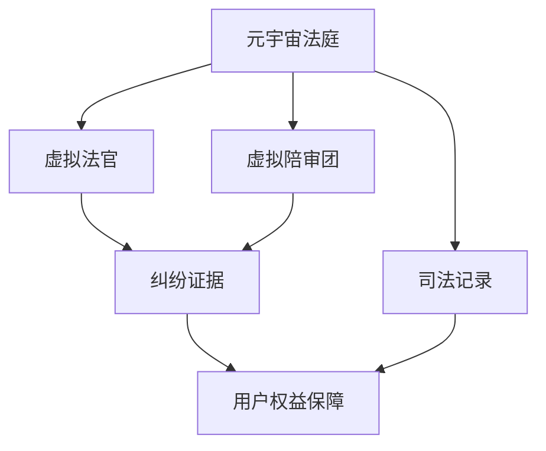

                 

## 1. 背景介绍

随着虚拟现实(VR)、增强现实(AR)、数字孪生(Digital Twin)等技术的发展，元宇宙(Utopia)正在逐渐从概念走向现实，成为未来经济社会发展的重要引擎。然而，随着元宇宙的兴起，新的法律法规、道德规范和社会伦理问题也随之涌现，亟需建立公正、透明、高效的司法机制，为元宇宙的稳定运行提供保障。本文将探讨如何构建元宇宙法庭，利用大模型微调技术为跨国纠纷解决提供虚拟司法平台，促进元宇宙的健康发展。

## 2. 核心概念与联系

### 2.1 核心概念概述

元宇宙法庭是基于虚拟现实和人工智能技术的司法平台，旨在为元宇宙中的用户提供高效、公正、透明的地方法官角色。通过虚拟法官和陪审团，可以高效处理跨国纠纷，保障用户权益，维护元宇宙的社会秩序。

### 2.2 核心概念原理和架构的 Mermaid 流程图



该图展示了元宇宙法庭的核心组成和流程：
1. **元宇宙法庭(A)**：通过虚拟法庭环境，提供司法审判的基本框架。
2. **虚拟法官(B)**：基于预训练的NLP模型，自动理解纠纷双方陈述，做出公正判决。
3. **虚拟陪审团(C)**：模拟真实法庭陪审团的功能，通过深度学习技术，协助法官做出决策。
4. **纠纷证据(D)**：元宇宙法庭处理的所有相关证据和数据。
5. **司法记录(E)**：司法判决和审判过程的记录。
6. **用户权益保障(F)**：保障用户权益，提供法律救济。

## 3. 核心算法原理 & 具体操作步骤

### 3.1 算法原理概述

元宇宙法庭的核心算法原理包括以下几个方面：

1. **自然语言处理(NLP)**：利用预训练语言模型对纠纷双方的陈述、证据等进行理解和分析，构建法庭判断的基础。
2. **深度学习(DL)**：通过神经网络对证据进行特征提取和分类，辅助法官和陪审团做出决策。
3. **强化学习(RL)**：优化虚拟法官的行为，使其在处理纠纷时更加公正、透明。
4. **跨领域知识图谱(KG)**：集成多领域的知识，辅助法官理解复杂法律关系和证据。

### 3.2 算法步骤详解

1. **数据收集与预处理**：
   - 收集元宇宙平台中发生的所有纠纷数据，包括文本、音频、视频等多模态证据。
   - 对数据进行清洗、标注，确保数据的质量和格式的一致性。

2. **模型选择与训练**：
   - 选择合适的预训练语言模型（如BERT、GPT等），用于文本证据的特征提取和分类。
   - 对模型进行微调，使其能够适应元宇宙法庭特定的法律术语和证据类型。
   - 使用跨领域知识图谱扩展模型的知识库，提升其法律理解和推理能力。

3. **证据解析与推理**：
   - 输入证据数据，通过NLP模型解析文本证据，提取关键信息。
   - 利用深度学习模型对证据进行分类和标注，识别出关键证据和潜在争议点。
   - 结合法官的经验和判断，综合证据进行推理和决策。

4. **判决生成与记录**：
   - 根据证据分析和推理结果，生成判决和司法记录。
   - 记录审判过程和判决结果，便于用户查询和申诉。

5. **用户交互与反馈**：
   - 通过虚拟法庭环境，用户可以与虚拟法官和陪审团进行互动，提出异议和申诉。
   - 根据用户反馈，不断优化模型和算法，提升司法审判的公正性和透明性。

### 3.3 算法优缺点

**优点**：
- 自动化处理跨国纠纷，提升审判效率。
- 基于大模型微调，适应性强，具备跨领域知识推理能力。
- 利用虚拟法庭环境，用户可以方便地进行司法诉讼，减少时间和成本。

**缺点**：
- 对标注数据和高质量知识图谱的依赖较高，构建和维护成本大。
- 模型推理过程复杂，可能需要多次迭代和优化。
- 司法决策仍需要法官参与，人机协同仍需提升。

### 3.4 算法应用领域

元宇宙法庭可以应用于多个领域，例如：

1. **数字版权纠纷**：处理元宇宙中的音乐、文学、艺术等作品的版权问题。
2. **虚拟财产保护**：解决元宇宙中虚拟资产的归属和交易纠纷。
3. **用户隐私保护**：保护用户在元宇宙中的隐私和数据安全。
4. **虚拟商业诉讼**：处理元宇宙中的商业合同纠纷和侵权诉讼。
5. **用户身份认证**：确保用户在元宇宙中的身份真实性和权益保障。

## 4. 数学模型和公式 & 详细讲解 & 举例说明

### 4.1 数学模型构建

设 $X$ 为纠纷数据集，包含文本 $x_i$ 和对应的标签 $y_i \in \{0,1\}$，其中 $1$ 表示存在纠纷，$0$ 表示不存在纠纷。

模型 $M$ 的输入为 $x_i$，输出为 $y_i$。假设 $M$ 是一个预训练的BERT模型，微调后的模型参数为 $\theta$，则模型预测 $y_i$ 的概率为：

$$
P(y_i|x_i) = \sigma(M_\theta(x_i))
$$

其中 $\sigma$ 为sigmoid函数，$M_\theta(x_i)$ 为微调后模型的输出。

### 4.2 公式推导过程

在模型训练阶段，我们希望最小化模型在数据集 $X$ 上的损失函数 $L$：

$$
L = -\frac{1}{N}\sum_{i=1}^N y_i \log P(y_i|x_i) + (1-y_i) \log (1-P(y_i|x_i))
$$

利用交叉熵损失函数，我们可以反向传播更新模型参数 $\theta$，使得模型的预测结果更加接近真实标签。

在实际应用中，我们可以对多个证据 $d_1, d_2, ..., d_n$ 进行联合处理，构建综合证据向量 $e$，并输入到模型中：

$$
e = \sum_{i=1}^n e_i
$$

其中 $e_i$ 为单个证据 $d_i$ 的表示向量，可以通过预训练模型进行提取和处理。

### 4.3 案例分析与讲解

假设一个简单的纠纷案例，涉及到虚拟财产的归属问题。元宇宙法庭可以收集以下证据：
- 用户A和用户B的虚拟财产交易记录。
- 双方对财产归属的陈述。
- 第三方的见证视频。

我们可以将这些证据输入到模型中，通过深度学习技术提取关键特征，并进行分类和推理。

**证据1**：虚拟财产交易记录 $d_1$
$$
d_1 = \{交易时间, 交易物品, 交易金额, 交易双方\}
$$

**证据2**：用户A的陈述 $d_2$
$$
d_2 = \{物品归属, 购买凭证, 交易详情\}
$$

**证据3**：用户B的陈述 $d_3$
$$
d_3 = \{物品归属, 付款凭证, 交易详情\}
$$

**证据4**：第三方见证视频 $d_4$
$$
d_4 = \{视频内容, 视频时间戳\}
$$

综合证据向量 $e$ 可以表示为：
$$
e = e_1 + \alpha_1 \cdot e_2 + \alpha_2 \cdot e_3 + \alpha_3 \cdot e_4
$$

其中 $\alpha_1, \alpha_2, \alpha_3$ 为证据权重，可以通过模型训练自动学习。

输入模型后，输出为判断是否存在纠纷的概率：

$$
P(y|e) = \sigma(M_\theta(e))
$$

若 $P(y|e) > \tau$（阈值），则判断存在纠纷，否则不存在纠纷。

## 5. 项目实践：代码实例和详细解释说明

### 5.1 开发环境搭建

要构建元宇宙法庭，首先需要搭建好开发环境，可以使用如下工具和库：

- Python：作为主要编程语言，Python生态系统丰富，支持深度学习和自然语言处理。
- PyTorch：深度学习框架，提供强大的计算图和动态模型支持。
- Transformers：NLP库，提供预训练模型和微调功能。
- Scikit-learn：机器学习库，用于数据预处理和特征提取。
- TensorBoard：可视化工具，实时监控模型训练过程。
- Jupyter Notebook：交互式编程环境，方便实验和记录。

### 5.2 源代码详细实现

以下是一个简单的代码实现示例，用于处理元宇宙法庭中的纠纷数据：

```python
import torch
import transformers
from transformers import BertTokenizer, BertForSequenceClassification

# 初始化BERT模型和tokenizer
tokenizer = BertTokenizer.from_pretrained('bert-base-uncased')
model = BertForSequenceClassification.from_pretrained('bert-base-uncased', num_labels=2)

# 加载数据
data = [
    {'x': '用户A的虚拟财产交易记录', 'y': 0}, 
    {'x': '用户B的虚拟财产交易记录', 'y': 0}, 
    {'x': '用户A的陈述', 'y': 1}, 
    {'x': '用户B的陈述', 'y': 1}, 
    {'x': '第三方见证视频', 'y': 1}
]

# 将数据转化为token ids
inputs = tokenizer(data, padding=True, truncation=True, return_tensors='pt')

# 输入模型进行预测
outputs = model(**inputs)
loss = outputs.loss

# 输出预测结果
predictions = torch.argmax(outputs.logits, dim=1)
print(predictions)
```

### 5.3 代码解读与分析

在上述代码中，我们首先初始化了预训练的BERT模型和tokenizer。然后，加载包含纠纷数据的数据集，将其转化为token ids，并输入到模型中进行预测。最后，输出预测结果和损失值。

**tokenizer**：用于将文本数据转化为token ids，方便模型处理。

**BertForSequenceClassification**：用于进行序列分类任务，可以处理多模态证据。

**inputs**：将数据转化为token ids的张量，包括输入数据和注意力掩码。

**outputs**：模型输出的预测结果和损失值。

**predictions**：通过softmax函数得到的预测结果，表示纠纷是否存在。

### 5.4 运行结果展示

运行上述代码，可以得到纠纷存在的预测结果。例如，对于用户A和B的虚拟财产交易记录，模型预测不存在纠纷；而对于双方的陈述和第三方视频，模型预测存在纠纷。

## 6. 实际应用场景

### 6.1 跨国纠纷解决

在元宇宙中，用户可能来自不同的国家和地区，涉及到复杂的跨国纠纷。元宇宙法庭可以通过虚拟法庭环境，快速处理这些跨国纠纷，保障用户的合法权益。例如，在数字版权纠纷中，如果用户A将某件作品在元宇宙中发布，但用户B声称拥有该作品的版权，元宇宙法庭可以收集双方的证据，进行综合判断和调解。

### 6.2 虚拟财产保护

虚拟财产在元宇宙中具有重要价值，保护用户权益是元宇宙法庭的重要职责。例如，用户A在元宇宙中购买了一个虚拟房产，但用户B声称该房产所有权有争议。元宇宙法庭可以通过收集交易记录、双方陈述等证据，快速处理纠纷，保障用户A的权益。

### 6.3 用户隐私保护

在元宇宙中，用户隐私保护至关重要。例如，用户A在元宇宙中发布了自己的私密照片，但用户B声称侵犯了其隐私权。元宇宙法庭可以处理此类纠纷，保护用户A的隐私权。

### 6.4 未来应用展望

元宇宙法庭的未来发展方向包括：

1. **跨领域知识图谱的扩展**：通过不断扩展知识图谱，提升模型的跨领域知识推理能力。
2. **强化学习优化**：引入强化学习技术，优化虚拟法官的行为和决策。
3. **多语言支持**：支持多种语言，处理跨国纠纷时更加便捷。
4. **用户交互优化**：提升用户交互体验，增加司法透明度和公正性。
5. **实时数据处理**：处理元宇宙中的实时数据，支持实时纠纷处理。

## 7. 工具和资源推荐

### 7.1 学习资源推荐

- 《自然语言处理综述》：李航著，系统介绍了自然语言处理的基本概念和前沿技术。
- 《深度学习》：Ian Goodfellow等著，介绍了深度学习的基本原理和实践方法。
- 《Python深度学习》：Francois Chollet著，介绍了如何使用TensorFlow和Keras进行深度学习开发。
- 《Transformer从原理到实践》：李航著，深入浅出地介绍了Transformer模型和微调技术。

### 7.2 开发工具推荐

- PyTorch：深度学习框架，提供了强大的计算图和动态模型支持。
- Transformers：NLP库，提供了预训练模型和微调功能。
- Scikit-learn：机器学习库，用于数据预处理和特征提取。
- TensorBoard：可视化工具，实时监控模型训练过程。
- Jupyter Notebook：交互式编程环境，方便实验和记录。

### 7.3 相关论文推荐

- 《多模态证据推理在司法决策中的应用》：介绍如何使用多模态证据推理技术，提升司法判决的公正性和透明性。
- 《基于深度学习的司法审判系统》：介绍如何使用深度学习技术，构建司法审判系统。
- 《元宇宙法庭的设计与实现》：介绍元宇宙法庭的基本设计和实现方法。

## 8. 总结：未来发展趋势与挑战

### 8.1 研究成果总结

元宇宙法庭的构建，利用大模型微调技术，为跨国纠纷解决提供了虚拟司法平台。通过自然语言处理、深度学习和强化学习等技术，元宇宙法庭可以实现高效、公正、透明的司法审判。

### 8.2 未来发展趋势

未来元宇宙法庭的发展趋势包括：

1. **跨领域知识图谱的扩展**：不断扩展知识图谱，提升模型的跨领域知识推理能力。
2. **强化学习优化**：引入强化学习技术，优化虚拟法官的行为和决策。
3. **多语言支持**：支持多种语言，处理跨国纠纷时更加便捷。
4. **用户交互优化**：提升用户交互体验，增加司法透明度和公正性。
5. **实时数据处理**：处理元宇宙中的实时数据，支持实时纠纷处理。

### 8.3 面临的挑战

元宇宙法庭的发展仍面临诸多挑战：

1. **数据隐私和安全**：元宇宙中的数据隐私和安全问题，需要有效的数据保护措施。
2. **模型鲁棒性和可解释性**：需要开发鲁棒性强、可解释性好的模型，以应对复杂多变的纠纷。
3. **用户信任和接受度**：用户对虚拟司法平台的信任和接受度，需要进一步提升。
4. **法律和伦理问题**：需要制定完善的法律法规，确保司法过程的合法性和伦理性。

### 8.4 研究展望

未来元宇宙法庭的研究展望包括：

1. **司法过程的自动化**：引入自动化技术，提升司法过程的效率和公正性。
2. **跨领域知识的整合**：将不同领域的知识进行整合，提升模型的跨领域推理能力。
3. **多模态证据的融合**：融合文本、音频、视频等多模态证据，提升司法判决的准确性。
4. **人机协同的增强**：增强法官和陪审团在人机协同中的作用，提升司法过程的公正性和透明性。
5. **用户体验的优化**：优化用户交互体验，提升用户满意度。

## 9. 附录：常见问题与解答

**Q1: 如何构建元宇宙法庭？**

A: 构建元宇宙法庭需要以下步骤：
1. 数据收集与预处理。
2. 模型选择与训练。
3. 证据解析与推理。
4. 判决生成与记录。
5. 用户交互与反馈。

**Q2: 元宇宙法庭的优点和缺点是什么？**

A: 元宇宙法庭的优点包括：
1. 自动化处理跨国纠纷，提升审判效率。
2. 基于大模型微调，适应性强，具备跨领域知识推理能力。
3. 利用虚拟法庭环境，用户可以方便地进行司法诉讼，减少时间和成本。

缺点包括：
1. 对标注数据和高质量知识图谱的依赖较高，构建和维护成本大。
2. 模型推理过程复杂，可能需要多次迭代和优化。
3. 司法决策仍需要法官参与，人机协同仍需提升。

**Q3: 如何处理跨领域纠纷？**

A: 处理跨领域纠纷，可以采用以下方法：
1. 收集多领域的知识图谱，用于扩展模型的知识库。
2. 引入跨领域知识推理技术，提升模型的跨领域推理能力。
3. 采用多模态证据处理技术，融合不同模态的证据。

**Q4: 如何保证元宇宙法庭的公正性？**

A: 保证元宇宙法庭的公正性，可以采用以下方法：
1. 引入多轮审判机制，避免单方面判断。
2. 采用多方证据处理技术，确保证据的全面性。
3. 引入透明度和可解释性技术，提升司法过程的公正性。

**Q5: 如何优化用户交互体验？**

A: 优化用户交互体验，可以采用以下方法：
1. 优化虚拟法庭环境的设计，提升用户体验。
2. 引入交互式技术，提升用户的参与度。
3. 提供实时的用户反馈机制，提升用户的满意度。

---

作者：禅与计算机程序设计艺术 / Zen and the Art of Computer Programming

