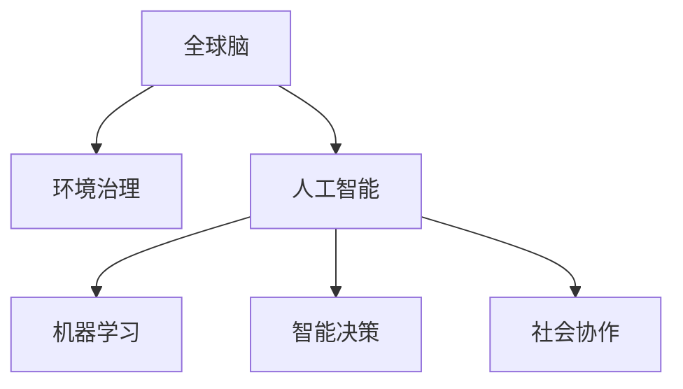

                 

# 全球脑与全球环境：集体合作的环境治理

> 关键词：全球脑,环境治理,人工智能,机器学习,智能决策,社会协作

## 1. 背景介绍

### 1.1 问题由来
随着全球气候变化和环境问题日益严峻，如何高效、科学地进行环境治理成为国际社会共同关注的焦点。近年来，环境治理越来越依赖于科技手段，人工智能和机器学习技术在此领域得到广泛应用。

### 1.2 问题核心关键点
环境治理涉及监测、预测、决策等多个环节，如何通过技术手段实现智能化、精准化、高效化，是大规模协作治理中的核心问题。人工智能通过模拟人类感知和决策过程，为环境治理提供了一种新的解决思路。

### 1.3 问题研究意义
人工智能在环境治理中的应用，可以大幅提高环境监测和预测的精度，辅助制定科学的决策方案，优化资源配置，降低治理成本。基于此，探讨人工智能在环境治理中的应用，对提升全球环境治理能力具有重要意义。

## 2. 核心概念与联系

### 2.1 核心概念概述

为更好地理解人工智能在环境治理中的应用，本节将介绍几个关键概念：

- 全球脑（Global Brain）：通过收集和整合全球数据，模拟人类大脑的神经网络结构，实现对复杂系统的智能决策。
- 环境治理：通过监测、预测和决策，维护地球生态平衡，保护自然资源，改善人类生活质量。
- 人工智能（AI）：利用计算机模拟人类智能过程，实现自动化、智能化、高效化的技术手段。
- 机器学习（ML）：让机器通过数据学习，自动优化算法，提升预测和决策能力。
- 智能决策（AI Decision Making）：通过机器学习等技术，模拟人类决策过程，实现精准、高效的决策。
- 社会协作（Social Collaboration）：不同组织和个体之间的数据共享和协同决策，提升环境治理效果。

这些核心概念之间的逻辑关系可以通过以下Mermaid流程图来展示：



这个流程图展示了大规模协作治理的核心概念及其之间的关系：

1. 全球脑通过整合全球数据，实现智能决策。
2. 人工智能是实现智能决策的主要技术手段。
3. 机器学习是实现人工智能决策的核心算法。
4. 智能决策提升了环境治理的精准性和高效性。
5. 社会协作增强了数据共享和协同决策能力。

这些概念共同构成了大规模协作治理的技术框架，为环境治理提供了智能化的解决方案。通过理解这些核心概念，我们可以更好地把握人工智能在环境治理中的应用方向。

## 3. 核心算法原理 & 具体操作步骤
### 3.1 算法原理概述

人工智能在环境治理中的应用，主要涉及智能监测、智能预测和智能决策等三个方面。其核心思想是：

- 智能监测：通过传感器、卫星等手段，实时收集环境数据，使用机器学习模型分析数据，实现环境监测的自动化、智能化。
- 智能预测：利用历史数据和机器学习算法，预测环境变化趋势，提前制定应对策略。
- 智能决策：基于预测结果，结合专家知识和用户需求，通过智能决策系统辅助决策者制定决策。

形式化地，假设环境监测数据为 $X$，预测结果为 $Y$，决策方案为 $Z$。设机器学习模型为 $M$，则环境治理的算法框架可以表示为：

$$
M = M_{\text{监测}} \times M_{\text{预测}} \times M_{\text{决策}}
$$

其中 $M_{\text{监测}}$ 负责数据采集和初步分析，$M_{\text{预测}}$ 负责对未来环境变化进行预测，$M_{\text{决策}}$ 负责制定科学决策方案。

### 3.2 算法步骤详解

基于人工智能的环境治理，一般包括以下几个关键步骤：

**Step 1: 数据采集与预处理**

- 使用传感器、遥感技术等手段，实时采集环境数据。
- 对采集数据进行清洗、去噪和标准化处理，确保数据质量。

**Step 2: 智能监测**

- 设计机器学习模型，对环境监测数据进行分析和异常检测。
- 使用自动化的监测系统，实时输出监测结果。

**Step 3: 智能预测**

- 收集历史数据，设计预测模型。
- 对未来环境变化进行预测，生成预测报告。

**Step 4: 智能决策**

- 结合预测结果和专家知识，制定决策方案。
- 通过模拟人类决策过程，优化决策结果。

**Step 5: 结果评估与反馈**

- 对决策效果进行评估，计算关键指标。
- 根据反馈调整模型参数，持续优化系统性能。

### 3.3 算法优缺点

基于人工智能的环境治理方法具有以下优点：

- 高效精准：机器学习模型可以快速处理大量数据，实现自动化监测和预测。
- 实时响应：智能系统可以实时响应环境变化，提升决策的时效性。
- 资源优化：智能决策可以优化资源配置，降低环境治理成本。
- 科学决策：机器学习模型可以整合多源数据，辅助科学决策。

同时，该方法也存在一定的局限性：

- 依赖数据：数据质量对模型性能影响巨大，数据获取和处理成本较高。
- 模型泛化：模型对未知数据的泛化能力有限，难以应对突发情况。
- 透明度不足：机器学习模型通常难以解释，决策过程缺乏透明度。
- 伦理风险：模型可能存在偏见，影响决策公平性。
- 安全性问题：数据隐私和模型安全性需要特别关注，避免被滥用。

尽管存在这些局限性，但就目前而言，基于人工智能的环境治理方法仍是最主流范式。未来相关研究的重点在于如何进一步降低数据依赖，提高模型的泛化能力，同时兼顾可解释性和伦理安全性等因素。

### 3.4 算法应用领域

基于人工智能的环境治理方法，在多个领域得到了广泛的应用，例如：

- 大气污染监测：通过卫星遥感数据和地面监测数据，实时监测大气质量，预测污染扩散趋势。
- 水资源管理：收集水质数据，分析水资源变化，制定合理的水资源管理方案。
- 森林火灾预警：使用传感器数据，预测森林火灾风险，提前预警和应对。
- 生态系统监测：利用无人机和卫星数据，监测生态系统变化，评估生物多样性。
- 城市交通管理：采集交通流量数据，预测交通拥堵情况，优化交通信号控制。
- 农业气象预测：收集气象数据，预测气象灾害，指导农业生产。

除了上述这些经典任务外，人工智能在环境治理中的应用还在不断拓展，如智能垃圾分类、智能能源管理、智能气候变化预测等，为环境治理带来了新的突破。随着技术的不断进步，人工智能必将在环境治理中发挥更大的作用。

## 4. 数学模型和公式 & 详细讲解 & 举例说明

### 4.1 数学模型构建

本节将使用数学语言对基于人工智能的环境治理方法进行更加严格的刻画。

假设环境监测数据为 $X$，预测结果为 $Y$，决策方案为 $Z$。设计机器学习模型 $M$，目标是最小化环境变化带来的损失 $L$：

$$
L = \mathbb{E}[(Z_{\text{真实}} - Z_{\text{预测}})^2]
$$

其中 $Z_{\text{真实}}$ 为真实决策结果，$Z_{\text{预测}}$ 为模型预测的决策方案。

### 4.2 公式推导过程

以智能监测为例，假设监测数据 $X$ 为连续变量，使用线性回归模型 $Y = f(X) = \theta_0 + \theta_1 X$ 进行拟合。最小化损失函数：

$$
L(Y, f(X)) = \frac{1}{2} \sum_{i=1}^N (y_i - f(x_i))^2
$$

其中 $y_i$ 为实际监测数据，$x_i$ 为对应的监测值。对 $f(X)$ 求导，得到梯度：

$$
\frac{\partial L}{\partial \theta} = \sum_{i=1}^N (y_i - f(x_i))x_i
$$

使用梯度下降算法更新模型参数 $\theta$，得到：

$$
\theta \leftarrow \theta - \eta \frac{\partial L}{\partial \theta}
$$

其中 $\eta$ 为学习率。

### 4.3 案例分析与讲解

假设某地实时监测到空气质量数据 $x$，使用线性回归模型进行预测。假设真实数据 $y$ 与监测数据 $x$ 相关，模型参数 $\theta = (0.5, 1.2)$。使用梯度下降算法，最小化损失函数：

$$
L(Y, f(X)) = \frac{1}{2} \sum_{i=1}^N (y_i - (0.5 + 1.2x_i))^2
$$

计算梯度：

$$
\frac{\partial L}{\partial \theta_0} = \sum_{i=1}^N (y_i - (0.5 + 1.2x_i)) \cdot -1 = \sum_{i=1}^N (y_i - 0.5 - 1.2x_i)
$$

$$
\frac{\partial L}{\partial \theta_1} = \sum_{i=1}^N (y_i - (0.5 + 1.2x_i)) \cdot x_i = \sum_{i=1}^N (y_i \cdot x_i - 0.5 \cdot x_i - 1.2x_i^2)
$$

使用梯度下降算法更新参数：

$$
\theta_0 \leftarrow \theta_0 - \eta \frac{\partial L}{\partial \theta_0}
$$

$$
\theta_1 \leftarrow \theta_1 - \eta \frac{\partial L}{\partial \theta_1}
$$

通过不断迭代，直到损失函数收敛。

## 5. 项目实践：代码实例和详细解释说明
### 5.1 开发环境搭建

在进行环境治理的AI项目实践前，我们需要准备好开发环境。以下是使用Python进行PyTorch开发的环境配置流程：

1. 安装Anaconda：从官网下载并安装Anaconda，用于创建独立的Python环境。

2. 创建并激活虚拟环境：
```bash
conda create -n env-name python=3.8 
conda activate env-name
```

3. 安装PyTorch：根据CUDA版本，从官网获取对应的安装命令。例如：
```bash
conda install pytorch torchvision torchaudio cudatoolkit=11.1 -c pytorch -c conda-forge
```

4. 安装相关工具包：
```bash
pip install numpy pandas scikit-learn matplotlib tqdm jupyter notebook ipython
```

完成上述步骤后，即可在`env-name`环境中开始AI项目实践。

### 5.2 源代码详细实现

下面我们以智能监测项目为例，给出使用PyTorch进行线性回归模型开发的PyTorch代码实现。

首先，定义数据处理函数：

```python
import numpy as np
import pandas as pd
import torch
from torch.utils.data import TensorDataset, DataLoader
from sklearn.model_selection import train_test_split
from sklearn.preprocessing import StandardScaler

def load_data(file_path):
    data = pd.read_csv(file_path)
    X = data.drop(['y'], axis=1).values
    y = data['y'].values
    return X, y

def scale_data(X):
    scaler = StandardScaler()
    X_scaled = scaler.fit_transform(X)
    return X_scaled

def train_test_split_data(X, y):
    X_train, X_test, y_train, y_test = train_test_split(X, y, test_size=0.2, random_state=42)
    return X_train, X_test, y_train, y_test

# 加载数据
X, y = load_data('data.csv')

# 数据标准化
X = scale_data(X)

# 数据划分训练集和测试集
X_train, X_test, y_train, y_test = train_test_split_data(X, y)

# 创建PyTorch数据集
train_dataset = TensorDataset(torch.tensor(X_train), torch.tensor(y_train))
test_dataset = TensorDataset(torch.tensor(X_test), torch.tensor(y_test))

# 创建数据加载器
train_loader = DataLoader(train_dataset, batch_size=32, shuffle=True)
test_loader = DataLoader(test_dataset, batch_size=32, shuffle=False)
```

然后，定义模型和优化器：

```python
from torch import nn, optim

class LinearRegression(nn.Module):
    def __init__(self, input_dim, output_dim):
        super(LinearRegression, self).__init__()
        self.linear = nn.Linear(input_dim, output_dim)
    
    def forward(self, x):
        return self.linear(x)

# 模型参数初始化
input_dim = X.shape[1]
output_dim = 1

model = LinearRegression(input_dim, output_dim)

# 定义优化器
optimizer = optim.SGD(model.parameters(), lr=0.01)
```

接着，定义训练和评估函数：

```python
def train_epoch(model, loader, optimizer):
    model.train()
    total_loss = 0
    for X, y in loader:
        optimizer.zero_grad()
        y_pred = model(X)
        loss = nn.MSELoss()(y_pred, y)
        loss.backward()
        optimizer.step()
        total_loss += loss.item()
    return total_loss / len(loader)

def evaluate(model, loader):
    model.eval()
    total_loss = 0
    for X, y in loader:
        y_pred = model(X)
        loss = nn.MSELoss()(y_pred, y)
        total_loss += loss.item()
    return total_loss / len(loader)

# 训练模型
num_epochs = 100

for epoch in range(num_epochs):
    loss = train_epoch(model, train_loader, optimizer)
    print(f'Epoch {epoch+1}, train loss: {loss:.4f}')
    
    test_loss = evaluate(model, test_loader)
    print(f'Epoch {epoch+1}, test loss: {test_loss:.4f}')
```

以上就是使用PyTorch进行线性回归模型开发的完整代码实现。可以看到，得益于PyTorch的强大封装，我们可以用相对简洁的代码完成模型训练和评估。

### 5.3 代码解读与分析

让我们再详细解读一下关键代码的实现细节：

**load_data函数**：
- 读取数据集文件，将数据转化为NumPy数组。
- 将特征数据和标签分别作为X和y返回。

**scale_data函数**：
- 使用StandardScaler对特征数据进行标准化处理，确保数据分布均匀。

**train_test_split_data函数**：
- 使用train_test_split对数据集进行划分，将数据划分为训练集和测试集。

**LinearRegression类**：
- 定义线性回归模型，继承nn.Module。
- 在`__init__`方法中定义线性层，并初始化权重和偏置。

**train_epoch函数**：
- 在训练过程中，对每个batch进行前向传播和反向传播，更新模型参数。

**evaluate函数**：
- 在评估过程中，对每个batch进行前向传播，计算损失。

**训练流程**：
- 在每个epoch内，先训练模型，输出训练集损失，再在测试集上评估模型性能。

通过上述代码实现，我们可以看到，使用PyTorch进行线性回归模型训练的过程相对简单。在实际应用中，还需要考虑更多的因素，如模型复杂度、数据分布、优化器选择等，才能得到更好的结果。

## 6. 实际应用场景
### 6.1 智能监测系统

基于AI的环境监测系统，可以实时监测环境变化，预测污染趋势，辅助决策制定。该系统包括传感器网络、数据中心、智能分析平台等多个组成部分，可以实现环境监测的自动化、智能化。

在技术实现上，可以使用多传感器融合技术，实时采集环境数据，使用机器学习模型进行分析和异常检测。对于异常数据，系统可以自动报警，并及时响应。同时，系统可以提供可视化的监测结果和预测报告，辅助决策者制定科学的环境治理方案。

### 6.2 智能预警系统

智能预警系统通过收集环境数据，预测环境变化趋势，提前预警环境风险。该系统可以在气象、水文、地质等多个领域得到应用。

在技术实现上，可以使用深度学习模型，对历史数据进行分析和预测，生成预警报告。对于高风险区域，系统可以自动推送预警信息，并制定相应的应急方案。同时，系统可以结合社交媒体等数据，进行舆情分析和舆情预警，增强环境治理的及时性和准确性。

### 6.3 智能决策支持系统

智能决策支持系统通过整合多源数据，辅助决策者制定科学的决策方案。该系统可以在政策制定、资源管理等多个领域得到应用。

在技术实现上，可以使用多目标优化算法，将环境数据、经济数据、社会数据等多个维度进行综合分析，生成决策支持报告。对于复杂决策问题，系统可以提供多种备选方案，供决策者参考。同时，系统可以结合模拟仿真技术，对决策结果进行验证和优化，提升决策的科学性和可靠性。

### 6.4 未来应用展望

随着AI技术的发展，未来环境治理将更加智能化、精细化。基于AI的环境治理系统将具备以下特点：

- 全时段监测：使用智能传感器和遥感技术，实现全天候、全时段的环境监测。
- 高精度预测：使用深度学习模型，提高环境变化预测的精度和时效性。
- 科学决策：结合专家知识和用户需求，制定科学的环境治理方案。
- 社会协作：使用区块链等技术，实现数据共享和协同决策。
- 实时响应：使用边缘计算等技术，实现快速响应和决策执行。
- 智能维护：使用机器人等技术，实现环境治理设备的智能维护和故障检测。

以上特点将使环境治理更加高效、精准、可靠，为实现可持续发展提供有力支撑。

## 7. 工具和资源推荐
### 7.1 学习资源推荐

为了帮助开发者系统掌握人工智能在环境治理中的应用，这里推荐一些优质的学习资源：

1. 《Python机器学习》（Scikit-learn官方文档）：全面介绍了机器学习的基础知识和实践技巧，适合初学者入门。

2. 《深度学习》（Ian Goodfellow著）：深入浅出地讲解了深度学习的理论和实践，是理解AI环境治理的必备读物。

3. 《TensorFlow实战Google深度学习》：介绍TensorFlow的使用方法和深度学习模型的实践技巧，适合进阶学习。

4. 《PyTorch基础教程》（PyTorch官方文档）：详细讲解了PyTorch的使用方法和模型实现，是实现AI环境治理的重要工具。

5. Kaggle竞赛平台：提供了大量环境治理相关的数据集和竞赛任务，适合实践锻炼。

通过对这些资源的学习实践，相信你一定能够快速掌握AI环境治理的精髓，并用于解决实际的环境治理问题。

### 7.2 开发工具推荐

高效的开发离不开优秀的工具支持。以下是几款用于AI环境治理开发的常用工具：

1. PyTorch：基于Python的开源深度学习框架，灵活动态的计算图，适合快速迭代研究。

2. TensorFlow：由Google主导开发的开源深度学习框架，生产部署方便，适合大规模工程应用。

3. TensorFlow Extended（TFX）：Google开源的机器学习平台，集成了模型训练、数据处理、模型部署等多个环节，适合工业级应用。

4. Jupyter Notebook：基于Web的交互式编程环境，支持Python等编程语言，适合研究和实验。

5. Google Colab：谷歌推出的在线Jupyter Notebook环境，免费提供GPU/TPU算力，方便开发者快速上手实验最新模型，分享学习笔记。

合理利用这些工具，可以显著提升AI环境治理的开发效率，加快创新迭代的步伐。

### 7.3 相关论文推荐

人工智能在环境治理中的应用源于学界的持续研究。以下是几篇奠基性的相关论文，推荐阅读：

1. An Earth Observation-Based Decision Support System for Water Management in Agricultural Areas（地球观测农业水资源管理决策支持系统）：介绍了一种基于地球观测数据的水资源管理决策支持系统。

2. Time Series Analysis: Methods and Applications（时间序列分析：方法和应用）：讲解了时间序列分析的理论和方法，是理解环境变化预测的基础。

3. Machine Learning and Environmental Data Analysis（机器学习与环境数据分析）：介绍了机器学习在环境数据分析中的应用，适合理解和实践。

4. Spatial-Temporal Modelling of Environmental Data Using Machine Learning（使用机器学习进行环境数据的空间-时间建模）：讲解了使用机器学习进行环境数据分析的实践方法。

5. Deep Learning for Climate Change（深度学习在气候变化中的应用）：介绍了深度学习在气候变化预测和分析中的应用，适合理解和实践。

这些论文代表了大规模协作治理的技术发展脉络。通过学习这些前沿成果，可以帮助研究者把握学科前进方向，激发更多的创新灵感。

## 8. 总结：未来发展趋势与挑战

### 8.1 总结

本文对基于AI的环境治理方法进行了全面系统的介绍。首先阐述了AI在环境治理中的应用背景和意义，明确了AI在环境治理中的核心作用。其次，从原理到实践，详细讲解了智能监测、智能预测和智能决策等关键技术，给出了AI环境治理项目的完整代码实例。同时，本文还探讨了AI在环境治理中的应用场景，展示了AI技术的巨大潜力。

通过本文的系统梳理，可以看到，基于AI的环境治理方法正在成为环境治理的重要技术手段，极大地提升了环境治理的智能化水平。未来，伴随AI技术的发展，AI环境治理必将在多个领域得到广泛应用，为实现可持续发展提供有力支撑。

### 8.2 未来发展趋势

展望未来，AI环境治理将呈现以下几个发展趋势：

1. 数据驱动：大规模数据收集和处理技术的发展，使得AI环境治理可以更深入地挖掘环境数据中的有用信息，实现精准治理。

2. 多源融合：融合多种传感器数据和多源数据，实现对环境变化的全面监测和分析。

3. 实时响应：通过边缘计算等技术，实现环境治理的实时响应和决策执行。

4. 社会协作：使用区块链等技术，实现数据共享和协同决策，提升治理效率。

5. 智能维护：使用机器人等技术，实现环境治理设备的智能维护和故障检测。

6. 可视化分析：使用可视化技术，将复杂的环境数据转换为直观的图形和报告，辅助决策。

以上趋势凸显了AI环境治理技术的广阔前景。这些方向的探索发展，必将进一步提升环境治理的智能化水平，为实现可持续发展提供有力支撑。

### 8.3 面临的挑战

尽管AI环境治理技术已经取得了瞩目成就，但在迈向更加智能化、普适化应用的过程中，它仍面临着诸多挑战：

1. 数据质量和隐私：环境数据可能存在噪声和不完整性，隐私保护和数据安全需要特别关注。

2. 模型泛化：模型对未知数据的泛化能力有限，难以应对突发情况。

3. 伦理风险：模型可能存在偏见，影响决策公平性。

4. 计算资源：大规模数据和复杂模型的训练和推理需要大量计算资源。

5. 技术集成：AI环境治理需要整合多种技术和系统，技术集成和系统协同面临挑战。

6. 用户接受度：AI环境治理技术需要得到用户和决策者的认可和接受。

正视这些挑战，积极应对并寻求突破，将使AI环境治理技术不断成熟，为环境治理带来更大价值。

### 8.4 研究展望

未来，AI环境治理技术的研究将更多地关注以下几个方向：

1. 数据质量提升：通过数据清洗、数据增强等技术，提高环境数据的质量和可用性。

2. 模型泛化能力：使用迁移学习、少样本学习等技术，提升模型对未知数据的泛化能力。

3. 伦理和公平性：引入伦理导向的评估指标，过滤和惩罚有偏见、有害的输出倾向。

4. 技术集成与系统协同：将AI技术与其他环境治理技术进行有机结合，形成系统化的解决方案。

5. 用户接受度：通过用户友好的交互界面和可视化分析，提升用户对AI环境治理技术的接受度和使用率。

6. 模型解释性：研究AI模型的可解释性，增强模型决策的透明性和可信度。

这些研究方向的探索，将使AI环境治理技术更加成熟，为实现可持续发展提供有力支撑。

## 9. 附录：常见问题与解答

**Q1：AI环境治理与传统环境治理方法有哪些区别？**

A: AI环境治理与传统环境治理方法的主要区别在于数据驱动、智能化和实时性。AI环境治理通过智能模型对环境数据进行分析和预测，实现精准治理；而传统方法更多依赖人工经验和定性分析，缺乏数据的实时反馈和量化评估。

**Q2：AI环境治理的应用场景有哪些？**

A: AI环境治理可以在多个领域得到应用，包括水资源管理、大气污染监测、生态系统监测、城市交通管理、农业气象预测等。AI技术可以提升环境治理的自动化、智能化和精准化水平，降低治理成本，提高治理效率。

**Q3：AI环境治理需要哪些数据支持？**

A: AI环境治理需要大量的环境数据，包括大气、水质、土壤、植被等数据。数据的质量和数量对模型性能有重要影响，数据采集和处理是AI环境治理的基础。

**Q4：AI环境治理的模型如何训练？**

A: AI环境治理的模型训练需要大量的标注数据和计算资源。使用深度学习模型，如卷积神经网络、循环神经网络等，对环境数据进行分析和预测。同时，可以使用迁移学习、少样本学习等技术，提升模型的泛化能力和训练效率。

**Q5：AI环境治理的未来发展方向是什么？**

A: AI环境治理的未来发展方向包括数据驱动、多源融合、实时响应、社会协作、智能维护和可视化分析。通过技术创新和系统集成，AI环境治理将实现更加智能化、精细化和高效化的环境治理。

---

作者：禅与计算机程序设计艺术 / Zen and the Art of Computer Programming

