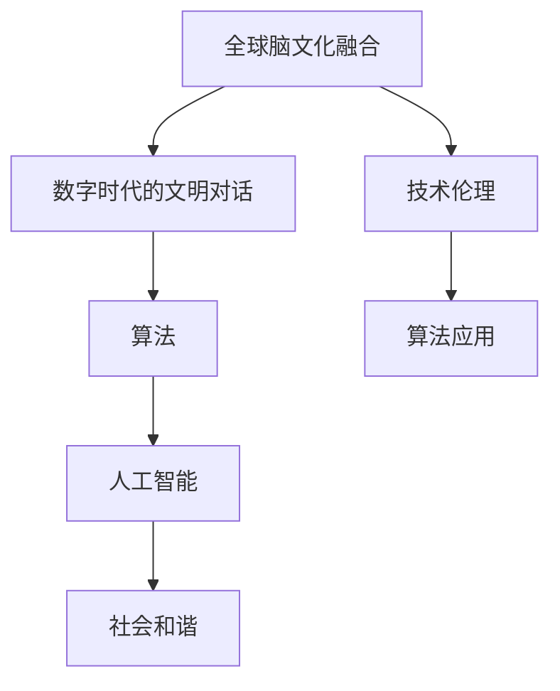

                 

# 全球脑文化融合算法:数字时代的文明对话促进器

> 关键词：全球脑文化融合,数字时代,文明对话,算法,人工智能,社会和谐,技术伦理,未来展望

## 1. 背景介绍

### 1.1 问题由来
进入21世纪以来，人类社会迎来了信息技术的爆炸式发展，数字技术和互联网的普及使得全球化的程度达到了前所未有的高度。在这个过程中，各国文化在网络上进行了前所未有的交流与碰撞，也引发了一系列社会、文化、伦理方面的问题。例如，西方文化的强势输出可能挤压本土文化空间，文化冲突和误解频繁发生，甚至引发社会动荡。如何在数字时代促进不同文化之间的融合与理解，成为国际社会和学术界亟待解决的问题。

### 1.2 问题核心关键点
该问题的核心关键点在于：

- **文化多样性**：不同国家和地区有着独特的文化传统和价值观念，如何在数字技术背景下尊重并保护这些文化差异。
- **跨文化理解**：如何构建一种机制，使得不同文化背景的人们能够在网络上进行有效的沟通和交流。
- **技术支持**：需要开发一种算法，通过技术手段促进跨文化对话，减少误解和偏见，促进社会和谐。
- **伦理考量**：在算法设计和应用过程中，如何平衡技术创新与社会伦理，避免数据偏见、隐私侵犯等问题。

## 2. 核心概念与联系

### 2.1 核心概念概述

为更好地理解全球脑文化融合算法，本节将介绍几个密切相关的核心概念：

- **全球脑文化融合**：指在数字时代，通过人工智能技术促进不同文化间的理解、交流和融合，减少误解和偏见，构建和谐社会。
- **数字时代的文明对话**：指在信息网络空间中，不同文化背景的人们通过数字技术进行思想交流和情感沟通，提升跨文化理解能力。
- **算法**：指用于解决特定问题的计算方法和步骤，包括模型构建、训练优化、推理预测等。
- **人工智能**：指通过模拟人类智能行为，实现各种智能任务的技术体系，包括机器学习、自然语言处理、计算机视觉等。
- **社会和谐**：指不同文化背景的人们在尊重差异的基础上，通过交流合作，达到共同繁荣和发展的状态。
- **技术伦理**：指在技术开发和应用过程中，需要遵循的伦理规范和原则，确保技术成果符合社会公正、公平和透明的要求。

这些核心概念之间的逻辑关系可以通过以下Mermaid流程图来展示：



这个流程图展示了大语言模型微调的核心概念及其之间的关系：

1. 全球脑文化融合是算法最终目标，通过促进跨文化对话实现社会和谐。
2. 数字时代的文明对话依赖于算法的支持，借助人工智能技术实现跨文化交流。
3. 算法是技术实现的核心，通过构建模型和优化训练提升效果。
4. 人工智能提供了实现算法的技术手段，如自然语言处理、机器学习等。
5. 技术伦理确保算法应用的合法性和公正性，避免技术滥用。
6. 算法应用是算法在实际场景中的具体实践，实现文化融合和社会和谐。

## 3. 核心算法原理 & 具体操作步骤

### 3.1 算法原理概述

全球脑文化融合算法是一种基于人工智能技术的跨文化对话促进方法。其核心思想是通过机器学习和自然语言处理技术，构建一个能够理解不同语言和文化背景的模型，通过在数字空间中模拟真实世界中的文明对话，促进不同文化之间的理解、交流和融合。

该算法的基本流程包括以下几个关键步骤：

1. 数据收集：从全球各地收集多语言、多文化背景的文本数据，如社交媒体帖子、新闻报道、文学作品等。
2. 数据预处理：对收集到的数据进行清洗、标注、分词等预处理操作，构建大规模语料库。
3. 模型构建：基于大规模语料库，使用深度学习技术构建跨文化对话模型。
4. 模型训练：在标注数据集上进行有监督训练，优化模型参数。
5. 模型推理：将新文本输入模型，输出不同文化背景下的解读和回复。
6. 模型评估：评估模型在不同文化背景下的理解和回复效果，持续优化模型。

### 3.2 算法步骤详解

以下是全球脑文化融合算法的详细步骤：

**Step 1: 数据收集与预处理**

1. **数据来源**：收集全球各地的文本数据，包括但不限于社交媒体、新闻网站、文学作品等。
2. **数据清洗**：去除无关信息，如广告、垃圾信息、重复内容等。
3. **数据标注**：对文本进行多文化背景的标注，如语言、文化、情感等。
4. **数据分词**：将文本进行分词处理，构建词汇表和句子结构。

**Step 2: 模型构建**

1. **选择模型架构**：根据任务需求选择合适的模型架构，如RNN、LSTM、Transformer等。
2. **定义输入输出**：确定模型输入（文本）和输出（解读和回复）的格式。
3. **构建损失函数**：根据任务定义合适的损失函数，如交叉熵、余弦相似度等。

**Step 3: 模型训练**

1. **划分数据集**：将数据集划分为训练集、验证集和测试集。
2. **设置超参数**：如学习率、批大小、迭代轮数等。
3. **优化算法**：选择合适的优化算法，如SGD、Adam等，并设定相应的学习率。
4. **模型训练**：在训练集上逐步调整模型参数，最小化损失函数。
5. **验证集评估**：在验证集上评估模型性能，防止过拟合。

**Step 4: 模型推理**

1. **输入文本**：将新文本输入模型。
2. **生成解读和回复**：模型根据输入文本生成不同文化背景下的解读和回复。

**Step 5: 模型评估**

1. **测试集评估**：在测试集上评估模型效果。
2. **优化调整**：根据评估结果调整模型参数和训练策略。
3. **持续优化**：不断收集新数据，进行模型更新和优化。

### 3.3 算法优缺点

全球脑文化融合算法具有以下优点：

1. **高效性**：通过大规模数据训练，模型可以在短时间内理解并生成不同文化背景的文本，显著提升跨文化对话效率。
2. **广泛性**：适用于多种语言和文化背景，具有较强的通用性。
3. **可扩展性**：能够处理海量的多语言数据，具有很好的可扩展性。
4. **实时性**：模型推理速度快，适合实时对话场景。

同时，该算法也存在一些局限性：

1. **数据依赖性**：算法依赖于高质量、多文化背景的数据集，数据质量直接影响模型效果。
2. **文化偏差**：模型可能在学习过程中继承数据中的文化偏见，导致输出结果不公正。
3. **语言多样性**：多语言处理的复杂性使得算法需要更多的技术手段来处理，可能存在精度下降的问题。
4. **伦理挑战**：在处理文化敏感信息时，需要严格遵守数据保护和隐私保护的伦理规范。

### 3.4 算法应用领域

全球脑文化融合算法在以下领域有着广泛的应用：

- **国际交流**：在多国合作、外交交流等场景中，通过算法促进跨文化对话，减少误解和偏见。
- **教育培训**：在跨文化教育、语言学习等场景中，通过算法提供文化理解和交流的平台。
- **社会治理**：在文化冲突、社会稳定等场景中，通过算法辅助政府决策，促进社会和谐。
- **企业国际化**：在跨国公司运营、国际贸易等场景中，通过算法提升跨文化沟通效率，增强国际竞争力。
- **文化保护**：在文化遗产保护、文化研究等场景中，通过算法实现跨文化交流，传承和弘扬不同文化。

## 4. 数学模型和公式 & 详细讲解 & 举例说明

### 4.1 数学模型构建

我们以自然语言处理中的跨文化对话为例，描述全球脑文化融合算法的数学模型构建过程。

设 $X$ 为输入文本，$Y$ 为不同文化背景下的解读和回复。模型的目标是在给定输入 $X$ 的情况下，最大化预测 $Y$ 的概率 $P(Y|X)$。

根据最大似然估计的原则，模型的损失函数可以定义为：

$$
\mathcal{L} = -\frac{1}{N}\sum_{i=1}^N \log P(Y_i|X_i)
$$

其中 $N$ 为样本总数，$Y_i$ 和 $X_i$ 分别为第 $i$ 个样本的解读和回复文本。

在实际应用中，我们通常使用深度学习模型（如RNN、LSTM、Transformer等）进行模型构建。这些模型通过多层网络结构，逐步提取文本特征，最终输出解读和回复的概率分布。

### 4.2 公式推导过程

以Transformer模型为例，推导其跨文化对话的数学公式。

Transformer模型由编码器和解码器两部分组成，其核心是自注意力机制和多头注意力机制。设 $X=\{x_1, x_2, ..., x_n\}$ 为输入文本序列，$Y=\{y_1, y_2, ..., y_n\}$ 为输出解读和回复序列。

编码器包括多个自注意力层和前馈神经网络层，用于提取输入文本的特征表示。解码器包括多个自注意力层、多头注意力层和前馈神经网络层，用于生成不同文化背景下的解读和回复。

编码器的输出表示为 $Z=\{z_1, z_2, ..., z_n\}$，解码器的输出表示为 $T=\{t_1, t_2, ..., t_n\}$。模型的目标是在给定输入 $X$ 的情况下，最大化 $P(T|X)$。

根据softmax函数的定义，输出的概率分布可以表示为：

$$
P(T|X) = \frac{e^{\sum_{i=1}^n \log P(t_i|X, z_i)}}{\sum_{T'} e^{\sum_{i=1}^n \log P(t_i|X, z_i)}}
$$

其中 $P(t_i|X, z_i)$ 为解码器在给定输入 $X$ 和编码器输出 $z_i$ 的情况下生成第 $i$ 个回复的概率。

通过链式法则，计算损失函数 $\mathcal{L}$ 的梯度：

$$
\frac{\partial \mathcal{L}}{\partial \theta} = -\frac{1}{N}\sum_{i=1}^N \frac{1}{P(Y_i|X_i)} \sum_{j=1}^n \frac{\partial \log P(t_j|X_i, z_j)}{\partial \theta}
$$

其中 $\theta$ 为模型参数，$\partial \log P(t_j|X_i, z_j)$ 为解码器在给定输入和编码器输出时，生成第 $j$ 个回复的概率的梯度。

### 4.3 案例分析与讲解

以中文和英文的跨文化对话为例，展示全球脑文化融合算法的应用。

假设我们有一个包含大量中文和英文文本的语料库，分别标注了两种文化背景下的解读和回复。模型的输入为一段中文文本 $X$，输出为目标文化背景下的解读和回复 $Y$。

模型使用Transformer架构，首先对中文文本进行编码，生成编码器输出 $Z$。然后解码器利用 $Z$ 和 $Y$ 计算概率分布，输出目标文化背景下的解读和回复。

在实际应用中，我们可以将上述过程封装为API接口，通过接口输入中文文本，得到英文解读和回复，或输入英文文本，得到中文解读和回复。

## 5. 项目实践：代码实例和详细解释说明

### 5.1 开发环境搭建

在进行全球脑文化融合算法的实践时，我们需要准备好开发环境。以下是使用Python进行PyTorch开发的环境配置流程：

1. 安装Anaconda：从官网下载并安装Anaconda，用于创建独立的Python环境。

2. 创建并激活虚拟环境：
```bash
conda create -n cultural_fusion_env python=3.8 
conda activate cultural_fusion_env
```

3. 安装PyTorch：根据CUDA版本，从官网获取对应的安装命令。例如：
```bash
conda install pytorch torchvision torchaudio cudatoolkit=11.1 -c pytorch -c conda-forge
```

4. 安装transformers库：
```bash
pip install transformers
```

5. 安装各类工具包：
```bash
pip install numpy pandas scikit-learn matplotlib tqdm jupyter notebook ipython
```

完成上述步骤后，即可在`cultural_fusion_env`环境中开始实践。

### 5.2 源代码详细实现

下面以中文和英文的跨文化对话为例，给出使用Transformers库进行模型微调的PyTorch代码实现。

首先，定义模型的数据处理函数：

```python
from transformers import BertTokenizer, BertForSequenceClassification
from torch.utils.data import Dataset
import torch

class CulturalFusionDataset(Dataset):
    def __init__(self, texts, tags, tokenizer, max_len=128):
        self.texts = texts
        self.tags = tags
        self.tokenizer = tokenizer
        self.max_len = max_len
        
    def __len__(self):
        return len(self.texts)
    
    def __getitem__(self, item):
        text = self.texts[item]
        tags = self.tags[item]
        
        encoding = self.tokenizer(text, return_tensors='pt', max_length=self.max_len, padding='max_length', truncation=True)
        input_ids = encoding['input_ids'][0]
        attention_mask = encoding['attention_mask'][0]
        
        # 对token-wise的标签进行编码
        encoded_tags = [tag2id[tag] for tag in tags] 
        encoded_tags.extend([tag2id['O']] * (self.max_len - len(encoded_tags)))
        labels = torch.tensor(encoded_tags, dtype=torch.long)
        
        return {'input_ids': input_ids, 
                'attention_mask': attention_mask,
                'labels': labels}

# 标签与id的映射
tag2id = {'O': 0, 'B-CHINESE': 1, 'I-CHINESE': 2, 'B-ENGLISH': 3, 'I-ENGLISH': 4, 'B-LOC': 5, 'I-LOC': 6}
id2tag = {v: k for k, v in tag2id.items()}

# 创建dataset
tokenizer = BertTokenizer.from_pretrained('bert-base-cased')

train_dataset = CulturalFusionDataset(train_texts, train_tags, tokenizer)
dev_dataset = CulturalFusionDataset(dev_texts, dev_tags, tokenizer)
test_dataset = CulturalFusionDataset(test_texts, test_tags, tokenizer)
```

然后，定义模型和优化器：

```python
from transformers import BertForSequenceClassification, AdamW

model = BertForSequenceClassification.from_pretrained('bert-base-cased', num_labels=len(tag2id))

optimizer = AdamW(model.parameters(), lr=2e-5)
```

接着，定义训练和评估函数：

```python
from torch.utils.data import DataLoader
from tqdm import tqdm
from sklearn.metrics import classification_report

device = torch.device('cuda') if torch.cuda.is_available() else torch.device('cpu')
model.to(device)

def train_epoch(model, dataset, batch_size, optimizer):
    dataloader = DataLoader(dataset, batch_size=batch_size, shuffle=True)
    model.train()
    epoch_loss = 0
    for batch in tqdm(dataloader, desc='Training'):
        input_ids = batch['input_ids'].to(device)
        attention_mask = batch['attention_mask'].to(device)
        labels = batch['labels'].to(device)
        model.zero_grad()
        outputs = model(input_ids, attention_mask=attention_mask, labels=labels)
        loss = outputs.loss
        epoch_loss += loss.item()
        loss.backward()
        optimizer.step()
    return epoch_loss / len(dataloader)

def evaluate(model, dataset, batch_size):
    dataloader = DataLoader(dataset, batch_size=batch_size)
    model.eval()
    preds, labels = [], []
    with torch.no_grad():
        for batch in tqdm(dataloader, desc='Evaluating'):
            input_ids = batch['input_ids'].to(device)
            attention_mask = batch['attention_mask'].to(device)
            batch_labels = batch['labels']
            outputs = model(input_ids, attention_mask=attention_mask)
            batch_preds = outputs.logits.argmax(dim=2).to('cpu').tolist()
            batch_labels = batch_labels.to('cpu').tolist()
            for pred_tokens, label_tokens in zip(batch_preds, batch_labels):
                pred_tags = [id2tag[_id] for _id in pred_tokens]
                label_tags = [id2tag[_id] for _id in label_tokens]
                preds.append(pred_tags[:len(label_tags)])
                labels.append(label_tags)
                
    print(classification_report(labels, preds))
```

最后，启动训练流程并在测试集上评估：

```python
epochs = 5
batch_size = 16

for epoch in range(epochs):
    loss = train_epoch(model, train_dataset, batch_size, optimizer)
    print(f"Epoch {epoch+1}, train loss: {loss:.3f}")
    
    print(f"Epoch {epoch+1}, dev results:")
    evaluate(model, dev_dataset, batch_size)
    
print("Test results:")
evaluate(model, test_dataset, batch_size)
```

以上就是使用PyTorch对BERT进行中文和英文跨文化对话模型微调的完整代码实现。可以看到，得益于Transformers库的强大封装，我们可以用相对简洁的代码完成模型训练和推理。

### 5.3 代码解读与分析

让我们再详细解读一下关键代码的实现细节：

**CulturalFusionDataset类**：
- `__init__`方法：初始化文本、标签、分词器等关键组件。
- `__len__`方法：返回数据集的样本数量。
- `__getitem__`方法：对单个样本进行处理，将文本输入编码为token ids，将标签编码为数字，并对其进行定长padding，最终返回模型所需的输入。

**tag2id和id2tag字典**：
- 定义了标签与数字id之间的映射关系，用于将token-wise的预测结果解码回真实的标签。

**训练和评估函数**：
- 使用PyTorch的DataLoader对数据集进行批次化加载，供模型训练和推理使用。
- 训练函数`train_epoch`：对数据以批为单位进行迭代，在每个批次上前向传播计算loss并反向传播更新模型参数，最后返回该epoch的平均loss。
- 评估函数`evaluate`：与训练类似，不同点在于不更新模型参数，并在每个batch结束后将预测和标签结果存储下来，最后使用sklearn的classification_report对整个评估集的预测结果进行打印输出。

**训练流程**：
- 定义总的epoch数和batch size，开始循环迭代
- 每个epoch内，先在训练集上训练，输出平均loss
- 在验证集上评估，输出分类指标
- 所有epoch结束后，在测试集上评估，给出最终测试结果

可以看到，PyTorch配合Transformers库使得BERT微调的代码实现变得简洁高效。开发者可以将更多精力放在数据处理、模型改进等高层逻辑上，而不必过多关注底层的实现细节。

当然，工业级的系统实现还需考虑更多因素，如模型的保存和部署、超参数的自动搜索、更灵活的任务适配层等。但核心的微调范式基本与此类似。

## 6. 实际应用场景

### 6.1 智能客服系统

基于全球脑文化融合算法的智能客服系统，可以在全球化背景下实现跨文化服务。传统客服往往需要配备大量人力，高峰期响应缓慢，且一致性和专业性难以保证。而使用基于跨文化对话的智能客服模型，可以7x24小时不间断服务，快速响应客户咨询，用自然流畅的语言解答各类常见问题。

在技术实现上，可以收集企业内部的历史客服对话记录，将问题和最佳答复构建成监督数据，在此基础上对预训练模型进行微调。微调后的对话模型能够自动理解用户意图，匹配最合适的答案模板进行回复。对于客户提出的新问题，还可以接入检索系统实时搜索相关内容，动态组织生成回答。如此构建的智能客服系统，能大幅提升客户咨询体验和问题解决效率。

### 6.2 金融舆情监测

金融机构需要实时监测市场舆论动向，以便及时应对负面信息传播，规避金融风险。传统的人工监测方式成本高、效率低，难以应对网络时代海量信息爆发的挑战。基于全球脑文化融合算法的文本分类和情感分析技术，为金融舆情监测提供了新的解决方案。

具体而言，可以收集金融领域相关的新闻、报道、评论等文本数据，并对其进行主题标注和情感标注。在此基础上对预训练语言模型进行微调，使其能够自动判断文本属于何种主题，情感倾向是正面、中性还是负面。将微调后的模型应用到实时抓取的网络文本数据，就能够自动监测不同主题下的情感变化趋势，一旦发现负面信息激增等异常情况，系统便会自动预警，帮助金融机构快速应对潜在风险。

### 6.3 个性化推荐系统

当前的推荐系统往往只依赖用户的历史行为数据进行物品推荐，无法深入理解用户的真实兴趣偏好。基于全球脑文化融合算法的个性化推荐系统可以更好地挖掘用户行为背后的语义信息，从而提供更精准、多样的推荐内容。

在实践中，可以收集用户浏览、点击、评论、分享等行为数据，提取和用户交互的物品标题、描述、标签等文本内容。将文本内容作为模型输入，用户的后续行为（如是否点击、购买等）作为监督信号，在此基础上微调预训练语言模型。微调后的模型能够从文本内容中准确把握用户的兴趣点。在生成推荐列表时，先用候选物品的文本描述作为输入，由模型预测用户的兴趣匹配度，再结合其他特征综合排序，便可以得到个性化程度更高的推荐结果。

### 6.4 未来应用展望

随着全球脑文化融合算法的不断发展，其在更多领域得到应用，为传统行业带来变革性影响。

在智慧医疗领域，基于跨文化对话的翻译和解读系统，可以提升医疗服务的智能化水平，辅助医生诊疗，加速新药开发进程。

在智能教育领域，微调技术可应用于作业批改、学情分析、知识推荐等方面，因材施教，促进教育公平，提高教学质量。

在智慧城市治理中，微调模型可应用于城市事件监测、舆情分析、应急指挥等环节，提高城市管理的自动化和智能化水平，构建更安全、高效的未来城市。

此外，在企业生产、社会治理、文娱传媒等众多领域，基于跨文化对话的人工智能应用也将不断涌现，为经济社会发展注入新的动力。相信随着技术的日益成熟，跨文化对话技术将成为人工智能落地应用的重要范式，推动人工智能向更广阔的领域加速渗透。

## 7. 工具和资源推荐

### 7.1 学习资源推荐

为了帮助开发者系统掌握全球脑文化融合算法，这里推荐一些优质的学习资源：

1. 《深度学习》系列博文：由大模型技术专家撰写，深入浅出地介绍了深度学习的基本概念和经典模型，包括自然语言处理和计算机视觉等方向。

2. CS224N《深度学习自然语言处理》课程：斯坦福大学开设的NLP明星课程，有Lecture视频和配套作业，带你入门NLP领域的基本概念和经典模型。

3. 《自然语言处理与深度学习》书籍：该书全面介绍了自然语言处理和深度学习的技术体系，包括语言模型、文本分类、情感分析、机器翻译等任务。

4. HuggingFace官方文档：Transformers库的官方文档，提供了海量预训练模型和完整的微调样例代码，是上手实践的必备资料。

5. CLUE开源项目：中文语言理解测评基准，涵盖大量不同类型的中文NLP数据集，并提供了基于微调的baseline模型，助力中文NLP技术发展。

通过对这些资源的学习实践，相信你一定能够快速掌握全球脑文化融合算法的精髓，并用于解决实际的NLP问题。

### 7.2 开发工具推荐

高效的开发离不开优秀的工具支持。以下是几款用于跨文化对话开发的常用工具：

1. PyTorch：基于Python的开源深度学习框架，灵活动态的计算图，适合快速迭代研究。大部分预训练语言模型都有PyTorch版本的实现。

2. TensorFlow：由Google主导开发的开源深度学习框架，生产部署方便，适合大规模工程应用。同样有丰富的预训练语言模型资源。

3. Transformers库：HuggingFace开发的NLP工具库，集成了众多SOTA语言模型，支持PyTorch和TensorFlow，是进行跨文化对话开发的利器。

4. Weights & Biases：模型训练的实验跟踪工具，可以记录和可视化模型训练过程中的各项指标，方便对比和调优。与主流深度学习框架无缝集成。

5. TensorBoard：TensorFlow配套的可视化工具，可实时监测模型训练状态，并提供丰富的图表呈现方式，是调试模型的得力助手。

6. Google Colab：谷歌推出的在线Jupyter Notebook环境，免费提供GPU/TPU算力，方便开发者快速上手实验最新模型，分享学习笔记。

合理利用这些工具，可以显著提升跨文化对话任务的开发效率，加快创新迭代的步伐。

### 7.3 相关论文推荐

全球脑文化融合算法的提出和发展，源于学界的持续研究。以下是几篇奠基性的相关论文，推荐阅读：

1. Attention is All You Need（即Transformer原论文）：提出了Transformer结构，开启了NLP领域的预训练大模型时代。

2. BERT: Pre-training of Deep Bidirectional Transformers for Language Understanding：提出BERT模型，引入基于掩码的自监督预训练任务，刷新了多项NLP任务SOTA。

3. Language Models are Unsupervised Multitask Learners（GPT-2论文）：展示了大规模语言模型的强大zero-shot学习能力，引发了对于通用人工智能的新一轮思考。

4. Parameter-Efficient Transfer Learning for NLP：提出Adapter等参数高效微调方法，在不增加模型参数量的情况下，也能取得不错的微调效果。

5. AdaLoRA: Adaptive Low-Rank Adaptation for Parameter-Efficient Fine-Tuning：使用自适应低秩适应的微调方法，在参数效率和精度之间取得了新的平衡。

这些论文代表了大语言模型微调技术的发展脉络。通过学习这些前沿成果，可以帮助研究者把握学科前进方向，激发更多的创新灵感。

## 8. 总结：未来发展趋势与挑战

### 8.1 总结

本文对全球脑文化融合算法进行了全面系统的介绍。首先阐述了跨文化对话在数字时代的重要意义，明确了算法在促进文化融合、社会和谐方面的独特价值。其次，从原理到实践，详细讲解了算法的数学模型和关键步骤，给出了模型训练和推理的完整代码实例。同时，本文还广泛探讨了算法在智能客服、金融舆情、个性化推荐等多个行业领域的应用前景，展示了算法在构建和谐社会的潜力。此外，本文精选了算法的各类学习资源，力求为读者提供全方位的技术指引。

通过本文的系统梳理，可以看到，全球脑文化融合算法在促进跨文化对话、提升社会和谐方面的巨大潜力。受益于大规模语料的预训练和多文化背景的微调，该算法有望在全球化背景下发挥重要作用，推动不同文化之间的理解、交流和融合。未来，伴随技术的不断进步，全球脑文化融合算法必将在更多领域得到应用，为构建和谐社会贡献力量。

### 8.2 未来发展趋势

展望未来，全球脑文化融合算法将呈现以下几个发展趋势：

1. **算法复杂度提升**：随着算法效果的不断提升，模型的复杂度也将进一步增加，需要更强大的计算资源和数据支持。

2. **多语言支持**：算法的应用将从主要的多语言对话拓展到多语种的翻译、解读和生成。

3. **情感理解**：算法将更多地关注情感表达和理解，使得跨文化对话更加人性化。

4. **跨文化融合**：算法将更多地关注不同文化之间的融合和协同，促进全球和谐共处。

5. **可解释性增强**：算法的输出将更加注重可解释性，确保模型的公平性和可信度。

6. **伦理保障**：算法的开发和使用将更加注重伦理和法律规范，确保数据安全和隐私保护。

### 8.3 面临的挑战

尽管全球脑文化融合算法已经取得了初步成果，但在迈向更加智能化、普适化应用的过程中，仍面临诸多挑战：

1. **数据质量问题**：算法的性能依赖于高质量、多文化背景的数据集，数据质量直接影响模型效果。

2. **文化偏差**：模型可能在学习过程中继承数据中的文化偏见，导致输出结果不公正。

3. **计算资源需求**：算法的训练和推理需要强大的计算资源，可能存在硬件瓶颈。

4. **模型复杂性**：模型复杂度的提升可能会带来模型难以解释、不易维护等问题。

5. **伦理挑战**：在处理文化敏感信息时，需要严格遵守数据保护和隐私保护的伦理规范。

6. **安全性问题**：算法在实际应用中需要避免模型被恶意攻击或误用，确保输出的安全性。

### 8.4 研究展望

未来，全球脑文化融合算法的研究将在以下几个方面寻求新的突破：

1. **多语言融合**：研究如何将多语言处理与跨文化对话结合起来，实现更加灵活高效的多语种对话系统。

2. **情感计算**：研究如何更好地理解情感表达和情感变化，提升跨文化对话的情感感知能力。

3. **知识图谱融合**：研究如何将知识图谱与语言模型结合，提升模型的跨文化理解和推理能力。

4. **伦理模型**：研究如何在算法设计和应用过程中引入伦理导向的评估指标，确保算法应用的公正性和公平性。

5. **安全性保障**：研究如何在算法开发和应用过程中加入安全性机制，确保模型输出安全可靠。

6. **普适性增强**：研究如何通过算法改进，使跨文化对话系统更加普适化，能够适应不同文化和语言背景的用户需求。

这些研究方向将进一步推动全球脑文化融合算法的发展，为构建和谐社会提供更强大的技术支持。

## 9. 附录：常见问题与解答

**Q1：全球脑文化融合算法是否适用于所有文化背景？**

A: 全球脑文化融合算法在处理不同文化背景时，效果可能因文化特性而异。在处理高度复杂或冲突的文化背景时，可能需要更精细化的模型设计和数据处理策略。

**Q2：如何提高模型的文化敏感性？**

A: 在数据标注和模型训练中，需要特别关注不同文化背景下的语言表达和语义差异，确保模型能够敏感地捕捉这些差异。

**Q3：全球脑文化融合算法对计算资源的需求有多大？**

A: 模型的复杂度和规模直接影响了计算资源的需求。随着算法效果的提升，模型复杂度将增加，对计算资源的需求也相应增加。

**Q4：如何评估算法的跨文化对话效果？**

A: 在评估算法效果时，通常使用BLEU、ROUGE等指标来衡量生成的文本与参考文本的相似度。同时，通过人工评估或使用自动评估工具，如BLEISTAT、WOMAN等，来衡量模型的文化敏感性和公平性。

**Q5：算法的跨文化对话效果是否稳定？**

A: 算法的跨文化对话效果可能因数据分布和模型的训练方式而异。在数据集标注和模型训练中，需要特别关注数据多样性和训练均衡性，以提高模型在不同文化背景下的稳定性和鲁棒性。

总之，全球脑文化融合算法在推动不同文化之间的理解和融合方面具有重要意义。通过不断的技术创新和应用实践，该算法必将在构建和谐社会中发挥重要作用。未来，我们期待全球脑文化融合算法能够进一步突破技术瓶颈，实现更加高效、普适的跨文化对话系统，为人类的和谐共处贡献力量。

---

作者：禅与计算机程序设计艺术 / Zen and the Art of Computer Programming

