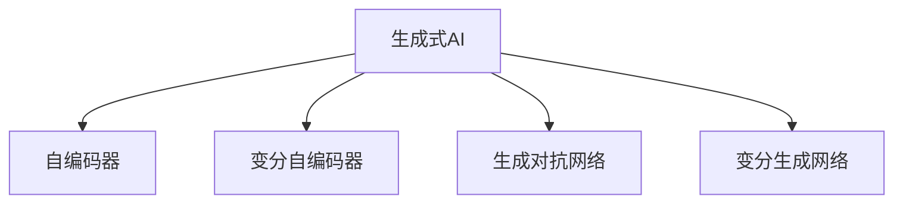

                 

# 全球范围内掀起生成式AI浪潮

## 1. 背景介绍

### 1.1 问题由来

近年来，随着深度学习技术的不断进步，生成式AI (Generative AI) 已经逐渐成为人工智能领域的一大热潮。生成式AI 能够生成高度逼真的图像、视频、音频、文本等内容，其应用领域已经从游戏、娱乐扩展到医疗、教育、金融等多个垂直领域。生成式AI 的广泛应用，正在带来一场深刻的数字化变革，改变了人们的生产、生活和工作方式。

### 1.2 问题核心关键点

生成式AI 的核心理论主要包括自编码器 (Autoencoder)、变分自编码器 (Variational Autoencoder)、生成对抗网络 (Generative Adversarial Network, GAN)、变分生成网络 (Variational Generative Network) 等。这些模型通过学习数据分布，能够在训练后生成新的、高质量的数据样本，从而在各个领域中发挥巨大的作用。

生成式AI 的主要应用包括但不限于：
- **图像生成**：如人脸生成、艺术创作、虚拟试衣等。
- **文本生成**：如自动生成新闻、小说、摘要等。
- **音频生成**：如音乐创作、语音合成、声学建模等。
- **视频生成**：如视频剪辑、动画制作、虚拟讲解等。

当前，生成式AI 技术正在被全球各地的企业和研究机构所关注，成为推动AI技术发展的重要力量。

### 1.3 问题研究意义

生成式AI 技术的兴起，对社会、经济、文化等多个方面带来了深远的影响：

1. **降低创意成本**：生成式AI 能够快速生成高质量的内容，降低了内容创作的难度和成本，促进了文化产业的发展。
2. **提升生产力**：生成式AI 在设计和生产领域的应用，大大提升了企业的生产效率和产品质量，减少了人工成本。
3. **增强用户体验**：生成式AI 在教育、娱乐、医疗等领域的创新应用，提高了用户体验，改变了人们的消费习惯。
4. **推动AI产业化**：生成式AI 技术的应用，加速了AI技术的商业化进程，为AI产业带来了新的增长点。

## 2. 核心概念与联系

### 2.1 核心概念概述

为了更好地理解生成式AI 技术的原理和应用，本节将介绍几个关键概念：

- **生成式AI**：指能够生成新数据样本的AI模型，包括自编码器、变分自编码器、GAN 等。
- **自编码器**：将输入数据压缩成一个低维编码，然后再解码回原数据，以学习数据的分布特征。
- **变分自编码器**：一种改进的自编码器，通过引入正态分布的隐变量，能够更好地学习数据的分布特征。
- **生成对抗网络**：由生成器和判别器组成的两玩家游戏，通过对抗训练，生成器能够生成逼真的样本，判别器能够区分生成样本和真实样本。
- **变分生成网络**：一种基于变分推理的生成模型，能够学习数据的隐变量分布，生成高质量的样本。

这些概念之间的逻辑关系可以通过以下 Mermaid 流程图来展示：



这个流程图展示了生成式AI 技术的核心组成和各个模型之间的关系。自编码器和变分自编码器都是基于密度估计的生成模型，而生成对抗网络和变分生成网络则是通过对抗训练和变分推理生成新样本的技术。

## 3. 核心算法原理 & 具体操作步骤

### 3.1 算法原理概述

生成式AI 的核心算法原理是通过学习数据分布，生成新的、逼真的数据样本。以下是几种常见的生成式AI 模型的算法原理概述：

#### 自编码器

自编码器的目标是将输入数据压缩成一个低维编码，然后再解码回原数据。其基本流程包括编码和解码两个步骤：
1. 编码：将输入数据 $x$ 映射到一个低维编码 $z$。
2. 解码：将低维编码 $z$ 映射回原数据 $x'$。

自编码器的损失函数通常为：
$$
\mathcal{L}(x, x') = \frac{1}{2} \|x - x'\|^2
$$
其中 $\|x - x'\|^2$ 表示原数据和解码后的数据之间的平方误差。

#### 变分自编码器

变分自编码器是自编码器的变体，通过引入隐变量的分布，进一步优化编码和解码过程。其基本流程包括：
1. 编码：将输入数据 $x$ 映射到一个隐变量 $z$ 的分布 $q(z|x)$。
2. 解码：通过隐变量的分布 $q(z|x)$ 采样出 $z$，再解码回原数据 $x'$。

变分自编码器的损失函数通常包括两部分：
1. 重构误差：$\mathcal{L}_r = \frac{1}{2} \|x - x'\|^2$
2. 变分误差：$\mathcal{L}_v = KL(q(z|x) || p(z))$

其中 $p(z)$ 是隐变量的先验分布，$q(z|x)$ 是隐变量的后验分布。

#### 生成对抗网络

生成对抗网络由生成器和判别器两个模型组成。生成器的目标是生成逼真的数据样本，判别器的目标是区分生成样本和真实样本。其基本流程包括：
1. 生成：生成器 $G$ 生成一个样本 $y$。
2. 判别：判别器 $D$ 判断 $y$ 是真实样本还是生成样本。

生成对抗网络的损失函数通常为：
$$
\mathcal{L}_{GAN} = \mathbb{E}_{x}[\log D(x)] + \mathbb{E}_{z}[\log(1 - D(G(z)))]
$$
其中 $\log D(x)$ 表示判别器对真实样本的判断，$\log(1 - D(G(z)))$ 表示判别器对生成样本的判断。

#### 变分生成网络

变分生成网络是一种基于变分推理的生成模型，通过学习隐变量的分布 $p(z)$，生成高质量的样本。其基本流程包括：
1. 编码：将输入数据 $x$ 映射到一个隐变量 $z$ 的分布 $q(z|x)$。
2. 解码：通过隐变量的分布 $q(z|x)$ 采样出 $z$，再解码回原数据 $x'$。

变分生成网络的损失函数通常包括两部分：
1. 重构误差：$\mathcal{L}_r = \frac{1}{2} \|x - x'\|^2$
2. 变分误差：$\mathcal{L}_v = KL(q(z|x) || p(z))$

其中 $p(z)$ 是隐变量的先验分布，$q(z|x)$ 是隐变量的后验分布。

### 3.2 算法步骤详解

生成式AI 算法的具体操作步骤包括：

#### 1. 数据准备

首先需要准备好训练数据集，将其划分为训练集、验证集和测试集。数据集需要包括输入数据和对应的标签，以供模型的训练和评估。

#### 2. 模型选择

根据具体任务的需求，选择合适的生成模型。常见的生成模型包括自编码器、变分自编码器、生成对抗网络、变分生成网络等。

#### 3. 模型构建

根据选择的生成模型，搭建相应的模型结构。自编码器和变分自编码器通常使用全连接神经网络或卷积神经网络，生成对抗网络和变分生成网络通常使用深度神经网络。

#### 4. 训练过程

在搭建好模型后，开始训练过程。训练过程中，模型会根据损失函数计算梯度，并使用优化算法更新模型参数。训练过程通常需要多次迭代，以优化模型的性能。

#### 5. 模型评估

在训练完成后，使用验证集和测试集对模型进行评估。评估过程中，需要使用适当的评估指标（如重建误差、生成质量等）对模型进行评估，以判断模型的性能。

#### 6. 模型应用

在评估完成后，将训练好的模型应用于实际任务中，生成高质量的数据样本。在实际应用中，可能需要对模型进行微调或调整，以适应特定的应用场景。

### 3.3 算法优缺点

生成式AI 算法具有以下优点：

- **数据生成能力强**：生成式AI 算法能够生成高质量的数据样本，广泛应用于图像、文本、音频等领域。
- **灵活性强**：生成式AI 算法可以适应多种应用场景，如游戏、娱乐、医疗、金融等。
- **技术成熟**：生成式AI 算法已经广泛应用于多个领域，技术成熟度较高。

同时，生成式AI 算法也存在一些缺点：

- **模型复杂度高**：生成式AI 算法通常需要使用深度神经网络，模型复杂度较高，训练和推理速度较慢。
- **数据依赖性强**：生成式AI 算法的性能依赖于训练数据的数量和质量，对数据的需求较大。
- **生成样本的质量参差不齐**：生成式AI 算法生成的样本质量受模型训练的影响，存在一定的随机性和不确定性。

### 3.4 算法应用领域

生成式AI 算法已经在多个领域中得到了广泛应用，以下是几个典型应用场景：

#### 图像生成

生成式AI 在图像生成领域的应用最为广泛。常见的应用包括：
- **人脸生成**：如Deepfakes、人脸表情生成等。
- **艺术创作**：如艺术风格的转换、卡通渲染等。
- **虚拟试衣**：如虚拟试衣镜、虚拟试妆等。

#### 文本生成

生成式AI 在文本生成领域的应用也在不断扩展。常见的应用包括：
- **自动生成新闻**：如自动化新闻报道、新闻摘要等。
- **自动生成小说**：如自动生成小说情节、自动生成角色对话等。
- **摘要生成**：如自动生成新闻摘要、自动生成文献摘要等。

#### 音频生成

生成式AI 在音频生成领域的应用也在不断扩展。常见的应用包括：
- **音乐创作**：如自动生成音乐作品、自动生成音乐节奏等。
- **语音合成**：如语音转换、语音翻译等。
- **声学建模**：如声学特征提取、语音识别等。

#### 视频生成

生成式AI 在视频生成领域的应用也在不断扩展。常见的应用包括：
- **视频剪辑**：如自动剪辑视频、自动添加特效等。
- **动画制作**：如自动生成动画角色、自动生成动画场景等。
- **虚拟讲解**：如虚拟讲解员、虚拟导游等。

## 4. 数学模型和公式 & 详细讲解  
### 4.1 数学模型构建

为了更好地理解生成式AI 算法的数学原理，本节将介绍几个关键数学模型。

#### 自编码器

自编码器的数学模型包括编码和解码两个部分：

- 编码：将输入数据 $x$ 映射到一个低维编码 $z$，其中 $z$ 为隐变量。
- 解码：将低维编码 $z$ 映射回原数据 $x'$。

自编码器的损失函数为：
$$
\mathcal{L}(x, x') = \frac{1}{2} \|x - x'\|^2
$$

#### 变分自编码器

变分自编码器的数学模型包括编码和解码两个部分：

- 编码：将输入数据 $x$ 映射到一个隐变量 $z$ 的分布 $q(z|x)$。
- 解码：通过隐变量的分布 $q(z|x)$ 采样出 $z$，再解码回原数据 $x'$。

变分自编码器的损失函数包括两部分：
1. 重构误差：$\mathcal{L}_r = \frac{1}{2} \|x - x'\|^2$
2. 变分误差：$\mathcal{L}_v = KL(q(z|x) || p(z))$

其中 $p(z)$ 是隐变量的先验分布，$q(z|x)$ 是隐变量的后验分布，$KL$ 是KL散度。

#### 生成对抗网络

生成对抗网络的数学模型包括生成和判别两个部分：

- 生成：生成器 $G$ 生成一个样本 $y$。
- 判别：判别器 $D$ 判断 $y$ 是真实样本还是生成样本。

生成对抗网络的损失函数为：
$$
\mathcal{L}_{GAN} = \mathbb{E}_{x}[\log D(x)] + \mathbb{E}_{z}[\log(1 - D(G(z)))]
$$

#### 变分生成网络

变分生成网络的数学模型包括编码和解码两个部分：

- 编码：将输入数据 $x$ 映射到一个隐变量 $z$ 的分布 $q(z|x)$。
- 解码：通过隐变量的分布 $q(z|x)$ 采样出 $z$，再解码回原数据 $x'$。

变分生成网络的损失函数包括两部分：
1. 重构误差：$\mathcal{L}_r = \frac{1}{2} \|x - x'\|^2$
2. 变分误差：$\mathcal{L}_v = KL(q(z|x) || p(z))$

其中 $p(z)$ 是隐变量的先验分布，$q(z|x)$ 是隐变量的后验分布，$KL$ 是KL散度。

### 4.2 公式推导过程

以下是几种生成式AI 算法的公式推导过程：

#### 自编码器

自编码器的目标是最小化重建误差：
$$
\min_{\theta} \mathbb{E}_{x}[\mathcal{L}(x, x')] = \min_{\theta} \mathbb{E}_{x}[\frac{1}{2} \|x - x'\|^2]
$$

其中 $\theta$ 表示自编码器的参数，$\mathbb{E}_{x}$ 表示对输入数据 $x$ 的期望。

自编码器的训练过程可以通过反向传播算法进行：
$$
\frac{\partial \mathcal{L}(x, x')}{\partial \theta} = \frac{\partial \frac{1}{2} \|x - x'\|^2}{\partial \theta}
$$

#### 变分自编码器

变分自编码器的目标是最小化重构误差和变分误差：
$$
\min_{\theta, \phi} \mathbb{E}_{x}[\mathcal{L}_r + \mathcal{L}_v]
$$

其中 $\theta$ 表示编码器的参数，$\phi$ 表示隐变量的参数，$\mathbb{E}_{x}$ 表示对输入数据 $x$ 的期望。

变分自编码器的训练过程可以通过最大化后验分布的对数：
$$
\min_{\theta, \phi} -\mathbb{E}_{x}[\mathcal{L}_r] + \mathbb{E}_{z}[\log q(z|x)] - \mathbb{E}_{z}[\log p(z)]
$$

#### 生成对抗网络

生成对抗网络的训练过程需要同时训练生成器和判别器。生成器的目标是最大化生成样本的质量，判别器的目标是最大化区分生成样本和真实样本的能力。

生成对抗网络的训练过程可以表示为：
$$
\min_G \max_D \mathcal{L}_{GAN}
$$

其中 $\min_G$ 表示生成器的最小化损失，$\max_D$ 表示判别器的最大化损失，$\mathcal{L}_{GAN}$ 表示生成对抗网络的损失函数。

#### 变分生成网络

变分生成网络的训练过程需要最大化隐变量的后验分布：
$$
\min_{\theta, \phi} -\mathbb{E}_{z}[\log q(z|x)] + \mathbb{E}_{z}[\log p(z)]
$$

其中 $\theta$ 表示编码器的参数，$\phi$ 表示隐变量的参数。

## 5. 项目实践：代码实例和详细解释说明

### 5.1 开发环境搭建

在进行生成式AI 项目的开发前，首先需要准备好开发环境。以下是使用Python进行PyTorch开发的简单环境配置流程：

1. 安装Anaconda：从官网下载并安装Anaconda，用于创建独立的Python环境。

2. 创建并激活虚拟环境：
```bash
conda create -n pytorch-env python=3.8 
conda activate pytorch-env
```

3. 安装PyTorch：根据CUDA版本，从官网获取对应的安装命令。例如：
```bash
conda install pytorch torchvision torchaudio cudatoolkit=11.1 -c pytorch -c conda-forge
```

4. 安装TensorFlow：
```bash
conda install tensorflow -c conda-forge
```

5. 安装TensorFlow的可视化工具TensorBoard：
```bash
conda install tensorboard
```

6. 安装生成式AI 工具库，如PyTorch的GAN和VAE等模型：
```bash
pip install torchvision torchaudio scipy matplotlib
```

完成上述步骤后，即可在`pytorch-env`环境中开始生成式AI 项目的开发。

### 5.2 源代码详细实现

以下是使用PyTorch进行生成对抗网络(GAN)的代码实现：

```python
import torch
import torch.nn as nn
import torch.optim as optim
import torchvision.datasets as dset
import torchvision.transforms as transforms
import torchvision.utils as vutils
from torch.utils.data import DataLoader

# 定义生成器
class Generator(nn.Module):
    def __init__(self):
        super(Generator, self).__init__()
        self.encoder = nn.Sequential(
            nn.Linear(100, 256),
            nn.LeakyReLU(0.2, inplace=True),
            nn.Linear(256, 512),
            nn.LeakyReLU(0.2, inplace=True),
            nn.Linear(512, 1024),
            nn.LeakyReLU(0.2, inplace=True),
            nn.Linear(1024, 784)
        )
        self.decoder = nn.Sequential(
            nn.Linear(784, 1024),
            nn.LeakyReLU(0.2, inplace=True),
            nn.Linear(1024, 512),
            nn.LeakyReLU(0.2, inplace=True),
            nn.Linear(512, 256),
            nn.LeakyReLU(0.2, inplace=True),
            nn.Tanh()
        )

    def forward(self, input):
        latent = self.encoder(input)
        fake = self.decoder(latent)
        return fake

# 定义判别器
class Discriminator(nn.Module):
    def __init__(self):
        super(Discriminator, self).__init__()
        self.encoder = nn.Sequential(
            nn.Linear(784, 1024),
            nn.LeakyReLU(0.2, inplace=True),
            nn.Linear(1024, 512),
            nn.LeakyReLU(0.2, inplace=True),
            nn.Linear(512, 256),
            nn.LeakyReLU(0.2, inplace=True),
            nn.Linear(256, 1),
            nn.Sigmoid()
        )

    def forward(self, input):
        real = self.encoder(input)
        fake = self.encoder(fake)
        return real, fake

# 定义损失函数
criterion = nn.BCELoss()

# 定义优化器
optimizer_G = optim.Adam(model_G.parameters(), lr=0.0002, betas=(0.5, 0.999))
optimizer_D = optim.Adam(model_D.parameters(), lr=0.0002, betas=(0.5, 0.999))

# 加载数据集
device = torch.device('cuda' if torch.cuda.is_available() else 'cpu')

# 数据预处理
transform = transforms.Compose([
    transforms.ToTensor(),
    transforms.Normalize((0.5, 0.5, 0.5), (0.5, 0.5, 0.5))
])

dataset = dset.CIFAR10(root='./data', download=True, transform=transform)
dataloader = DataLoader(dataset, batch_size=64, shuffle=True, num_workers=4)

# 训练过程
num_epochs = 200
for epoch in range(num_epochs):
    for i, (real, _) in enumerate(dataloader):
        real = real.to(device)
        b_size = real.size(0)

        # 生成样本
        z = torch.randn(b_size, 100).to(device)
        fake = model_G(z)

        # 训练判别器
        optimizer_D.zero_grad()
        real_label = torch.ones(b_size, 1).to(device)
        fake_label = torch.zeros(b_size, 1).to(device)
        output = model_D(real)
        output_fake = model_D(fake)
        err_D_real = criterion(output, real_label)
        err_D_fake = criterion(output_fake, fake_label)
        err_D = err_D_real + err_D_fake
        err_D.backward()
        optimizer_D.step()

        # 训练生成器
        optimizer_G.zero_grad()
        output_fake = model_D(fake)
        err_G = criterion(output_fake, real_label)
        err_G.backward()
        optimizer_G.step()

        if (i+1) % 100 == 0:
            print('Epoch [{}/{}], Step [{}/{}], err_D: {:.4f}, err_G: {:.4f}'
                  .format(epoch+1, num_epochs, i+1, len(dataloader), err_D.item(), err_G.item()))

# 生成样本
z = torch.randn(64, 100).to(device)
fake = model_G(z)
vutils.make_grid(fake, nrow=8, normalize=True, scale_each=True).save('./samples.png')
```

这个代码实现了使用PyTorch进行生成对抗网络的训练过程。可以看到，训练过程包括生成样本、训练判别器和训练生成器三个步骤，通过反向传播算法更新模型参数。

### 5.3 代码解读与分析

让我们再详细解读一下关键代码的实现细节：

**Generator类**：
- 定义生成器，包括编码器和解码器两个部分。
- 编码器：将输入的随机噪声映射到高维编码，再解码为图像。
- 解码器：将高维编码解码为图像。

**Discriminator类**：
- 定义判别器，包括编码器部分。
- 编码器：将输入的图像映射为真实标签的概率。

**criterion变量**：
- 定义损失函数，用于计算生成样本和真实样本的分类误差。

**optimizer变量**：
- 定义优化器，用于更新生成器和判别器的参数。

**dataloader变量**：
- 定义数据加载器，用于加载CIFAR-10数据集。

**训练过程**：
- 定义训练轮数和数据批次大小。
- 对于每个批次，计算生成样本和真实样本的判别器输出。
- 计算判别器的损失函数和生成器的损失函数，并通过反向传播更新模型参数。
- 每隔100步打印训练进度和损失函数值。

**生成样本**：
- 生成随机噪声，输入生成器生成图像。
- 将生成的图像保存到本地文件系统。

## 6. 实际应用场景

生成式AI 技术已经在多个领域中得到了广泛应用，以下是几个典型应用场景：

### 6.1 娱乐与游戏

生成式AI 在娱乐与游戏领域的应用最为广泛。常见的应用包括：
- **虚拟角色生成**：如虚拟角色扮演、虚拟游戏世界等。
- **虚拟场景生成**：如虚拟现实、增强现实等。
- **自动生成游戏内容**：如自动生成游戏关卡、自动生成游戏剧情等。

### 6.2 医疗

生成式AI 在医疗领域的应用也在不断扩展。常见的应用包括：
- **医学图像生成**：如自动生成医学影像、自动生成医学报告等。
- **疾病预测**：如自动生成疾病诊断报告、自动生成疾病预测模型等。
- **新药开发**：如自动生成分子结构、自动生成药物筛选模型等。

### 6.3 金融

生成式AI 在金融领域的应用也在不断扩展。常见的应用包括：
- **股市预测**：如自动生成股市走势、自动生成股市分析报告等。
- **风险评估**：如自动生成风险评估模型、自动生成风险报告等。
- **资产管理**：如自动生成投资组合、自动生成资产评估模型等。

### 6.4 教育

生成式AI 在教育领域的应用也在不断扩展。常见的应用包括：
- **智能辅导系统**：如自动生成学习材料、自动生成学习路径等。
- **虚拟教师**：如虚拟教师辅助教学、虚拟教师进行作业批改等。
- **个性化推荐**：如自动生成个性化推荐内容、自动生成个性化学习计划等。

### 6.5 新闻

生成式AI 在新闻领域的应用也在不断扩展。常见的应用包括：
- **新闻报道生成**：如自动生成新闻报道、自动生成新闻摘要等。
- **新闻推荐**：如自动生成新闻推荐内容、自动生成个性化新闻推荐等。
- **舆情分析**：如自动生成舆情分析报告、自动生成舆情预警系统等。

## 7. 工具和资源推荐

### 7.1 学习资源推荐

为了帮助开发者系统掌握生成式AI 的理论基础和实践技巧，这里推荐一些优质的学习资源：

1. **Deep Learning Specialization by Andrew Ng**：由斯坦福大学教授Andrew Ng讲授的深度学习课程，涵盖了从神经网络到生成式AI 的多个方向。

2. **Generative Adversarial Networks and Applications**：Lisa Girshick等人撰写的生成对抗网络综述，介绍了生成对抗网络的基本原理和应用。

3. **Generative Models with TensorFlow**：TensorFlow官方文档中的生成模型部分，详细介绍了如何使用TensorFlow实现生成式AI 模型。

4. **Generative Model Zoo**：Lars Bergkamp等人编写的生成模型总结，涵盖了多种生成模型的实现和应用。

5. **NIPS 2016 Tutorial: Generative Adversarial Networks**：由Ian Goodfellow等人讲授的生成对抗网络教程，详细介绍了生成对抗网络的基本原理和实现方法。

通过对这些资源的学习实践，相信你一定能够快速掌握生成式AI 的精髓，并用于解决实际的AI问题。

### 7.2 开发工具推荐

高效的开发离不开优秀的工具支持。以下是几款用于生成式AI 微调开发的常用工具：

1. **PyTorch**：基于Python的开源深度学习框架，灵活动态的计算图，适合快速迭代研究。

2. **TensorFlow**：由Google主导开发的开源深度学习框架，生产部署方便，适合大规模工程应用。

3. **Transformers库**：HuggingFace开发的NLP工具库，集成了多种生成式AI 模型，支持PyTorch和TensorFlow，是进行生成式AI 开发的重要工具。

4. **Keras**：由François Chollet开发的高级神经网络API，易于上手，适合快速原型开发。

5. **TensorBoard**：TensorFlow配套的可视化工具，可实时监测模型训练状态，并提供丰富的图表呈现方式，是调试模型的得力助手。

6. **Weights & Biases**：模型训练的实验跟踪工具，可以记录和可视化模型训练过程中的各项指标，方便对比和调优。

合理利用这些工具，可以显著提升生成式AI 微调任务的开发效率，加快创新迭代的步伐。

### 7.3 相关论文推荐

生成式AI 技术的不断发展离不开学界的持续研究。以下是几篇奠基性的相关论文，推荐阅读：

1. **Generative Adversarial Nets**：Ian Goodfellow等人提出的生成对抗网络，开创了生成式AI 的新篇章。

2. **Generative Adversarial Networks**：Ian Goodfellow等人撰写的生成对抗网络综述，详细介绍了生成对抗网络的基本原理和应用。

3. **Variational Autoencoders**：Kingma等人提出的变分自编码器，通过引入隐变量的分布，进一步优化了自编码器的性能。

4. **Unsupervised Representation Learning with Deep Convolutional Generative Adversarial Networks**：Dosovitskiy等人提出的卷积生成对抗网络，将生成对抗网络应用于图像生成任务，取得了很好的效果。

5. **Training GANs with Limited Data**：Salimans等人提出的数据增强生成对抗网络，通过数据增强技术解决了生成对抗网络在小数据集上训练的问题。

这些论文代表了大生成式AI 技术的发展脉络。通过学习这些前沿成果，可以帮助研究者把握学科前进方向，激发更多的创新灵感。

## 8. 总结：未来发展趋势与挑战

### 8.1 总结

本文对生成式AI 技术进行了全面系统的介绍。首先阐述了生成式AI 技术的兴起背景和研究意义，明确了生成式AI 在各个领域的应用前景。其次，从原理到实践，详细讲解了生成式AI 的数学原理和关键步骤，给出了生成式AI 任务开发的完整代码实例。同时，本文还广泛探讨了生成式AI 技术在娱乐、医疗、金融、教育等多个领域的应用前景，展示了生成式AI 技术的巨大潜力。

通过本文的系统梳理，可以看到，生成式AI 技术正在成为AI技术发展的重要方向，极大地拓展了AI技术的应用边界，催生了更多的落地场景。未来，伴随生成式AI 技术的不断发展，其在多个领域的创新应用必将不断涌现，为经济社会发展注入新的动力。

### 8.2 未来发展趋势

展望未来，生成式AI 技术将呈现以下几个发展趋势：

1. **模型规模持续增大**：随着算力成本的下降和数据规模的扩张，生成式AI 模型的参数量还将持续增长。超大模型将能够生成更高质量、更逼真的数据样本，应用于更多复杂的任务。

2. **训练过程不断优化**：生成式AI 模型的训练过程将不断优化，引入更高效的优化算法、更丰富的正则化技术、更灵活的模型结构，进一步提升模型的生成质量。

3. **应用领域不断拓展**：生成式AI 技术将在更多领域得到应用，如智慧医疗、智能教育、金融预测、工业制造等，为各行业带来颠覆性的变革。

4. **跨模态生成技术**：生成式AI 技术将不再局限于单一模态，跨模态生成技术将逐步成熟，能够生成图像、视频、音频、文本等多模态数据的融合样本，提供更加全面的应用解决方案。

5. **生成式模型融合**：生成式AI 技术将与自然语言处理、机器视觉、增强现实等技术进行深度融合，实现多模态交互式智能系统，提升用户体验和应用效果。

6. **生成式AI 伦理规范**：生成式AI 技术的发展将带来伦理规范、数据隐私、版权保护等方面的挑战，未来将制定更加严格的伦理规范，保障AI技术的安全可控。

### 8.3 面临的挑战

尽管生成式AI 技术已经取得了显著成果，但在迈向更加智能化、普适化应用的过程中，它仍面临着诸多挑战：

1. **数据依赖性强**：生成式AI 技术需要大量高质量的数据进行训练，数据需求量大、获取成本高。如何在数据匮乏的情况下提升生成模型的性能，仍然是一个亟待解决的问题。

2. **生成样本的质量参差不齐**：生成式AI 技术生成的样本质量受模型训练的影响，存在一定的随机性和不确定性。如何生成更加逼真、多样化的样本，仍然是一个技术难题。

3. **生成样本的伦理问题**：生成式AI 技术生成的样本可能包含虚假信息、偏见、歧视等内容，如何避免伦理问题的出现，仍然是一个挑战。

4. **生成模型的高资源消耗**：生成式AI 模型的训练和推理过程对硬件资源的需求较大，如何降低资源消耗，提升模型的计算效率，仍然是一个挑战。

5. **生成模型的解释性不足**：生成式AI 模型通常被视为“黑盒”系统，如何提高生成模型的可解释性，仍然是一个技术难题。

6. **生成模型的安全性**：生成式AI 模型可能被用于生成虚假内容、恶意代码等，如何提高生成模型的安全性，仍然是一个挑战。

### 8.4 研究展望

面对生成式AI 技术所面临的种种挑战，未来的研究需要在以下几个方面寻求新的突破：

1. **数据增强技术**：通过数据增强技术，提高生成式AI 模型在数据匮乏情况下的性能。

2. **跨模态生成技术**：开发跨模态生成技术，生成更加逼真、多样化的多模态数据样本。

3. **生成模型的解释性**：引入生成模型的解释性技术，提高生成模型的可解释性。

4. **生成模型的安全性**：开发生成模型的安全性技术，提高生成模型的鲁棒性和安全性。

5. **生成模型的伦理规范**：制定生成模型的伦理规范，保障生成模型的伦理安全。

这些研究方向的探索，必将引领生成式AI 技术迈向更高的台阶，为构建安全、可靠、可解释、可控的智能系统铺平道路。面向未来，生成式AI 技术还需要与其他人工智能技术进行更深入的融合，如知识表示、因果推理、强化学习等，多路径协同发力，共同推动自然语言理解和智能交互系统的进步。只有勇于创新、敢于突破，才能不断拓展生成式AI 技术的边界，让智能技术更好地造福人类社会。

## 9. 附录：常见问题与解答

**Q1：生成式AI 技术有哪些应用场景？**

A: 生成式AI 技术已经在多个领域中得到了广泛应用，包括但不限于娱乐、医疗、金融、教育、新闻等。常见的应用场景包括虚拟角色生成、医学图像生成、股市预测、智能辅导系统等。

**Q2：生成式AI 技术需要多少数据进行训练？**

A: 生成式AI 技术需要大量高质量的数据进行训练。具体数据需求量取决于模型的复杂度和应用场景。例如，生成对抗网络需要数百万甚至上亿的数据进行训练，以生成高质量的图像样本。

**Q3：生成式AI 技术的训练过程有哪些关键步骤？**

A: 生成式AI 技术的训练过程包括数据准备、模型选择、模型构建、训练过程、模型评估、模型应用等关键步骤。每个步骤都需要精心设计和优化，以确保生成式AI 模型能够达到理想的性能。

**Q4：生成式AI 技术的应用效果如何？**

A: 生成式AI 技术的应用效果显著。例如，生成对抗网络已经广泛应用于图像生成、视频生成等任务，生成效果逼真、多样性强。变分自编码器在图像生成、音频生成等领域也取得了不错的效果。

**Q5：生成式AI 技术的未来发展方向是什么？**

A: 生成式AI 技术的未来发展方向包括模型规模的持续增大、训练过程的不断优化、应用领域的不断拓展、跨模态生成技术的开发、生成模型与其他技术的深度融合等。同时，生成式AI 技术还需要解决数据依赖性强、生成样本质量参差不齐、伦理问题、资源消耗高等挑战。

通过本文的系统梳理，可以看到，生成式AI 技术正在成为AI技术发展的重要方向，极大地拓展了AI技术的应用边界，催生了更多的落地场景。未来，伴随生成式AI 技术的不断发展，其在各个领域的应用必将不断涌现，为经济社会发展注入新的动力。

